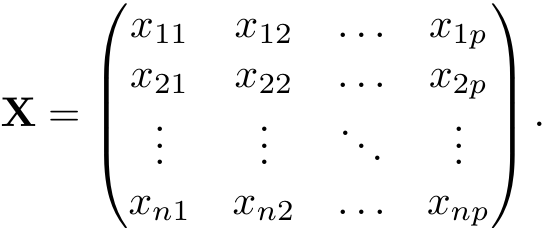
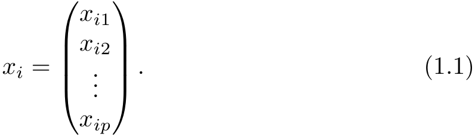
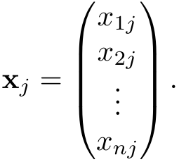
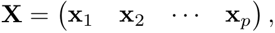
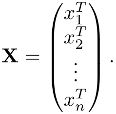
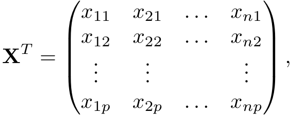
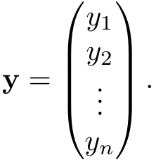
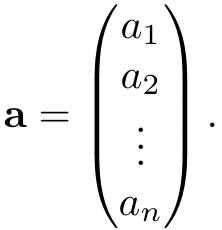
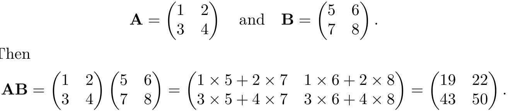

1 

# Introduction 

## An Overview of Statistical Learning 

_Statistical learning_ refers to a vast set of tools for _understanding data_ . These tools can be classified as _supervised_ or _unsupervised_ . Broadly speaking, supervised statistical learning involves building a statistical model for predicting, or estimating, an _output_ based on one or more _inputs_ . Problems of this nature occur in fields as diverse as business, medicine, astrophysics, and public policy. With unsupervised statistical learning, there are inputs but no supervising output; nevertheless we can learn relationships and structure from such data. To provide an illustration of some applications of statistical learning, we briefly discuss three real-world data sets that are considered in this book. 

### _Wage Data_ 

In this application (which we refer to as the `Wage` data set throughout this book), we examine a number of factors that relate to wages for a group of men from the Atlantic region of the United States. In particular, we wish to understand the association between an employee’s `age` and `education` , as well as the calendar `year` , on his `wage` . Consider, for example, the left-hand panel of Figure 1.1, which displays `wage` versus `age` for each of the individuals in the data set. There is evidence that `wage` increases with `age` but then decreases again after approximately age 60. The blue line, which provides an estimate of the average `wage` for a given `age` , makes this trend clearer. 

2 1. Introduction 


<!-- Start of picture text -->
20 40 60 80 2003 2006 2009 1 2 3 4 5<br>Age Year Education Level<br>300 300 300<br>200 200 200<br>Wage Wage Wage<br>100 100 100<br>50 50 50<br><!-- End of picture text -->

**FIGURE 1.1.** `Wage` _data, which contains income survey information for men from the central Atlantic region of the United States._ Left: `wage` _as a function of_ `age` _. On average,_ `wage` _increases with_ `age` _until about_ 60 _years of age, at which point it begins to decline._ Center: `wage` _as a function of_ `year` _. There is a slow but steady increase of approximately_ $10 _,_ 000 _in the average_ `wage` _between_ 2003 _and_ 2009 _._ Right: _Boxplots displaying_ `wage` _as a function of_ `education` _, with_ 1 _indicating the lowest level (no high school diploma) and_ 5 _the highest level (an advanced graduate degree). On average,_ `wage` _increases with the level of education._ 

Given an employee’s `age` , we can use this curve to _predict_ his `wage` . However, it is also clear from Figure 1.1 that there is a significant amount of variability associated with this average value, and so `age` alone is unlikely to provide an accurate prediction of a particular man’s `wage` . 

We also have information regarding each employee’s education level and the `year` in which the `wage` was earned. The center and right-hand panels of Figure 1.1, which display `wage` as a function of both `year` and `education` , indicate that both of these factors are associated with `wage` . Wages increase by approximately $10 _,_ 000, in a roughly linear (or straight-line) fashion, between 2003 and 2009, though this rise is very slight relative to the variability in the data. Wages are also typically greater for individuals with higher education levels: men with the lowest education level (1) tend to have substantially lower wages than those with the highest education level (5). Clearly, the most accurate prediction of a given man’s `wage` will be obtained by combining his `age` , his `education` , and the `year` . In Chapter 3, we discuss linear regression, which can be used to predict `wage` from this data set. Ideally, we should predict `wage` in a way that accounts for the non-linear relationship between `wage` and `age` . In Chapter 7, we discuss a class of approaches for addressing this problem. 

1. Introduction 3 


<!-- Start of picture text -->
Yesterday Two Days Previous Three Days Previous<br>Down Up Down Up Down Up<br>Today’s Direction Today’s Direction Today’s Direction<br>6 6 6<br>4 4 4<br>2 2 2<br>0 0 0<br>−2 −2 −2<br>Percentage change in S&P Percentage change in S&P Percentage change in S&P<br>−4 −4 −4<br><!-- End of picture text -->

**FIGURE 1.2.** Left: _Boxplots of the previous day’s percentage change in the S&P index for the days for which the market increased or decreased, obtained from the_ `Smarket` _data._ Center and Right: _Same as left panel, but the percentage changes for 2 and 3 days previous are shown._ 

### _Stock Market Data_ 

The `Wage` data involves predicting a _continuous_ or _quantitative_ output value. This is often referred to as a _regression_ problem. However, in certain cases we may instead wish to predict a non-numerical value—that is, a _categorical_ or _qualitative_ output. For example, in Chapter 4 we examine a stock market data set that contains the daily movements in the Standard & Poor’s 500 (S&P) stock index over a 5-year period between 2001 and 2005. We refer to this as the `Smarket` data. The goal is to predict whether the index will _increase_ or _decrease_ on a given day, using the past 5 days’ percentage changes in the index. Here the statistical learning problem does not involve predicting a numerical value. Instead it involves predicting whether a given day’s stock market performance will fall into the `Up` bucket or the `Down` bucket. This is known as a _classification_ problem. A model that could accurately predict the direction in which the market will move would be very useful! 

The left-hand panel of Figure 1.2 displays two boxplots of the previous day’s percentage changes in the stock index: one for the 648 days for which the market increased on the subsequent day, and one for the 602 days for which the market decreased. The two plots look almost identical, suggesting that there is no simple strategy for using yesterday’s movement in the S&P to predict today’s returns. The remaining panels, which display boxplots for the percentage changes 2 and 3 days previous to today, similarly indicate little association between past and present returns. Of course, this lack of pattern is to be expected: in the presence of strong correlations between successive days’ returns, one could adopt a simple trading strategy 

4 1. Introduction 


<!-- Start of picture text -->
Down Up<br>Today’s Direction<br>0.52<br>0.50<br>0.48<br>Predicted Probability<br>0.46<br><!-- End of picture text -->

**FIGURE 1.3.** _We fit a quadratic discriminant analysis model to the subset of the_ `Smarket` _data corresponding to the 2001–2004 time period, and predicted the probability of a stock market decrease using the 2005 data. On average, the predicted probability of decrease is higher for the days in which the market does decrease. Based on these results, we are able to correctly predict the direction of movement in the market 60% of the time._ 

to generate profits from the market. Nevertheless, in Chapter 4, we explore these data using several different statistical learning methods. Interestingly, there are hints of some weak trends in the data that suggest that, at least for this 5-year period, it is possible to correctly predict the direction of movement in the market approximately 60% of the time (Figure 1.3). 

### _Gene Expression Data_ 

The previous two applications illustrate data sets with both input and output variables. However, another important class of problems involves situations in which we only observe input variables, with no corresponding output. For example, in a marketing setting, we might have demographic information for a number of current or potential customers. We may wish to understand which types of customers are similar to each other by grouping individuals according to their observed characteristics. This is known as a _clustering_ problem. Unlike in the previous examples, here we are not trying to predict an output variable. 

We devote Chapter 12 to a discussion of statistical learning methods for problems in which no natural output variable is available. We consider the `NCI60` data set, which consists of 6 _,_ 830 gene expression measurements for each of 64 cancer cell lines. Instead of predicting a particular output variable, we are interested in determining whether there are groups, or clusters, among the cell lines based on their gene expression measurements. This is a difficult question to address, in part because there are thousands of gene expression measurements per cell line, making it hard to visualize the data. 

1. Introduction 5 


<!-- Start of picture text -->
−40 −20 0 20 40 60 −40 −20 0 20 40 60<br>Z1 Z1<br>20 20<br>0 0<br>2 2<br>Z −20 Z −20<br>−40 −40<br>−60 −60<br><!-- End of picture text -->

**FIGURE 1.4.** Left: _Representation of the_ `NCI60` _gene expression data set in a two-dimensional space, Z_ 1 _and Z_ 2 _. Each point corresponds to one of the_ 64 _cell lines. There appear to be four groups of cell lines, which we have represented using different colors._ Right: _Same as left panel except that we have represented each of the_ 14 _different types of cancer using a different colored symbol. Cell lines corresponding to the same cancer type tend to be nearby in the two-dimensional space._ 

The left-hand panel of Figure 1.4 addresses this problem by representing each of the 64 cell lines using just two numbers, _Z_ 1 and _Z_ 2. These are the first two _principal components_ of the data, which summarize the 6 _,_ 830 expression measurements for each cell line down to two numbers or _dimensions_ . While it is likely that this dimension reduction has resulted in some loss of information, it is now possible to visually examine the data for evidence of clustering. Deciding on the number of clusters is often a difficult problem. But the left-hand panel of Figure 1.4 suggests at least four groups of cell lines, which we have represented using separate colors. 

In this particular data set, it turns out that the cell lines correspond to 14 different types of cancer. (However, this information was not used to create the left-hand panel of Figure 1.4.) The right-hand panel of Figure 1.4 is identical to the left-hand panel, except that the 14 cancer types are shown using distinct colored symbols. There is clear evidence that cell lines with the same cancer type tend to be located near each other in this two-dimensional representation. In addition, even though the cancer information was not used to produce the left-hand panel, the clustering obtained does bear some resemblance to some of the actual cancer types observed in the right-hand panel. This provides some independent verification of the accuracy of our clustering analysis. 

6 1. Introduction 

## A Brief History of Statistical Learning 

Though the term _statistical learning_ is fairly new, many of the concepts that underlie the field were developed long ago. At the beginning of the nineteenth century, the method of _least squares_ was developed, implementing the earliest form of what is now known as _linear regression_ . The approach was first successfully applied to problems in astronomy. Linear regression is used for predicting quantitative values, such as an individual’s salary. In order to predict qualitative values, such as whether a patient survives or dies, or whether the stock market increases or decreases, _linear discriminant analysis_ was proposed in 1936. In the 1940s, various authors put forth an alternative approach, _logistic regression_ . In the early 1970s, the term _generalized linear model_ was developed to describe an entire class of statistical learning methods that include both linear and logistic regression as special cases. 

By the end of the 1970s, many more techniques for learning from data were available. However, they were almost exclusively _linear_ methods because fitting _non-linear_ relationships was computationally difficult at the time. By the 1980s, computing technology had finally improved sufficiently that non-linear methods were no longer computationally prohibitive. In the mid 1980s, _classification and regression trees_ were developed, followed shortly by _generalized additive models_ . _Neural networks_ gained popularity in the 1980s, and _support vector machines_ arose in the 1990s. 

Since that time, statistical learning has emerged as a new subfield in statistics, focused on supervised and unsupervised modeling and prediction. In recent years, progress in statistical learning has been marked by the increasing availability of powerful and relatively user-friendly software, such as the popular and freely available `R` system. This has the potential to continue the transformation of the field from a set of techniques used and developed by statisticians and computer scientists to an essential toolkit for a much broader community. 

## This Book 

_The Elements of Statistical Learning_ (ESL) by Hastie, Tibshirani, and Friedman was first published in 2001. Since that time, it has become an important reference on the fundamentals of statistical machine learning. Its success derives from its comprehensive and detailed treatment of many important topics in statistical learning, as well as the fact that (relative to many upper-level statistics textbooks) it is accessible to a wide audience. However, the greatest factor behind the success of ESL has been its topical nature. At the time of its publication, interest in the field of statistical 

1. Introduction 7 

learning was starting to explode. ESL provided one of the first accessible and comprehensive introductions to the topic. 

Since ESL was first published, the field of statistical learning has continued to flourish. The field’s expansion has taken two forms. The most obvious growth has involved the development of new and improved statistical learning approaches aimed at answering a range of scientific questions across a number of fields. However, the field of statistical learning has also expanded its audience. In the 1990s, increases in computational power generated a surge of interest in the field from non-statisticians who were eager to use cutting-edge statistical tools to analyze their data. Unfortunately, the highly technical nature of these approaches meant that the user community remained primarily restricted to experts in statistics, computer science, and related fields with the training (and time) to understand and implement them. 

In recent years, new and improved software packages have significantly eased the implementation burden for many statistical learning methods. At the same time, there has been growing recognition across a number of fields, from business to health care to genetics to the social sciences and beyond, that statistical learning is a powerful tool with important practical applications. As a result, the field has moved from one of primarily academic interest to a mainstream discipline, with an enormous potential audience. This trend will surely continue with the increasing availability of enormous quantities of data and the software to analyze it. 

The purpose of _An Introduction to Statistical Learning_ (ISL) is to facilitate the transition of statistical learning from an academic to a mainstream field. ISL is not intended to replace ESL, which is a far more comprehensive text both in terms of the number of approaches considered and the depth to which they are explored. We consider ESL to be an important companion for professionals (with graduate degrees in statistics, machine learning, or related fields) who need to understand the technical details behind statistical learning approaches. However, the community of users of statistical learning techniques has expanded to include individuals with a wider range of interests and backgrounds. Therefore, there is a place for a less technical and more accessible version of ESL. 

In teaching these topics over the years, we have discovered that they are of interest to master’s and PhD students in fields as disparate as business administration, biology, and computer science, as well as to quantitativelyoriented upper-division undergraduates. It is important for this diverse group to be able to understand the models, intuitions, and strengths and weaknesses of the various approaches. But for this audience, many of the technical details behind statistical learning methods, such as optimization algorithms and theoretical properties, are not of primary interest. We believe that these students do not need a deep understanding of these aspects in order to become informed users of the various methodologies, and 

#### 8 1. Introduction 

in order to contribute to their chosen fields through the use of statistical learning tools. 

ISL is based on the following four premises. 

1. _Many statistical learning methods are relevant and useful in a wide range of academic and non-academic disciplines, beyond just the statistical sciences._ We believe that many contemporary statistical learning procedures should, and will, become as widely available and used as is currently the case for classical methods such as linear regression. As a result, rather than attempting to consider every possible approach (an impossible task), we have concentrated on presenting the methods that we believe are most widely applicable. 

2. _Statistical learning should not be viewed as a series of black boxes._ No single approach will perform well in all possible applications. Without understanding all of the cogs inside the box, or the interaction between those cogs, it is impossible to select the best box. Hence, we have attempted to carefully describe the model, intuition, assumptions, and trade-offs behind each of the methods that we consider. 

3. _While it is important to know what job is performed by each cog, it is not necessary to have the skills to construct the machine inside the box!_ Thus, we have minimized discussion of technical details related to fitting procedures and theoretical properties. We assume that the reader is comfortable with basic mathematical concepts, but we do not assume a graduate degree in the mathematical sciences. For instance, we have almost completely avoided the use of matrix algebra, and it is possible to understand the entire book without a detailed knowledge of matrices and vectors. 

4. _We presume that the reader is interested in applying statistical learning methods to real-world problems._ In order to facilitate this, as well as to motivate the techniques discussed, we have devoted a section within each chapter to computer labs. In each lab, we walk the reader through a realistic application of the methods considered in that chapter. When we have taught this material in our courses, we have allocated roughly one-third of classroom time to working through the labs, and we have found them to be extremely useful. Many of the less computationally-oriented students who were initially intimidated by the labs got the hang of things over the course of the quarter or semester. We have used `R` because it is freely available and is powerful enough to implement all of the methods discussed in the book. It also has optional packages that can be downloaded to implement literally thousands of additional methods. Most importantly, `R` is the language of choice for academic statisticians, and new approaches often become available in `R` years before they are implemented in commercial packages. However, the labs in ISL are self-contained, and can be skipped 

1. Introduction 9 

if the reader wishes to use a different software package or does not wish to apply the methods discussed to real-world problems. 

## Who Should Read This Book? 

This book is intended for anyone who is interested in using modern statistical methods for modeling and prediction from data. This group includes scientists, engineers, data analysts, data scientists, and quants, but also less technical individuals with degrees in non-quantitative fields such as the social sciences or business. We expect that the reader will have had at least one elementary course in statistics. Background in linear regression is also useful, though not required, since we review the key concepts behind linear regression in Chapter 3. The mathematical level of this book is modest, and a detailed knowledge of matrix operations is not required. This book provides an introduction to the statistical programming language `R` . Previous exposure to a programming language, such as `MATLAB` or `Python` , is useful but not required. 

The first edition of this textbook has been used to teach master’s and PhD students in business, economics, computer science, biology, earth sciences, psychology, and many other areas of the physical and social sciences. It has also been used to teach advanced undergraduates who have already taken a course on linear regression. In the context of a more mathematically rigorous course in which ESL serves as the primary textbook, ISL could be used as a supplementary text for teaching computational aspects of the various approaches. 

## Notation and Simple Matrix Algebra 

Choosing notation for a textbook is always a difficult task. For the most part we adopt the same notational conventions as ESL. 

We will use _n_ to represent the number of distinct data points, or observations, in our sample. We will let _p_ denote the number of variables that are available for use in making predictions. For example, the `Wage` data set consists of 11 variables for 3 _,_ 000 people, so we have _n_ = 3 _,_ 000 observations and _p_ = 11 variables (such as `year` , `age` , `race` , and more). Note that throughout this book, we indicate variable names using colored font: `Variable Name` . 

In some examples, _p_ might be quite large, such as on the order of thousands or even millions; this situation arises quite often, for example, in the analysis of modern biological data or web-based advertising data. 

In general, we will let _xij_ represent the value of the _j_ th variable for the _i_ th observation, where _i_ = 1 _,_ 2 _, . . . , n_ and _j_ = 1 _,_ 2 _, . . . , p_ . Throughout this book, _i_ will be used to index the samples or observations (from 1 to _n_ ) and 

10 1. Introduction 

_j_ will be used to index the variables (from 1 to _p_ ). We let **X** denote an _n × p_ matrix whose ( _i, j_ )th element is _xij_ . That is, 





For readers who are unfamiliar with matrices, it is useful to visualize **X** as a spreadsheet of numbers with _n_ rows and _p_ columns. 

At times we will be interested in the rows of **X** , which we write as _x_ 1 _, x_ 2 _, . . . , xn_ . Here _xi_ is a vector of length _p_ , containing the _p_ variable measurements for the _i_ th observation. That is, 





(Vectors are by default represented as columns.) For example, for the `Wage` data, _xi_ is a vector of length 11, consisting of `year` , `age` , `race` , and other values for the _i_ th individual. At other times we will instead be interested in the columns of **X** , which we write as **x** 1 _,_ **x** 2 _, . . . ,_ **x** _p_ . Each is a vector of length _n_ . That is, 





For example, for the `Wage` data, **x** 1 contains the _n_ = 3 _,_ 000 values for `year` . Using this notation, the matrix **X** can be written as 





or 





The<sup>_T_</sup> notation denotes the _transpose_ of a matrix or vector. So, for example, 





1. Introduction 11 

while 

_x_<sup>_T_</sup> _i_<sup>=</sup> � _xi_ 1 _xi_ 2 _· · · xip_ � _._ 

We use _yi_ to denote the _i_ th observation of the variable on which we wish to make predictions, such as `wage` . Hence, we write the set of all _n_ observations in vector form as 





Then our observed data consists of _{_ ( _x_ 1 _, y_ 1) _,_ ( _x_ 2 _, y_ 2) _, . . . ,_ ( _xn, yn_ ) _}_ , where each _xi_ is a vector of length _p_ . (If _p_ = 1, then _xi_ is simply a scalar.) In this text, a vector of length _n_ will always be denoted in _lower case bold_ ; e.g. 





However, vectors that are not of length _n_ (such as feature vectors of length _p_ , as in (1.1)) will be denoted in _lower case normal font_ , e.g. _a_ . Scalars will also be denoted in _lower case normal font_ , e.g. _a_ . In the rare cases in which these two uses for lower case normal font lead to ambiguity, we will clarify which use is intended. Matrices will be denoted using _bold capitals_ , such as **A** . Random variables will be denoted using _capital normal font_ , e.g. _A_ , regardless of their dimensions. 

Occasionally we will want to indicate the dimension of a particular object. To indicate that an object is a scalar, we will use the notation _a ∈_ R. To indicate that it is a vector of length _k_ , we will use _a ∈_ R<sup>_k_</sup> (or **a** _∈_ R<sup>_n_</sup> if it is of length _n_ ). We will indicate that an object is an _r × s_ matrix using **A** _∈_ R<sup>_r×s_</sup> . 

We have avoided using matrix algebra whenever possible. However, in a few instances it becomes too cumbersome to avoid it entirely. In these rare instances it is important to understand the concept of multiplying two matrices. Suppose that **A** _∈_ R<sup>_r×d_</sup> and **B** _∈_ R<sup>_d×s_</sup> . Then the product of **A** and **B** is denoted **AB** . The ( _i, j_ )th element of **AB** is computed by multiplying each element of the _i_ th row of **A** by the corresponding element of the _j_ th column of **B** . That is, ( **AB** ) _ij_ =<sup>�</sup><sup>_d_</sup> _k_ =1<sup>_aikbkj_.Asanexample,</sup> consider 





Then 

12 1. Introduction 

Note that this operation produces an _r × s_ matrix. It is only possible to compute **AB** if the number of columns of **A** is the same as the number of rows of **B** . 

## Organization of This Book 

Chapter 2 introduces the basic terminology and concepts behind statistical learning. This chapter also presents the _K-nearest neighbor_ classifier, a very simple method that works surprisingly well on many problems. Chapters 3 and 4 cover classical linear methods for regression and classification. In particular, Chapter 3 reviews _linear regression_ , the fundamental starting point for all regression methods. In Chapter 4 we discuss two of the most important classical classification methods, _logistic regression_ and _linear discriminant analysis_ . 

A central problem in all statistical learning situations involves choosing the best method for a given application. Hence, in Chapter 5 we introduce _cross-validation_ and the _bootstrap_ , which can be used to estimate the accuracy of a number of different methods in order to choose the best one. 

Much of the recent research in statistical learning has concentrated on non-linear methods. However, linear methods often have advantages over their non-linear competitors in terms of interpretability and sometimes also accuracy. Hence, in Chapter 6 we consider a host of linear methods, both classical and more modern, which offer potential improvements over standard linear regression. These include _stepwise selection_ , _ridge regression_ , _principal components regression_ , and the _lasso_ . 

The remaining chapters move into the world of non-linear statistical learning. We first introduce in Chapter 7 a number of non-linear methods that work well for problems with a single input variable. We then show how these methods can be used to fit non-linear _additive_ models for which there is more than one input. In Chapter 8, we investigate _tree_ -based methods, including _bagging_ , _boosting_ , and _random forests_ . _Support vector machines_ , a set of approaches for performing both linear and non-linear classification, are discussed in Chapter 9. We cover _deep learning_ , an approach for non-linear regression and classification that has received a lot of attention in recent years, in Chapter 10. Chapter 11 explores _survival analysis_ , a regression approach that is specialized to the setting in which the output variable is _censored_ , i.e. not fully observed. 

In Chapter 12, we consider the _unsupervised_ setting in which we have input variables but no output variable. In particular, we present _principal components analysis_ , _K-means clustering_ , and _hierarchical clustering_ . Finally, in Chapter 13 we cover the very important topic of multiple hypothesis testing. 

1. Introduction 13 

At the end of each chapter, we present one or more `R` lab sections in which we systematically work through applications of the various methods discussed in that chapter. These labs demonstrate the strengths and weaknesses of the various approaches, and also provide a useful reference for the syntax required to implement the various methods. The reader may choose to work through the labs at their own pace, or the labs may be the focus of group sessions as part of a classroom environment. Within each `R` lab, we present the results that we obtained when we performed the lab at the time of writing this book. However, new versions of `R` are continuously released, and over time, the packages called in the labs will be updated. Therefore, in the future, it is possible that the results shown in the lab sections may no longer correspond precisely to the results obtained by the reader who performs the labs. As necessary, we will post updates to the labs on the book website. 


We use the symbol to denote sections or exercises that contain more challenging concepts. These can be easily skipped by readers who do not wish to delve as deeply into the material, or who lack the mathematical background. 

## Data Sets Used in Labs and Exercises 

In this textbook, we illustrate statistical learning methods using applications from marketing, finance, biology, and other areas. The `ISLR2` package available on the book website and CRAN contains a number of data sets that are required in order to perform the labs and exercises associated with this book. One other data set is part of the base `R` distribution. Table 1.1 contains a summary of the data sets required to perform the labs and exercises. A couple of these data sets are also available as text files on the book website, for use in Chapter 2. 

14 1. Introduction 

|Name|Description|
|---|---|
|`Auto`|Gas mileage, horsepower, and other information for cars.|
|`Bikeshare`|Hourly usage of a bike sharing program in Washington, DC.|
|`Boston`|Housing values and other information about Boston census tracts.|
|`BrainCancer`|Survival times for patients diagnosed with brain cancer.<br>|
|`Caravan`|Information about individuals ofered caravan insurance.|
|`Carseats`|Information about car seat sales in 400 stores.|
|`College`|Demographic characteristics, tuition, and more for USA colleges.|
|`Credit`|Information about credit card debt for 400 customers.|
|`Default`|Customer default records for a credit card company.|
|`Fund`|Returns of 2,000 hedge fund managers over 50 months.|
|`Hitters`|Records and salaries for baseball players.|
|`Khan`|Gene expression measurements for four cancer types.|
|`NCI60`|Gene expression measurements for 64 cancer cell lines.|
|`NYSE`|Returns, volatility, and volume for the New York Stock Exchange.|
|`OJ`|Sales information for Citrus Hill and Minute Maid orange juice.<br>|
|`Portfolio`|Past values of fnancial assets, for use in portfolio allocation.|
|`Publication`|Time to publication for 244 clinical trials.|
|`Smarket`|Daily percentage returns for S&P 500 over a 5-year period.|
|`USArrests`|Crime statistics per 100,000 residents in 50 states of USA.|
|`Wage`<br>`Weekly`|Income survey data for men in central Atlantic region of USA.<br>1,089 weekly stock market returns for 21 years.|


**TABLE 1.1.** _A list of data sets needed to perform the labs and exercises in this textbook. All data sets are available in the_ `ISLR2` _library, with the exception of_ `USArrests` _, which is part of the base_ `R` _distribution, but accessible from_ `Python` . 

## Book Website 

The website for this book is located at 

```
www.statlearning.com
```

It contains a number of resources, including the `R` package associated with this book, and some additional data sets. 

## Acknowledgements 

A few of the plots in this book were taken from ESL: Figures 6.7, 8.3, and 12.14. All other plots are new to this book. 

