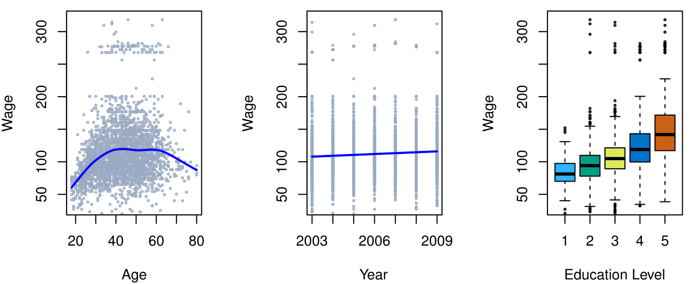
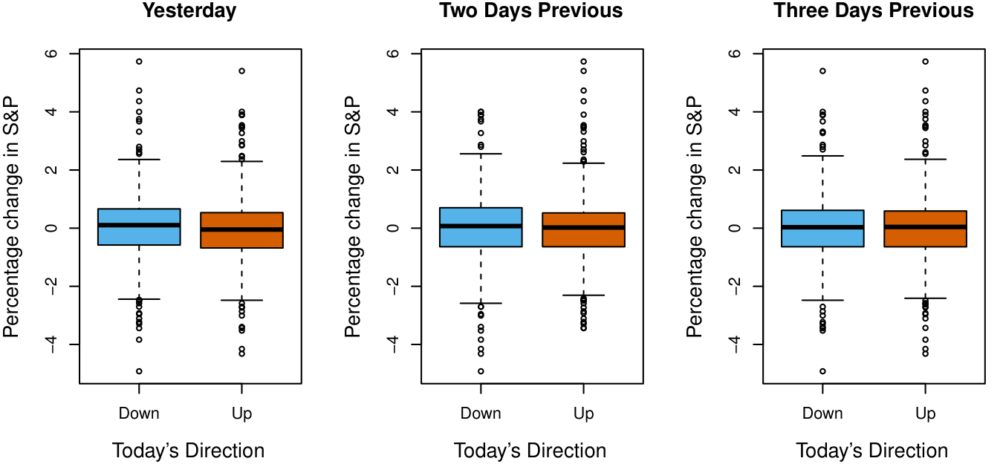
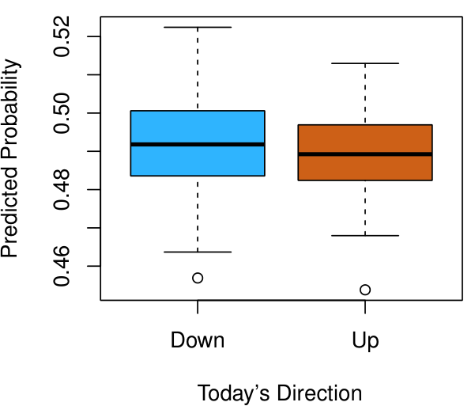
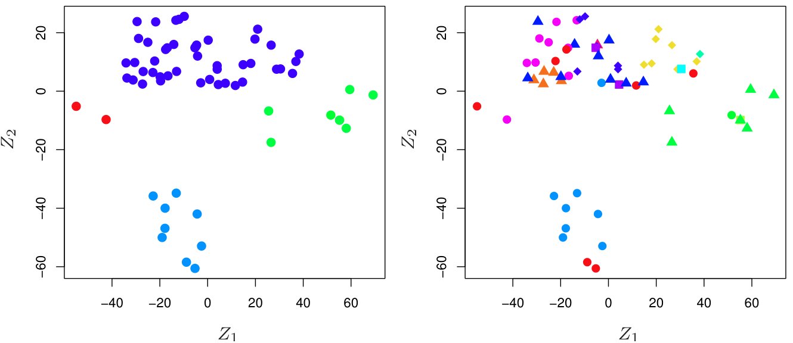

# Giới thiệu 

## Tổng quan về Học thống kê 

_Học thống kê_ (Statistical learning) đề cập đến một tập hợp lớn các công cụ để _hiểu dữ liệu_. Các công cụ này có thể được phân loại thành _học có giám sát_ (supervised learning) hoặc _học không giám sát_ (unsupervised learning). Nói một cách tổng quát, học thống kê có giám sát bao gồm việc xây dựng một mô hình thống kê để dự đoán, hoặc ước lượng, một _đầu ra_ (output) dựa trên một hoặc nhiều _đầu vào_ (inputs). Những bài toán có tính chất này xuất hiện trong các lĩnh vực đa dạng như kinh doanh, y học, vật lý thiên văn và chính sách công. Với học không giám sát, có các đầu vào nhưng không có đầu ra giám sát; tuy nhiên chúng ta có thể học các mối quan hệ và cấu trúc từ dữ liệu đó. Để cung cấp một minh họa về một số ứng dụng của học thống kê, chúng tôi thảo luận ngắn gọn về ba bộ dữ liệu thực tế được xem xét trong cuốn sách này. 

### _Dữ liệu Tiền lương (Wage Data)_ 

Trong ứng dụng này (được chúng tôi gọi là bộ dữ liệu `Wage` trong suốt cuốn sách này), chúng ta xem xét một số yếu tố liên quan đến tiền lương của một nhóm nam giới từ khu vực Đại Tây Dương của Hoa Kỳ. Cụ thể, chúng ta muốn hiểu sự liên hệ giữa `age` (tuổi) và `education` (trình độ học vấn) của một nhân viên, cũng như `year` (năm dương lịch), đối với `wage` (tiền lương) của anh ta. Ví dụ, hãy xem xét biểu đồ bên trái của Hình 1.1, hiển thị `wage` theo `age` cho từng cá nhân trong bộ dữ liệu. Có bằng chứng cho thấy `wage` tăng theo `age` nhưng sau đó lại giảm sau khoảng 60 tuổi. Đường màu xanh lam, cung cấp một ước lượng về `wage` trung bình cho một `age` nhất định, làm cho xu hướng này trở nên rõ ràng hơn. 



**HÌNH 1.1.** _Dữ liệu_ `Wage` _, chứa thông tin khảo sát thu nhập của nam giới từ khu vực trung tâm Đại Tây Dương của Hoa Kỳ._ Trái: `wage` _như một hàm của_ `age` _. Trung bình,_ `wage` _tăng theo_ `age` _cho đến khoảng 60 tuổi, tại thời điểm đó nó bắt đầu giảm._ Giữa: `wage` _như một hàm của_ `year` _. Có một sự gia tăng chậm nhưng ổn định khoảng $10,000 trong_ `wage` _trung bình giữa năm 2003 và 2009._ Phải: _Biểu đồ hộp (Boxplots) hiển thị_ `wage` _như một hàm của_ `education` _, với 1 chỉ mức thấp nhất (không có bằng trung học) và 5 chỉ mức cao nhất (bằng sau đại học). Trung bình,_ `wage` _tăng theo trình độ học vấn._ 

Cho trước `age` của một nhân viên, chúng ta có thể sử dụng đường cong này để _dự đoán_ `wage` của anh ta. Tuy nhiên, cũng rõ ràng từ Hình 1.1 rằng có một lượng biến thiên đáng kể liên quan đến giá trị trung bình này, và do đó chỉ riêng `age` thì không có khả năng cung cấp một dự đoán chính xác về `wage` của một người đàn ông cụ thể. 

Chúng ta cũng có thông tin về trình độ học vấn của mỗi nhân viên và `year` mà `wage` được kiếm. Các biểu đồ ở giữa và bên phải của Hình 1.1, hiển thị `wage` như một hàm của cả `year` và `education`, chỉ ra rằng cả hai yếu tố này đều có liên hệ với `wage`. Tiền lương tăng khoảng $10,000, theo một cách gần như tuyến tính (hoặc đường thẳng), giữa năm 2003 và 2009, mặc dù sự gia tăng này là rất nhỏ so với sự biến thiên trong dữ liệu. Tiền lương cũng thường cao hơn đối với những cá nhân có trình độ học vấn cao hơn: những người đàn ông có trình độ học vấn thấp nhất (1) có xu hướng có mức lương thấp hơn đáng kể so với những người có trình độ học vấn cao nhất (5). Rõ ràng, dự đoán chính xác nhất về `wage` của một người đàn ông nhất định sẽ đạt được bằng cách kết hợp `age`, `education` và `year` của anh ta. Trong Chương 3, chúng tôi thảo luận về hồi quy tuyến tính (linear regression), có thể được sử dụng để dự đoán `wage` từ bộ dữ liệu này. Lý tưởng nhất, chúng ta nên dự đoán `wage` theo cách tính đến mối quan hệ phi tuyến tính giữa `wage` và `age`. Trong Chương 7, chúng tôi thảo luận về một lớp các phương pháp tiếp cận để giải quyết vấn đề này. 



**HÌNH 1.2.** Trái: _Biểu đồ hộp về phần trăm thay đổi của ngày hôm trước trong chỉ số S&P cho những ngày mà thị trường tăng hoặc giảm, thu được từ dữ liệu_ `Smarket` _._ Giữa và Phải: _Giống như biểu đồ bên trái, nhưng phần trăm thay đổi cho 2 và 3 ngày trước được hiển thị._ 

### _Dữ liệu Thị trường Chứng khoán (Stock Market Data)_ 

Dữ liệu `Wage` liên quan đến việc dự đoán một giá trị đầu ra _liên tục_ (continuous) hoặc _định lượng_ (quantitative). Đây thường được gọi là một bài toán _hồi quy_ (regression). Tuy nhiên, trong một số trường hợp nhất định, thay vào đó chúng ta có thể muốn dự đoán một giá trị phi số—tức là, một đầu ra _phân loại_ (categorical) hoặc _định tính_ (qualitative). Ví dụ, trong Chương 4, chúng ta xem xét một bộ dữ liệu thị trường chứng khoán chứa các biến động hàng ngày trong chỉ số chứng khoán Standard & Poor's 500 (S&P) trong khoảng thời gian 5 năm từ 2001 đến 2005. Chúng tôi gọi đây là dữ liệu `Smarket`. Mục tiêu là dự đoán xem chỉ số sẽ _tăng_ hay _giảm_ vào một ngày nhất định, sử dụng phần trăm thay đổi trong 5 ngày qua của chỉ số. Ở đây, bài toán học thống kê không liên quan đến việc dự đoán một giá trị số. Thay vào đó, nó liên quan đến việc dự đoán xem hiệu suất thị trường chứng khoán của một ngày nhất định sẽ rơi vào nhóm `Up` hay nhóm `Down`. Đây được gọi là một bài toán _phân loại_ (classification). Một mô hình có thể dự đoán chính xác hướng mà thị trường sẽ di chuyển sẽ rất hữu ích! 

Biểu đồ bên trái của Hình 1.2 hiển thị hai biểu đồ hộp về phần trăm thay đổi của ngày hôm trước trong chỉ số chứng khoán: một cho 648 ngày mà thị trường tăng vào ngày tiếp theo, và một cho 602 ngày mà thị trường giảm. Hai biểu đồ trông gần như giống hệt nhau, cho thấy rằng không có chiến lược đơn giản nào để sử dụng chuyển động của ngày hôm qua trong S&P nhằm dự đoán lợi nhuận của ngày hôm nay. Các biểu đồ còn lại, hiển thị biểu đồ hộp cho các phần trăm thay đổi 2 và 3 ngày trước ngày hôm nay, tương tự chỉ ra ít sự liên hệ giữa lợi nhuận trong quá khứ và hiện tại. Tất nhiên, sự thiếu hụt quy luật này là điều được mong đợi: với sự hiện diện của các mối tương quan mạnh giữa lợi nhuận của các ngày liên tiếp, người ta có thể áp dụng một chiến lược giao dịch đơn giản để tạo ra lợi nhuận từ thị trường. Tuy nhiên, trong Chương 4, chúng ta khám phá những dữ liệu này bằng cách sử dụng một số phương pháp học thống kê khác nhau. Thú vị là, có những gợi ý về một số xu hướng yếu trong dữ liệu cho thấy rằng, ít nhất trong khoảng thời gian 5 năm này, có thể dự đoán chính xác hướng di chuyển của thị trường trong khoảng 60% thời gian (Hình 1.3). 



**HÌNH 1.3.** _Chúng tôi khớp (fit) một mô hình phân tích phân biệt bậc hai (quadratic discriminant analysis) với tập con của dữ liệu_ `Smarket` _tương ứng với khoảng thời gian 2001–2004, và dự đoán xác suất giảm của thị trường chứng khoán sử dụng dữ liệu năm 2005. Trung bình, xác suất giảm được dự đoán cao hơn cho những ngày mà thị trường thực sự giảm. Dựa trên những kết quả này, chúng tôi có thể dự đoán chính xác hướng di chuyển trên thị trường 60% thời gian._ 

### _Dữ liệu Biểu hiện Gen (Gene Expression Data)_ 

Hai ứng dụng trước minh họa các bộ dữ liệu có cả các biến đầu vào (input variables) và đầu ra (output variables). Tuy nhiên, một lớp bài toán quan trọng khác liên quan đến các tình huống mà chúng ta chỉ quan sát được các biến đầu vào, không có đầu ra tương ứng. Ví dụ, trong bối cảnh tiếp thị, chúng ta có thể có thông tin nhân khẩu học cho một số khách hàng hiện tại hoặc tiềm năng. Chúng ta có thể muốn hiểu những loại khách hàng nào giống nhau bằng cách nhóm các cá nhân theo các đặc điểm được quan sát của họ. Đây được gọi là một bài toán _phân cụm_ (clustering). Không giống như trong các ví dụ trước, ở đây chúng ta không cố gắng dự đoán một biến đầu ra. 

Chúng tôi dành Chương 12 để thảo luận về các phương pháp học thống kê cho những bài toán mà không có sẵn biến đầu ra tự nhiên nào. Chúng ta xem xét bộ dữ liệu `NCI60`, bao gồm 6,830 phép đo biểu hiện gen cho mỗi dòng trong 64 dòng tế bào ung thư. Thay vì dự đoán một biến đầu ra cụ thể, chúng ta quan tâm đến việc xác định xem có các nhóm, hoặc cụm (clusters), trong số các dòng tế bào dựa trên các phép đo biểu hiện gen của chúng hay không. Đây là một câu hỏi khó giải quyết, một phần vì có hàng ngàn phép đo biểu hiện gen cho mỗi dòng tế bào, khiến việc trực quan hóa dữ liệu trở nên khó khăn. 



**HÌNH 1.4.** Trái: _Biểu diễn của bộ dữ liệu biểu hiện gen_ `NCI60` _trong một không gian hai chiều, $Z_1$ và $Z_2$. Mỗi điểm tương ứng với một trong 64 dòng tế bào. Dường như có bốn nhóm dòng tế bào, mà chúng tôi đã biểu diễn bằng các màu khác nhau._ Phải: _Giống như biểu đồ bên trái ngoại trừ việc chúng tôi đã biểu diễn từng loại trong số 14 loại ung thư khác nhau bằng một ký hiệu có màu khác nhau. Các dòng tế bào tương ứng với cùng một loại ung thư có xu hướng ở gần nhau trong không gian hai chiều._ 

Biểu đồ bên trái của Hình 1.4 giải quyết vấn đề này bằng cách biểu diễn mỗi dòng trong 64 dòng tế bào chỉ bằng hai con số, $Z_1$ và $Z_2$. Đây là hai _thành phần chính_ (principal components) đầu tiên của dữ liệu, tóm tắt 6,830 phép đo biểu hiện cho mỗi dòng tế bào xuống còn hai con số hoặc _chiều_ (dimensions). Mặc dù có khả năng việc giảm chiều này đã dẫn đến một số mất mát thông tin, nhưng giờ đây có thể kiểm tra dữ liệu một cách trực quan để tìm bằng chứng về sự phân cụm. Quyết định số lượng cụm thường là một vấn đề khó khăn. Nhưng biểu đồ bên trái của Hình 1.4 gợi ý ít nhất bốn nhóm dòng tế bào, mà chúng tôi đã biểu diễn bằng các màu riêng biệt. 

Trong bộ dữ liệu cụ thể này, hóa ra các dòng tế bào tương ứng với 14 loại ung thư khác nhau. (Tuy nhiên, thông tin này không được sử dụng để tạo ra biểu đồ bên trái của Hình 1.4.) Biểu đồ bên phải của Hình 1.4 giống hệt với biểu đồ bên trái, ngoại trừ việc 14 loại ung thư được hiển thị bằng các ký hiệu có màu sắc riêng biệt. Có bằng chứng rõ ràng cho thấy các dòng tế bào có cùng loại ung thư có xu hướng nằm gần nhau trong biểu diễn hai chiều này. Ngoài ra, mặc dù thông tin ung thư không được sử dụng để tạo ra biểu đồ bên trái, nhưng sự phân cụm thu được có một số điểm tương đồng với một số loại ung thư thực tế được quan sát ở biểu đồ bên phải. Điều này cung cấp một số xác minh độc lập về độ chính xác của phân tích phân cụm của chúng ta. 

## Lịch sử Ngắn gọn về Học thống kê 

Mặc dù thuật ngữ _học thống kê_ (statistical learning) còn khá mới, nhiều khái niệm làm nền tảng cho lĩnh vực này đã được phát triển từ lâu. Vào đầu thế kỷ XIX, phương pháp _bình phương tối thiểu_ (least squares) đã được phát triển, thực hiện hình thức sớm nhất của những gì ngày nay được gọi là _hồi quy tuyến tính_ (linear regression). Phương pháp tiếp cận này lần đầu tiên được áp dụng thành công cho các bài toán trong thiên văn học. Hồi quy tuyến tính được sử dụng để dự đoán các giá trị định lượng, chẳng hạn như mức lương của một cá nhân. Để dự đoán các giá trị định tính, chẳng hạn như liệu một bệnh nhân sống hay chết, hoặc liệu thị trường chứng khoán tăng hay giảm, _phân tích phân biệt tuyến tính_ (linear discriminant analysis) đã được đề xuất vào năm 1936. Vào những năm 1940, nhiều tác giả khác nhau đã đưa ra một phương pháp tiếp cận thay thế, _hồi quy logistic_ (logistic regression). Vào đầu những năm 1970, thuật ngữ _mô hình tuyến tính suy rộng_ (generalized linear model) đã được phát triển để mô tả toàn bộ một lớp các phương pháp học thống kê bao gồm cả hồi quy tuyến tính và logistic như những trường hợp đặc biệt. 

Đến cuối những năm 1970, có thêm nhiều kỹ thuật học từ dữ liệu đã ra đời. Tuy nhiên, chúng hầu như chỉ là các phương pháp _tuyến tính_ (linear methods) vì việc khớp các mối quan hệ _phi tuyến tính_ (non-linear relationships) rất khó khăn về mặt tính toán vào thời điểm đó. Đến những năm 1980, công nghệ máy tính cuối cùng đã cải thiện đủ mức để các phương pháp phi tuyến không còn bị cấm đoán về mặt tính toán nữa. Vào giữa những năm 1980, _cây phân loại và hồi quy_ (classification and regression trees) đã được phát triển, tiếp theo ngay sau đó là _các mô hình cộng suy rộng_ (generalized additive models). _Mạng nơ-ron_ (Neural networks) trở nên phổ biến vào những năm 1980, và _máy học vector hỗ trợ_ (support vector machines) xuất hiện vào những năm 1990. 

Kể từ thời điểm đó, học thống kê đã nổi lên như một phân ngành mới trong thống kê, tập trung vào mô hình hóa và dự đoán có giám sát (supervised) và không giám sát (unsupervised). Trong những năm gần đây, sự tiến bộ trong học thống kê đã được đánh dấu bởi sự gia tăng tính sẵn có của các phần mềm mạnh mẽ và tương đối thân thiện với người dùng, chẳng hạn như hệ thống `R` phổ biến và miễn phí. Điều này có tiềm năng để tiếp tục sự biến đổi của lĩnh vực này từ một tập hợp các kỹ thuật được sử dụng và phát triển bởi các nhà thống kê và nhà khoa học máy tính thành một bộ công cụ thiết yếu cho một cộng đồng rộng lớn hơn nhiều. 

## Cuốn Sách Này 

Cuốn sách _The Elements of Statistical Learning_ (ESL) của Hastie, Tibshirani và Friedman được xuất bản lần đầu tiên vào năm 2001. Kể từ thời điểm đó, nó đã trở thành một tài liệu tham khảo quan trọng về các nguyên tắc cơ bản của học máy thống kê. Sự thành công của nó bắt nguồn từ việc xử lý toàn diện và chi tiết nhiều chủ đề quan trọng trong học thống kê, cũng như thực tế là (so với nhiều sách giáo khoa thống kê ở cấp độ cao) nó có thể tiếp cận được với nhiều đối tượng khán giả. Tuy nhiên, yếu tố lớn nhất đằng sau thành công của ESL chính là tính thời sự của nó. Tại thời điểm xuất bản, sự quan tâm đến lĩnh vực học thống kê đang bắt đầu bùng nổ. ESL đã cung cấp một trong những lời giới thiệu dễ tiếp cận và toàn diện đầu tiên về chủ đề này. 

Kể từ khi ESL được xuất bản lần đầu tiên, lĩnh vực học thống kê đã tiếp tục phát triển mạnh mẽ. Sự mở rộng của lĩnh vực này đã diễn ra dưới hai hình thức. Sự tăng trưởng rõ rệt nhất liên quan đến việc phát triển các phương pháp tiếp cận học thống kê mới và được cải tiến, nhằm trả lời một loạt các câu hỏi khoa học trong nhiều lĩnh vực khác nhau. Tuy nhiên, lĩnh vực học thống kê cũng đã mở rộng đối tượng khán giả của mình. Vào những năm 1990, sự gia tăng về sức mạnh tính toán đã tạo ra một làn sóng quan tâm đến lĩnh vực này từ những người không phải là nhà thống kê, những người rất háo hức sử dụng các công cụ thống kê tiên tiến để phân tích dữ liệu của họ. Thật không may, bản chất kỹ thuật cao của các phương pháp tiếp cận này có nghĩa là cộng đồng người dùng vẫn chủ yếu bị giới hạn ở các chuyên gia trong thống kê, khoa học máy tính và các lĩnh vực liên quan có sự đào tạo (và thời gian) để hiểu và thực hiện chúng. 

Trong những năm gần đây, các gói phần mềm mới và được cải tiến đã làm giảm đáng kể gánh nặng triển khai cho nhiều phương pháp học thống kê. Đồng thời, ngày càng có nhiều sự công nhận ở nhiều lĩnh vực, từ kinh doanh, y tế, di truyền học đến khoa học xã hội và hơn thế nữa, rằng học thống kê là một công cụ mạnh mẽ với những ứng dụng thực tế quan trọng. Kết quả là, lĩnh vực này đã chuyển từ một lĩnh vực chủ yếu được quan tâm trong học thuật thành một bộ môn chính thống, với một lượng khán giả tiềm năng khổng lồ. Xu hướng này chắc chắn sẽ tiếp tục với sự sẵn có ngày càng tăng của số lượng dữ liệu khổng lồ và phần mềm để phân tích chúng. 

Mục đích của _An Introduction to Statistical Learning_ (ISL) là tạo điều kiện thuận lợi cho sự chuyển đổi của học thống kê từ một lĩnh vực học thuật sang một lĩnh vực chính thống. ISL không nhằm mục đích thay thế ESL, vốn là một văn bản toàn diện hơn rất nhiều cả về số lượng các phương pháp tiếp cận được xem xét và độ sâu mà chúng được khám phá. Chúng tôi coi ESL là một người bạn đồng hành quan trọng đối với các chuyên gia (có bằng sau đại học về thống kê, học máy hoặc các lĩnh vực liên quan) những người cần hiểu các chi tiết kỹ thuật đằng sau các phương pháp tiếp cận học thống kê. Tuy nhiên, cộng đồng người dùng các kỹ thuật học thống kê đã mở rộng để bao gồm những cá nhân với nhiều mối quan tâm và nền tảng đa dạng hơn. Do đó, cần có một phiên bản ít kỹ thuật hơn và dễ tiếp cận hơn của ESL. 

Trong quá trình giảng dạy những chủ đề này qua nhiều năm, chúng tôi đã phát hiện ra rằng chúng thu hút sự quan tâm của sinh viên thạc sĩ và tiến sĩ trong các lĩnh vực khác biệt như quản trị kinh doanh, sinh học, và khoa học máy tính, cũng như sinh viên đại học năm cuối có định hướng định lượng. Điều quan trọng đối với nhóm đa dạng này là có thể hiểu được các mô hình, trực giác, và điểm mạnh cũng như điểm yếu của các phương pháp tiếp cận khác nhau. Nhưng đối với đối tượng này, nhiều chi tiết kỹ thuật đằng sau các phương pháp học thống kê, chẳng hạn như các thuật toán tối ưu hóa và các thuộc tính lý thuyết, không phải là mối quan tâm hàng đầu. Chúng tôi tin rằng những sinh viên này không cần sự hiểu biết sâu sắc về những khía cạnh này để trở thành những người dùng có hiểu biết về các phương pháp luận khác nhau, và để đóng góp cho các lĩnh vực mà họ đã chọn thông qua việc sử dụng các công cụ học thống kê. 

ISL dựa trên bốn tiền đề sau đây. 

1. _Nhiều phương pháp học thống kê phù hợp và hữu ích trong một loạt các ngành học thuật và phi học thuật, vượt ra ngoài khoa học thống kê._ Chúng tôi tin rằng nhiều quy trình học thống kê đương đại nên, và sẽ, trở nên phổ biến và được sử dụng rộng rãi như trường hợp hiện tại của các phương pháp cổ điển như hồi quy tuyến tính. Do đó, thay vì cố gắng xem xét mọi cách tiếp cận có thể (một nhiệm vụ bất khả thi), chúng tôi đã tập trung vào việc trình bày các phương pháp mà chúng tôi tin là có thể áp dụng rộng rãi nhất. 

2. _Học thống kê không nên được coi như một loạt các hộp đen (black boxes)._ Không có phương pháp tiếp cận duy nhất nào sẽ hoạt động tốt trong tất cả các ứng dụng khả thi. Nếu không hiểu tất cả các bánh răng bên trong hộp, hoặc sự tương tác giữa các bánh răng đó, thì không thể chọn được chiếc hộp tốt nhất. Do đó, chúng tôi đã nỗ lực mô tả cẩn thận mô hình, trực giác, các giả định và sự đánh đổi đằng sau mỗi phương pháp mà chúng tôi xem xét. 

3. _Mặc dù việc biết mỗi bánh răng thực hiện công việc gì là quan trọng, nhưng không nhất thiết phải có kỹ năng để chế tạo ra cỗ máy bên trong hộp!_ Do vậy, chúng tôi đã giảm thiểu sự thảo luận về các chi tiết kỹ thuật liên quan đến quy trình khớp (fitting procedures) và các tính chất lý thuyết. Chúng tôi giả định rằng người đọc đã quen thuộc với các khái niệm toán học cơ bản, nhưng chúng tôi không giả định họ có bằng cấp sau đại học về khoa học toán học. Ví dụ, chúng tôi đã gần như hoàn toàn tránh việc sử dụng đại số ma trận, và người đọc hoàn toàn có thể hiểu được toàn bộ cuốn sách mà không cần có kiến thức chi tiết về ma trận và vector. 

4. _Chúng tôi cho rằng người đọc quan tâm đến việc áp dụng các phương pháp học thống kê vào các vấn đề thực tế._ Để tạo điều kiện thuận lợi cho điều này, cũng như để thúc đẩy các kỹ thuật được thảo luận, chúng tôi đã dành một phần trong mỗi chương cho các bài thực hành trên máy tính (computer labs). Trong mỗi bài thực hành, chúng tôi dẫn dắt người đọc qua một ứng dụng thực tế của các phương pháp được xem xét trong chương đó. Khi chúng tôi giảng dạy tài liệu này trong các khóa học của mình, chúng tôi đã phân bổ khoảng một phần ba thời gian trên lớp để làm các bài thực hành, và chúng tôi thấy chúng cực kỳ hữu ích. Nhiều sinh viên ít định hướng tính toán, những người ban đầu bị e ngại bởi các bài thực hành, đã nắm bắt được vấn đề trong suốt quá trình học của quý hoặc học kỳ. Chúng tôi đã sử dụng `R` vì nó được cung cấp miễn phí và đủ mạnh để thực hiện tất cả các phương pháp được thảo luận trong cuốn sách. Nó cũng có các gói (packages) tùy chọn có thể được tải xuống để thực hiện theo nghĩa đen là hàng ngàn phương pháp bổ sung. Quan trọng nhất, `R` là ngôn ngữ được lựa chọn bởi các nhà thống kê học thuật, và các phương pháp tiếp cận mới thường xuất hiện trên `R` nhiều năm trước khi chúng được đưa vào các gói phần mềm thương mại. Tuy nhiên, các bài thực hành trong ISL mang tính độc lập, và có thể được bỏ qua nếu người đọc muốn sử dụng một gói phần mềm khác hoặc không muốn áp dụng các phương pháp được thảo luận vào các bài toán thực tế. 

## Ai Nên Đọc Cuốn Sách Này? 

Cuốn sách này dành cho bất kỳ ai quan tâm đến việc sử dụng các phương pháp thống kê hiện đại để mô hình hóa và dự đoán từ dữ liệu. Nhóm này bao gồm các nhà khoa học, kỹ sư, nhà phân tích dữ liệu, nhà khoa học dữ liệu, và các nhà phân tích định lượng (quants), mà còn cả những cá nhân ít kỹ thuật hơn có bằng cấp trong các lĩnh vực phi định lượng như khoa học xã hội hoặc kinh doanh. Chúng tôi kỳ vọng rằng người đọc đã học ít nhất một khóa học cơ bản về thống kê. Nền tảng về hồi quy tuyến tính cũng hữu ích, mặc dù không bắt buộc, vì chúng tôi sẽ ôn lại các khái niệm chính đằng sau hồi quy tuyến tính trong Chương 3. Mức độ toán học của cuốn sách này khá khiêm tốn, và không yêu cầu một kiến thức chi tiết về các phép toán ma trận. Cuốn sách này cung cấp một phần giới thiệu về ngôn ngữ lập trình thống kê `R`. Việc đã từng tiếp xúc với một ngôn ngữ lập trình trước đó, chẳng hạn như `MATLAB` hoặc `Python`, là hữu ích nhưng không bắt buộc. 

Ấn bản đầu tiên của cuốn sách giáo khoa này đã được sử dụng để giảng dạy cho sinh viên thạc sĩ và tiến sĩ trong các ngành kinh doanh, kinh tế, khoa học máy tính, sinh học, khoa học trái đất, tâm lý học, và nhiều lĩnh vực khác của khoa học tự nhiên và xã hội. Nó cũng đã được sử dụng để giảng dạy cho những sinh viên đại học trình độ cao, những người đã từng tham gia một khóa học về hồi quy tuyến tính. Trong bối cảnh của một khóa học nghiêm ngặt hơn về mặt toán học mà trong đó ESL đóng vai trò là giáo trình chính, ISL có thể được sử dụng như một văn bản bổ trợ để giảng dạy các khía cạnh tính toán của nhiều phương pháp tiếp cận khác nhau. 

## Ký hiệu và Đại số Ma trận Đơn giản 

Việc chọn ký hiệu cho một cuốn sách giáo khoa luôn là một nhiệm vụ khó khăn. Phần lớn chúng tôi áp dụng cùng các quy ước ký hiệu như ESL. 

Chúng tôi sẽ sử dụng $n$ để biểu diễn số lượng các điểm dữ liệu riêng biệt, hoặc các quan sát, trong mẫu của chúng ta. Chúng tôi sẽ sử dụng $p$ để ký hiệu số lượng các biến có sẵn để sử dụng trong việc đưa ra các dự đoán. Ví dụ, bộ dữ liệu `Wage` bao gồm 11 biến cho 3,000 người, do đó chúng ta có $n = 3,000$ quan sát và $p = 11$ biến (chẳng hạn như `year`, `age`, `race`, v.v.). Lưu ý rằng trong toàn bộ cuốn sách này, chúng tôi chỉ ra các tên biến bằng cách sử dụng phông chữ có màu: `Variable Name`. 

Trong một số ví dụ, $p$ có thể khá lớn, chẳng hạn ở bậc của hàng nghìn hoặc thậm chí hàng triệu; tình huống này phát sinh khá thường xuyên, ví dụ, trong phân tích dữ liệu sinh học hiện đại hoặc dữ liệu quảng cáo dựa trên web. 

Nói chung, chúng tôi sẽ sử dụng $x_{ij}$ để biểu diễn giá trị của biến thứ $j$ cho quan sát thứ $i$, trong đó $i = 1, 2, \dots, n$ và $j = 1, 2, \dots, p$. Trong suốt cuốn sách này, $i$ sẽ được sử dụng để lập chỉ mục các mẫu hoặc các quan sát (từ 1 đến $n$) và $j$ sẽ được sử dụng để lập chỉ mục các biến (từ 1 đến $p$). Chúng tôi sử dụng $\mathbf{X}$ để ký hiệu một ma trận $n \times p$ có phần tử thứ $(i, j)$ là $x_{ij}$. Nghĩa là, 

$$
\mathbf{X} = \begin{pmatrix}
x_{11} & x_{12} & \dots & x_{1p} \\
x_{21} & x_{22} & \dots & x_{2p} \\
\vdots & \vdots & \ddots & \vdots \\
x_{n1} & x_{n2} & \dots & x_{np}
\end{pmatrix}
$$

Đối với những độc giả không quen thuộc với ma trận, sẽ rất hữu ích khi hình dung $\mathbf{X}$ như một bảng tính gồm các con số với $n$ hàng và $p$ cột. 

Đôi khi chúng ta sẽ quan tâm đến các hàng của $\mathbf{X}$, mà chúng ta viết là $x_1, x_2, \dots, x_n$. Ở đây $x_i$ là một vector có độ dài $p$, chứa các phép đo của $p$ biến cho quan sát thứ $i$. Nghĩa là, 

$$
x_i = \begin{pmatrix}
x_{i1} \\
x_{i2} \\
\vdots \\
x_{ip}
\end{pmatrix}
$$

(Các vector theo mặc định được biểu diễn dưới dạng các cột.) Ví dụ, đối với dữ liệu `Wage`, $x_i$ là một vector có độ dài 11, bao gồm `year`, `age`, `race`, và các giá trị khác cho cá nhân thứ $i$. Vào những thời điểm khác, thay vào đó chúng ta sẽ quan tâm đến các cột của $\mathbf{X}$, mà chúng ta viết là $\mathbf{x}_1, \mathbf{x}_2, \dots, \mathbf{x}_p$. Mỗi cột là một vector có độ dài $n$. Nghĩa là, 

$$
\mathbf{x}_j = \begin{pmatrix}
x_{1j} \\
x_{2j} \\
\vdots \\
x_{nj}
\end{pmatrix}
$$

Ví dụ, đối với dữ liệu `Wage`, $\mathbf{x}_1$ chứa $n = 3,000$ giá trị cho `year`. Bằng cách sử dụng ký hiệu này, ma trận $\mathbf{X}$ có thể được viết là 

$$
\mathbf{X} = \begin{pmatrix}
\mathbf{x}_1 & \mathbf{x}_2 & \dots & \mathbf{x}_p
\end{pmatrix}
$$

hoặc 

$$
\mathbf{X} = \begin{pmatrix}
x_1^T \\
x_2^T \\
\vdots \\
x_n^T
\end{pmatrix}
$$

Ký hiệu $^T$ biểu thị sự _chuyển vị_ (transpose) của một ma trận hoặc vector. Vì vậy, ví dụ, 

$$
\mathbf{X}^T = \begin{pmatrix}
x_{11} & x_{21} & \dots & x_{n1} \\
x_{12} & x_{22} & \dots & x_{n2} \\
\vdots & \vdots & \ddots & \vdots \\
x_{1p} & x_{2p} & \dots & x_{np}
\end{pmatrix}
$$

trong khi 

$x_i^T = (x_{i1} \ x_{i2} \ \dots \ x_{ip})$. 

Chúng tôi sử dụng $y_i$ để ký hiệu quan sát thứ $i$ của biến mà chúng ta muốn thực hiện dự đoán, chẳng hạn như `wage`. Do đó, chúng ta viết tập hợp tất cả $n$ quan sát dưới dạng vector là 

$$
\mathbf{y} = \begin{pmatrix}
y_1 \\
y_2 \\
\vdots \\
y_n
\end{pmatrix}
$$

Khi đó, dữ liệu quan sát của chúng ta bao gồm $\{(x_1, y_1), (x_2, y_2), \dots, (x_n, y_n)\}$, trong đó mỗi $x_i$ là một vector có độ dài $p$. (Nếu $p = 1$, thì $x_i$ đơn giản chỉ là một vô hướng.) Trong văn bản này, một vector có độ dài $n$ sẽ luôn được biểu thị bằng _chữ thường in đậm_; ví dụ: 

$$
\mathbf{a} = \begin{pmatrix}
a_1 \\
a_2 \\
\vdots \\
a_n
\end{pmatrix}
$$

Tuy nhiên, các vector không có độ dài $n$ (chẳng hạn như các vector đặc trưng có độ dài $p$, như trong (1.1)) sẽ được biểu thị bằng _chữ thường in thường_, ví dụ: $a$. Các đại lượng vô hướng (scalars) cũng sẽ được biểu thị bằng _chữ thường in thường_, ví dụ: $a$. Trong những trường hợp hiếm hoi khi hai cách sử dụng phông chữ thường này dẫn đến sự mơ hồ, chúng tôi sẽ làm rõ xem cách sử dụng nào đang được ám chỉ. Ma trận sẽ được biểu thị bằng _chữ in hoa in đậm_, chẳng hạn như $\mathbf{A}$. Các biến ngẫu nhiên sẽ được biểu thị bằng _chữ in hoa in thường_, ví dụ: $A$, bất kể kích thước của chúng là bao nhiêu. 

Đôi khi chúng ta sẽ muốn chỉ ra kích thước của một đối tượng cụ thể. Để chỉ ra rằng một đối tượng là một đại lượng vô hướng, chúng ta sẽ sử dụng ký hiệu $a \in \mathbb{R}$. Để chỉ ra rằng nó là một vector có độ dài $k$, chúng ta sẽ sử dụng $a \in \mathbb{R}^k$ (hoặc $\mathbf{a} \in \mathbb{R}^n$ nếu nó có độ dài $n$). Chúng ta sẽ chỉ ra rằng một đối tượng là một ma trận $r \times s$ bằng cách sử dụng $\mathbf{A} \in \mathbb{R}^{r \times s}$. 

Chúng tôi đã tránh sử dụng đại số ma trận bất cứ khi nào có thể. Tuy nhiên, trong một vài trường hợp, việc tránh hoàn toàn nó trở nên quá cồng kềnh. Trong những trường hợp hiếm hoi này, điều quan trọng là phải hiểu khái niệm nhân hai ma trận. Giả sử rằng $\mathbf{A} \in \mathbb{R}^{r \times d}$ và $\mathbf{B} \in \mathbb{R}^{d \times s}$. Khi đó tích của $\mathbf{A}$ và $\mathbf{B}$ được ký hiệu là $\mathbf{AB}$. Phần tử thứ $(i, j)$ của $\mathbf{AB}$ được tính toán bằng cách nhân mỗi phần tử của hàng thứ $i$ của $\mathbf{A}$ với phần tử tương ứng của cột thứ $j$ của $\mathbf{B}$. Nghĩa là, $(\mathbf{AB})_{ij} = \sum_{k=1}^d a_{ik}b_{kj}$. Ví dụ, xét 

$$
\mathbf{A} = \begin{pmatrix}
1 & 2 \\
3 & 4
\end{pmatrix} \quad \text{and} \quad \mathbf{B} = \begin{pmatrix}
5 & 6 \\
7 & 8
\end{pmatrix}
$$

Khi đó 

$$
\mathbf{AB} = \begin{pmatrix}
1 & 2 \\
3 & 4
\end{pmatrix} \begin{pmatrix}
5 & 6 \\
7 & 8
\end{pmatrix} = \begin{pmatrix}
1 \times 5 + 2 \times 7 & 1 \times 6 + 2 \times 8 \\
3 \times 5 + 4 \times 7 & 3 \times 6 + 4 \times 8
\end{pmatrix} = \begin{pmatrix}
19 & 22 \\
43 & 50
\end{pmatrix}
$$

Lưu ý rằng phép toán này tạo ra một ma trận $r \times s$. Chúng ta chỉ có thể tính được $\mathbf{AB}$ nếu số cột của $\mathbf{A}$ bằng với số hàng của $\mathbf{B}$. 

## Cấu trúc của Cuốn Sách Này 

Chương 2 giới thiệu các thuật ngữ và khái niệm cơ bản đằng sau học thống kê. Chương này cũng trình bày bộ phân loại _K-láng giềng gần nhất_ (K-nearest neighbor classifier), một phương pháp rất đơn giản nhưng hoạt động tốt một cách đáng ngạc nhiên trên nhiều bài toán. Các chương 3 và 4 bao gồm các phương pháp tuyến tính cổ điển cho hồi quy và phân loại. Đặc biệt, Chương 3 ôn lại _hồi quy tuyến tính_, điểm khởi đầu nền tảng cho tất cả các phương pháp hồi quy. Trong Chương 4, chúng tôi thảo luận về hai trong số các phương pháp phân loại cổ điển quan trọng nhất, _hồi quy logistic_ và _phân tích phân biệt tuyến tính_. 

Một vấn đề trung tâm trong tất cả các tình huống học thống kê liên quan đến việc chọn phương pháp tốt nhất cho một ứng dụng nhất định. Do đó, trong Chương 5, chúng tôi giới thiệu về _kiểm chứng chéo_ (cross-validation) và _bootstrap_, có thể được sử dụng để ước lượng độ chính xác của một số phương pháp khác nhau nhằm chọn ra phương pháp tốt nhất. 

Phần lớn nghiên cứu gần đây trong học thống kê đã tập trung vào các phương pháp phi tuyến tính. Tuy nhiên, các phương pháp tuyến tính thường có những lợi thế so với các đối thủ phi tuyến tính của chúng về khả năng diễn giải và đôi khi là cả độ chính xác. Do đó, trong Chương 6, chúng tôi xem xét một loạt các phương pháp tuyến tính, cả cổ điển và hiện đại hơn, những phương pháp mang lại tiềm năng cải tiến so với hồi quy tuyến tính tiêu chuẩn. Chúng bao gồm _lựa chọn từng bước_ (stepwise selection), _hồi quy ridge_, _hồi quy thành phần chính_ (principal components regression), và _lasso_. 

Các chương còn lại tiến vào thế giới của học thống kê phi tuyến tính. Đầu tiên, trong Chương 7, chúng tôi giới thiệu một số phương pháp phi tuyến tính hoạt động tốt cho các bài toán có một biến đầu vào duy nhất. Sau đó, chúng tôi trình bày cách sử dụng các phương pháp này để khớp các mô hình _cộng_ (additive) phi tuyến tính trong đó có nhiều hơn một đầu vào. Trong Chương 8, chúng tôi điều tra các phương pháp dựa trên _cây_ (tree-based methods), bao gồm _bagging_, _boosting_, và _rừng ngẫu nhiên_ (random forests). _Máy học vector hỗ trợ_ (Support vector machines), một tập hợp các phương pháp tiếp cận để thực hiện cả phân loại tuyến tính và phi tuyến tính, được thảo luận trong Chương 9. Chúng tôi đề cập đến _học sâu_ (deep learning), một phương pháp tiếp cận cho hồi quy và phân loại phi tuyến tính đã nhận được rất nhiều sự quan tâm trong những năm gần đây, ở Chương 10. Chương 11 khám phá _phân tích sinh tồn_ (survival analysis), một phương pháp tiếp cận hồi quy chuyên biệt cho thiết lập trong đó biến đầu ra bị _kiểm duyệt_ (censored), tức là không được quan sát đầy đủ. 

Trong Chương 12, chúng ta xem xét thiết lập _học không giám sát_ (unsupervised) trong đó chúng ta có các biến đầu vào nhưng không có biến đầu ra. Đặc biệt, chúng tôi trình bày _phân tích thành phần chính_ (principal components analysis), _phân cụm K-means_ (K-means clustering), và _phân cụm phân cấp_ (hierarchical clustering). Cuối cùng, trong Chương 13, chúng tôi đề cập đến một chủ đề rất quan trọng là kiểm định đa giả thuyết (multiple hypothesis testing). 

Vào cuối mỗi chương, chúng tôi trình bày một hoặc nhiều phần thực hành bằng `R`, trong đó chúng tôi lần lượt thực hiện các ứng dụng của các phương pháp khác nhau được thảo luận trong chương đó một cách có hệ thống. Các bài thực hành này chứng minh điểm mạnh và điểm yếu của các phương pháp tiếp cận khác nhau, đồng thời cung cấp một tài liệu tham khảo hữu ích cho cú pháp cần thiết để thực hiện các phương pháp khác nhau. Người đọc có thể chọn thực hiện các bài thực hành theo tốc độ của riêng mình, hoặc các bài thực hành này có thể là trọng tâm của các buổi học nhóm như một phần của môi trường lớp học. Trong mỗi bài thực hành `R`, chúng tôi trình bày kết quả mà chúng tôi thu được khi thực hiện bài thực hành vào thời điểm viết cuốn sách này. Tuy nhiên, các phiên bản mới của `R` liên tục được phát hành, và theo thời gian, các gói được gọi trong các bài thực hành sẽ được cập nhật. Do đó, trong tương lai, có thể những kết quả hiển thị trong các phần thực hành sẽ không còn tương ứng chính xác với kết quả mà người đọc thu được khi thực hiện các bài thực hành đó. Khi cần thiết, chúng tôi sẽ đăng các bản cập nhật cho các bài thực hành trên trang web của cuốn sách. 

Chúng tôi sử dụng ký hiệu `*` để biểu thị các phần hoặc bài tập chứa các khái niệm thách thức hơn. Những phần này có thể dễ dàng bị bỏ qua bởi những độc giả không muốn đi sâu vào tài liệu, hoặc những người thiếu nền tảng toán học. 

## Các Bộ Dữ liệu Sử dụng trong Thực hành và Bài tập 

Trong cuốn sách giáo khoa này, chúng tôi minh họa các phương pháp học thống kê bằng cách sử dụng các ứng dụng từ tiếp thị, tài chính, sinh học, và các lĩnh vực khác. Gói `ISLR2` có sẵn trên trang web của cuốn sách và trên CRAN chứa một số bộ dữ liệu cần thiết để thực hiện các bài thực hành và bài tập liên quan đến cuốn sách này. Một bộ dữ liệu khác là một phần của bản phân phối `R` cơ sở. Bảng 1.1 chứa một bản tóm tắt các bộ dữ liệu cần thiết để thực hiện các bài thực hành và bài tập. Một vài bộ dữ liệu trong số này cũng có sẵn dưới dạng các file văn bản trên trang web của cuốn sách, để sử dụng trong Chương 2. 

| Name | Description | 
|---|---|
| `Auto` | Mức tiêu thụ nhiên liệu, mã lực và các thông tin khác của xe ô tô. | 
| `Bikeshare` | Lượng sử dụng hàng giờ của một chương trình chia sẻ xe đạp ở Washington, DC. | 
| `Boston` | Giá trị nhà ở và các thông tin khác về các khu vực điều tra dân số ở Boston. | 
| `BrainCancer` | Thời gian sinh tồn của các bệnh nhân được chẩn đoán mắc bệnh ung thư não. | 
| `Caravan` | Thông tin về những cá nhân được cung cấp bảo hiểm nhà lưu động (caravan). | 
| `Carseats` | Thông tin về doanh số bán ghế trẻ em trên ô tô tại 400 cửa hàng. | 
| `College` | Các đặc điểm nhân khẩu học, học phí và nhiều thông tin khác của các trường đại học ở Hoa Kỳ. | 
| `Credit` | Thông tin về khoản nợ thẻ tín dụng của 400 khách hàng. | 
| `Default` | Hồ sơ vỡ nợ của khách hàng cho một công ty thẻ tín dụng. | 
| `Fund` | Lợi nhuận của 2.000 nhà quản lý quỹ phòng hộ trong hơn 50 tháng. | 
| `Hitters` | Thành tích và tiền lương của các cầu thủ bóng chày. | 
| `Khan` | Các phép đo biểu hiện gen cho bốn loại ung thư. | 
| `NCI60` | Các phép đo biểu hiện gen cho 64 dòng tế bào ung thư. | 
| `NYSE` | Lợi nhuận, độ biến động và khối lượng cho Sàn giao dịch Chứng khoán New York. | 
| `OJ` | Thông tin doanh số bán hàng của nước cam Citrus Hill và Minute Maid. | 
| `Portfolio` | Các giá trị trong quá khứ của các tài sản tài chính, để sử dụng trong phân bổ danh mục đầu tư. | 
| `Publication` | Thời gian công bố đối với 244 thử nghiệm lâm sàng. | 
| `Smarket` | Lợi nhuận phần trăm hàng ngày cho S&P 500 trong khoảng thời gian 5 năm. | 
| `USArrests` | Thống kê tội phạm trên 100.000 cư dân ở 50 tiểu bang của Hoa Kỳ. | 
| `Wage`<br>`Weekly` | Dữ liệu khảo sát thu nhập của nam giới ở khu vực trung tâm Đại Tây Dương của Hoa Kỳ.<br>1.089 lợi nhuận thị trường chứng khoán hàng tuần trong 21 năm. | 

**BẢNG 1.1.** _Danh sách các bộ dữ liệu cần thiết để thực hiện các bài thực hành và bài tập trong cuốn sách giáo khoa này. Tất cả các bộ dữ liệu đều có sẵn trong thư viện_ `ISLR2` _, ngoại trừ_ `USArrests` _, là một phần của bản phân phối_ `R` _cơ sở, nhưng có thể truy cập được từ_ `Python`. 

## Trang web của Cuốn Sách 

Trang web của cuốn sách này được đặt tại 

```
www.statlearning.com
```

Nó chứa một số tài nguyên, bao gồm gói `R` liên kết với cuốn sách này, và một số bộ dữ liệu bổ sung. 

## Lời cảm ơn 

Một vài biểu đồ trong cuốn sách này được lấy từ ESL: Các hình 6.7, 8.3, và 12.14. Tất cả các biểu đồ khác đều là mới trong cuốn sách này.
