2 

# Statistical Learning 

## 2.1 What Is Statistical Learning? 

In order to motivate our study of statistical learning, we begin with a simple example. Suppose that we are statistical consultants hired by a client to investigate the association between advertising and sales of a particular product. The `Advertising` data set consists of the `sales` of that product in 200 different markets, along with advertising budgets for the product in each of those markets for three different media: `TV` , `radio` , and `newspaper` . The data are displayed in Figure 2.1. It is not possible for our client to directly increase sales of the product. On the other hand, they can control the advertising expenditure in each of the three media. Therefore, if we determine that there is an association between advertising and sales, then we can instruct our client to adjust advertising budgets, thereby indirectly increasing sales. In other words, our goal is to develop an accurate model that can be used to predict sales on the basis of the three media budgets. 

In this setting, the advertising budgets are _input variables_ while `sales` input is an _output variable_ . The input variables are typically denoted using the variable symbol _X_ , with a subscript to distinguish them. So _X_ 1 might be the `TV` output budget, _X_ 2 the `radio` budget, and _X_ 3 the `newspaper` budget. The inputs variable go by different names, such as _predictors_ , _independent variables_ , _features_ , predictor or sometimes just _variables_ . The output variable—in this case, `sales` —is often called the _response_ or _dependent variable_ , and is typically denoted variable using the symbol _Y_ . Throughout this book, we will use all of these terms feature interchangeably. variable 

independent variable feature variable response dependent variable 

16 2. Statistical Learning 


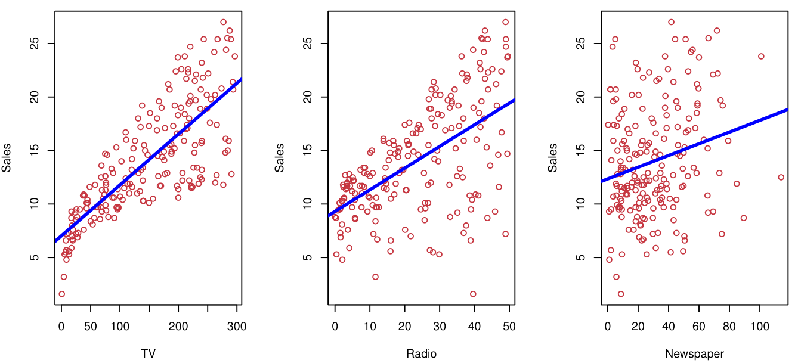


<!-- Start of picture text -->
0 50 100 200 300 0 10 20 30 40 50 0 20 40 60 80 100<br>TV Radio Newspaper<br>25 25 25<br>20 20 20<br>Sales 15 Sales 15 Sales 15<br>10 10 10<br>5 5 5<br><!-- End of picture text -->

**FIGURE 2.1.** _The_ `Advertising` _data set. The plot displays_ `sales` _, in thousands of units, as a function of_ `TV` _,_ `radio` _, and_ `newspaper` _budgets, in thousands of dollars, for_ 200 _different markets. In each plot we show the simple least squares fit of_ `sales` _to that variable, as described in Chapter 3. In other words, each blue line represents a simple model that can be used to predict_ `sales` _using_ `TV` _,_ `radio` _, and_ `newspaper` _, respectively._ 

More generally, suppose that we observe a quantitative response _Y_ and _p_ different predictors, _X_ 1 _, X_ 2 _, . . . , Xp_ . We assume that there is some relationship between _Y_ and _X_ = ( _X_ 1 _, X_ 2 _, . . . , Xp_ ), which can be written in the very general form 


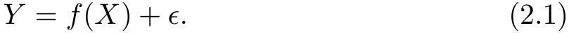


Here _f_ is some fixed but unknown function of _X_ 1 _, . . . , Xp_ , and _ϵ_ is a random _error term_ , which is independent of _X_ and has mean zero. In this formula- error term tion, _f_ represents the _systematic_ information that _X_ provides about _Y_ . 

systematic 

As another example, consider the left-hand panel of Figure 2.2, a plot of `income` versus `years of education` for 30 individuals in the `Income` data set. The plot suggests that one might be able to predict `income` using `years of education` . However, the function _f_ that connects the input variable to the output variable is in general unknown. In this situation one must estimate _f_ based on the observed points. Since `Income` is a simulated data set, _f_ is known and is shown by the blue curve in the right-hand panel of Figure 2.2. The vertical lines represent the error terms _ϵ_ . We note that some of the 30 observations lie above the blue curve and some lie below it; overall, the errors have approximately mean zero. 

In general, the function _f_ may involve more than one input variable. In Figure 2.3 we plot `income` as a function of `years of education` and `seniority` . Here _f_ is a two-dimensional surface that must be estimated based on the observed data. 

2.1 What Is Statistical Learning? 17 


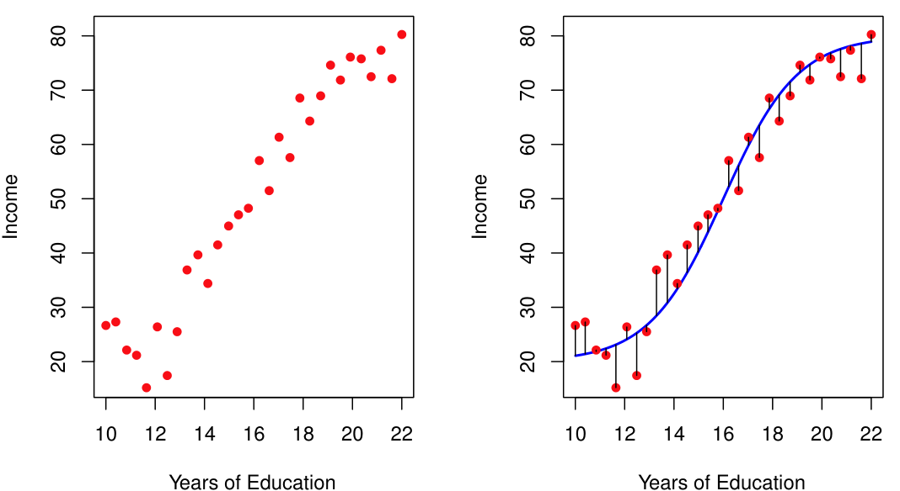


<!-- Start of picture text -->
10 12 14 16 18 20 22 10 12 14 16 18 20 22<br>Years of Education Years of Education<br>80 80<br>70 70<br>60 60<br>50 50<br>Income Income<br>40 40<br>30 30<br>20 20<br><!-- End of picture text -->

**FIGURE 2.2.** _The_ `Income` _data set._ Left: _The red dots are the observed values of_ `income` _(in thousands of dollars) and_ `years of education` _for_ 30 _individuals._ Right: _The blue curve represents the true underlying relationship between_ `income` _and_ `years of education` _, which is generally unknown (but is known in this case because the data were simulated). The black lines represent the error associated with each observation. Note that some errors are positive (if an observation lies above the blue curve) and some are negative (if an observation lies below the curve). Overall, these errors have approximately mean zero._ 

In essence, statistical learning refers to a set of approaches for estimating _f_ . In this chapter we outline some of the key theoretical concepts that arise in estimating _f_ , as well as tools for evaluating the estimates obtained. 

### _2.1.1 Why Estimate f ?_ 

There are two main reasons that we may wish to estimate _f_ : _prediction_ and _inference_ . We discuss each in turn. 

#### Prediction 

In many situations, a set of inputs _X_ are readily available, but the output _Y_ cannot be easily obtained. In this setting, since the error term averages to zero, we can predict _Y_ using 


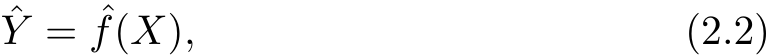


where _f_<sup>ˆ</sup> represents our estimate for _f_ , and _Y_<sup>ˆ</sup> represents the resulting prediction for _Y_ . In this setting, _f_<sup>ˆ</sup> is often treated as a _black box_ , in the sense that one is not typically concerned with the exact form of _f_<sup>ˆ</sup> , provided that it yields accurate predictions for _Y_ . 

As an example, suppose that _X_ 1 _, . . . , Xp_ are characteristics of a patient’s blood sample that can be easily measured in a lab, and _Y_ is a variable encoding the patient’s risk for a severe adverse reaction to a particular 

18 2. Statistical Learning 


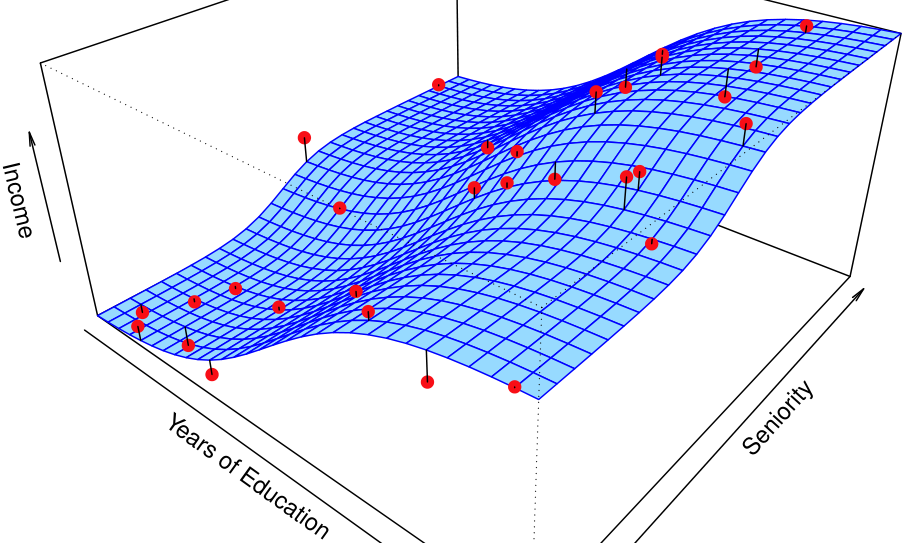


<!-- Start of picture text -->
Years of Education<br>Seniority<br>Income<br><!-- End of picture text -->

**FIGURE 2.3.** _The plot displays_ `income` _as a function of_ `years of education` _and_ `seniority` _in the_ `Income` _data set. The blue surface represents the true underlying relationship between_ `income` _and_ `years of education` _and_ `seniority` _, which is known since the data are simulated. The red dots indicate the observed values of these quantities for_ 30 _individuals._ 

drug. It is natural to seek to predict _Y_ using _X_ , since we can then avoid giving the drug in question to patients who are at high risk of an adverse reaction—that is, patients for whom the estimate of _Y_ is high. 

The accuracy of _Y_<sup>ˆ</sup> as a prediction for _Y_ depends on two quantities, whichˆ we will call the _reducible error_ and the _irreducible error_ . In general, reducible _f_ will not be a perfect estimate for _f_ , and this inaccuracy will introduce error some error. This error is _reducible_ because we can potentially improve the irreducible accuracy of _f_<sup>ˆ</sup> by using the most appropriate statistical learning technique to error estimate _f_ . However, even if it were possible to form a perfect estimate for _f_ , so that our estimated response took the form _Y_<sup>ˆ</sup> = _f_ ( _X_ ), our prediction would still have some error in it! This is because _Y_ is also a function of _ϵ_ , which, by definition, cannot be predicted using _X_ . Therefore, variability associated with _ϵ_ also affects the accuracy of our predictions. This is known as the _irreducible_ error, because no matter how well we estimate _f_ , we cannot reduce the error introduced by _ϵ_ . 

error irreducible error 

Why is the irreducible error larger than zero? The quantity _ϵ_ may contain unmeasured variables that are useful in predicting _Y_ : since we don’t measure them, _f_ cannot use them for its prediction. The quantity _ϵ_ may also contain unmeasurable variation. For example, the risk of an adverse reaction might vary for a given patient on a given day, depending on manufacturing variation in the drug itself or the patient’s general feeling of well-being on that day. 

2.1 What Is Statistical Learning? 19 

Consider a given estimate _f_<sup>ˆ</sup> and a set of predictors _X_ , which yields the prediction _Y_<sup>ˆ</sup> = _f_<sup>ˆ</sup> ( _X_ ). Assume for a moment that both _f_<sup>ˆ</sup> and _X_ are fixed, so that the only variability comes from _ϵ_ . Then, it is easy to show that 


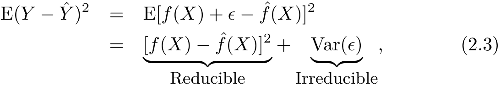


where E( _Y − Y_<sup>ˆ</sup> )<sup>2</sup> represents the average, or _expected value_ , of the squared expected difference between the predicted and actual value of _Y_ , and Var( _ϵ_ ) reprevalue sents the _variance_ associated with the error term _ϵ_ . 

value variance 

The focus of this book is on techniques for estimating _f_ with the aim of minimizing the reducible error. It is important to keep in mind that the irreducible error will always provide an upper bound on the accuracy of our prediction for _Y_ . This bound is almost always unknown in practice. 

#### Inference 

We are often interested in understanding the association between _Y_ and _X_ 1 _, . . . , Xp_ . In this situation we wish to estimate _f_ , but our goal is not necessarily to make predictions for _Y_ . Now _f_<sup>ˆ</sup> cannot be treated as a black box, because we need to know its exact form. In this setting, one may be interested in answering the following questions: 

- _Which predictors are associated with the response?_ It is often the case that only a small fraction of the available predictors are substantially associated with _Y_ . Identifying the few _important_ predictors among a large set of possible variables can be extremely useful, depending on the application. 

- _What is the relationship between the response and each predictor?_ Some predictors may have a positive relationship with _Y_ , in the sense that larger values of the predictor are associated with larger values of _Y_ . Other predictors may have the opposite relationship. Depending on the complexity of _f_ , the relationship between the response and a given predictor may also depend on the values of the other predictors. 

- _Can the relationship between Y and each predictor be adequately summarized using a linear equation, or is the relationship more complicated?_ Historically, most methods for estimating _f_ have taken a linear form. In some situations, such an assumption is reasonable or even desirable. But often the true relationship is more complicated, in which case a linear model may not provide an accurate representation of the relationship between the input and output variables. 

In this book, we will see a number of examples that fall into the prediction setting, the inference setting, or a combination of the two. 

20 2. Statistical Learning 

For instance, consider a company that is interested in conducting a direct-marketing campaign. The goal is to identify individuals who are likely to respond positively to a mailing, based on observations of demographic variables measured on each individual. In this case, the demographic variables serve as predictors, and response to the marketing campaign (either positive or negative) serves as the outcome. The company is not interested in obtaining a deep understanding of the relationships between each individual predictor and the response; instead, the company simply wants to accurately predict the response using the predictors. This is an example of modeling for prediction. 

In contrast, consider the `Advertising` data illustrated in Figure 2.1. One may be interested in answering questions such as: 

- _Which media are associated with sales?_ 

- _Which media generate the biggest boost in sales?_ or 

- _How large of an increase in sales is associated with a given increase in TV advertising?_ 

This situation falls into the inference paradigm. Another example involves modeling the brand of a product that a customer might purchase based on variables such as price, store location, discount levels, competition price, and so forth. In this situation one might really be most interested in the association between each variable and the probability of purchase. For instance, _to what extent is the product’s price associated with sales?_ This is an example of modeling for inference. 

Finally, some modeling could be conducted both for prediction and inference. For example, in a real estate setting, one may seek to relate values of homes to inputs such as crime rate, zoning, distance from a river, air quality, schools, income level of community, size of houses, and so forth. In this case one might be interested in the association between each individual input variable and housing price—for instance, _how much extra will a house be worth if it has a view of the river?_ This is an inference problem. Alternatively, one may simply be interested in predicting the value of a home given its characteristics: _is this house under- or over-valued?_ This is a prediction problem. 

Depending on whether our ultimate goal is prediction, inference, or a combination of the two, different methods for estimating _f_ may be appropriate. For example, _linear models_ allow for relatively simple and in- linear model terpretable inference, but may not yield as accurate predictions as some other approaches. In contrast, some of the highly non-linear approaches that we discuss in the later chapters of this book can potentially provide quite accurate predictions for _Y_ , but this comes at the expense of a less interpretable model for which inference is more challenging. 

2.1 What Is Statistical Learning? 21 

### _2.1.2 How Do We Estimate f ?_ 

Throughout this book, we explore many linear and non-linear approaches for estimating _f_ . However, these methods generally share certain characteristics. We provide an overview of these shared characteristics in this section. We will always assume that we have observed a set of _n_ different data points. For example in Figure 2.2 we observed _n_ = 30 data points. These observations are called the _training data_ because we will use these training observations to train, or teach, our method how to estimate _f_ . Let _xij_ data represent the value of the _j_ th predictor, or input, for observation _i_ , where _i_ = 1 _,_ 2 _, . . . , n_ and _j_ = 1 _,_ 2 _, . . . , p_ . Correspondingly, let _yi_ represent the response variable for the _i_ th observation. Then our training data consist of _{_ ( _x_ 1 _, y_ 1) _,_ ( _x_ 2 _, y_ 2) _, . . . ,_ ( _xn, yn_ ) _}_ where _xi_ = ( _xi_ 1 _, xi_ 2 _, . . . , xip_ )<sup>_T_</sup> . 

Our goal is to apply a statistical learning method to the training data in order to estimate the unknown function _f_ . In other words, we want to find a function _f_<sup>ˆ</sup> such that _Y ≈ f_<sup>ˆ</sup> ( _X_ ) for any observation ( _X, Y_ ). Broadly speaking, most statistical learning methods for this task can be characterized as either _parametric_ or _non-parametric_ . We now briefly discuss these parametric two types of approaches. 

nonparametric 

#### Parametric Methods 

Parametric methods involve a two-step model-based approach. 

1. First, we make an assumption about the functional form, or shape, of _f_ . For example, one very simple assumption is that _f_ is linear in _X_ : 


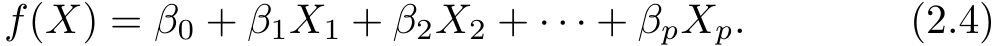


This is a _linear model_ , which will be discussed extensively in Chapter 3. Once we have assumed that _f_ is linear, the problem of estimating _f_ is greatly simplified. Instead of having to estimate an entirely arbitrary _p_ -dimensional function _f_ ( _X_ ), one only needs to estimate the _p_ + 1 coefficients _β_ 0 _, β_ 1 _, . . . , βp_ . 

2. After a model has been selected, we need a procedure that uses the training data to _fit_ or _train_ the model. In the case of the linear model fit 

(2.4), we need to estimate the parameters _β_ 0 _, β_ 1 _, . . . , βp_ . That is, we want to find values of these parameters such that 

train 


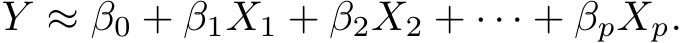


The most common approach to fitting the model (2.4) is referred to as _(ordinary) least squares_ , which we discuss in Chapter 3. However, least squares least squares is one of many possible ways to fit the linear model. In Chapter 6, we discuss other approaches for estimating the parameters in (2.4). 

22 2. Statistical Learning 


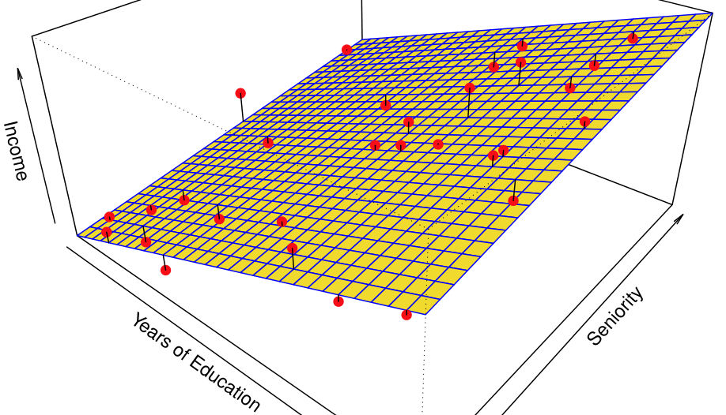


<!-- Start of picture text -->
Years of Education<br>Seniority<br>Income<br><!-- End of picture text -->

**FIGURE 2.4.** _A linear model fit by least squares to the_ `Income` _data from Figure 2.3. The observations are shown in red, and the yellow plane indicates the least squares fit to the data._ 

The model-based approach just described is referred to as _parametric_ ; it reduces the problem of estimating _f_ down to one of estimating a set of parameters. Assuming a parametric form for _f_ simplifies the problem of estimating _f_ because it is generally much easier to estimate a set of parameters, such as _β_ 0 _, β_ 1 _, . . . , βp_ in the linear model (2.4), than it is to fit an entirely arbitrary function _f_ . The potential disadvantage of a parametric approach is that the model we choose will usually not match the true unknown form of _f_ . If the chosen model is too far from the true _f_ , then our estimate will be poor. We can try to address this problem by choosing _flexible_ models that can fit many different possible functional forms flexible for _f_ . But in general, fitting a more flexible model requires estimating a greater number of parameters. These more complex models can lead to a phenomenon known as _overfitting_ the data, which essentially means they overfitting follow the errors, or _noise_ , too closely. These issues are discussed through- noise out this book. 

Figure 2.4 shows an example of the parametric approach applied to the `Income` data from Figure 2.3. We have fit a linear model of the form 

income _≈ β_ 0 + _β_ 1 _×_ education + _β_ 2 _×_ seniority _._ 

Since we have assumed a linear relationship between the response and the two predictors, the entire fitting problem reduces to estimating _β_ 0, _β_ 1, and _β_ 2, which we do using least squares linear regression. Comparing Figure 2.3 to Figure 2.4, we can see that the linear fit given in Figure 2.4 is not quite right: the true _f_ has some curvature that is not captured in the linear fit. However, the linear fit still appears to do a reasonable job of capturing the 

2.1 What Is Statistical Learning? 23 


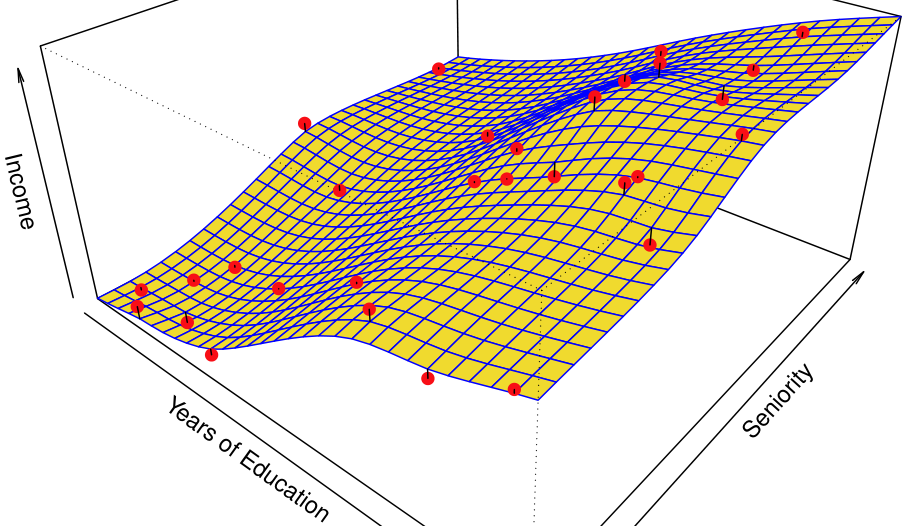


<!-- Start of picture text -->
Years of Education<br>Seniority<br>Income<br><!-- End of picture text -->

**FIGURE 2.5.** _A smooth thin-plate spline fit to the_ `Income` _data from Figure 2.3 is shown in yellow; the observations are displayed in red. Splines are discussed in Chapter 7._ 

positive relationship between `years of education` and `income` , as well as the slightly less positive relationship between `seniority` and `income` . It may be that with such a small number of observations, this is the best we can do. 

#### Non-Parametric Methods 

Non-parametric methods do not make explicit assumptions about the functional form of _f_ . Instead they seek an estimate of _f_ that gets as close to the data points as possible without being too rough or wiggly. Such approaches can have a major advantage over parametric approaches: by avoiding the assumption of a particular functional form for _f_ , they have the potential to accurately fit a wider range of possible shapes for _f_ . Any parametric approach brings with it the possibility that the functional form used to estimate _f_ is very different from the true _f_ , in which case the resulting model will not fit the data well. In contrast, non-parametric approaches completely avoid this danger, since essentially no assumption about the form of _f_ is made. But non-parametric approaches do suffer from a major disadvantage: since they do not reduce the problem of estimating _f_ to a small number of parameters, a very large number of observations (far more than is typically needed for a parametric approach) is required in order to obtain an accurate estimate for _f_ . 

An example of a non-parametric approach to fitting the `Income` data is shown in Figure 2.5. A _thin-plate spline_ is used to estimate _f_ . This ap- thin-plate proach does not impose any pre-specified model on _f_ . It instead attempts spline to produce an estimate for _f_ that is as close as possible to the observed data, subject to the fit—that is, the yellow surface in Figure 2.5—being 

24 2. Statistical Learning 


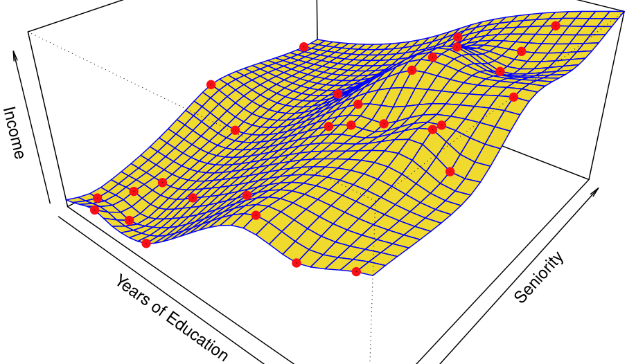


<!-- Start of picture text -->
Years of Education<br>Seniority<br>Income<br><!-- End of picture text -->

**FIGURE 2.6.** _A rough thin-plate spline fit to the_ `Income` _data from Figure 2.3. This fit makes zero errors on the training data._ 

_smooth_ . In this case, the non-parametric fit has produced a remarkably accurate estimate of the true _f_ shown in Figure 2.3. In order to fit a thin-plate spline, the data analyst must select a level of smoothness. Figure 2.6 shows the same thin-plate spline fit using a lower level of smoothness, allowing for a rougher fit. The resulting estimate fits the observed data perfectly! However, the spline fit shown in Figure 2.6 is far more variable than the true function _f_ , from Figure 2.3. This is an example of overfitting the data, which we discussed previously. It is an undesirable situation because the fit obtained will not yield accurate estimates of the response on new observations that were not part of the original training data set. We discuss methods for choosing the _correct_ amount of smoothness in Chapter 5. Splines are discussed in Chapter 7. 

As we have seen, there are advantages and disadvantages to parametric and non-parametric methods for statistical learning. We explore both types of methods throughout this book. 

### _2.1.3 The Trade-Off Between Prediction Accuracy and Model Interpretability_ 

Of the many methods that we examine in this book, some are less flexible, or more restrictive, in the sense that they can produce just a relatively small range of shapes to estimate _f_ . For example, linear regression is a relatively inflexible approach, because it can only generate linear functions such as the lines shown in Figure 2.1 or the plane shown in Figure 2.4. Other methods, such as the thin plate splines shown in Figures 2.5 and 2.6, 

2.1 What Is Statistical Learning? 25 


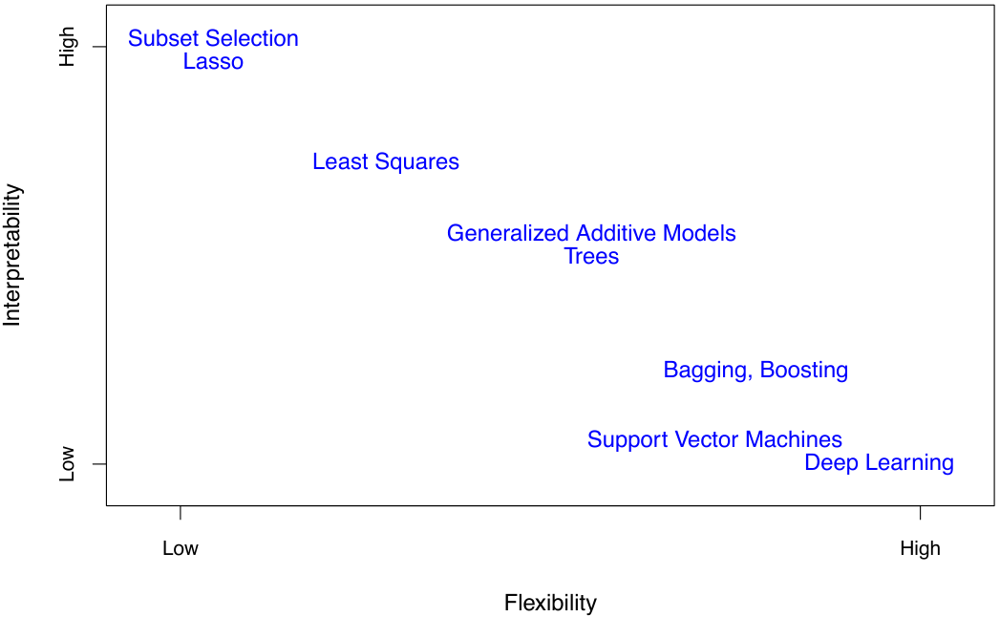


<!-- Start of picture text -->
Subset Selection<br>Lasso<br>Least Squares<br>Generalized Additive Models<br>Trees<br>Bagging, Boosting<br>Support Vector Machines<br>Deep Learning<br>Low High<br>Flexibility<br>High<br>Interpretability<br>Low<br><!-- End of picture text -->

**FIGURE 2.7.** _A representation of the tradeoff between flexibility and interpretability, using different statistical learning methods. In general, as the flexibility of a method increases, its interpretability decreases._ 

are considerably more flexible because they can generate a much wider range of possible shapes to estimate _f_ . 

One might reasonably ask the following question: _why would we ever choose to use a more restrictive method instead of a very flexible approach?_ There are several reasons that we might prefer a more restrictive model. If we are mainly interested in inference, then restrictive models are much more interpretable. For instance, when inference is the goal, the linear model may be a good choice since it will be quite easy to understand the relationship between _Y_ and _X_ 1 _, X_ 2 _, . . . , Xp_ . In contrast, very flexible approaches, such as the splines discussed in Chapter 7 and displayed in Figures 2.5 and 2.6, and the boosting methods discussed in Chapter 8, can lead to such complicated estimates of _f_ that it is difficult to understand how any individual predictor is associated with the response. 

Figure 2.7 provides an illustration of the trade-off between flexibility and interpretability for some of the methods that we cover in this book. Least squares linear regression, discussed in Chapter 3, is relatively inflexible but is quite interpretable. The _lasso_ , discussed in Chapter 6, relies upon the lasso linear model (2.4) but uses an alternative fitting procedure for estimating the coefficients _β_ 0 _, β_ 1 _, . . . , βp_ . The new procedure is more restrictive in estimating the coefficients, and sets a number of them to exactly zero. Hence in this sense the lasso is a less flexible approach than linear regression. It is also more interpretable than linear regression, because in the final model the response variable will only be related to a small subset of the predictors—namely, those with nonzero coefficient estimates. _Generalized additive models_ (GAMs), discussed in Chapter 7, instead extend the lin- generalized ear model (2.4) to allow for certain non-linear relationships. Consequently, 

additive model 

26 2. Statistical Learning 

GAMs are more flexible than linear regression. They are also somewhat less interpretable than linear regression, because the relationship between each predictor and the response is now modeled using a curve. Finally, fully non-linear methods such as _bagging_ , _boosting_ , _support vector machines_ bagging with non-linear kernels, and _neural networks_ (deep learning), discussed in boosting Chapters 8, 9, and 10, are highly flexible approaches that are harder to support interpret. 

boosting support vector machine 

We have established that when inference is the goal, there are clear advantages to using simple and relatively inflexible statistical learning methods. In some settings, however, we are only interested in prediction, and the interpretability of the predictive model is simply not of interest. For instance, if we seek to develop an algorithm to predict the price of a stock, our sole requirement for the algorithm is that it predict accurately— interpretability is not a concern. In this setting, we might expect that it will be best to use the most flexible model available. Surprisingly, this is not always the case! We will often obtain more accurate predictions using a less flexible method. This phenomenon, which may seem counterintuitive at first glance, has to do with the potential for overfitting in highly flexible methods. We saw an example of overfitting in Figure 2.6. We will discuss this very important concept further in Section 2.2 and throughout this book. 

### _2.1.4 Supervised Versus Unsupervised Learning_ 

Most statistical learning problems fall into one of two categories: _supervised_ supervised or _unsupervised_ . The examples that we have discussed so far in this chap- unsupervised ter all fall into the supervised learning domain. For each observation of the predictor measurement(s) _xi_ , _i_ = 1 _, . . . , n_ there is an associated response measurement _yi_ . We wish to fit a model that relates the response to the predictors, with the aim of accurately predicting the response for future observations (prediction) or better understanding the relationship between the response and the predictors (inference). Many classical statistical learning methods such as linear regression and _logistic regression_ (Chapter 4), as logistic well as more modern approaches such as GAM, boosting, and support vecregression tor machines, operate in the supervised learning domain. The vast majority of this book is devoted to this setting. 

By contrast, unsupervised learning describes the somewhat more challenging situation in which for every observation _i_ = 1 _, . . . , n_ , we observe a vector of measurements _xi_ but no associated response _yi_ . It is not possible to fit a linear regression model, since there is no response variable to predict. In this setting, we are in some sense working blind; the situation is referred to as _unsupervised_ because we lack a response variable that can supervise our analysis. What sort of statistical analysis is possible? We can seek to understand the relationships between the variables or between the observations. One statistical learning tool that we may use 

2.1 What Is Statistical Learning? 27 


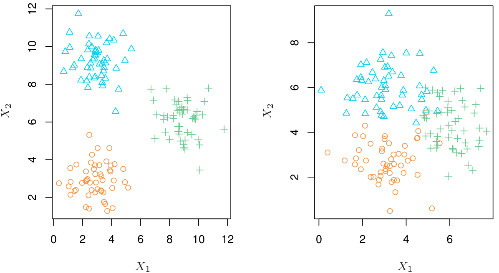


<!-- Start of picture text -->
0 2 4 6 8 10 12 0 2 4 6<br>X1 X1<br>12<br>10 8<br>8 6<br>2 2<br>X X<br>6<br>4<br>4<br>2<br>2<br><!-- End of picture text -->

**FIGURE 2.8.** _A clustering data set involving three groups. Each group is shown using a different colored symbol._ Left: _The three groups are well-separated. In this setting, a clustering approach should successfully identify the three groups._ Right: _There is some overlap among the groups. Now the clustering task is more challenging._ 

in this setting is _cluster analysis_ , or clustering. The goal of cluster analysis cluster is to ascertain, on the basis of _x_ 1 _, . . . , xn_ , whether the observations fall into analysis relatively distinct groups. For example, in a market segmentation study we might observe multiple characteristics (variables) for potential customers, such as zip code, family income, and shopping habits. We might believe that the customers fall into different groups, such as big spenders versus low spenders. If the information about each customer’s spending patterns were available, then a supervised analysis would be possible. However, this information is not available—that is, we do not know whether each potential customer is a big spender or not. In this setting, we can try to cluster the customers on the basis of the variables measured, in order to identify distinct groups of potential customers. Identifying such groups can be of interest because it might be that the groups differ with respect to some property of interest, such as spending habits. 

analysis 

Figure 2.8 provides a simple illustration of the clustering problem. We have plotted 150 observations with measurements on two variables, _X_ 1 and _X_ 2. Each observation corresponds to one of three distinct groups. For illustrative purposes, we have plotted the members of each group using different colors and symbols. However, in practice the group memberships are unknown, and the goal is to determine the group to which each observation belongs. In the left-hand panel of Figure 2.8, this is a relatively easy task because the groups are well-separated. By contrast, the right-hand panel illustrates a more challenging setting in which there is some overlap 

28 2. Statistical Learning 

between the groups. A clustering method could not be expected to assign all of the overlapping points to their correct group (blue, green, or orange). 

In the examples shown in Figure 2.8, there are only two variables, and so one can simply visually inspect the scatterplots of the observations in order to identify clusters. However, in practice, we often encounter data sets that contain many more than two variables. In this case, we cannot easily plot the observations. For instance, if there are _p_ variables in our data set, then _p_ ( _p −_ 1) _/_ 2 distinct scatterplots can be made, and visual inspection is simply not a viable way to identify clusters. For this reason, automated clustering methods are important. We discuss clustering and other unsupervised learning approaches in Chapter 12. 

Many problems fall naturally into the supervised or unsupervised learning paradigms. However, sometimes the question of whether an analysis should be considered supervised or unsupervised is less clear-cut. For instance, suppose that we have a set of _n_ observations. For _m_ of the observations, where _m < n_ , we have both predictor measurements and a response measurement. For the remaining _n − m_ observations, we have predictor measurements but no response measurement. Such a scenario can arise if the predictors can be measured relatively cheaply but the corresponding responses are much more expensive to collect. We refer to this setting as a _semi-supervised learning_ problem. In this setting, we wish to use a sta- semitistical learning method that can incorporate the _m_ observations for which response measurements are available as well as the _n − m_ observations for which they are not. Although this is an interesting topic, it is beyond the scope of this book. 

supervised learning 

### _2.1.5 Regression Versus Classification Problems_ 

Variables can be characterized as either _quantitative_ or _qualitative_ (also quantitative known as _categorical_ ). Quantitative variables take on numerical values. Exqualitative amples include a person’s age, height, or income, the value of a house, and categorical the price of a stock. In contrast, qualitative variables take on values in one of _K_ different _classes_ , or categories. Examples of qualitative variables class include a person’s marital status (married or not), the brand of product purchased (brand A, B, or C), whether a person defaults on a debt (yes or no), or a cancer diagnosis (Acute Myelogenous Leukemia, Acute Lymphoblastic Leukemia, or No Leukemia). We tend to refer to problems with a quantitative response as _regression_ problems, while those involving a regression qualitative response are often referred to as _classification_ problems. How- classification ever, the distinction is not always that crisp. Least squares linear regression (Chapter 3) is used with a quantitative response, whereas logistic regression (Chapter 4) is typically used with a qualitative (two-class, or _binary_ ) response. Thus, despite its name, logistic regression is a classification method. binary But since it estimates class probabilities, it can be thought of as a regression method as well. Some statistical methods, such as _K_ -nearest neighbors 

2.2 Assessing Model Accuracy 29 

(Chapters 2 and 4) and boosting (Chapter 8), can be used in the case of either quantitative or qualitative responses. 

We tend to select statistical learning methods on the basis of whether the response is quantitative or qualitative; i.e. we might use linear regression when quantitative and logistic regression when qualitative. However, whether the _predictors_ are qualitative or quantitative is generally considered less important. Most of the statistical learning methods discussed in this book can be applied regardless of the predictor variable type, provided that any qualitative predictors are properly _coded_ before the analysis is performed. This is discussed in Chapter 3. 

## 2.2 Assessing Model Accuracy 

One of the key aims of this book is to introduce the reader to a wide range of statistical learning methods that extend far beyond the standard linear regression approach. Why is it necessary to introduce so many different statistical learning approaches, rather than just a single _best_ method? _There is no free lunch in statistics:_ no one method dominates all others over all possible data sets. On a particular data set, one specific method may work best, but some other method may work better on a similar but different data set. Hence it is an important task to decide for any given set of data which method produces the best results. Selecting the best approach can be one of the most challenging parts of performing statistical learning in practice. 

In this section, we discuss some of the most important concepts that arise in selecting a statistical learning procedure for a specific data set. As the book progresses, we will explain how the concepts presented here can be applied in practice. 

### _2.2.1 Measuring the Quality of Fit_ 

In order to evaluate the performance of a statistical learning method on a given data set, we need some way to measure how well its predictions actually match the observed data. That is, we need to quantify the extent to which the predicted response value for a given observation is close to the true response value for that observation. In the regression setting, the most commonly-used measure is the _mean squared error_ (MSE), given by 


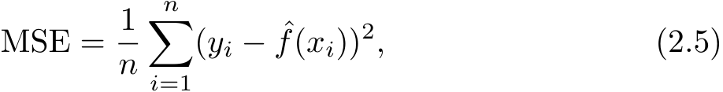


mean squared error 

where _f_<sup>ˆ</sup> ( _xi_ ) is the prediction that _f_<sup>ˆ</sup> gives for the _i_ th observation. The MSE will be small if the predicted responses are very close to the true responses, 

30 2. Statistical Learning 

and will be large if for some of the observations, the predicted and true responses differ substantially. 

The MSE in (2.5) is computed using the training data that was used to fit the model, and so should more accurately be referred to as the _training MSE_ . But in general, we do not really care how well the method works training on the training data. Rather, _we are interested in the accuracy of the pre-_ MSE _dictions that we obtain when we apply our method to previously unseen test data_ . Why is this what we care about? Suppose that we are interested test data in developing an algorithm to predict a stock’s price based on previous stock returns. We can train the method using stock returns from the past 6 months. But we don’t really care how well our method predicts last week’s stock price. We instead care about how well it will predict tomorrow’s price or next month’s price. On a similar note, suppose that we have clinical measurements (e.g. weight, blood pressure, height, age, family history of disease) for a number of patients, as well as information about whether each patient has diabetes. We can use these patients to train a statistical learning method to predict risk of diabetes based on clinical measurements. In practice, we want this method to accurately predict diabetes risk for _future patients_ based on their clinical measurements. We are not very interested in whether or not the method accurately predicts diabetes risk for patients used to train the model, since we already know which of those patients have diabetes. 

To state it more mathematically, suppose that we fit our statistical learning method on our training observations _{_ ( _x_ 1 _, y_ 1) _,_ ( _x_ 2 _, y_ 2) _, . . . ,_ ( _xn, yn_ ) _}_ , and we obtain the estimate _f_<sup>ˆ</sup> . We can then compute _f_<sup>ˆ</sup> ( _x_ 1) _, f_<sup>ˆ</sup> ( _x_ 2) _, . . . , f_<sup>ˆ</sup> ( _xn_ ). If these are approximately equal to _y_ 1 _, y_ 2 _, . . . , yn_ , then the training MSE givenˆ by (2.5) is small. However, we are reallyˆ not interested in whether _f_ ( _xi_ ) _≈ yi_ ; instead, we want to know whether _f_ ( _x_ 0) is approximately equal to _y_ 0, where ( _x_ 0 _, y_ 0) is a _previously unseen test observation not used to train the statistical learning method_ . We want to choose the method that gives the lowest _test MSE_ , as opposed to the lowest training MSE. In other words, test MSE if we had a large number of test observations, we could compute 


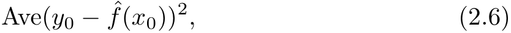


the average squared prediction error for these test observations ( _x_ 0 _, y_ 0). We’d like to select the model for which this quantity is as small as possible. How can we go about trying to select a method that minimizes the test MSE? In some settings, we may have a test data set available—that is, we may have access to a set of observations that were not used to train the statistical learning method. We can then simply evaluate (2.6) on the test observations, and select the learning method for which the test MSE is smallest. But what if no test observations are available? In that case, one might imagine simply selecting a statistical learning method that minimizes the training MSE (2.5). This seems like it might be a sensible approach, 

2.2 Assessing Model Accuracy 31 


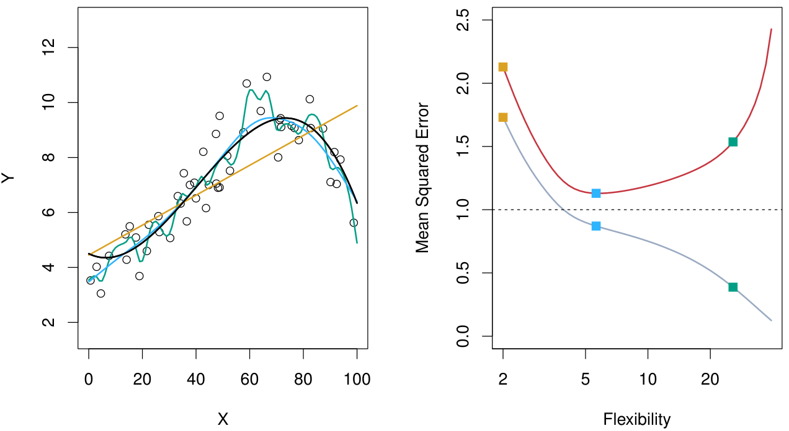


<!-- Start of picture text -->
0 20 40 60 80 100 2 5 10 20<br>X Flexibility<br>2.5<br>12<br>2.0<br>10<br>8 1.5<br>Y<br>6 1.0<br>Mean Squared Error<br>4 0.5<br>2 0.0<br><!-- End of picture text -->

**FIGURE 2.9.** Left: _Data simulated from f , shown in black. Three estimates of f are shown: the linear regression line (orange curve), and two smoothing spline fits (blue and green curves)._ Right: _Training MSE (grey curve), test MSE (red curve), and minimum possible test MSE over all methods (dashed line). Squares represent the training and test MSEs for the three fits shown in the left-hand panel._ 

since the training MSE and the test MSE appear to be closely related. Unfortunately, there is a fundamental problem with this strategy: there is no guarantee that the method with the lowest training MSE will also have the lowest test MSE. Roughly speaking, the problem is that many statistical methods specifically estimate coefficients so as to minimize the training set MSE. For these methods, the training set MSE can be quite small, but the test MSE is often much larger. 

Figure 2.9 illustrates this phenomenon on a simple example. In the lefthand panel of Figure 2.9, we have generated observations from (2.1) with the true _f_ given by the black curve. The orange, blue and green curves illustrate three possible estimates for _f_ obtained using methods with increasing levels of flexibility. The orange line is the linear regression fit, which is relatively inflexible. The blue and green curves were produced using _smoothing splines_ , discussed in Chapter 7, with different levels of smoothness. It is smoothing clear that as the level of flexibility increases, the curves fit the observed spline data more closely. The green curve is the most flexible and matches the data very well; however, we observe that it fits the true _f_ (shown in black) poorly because it is too wiggly. By adjusting the level of flexibility of the smoothing spline fit, we can produce many different fits to this data. 

We now move on to the right-hand panel of Figure 2.9. The grey curve displays the average training MSE as a function of flexibility, or more formally the _degrees of freedom_ , for a number of smoothing splines. The degrees of degrees of freedom is a quantity that summarizes the flexibility of a curve; freedom 

freedom 

32 2. Statistical Learning 

it is discussed more fully in Chapter 7. The orange, blue and green squares indicate the MSEs associated with the corresponding curves in the lefthand panel. A more restricted and hence smoother curve has fewer degrees of freedom than a wiggly curve—note that in Figure 2.9, linear regression is at the most restrictive end, with two degrees of freedom. The training MSE declines monotonically as flexibility increases. In this example the true _f_ is non-linear, and so the orange linear fit is not flexible enough to estimate _f_ well. The green curve has the lowest training MSE of all three methods, since it corresponds to the most flexible of the three curves fit in the left-hand panel. 

In this example, we know the true function _f_ , and so we can also compute the test MSE over a very large test set, as a function of flexibility. (Of course, in general _f_ is unknown, so this will not be possible.) The test MSE is displayed using the red curve in the right-hand panel of Figure 2.9. As with the training MSE, the test MSE initially declines as the level of flexibility increases. However, at some point the test MSE levels off and then starts to increase again. Consequently, the orange and green curves both have high test MSE. The blue curve minimizes the test MSE, which should not be surprising given that visually it appears to estimate _f_ the best in the left-hand panel of Figure 2.9. The horizontal dashed line indicates Var( _ϵ_ ), the irreducible error in (2.3), which corresponds to the lowest achievable test MSE among all possible methods. Hence, the smoothing spline represented by the blue curve is close to optimal. 

In the right-hand panel of Figure 2.9, as the flexibility of the statistical learning method increases, we observe a monotone decrease in the training MSE and a _U-shape_ in the test MSE. This is a fundamental property of statistical learning that holds regardless of the particular data set at hand and regardless of the statistical method being used. As model flexibility increases, the training MSE will decrease, but the test MSE may not. When a given method yields a small training MSE but a large test MSE, we are said to be _overfitting_ the data. This happens because our statistical learning procedure is working too hard to find patterns in the training data, and may be picking up some patterns that are just caused by random chance rather than by true properties of the unknown function _f_ . When we overfit the training data, the test MSE will be very large because the supposed patterns that the method found in the training data simply don’t exist in the test data. Note that regardless of whether or not overfitting has occurred, we almost always expect the training MSE to be smaller than the test MSE because most statistical learning methods either directly or indirectly seek to minimize the training MSE. Overfitting refers specifically to the case in which a less flexible model would have yielded a smaller test MSE. 

Figure 2.10 provides another example in which the true _f_ is approximately linear. Again we observe that the training MSE decreases monotonically as the model flexibility increases, and that there is a U-shape in 

2.2 Assessing Model Accuracy 33 


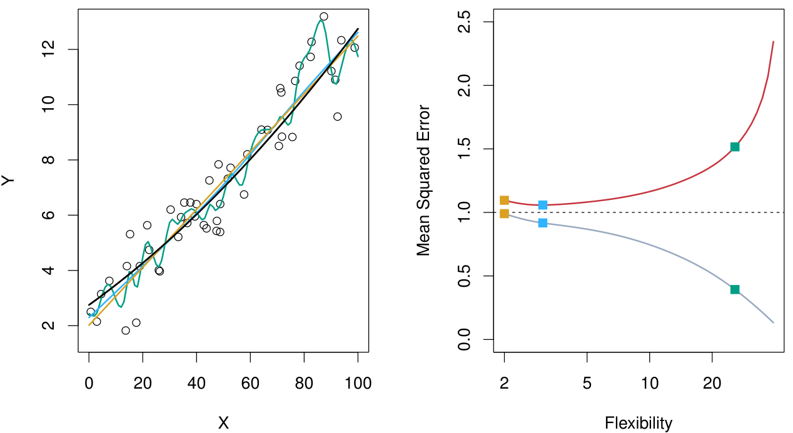


<!-- Start of picture text -->
0 20 40 60 80 100 2 5 10 20<br>X Flexibility<br>2.5<br>12<br>2.0<br>10<br>8 1.5<br>Y<br>6 1.0<br>Mean Squared Error<br>4 0.5<br>2 0.0<br><!-- End of picture text -->

**FIGURE 2.10.** _Details are as in Figure 2.9, using a different true f that is much closer to linear. In this setting, linear regression provides a very good fit to the data._ 

the test MSE. However, because the truth is close to linear, the test MSE only decreases slightly before increasing again, so that the orange least squares fit is substantially better than the highly flexible green curve. Finally, Figure 2.11 displays an example in which _f_ is highly non-linear. The training and test MSE curves still exhibit the same general patterns, but now there is a rapid decrease in both curves before the test MSE starts to increase slowly. 

In practice, one can usually compute the training MSE with relative ease, but estimating the test MSE is considerably more difficult because usually no test data are available. As the previous three examples illustrate, the flexibility level corresponding to the model with the minimal test MSE can vary considerably among data sets. Throughout this book, we discuss a variety of approaches that can be used in practice to estimate this minimum point. One important method is _cross-validation_ (Chapter 5), which is a crossmethod for estimating the test MSE using the training data. 

validation 

### _2.2.2 The Bias-Variance Trade-Off_ 

The U-shape observed in the test MSE curves (Figures 2.9–2.11) turns out to be the result of two competing properties of statistical learning methods. Though the mathematical proof is beyond the scope of this book, it is possible to show that the expected test MSE, for a given value _x_ 0, can always be decomposed into the sum of three fundamental quantities: the _variance_ of _f_<sup>ˆ</sup> ( _x_ 0), the squared _bias_ of _f_<sup>ˆ</sup> ( _x_ 0) and the variance of the error variance 

bias 

34 2. Statistical Learning 


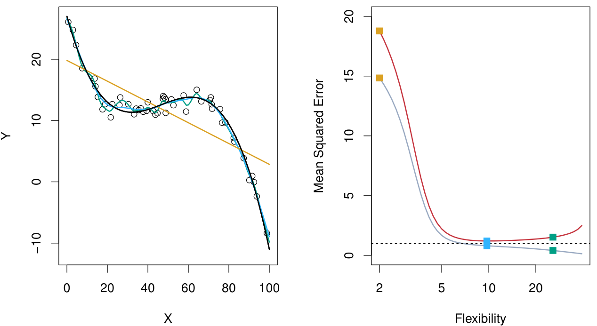


<!-- Start of picture text -->
0 20 40 60 80 100 2 5 10 20<br>X Flexibility<br>20<br>20<br>15<br>10<br>Y 10<br>0<br>Mean Squared Error<br>5<br>−10 0<br><!-- End of picture text -->

**FIGURE 2.11.** _Details are as in Figure 2.9, using a different f that is far from linear. In this setting, linear regression provides a very poor fit to the data._ 

terms _ϵ_ . That is, 


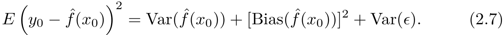


2 Here the notation _E_ � _y_ 0 _− f_<sup>ˆ</sup> ( _x_ 0)� defines the _expected test MSE_ at _x_ 0, expected and refers to the average test MSE that we would obtain if we repeatedly test MSE estimated _f_ using a large number of training sets, and tested each at _x_ 0. The 2 overall expected test MSE can be computed by averaging _E y_ 0 _− f_<sup>ˆ</sup> ( _x_ 0) � � over all possible values of _x_ 0 in the test set. Equation 2.7 tells us that in order to minimize the expected test error, we need to select a statistical learning method that simultaneously achieves _low variance_ and _low bias_ . Note that variance is inherently a nonnegative quantity, and squared bias is also nonnegative. Hence, we see that the expected test MSE can never lie below Var( _ϵ_ ), the irreducible error from (2.3). 

test MSE 

What do we mean by the _variance_ and _bias_ of a statistical learning method? _Variance_ refers to the amount by which _f_<sup>ˆ</sup> would change if we estimated it using a different training data set. Since the training data are used to fit the statistical learning method, different training data sets will result in a different _f_<sup>ˆ</sup> . But ideally the estimate for _f_ should not vary too much between training sets. However, if a method has high variance then small changes in the training data can result in large changes in _f_<sup>ˆ</sup> . In general, more flexible statistical methods have higher variance. Consider the green and orange curves in Figure 2.9. The flexible green curve is following the observations very closely. It has high variance because changing any 

2.2 Assessing Model Accuracy 35 

one of these data points may cause the estimate _f_<sup>ˆ</sup> to change considerably. In contrast, the orange least squares line is relatively inflexible and has low variance, because moving any single observation will likely cause only a small shift in the position of the line. 

On the other hand, _bias_ refers to the error that is introduced by approximating a real-life problem, which may be extremely complicated, by a much simpler model. For example, linear regression assumes that there is a linear relationship between _Y_ and _X_ 1 _, X_ 2 _, . . . , Xp_ . It is unlikely that any real-life problem truly has such a simple linear relationship, and so performing linear regression will undoubtedly result in some bias in the estimate of _f_ . In Figure 2.11, the true _f_ is substantially non-linear, so no matter how many training observations we are given, it will not be possible to produce an accurate estimate using linear regression. In other words, linear regression results in high bias in this example. However, in Figure 2.10 the true _f_ is very close to linear, and so given enough data, it should be possible for linear regression to produce an accurate estimate. Generally, more flexible methods result in less bias. 

As a general rule, as we use more flexible methods, the variance will increase and the bias will decrease. The relative rate of change of these two quantities determines whether the test MSE increases or decreases. As we increase the flexibility of a class of methods, the bias tends to initially decrease faster than the variance increases. Consequently, the expected test MSE declines. However, at some point increasing flexibility has little impact on the bias but starts to significantly increase the variance. When this happens the test MSE increases. Note that we observed this pattern of decreasing test MSE followed by increasing test MSE in the right-hand panels of Figures 2.9–2.11. 

The three plots in Figure 2.12 illustrate Equation 2.7 for the examples in Figures 2.9–2.11. In each case the blue solid curve represents the squared bias, for different levels of flexibility, while the orange curve corresponds to the variance. The horizontal dashed line represents Var( _ϵ_ ), the irreducible error. Finally, the red curve, corresponding to the test set MSE, is the sum of these three quantities. In all three cases, the variance increases and the bias decreases as the method’s flexibility increases. However, the flexibility level corresponding to the optimal test MSE differs considerably among the three data sets, because the squared bias and variance change at different rates in each of the data sets. In the left-hand panel of Figure 2.12, the bias initially decreases rapidly, resulting in an initial sharp decrease in the expected test MSE. On the other hand, in the center panel of Figure 2.12 the true _f_ is close to linear, so there is only a small decrease in bias as flexibility increases, and the test MSE only declines slightly before increasing rapidly as the variance increases. Finally, in the right-hand panel of Figure 2.12, as flexibility increases, there is a dramatic decline in bias because the true _f_ is very non-linear. There is also very little increase in variance 

36 2. Statistical Learning 


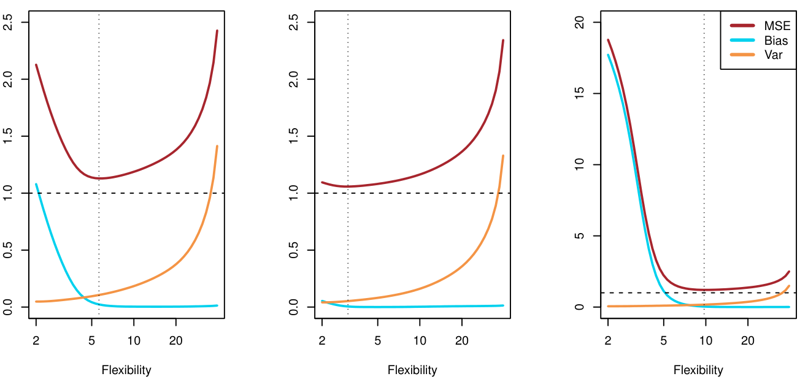


<!-- Start of picture text -->
MSE<br>Bias<br>Var<br>2 5 10 20 2 5 10 20 2 5 10 20<br>Flexibility Flexibility Flexibility<br>2.5 2.5 20<br>2.0 2.0<br>15<br>1.5 1.5<br>10<br>1.0 1.0<br>5<br>0.5 0.5<br>0.0 0.0 0<br><!-- End of picture text -->

**FIGURE 2.12.** _Squared bias (blue curve), variance (orange curve), Var_ ( _ϵ_ ) _(dashed line), and test MSE (red curve) for the three data sets in Figures 2.9–2.11. The vertical dotted line indicates the flexibility level corresponding to the smallest test MSE._ 

as flexibility increases. Consequently, the test MSE declines substantially before experiencing a small increase as model flexibility increases. 

The relationship between bias, variance, and test set MSE given in Equation 2.7 and displayed in Figure 2.12 is referred to as the _bias-variance trade-off_ . Good test set performance of a statistical learning method re- bias-variance quires low variance as well as low squared bias. This is referred to as a trade-off trade-off because it is easy to obtain a method with extremely low bias but high variance (for instance, by drawing a curve that passes through every single training observation) or a method with very low variance but high bias (by fitting a horizontal line to the data). The challenge lies in finding a method for which both the variance and the squared bias are low. This trade-off is one of the most important recurring themes in this book. 

In a real-life situation in which _f_ is unobserved, it is generally not possible to explicitly compute the test MSE, bias, or variance for a statistical learning method. Nevertheless, one should always keep the bias-variance trade-off in mind. In this book we explore methods that are extremely flexible and hence can essentially eliminate bias. However, this does not guarantee that they will outperform a much simpler method such as linear regression. To take an extreme example, suppose that the true _f_ is linear. In this situation linear regression will have no bias, making it very hard for a more flexible method to compete. In contrast, if the true _f_ is highly non-linear and we have an ample number of training observations, then we may do better using a highly flexible approach, as in Figure 2.11. In Chapter 5 we discuss cross-validation, which is a way to estimate the test MSE using the training data. 

2.2 Assessing Model Accuracy 37 

### _2.2.3 The Classification Setting_ 

Thus far, our discussion of model accuracy has been focused on the regression setting. But many of the concepts that we have encountered, such as the bias-variance trade-off, transfer over to the classification setting with only some modifications due to the fact that _yi_ is no longer quantitative. Suppose that we seek to estimate _f_ on the basis of training observations _{_ ( _x_ 1 _, y_ 1) _, . . . ,_ ( _xn, yn_ ) _}_ , where now _y_ 1 _, . . . , yn_ are qualitative. The most common approach for quantifying the accuracy of our estimate _f_<sup>ˆ</sup> is the trainingour estimate _error ratef_<sup>ˆ</sup> to the , the proportion of mistakes that are made if we applytraining observations: error rate 


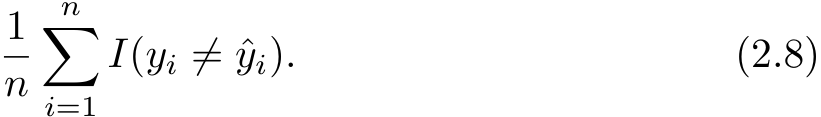


Here _y_ ˆ _i_ is the predicted class label for the _i_ th observation using _f_<sup>ˆ</sup> . And ˆ ˆ ˆ _I_ ( _yi_ = _yi_ ) is an _indicator variable_ that equals 1 if _yi_ = _yi_ and zero if _yi_ = _yi_ . ˆ indicator If _I_ ( _yi_ = _yi_ ) = 0 then the _i_ th observation was classified correctly by our variable classification method; otherwise it was misclassified. Hence Equation 2.8 computes the fraction of incorrect classifications. 

Equation 2.8 is referred to as the _training error_ rate because it is com- training puted based on the data that was used to train our classifier. As in the error regression setting, we are most interested in the error rates that result from applying our classifier to test observations that were not used in training. The _test error_ rate associated with a set of test observations of the form test error ( _x_ 0 _, y_ 0) is given by 


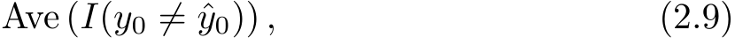


where _y_ ˆ0 is the predicted class label that results from applying the classifier to the test observation with predictor _x_ 0. A _good_ classifier is one for which the test error (2.9) is smallest. 

The Bayes Classifier 

It is possible to show (though the proof is outside of the scope of this book) that the test error rate given in (2.9) is minimized, on average, by a very simple classifier that _assigns each observation to the most likely class, given its predictor values_ . In other words, we should simply assign a test observation with predictor vector _x_ 0 to the class _j_ for which 


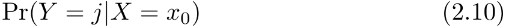


is largest. Note that (2.10) is a _conditional probability_ : it is the probability conditional that _Y_ = _j_ , given the observed predictor vector _x_ 0. This very simple clasprobability sifier is called the _Bayes classifier_ . In a two-class problem where there are Bayes only two possible response values, say _class 1_ or _class 2_ , the Bayes classifier 

probability Bayes classifier 

38 2. Statistical Learning 


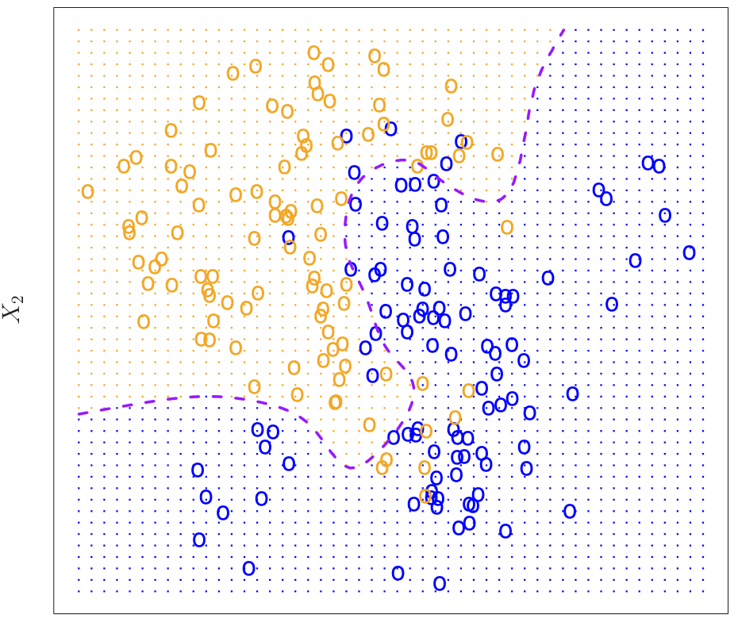


<!-- Start of picture text -->
o o oooooooooooooooooooooooooo oooo oooooooooooooo o ooooooo o ooooooooooooooooo o o ooooooooo ooooooo o oooooooooooooooo o ooooooooooooooooooooooooooo oooooooooooo ooooooooooo oooooooo o o o o o oo oo oo o<br>oo o oooooo o oo o<br>o o o o<br>o o<br>o<br>X2<br><!-- End of picture text -->

X1 

**FIGURE 2.13.** _A simulated data set consisting of_ 100 _observations in each of two groups, indicated in blue and in orange. The purple dashed line represents the Bayes decision boundary. The orange background grid indicates the region in which a test observation will be assigned to the orange class, and the blue background grid indicates the region in which a test observation will be assigned to the blue class._ 

corresponds to predicting class one if Pr( _Y_ = 1 _|X_ = _x_ 0) _>_ 0 _._ 5, and class two otherwise. 

Figure 2.13 provides an example using a simulated data set in a twodimensional space consisting of predictors _X_ 1 and _X_ 2. The orange and blue circles correspond to training observations that belong to two different classes. For each value of _X_ 1 and _X_ 2, there is a different probability of the response being orange or blue. Since this is simulated data, we know how the data were generated and we can calculate the conditional probabilities for each value of _X_ 1 and _X_ 2. The orange shaded region reflects the set of points for which Pr( _Y_ = orange _|X_ ) is greater than 50 %, while the blue shaded region indicates the set of points for which the probability is below 50 %. The purple dashed line represents the points where the probability is exactly 50 %. This is called the _Bayes decision boundary_ . The Bayes Bayes classifier’s prediction is determined by the Bayes decision boundary; an observation that falls on the orange side of the boundary will be assigned to the orange class, and similarly an observation on the blue side of the boundary will be assigned to the blue class. 

decision boundary 

The Bayes classifier produces the lowest possible test error rate, called thefor which (2.10) is largest, the error rate will be _Bayes error rate_ . Since the Bayes classifier 1will _−_ maxalways _j_ Pr(choose _Y_ = _j|_ the _X_ =class _x_ 0) Bayesrate error 

rate 

2.2 Assessing Model Accuracy 39 

at _X_ = _x_ 0. In general, the overall Bayes error rate is given by 


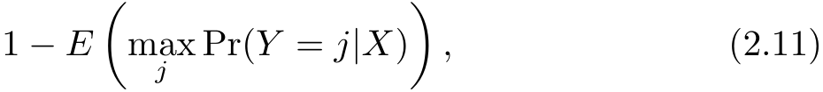


where the expectation averages the probability over all possible values of _X_ . For our simulated data, the Bayes error rate is 0 _._ 133. It is greater than zero, because the classes overlap in the true population, which implies that max _j_ Pr( _Y_ = _j|X_ = _x_ 0) _<_ 1 for some values of _x_ 0. The Bayes error rate is analogous to the irreducible error, discussed earlier. 

#### _K_ -Nearest Neighbors 

In theory we would always like to predict qualitative responses using the Bayes classifier. But for real data, we do not know the conditional distribution of _Y_ given _X_ , and so computing the Bayes classifier is impossible. Therefore, the Bayes classifier serves as an unattainable gold standard against which to compare other methods. Many approaches attempt to estimate the conditional distribution of _Y_ given _X_ , and then classify a given observation to the class with highest _estimated_ probability. One such method is the _K-nearest neighbors_ (KNN) classifier. Given a positive in- _K_ -nearest teger _K_ and a test observation _x_ 0, the KNN classifier first identifies the neighbors _K_ points in the training data that are closest to _x_ 0, represented by _N_ 0. It then estimates the conditional probability for class _j_ as the fraction of points in _N_ 0 whose response values equal _j_ : 


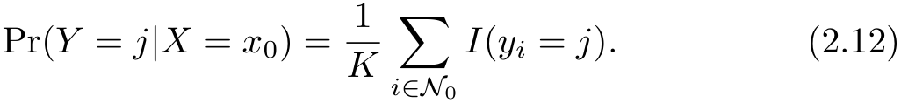


Finally, KNN classifies the test observation _x_ 0 to the class with the largest probability from (2.12). 

Figure 2.14 provides an illustrative example of the KNN approach. In the left-hand panel, we have plotted a small training data set consisting of six blue and six orange observations. Our goal is to make a prediction for the point labeled by the black cross. Suppose that we choose _K_ = 3. Then KNN will first identify the three observations that are closest to the cross. This neighborhood is shown as a circle. It consists of two blue points and one orange point, resulting in estimated probabilities of 2 _/_ 3 for the blue class and 1 _/_ 3 for the orange class. Hence KNN will predict that the black cross belongs to the blue class. In the right-hand panel of Figure 2.14 we have applied the KNN approach with _K_ = 3 at all of the possible values for _X_ 1 and _X_ 2, and have drawn in the corresponding KNN decision boundary. 

Despite the fact that it is a very simple approach, KNN can often produce classifiers that are surprisingly close to the optimal Bayes classifier. Figure 2.15 displays the KNN decision boundary, using _K_ = 10, when applied to the larger simulated data set from Figure 2.13. Notice that even 

40 2. Statistical Learning 


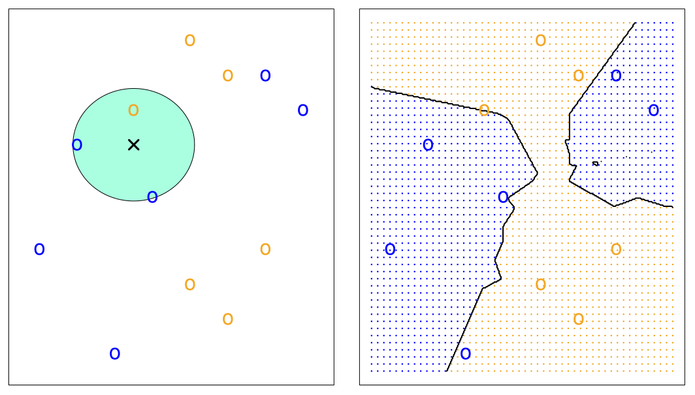


<!-- Start of picture text -->
o o<br>o o o o<br>o o o o<br>o o<br>o o<br>o o o o<br>o o<br>o o<br>o o<br><!-- End of picture text -->

**FIGURE 2.14.** _The KNN approach, using K_ = 3 _, is illustrated in a simple situation with six blue observations and six orange observations._ Left: _a test observation at which a predicted class label is desired is shown as a black cross. The three closest points to the test observation are identified, and it is predicted that the test observation belongs to the most commonly-occurring class, in this case blue._ Right: _The KNN decision boundary for this example is shown in black. The blue grid indicates the region in which a test observation will be assigned to the blue class, and the orange grid indicates the region in which it will be assigned to the orange class._ 

KNN: K=10 


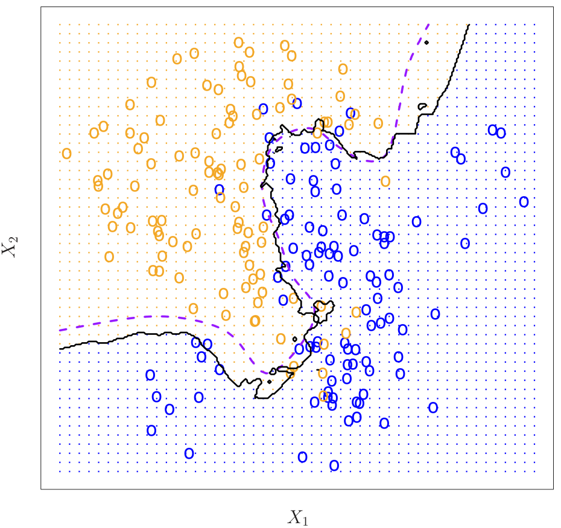


<!-- Start of picture text -->
o ooooooooooooooo o oooooooooo o oooooooooo o oooo o oooooooooooooooooooo o oooooooo o ooooo o ooooooooooooooooooooooooooooo o o oo oo oo o<br>o oo o oo o oo o o o o o o o o o oo o o o o o o ooooooooo o ooooooooooooo o o oo ooo o oo o<br>oo o oooooo ooo o<br>o o o o<br>o o<br>o<br>X1<br>X2<br><!-- End of picture text -->

**FIGURE 2.15.** _The black curve indicates the KNN decision boundary on the data from Figure 2.13, using K_ = 10 _. The Bayes decision boundary is shown as a purple dashed line. The KNN and Bayes decision boundaries are very similar._ 

2.2 Assessing Model Accuracy 41 


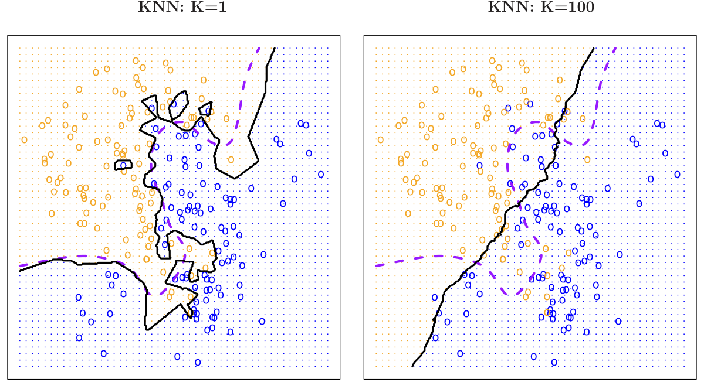


<!-- Start of picture text -->
KNN: K=1 KNN: K=100<br>o oooo ooo oooo o ooo oo ooooo o o o o o oo o o o oooooo oo ooooo o oooo o oo o ooo ooooooo o ooo o oo o o o o oo o o o oo oo ooooo o ooooo o oo o ooooo o o o o oo oooo o oooooo o oo o o oo o oooooooooooooooo o oooooooooooooo oo oo o o o o o oo o o ooo o o oooo ooo oooo o ooo oo ooooo o o o o o oo o o o oooooo oo ooooo o oooo o oo o ooo ooooooo o ooo o oo o o o o oo o o o oo oo ooooo o ooooo o oo o o ooo o o o o o oo oooo o oooooo o oo o o oo o oooooooooooooooo o oooooooooooooo oo oo o o o o o oo o o ooo o<br>o o o o o o o o oo ooooo o o o o o o o o o o oo ooooo o o<br>o o o o o o<br><!-- End of picture text -->

**FIGURE 2.16.** _A comparison of the KNN decision boundaries (solid black curves) obtained using K_ = 1 _and K_ = 100 _on the data from Figure 2.13. With K_ = 1 _, the decision boundary is overly flexible, while with K_ = 100 _it is not sufficiently flexible. The Bayes decision boundary is shown as a purple dashed line._ 

though the true distribution is not known by the KNN classifier, the KNN decision boundary is very close to that of the Bayes classifier. The test error rate using KNN is 0 _._ 1363, which is close to the Bayes error rate of 0 _._ 1304. The choice of _K_ has a drastic effect on the KNN classifier obtained. Figure 2.16 displays two KNN fits to the simulated data from Figure 2.13, using _K_ = 1 and _K_ = 100. When _K_ = 1, the decision boundary is overly flexible and finds patterns in the data that don’t correspond to the Bayes decision boundary. This corresponds to a classifier that has low bias but very high variance. As _K_ grows, the method becomes less flexible and produces a decision boundary that is close to linear. This corresponds to a low-variance but high-bias classifier. On this simulated data set, neither _K_ = 1 nor _K_ = 100 give good predictions: they have test error rates of 0 _._ 1695 and 0 _._ 1925, respectively. 

Just as in the regression setting, there is not a strong relationship between the training error rate and the test error rate. With _K_ = 1, the KNN training error rate is 0, but the test error rate may be quite high. In general, as we use more flexible classification methods, the training error rate will decline but the test error rate may not. In Figure 2.17, we have plotted the KNN test and training errors as a function of 1 _/K_ . As 1 _/K_ increases, the method becomes more flexible. As in the regression setting, the training error rate consistently declines as the flexibility increases. However, the test error exhibits a characteristic U-shape, declining at first (with a minimum at approximately _K_ = 10) before increasing again when the method becomes excessively flexible and overfits. 

42 2. Statistical Learning 


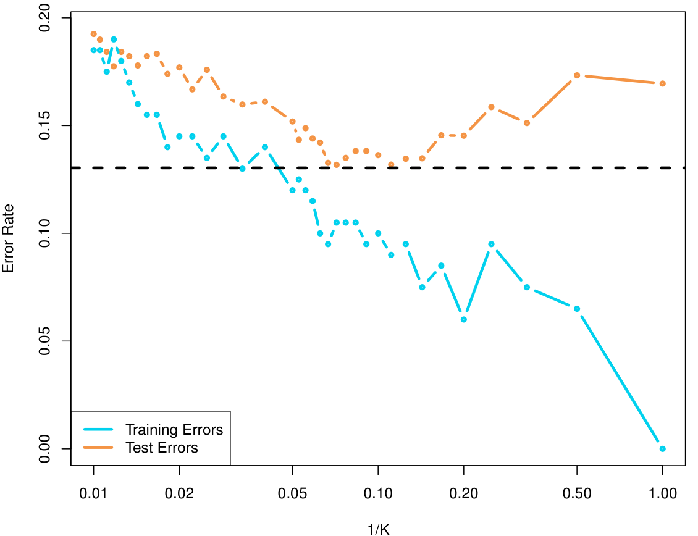


<!-- Start of picture text -->
Training Errors<br>Test Errors<br>0.01 0.02 0.05 0.10 0.20 0.50 1.00<br>1/K<br>0.20<br>0.15<br>0.10<br>Error Rate<br>0.05<br>0.00<br><!-- End of picture text -->

**FIGURE 2.17.** _The KNN training error rate (blue, 200 observations) and test error rate (orange, 5,000 observations) on the data from Figure 2.13, as the level of flexibility (assessed using_ 1 _/K on the log scale) increases, or equivalently as the number of neighbors K decreases. The black dashed line indicates the Bayes error rate. The jumpiness of the curves is due to the small size of the training data set._ 

In both the regression and classification settings, choosing the correct level of flexibility is critical to the success of any statistical learning method. The bias-variance tradeoff, and the resulting U-shape in the test error, can make this a difficult task. In Chapter 5, we return to this topic and discuss various methods for estimating test error rates and thereby choosing the optimal level of flexibility for a given statistical learning method. 

## 2.3 Lab: Introduction to R 

In this lab, we will introduce some simple `R` commands. The best way to learn a new language is to try out the commands. `R` can be downloaded from 

#### `http://cran.r-project.org/` 

We recommend that you run `R` within an integrated development environment (IDE) such as `RStudio` , which can be freely downloaded from 

```
http://rstudio.com
```

2.3 Lab: Introduction to R 43 

The `RStudio` website also provides a cloud-based version of `R` , which does not require installing any software. 

### _2.3.1 Basic Commands_ 

`R` uses _functions_ to perform operations. To run a function called `funcname` , function we type `funcname(input1, input2)` , where the inputs (or _arguments_ ) `input1` argument and `input2` tell `R` how to run the function. A function can have any number of inputs. For example, to create a vector of numbers, we use the function `c()` (for _concatenate_ ). Any numbers inside the parentheses are joined to- `c()` gether. The following command instructs `R` to join together the numbers 1, 3, 2, and 5, and to save them as a _vector_ named `x` . When we type `x` , it vector gives us back the vector. 

```
>x<-c(1,3,2,5)
>x
[1]1325
```

Note that the `>` is not part of the command; rather, it is printed by `R` to indicate that it is ready for another command to be entered. We can also save things using `=` rather than `<-` : 

```
>x=c(1,6,2)
>x
[1]162
>y=c(1,4,3)
```

Hitting the _up_ arrow multiple times will display the previous commands, which can then be edited. This is useful since one often wishes to repeat a similar command. In addition, typing `?funcname` will always cause `R` to open a new help file window with additional information about the function `funcname()` . 

We can tell `R` to add two sets of numbers together. It will then add the first number from `x` to the first number from `y` , and so on. However, `x` and `y` should be the same length. We can check their length using the `length() length()` function. 

```
>length(x)
[1]3
>length(y)
[1]3
>x+y
[1]2105
```

The `ls()` function allows us to look at a list of all of the objects, such `ls()` as data and functions, that we have saved so far. The `rm()` function can be `rm()` used to delete any that we don’t want. 

```
>ls()
[1]"x""y"
>rm(x,y)
```

2. Statistical Learning 

44 

```
>ls()
character(0)
```

It’s also possible to remove all objects at once: 

```
>rm(list=ls())
```

The `matrix()` function can be used to create a matrix of numbers. Before `matrix()` we use the `matrix()` function, we can learn more about it: 

```
>?matrix
```

The help file reveals that the `matrix()` function takes a number of inputs, but for now we focus on the first three: the data (the entries in the matrix), the number of rows, and the number of columns. First, we create a simple matrix. 

```
>x<-matrix(data=c(1,2,3,4),nrow=2,ncol=2)
>x
[,1][,2]
[1,]13
[2,]24
```

Note that we could just as well omit typing `data=` , `nrow=` , and `ncol=` in the `matrix()` command above: that is, we could just type 

```
>x<-matrix(c(1,2,3,4),2,2)
```

and this would have the same effect. However, it can sometimes be useful to specify the names of the arguments passed in, since otherwise `R` will assume that the function arguments are passed into the function in the same order that is given in the function’s help file. As this example illustrates, by default `R` creates matrices by successively filling in columns. Alternatively, the `byrow = TRUE` option can be used to populate the matrix in order of the rows. 

```
>matrix(c(1,2,3,4),2,2,byrow=TRUE)
[,1][,2]
[1,]12
[2,]34
```

Notice that in the above command we did not assign the matrix to a value such as `x` . In this case the matrix is printed to the screen but is not saved for future calculations. The `sqrt()` function returns the square root of each `sqrt()` element of a vector or matrix. The command `x2̂` raises each element of `x` to the power `2` ; any powers are possible, including fractional or negative powers. 

```
>sqrt(x)
[,1][,2]
[1,]1.001.73
[2,]1.412.00
>x^2
[,1][,2]
[1,]19
[2,]416
```

2.3 Lab: Introduction to R 45 

The `rnorm()` function generates a vector of random normal variables, `rnorm()` with first argument `n` the sample size. Each time we call this function, we will get a different answer. Here we create two correlated sets of numbers, `x` and `y` , and use the `cor()` function to compute the correlation between `cor()` them. 

```
>x<-rnorm(50)
>y<-x+rnorm(50,mean=50,sd=.1)
>cor(x,y)
[1]0.995
```

By default, `rnorm()` creates standard normal random variables with a mean of 0 and a standard deviation of 1. However, the mean and standard deviation can be altered using the `mean` and `sd` arguments, as illustrated above. Sometimes we want our code to reproduce the exact same set of random numbers; we can use the `set.seed()` function to do this. The `set.seed() set.seed()` function takes an (arbitrary) integer argument. 

```
>set.seed(1303)
>rnorm(50)
[1]-1.14401.34212.18540.53640.06320.5022-0.0004
...
```

We use `set.seed()` throughout the labs whenever we perform calculations involving random quantities. In general this should allow the user to reproduce our results. However, as new versions of `R` become available, small discrepancies may arise between this book and the output from `R` . 

The `mean()` and `var()` functions can be used to compute the mean and `mean()` variance of a vector of numbers. Applying `sqrt()` to the output of `var() var()` will give the standard deviation. Or we can simply use the `sd()` function. 

```
var()
sd()
```

```
>set.seed(3)
>y<-rnorm(100)
>mean(y)
[1]0.0110
>var(y)
[1]0.7329
>sqrt(var(y))
[1]0.8561
>sd(y)
[1]0.8561
```

### _2.3.2 Graphics_ 

The `plot()` function is the primary way to plot data in `R` . For instance, `plot() plot(x, y)` produces a scatterplot of the numbers in `x` versus the numbers in `y` . There are many additional options that can be passed in to the `plot()` function. For example, passing in the argument `xlab` will result in a label on the _x_ -axis. To find out more information about the `plot()` function, type `?plot` . 

46 2. Statistical Learning 

```
>x<-rnorm(100)
>y<-rnorm(100)
>plot(x,y)
>plot(x,y,xlab="thisisthex-axis",
ylab="thisisthey-axis",
main="PlotofXvsY")
```

We will often want to save the output of an `R` plot. The command that we use to do this will depend on the file type that we would like to create. For instance, to create a pdf, we use the `pdf()` function, and to create a jpeg, `pdf()` we use the `jpeg()` function. 

```
jpeg()
```

```
>pdf("Figure.pdf")
>plot(x,y,col="green")
>dev.off()
nulldevice
1
```

The function `dev.off()` indicates to `R` that we are done creating the plot. `dev.off()` Alternatively, we can simply copy the plot window and paste it into an appropriate file type, such as a Word document. 

The function `seq()` can be used to create a sequence of numbers. For `seq()` instance, `seq(a, b)` makes a vector of integers between `a` and `b` . There are many other options: for instance, `seq(0, 1, length = 10)` makes a sequence of `10` numbers that are equally spaced between `0` and `1` . Typing `3:11` is a shorthand for `seq(3, 11)` for integer arguments. 

```
>x<-seq(1,10)
>x
[1]12345678910
>x<-1:10
>x
[1]12345678910
>x<-seq(-pi,pi,length=50)
```

We will now create some more sophisticated plots. The `contour()` func- `contour()` tion produces a _contour plot_ in order to represent three-dimensional data; contour plot it is like a topographical map. It takes three arguments: 

1. A vector of the `x` values (the first dimension), 

2. A vector of the `y` values (the second dimension), and 

3. A matrix whose elements correspond to the `z` value (the third dimension) for each pair of ( `x` , `y` ) coordinates. 

As with the `plot()` function, there are many other inputs that can be used to fine-tune the output of the `contour()` function. To learn more about these, take a look at the help file by typing `?contour` . 

```
>y<-x
>f<-outer(x,y,function(x,y)cos(y)/(1+x^2))
>contour(x,y,f)
```

2.3 Lab: Introduction to R 

47 

```
>contour(x,y,f,nlevels=45,add=T)
>fa<-(f-t(f))/2
```

```
>contour(x,y,fa,nlevels=15)
```

The `image()` function works the same way as `contour()` , except that `image()` it produces a color-coded plot whose colors depend on the `z` value. This is known as a _heatmap_ , and is sometimes used to plot temperature in weather heatmap forecasts. Alternatively, `persp()` can be used to produce a three-dimensional `persp()` plot. The arguments `theta` and `phi` control the angles at which the plot is viewed. 

```
>image(x,y,fa)
>persp(x,y,fa)
>persp(x,y,fa,theta=30)
>persp(x,y,fa,theta=30,phi=20)
>persp(x,y,fa,theta=30,phi=70)
>persp(x,y,fa,theta=30,phi=40)
```

### _2.3.3 Indexing Data_ 

We often wish to examine part of a set of data. Suppose that our data is stored in the matrix `A` . 

```
>A<-matrix(1:16,4,4)
>A
[,1][,2][,3][,4]
[1,]15913
[2,]261014
[3,]371115
[4,]481216
```

Then, typing 

```
>A[2,3]
[1]10
```

will select the element corresponding to the second row and the third column. The first number after the open-bracket symbol `[` always refers to the row, and the second number always refers to the column. We can also select multiple rows and columns at a time, by providing vectors as the indices. 

```
>A[c(1,3),c(2,4)]
[,1][,2]
[1,]513
[2,]715
>A[1:3,2:4]
[,1][,2][,3]
[1,]5913
[2,]61014
[3,]71115
>A[1:2,]
```

2. Statistical Learning 

48 

```
[,1][,2][,3][,4]
[1,]15913
[2,]261014
>A[,1:2]
[,1][,2]
[1,]15
[2,]26
[3,]37
[4,]48
```

The last two examples include either no index for the columns or no index for the rows. These indicate that `R` should include all columns or all rows, respectively. `R` treats a single row or column of a matrix as a vector. 

```
>A[1,]
[1]15913
```

The use of a negative sign `-` in the index tells `R` to keep all rows or columns except those indicated in the index. 

```
>A[-c(1,3),]
[,1][,2][,3][,4]
[1,]261014
[2,]481216
>A[-c(1,3),-c(1,3,4)]
[1]68
```

The `dim()` function outputs the number of rows followed by the number of `dim()` columns of a given matrix. 

```
>dim(A)
[1]44
```

### _2.3.4 Loading Data_ 

For most analyses, the first step involves importing a data set into `R` . The `read.table()` function is one of the primary ways to do this. The help file `read.table()` contains details about how to use this function. We can use the function `write.table()` to export data. 

```
write.table()
```

Before attempting to load a data set, we must make sure that `R` knows to search for the data in the proper directory. For example, on a Windows system one could select the directory using the `Change dir ...` option under the `File` menu. However, the details of how to do this depend on the operating system (e.g. Windows, Mac, Unix) that is being used, and so we do not give further details here. 

We begin by loading in the `Auto` data set. This data is part of the `ISLR2` library, discussed in Chapter 3. To illustrate the `read.table()` function, we load it now from a text file, `Auto.data` , which you can find on the textbook website. The following command will load the `Auto.data` file into `R` and store it as an object called `Auto` , in a format referred to as a _data frame_ . data frame 

2.3 Lab: Introduction to R 49 

Once the data has been loaded, the `View()` function can be used to view it in a spreadsheet-like window.<sup>1</sup> The `head()` function can also be used to view the first few rows of the data. 

```
>Auto<-read.table("Auto.data")
```

|`> View(Auto)`<br>`> head(Auto)`<br><br><br><br>||
|---|---|
|`V1`<br>`V2`<br>`V3`<br>`V4`|`V5`|
|`1`<br>`mpg cylinders displacement horsepower `|`weight`|
|`2 18.0`<br>`8`<br>`307.0`<br>`130.0`|`3504.`|
|`3 15.0`<br>`8`<br>`350.0`<br>`165.0`|`3693.`|
|`4 18.0`<br>`8`<br>`318.0`<br>`150.0`|`3436.`|
|`5 16.0`<br>`8`<br>`304.0`<br>`150.0`|`3433.`|
|`6 17.0`<br>`8`<br>`302.0`<br>`140.0`|`3449.`|
|`V6`<br>`V7`<br>`V8`|`V9`|
|`1 acceleration year origin`|`name`|
|`2`<br>`12.0`<br>`70`<br>`1 chevrolet chev`|`elle malibu`|
|`3`<br>`11.5`<br>`70`<br>`1`<br>`buick `|`skylark 320`|
|`4`<br>`11.0`<br>`70`<br>`1`<br>`plymout`|`h satellite`|
|`5`<br>`12.0`<br>`70`<br>`1`<br>`am`|`c rebel sst`|
|`6`<br>`10.5`<br>`70`<br>`1`|`ford torino`|


Note that Auto.data is simply a text file, which you could alternatively open on your computer using a standard text editor. It is often a good idea to view a data set using a text editor or other software such as Excel before loading it into `R` . 

This particular data set has not been loaded correctly, because `R` has assumed that the variable names are part of the data and so has included them in the first row. The data set also includes a number of missing observations, indicated by a question mark `?` . Missing values are a common occurrence in real data sets. Using the option `header = T` (or `header = TRUE` ) in the `read.table()` function tells `R` that the first line of the file contains the variable names, and using the option `na.strings` tells `R` that any time it sees a particular character or set of characters (such as a question mark), it should be treated as a missing element of the data matrix. 

```
>Auto<-read.table("Auto.data",header=T,na.strings="?",
stringsAsFactors=T)
>View(Auto)
```

The `stringsAsFactors = T` argument tells `R` that any variable containing character strings should be interpreted as a qualitative variable, and that each distinct character string represents a distinct level for that qualitative variable. An easy way to load data from Excel into `R` is to save it as a csv (comma-separated values) file, and then use the `read.csv()` function. 

```
>Auto<-read.csv("Auto.csv",na.strings="?",stringsAsFactors=
T)
```

> 1This function can sometimes be a bit finicky. If you have trouble using it, then try the `head()` function instead. 

50 2. Statistical Learning 

```
>View(Auto)
>dim(Auto)
[1]3979
>Auto[1:4,]
```

The `dim()` function tells us that the data has 397 observations, or rows, and `dim()` nine variables, or columns. There are various ways to deal with the missing data. In this case, only five of the rows contain missing observations, and so we choose to use the `na.omit()` function to simply remove these rows. 

```
na.omit()
```

```
>Auto<-na.omit(Auto)
>dim(Auto)
[1]3929
```

Once the data are loaded correctly, we can use `names()` to check the `names()` variable names. 

```
>names(Auto)
[1]"mpg""cylinders""displacement""horsepower"
[5]"weight""acceleration""year""origin"
[9]"name"
```

### _2.3.5 Additional Graphical and Numerical Summaries_ 

We can use the `plot()` function to produce _scatterplots_ of the quantitative scatterplot variables. However, simply typing the variable names will produce an error message, because `R` does not know to look in the `Auto` data set for those variables. 

```
>plot(cylinders,mpg)
Errorinplot(cylinders,mpg):object`cylinders 'notfound
```

To refer to a variable, we must type the data set and the variable name joined with a `$` symbol. Alternatively, we can use the `attach()` function in `attach()` order to tell `R` to make the variables in this data frame available by name. 

```
>plot(Auto$cylinders,Auto$mpg)
>attach(Auto)
>plot(cylinders,mpg)
```

The `cylinders` variable is stored as a numeric vector, so `R` has treated it as quantitative. However, since there are only a small number of possible values for `cylinders` , one may prefer to treat it as a qualitative variable. The `as.factor()` function converts quantitative variables into qualitative `as.factor()` variables. 

```
>cylinders<-as.factor(cylinders)
```

If the variable plotted on the _x_ -axis is qualitative, then _boxplots_ will boxplot automatically be produced by the `plot()` function. As usual, a number of options can be specified in order to customize the plots. 

2.3 Lab: Introduction to R 51 

```
>plot(cylinders,mpg)
>plot(cylinders,mpg,col="red")
>plot(cylinders,mpg,col="red",varwidth=T)
>plot(cylinders,mpg,col="red",varwidth=T,
horizontal=T)
>plot(cylinders,mpg,col="red",varwidth=T,
xlab="cylinders",ylab="MPG")
```

The `hist()` function can be used to plot a _histogram_ . Note that `col = 2` has the same effect as `col = "red"` . 

`hist()` histogram 

```
>hist(mpg)
>hist(mpg,col=2)
>hist(mpg,col=2,breaks=15)
```

The `pairs()` function creates a _scatterplot matrix_ , i.e. a scatterplot for every pair of variables. We can also produce scatterplots for just a subset of the variables. 

<mark>`> pairs(Auto) > pairs(`</mark> _<mark>∼</mark>_ <mark>`mpg + displacement + horsepower + weight + acceleration , data = Auto )`</mark> 

In conjunction with the `plot()` function, `identify()` provides a useful interactive method for identifying the value of a particular variable for points on a plot. We pass in three arguments to `identify()` : the _x_ -axis variable, the _y_ -axis variable, and the variable whose values we would like to see printed for each point. Then clicking one or more points in the plot and hitting Escape will cause `R` to print the values of the variable of interest. The numbers printed under the `identify()` function correspond to the rows for the selected points. 

```
identify()
```

```
>plot(horsepower ,mpg)
>identify(horsepower,mpg,name)
```

The `summary()` function produces a numerical summary of each variable in a particular data set. 

```
summary()
```

|`> summary(Auto)`<br>|||
|---|---|---|
|`mpg`|`cylinders`|`displacement`|
|`Min.`<br>`: 9.00`|`Min.`<br>`:3.000`|`Min.`<br>`: 68.0`|
|`1st Qu.:17.00`|`1st Qu.:4.000`|`1st Qu.:105.0`|
|`Median :22.75`|`Median :4.000`|`Median :151.0`|
|`Mean`<br>`:23.45`|`Mean`<br>`:5.472`|`Mean`<br>`:194.4`|
|`3rd Qu.:29.00`|`3rd Qu.:8.000`|`3rd Qu.:275.8`|
|`Max.`<br>`:46.60`|`Max.`<br>`:8.000`|`Max.`<br>`:455.0`|
|`horsepower`|`weight`|`acceleration`|
|`Min.`<br>`: 46.0`|`Min.`<br>`:1613`|`Min.`<br>`: 8.00`|
|`1st Qu.: 75.0`|`1st Qu.:2225`|`1st Qu.:13.78`|
|`Median : 93.5`|`Median :2804`|`Median :15.50`|
|`Mean`<br>`:104.5`|`Mean`<br>`:2978`|`Mean`<br>`:15.54`|


52 2. Statistical Learning 

|`3rd `|`Qu.:126.0`|`3rd `|`Qu.`|`:3615`|`3rd Qu.:17.02`||
|---|---|---|---|---|---|---|
|`Max.`|`:230.0`|`Max.`||`:5140`|`Max.`<br>`:24.80`||
||`year`||`ori`|`gin`||`name`|
|`Min.`|`:70.00`|`Min.`||`:1.000`|`amc matador`|`:`<br>`5`|
|`1st `|`Qu.:73.00`|`1st `|`Qu.`|`:1.000`|`ford pinto`|`:`<br>`5`|
|`Medi`|`an :76.00`|`Medi`|`an `|`:1.000`|`toyota corolla`|`:`<br>`5`|
|`Mean`|`:75.98`|`Mean`||`:1.577`|`amc gremlin`|`:`<br>`4`|
|`3rd `|`Qu.:79.00`|`3rd `|`Qu.`|`:2.000`|`amc hornet`|`:`<br>`4`|
|`Max.`|`:82.00`|`Max.`||`:3.000`|`chevrolet cheve`|`tte:`<br>`4`|
||||||`(Other)`|`:365`|


For qualitative variables such as `name` , `R` will list the number of observations that fall in each category. We can also produce a summary of just a single variable. 

```
>summary(mpg)
```

|`Min. 1st Qu.`|`Median`|`Mean `|`3rd Qu.`<br>`Max.`|
|---|---|---|---|
|`9.00`<br>`17.00`|`22.75`|`23.45`|`29.00`<br>`46.60`|


Once we have finished using `R` , we type `q()` in order to shut it down, or `q()` quit. When exiting `R` , we have the option to save the current _workspace_ so workspace that all objects (such as data sets) that we have created in this `R` session will be available next time. Before exiting `R` , we may want to save a record of all of the commands that we typed in the most recent session; this can be accomplished using the `savehistory()` function. Next time we enter `R` , `savehistory()` we can load that history using the `loadhistory()` function, if we wish. 

```
loadhistory()
```

## 2.4 Exercises 

### _Conceptual_ 

1. For each of parts (a) through (d), indicate whether we would generally expect the performance of a flexible statistical learning method to be better or worse than an inflexible method. Justify your answer. 

   - (a) The sample size _n_ is extremely large, and the number of predictors _p_ is small. 

   - (b) The number of predictors _p_ is extremely large, and the number of observations _n_ is small. 

   - (c) The relationship between the predictors and response is highly non-linear. 

   - (d) The variance of the error terms, i.e. _σ_<sup>2</sup> = Var( _ϵ_ ), is extremely high. 

2. Explain whether each scenario is a classification or regression problem, and indicate whether we are most interested in inference or prediction. Finally, provide _n_ and _p_ . 

2.4 Exercises 53 

   - (a) We collect a set of data on the top 500 firms in the US. For each firm we record profit, number of employees, industry and the CEO salary. We are interested in understanding which factors affect CEO salary. 

   - (b) We are considering launching a new product and wish to know whether it will be a _success_ or a _failure_ . We collect data on 20 similar products that were previously launched. For each product we have recorded whether it was a success or failure, price charged for the product, marketing budget, competition price, and ten other variables. 

   - (c) We are interested in predicting the % change in the USD/Euro exchange rate in relation to the weekly changes in the world stock markets. Hence we collect weekly data for all of 2012. For each week we record the % change in the USD/Euro, the % change in the US market, the % change in the British market, and the % change in the German market. 

3. We now revisit the bias-variance decomposition. 

   - (a) Provide a sketch of typical (squared) bias, variance, training error, test error, and Bayes (or irreducible) error curves, on a single plot, as we go from less flexible statistical learning methods towards more flexible approaches. The _x_ -axis should represent the amount of flexibility in the method, and the _y_ -axis should represent the values for each curve. There should be five curves. Make sure to label each one. 

- (b) Explain why each of the five curves has the shape displayed in part (a). 

- 4. You will now think of some real-life applications for statistical learning. 

   - (a) Describe three real-life applications in which _classification_ might be useful. Describe the response, as well as the predictors. Is the goal of each application inference or prediction? Explain your answer. 

   - (b) Describe three real-life applications in which _regression_ might be useful. Describe the response, as well as the predictors. Is the goal of each application inference or prediction? Explain your answer. 

   - (c) Describe three real-life applications in which _cluster analysis_ might be useful. 

5. What are the advantages and disadvantages of a very flexible (versus a less flexible) approach for regression or classification? Under what 

- 54 2. Statistical Learning 

circumstances might a more flexible approach be preferred to a less flexible approach? When might a less flexible approach be preferred? 

6. Describe the differences between a parametric and a non-parametric statistical learning approach. What are the advantages of a parametric approach to regression or classification (as opposed to a nonparametric approach)? What are its disadvantages? 

7. The table below provides a training data set containing six observations, three predictors, and one qualitative response variable. 

|Obs.|_X_1|_X_2|_X_3|_Y_|
|---|---|---|---|---|
|1|0|3|0|Red|
|2|2|0|0|Red|
|3|0|1|3|Red|
|4|0|1|2|Green|
|5|_−_1|0|1|Green|
|6|1|1|1|Red|


Suppose we wish to use this data set to make a prediction for _Y_ when _X_ 1 = _X_ 2 = _X_ 3 = 0 using _K_ -nearest neighbors. 

- (a) Compute the Euclidean distance between each observation and the test point, _X_ 1 = _X_ 2 = _X_ 3 = 0. 

- (b) What is our prediction with _K_ = 1? Why? 

- (c) What is our prediction with _K_ = 3? Why? 

- (d) If the Bayes decision boundary in this problem is highly nonlinear, then would we expect the _best_ value for _K_ to be large or small? Why? 

### _Applied_ 

8. This exercise relates to the `College` data set, which can be found in the file `College.csv` on the book website. It contains a number of variables for 777 different universities and colleges in the US. The variables are 

   - `Private` : Public/private indicator 

   - `Apps` : Number of applications received 

   - `Accept` : Number of applicants accepted 

   - `Enroll` : Number of new students enrolled 

   - `Top10perc` : New students from top 10 % of high school class 

   - `Top25perc` : New students from top 25 % of high school class 

2.4 Exercises 55 

- `F.Undergrad` : Number of full-time undergraduates 

- `P.Undergrad` : Number of part-time undergraduates 

- `Outstate` : Out-of-state tuition 

- `Room.Board` : Room and board costs 

- `Books` : Estimated book costs 

- `Personal` : Estimated personal spending 

- `PhD` : Percent of faculty with Ph.D.’s 

- `Terminal` : Percent of faculty with terminal degree 

- `S.F.Ratio` : Student/faculty ratio 

- `perc.alumni` : Percent of alumni who donate 

- `Expend` : Instructional expenditure per student 

- `Grad.Rate` : Graduation rate 

Before reading the data into `R` , it can be viewed in Excel or a text editor. 

- (a) Use the `read.csv()` function to read the data into `R` . Call the loaded data `college` . Make sure that you have the directory set to the correct location for the data. 

- (b) Look at the data using the `View()` function. You should notice that the first column is just the name of each university. We don’t really want `R` to treat this as data. However, it may be handy to have these names for later. Try the following commands: 

```
>rownames(college)<-college[,1]
>View(college)
```

You should see that there is now a `row.names` column with the name of each university recorded. This means that `R` has given each row a name corresponding to the appropriate university. `R` will not try to perform calculations on the row names. However, we still need to eliminate the first column in the data where the names are stored. Try 

```
>college<-college[,-1]
>View(college)
```

Now you should see that the first data column is `Private` . Note that another column labeled `row.names` now appears before the `Private` column. However, this is not a data column but rather the name that `R` is giving to each row. 

- (c) i. Use the `summary()` function to produce a numerical summary of the variables in the data set. 

56 2. Statistical Learning 

- ii. Use the `pairs()` function to produce a scatterplot matrix of the first ten columns or variables of the data. Recall that you can reference the first ten columns of a matrix `A` using `A[,1:10]` . 

- iii. Use the `plot()` function to produce side-by-side boxplots of `Outstate` versus `Private` . 

- iv. Create a new qualitative variable, called `Elite` , by _binning_ the `Top10perc` variable. We are going to divide universities into two groups based on whether or not the proportion of students coming from the top 10 % of their high school classes exceeds 50 %. 

```
>Elite<-rep("No",nrow(college))
>Elite[college$Top10perc>50]<-"Yes"
>Elite<-as.factor(Elite)
>college<-data.frame(college,Elite)
```

Use the `summary()` function to see how many elite universities there are. Now use the `plot()` function to produce side-by-side boxplots of `Outstate` versus `Elite` . 

      - v. Use the `hist()` function to produce some histograms with differing numbers of bins for a few of the quantitative variables. You may find the command `par(mfrow = c(2, 2))` useful: it will divide the print window into four regions so that four plots can be made simultaneously. Modifying the arguments to this function will divide the screen in other ways. 

      - vi. Continue exploring the data, and provide a brief summary of what you discover. 

9. This exercise involves the `Auto` data set studied in the lab. Make sure that the missing values have been removed from the data. 

   - (a) Which of the predictors are quantitative, and which are qualitative? 

   - (b) What is the _range_ of each quantitative predictor? You can answer this using the `range()` function. 

   - `range()` 

- (c) What is the mean and standard deviation of each quantitative predictor? 

- (d) Now remove the 10th through 85th observations. What is the range, mean, and standard deviation of each predictor in the subset of the data that remains? 

- (e) Using the full data set, investigate the predictors graphically, using scatterplots or other tools of your choice. Create some plots highlighting the relationships among the predictors. Comment on your findings. 

2.4 Exercises 57 

   - (f) Suppose that we wish to predict gas mileage ( `mpg` ) on the basis of the other variables. Do your plots suggest that any of the other variables might be useful in predicting `mpg` ? Justify your answer. 

10. This exercise involves the `Boston` housing data set. 

   - (a) To begin, load in the `Boston` data set. The `Boston` data set is part of the `ISLR2` _library_ . 

```
>library(ISLR2)
```

Now the data set is contained in the object `Boston` . 

```
>Boston
```

Read about the data set: 

```
>?Boston
```

How many rows are in this data set? How many columns? What do the rows and columns represent? 

- (b) Make some pairwise scatterplots of the predictors (columns) in this data set. Describe your findings. 

- (c) Are any of the predictors associated with per capita crime rate? If so, explain the relationship. 

- (d) Do any of the census tracts of Boston appear to have particularly high crime rates? Tax rates? Pupil-teacher ratios? Comment on the range of each predictor. 

- (e) How many of the census tracts in this data set bound the Charles river? 

- (f) What is the median pupil-teacher ratio among the towns in this data set? 

- (g) Which census tract of Boston has lowest median value of owneroccupied homes? What are the values of the other predictors for that census tract, and how do those values compare to the overall ranges for those predictors? Comment on your findings. 

- (h) In this data set, how many of the census tracts average more than seven rooms per dwelling? More than eight rooms per dwelling? Comment on the census tracts that average more than eight rooms per dwelling. 


<!-- Start of picture text -->
This is page 58<br>Printer: Opaque<br><!-- End of picture text -->

