3 

# Linear Regression 

This chapter is about _linear regression_ , a very simple approach for supervised learning. In particular, linear regression is a useful tool for predicting a quantitative response. It has been around for a long time and is the topic of innumerable textbooks. Though it may seem somewhat dull compared to some of the more modern statistical learning approaches described in later chapters of this book, linear regression is still a useful and widely used statistical learning method. Moreover, it serves as a good jumping-off point for newer approaches: as we will see in later chapters, many fancy statistical learning approaches can be seen as generalizations or extensions of linear regression. Consequently, the importance of having a good understanding of linear regression before studying more complex learning methods cannot be overstated. In this chapter, we review some of the key ideas underlying the linear regression model, as well as the least squares approach that is most commonly used to fit this model. 

Recall the `Advertising` data from Chapter 2. Figure 2.1 displays `sales` (in thousands of units) for a particular product as a function of advertising budgets (in thousands of dollars) for `TV` , `radio` , and `newspaper` media. Suppose that in our role as statistical consultants we are asked to suggest, on the basis of this data, a marketing plan for next year that will result in high product sales. What information would be useful in order to provide such a recommendation? Here are a few important questions that we might seek to address: 

##### 60 3. Linear Regression 

1. _Is there a relationship between advertising budget and sales?_ Our first goal should be to determine whether the data provide evidence of an association between advertising expenditure and sales. If the evidence is weak, then one might argue that no money should be spent on advertising! 

2. _How strong is the relationship between advertising budget and sales?_ Assuming that there is a relationship between advertising and sales, we would like to know the strength of this relationship. Does knowledge of the advertising budget provide a lot of information about product sales? 

3. _Which media are associated with sales?_ Are all three media—TV, radio, and newspaper—associated with sales, or are just one or two of the media associated? To answer this question, we must find a way to separate out the individual contribution of each medium to sales when we have spent money on all three media. 

4. _How large is the association between each medium and sales?_ For every dollar spent on advertising in a particular medium, by what amount will sales increase? How accurately can we predict this amount of increase? 

5. _How accurately can we predict future sales?_ For any given level of television, radio, or newspaper advertising, what is our prediction for sales, and what is the accuracy of this prediction? 

6. _Is the relationship linear?_ 

   - If there is approximately a straight-line relationship between advertising expenditure in the various media and sales, then linear regression is an appropriate tool. If not, then it may still be possible to transform the predictor or the response so that linear regression can be used. 

7. _Is there synergy among the advertising media?_ Perhaps spending $50 _,_ 000 on television advertising and $50 _,_ 000 on radio advertising is associated with higher sales than allocating $100 _,_ 000 to either television or radio individually. In marketing, this is known as a _synergy_ effect, while in statistics it is called an _interaction_ effect. synergy 

It turns out that linear regression can be used to answer each of these questions. We will first discuss all of these questions in a general context, and then return to them in this specific context in Section 3.4. 

interaction 

3.1 Simple Linear Regression 61 

## 3.1 Simple Linear Regression 

_Simple linear regression_ lives up to its name: it is a very straightforward simple linear approach for predicting a quantitative response _Y_ on the basis of a sinregression gle predictor variable _X_ . It assumes that there is approximately a linear relationship between _X_ and _Y_ . Mathematically, we can write this linear relationship as 


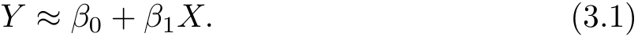


You might read “ _≈_ ” as _“is approximately modeled as”_ . We will sometimes describe (3.1) by saying that we are _regressing Y on X_ (or _Y onto X_ ). For example, _X_ may represent `TV` advertising and _Y_ may represent `sales` . Then we can regress `sales` onto `TV` by fitting the model 


In Equation 3.1, _β_ 0 and _β_ 1 are two unknown constants that represent the _intercept_ and _slope_ terms in the linear model. Together, _β_ 0 and _β_ 1 are intercept known as the model _coefficients_ or _parameters_ . Once we have used our training data to produce estimates _β_<sup>ˆ</sup> 0 and _β_<sup>ˆ</sup> 1 for the model coefficients, we slope coefficient can predict future sales on the basis of a particular value of TV advertising parameter by computing 

slope coefficient parameter 


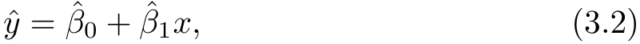


ˆ where _y_ indicates a prediction of _Y_ on the basis of _X_ = _x_ . Here we use a _hat_ symbol, ˆ , to denote the estimated value for an unknown parameter or coefficient, or to denote the predicted value of the response. 

### _3.1.1 Estimating the Coefficients_ 

In practice, _β_ 0 and _β_ 1 are unknown. So before we can use (3.1) to make predictions, we must use data to estimate the coefficients. Let 


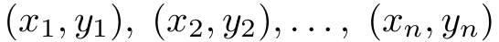


represent _n_ observation pairs, each of which consists of a measurement of _X_ and a measurement of _Y_ . In the `Advertising` example, this data set consists of the TV advertising budget and product sales in _n_ = 200 different markets. (Recall that the data are displayed in Figure 2.1.) Our goal is to obtain coefficient estimates _β_<sup>ˆ</sup> 0 and _β_<sup>ˆ</sup> 1 such that the linear model (3.1) fits the available data well—that is, so that _yi ≈ β_<sup>ˆ</sup> 0 + _β_<sup>ˆ</sup> 1 _xi_ for _i_ = 1 _, . . . , n_ . In other words, we want to find an intercept _β_<sup>ˆ</sup> 0 and a slope _β_<sup>ˆ</sup> 1 such that the resulting line is as close as possible to the _n_ = 200 data points. There are a number of ways of measuring _closeness_ . However, by far the most common approach involves minimizing the _least squares_ criterion, and we take that approach in this chapter. Alternative approaches will be considered in least squares Chapter 6. 


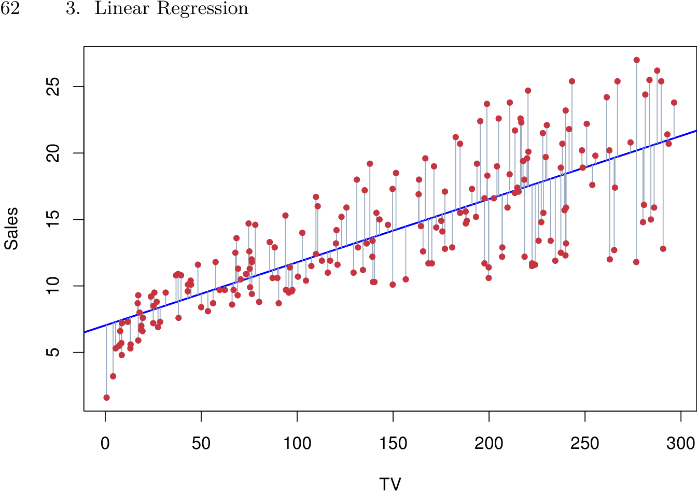


**FIGURE 3.1.** _For the_ `Advertising` _data, the least squares fit for the regression of_ `sales` _onto_ `TV` _is shown. The fit is found by minimizing the residual sum of squares. Each grey line segment represents a residual. In this case a linear fit captures the essence of the relationship, although it overestimates the trend in the left of the plot._ 

ˆ Let _yi_ = _β_<sup>ˆ</sup> 0 + _β_<sup>ˆ</sup> 1 _xi_ be the prediction for _Y_ based on the _i_ th value of _X_ . ˆ Then _ei_ = _yi − yi_ represents the _i_ th _residual_ —this is the difference between residual the _i_ th observed response value and the _i_ th response value that is predicted by our linear model. We define the _residual sum of squares_ (RSS) as 

residual sum of squares 


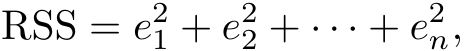


or equivalently as 


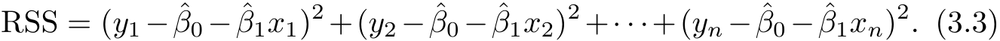


The least squares approach chooses _β_<sup>ˆ</sup> 0 and _β_<sup>ˆ</sup> 1 to minimize the RSS. Using some calculus, one can show that the minimizers are 


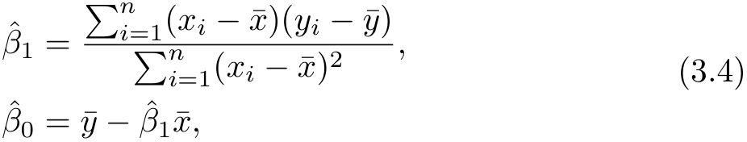


¯ _n n_ where _y ≡ n_<sup><u>1</u></sup> � _i_ =1<sup>_yi_and</sup><sup>_x_¯</sup><sup>_≡_</sup> _n_<sup><u>1</u></sup> � _i_ =1<sup>_xi_arethesamplemeans.Inother</sup> words, (3.4) defines the _least squares coefficient estimates_ for simple linear regression. 

Figure 3.1 displays the simple linear regression fit to the `Advertising` data, where _β_<sup>ˆ</sup> 0 = 7 _._ 03 and _β_<sup>ˆ</sup> 1 = 0 _._ 0475. In other words, according to 

3.1 Simple Linear Regression 63 


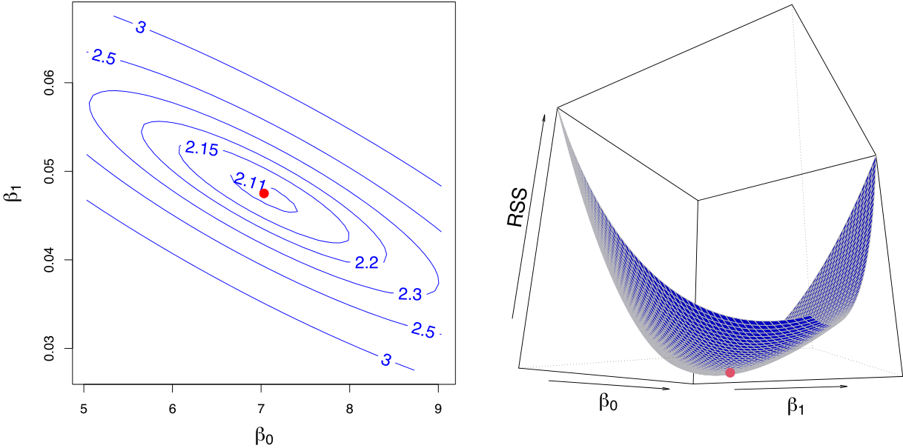


**FIGURE 3.2.** _Contour and three-dimensional plots of the RSS on the_ `Advertising` _data, using_ `sales` _as the response and_ `TV` _as the predictor. The red dots correspond to the least squares estimates β_<sup>ˆ</sup> 0 _and β_<sup>ˆ</sup> 1 _, given by (3.4)._ 

this approximation, an additional $1 _,_ 000 spent on TV advertising is associated with selling approximately 47 _._ 5 additional units of the product. In Figure 3.2, we have computed RSS for a number of values of _β_ 0 and _β_ 1, using the advertising data with `sales` as the response and `TV` as the predictor. In each plot, the red dot represents the pair of least squares estimates ( _β_<sup>ˆ</sup> 0 _, β_<sup>ˆ</sup> 1) given by (3.4). These values clearly minimize the RSS. 

### _3.1.2 Assessing the Accuracy of the Coefficient Estimates_ 

Recall from (2.1) that we assume that the _true_ relationship between _X_ and _Y_ takes the form _Y_ = _f_ ( _X_ ) + _ϵ_ for some unknown function _f_ , where _ϵ_ is a mean-zero random error term. If _f_ is to be approximated by a linear function, then we can write this relationship as 


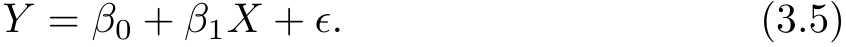


Here _β_ 0 is the intercept term—that is, the expected value of _Y_ when _X_ = 0, and _β_ 1 is the slope—the average increase in _Y_ associated with a one-unit increase in _X_ . The error term is a catch-all for what we miss with this simple model: the true relationship is probably not linear, there may be other variables that cause variation in _Y_ , and there may be measurement error. We typically assume that the error term is independent of _X_ . 

The model given by (3.5) defines the _population regression line_ , which population is the best linear approximation to the true relationship between _X_ and 

regression line 

64 3. Linear Regression 


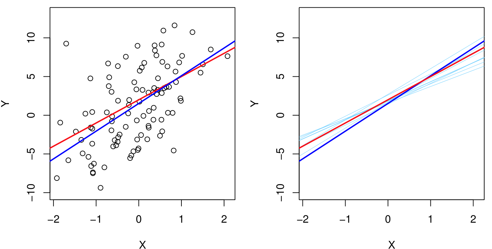


**FIGURE 3.3.** _A simulated data set._ Left: _The red line represents the true relationship, f_ ( _X_ ) = 2 + 3 _X, which is known as the population regression line. The blue line is the least squares line; it is the least squares estimate for f_ ( _X_ ) _based on the observed data, shown in black._ Right: _The population regression line is again shown in red, and the least squares line in dark blue. In light blue, ten least squares lines are shown, each computed on the basis of a separate random set of observations. Each least squares line is different, but on average, the least squares lines are quite close to the population regression line._ 

_Y_ .<sup>1</sup> The least squares regression coefficient estimates (3.4) characterize the _least squares line_ (3.2). The left-hand panel of Figure 3.3 displays these least squares two lines in a simple simulated example. We created 100 random _X_ s, and line generated 100 corresponding _Y_ s from the model 


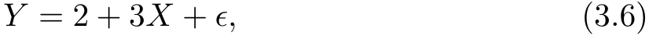


where _ϵ_ was generated from a normal distribution with mean zero. The red line in the left-hand panel of Figure 3.3 displays the _true_ relationship, _f_ ( _X_ ) = 2 + 3 _X_ , while the blue line is the least squares estimate based on the observed data. The true relationship is generally not known for real data, but the least squares line can always be computed using the coefficient estimates given in (3.4). In other words, in real applications, we have access to a set of observations from which we can compute the least squares line; however, the population regression line is unobserved. In the right-hand panel of Figure 3.3 we have generated ten different data sets from the model given by (3.6) and plotted the corresponding ten least squares lines. Notice that different data sets generated from the same true model result in slightly different least squares lines, but the unobserved population regression line does not change. 

> 1The assumption of linearity is often a useful working model. However, despite what many textbooks might tell us, we seldom believe that the true relationship is linear. 

3.1 Simple Linear Regression 65 

At first glance, the difference between the population regression line and the least squares line may seem subtle and confusing. We only have one data set, and so what does it mean that two different lines describe the relationship between the predictor and the response? Fundamentally, the concept of these two lines is a natural extension of the standard statistical approach of using information from a sample to estimate characteristics of a large population. For example, suppose that we are interested in knowing the population mean _µ_ of some random variable _Y_ . Unfortunately, _µ_ is unknown, but we do have access to _n_ observations from _Y_ , _y_ 1 _, . . . , yn_ , ˆ ¯ which we can use to estimate _µ_ . A reasonable estimate is _µ_ = _y_ , where ¯ _n y_ = _n_<sup><u>1</u></sup> � _i_ =1<sup>_yi_isthesamplemean.Thesamplemeanandthepopulation</sup> mean are different, but in general the sample mean will provide a good estimate of the population mean. In the same way, the unknown coefficients _β_ 0 and _β_ 1 in linear regression define the population regression line. We seek to estimate these unknown coefficients using _β_<sup>ˆ</sup> 0 and _β_<sup>ˆ</sup> 1 given in (3.4). These coefficient estimates define the least squares line. 

The analogy between linear regression and estimation of the mean of a random variable is an apt one based on the concept of _bias_ . If we use the sample mean _µ_ ˆ to estimate _µ_ , this estimate is _unbiased_ , in the sense that bias on average, we expect _µ_ ˆ to equal _µ_ . What exactly does this mean? It means unbiased that on the basis of one particular set of observations _y_ 1 _, . . . , yn_ , _µ_ ˆ might overestimate _µ_ , and on the basis of another set of observations, _µ_ ˆ might underestimate _µ_ . But if we could average a huge number of estimates of _µ_ obtained from a huge number of sets of observations, then this average would _exactly_ equal _µ_ . Hence, an unbiased estimator does not _systematically_ over- or under-estimate the true parameter. The property of unbiasedness holds for the least squares coefficient estimates given by (3.4) as well: if we estimate _β_ 0 and _β_ 1 on the basis of a particular data set, then our estimates won’t be exactly equal to _β_ 0 and _β_ 1. But if we could average the estimates obtained over a huge number of data sets, then the average of these estimates would be spot on! In fact, we can see from the righthand panel of Figure 3.3 that the average of many least squares lines, each estimated from a separate data set, is pretty close to the true population regression line. 

We continue the analogy with the estimation of the population mean _µ_ of a random variable _Y_ . A natural question is as follows: how accurate is the sample mean _µ_ ˆ as an estimate of _µ_ ? We have established that the average of _µ_ ˆ’s over many data sets will be very close to _µ_ , but that a ˆ single estimate _µ_ may be a substantial underestimate or overestimate of _µ_ . How far off will that single estimate of _µ_ ˆ be? In general, we answer this ˆ question by computing the _standard error_ of _µ_ , written as SE(ˆ _µ_ ). We have standard the well-known formula 

error 


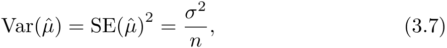


66 3. Linear Regression 

where _σ_ is the standard deviation of each of the realizations _yi_ of _Y_ .<sup>2</sup> Roughly speaking, the standard error tells us the average amount that this estimate _µ_ ˆ differs from the actual value of _µ_ . Equation 3.7 also tells us how this deviation shrinks with _n_ —the more observations we have, the smaller ˆ the standard error of _µ_ . In a similar vein, we can wonder how close _β_<sup>ˆ</sup> 0 and _β_<sup>ˆ</sup> 1 are to the true values _β_ 0 and _β_ 1. To compute the standard errors associated with _β_<sup>ˆ</sup> 0 and _β_<sup>ˆ</sup> 1, we use the following formulas: 


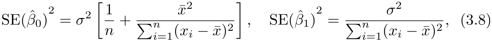


where _σ_<sup>2</sup> = Var( _ϵ_ ). For these formulas to be strictly valid, we need to assume that the errors _ϵi_ for each observation have common variance _σ_<sup>2</sup> and are uncorrelated. This is clearly not true in Figure 3.1, but the formula still turns out to be a good approximation. Notice in the formula that SE( _β_<sup>ˆ</sup> 1) is smaller when the _xi_ are more spread out; intuitively we have more _leverage_ to estimate a slope when this is the case. We also see that SE( _β_<sup>ˆ</sup> 0) would be the same as SE(ˆ _µ_ ) if _x_ ¯ were zero (in which case _β_<sup>ˆ</sup> 0 would be equal to _y_ ¯). In general, _σ_<sup>2</sup> is not known, but can be estimated from the data. This estimate of _σ_ is known as the _residual standard error_ , and is given by the formula residual RSE = ~~�~~ RSS _/_ ( _n −_ 2). Strictly speaking, when _σ_<sup>2</sup> is estimated from the standard data we should write SE(<sup>�</sup> _β_<sup>ˆ</sup> 1) to indicate that an estimate has been made, error but for simplicity of notation we will drop this extra “hat”. 

standard error 

Standard errors can be used to compute _confidence intervals_ . A 95 % confidence confidence interval is defined as a range of values such that with 95 % interval probability, the range will contain the true unknown value of the parameter. The range is defined in terms of lower and upper limits computed from the sample of data. A 95% confidence interval has the following property: if we take repeated samples and construct the confidence interval for each sample, 95% of the intervals will contain the true unknown value of the parameter. For linear regression, the 95 % confidence interval for _β_ 1 approximately takes the form 


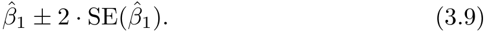


That is, there is approximately a 95 % chance that the interval 


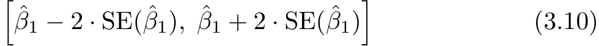


> 2This formula holds provided that the _n_ observations are uncorrelated. 

3.1 Simple Linear Regression 67 

will contain the true value of _β_ 1.<sup>3</sup> Similarly, a confidence interval for _β_ 0 approximately takes the form 


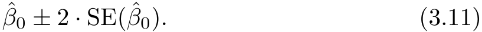


In the case of the advertising data, the 95 % confidence interval for _β_ 0 is [6 _._ 130 _,_ 7 _._ 935] and the 95 % confidence interval for _β_ 1 is [0 _._ 042 _,_ 0 _._ 053]. Therefore, we can conclude that in the absence of any advertising, sales will, on average, fall somewhere between 6 _,_ 130 and 7 _,_ 935 units. Furthermore, for each $1 _,_ 000 increase in television advertising, there will be an average increase in sales of between 42 and 53 units. 

Standard errors can also be used to perform _hypothesis tests_ on the hypothesis coefficients. The most common hypothesis test involves testing the _null_ test _hypothesis_ of 

test null hypothesis 


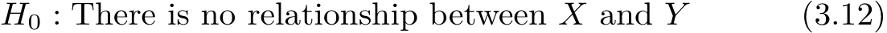


versus the _alternative hypothesis_ 


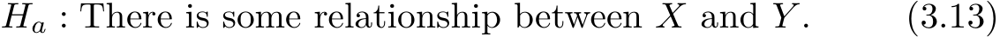


alternative hypothesis 

Mathematically, this corresponds to testing 


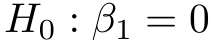


versus 


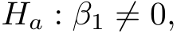


since if _β_ 1 = 0 then the model (3.5) reduces to _Y_ = _β_ 0 + _ϵ_ , and _X_ is not associated with _Y_ . To test the null hypothesis, we need to determine whether _β_<sup>ˆ</sup> 1, our estimate for _β_ 1, is sufficiently far from zero that we can be confident that _β_ 1 is non-zero. How far is far enough? This of course depends on the accuracy of _β_<sup>ˆ</sup> 1—that is, it depends on SE( _β_<sup>ˆ</sup> 1). If SE( _β_<sup>ˆ</sup> 1) is small, then even relatively small values of _β_<sup>ˆ</sup> 1 may provide strong evidence that _β_ 1 = 0, and hence that there is a relationship between _X_ and _Y_ . In contrast, if SE( _β_<sup>ˆ</sup> 1) is large, then _β_<sup>ˆ</sup> 1 must be large in absolute value in order for us to reject the null hypothesis. In practice, we compute a _t-statistic_ , _t_ -statistic given by 


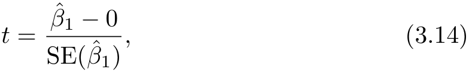


> 3 _Approximately_ for several reasons. Equation 3.10 relies on the assumption that the errors are Gaussian. Also, the factor of 2 in front of the SE( _β_<sup>ˆ</sup> 1) term will vary slightly depending on the number of observations _n_ in the linear regression. To be precise, rather than the number 2, (3.10) should contain the 97.5 % quantile of a _t_ -distribution with _n−_ 2 degrees of freedom. Details of how to compute the 95 % confidence interval precisely in `R` will be provided later in this chapter. 

68 3. Linear Regression 

||Coefcient|Std. error|_t_-statistic|_p_-value|
|---|---|---|---|---|
|`Intercept`|7.0325|0.4578|15.36|_<_0_._0001|
|`TV`|0.0475|0.0027|17.67|_<_0_._0001|


**TABLE 3.1.** _For the_ `Advertising` _data, coefficients of the least squares model for the regression of number of units sold on TV advertising budget. An increase of_ $1 _,_ 000 _in the TV advertising budget is associated with an increase in sales by around 50 units. (Recall that the_ `sales` _variable is in thousands of units, and the_ `TV` _variable is in thousands of dollars.)_ 

which measures the number of standard deviations that _β_<sup>ˆ</sup> 1 is away from 0. If there really is no relationship between _X_ and _Y_ , then we expect that (3.14) will have a _t_ -distribution with _n −_ 2 degrees of freedom. The _t_ -distribution has a bell shape and for values of _n_ greater than approximately 30 it is quite similar to the standard normal distribution. Consequently, it is a simple matter to compute the probability of observing any number equal to _|t|_ or larger in absolute value, assuming _β_ 1 = 0. We call this probability the _p-value_ . Roughly speaking, we interpret the _p_ -value as follows: a small _p_ -value _p_ -value indicates that it is unlikely to observe such a substantial association between the predictor and the response due to chance, in the absence of any real association between the predictor and the response. Hence, if we see a small _p_ -value, then we can infer that there is an association between the predictor and the response. We _reject the null hypothesis_ —that is, we declare a relationship to exist between _X_ and _Y_ —if the _p_ -value is small enough. Typical _p_ -value cutoffs for rejecting the null hypothesis are 5% or 1%, although this topic will be explored in much greater detail in Chapter 13. When _n_ = 30, these correspond to _t_ -statistics (3.14) of around 2 and 2.75, respectively. 

Table 3.1 provides details of the least squares model for the regression of number of units sold on TV advertising budget for the `Advertising` data. Notice that the coefficients for _β_<sup>ˆ</sup> 0 and _β_<sup>ˆ</sup> 1 are very large relative to their standard errors, so the _t_ -statistics are also large; the probabilities of seeing such values if _H_ 0 is true are virtually zero. Hence we can conclude that _β_ 0 = 0 and _β_ 1 = 0.<sup>4</sup> 

### _3.1.3 Assessing the Accuracy of the Model_ 

Once we have rejected the null hypothesis (3.12) in favor of the alternative hypothesis (3.13), it is natural to want to quantify _the extent to which the model fits the data_ . The quality of a linear regression fit is typically assessed 

> 4In Table 3.1, a small _p_ -value for the intercept indicates that we can reject the null hypothesis that _β_ 0 = 0, and a small _p_ -value for `TV` indicates that we can reject the null hypothesis that _β_ 1 = 0. Rejecting the latter null hypothesis allows us to conclude that there is a relationship between `TV` and `sales` . Rejecting the former allows us to conclude that in the absence of `TV` expenditure, `sales` are non-zero. 

3.1 Simple Linear Regression 69 

_R_<sup>2</sup> 

|Quantity|Value|
|---|---|
|Residual standard error|3.26|
|_R_<sup>2</sup>|0.612|
|_F_-statistic|312.1|


**TABLE 3.2.** _For the_ `Advertising` _data, more information about the least squares model for the regression of number of units sold on TV advertising budget._ 

using two related quantities: the _residual standard error_ (RSE) and the _R_<sup>2</sup> statistic. 

Table 3.2 displays the RSE, the _R_<sup>2</sup> statistic, and the _F_ -statistic (to be described in Section 3.2.2) for the linear regression of number of units sold on TV advertising budget. 

#### Residual Standard Error 

Recall from the model (3.5) that associated with each observation is an error term _ϵ_ . Due to the presence of these error terms, even if we knew the true regression line (i.e. even if _β_ 0 and _β_ 1 were known), we would not be able to perfectly predict _Y_ from _X_ . The RSE is an estimate of the standard deviation of _ϵ_ . Roughly speaking, it is the average amount that the response will deviate from the true regression line. It is computed using the formula 


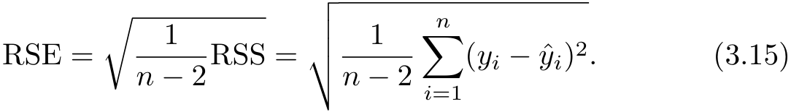


Note that RSS was defined in Section 3.1.1, and is given by the formula 


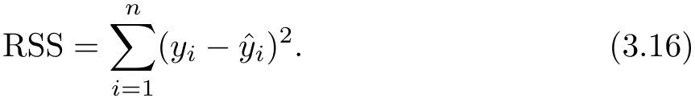


In the case of the advertising data, we see from the linear regression output in Table 3.2 that the RSE is 3 _._ 26. In other words, actual sales in each market deviate from the true regression line by approximately 3 _,_ 260 units, on average. Another way to think about this is that even if the model were correct and the true values of the unknown coefficients _β_ 0 and _β_ 1 were known exactly, any prediction of sales on the basis of TV advertising would still be off by about 3 _,_ 260 units on average. Of course, whether or not 3 _,_ 260 units is an acceptable prediction error depends on the problem context. In the advertising data set, the mean value of `sales` over all markets is approximately 14 _,_ 000 units, and so the percentage error is 3 _,_ 260 _/_ 14 _,_ 000 = 23 %. 

The RSE is considered a measure of the _lack of fit_ of the model (3.5) to the data. If the predictions obtained using the model are very close to the ˆ true outcome values—that is, if _yi ≈ yi_ for _i_ = 1 _, . . . , n_ —then (3.15) will be small, and we can conclude that the model fits the data very well. On 

70 3. Linear Regression 

the other hand, if _y_ ˆ _i_ is very far from _yi_ for one or more observations, then the RSE may be quite large, indicating that the model doesn’t fit the data well. 

#### _R_<sup>2</sup> Statistic 

The RSE provides an absolute measure of lack of fit of the model (3.5) to the data. But since it is measured in the units of _Y_ , it is not always clear what constitutes a good RSE. The _R_<sup>2</sup> statistic provides an alternative measure of fit. It takes the form of a _proportion_ —the proportion of variance explained—and so it always takes on a value between 0 and 1, and is independent of the scale of _Y_ . 

To calculate _R_<sup>2</sup> , we use the formula 


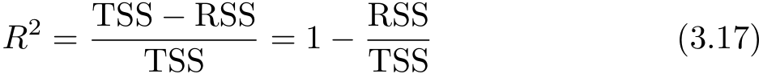


¯ where TSS =<sup>�</sup> ( _yi − y_ )<sup>2</sup> is the _total sum of squares_ , and RSS is defined total sum of in (3.16). TSS measures the total variance in the response _Y_ , and can be squares thought of as the amount of variability inherent in the response before the regression is performed. In contrast, RSS measures the amount of variability that is left unexplained after performing the regression. Hence, TSS _−_ RSS measures the amount of variability in the response that is explained (or removed) by performing the regression, and _R_<sup>2</sup> measures the _proportion of variability in Y that can be explained using X_ . An _R_<sup>2</sup> statistic that is close to 1 indicates that a large proportion of the variability in the response is explained by the regression. A number near 0 indicates that the regression does not explain much of the variability in the response; this might occur because the linear model is wrong, or the error variance _σ_<sup>2</sup> is high, or both. In Table 3.2, the _R_<sup>2</sup> was 0 _._ 61, and so just under two-thirds of the variability in `sales` is explained by a linear regression on `TV` . 

The _R_<sup>2</sup> statistic (3.17) has an interpretational advantage over the RSE (3.15), since unlike the RSE, it always lies between 0 and 1. However, it can still be challenging to determine what is a _good R_<sup>2</sup> value, and in general, this will depend on the application. For instance, in certain problems in physics, we may know that the data truly comes from a linear model with a small residual error. In this case, we would expect to see an _R_<sup>2</sup> value that is extremely close to 1, and a substantially smaller _R_<sup>2</sup> value might indicate a serious problem with the experiment in which the data were generated. On the other hand, in typical applications in biology, psychology, marketing, and other domains, the linear model (3.5) is at best an extremely rough approximation to the data, and residual errors due to other unmeasured factors are often very large. In this setting, we would expect only a very small proportion of the variance in the response to be explained by the predictor, and an _R_<sup>2</sup> value well below 0 _._ 1 might be more realistic! 

3.2 Multiple Linear Regression 71 

The _R_<sup>2</sup> statistic is a measure of the linear relationship between _X_ and _Y_ . Recall that _correlation_ , defined as 

correlation 


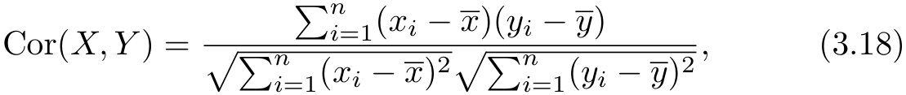


is also a measure of the linear relationship between _X_ and _Y_ .<sup>5</sup> This suggests that we might be able to use _r_ = Cor( _X, Y_ ) instead of _R_<sup>2</sup> in order to assess the fit of the linear model. In fact, it can be shown that in the simple linear regression setting, _R_<sup>2</sup> = _r_<sup>2</sup> . In other words, the squared correlation and the _R_<sup>2</sup> statistic are identical. However, in the next section we will discuss the multiple linear regression problem, in which we use several predictors simultaneously to predict the response. The concept of correlation between the predictors and the response does not extend automatically to this setting, since correlation quantifies the association between a single pair of variables rather than between a larger number of variables. We will see that _R_<sup>2</sup> fills this role. 

## 3.2 Multiple Linear Regression 

Simple linear regression is a useful approach for predicting a response on the basis of a single predictor variable. However, in practice we often have more than one predictor. For example, in the `Advertising` data, we have examined the relationship between sales and TV advertising. We also have data for the amount of money spent advertising on the radio and in newspapers, and we may want to know whether either of these two media is associated with sales. How can we extend our analysis of the advertising data in order to accommodate these two additional predictors? 

One option is to run three separate simple linear regressions, each of which uses a different advertising medium as a predictor. For instance, we can fit a simple linear regression to predict sales on the basis of the amount spent on radio advertisements. Results are shown in Table 3.3 (top table). We find that a $1 _,_ 000 increase in spending on radio advertising is associated with an increase in sales of around 203 units. Table 3.3 (bottom table) contains the least squares coefficients for a simple linear regression of sales onto newspaper advertising budget. A $1 _,_ 000 increase in newspaper advertising budget is associated with an increase in sales of approximately 55 units. 

However, the approach of fitting a separate simple linear regression model for each predictor is not entirely satisfactory. First of all, it is unclear how to make a single prediction of sales given the three advertising media budgets, since each of the budgets is associated with a separate regression equation. 

> 5We note that in fact, the right-hand�side of (3.18) is the sample correlation; thus, it would be more correct to write Cor( _X, Y_ ); however, we omit the “hat” for ease of notation. 

72 3. Linear Regression 

Simple regression of `sales` on `radio` 

||Coefcient|Std. error|_t_-statistic|_p_-value|
|---|---|---|---|---|
|`Intercept`|9.312|0.563|16.54|_<_0_._0001|
|`radio`|0.203|0.020|9.92|_<_0_._0001|


Simple regression of `sales` on `newspaper` 

||Coefcient|Std. error|_t_-statistic|_p_-value|
|---|---|---|---|---|
|`Intercept`|12.351|0.621|19.88|_<_0_._0001|
|`newspaper`|0.055|0.017|3.30|0_._00115|


**TABLE 3.3.** _More simple linear regression models for the_ `Advertising` _data. Coefficients of the simple linear regression model for number of units sold on_ Top: _radio advertising budget and_ Bottom: _newspaper advertising budget. A $_ 1 _,_ 000 _increase in spending on radio advertising is associated with an average increase in sales by around 203 units, while the same increase in spending on newspaper advertising is associated with an average increase in sales by around 55 units. (Note that the_ `sales` _variable is in thousands of units, and the_ `radio` _and_ `newspaper` _variables are in thousands of dollars.)_ 

Second, each of the three regression equations ignores the other two media in forming estimates for the regression coefficients. We will see shortly that if the media budgets are correlated with each other in the 200 markets in our data set, then this can lead to very misleading estimates of the association between each media budget and sales. 

Instead of fitting a separate simple linear regression model for each predictor, a better approach is to extend the simple linear regression model (3.5) so that it can directly accommodate multiple predictors. We can do this by giving each predictor a separate slope coefficient in a single model. In general, suppose that we have _p_ distinct predictors. Then the multiple linear regression model takes the form 


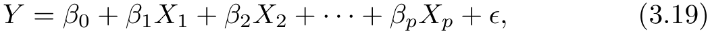


where _Xj_ represents the _j_ th predictor and _βj_ quantifies the association between that variable and the response. We interpret _βj_ as the _average_ effect on _Y_ of a one unit increase in _Xj_ , _holding all other predictors fixed_ . In the advertising example, (3.19) becomes 


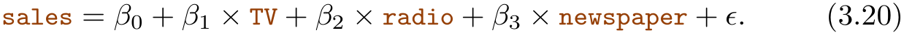


### _3.2.1 Estimating the Regression Coefficients_ 

As was the case in the simple linear regression setting, the regression coefficients _β_ 0 _, β_ 1 _, . . . , βp_ in (3.19) are unknown, and must be estimated. Given 

3.2 Multiple Linear Regression 73 

estimates _β_<sup>ˆ</sup> 0 _, β_<sup>ˆ</sup> 1 _, . . . , β_<sup>ˆ</sup> _p_ , we can make predictions using the formula 


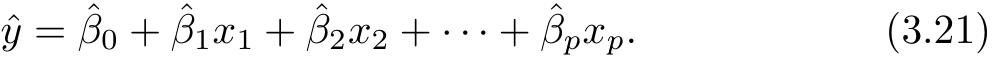


The parameters are estimated using the same least squares approach that we saw in the context of simple linear regression. We choose _β_ 0 _, β_ 1 _, . . . , βp_ to minimize the sum of squared residuals 


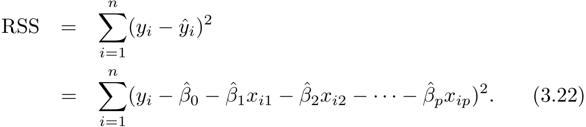


The values _β_<sup>ˆ</sup> 0 _, β_<sup>ˆ</sup> 1 _, . . . , β_<sup>ˆ</sup> _p_ that minimize (3.22) are the multiple least squares regression coefficient estimates. Unlike the simple linear regression estimates given in (3.4), the multiple regression coefficient estimates have somewhat complicated forms that are most easily represented using matrix algebra. For this reason, we do not provide them here. Any statistical software package can be used to compute these coefficient estimates, and later in this chapter we will show how this can be done in `R` . Figure 3.4 illustrates an example of the least squares fit to a toy data set with _p_ = 2 predictors. 

Table 3.4 displays the multiple regression coefficient estimates when TV, radio, and newspaper advertising budgets are used to predict product sales using the `Advertising` data. We interpret these results as follows: for a given amount of TV and newspaper advertising, spending an additional $1 _,_ 000 on radio advertising is associated with approximately 189 units of additional sales. Comparing these coefficient estimates to those displayed in Tables 3.1 and 3.3, we notice that the multiple regression coefficient estimates for `TV` and `radio` are pretty similar to the simple linear regression coefficient estimates. However, while the `newspaper` regression coefficient estimate in Table 3.3 was significantly non-zero, the coefficient estimate for `newspaper` in the multiple regression model is close to zero, and the corresponding _p_ - value is no longer significant, with a value around 0 _._ 86. This illustrates that the simple and multiple regression coefficients can be quite different. This difference stems from the fact that in the simple regression case, the slope term represents the average increase in product sales associated with a $1 _,_ 000 increase in newspaper advertising, ignoring other predictors such as `TV` and `radio` . By contrast, in the multiple regression setting, the coefficient for `newspaper` represents the average increase in product sales associated with increasing newspaper spending by $1 _,_ 000 while holding `TV` and `radio` fixed. 

Does it make sense for the multiple regression to suggest no relationship between `sales` and `newspaper` while the simple linear regression implies the 

74 3. Linear Regression 


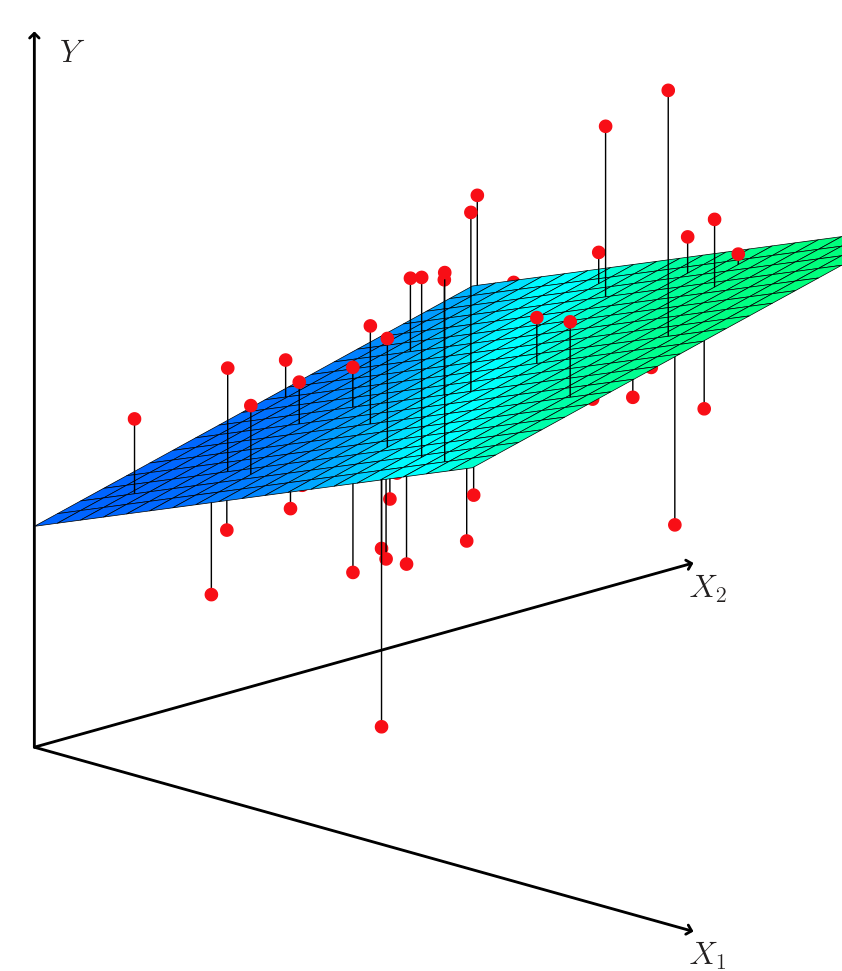


**FIGURE 3.4.** _In a three-dimensional setting, with two predictors and one response, the least squares regression line becomes a plane. The plane is chosen to minimize the sum of the squared vertical distances between each observation (shown in red) and the plane._ 

opposite? In fact it does. Consider the correlation matrix for the three predictor variables and response variable, displayed in Table 3.5. Notice that the correlation between `radio` and `newspaper` is 0 _._ 35. This indicates that markets with high newspaper advertising tend to also have high radio advertising. Now suppose that the multiple regression is correct and newspaper advertising is not associated with sales, but radio advertising is associated with sales. Then in markets where we spend more on radio our sales will tend to be higher, and as our correlation matrix shows, we also tend to spend more on newspaper advertising in those same markets. Hence, in a simple linear regression which only examines `sales` versus 

||Coefcient|Std. error|_t_-statistic|_p_-value|
|---|---|---|---|---|
|`Intercept`|2.939|0.3119|9.42|_<_0_._0001|
|`TV`|0.046|0.0014|32.81|_<_0_._0001|
|`radio`|0.189|0.0086|21.89|_<_0_._0001|
|`newspaper`|_−_0.001|0.0059|_−_0.18|0_._8599|


**TABLE 3.4.** _For the_ `Advertising` _data, least squares coefficient estimates of the multiple linear regression of number of units sold on TV, radio, and newspaper advertising budgets._ 

3.2 Multiple Linear Regression 75 

||`TV`|`radio`|`newspaper`|`sales`|
|---|---|---|---|---|
|`TV`|1.0000|0.0548|0.0567|0.7822|
|`radio`||1.0000|0.3541|0.5762|
|`newspaper`|||1.0000|0.2283|
|`sales`||||1.0000|


**TABLE 3.5.** _Correlation matrix for_ `TV` _,_ `radio` _,_ `newspaper` _, and_ `sales` _for the_ `Advertising` _data._ 

`newspaper` , we will observe that higher values of `newspaper` tend to be associated with higher values of `sales` , even though newspaper advertising is not directly associated with sales. So `newspaper` advertising is a surrogate for `radio` advertising; `newspaper` gets “credit” for the association between `radio` on `sales` . 

This slightly counterintuitive result is very common in many real life situations. Consider an absurd example to illustrate the point. Running a regression of shark attacks versus ice cream sales for data collected at a given beach community over a period of time would show a positive relationship, similar to that seen between `sales` and `newspaper` . Of course no one has (yet) suggested that ice creams should be banned at beaches to reduce shark attacks. In reality, higher temperatures cause more people to visit the beach, which in turn results in more ice cream sales and more shark attacks. A multiple regression of shark attacks onto ice cream sales and temperature reveals that, as intuition implies, ice cream sales is no longer a significant predictor after adjusting for temperature. 

### _3.2.2 Some Important Questions_ 

When we perform multiple linear regression, we usually are interested in answering a few important questions. 

1. _Is at least one of the predictors X_ 1 _, X_ 2 _, . . . , Xp useful in predicting the response?_ 

2. _Do all the predictors help to explain Y , or is only a subset of the predictors useful?_ 

3. _How well does the model fit the data?_ 

4. _Given a set of predictor values, what response value should we predict, and how accurate is our prediction?_ 

We now address each of these questions in turn. 

One: Is There a Relationship Between the Response and Predictors? 

Recall that in the simple linear regression setting, in order to determine whether there is a relationship between the response and the predictor we 

76 3. Linear Regression 

|Quantity|Value|
|---|---|
|Residual standard error|1.69|
|_R_<sup>2</sup>|0.897|
|_F_-statistic|570|


**TABLE 3.6.** _More information about the least squares model for the regression of number of units sold on TV, newspaper, and radio advertising budgets in the_ `Advertising` _data. Other information about this model was displayed in Table 3.4._ 

can simply check whether _β_ 1 = 0. In the multiple regression setting with _p_ predictors, we need to ask whether all of the regression coefficients are zero, i.e. whether _β_ 1 = _β_ 2 = _· · ·_ = _βp_ = 0. As in the simple linear regression setting, we use a hypothesis test to answer this question. We test the null hypothesis, 


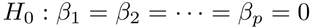


versus the alternative 


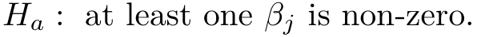


This hypothesis test is performed by computing the _F -statistic_ , 

_F_ -statistic 


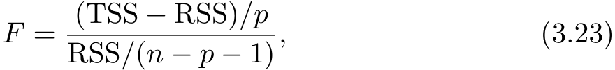


¯ where, as with simple linear regression, TSS =<sup>�</sup> ( _yi − y_ )<sup>2</sup> and RSS = ˆ 2 �( _yi − yi_ ) . If the linear model assumptions are correct, one can show that 


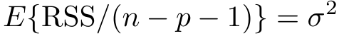


and that, provided _H_ 0 is true, 


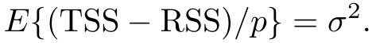


Hence, when there is no relationship between the response and predictors, one would expect the _F_ -statistic to take on a value close to 1. On the other hand, if _Ha_ is true, then _E{_ (TSS _−_ RSS) _/p} > σ_<sup>2</sup> , so we expect _F_ to be greater than 1. 

The _F_ -statistic for the multiple linear regression model obtained by regressing `sales` onto `radio` , `TV` , and `newspaper` is shown in Table 3.6. In this example the _F_ -statistic is 570. Since this is far larger than 1, it provides compelling evidence against the null hypothesis _H_ 0. In other words, the large _F_ -statistic suggests that at least one of the advertising media must be related to `sales` . However, what if the _F_ -statistic had been closer to 1? How large does the _F_ -statistic need to be before we can reject _H_ 0 and conclude that there is a relationship? It turns out that the answer depends on the values of _n_ and _p_ . When _n_ is large, an _F_ -statistic that is just a little larger than 1 might still provide evidence against _H_ 0. In contrast, 

3.2 Multiple Linear Regression 77 

a larger _F_ -statistic is needed to reject _H_ 0 if _n_ is small. When _H_ 0 is true and the errors _ϵi_ have a normal distribution, the _F_ -statistic follows an _F_ -distribution.<sup>6</sup> For any given value of _n_ and _p_ , any statistical software package can be used to compute the _p_ -value associated with the _F_ -statistic using this distribution. Based on this _p_ -value, we can determine whether or not to reject _H_ 0. For the advertising data, the _p_ -value associated with the _F_ -statistic in Table 3.6 is essentially zero, so we have extremely strong evidence that at least one of the media is associated with increased `sales` . 

In (3.23) we are testing _H_ 0 that all the coefficients are zero. Sometimes we want to test that a particular subset of _q_ of the coefficients are zero. This corresponds to a null hypothesis 


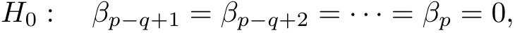


where for convenience we have put the variables chosen for omission at the end of the list. In this case we fit a second model that uses all the variables _except_ those last _q_ . Suppose that the residual sum of squares for that model is RSS0. Then the appropriate _F_ -statistic is 


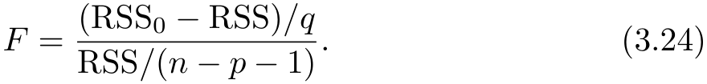


Notice that in Table 3.4, for each individual predictor a _t_ -statistic and a _p_ -value were reported. These provide information about whether each individual predictor is related to the response, after adjusting for the other predictors. It turns out that each of these is exactly equivalent<sup>7</sup> to the _F_ - test that omits that single variable from the model, leaving all the others in—i.e. _q_ =1 in (3.24). So it reports the _partial effect_ of adding that variable to the model. For instance, as we discussed earlier, these _p_ -values indicate that `TV` and `radio` are related to `sales` , but that there is no evidence that `newspaper` is associated with `sales` , when `TV` and `radio` are held fixed. 

Given these individual _p_ -values for each variable, why do we need to look at the overall _F_ -statistic? After all, it seems likely that if any one of the _p_ -values for the individual variables is very small, then _at least one of the predictors is related to the response_ . However, this logic is flawed, especially when the number of predictors _p_ is large. 

For instance, consider an example in which _p_ = 100 and _H_ 0 : _β_ 1 = _β_ 2 = _· · ·_ = _βp_ = 0 is true, so no variable is truly associated with the response. In this situation, about 5 % of the _p_ -values associated with each variable (of the type shown in Table 3.4) will be below 0 _._ 05 by chance. In other words, we expect to see approximately five _small p_ -values even in the absence of 

> 6Even if the errors are not normally-distributed, the _F_ -statistic approximately follows an _F_ -distribution provided that the sample size _n_ is large. 

> 7The square of each _t_ -statistic is the corresponding _F_ -statistic. 

78 3. Linear Regression 

any true association between the predictors and the response.<sup>8</sup> In fact, it is likely that we will observe at least one _p_ -value below 0 _._ 05 by chance! Hence, if we use the individual _t_ -statistics and associated _p_ -values in order to decide whether or not there is any association between the variables and the response, there is a very high chance that we will incorrectly conclude that there is a relationship. However, the _F_ -statistic does not suffer from this problem because it adjusts for the number of predictors. Hence, if _H_ 0 is true, there is only a 5 % chance that the _F_ -statistic will result in a _p_ - value below 0 _._ 05, regardless of the number of predictors or the number of observations. 

The approach of using an _F_ -statistic to test for any association between the predictors and the response works when _p_ is relatively small, and certainly small compared to _n_ . However, sometimes we have a very large number of variables. If _p > n_ then there are more coefficients _βj_ to estimate than observations from which to estimate them. In this case we cannot even fit the multiple linear regression model using least squares, so the _F_ - statistic cannot be used, and neither can most of the other concepts that we have seen so far in this chapter. When _p_ is large, some of the approaches discussed in the next section, such as _forward selection_ , can be used. This _high-dimensional_ setting is discussed in greater detail in Chapter 6. 

highdimensional 

#### Two: Deciding on Important Variables 

As discussed in the previous section, the first step in a multiple regression analysis is to compute the _F_ -statistic and to examine the associated _p_ - value. If we conclude on the basis of that _p_ -value that at least one of the predictors is related to the response, then it is natural to wonder _which_ are the guilty ones! We could look at the individual _p_ -values as in Table 3.4, but as discussed (and as further explored in Chapter 13), if _p_ is large we are likely to make some false discoveries. 

It is possible that all of the predictors are associated with the response, but it is more often the case that the response is only associated with a subset of the predictors. The task of determining which predictors are associated with the response, in order to fit a single model involving only those predictors, is referred to as _variable selection_ . The variable selection variable problem is studied extensively in Chapter 6, and so here we will provide selection only a brief outline of some classical approaches. 

selection 

Ideally, we would like to perform variable selection by trying out a lot of different models, each containing a different subset of the predictors. For instance, if _p_ = 2, then we can consider four models: (1) a model containing no variables, (2) a model containing _X_ 1 only, (3) a model containing _X_ 2 only, and (4) a model containing both _X_ 1 and _X_ 2. We can then se- 

> 8This is related to the important concept of _multiple testing_ , which is the focus of Chapter 13. 

3.2 Multiple Linear Regression 79 

lect the _best_ model out of all of the models that we have considered. How do we determine which model is best? Various statistics can be used to judge _tion criterion_ the quality(AIC),of a _Bayesian_ model. These _information_ include _Mallow’scriterion C_ (BIC), _p_ , _Akaike_ and _informa-adjusted_ Mallow’s _Cp_ Akaike _R_<sup>2</sup> . These are discussed in more detail in Chapter 6. We can also deterinformation mine which model is best by plotting various model outputs, such as the criterion residuals, in order to search for patterns. Bayesian 

Akaike information criterion Bayesian information criterion adjusted _R_<sup>2</sup> 

Unfortunately, there are a total of 2<sup>_p_</sup> models that contain subsets of _p_ variables. This means that even for moderate _p_ , trying out every possible subset of the predictors is infeasible. For instance, we saw that if _p_ = 2, then there are 2<sup>2</sup> = 4 models to consider. But if _p_ = 30, then we must consider 2<sup>30</sup> = 1 _,_ 073 _,_ 741 _,_ 824 models! This is not practical. Therefore, unless _p_ is very small, we cannot consider all 2<sup>_p_</sup> models, and instead we need an automated and efficient approach to choose a smaller set of models to consider. There are three classical approaches for this task: 

- _Forward selection_ . We begin with the _null model_ —a model that con- forward 

- tains an intercept but no predictors. We then fit _p_ simple linear reselection gressions and add to the null model the variable that results in the null lowest RSS. We then add to that model the variable that results in the lowest RSS for the new two-variable model. This approach is continued until some stopping rule is satisfied. 

selection null model 

- _Backward selection_ . We start with all variables in the model, and backward 

- remove the variable with the largest _p_ -value—that is, the variable selection that is the least statistically significant. The new ( _p −_ 1)-variable model is fit, and the variable with the largest _p_ -value is removed. This procedure continues until a stopping rule is reached. For instance, we may stop when all remaining variables have a _p_ -value below some threshold. 

- _Mixed selection_ . This is a combination of forward and backward se- mixed 

- lection. We start with no variables in the model, and as with forward selection, we add the variable that provides the best fit. We continue to add variables one-by-one. Of course, as we noted with the `Advertising` example, the _p_ -values for variables can become larger as new predictors are added to the model. Hence, if at any point the _p_ -value for one of the variables in the model rises above a certain threshold, then we remove that variable from the model. We continue to perform these forward and backward steps until all variables in the model have a sufficiently low _p_ -value, and all variables outside the model would have a large _p_ -value if added to the model. 

   - selection 

Backward selection cannot be used if _p > n_ , while forward selection can always be used. Forward selection is a greedy approach, and might include variables early that later become redundant. Mixed selection can remedy this. 

80 3. Linear Regression 

#### Three: Model Fit 

Two of the most common numerical measures of model fit are the RSE and _R_<sup>2</sup> , the fraction of variance explained. These quantities are computed and interpreted in the same fashion as for simple linear regression. 

Recall that in simple regression, _R_<sup>2</sup> is the square of the correlation of the response and the variable. In multiple linear regression, it turns out that it equals Cor( _Y, Y_<sup>ˆ</sup> )<sup>2</sup> , the square of the correlation between the response and the fitted linear model; in fact one property of the fitted linear model is that it maximizes this correlation among all possible linear models. 

An _R_<sup>2</sup> value close to 1 indicates that the model explains a large portion of the variance in the response variable. As an example, we saw in Table 3.6 that for the `Advertising` data, the model that uses all three advertising media to predict `sales` has an _R_<sup>2</sup> of 0 _._ 8972. On the other hand, the model that uses only `TV` and `radio` to predict `sales` has an _R_<sup>2</sup> value of 0 _._ 89719. In other words, there is a _small_ increase in _R_<sup>2</sup> if we include newspaper advertising in the model that already contains TV and radio advertising, even though we saw earlier that the _p_ -value for newspaper advertising in Table 3.4 is not significant. It turns out that _R_<sup>2</sup> will always increase when more variables are added to the model, even if those variables are only weakly associated with the response. This is due to the fact that adding another variable always results in a decrease in the residual sum of squares on the training data (though not necessarily the testing data). Thus, the _R_<sup>2</sup> statistic, which is also computed on the training data, must increase. The fact that adding newspaper advertising to the model containing only TV and radio advertising leads to just a tiny increase in _R_<sup>2</sup> provides additional evidence that `newspaper` can be dropped from the model. Essentially, `newspaper` provides no real improvement in the model fit to the training samples, and its inclusion will likely lead to poor results on independent test samples due to overfitting. 

By contrast, the model containing only `TV` as a predictor had an _R_<sup>2</sup> of 0 _._ 61 (Table 3.2). Adding `radio` to the model leads to a substantial improvement in _R_<sup>2</sup> . This implies that a model that uses TV and radio expenditures to predict sales is substantially better than one that uses only TV advertising. We could further quantify this improvement by looking at the _p_ -value for the `radio` coefficient in a model that contains only `TV` and `radio` as predictors. 

The model that contains only `TV` and `radio` as predictors has an RSE of 1.681, and the model that also contains `newspaper` as a predictor has an RSE of 1.686 (Table 3.6). In contrast, the model that contains only `TV` has an RSE of 3 _._ 26 (Table 3.2). This corroborates our previous conclusion that a model that uses TV and radio expenditures to predict sales is much more accurate (on the training data) than one that only uses TV spending. Furthermore, given that TV and radio expenditures are used as predictors, there is no point in also using newspaper spending as a predictor in the 

3.2 Multiple Linear Regression 81 


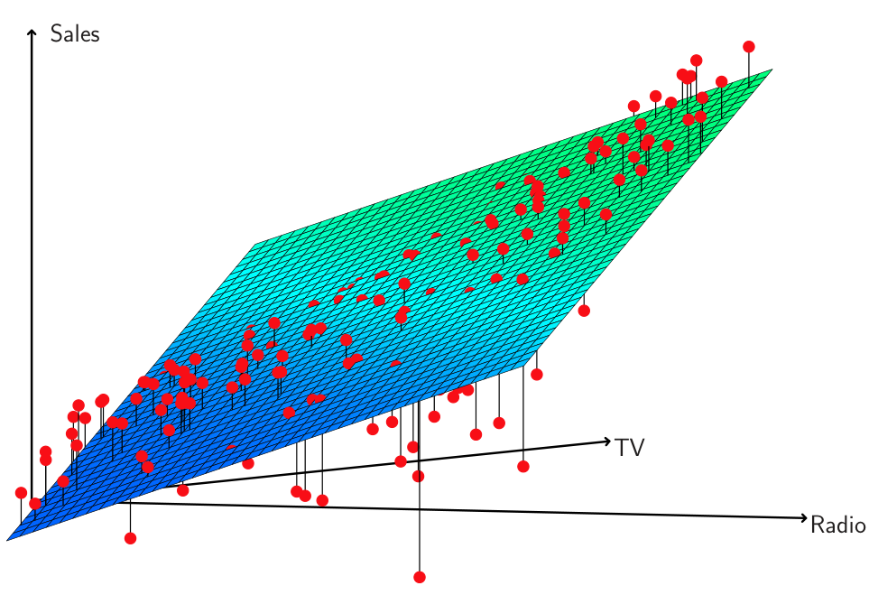


**FIGURE 3.5.** _For the_ `Advertising` _data, a linear regression fit to_ `sales` _using_ `TV` _and_ `radio` _as predictors. From the pattern of the residuals, we can see that there is a pronounced non-linear relationship in the data. The positive residuals (those visible above the surface), tend to lie along the 45-degree line, where TV and Radio budgets are split evenly. The negative residuals (most not visible), tend to lie away from this line, where budgets are more lopsided._ 

model. The observant reader may wonder how RSE can increase when `newspaper` is added to the model given that RSS must decrease. In general RSE is defined as 


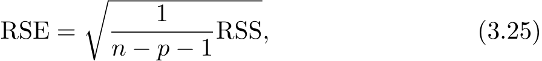


which simplifies to (3.15) for a simple linear regression. Thus, models with more variables can have higher RSE if the decrease in RSS is small relative to the increase in _p_ . 

In addition to looking at the RSE and _R_<sup>2</sup> statistics just discussed, it can be useful to plot the data. Graphical summaries can reveal problems with a model that are not visible from numerical statistics. For example, Figure 3.5 displays a three-dimensional plot of `TV` and `radio` versus `sales` . We see that some observations lie above and some observations lie below the least squares regression plane. In particular, the linear model seems to overestimate `sales` for instances in which most of the advertising money was spent exclusively on either `TV` or `radio` . It underestimates `sales` for instances where the budget was split between the two media. This pronounced non-linear pattern suggests a _synergy_ or _interaction_ effect between interaction the advertising media, whereby combining the media together results in a bigger boost to sales than using any single medium. In Section 3.3.2, we will discuss extending the linear model to accommodate such synergistic effects through the use of interaction terms. 

82 3. Linear Regression 

Four: Predictions 

Once we have fit the multiple regression model, it is straightforward to apply (3.21) in order to predict the response _Y_ on the basis of a set of values for the predictors _X_ 1 _, X_ 2 _, . . . , Xp_ . However, there are three sorts of uncertainty associated with this prediction. 

1. The coefficient estimates _β_<sup>ˆ</sup> 0 _, β_<sup>ˆ</sup> 1 _, . . . , β_<sup>ˆ</sup> _p_ are estimates for _β_ 0 _, β_ 1 _, . . . , βp_ . That is, the _least squares plane_ 


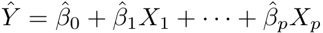


is only an estimate for the _true population regression plane_ 


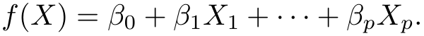


The inaccuracy in the coefficient estimates is related to the _reducible error_ from Chapter 2. We can compute a _confidence interval_ in order to determine how close _Y_<sup>ˆ</sup> will be to _f_ ( _X_ ). 

2. Of course, in practice assuming a linear model for _f_ ( _X_ ) is almost always an approximation of reality, so there is an additional source of potentially reducible error which we call _model bias_ . So when we use a linear model, we are in fact estimating the best linear approximation to the true surface. However, here we will ignore this discrepancy, and operate as if the linear model were correct. 

3. Even if we knew _f_ ( _X_ )—that is, even if we knew the true values for _β_ 0 _, β_ 1 _, . . . , βp_ —the response value cannot be predicted perfectly because of the random error _ϵ_ in the model (3.20). In Chapter 2, we referred _Y_ ˆ ? We useto this _prediction_ as the _irreducibleintervals_ to _error_ answer. Howthismuchquestion.will _Y_ Predictionvary from intervals are always wider than confidence intervals, because they incorporate both the error in the estimate for _f_ ( _X_ ) (the reducible error) and the uncertainty as to how much an individual point will differ from the population regression plane (the irreducible error). 

We use a _confidence interval_ to quantify the uncertainty surrounding confidence the _average_ `sales` over a large number of cities. For example, given that interval $100 _,_ 000 is spent on `TV` advertising and $20 _,_ 000 is spent on `radio` advertising in each city, the 95 % confidence interval is [10 _,_ 985 _,_ 11 _,_ 528]. We interpret this to mean that 95 % of intervals of this form will contain the true value of _f_ ( _X_ ).<sup>9</sup> On the other hand, a _prediction interval_ can be used to quantify the prediction 

interval 

> 9In other words, if we collect a large number of data sets like the `Advertising` data set, and we construct a confidence interval for the average `sales` on the basis of each data set (given $100 _,_ 000 in `TV` and $20 _,_ 000 in `radio` advertising), then 95 % of these confidence intervals will contain the true value of average `sales` . 

3.3 Other Considerations in the Regression Model 83 

uncertainty surrounding `sales` for a _particular_ city. Given that $100 _,_ 000 is spent on `TV` advertising and $20 _,_ 000 is spent on `radio` advertising in that city the 95 % prediction interval is [7 _,_ 930 _,_ 14 _,_ 580]. We interpret this to mean that 95 % of intervals of this form will contain the true value of _Y_ for this city. Note that both intervals are centered at 11 _,_ 256, but that the prediction interval is substantially wider than the confidence interval, reflecting the increased uncertainty about `sales` for a given city in comparison to the average `sales` over many locations. 

## 3.3 Other Considerations in the Regression Model 

### _3.3.1 Qualitative Predictors_ 

In our discussion so far, we have assumed that all variables in our linear regression model are _quantitative_ . But in practice, this is not necessarily the case; often some predictors are _qualitative_ . 

For example, the `Credit` data set displayed in Figure 3.6 records variables for a number of credit card holders. The response is `balance` (average credit card debt for each individual) and there are several quantitative predictors: `age` , `cards` (number of credit cards), `education` (years of education), `income` (in thousands of dollars), `limit` (credit limit), and `rating` (credit rating). Each panel of Figure 3.6 is a scatterplot for a pair of variables whose identities are given by the corresponding row and column labels. For example, the scatterplot directly to the right of the word “Balance” depicts `balance` versus `age` , while the plot directly to the right of “Age” corresponds to `age` versus `cards` . In addition to these quantitative variables, we also have four qualitative variables: `own` (house ownership), `student` (student status), `status` (marital status), and `region` (East, West or South). 

#### Predictors with Only Two Levels 

Suppose that we wish to investigate differences in credit card balance between those who own a house and those who don’t, ignoring the other variables for the moment. If a qualitative predictor (also known as a _factor_ ) factor only has two _levels_ , or possible values, then incorporating it into a regres- level sion model is very simple. We simply create an indicator or _dummy variable_ dummy that takes on two possible numerical values.<sup>10</sup> For example, based on the variable `own` variable, we can create a new variable that takes the form 

variable 


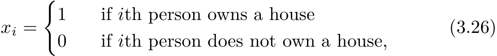


> 10In the machine learning community, the creation of dummy variables to handle qualitative predictors is known as “one-hot encoding”. 

84 3. Linear Regression 


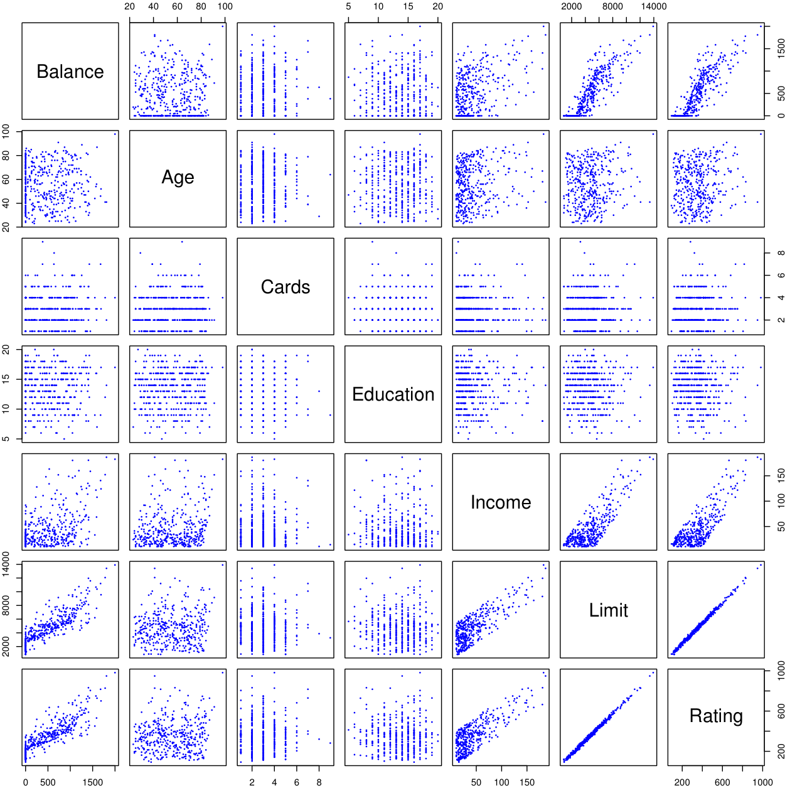


**FIGURE 3.6.** _The_ `Credit` _data set contains information about_ `balance` _,_ `age` _,_ `cards` _,_ `education` _,_ `income` _,_ `limit` _, and_ `rating` _for a number of potential customers._ 

and use this variable as a predictor in the regression equation. This results in the model 


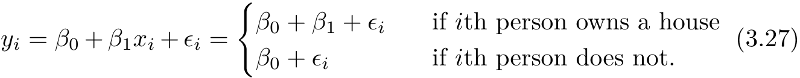


Now _β_ 0 can be interpreted as the average credit card balance among those who do not own, _β_ 0 + _β_ 1 as the average credit card balance among those who do own their house, and _β_ 1 as the average difference in credit card balance between owners and non-owners. Table 3.7 displays the coefficient estimates and other information associated with the model (3.27). The average credit card debt for non-owners is estimated to be $509 _._ 80, whereas owners are estimated to carry $19 _._ 73 in additional debt for a total of $509 _._ 80 + $19 _._ 73 = $529 _._ 53. However, we 

3.3 Other Considerations in the Regression Model 85 

||Coefcient|Std. error|_t_-statistic|_p_-value|
|---|---|---|---|---|
|`Intercept`|509.80|33.13|15.389|_<_0_._0001|
|`own[Yes]`|19.73|46.05|0.429|0.6690|


**TABLE 3.7.** _Least squares coefficient estimates associated with the regression of_ `balance` _onto_ `own` _in the_ `Credit` _data set. The linear model is given in (3.27). That is, ownership is encoded as a dummy variable, as in (3.26)._ 

notice that the _p_ -value for the dummy variable is very high. This indicates that there is no statistical evidence of a difference in average credit card balance based on house ownership. 

The decision to code owners as 1 and non-owners as 0 in (3.27) is arbitrary, and has no effect on the regression fit, but does alter the interpretation of the coefficients. If we had coded non-owners as 1 and owners as 0, then the estimates for _β_ 0 and _β_ 1 would have been 529 _._ 53 and _−_ 19 _._ 73, respectively, leading once again to a prediction of credit card debt of $529 _._ 53 _−_ $19 _._ 73 = $509 _._ 80 for non-owners and a prediction of $529 _._ 53 for owners. Alternatively, instead of a 0 _/_ 1 coding scheme, we could create a dummy variable 


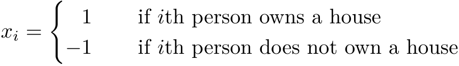


and use this variable in the regression equation. This results in the model 


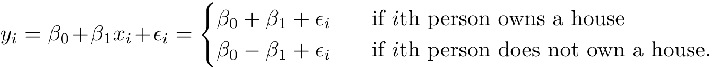


Now _β_ 0 can be interpreted as the overall average credit card balance (ignoring the house ownership effect), and _β_ 1 is the amount by which house owners and non-owners have credit card balances that are above and below the average, respectively.<sup>11</sup> In this example, the estimate for _β_ 0 is $519 _._ 665, halfway between the non-owner and owner averages of $509 _._ 80 and $529 _._ 53. The estimate for _β_ 1 is $9 _._ 865, which is half of $19 _._ 73, the average difference between owners and non-owners. It is important to note that the final predictions for the credit balances of owners and non-owners will be identical regardless of the coding scheme used. The only difference is in the way that the coefficients are interpreted. 

#### Qualitative Predictors with More than Two Levels 

When a qualitative predictor has more than two levels, a single dummy variable cannot represent all possible values. In this situation, we can create 

> 11Technically _β_ 0 is half the sum of the average debt for house owners and the average debt for non-house owners. Hence, _β_ 0 is exactly equal to the overall average only if the two groups have an equal number of members. 

86 3. Linear Regression 

additional dummy variables. For example, for the `region` variable we create two dummy variables. The first could be 


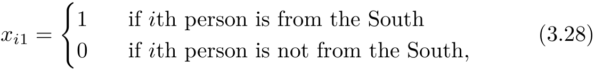


and the second could be 


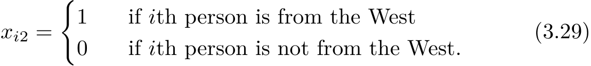


Then both of these variables can be used in the regression equation, in order to obtain the model 


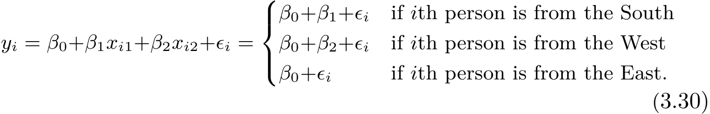


Now _β_ 0 can be interpreted as the average credit card balance for individuals from the East, _β_ 1 can be interpreted as the difference in the average balance between people from the South versus the East, and _β_ 2 can be interpreted as the difference in the average balance between those from the West versus the East. There will always be one fewer dummy variable than the number of levels. The level with no dummy variable—East in this example—is known as the _baseline_ . 

From Table 3.8, we see that the estimated `balance` for the baseline, East, is $531 _._ 00. It is estimated that those in the South will have $18 _._ 69 less debt than those in the East, and that those in the West will have $12 _._ 50 less debt than those in the East. However, the _p_ -values associated with the coefficient estimates for the two dummy variables are very large, suggesting no statistical evidence of a real difference in average credit card balance between South and East or between West and East.<sup>12</sup> Once again, the level selected as the baseline category is arbitrary, and the final predictions for each group will be the same regardless of this choice. However, the coefficients and their _p_ -values do depend on the choice of dummy variable coding. Rather than rely on the individual coefficients, we can use an _F_ -test to test _H_ 0 : _β_ 1 = _β_ 2 = 0; this does not depend on the coding. This _F_ -test has a _p_ -value of 0 _._ 96, indicating that we cannot reject the null hypothesis that there is no relationship between `balance` and `region` . 

Using this dummy variable approach presents no difficulties when incorporating both quantitative and qualitative predictors. For example, to regress `balance` on both a quantitative variable such as `income` and a qualitative variable such as `student` , we must simply create a dummy variable 

baseline 

> 12There could still in theory be a difference between South and West, although the data here does not suggest any difference. 

3.3 Other Considerations in the Regression Model 87 

||Coefcient|Std. error|_t_-statistic|_p_-value|
|---|---|---|---|---|
|`Intercept`|531.00|46.32|11.464|_<_0_._0001|
|`region[South]`|_−_12.50|56.68|_−_0.221|0.8260|
|`region[West]`|_−_18.69|65.02|_−_0.287|0.7740|


**TABLE 3.8.** _Least squares coefficient estimates associated with the regression of_ `balance` _onto_ `region` _in the_ `Credit` _data set. The linear model is given in (3.30). That is, region is encoded via two dummy variables (3.28) and (3.29)._ 

for `student` and then fit a multiple regression model using `income` and the dummy variable as predictors for credit card balance. 

There are many different ways of coding qualitative variables besides the dummy variable approach taken here. All of these approaches lead to equivalent model fits, but the coefficients are different and have different interpretations, and are designed to measure particular _contrasts_ . This topic contrast is beyond the scope of the book. 

### _3.3.2 Extensions of the Linear Model_ 

The standard linear regression model (3.19) provides interpretable results and works quite well on many real-world problems. However, it makes several highly restrictive assumptions that are often violated in practice. Two of the most important assumptions state that the relationship between the predictors and response are _additive_ and _linear_ . The additivity assumption additive means that the association between a predictor _Xj_ and the response _Y_ does linear not depend on the values of the other predictors. The linearity assumption states that the change in the response _Y_ associated with a one-unit change in _Xj_ is constant, regardless of the value of _Xj_ . In later chapters of this book, we examine a number of sophisticated methods that relax these two assumptions. Here, we briefly examine some common classical approaches for extending the linear model. 

#### Removing the Additive Assumption 

In our previous analysis of the `Advertising` data, we concluded that both `TV` and `radio` seem to be associated with `sales` . The linear models that formed the basis for this conclusion assumed that the effect on `sales` of increasing one advertising medium is independent of the amount spent on the other media. For example, the linear model (3.20) states that the average increase in `sales` associated with a one-unit increase in `TV` is always _β_ 1, regardless of the amount spent on `radio` . 

However, this simple model may be incorrect. Suppose that spending money on radio advertising actually increases the effectiveness of TV advertising, so that the slope term for `TV` should increase as `radio` increases. In this situation, given a fixed budget of $100 _,_ 000, spending half on `radio` and half on `TV` may increase `sales` more than allocating the entire amount 

88 3. Linear Regression 

to either `TV` or to `radio` . In marketing, this is known as a _synergy_ effect, and in statistics it is referred to as an _interaction_ effect. Figure 3.5 suggests that such an effect may be present in the advertising data. Notice that when levels of either `TV` or `radio` are low, then the true `sales` are lower than predicted by the linear model. But when advertising is split between the two media, then the model tends to underestimate `sales` . 

Consider the standard linear regression model with two variables, 


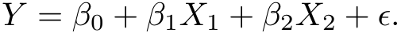


According to this model, a one-unit increase in _X_ 1 is associated with an average increase in _Y_ of _β_ 1 units. Notice that the presence of _X_ 2 does not alter this statement—that is, regardless of the value of _X_ 2, a oneunit increase in _X_ 1 is associated with a _β_ 1-unit increase in _Y_ . One way of extending this model is to include a third predictor, called an _interaction term_ , which is constructed by computing the product of _X_ 1 and _X_ 2. This results in the model 


How does inclusion of this interaction term relax the additive assumption? Notice that (3.31) can be rewritten as 


where _β_<sup>˜</sup> 1 = _β_ 1 + _β_ 3 _X_ 2. Since _β_<sup>˜</sup> 1 is now a function of _X_ 2, the association between _X_ 1 and _Y_ is no longer constant: a change in the value of _X_ 2 will change the association between _X_ 1 and _Y_ . A similar argument shows that a change in the value of _X_ 1 changes the association between _X_ 2 and _Y_ . 

For example, suppose that we are interested in studying the productivity of a factory. We wish to predict the number of `units` produced on the basis of the number of production `lines` and the total number of `workers` . It seems likely that the effect of increasing the number of production lines will depend on the number of workers, since if no workers are available to operate the lines, then increasing the number of lines will not increase production. This suggests that it would be appropriate to include an interaction term between `lines` and `workers` in a linear model to predict `units` . Suppose that when we fit the model, we obtain 


In other words, adding an additional line will increase the number of units produced by 3 _._ 4 + 1 _._ 4 _×_ `workers` . Hence the more `workers` we have, the stronger will be the effect of `lines` . 

3.3 Other Considerations in the Regression Model 89 

||Coefcient|Std. error|_t_-statistic|_p_-value|
|---|---|---|---|---|
|`Intercept`|6.7502|0.248|27.23|_<_0_._0001|
|`TV`|0.0191|0.002|12.70|_<_0_._0001|
|`radio`|0.0289|0.009|3.24|0.0014|
|`TV`_×_`radio`|0.0011|0.000|20.73|_<_0_._0001|


**TABLE 3.9.** _For the_ `Advertising` _data, least squares coefficient estimates associated with the regression of_ `sales` _onto_ `TV` _and_ `radio` _, with an interaction term, as in (3.33)._ 

We now return to the `Advertising` example. A linear model that uses `radio` , `TV` , and an interaction between the two to predict `sales` takes the form 


We can interpret _β_ 3 as the increase in the effectiveness of TV advertising associated with a one-unit increase in radio advertising (or vice-versa). The coefficients that result from fitting the model (3.33) are given in Table 3.9. 

The results in Table 3.9 strongly suggest that the model that includes the interaction term is superior to the model that contains only _main effects_ . main effect The _p_ -value for the interaction term, `TV` _×_ `radio` , is extremely low, indicating that there is strong evidence for _Ha_ : _β_ 3 = 0. In other words, it is clear that the true relationship is not additive. The _R_<sup>2</sup> for the model (3.33) is 96.8 %, compared to only 89.7 % for the model that predicts `sales` using `TV` and `radio` without an interaction term. This means that (96 _._ 8 _−_ 89 _._ 7) _/_ (100 _−_ 89 _._ 7) = 69 % of the variability in `sales` that remains after fitting the additive model has been explained by the interaction term. The coefficient estimates in Table 3.9 suggest that an increase in TV advertising of $1 _,_ 000 is associated with increased sales of ( _β_<sup>ˆ</sup> 1 + _β_<sup>ˆ</sup> 3 _×_ `radio` ) _×_ 1 _,_ 000 = 19+1 _._ 1 _×_ `radio` units. And an increase in radio advertising of $1 _,_ 000 will be associated with an increase in sales of ( _β_<sup>ˆ</sup> 2 + _β_<sup>ˆ</sup> 3 _×_ `TV` ) _×_ 1 _,_ 000 = 29 + 1 _._ 1 _×_ `TV` units. 

In this example, the _p_ -values associated with `TV` , `radio` , and the interaction term all are statistically significant (Table 3.9), and so it is obvious that all three variables should be included in the model. However, it is sometimes the case that an interaction term has a very small _p_ -value, but the associated main effects (in this case, `TV` and `radio` ) do not. The _hierarchical principle_ states that _if we include an interaction in a model, we_ hierarchical _should also include the main effects, even if the p-values associated with_ principle _their coefficients are not significant._ In other words, if the interaction between _X_ 1 and _X_ 2 seems important, then we should include both _X_ 1 and _X_ 2 in the model even if their coefficient estimates have large _p_ -values. The rationale for this principle is that if _X_ 1 _× X_ 2 is related to the response, then whether or not the coefficients of _X_ 1 or _X_ 2 are exactly zero is of lit- 

90 3. Linear Regression 

tle interest. Also _X_ 1 _× X_ 2 is typically correlated with _X_ 1 and _X_ 2, and so leaving them out tends to alter the meaning of the interaction. 

In the previous example, we considered an interaction between `TV` and `radio` , both of which are quantitative variables. However, the concept of interactions applies just as well to qualitative variables, or to a combination of quantitative and qualitative variables. In fact, an interaction between a qualitative variable and a quantitative variable has a particularly nice interpretation. Consider the `Credit` data set from Section 3.3.1, and suppose that we wish to predict `balance` using the `income` (quantitative) and `student` (qualitative) variables. In the absence of an interaction term, the model takes the form 


Notice that this amounts to fitting two parallel lines to the data, one for students and one for non-students. The lines for students and non-students have different intercepts, _β_ 0 + _β_ 2 versus _β_ 0, but the same slope, _β_ 1. This is illustrated in the left-hand panel of Figure 3.7. The fact that the lines are parallel means that the average effect on `balance` of a one-unit increase in `income` does not depend on whether or not the individual is a student. This represents a potentially serious limitation of the model, since in fact a change in `income` may have a very different effect on the credit card balance of a student versus a non-student. 

This limitation can be addressed by adding an interaction variable, created by multiplying `income` with the dummy variable for `student` . Our model now becomes 


Once again, we have two different regression lines for the students and the non-students. But now those regression lines have different intercepts, _β_ 0+ _β_ 2 versus _β_ 0, as well as different slopes, _β_ 1+ _β_ 3 versus _β_ 1. This allows for the possibility that changes in income may affect the credit card balances of students and non-students differently. The right-hand panel of Figure 3.7 shows the estimated relationships between `income` and `balance` for students 

3.3 Other Considerations in the Regression Model 91 


**FIGURE 3.7.** _For the_ `Credit` _data, the least squares lines are shown for prediction of_ `balance` _from_ `income` _for students and non-students._ Left: _The model (3.34) was fit. There is no interaction between_ `income` _and_ `student` _._ Right: _The model (3.35) was fit. There is an interaction term between_ `income` _and_ `student` _._ 

and non-students in the model (3.35). We note that the slope for students is lower than the slope for non-students. This suggests that increases in income are associated with smaller increases in credit card balance among students as compared to non-students. 

#### Non-linear Relationships 

As discussed previously, the linear regression model (3.19) assumes a linear relationship between the response and predictors. But in some cases, the true relationship between the response and the predictors may be nonlinear. Here we present a very simple way to directly extend the linear model to accommodate non-linear relationships, using _polynomial regression_ . In polynomial later chapters, we will present more complex approaches for performing regression non-linear fits in more general settings. 

Consider Figure 3.8, in which the `mpg` (gas mileage in miles per gallon) versus `horsepower` is shown for a number of cars in the `Auto` data set. The orange line represents the linear regression fit. There is a pronounced relationship between `mpg` and `horsepower` , but it seems clear that this relationship is in fact non-linear: the data suggest a curved relationship. A simple approach for incorporating non-linear associations in a linear model is to include transformed versions of the predictors. For example, the points in Figure 3.8 seem to have a _quadratic_ shape, suggesting that a model of the quadratic form 


may provide a better fit. Equation 3.36 involves predicting `mpg` using a non-linear function of `horsepower` . _But it is still a linear model!_ That is, (3.36) is simply a multiple linear regression model with _X_ 1 = `horsepower` 


**FIGURE 3.8.** _The_ `Auto` _data set. For a number of cars,_ `mpg` _and_ `horsepower` _are shown. The linear regression fit is shown in orange. The linear regression fit for a model that includes_ `horsepower`<sup>2</sup> _is shown as a blue curve. The linear regression fit for a model that includes all polynomials of_ `horsepower` _up to fifth-degree is shown in green._ 

||Coefcient|Std. error|_t_-statistic|_p_-value|
|---|---|---|---|---|
|`Intercept`|56.9001|1.8004|31.6|_<_0_._0001|
|`horsepower`|_−_0.4662|0.0311|_−_15.0|_<_0_._0001|
|`horsepower`<sup>2</sup>|0.0012|0.0001|10.1|_<_0_._0001|


**TABLE 3.10.** _For the_ `Auto` _data set, least squares coefficient estimates associated with the regression of_ `mpg` _onto_ `horsepower` _and_ `horsepower`<sup>2</sup> _._ 

and _X_ 2 = `horsepower`<sup>2</sup> . So we can use standard linear regression software to estimate _β_ 0 _, β_ 1, and _β_ 2 in order to produce a non-linear fit. The blue curve in Figure 3.8 shows the resulting quadratic fit to the data. The quadratic fit appears to be substantially better than the fit obtained when just the linear term is included. The _R_<sup>2</sup> of the quadratic fit is 0 _._ 688, compared to 0 _._ 606 for the linear fit, and the _p_ -value in Table 3.10 for the quadratic term is highly significant. 

If including `horsepower`<sup>2</sup> led to such a big improvement in the model, why not include `horsepower`<sup>3</sup> , `horsepower`<sup>4</sup> , or even `horsepower`<sup>5</sup> ? The green curve in Figure 3.8 displays the fit that results from including all polynomials up to fifth degree in the model (3.36). The resulting fit seems unnecessarily wiggly—that is, it is unclear that including the additional terms really has led to a better fit to the data. 

3.3 Other Considerations in the Regression Model 

93 

The approach that we have just described for extending the linear model to accommodate non-linear relationships is known as _polynomial regression_ , since we have included polynomial functions of the predictors in the regression model. We further explore this approach and other non-linear extensions of the linear model in Chapter 7. 

### _3.3.3 Potential Problems_ 

When we fit a linear regression model to a particular data set, many problems may occur. Most common among these are the following: 

1. _Non-linearity of the response-predictor relationships._ 

2. _Correlation of error terms._ 

3. _Non-constant variance of error terms._ 

4. _Outliers._ 

5. _High-leverage points._ 

6. _Collinearity._ 

In practice, identifying and overcoming these problems is as much an art as a science. Many pages in countless books have been written on this topic. Since the linear regression model is not our primary focus here, we will provide only a brief summary of some key points. 

#### 1. Non-linearity of the Data 

The linear regression model assumes that there is a straight-line relationship between the predictors and the response. If the true relationship is far from linear, then virtually all of the conclusions that we draw from the fit are suspect. In addition, the prediction accuracy of the model can be significantly reduced. 

_Residual plots_ are a useful graphical tool for identifying non-linearity. residual plot Given a simple linear regression model, we can plot the residuals, _ei_ = ˆ _yi − yi_ , versus the predictor _xi_ . In the case of a multiple regression model, since there are multiple predictors, we instead plot the residuals versus ˆ the predicted (or _fitted_ ) values _yi_ . Ideally, the residual plot will show no fitted discernible pattern. The presence of a pattern may indicate a problem with some aspect of the linear model. 

The left panel of Figure 3.9 displays a residual plot from the linear regression of `mpg` onto `horsepower` on the `Auto` data set that was illustrated in Figure 3.8. The red line is a smooth fit to the residuals, which is displayed in order to make it easier to identify any trends. The residuals exhibit a clear U-shape, which provides a strong indication of non-linearity in the data. In contrast, the right-hand panel of Figure 3.9 displays the residual plot 

94 3. Linear Regression 


**FIGURE 3.9.** _Plots of residuals versus predicted (or fitted) values for the_ `Auto` _data set. In each plot, the red line is a smooth fit to the residuals, intended to make it easier to identify a trend._ Left: _A linear regression of_ `mpg` _on_ `horsepower` _. A strong pattern in the residuals indicates non-linearity in the data._ Right: _A linear regression of_ `mpg` _on_ `horsepower` _and_ `horsepower`<sup>2</sup> _. There is little pattern in the residuals._ 

that results from the model (3.36), which contains a quadratic term. There appears to be little pattern in the residuals, suggesting that the quadratic term improves the fit to the data. 

If the residual plot indicates that there are non-linear associations in the data, then a simple approach is to use non-linear transformations of the predictors, such as log _X_ , _√X_ , and _X_<sup>2</sup> , in the regression model. In the later chapters of this book, we will discuss other more advanced non-linear approaches for addressing this issue. 

#### 2. Correlation of Error Terms 

An important assumption of the linear regression model is that the error terms, _ϵ_ 1 _, ϵ_ 2 _, . . . , ϵn_ , are uncorrelated. What does this mean? For instance, if the errors are uncorrelated, then the fact that _ϵi_ is positive provides little or no information about the sign of _ϵi_ +1. The standard errors that are computed for the estimated regression coefficients or the fitted values are based on the assumption of uncorrelated error terms. If in fact there is correlation among the error terms, then the estimated standard errors will tend to underestimate the true standard errors. As a result, confidence and prediction intervals will be narrower than they should be. For example, a 95 % confidence interval may in reality have a much lower probability than 0 _._ 95 of containing the true value of the parameter. In addition, _p_ - values associated with the model will be lower than they should be; this could cause us to erroneously conclude that a parameter is statistically 

3.3 Other Considerations in the Regression Model 95 

significant. In short, if the error terms are correlated, we may have an unwarranted sense of confidence in our model. 

As an extreme example, suppose we accidentally doubled our data, leading to observations and error terms identical in pairs. If we ignored this, our standard error calculations would be as if we had a sample of size 2 _n_ , when in fact we have only _n_ samples. Our estimated parameters would be the same for the 2 _n_ samples as for the _n_ samples, but the confidence intervals would be narrower by a factor of _√_ 2! 

Why might correlations among the error terms occur? Such correlations frequently occur in the context of _time series_ data, which consists of ob- time series servations for which measurements are obtained at discrete points in time. In many cases, observations that are obtained at adjacent time points will have positively correlated errors. In order to determine if this is the case for a given data set, we can plot the residuals from our model as a function of time. If the errors are uncorrelated, then there should be no discernible pattern. On the other hand, if the error terms are positively correlated, then we may see _tracking_ in the residuals—that is, adjacent residuals may have tracking similar values. Figure 3.10 provides an illustration. In the top panel, we see the residuals from a linear regression fit to data generated with uncorrelated errors. There is no evidence of a time-related trend in the residuals. In contrast, the residuals in the bottom panel are from a data set in which adjacent errors had a correlation of 0 _._ 9. Now there is a clear pattern in the residuals—adjacent residuals tend to take on similar values. Finally, the center panel illustrates a more moderate case in which the residuals had a correlation of 0 _._ 5. There is still evidence of tracking, but the pattern is less clear. 

Many methods have been developed to properly take account of correlations in the error terms in time series data. Correlation among the error terms can also occur outside of time series data. For instance, consider a study in which individuals’ heights are predicted from their weights. The assumption of uncorrelated errors could be violated if some of the individuals in the study are members of the same family, eat the same diet, or have been exposed to the same environmental factors. In general, the assumption of uncorrelated errors is extremely important for linear regression as well as for other statistical methods, and good experimental design is crucial in order to mitigate the risk of such correlations. 

#### 3. Non-constant Variance of Error Terms 

Another important assumption of the linear regression model is that the error terms have a constant variance, Var( _ϵi_ ) = _σ_<sup>2</sup> . The standard errors, confidence intervals, and hypothesis tests associated with the linear model rely upon this assumption. 

Unfortunately, it is often the case that the variances of the error terms are non-constant. For instance, the variances of the error terms may increase 

96 3. Linear Regression 


**FIGURE 3.10.** _Plots of residuals from simulated time series data sets generated with differing levels of correlation ρ between error terms for adjacent time points._ 

with the value of the response. One can identify non-constant variances in the errors, or _heteroscedasticity_ , from the presence of a _funnel shape_ in heterothe residual plot. An example is shown in the left-hand panel of Figure 3.11, in which the magnitude of the residuals tends to increase with the fitted values. When faced with this problem, one possible solution is to transform the response _Y_ using a concave function such as log _Y_ or _√Y_ . Such a transformation results in a greater amount of shrinkage of the larger responses, leading to a reduction in heteroscedasticity. The right-hand panel of Figure 3.11 displays the residual plot after transforming the response using log _Y_ . The residuals now appear to have constant variance, though there is some evidence of a slight non-linear relationship in the data. 

scedasticity 

Sometimes we have a good idea of the variance of each response. For example, the _i_ th response could be an average of _ni_ raw observations. If each of these raw observations is uncorrelated with variance _σ_<sup>2</sup> , then their average has variance _σi_<sup>2=</sup><sup>_σ_2</sup><sup>_/ni_.Inthiscaseasimpleremedyistofitour</sup> model by _weighted least squares_ , with weights proportional to the inverse weighted 

least squares 

3.3 Other Considerations in the Regression Model 97 


**FIGURE 3.11.** _Residual plots. In each plot, the red line is a smooth fit to the residuals, intended to make it easier to identify a trend. The blue lines track the outer quantiles of the residuals, and emphasize patterns._ Left: _The funnel shape indicates heteroscedasticity._ Right: _The response has been log transformed, and there is now no evidence of heteroscedasticity._ 

variances—i.e. _wi_ = _ni_ in this case. Most linear regression software allows for observation weights. 

#### 4. Outliers 

An _outlier_ is a point for which _yi_ is far from the value predicted by the outlier model. Outliers can arise for a variety of reasons, such as incorrect recording of an observation during data collection. 

The red point (observation 20) in the left-hand panel of Figure 3.12 illustrates a typical outlier. The red solid line is the least squares regression fit, while the blue dashed line is the least squares fit after removal of the outlier. In this case, removing the outlier has little effect on the least squares line: it leads to almost no change in the slope, and a miniscule reduction in the intercept. It is typical for an outlier that does not have an unusual predictor value to have little effect on the least squares fit. However, even if an outlier does not have much effect on the least squares fit, it can cause other problems. For instance, in this example, the RSE is 1 _._ 09 when the outlier is included in the regression, but it is only 0 _._ 77 when the outlier is removed. Since the RSE is used to compute all confidence intervals and _p_ -values, such a dramatic increase caused by a single data point can have implications for the interpretation of the fit. Similarly, inclusion of the outlier causes the _R_<sup>2</sup> to decline from 0 _._ 892 to 0 _._ 805. 

Residual plots can be used to identify outliers. In this example, the outlier is clearly visible in the residual plot illustrated in the center panel of Figure 3.12. But in practice, it can be difficult to decide how large a resid- 

98 3. Linear Regression 


**FIGURE 3.12.** Left: _The least squares regression line is shown in red, and the regression line after removing the outlier is shown in blue._ Center: _The residual plot clearly identifies the outlier._ Right: _The outlier has a studentized residual of_ 6 _; typically we expect values between −_ 3 _and_ 3 _._ 


**FIGURE 3.13.** Left: _Observation 41 is a high leverage point, while 20 is not. The red line is the fit to all the data, and the blue line is the fit with observation 41 removed._ Center: _The red observation is not unusual in terms of its X_ 1 _value or its X_ 2 _value, but still falls outside the bulk of the data, and hence has high leverage._ Right: _Observation_ 41 _has a high leverage and a high residual._ 

ual needs to be before we consider the point to be an outlier. To address this problem, instead of plotting the residuals, we can plot the _studentized residuals_ , computed by dividing each residual _ei_ by its estimated standard studentized error. Observations whose studentized residuals are greater than 3 in absoresidual lute value are possible outliers. In the right-hand panel of Figure 3.12, the outlier’s studentized residual exceeds 6, while all other observations have studentized residuals between _−_ 2 and 2. 

If we believe that an outlier has occurred due to an error in data collection or recording, then one solution is to simply remove the observation. However, care should be taken, since an outlier may instead indicate a deficiency with the model, such as a missing predictor. 

#### 5. High Leverage Points 

We just saw that outliers are observations for which the response _yi_ is unusual given the predictor _xi_ . In contrast, observations with _high leverage_ high 

leverage 

3.3 Other Considerations in the Regression Model 99 

have an unusual value for _xi_ . For example, observation 41 in the left-hand panel of Figure 3.13 has high leverage, in that the predictor value for this observation is large relative to the other observations. (Note that the data displayed in Figure 3.13 are the same as the data displayed in Figure 3.12, but with the addition of a single high leverage observation.) The red solid line is the least squares fit to the data, while the blue dashed line is the fit produced when observation 41 is removed. Comparing the left-hand panels of Figures 3.12 and 3.13, we observe that removing the high leverage observation has a much more substantial impact on the least squares line than removing the outlier. In fact, high leverage observations tend to have a sizable impact on the estimated regression line. It is cause for concern if the least squares line is heavily affected by just a couple of observations, because any problems with these points may invalidate the entire fit. For this reason, it is important to identify high leverage observations. 

In a simple linear regression, high leverage observations are fairly easy to identify, since we can simply look for observations for which the predictor value is outside of the normal range of the observations. But in a multiple linear regression with many predictors, it is possible to have an observation that is well within the range of each individual predictor’s values, but that is unusual in terms of the full set of predictors. An example is shown in the center panel of Figure 3.13, for a data set with two predictors, _X_ 1 and _X_ 2. Most of the observations’ predictor values fall within the blue dashed ellipse, but the red observation is well outside of this range. But neither its value for _X_ 1 nor its value for _X_ 2 is unusual. So if we examine just _X_ 1 or just _X_ 2, we will fail to notice this high leverage point. This problem is more pronounced in multiple regression settings with more than two predictors, because then there is no simple way to plot all dimensions of the data simultaneously. 

In order to quantify an observation’s leverage, we compute the _leverage statistic_ . A large value of this statistic indicates an observation with high leverage leverage. For a simple linear regression, 

statistic 


It is clear from this equation that _hi_ increases with the distance of _xi_ from ¯ _x_ . There is a simple extension of _hi_ to the case of multiple predictors, though we do not provide the formula here. The leverage statistic _hi_ is always between 1 _/n_ and 1, and the average leverage for all the observations is always equal to ( _p_ + 1) _/n_ . So if a given observation has a leverage statistic that greatly exceeds ( _p_ +1) _/n_ , then we may suspect that the corresponding point has high leverage. 

The right-hand panel of Figure 3.13 provides a plot of the studentized residuals versus _hi_ for the data in the left-hand panel of Figure 3.13. Observation 41 stands out as having a very high leverage statistic as well as a high studentized residual. In other words, it is an outlier as well as a high 

100 3. Linear Regression 


**FIGURE 3.14.** _Scatterplots of the observations from the_ `Credit` _data set._ Left: _A plot of_ `age` _versus_ `limit` _. These two variables are not collinear._ Right: _A plot of_ `rating` _versus_ `limit` _. There is high collinearity._ 

leverage observation. This is a particularly dangerous combination! This plot also reveals the reason that observation 20 had relatively little effect on the least squares fit in Figure 3.12: it has low leverage. 

#### 6. Collinearity 

_Collinearity_ refers to the situation in which two or more predictor variables collinearity are closely related to one another. The concept of collinearity is illustrated in Figure 3.14 using the `Credit` data set. In the left-hand panel of Figure 3.14, the two predictors `limit` and `age` appear to have no obvious relationship. In contrast, in the right-hand panel of Figure 3.14, the predictors `limit` and `rating` are very highly correlated with each other, and we say that they are _collinear_ . The presence of collinearity can pose problems in the regression context, since it can be difficult to separate out the individual effects of collinear variables on the response. In other words, since `limit` and `rating` tend to increase or decrease together, it can be difficult to determine how each one separately is associated with the response, `balance` . 

Figure 3.15 illustrates some of the difficulties that can result from collinearity. The left-hand panel of Figure 3.15 is a contour plot of the RSS (3.22) associated with different possible coefficient estimates for the regression of `balance` on `limit` and `age` . Each ellipse represents a set of coefficients that correspond to the same RSS, with ellipses nearest to the center taking on the lowest values of RSS. The black dots and associated dashed lines represent the coefficient estimates that result in the smallest possible RSS—in other words, these are the least squares estimates. The axes for `limit` and `age` have been scaled so that the plot includes possible coefficient estimates that are up to four standard errors on either side of the least squares estimates. Thus the plot includes all plausible values for the 

3.3 Other Considerations in the Regression Model 101 


**FIGURE 3.15.** _Contour plots for the RSS values as a function of the parameters β for various regressions involving the_ `Credit` _data set. In each plot, the black dots represent the coefficient values corresponding to the minimum RSS._ Left: _A contour plot of RSS for the regression of_ `balance` _onto_ `age` _and_ `limit` _. The minimum value is well defined._ Right: _A contour plot of RSS for the regression of_ `balance` _onto_ `rating` _and_ `limit` _. Because of the collinearity, there are many pairs_ ( _β_ Limit _, β_ Rating) _with a similar value for RSS._ 

coefficients. For example, we see that the true `limit` coefficient is almost certainly somewhere between 0 _._ 15 and 0 _._ 20. 

In contrast, the right-hand panel of Figure 3.15 displays contour plots of the RSS associated with possible coefficient estimates for the regression of `balance` onto `limit` and `rating` , which we know to be highly collinear. Now the contours run along a narrow valley; there is a broad range of values for the coefficient estimates that result in equal values for RSS. Hence a small change in the data could cause the pair of coefficient values that yield the smallest RSS—that is, the least squares estimates—to move anywhere along this valley. This results in a great deal of uncertainty in the coefficient estimates. Notice that the scale for the `limit` coefficient now runs from roughly _−_ 0 _._ 2 to 0 _._ 2; this is an eight-fold increase over the plausible range of the `limit` coefficient in the regression with `age` . Interestingly, even though the `limit` and `rating` coefficients now have much more individual uncertainty, they will almost certainly lie somewhere in this contour valley. For example, we would not expect the true value of the `limit` and `rating` coefficients to be _−_ 0 _._ 1 and 1 respectively, even though such a value is plausible for each coefficient individually. 

Since collinearity reduces the accuracy of the estimates of the regression coefficients, it causes the standard error for _β_<sup>ˆ</sup> _j_ to grow. Recall that the _t_ -statistic for each predictor is calculated by dividing _β_<sup>ˆ</sup> _j_ by its standard error. Consequently, collinearity results in a decline in the _t_ -statistic. As a result, in the presence of collinearity, we may fail to reject _H_ 0 : _βj_ = 0. This 

102 3. Linear Regression 

|||Coefcient|Std. error|_t_-statistic|_p_-value|
|---|---|---|---|---|---|
||`Intercept`|_−_173.411|43.828|_−_3.957|_<_0_._0001|
|Model 1|`age`|_−_2.292|0.672|_−_3.407|0_._0007|
||`limit`|0.173|0.005|34.496|_<_0_._0001|
||`Intercept`|_−_377.537|45.254|_−_8.343|_<_0_._0001|
|Model 2|`rating`|2.202|0.952|2.312|0.0213|
||`limit`|0.025|0.064|0.384|0.7012|


**TABLE 3.11.** _The results for two multiple regression models involving the_ `Credit` _data set are shown. Model 1 is a regression of_ `balance` _on_ `age` _and_ `limit` _, and Modelβ_ ˆlimit _increases2 a regression12-fold ofin_ `balance` _the secondonregression,_ `rating` _anddue_ `limit` _to collinearity.. The standard error of_ 

means that the _power_ of the hypothesis test—the probability of correctly power detecting a _non-zero_ coefficient—is reduced by collinearity. 

Table 3.11 compares the coefficient estimates obtained from two separate multiple regression models. The first is a regression of `balance` on `age` and `limit` , and the second is a regression of `balance` on `rating` and `limit` . In the first regression, both `age` and `limit` are highly significant with very small _p_ - values. In the second, the collinearity between `limit` and `rating` has caused the standard error for the `limit` coefficient estimate to increase by a factor of 12 and the _p_ -value to increase to 0 _._ 701. In other words, the importance of the `limit` variable has been masked due to the presence of collinearity. To avoid such a situation, it is desirable to identify and address potential collinearity problems while fitting the model. 

A simple way to detect collinearity is to look at the correlation matrix of the predictors. An element of this matrix that is large in absolute value indicates a pair of highly correlated variables, and therefore a collinearity problem in the data. Unfortunately, not all collinearity problems can be detected by inspection of the correlation matrix: it is possible for collinearity to exist between three or more variables even if no pair of variables has a particularly high correlation. We call this situation _multicollinearity_ . multiInstead of inspecting the correlation matrix, a better way to assess multicollinearity is to compute the _variance inflation factor_ (VIF). The VIF is variance the ratio of the variance of _β_<sup>ˆ</sup> _j_ when fitting the full model divided by the inflation variance of _β_<sup>ˆ</sup> _j_ if fit on its own. The smallest possible value for VIF is 1, factor which indicates the complete absence of collinearity. Typically in practice there is a small amount of collinearity among the predictors. As a rule of thumb, a VIF value that exceeds 5 or 10 indicates a problematic amount of collinearity. The VIF for each variable can be computed using the formula 

collinearity variance inflation factor 


3.4 The Marketing Plan 103 

where _RX_<sup>2</sup> _j |X−j_<sup>isthe</sup><sup>_R_2fromaregressionof</sup><sup>_Xj_ontoalloftheother</sup> predictors. If _RX_<sup>2</sup> _j |X−j_<sup>isclosetoone,thencollinearityispresent,andso</sup> the VIF will be large. 

In the `Credit` data, a regression of `balance` on `age` , `rating` , and `limit` indicates that the predictors have VIF values of 1.01, 160.67, and 160.59. As we suspected, there is considerable collinearity in the data! 

When faced with the problem of collinearity, there are two simple solutions. The first is to drop one of the problematic variables from the regression. This can usually be done without much compromise to the regression fit, since the presence of collinearity implies that the information that this variable provides about the response is redundant in the presence of the other variables. For instance, if we regress `balance` onto `age` and `limit` , without the `rating` predictor, then the resulting VIF values are close to the minimum possible value of 1, and the _R_<sup>2</sup> drops from 0 _._ 754 to 0 _._ 75. So dropping `rating` from the set of predictors has effectively solved the collinearity problem without compromising the fit. The second solution is to combine the collinear variables together into a single predictor. For instance, we might take the average of standardized versions of `limit` and `rating` in order to create a new variable that measures _credit worthiness_ . 

## 3.4 The Marketing Plan 

We now briefly return to the seven questions about the `Advertising` data that we set out to answer at the beginning of this chapter. 

1. _Is there a relationship between sales and advertising budget?_ This question can be answered by fitting a multiple regression model of `sales` onto `TV` , `radio` , and `newspaper` , as in (3.20), and testing the hypothesis _H_ 0 : _β_ `TV` = _β_ `radio` = _β_ `newspaper` = 0. In Section 3.2.2, we showed that the _F_ -statistic can be used to determine whether or not we should reject this null hypothesis. In this case the _p_ -value corresponding to the _F_ -statistic in Table 3.6 is very low, indicating clear evidence of a relationship between advertising and sales. 

2. _How strong is the relationship?_ We discussed two measures of model accuracy in Section 3.1.3. First, the RSE estimates the standard deviation of the response from the population regression line. For the `Advertising` data, the RSE is 1 _._ 69 units while the mean value for the response is 14 _._ 022, indicating a percentage error of roughly 12 %. Second, the _R_<sup>2</sup> statistic records the percentage of variability in the response that is explained by the predictors. The predictors explain almost 90 % of the variance in `sales` . The RSE and _R_<sup>2</sup> statistics are displayed in Table 3.6. 

104 3. Linear Regression 

3. _Which media are associated with sales?_ To answer this question, we can examine the _p_ -values associated with each predictor’s _t_ -statistic (Section 3.1.2). In the multiple linear regression displayed in Table 3.4, the _p_ -values for `TV` and `radio` are low, but the _p_ -value for `newspaper` is not. This suggests that only `TV` and `radio` are related to `sales` . In Chapter 6 we explore this question in greater detail. 

4. _How large is the association between each medium and sales?_ We saw in Section 3.1.2 that the standard error of _β_<sup>ˆ</sup> _j_ can be used to construct confidence intervals for _βj_ . For the `Advertising` data, we can use the results in Table 3.4 to compute the 95 % confidence intervals for the coefficients in a multiple regression model using all three media budgets as predictors. The confidence intervals are as follows: (0 _._ 043 _,_ 0 _._ 049) for `TV` , (0 _._ 172 _,_ 0 _._ 206) for `radio` , and ( _−_ 0 _._ 013 _,_ 0 _._ 011) for `newspaper` . The confidence intervals for `TV` and `radio` are narrow and far from zero, providing evidence that these media are related to `sales` . But the interval for `newspaper` includes zero, indicating that the variable is not statistically significant given the values of `TV` and `radio` . 

   - We saw in Section 3.3.3 that collinearity can result in very wide standard errors. Could collinearity be the reason that the confidence interval associated with `newspaper` is so wide? The VIF scores are 1 _._ 005, 1 _._ 145, and 1 _._ 145 for `TV` , `radio` , and `newspaper` , suggesting no evidence of collinearity. 

In order to assess the association of each medium individually on sales, we can perform three separate simple linear regressions. Results are shown in Tables 3.1 and 3.3. There is evidence of an extremely strong association between `TV` and `sales` and between `radio` and `sales` . There is evidence of a mild association between `newspaper` and `sales` , when the values of `TV` and `radio` are ignored. 

5. _How accurately can we predict future sales?_ The response can be predicted using (3.21). The accuracy associated with this estimate depends on whether we wish to predict an individual response, _Y_ = _f_ ( _X_ ) + _ϵ_ , or the average response, _f_ ( _X_ ) (Section 3.2.2). If the former, we use a prediction interval, and if the latter, we use a confidence interval. Prediction intervals will always be wider than confidence intervals because they account for the uncertainty associated with _ϵ_ , the irreducible error. 

6. _Is the relationship linear?_ 

   - In Section 3.3.3, we saw that residual plots can be used in order to identify non-linearity. If the relationships are linear, then the residual plots should display no pattern. In the case of the `Advertising` data, 

3.5 Comparison of Linear Regression with _K_ -Nearest Neighbors 105 

we observe a non-linear effect in Figure 3.5, though this effect could also be observed in a residual plot. In Section 3.3.2, we discussed the inclusion of transformations of the predictors in the linear regression model in order to accommodate non-linear relationships. 

7. _Is there synergy among the advertising media?_ The standard linear regression model assumes an additive relationship between the predictors and the response. An additive model is easy to interpret because the association between each predictor and the response is unrelated to the values of the other predictors. However, the additive assumption may be unrealistic for certain data sets. In Section 3.3.2, we showed how to include an interaction term in the regression model in order to accommodate non-additive relationships. A small _p_ -value associated with the interaction term indicates the presence of such relationships. Figure 3.5 suggested that the `Advertising` data may not be additive. Including an interaction term in the model results in a substantial increase in _R_<sup>2</sup> , from around 90 % to almost 97 %. 

## 3.5 Comparison of Linear Regression with _K_ -Nearest Neighbors 

As discussed in Chapter 2, linear regression is an example of a _parametric_ approach because it assumes a linear functional form for _f_ ( _X_ ). Parametric methods have several advantages. They are often easy to fit, because one need estimate only a small number of coefficients. In the case of linear regression, the coefficients have simple interpretations, and tests of statistical significance can be easily performed. But parametric methods do have a disadvantage: by construction, they make strong assumptions about the form of _f_ ( _X_ ). If the specified functional form is far from the truth, and prediction accuracy is our goal, then the parametric method will perform poorly. For instance, if we assume a linear relationship between _X_ and _Y_ but the true relationship is far from linear, then the resulting model will provide a poor fit to the data, and any conclusions drawn from it will be suspect. 

In contrast, _non-parametric_ methods do not explicitly assume a parametric form for _f_ ( _X_ ), and thereby provide an alternative and more flexible approach for performing regression. We discuss various non-parametric methods in this book. Here we consider one of the simplest and best-known non-parametric methods, _K-nearest neighbors regression_ (KNN regression). _K_ -nearest The KNN regression method is closely related to the KNN classifier disneighbors cussed in Chapter 2. Given a value for _K_ and a prediction point _x_ 0, KNN regression regression first identifies the _K_ training observations that are closest to _x_ 0, represented by _N_ 0. It then estimates _f_ ( _x_ 0) using the average of all the 

106 3. Linear Regression 


**FIGURE 3.16.** _Plots of f_<sup>ˆ</sup> ( _X_ ) _using KNN regression on a two-dimensional data set with_ 64 _observations (orange dots)._ Left: _K_ = 1 _results in a rough step function fit._ Right: _K_ = 9 _produces a much smoother fit._ 

training responses in _N_ 0. In other words, 


Figure 3.16 illustrates two KNN fits on a data set with _p_ = 2 predictors. The fit with _K_ = 1 is shown in the left-hand panel, while the right-hand panel corresponds to _K_ = 9. We see that when _K_ = 1, the KNN fit perfectly interpolates the training observations, and consequently takes the form of a step function. When _K_ = 9, the KNN fit still is a step function, but averaging over nine observations results in much smaller regions of constant prediction, and consequently a smoother fit. In general, the optimal value for _K_ will depend on the _bias-variance tradeoff_ , which we introduced in Chapter 2. A small value for _K_ provides the most flexible fit, which will have low bias but high variance. This variance is due to the fact that the prediction in a given region is entirely dependent on just one observation. In contrast, larger values of _K_ provide a smoother and less variable fit; the prediction in a region is an average of several points, and so changing one observation has a smaller effect. However, the smoothing may cause bias by masking some of the structure in _f_ ( _X_ ). In Chapter 5, we introduce several approaches for estimating test error rates. These methods can be used to identify the optimal value of _K_ in KNN regression. 

In what setting will a parametric approach such as least squares linear regression outperform a non-parametric approach such as KNN regression? The answer is simple: _the parametric approach will outperform the nonparametric approach if the parametric form that has been selected is close to the true form of f_ . Figure 3.17 provides an example with data generated 

3.5 Comparison of Linear Regression with _K_ -Nearest Neighbors 107 

from a one-dimensional linear regression model. The black solid lines represent _f_ ( _X_ ), while the blue curves correspond to the KNN fits using _K_ = 1 and _K_ = 9. In this case, the _K_ = 1 predictions are far too variable, while the smoother _K_ = 9 fit is much closer to _f_ ( _X_ ). However, since the true relationship is linear, it is hard for a non-parametric approach to compete with linear regression: a non-parametric approach incurs a cost in variance that is not offset by a reduction in bias. The blue dashed line in the lefthand panel of Figure 3.18 represents the linear regression fit to the same data. It is almost perfect. The right-hand panel of Figure 3.18 reveals that linear regression outperforms KNN for this data. The green solid line, plotted as a function of 1 _/K_ , represents the test set mean squared error (MSE) for KNN. The KNN errors are well above the black dashed line, which is the test MSE for linear regression. When the value of _K_ is large, then KNN performs only a little worse than least squares regression in terms of MSE. It performs far worse when _K_ is small. 

In practice, the true relationship between _X_ and _Y_ is rarely exactly linear. Figure 3.19 examines the relative performances of least squares regression and KNN under increasing levels of non-linearity in the relationship between _X_ and _Y_ . In the top row, the true relationship is nearly linear. In this case we see that the test MSE for linear regression is still superior to that of KNN for low values of _K_ . However, for _K ≥_ 4, KNN outperforms linear regression. The second row illustrates a more substantial deviation from linearity. In this situation, KNN substantially outperforms linear regression for all values of _K_ . Note that as the extent of non-linearity increases, there is little change in the test set MSE for the non-parametric KNN method, but there is a large increase in the test set MSE of linear regression. 

Figures 3.18 and 3.19 display situations in which KNN performs slightly worse than linear regression when the relationship is linear, but much better than linear regression for nonlinear situations. In a real life situation in which the true relationship is unknown, one might suspect that KNN should be favored over linear regression because it will at worst be slightly inferior to linear regression if the true relationship is linear, and may give substantially better results if the true relationship is non-linear. But in reality, even when the true relationship is highly non-linear, KNN may still provide inferior results to linear regression. In particular, both Figures 3.18 and 3.19 illustrate settings with _p_ = 1 predictor. But in higher dimensions, KNN often performs worse than linear regression. 

Figure 3.20 considers the same strongly non-linear situation as in the second row of Figure 3.19, except that we have added additional _noise_ predictors that are not associated with the response. When _p_ = 1 or _p_ = 2, KNN outperforms linear regression. But for _p_ = 3 the results are mixed, and for _p ≥_ 4 linear regression is superior to KNN. In fact, the increase in dimension has only caused a small deterioration in the linear regression test set MSE, but it has caused more than a ten-fold increase in the MSE for 

108 3. Linear Regression 


**FIGURE 3.17.** _Plots of f_<sup>ˆ</sup> ( _X_ ) _using KNN regression on a one-dimensional data set with_ 50 _observations. The true relationship is given by the black solid line._ Left: _The blue curve corresponds to K_ = 1 _and interpolates (i.e. passes directly through) the training data._ Right: _The blue curve corresponds to K_ = 9 _, and represents a smoother fit._ 


**FIGURE 3.18.** _The same data set shown in Figure 3.17 is investigated further._ Left: _The blue dashed line is the least squares fit to the data. Since f_ ( _X_ ) _is in fact linear (displayed as the black line), the least squares regression line provides a very good estimate of f_ ( _X_ ) _._ Right: _The dashed horizontal line represents the least squares test set MSE, while the green solid line corresponds to the MSE for KNN as a function of_ 1 _/K (on the log scale). Linear regression achieves a lower test MSE than does KNN regression, since f_ ( _X_ ) _is in fact linear. For KNN regression, the best results occur with a very large value of K, corresponding to a small value of_ 1 _/K._ 

3.5 Comparison of Linear Regression with _K_ -Nearest Neighbors 

109 


**FIGURE 3.19.** Top Left: _In a setting with a slightly non-linear relationship between X and Y (solid black line), the KNN fits with K_ = 1 _(blue) and K_ = 9 _(red) are displayed._ Top Right: _For the slightly non-linear data, the test set MSE for least squares regression (horizontal black) and KNN with various values of_ 1 _/K (green) are displayed._ Bottom Left and Bottom Right: _As in the top panel, but with a strongly non-linear relationship between X and Y ._ 

110 3. Linear Regression 


**FIGURE 3.20.** _Test MSE for linear regression (black dashed lines) and KNN (green curves) as the number of variables p increases. The true function is nonlinear in the first variable, as in the lower panel in Figure 3.19, and does not depend on the additional variables. The performance of linear regression deteriorates slowly in the presence of these additional noise variables, whereas KNN’s performance degrades much more quickly as p increases._ 

KNN. This decrease in performance as the dimension increases is a common problem for KNN, and results from the fact that in higher dimensions there is effectively a reduction in sample size. In this data set there are 50 training observations; when _p_ = 1, this provides enough information to accurately estimate _f_ ( _X_ ). However, spreading 50 observations over _p_ = 20 dimensions results in a phenomenon in which a given observation has no _nearby neighbors_ —this is the so-called _curse of dimensionality_ . That is, curse of dithe _K_ observations that are nearest to a given test observation _x_ 0 may be mensionality very far away from _x_ 0 in _p_ -dimensional space when _p_ is large, leading to a very poor prediction of _f_ ( _x_ 0) and hence a poor KNN fit. As a general rule, parametric methods will tend to outperform non-parametric approaches when there is a small number of observations per predictor. 

mensionality 

Even when the dimension is small, we might prefer linear regression to KNN from an interpretability standpoint. If the test MSE of KNN is only slightly lower than that of linear regression, we might be willing to forego a little bit of prediction accuracy for the sake of a simple model that can be described in terms of just a few coefficients, and for which _p_ -values are available. 

## 3.6 Lab: Linear Regression 

### _3.6.1 Libraries_ 

The `library()` function is used to load _libraries_ , or groups of functions `library()` and data sets that are not included in the base `R` distribution. Basic functions that perform least squares linear regression and other simple analyses come standard with the base distribution, but more exotic functions require 

3.6 Lab: Linear Regression 111 

additional libraries. Here we load the `MASS` package, which is a very large collection of data sets and functions. We also load the `ISLR2` package, which includes the data sets associated with this book. 

###### <mark>`> library(MASS) > library(ISLR2)`</mark> 

If you receive an error message when loading any of these libraries, it likely indicates that the corresponding library has not yet been installed on your system. Some libraries, such as `MASS` , come with `R` and do not need to be separately installed on your computer. However, other packages, such as `ISLR2` , must be downloaded the first time they are used. This can be done directly from within `R` . For example, on a Windows system, select the `Install package` option under the `Packages` tab. After you select any mirror site, a list of available packages will appear. Simply select the package you wish to install and `R` will automatically download the package. Alternatively, this can be done at the `R` command line via `install.packages("ISLR2")` . This installation only needs to be done the first time you use a package. However, the `library()` function must be called within each `R` session. 

### _3.6.2 Simple Linear Regression_ 

The `ISLR2` library contains the `Boston` data set, which records `medv` (median house value) for 506 census tracts in Boston. We will seek to predict `medv` using 12 predictors such as `rm` (average number of rooms per house), `age` (proportion of owner-occupied units built prior to 1940) and `lstat` (percent of households with low socioeconomic status). 

###### <mark>`> head(Boston)`</mark> 

|`crim `|`zn `|`in`|`dus chas`|`nox`|**`rm`**|`age`<br>`dis `|`rad `|`tax`|
|---|---|---|---|---|---|---|---|---|
|`1 0.00632 `|`18`|`2`|`.31`<br>`0 `|`0.538 `|`6.575 `|`65.2 4.0900`|`1 `|`296`|
|`2 0.02731`|`0`|`7`|`.07`<br>`0 `|`0.469 `|`6.421 `|`78.9 4.9671`|`2 `|`242`|
|`3 0.02729`|`0`|`7`|`.07`<br>`0 `|`0.469 `|`7.185 `|`61.1 4.9671`|`2 `|`242`|
|`4 0.03237`|`0`|`2`|`.18`<br>`0 `|`0.458 `|`6.998 `|`45.8 6.0622`|`3 `|`222`|
|`5 0.06905`|`0`|`2`|`.18`<br>`0 `|`0.458 `|`7.147 `|`54.2 6.0622`|`3 `|`222`|
|`6 0.02985`|`0`|`2`|`.18`<br>`0 `|`0.458 `|`6.430 `|`58.7 6.0622`|`3 `|`222`|
|`ptratio `|`lst`|`at `|`medv`||||||
|`1`<br>`15.3`|`4.`|`98 `|`24.0`||||||
|`2`<br>`17.8`|`9.`|`14 `|`21.6`||||||
|`3`<br>`17.8`|`4.`|`03 `|`34.7`||||||
|`4`<br>`18.7`|`2.`|`94 `|`33.4`||||||
|`5`<br>`18.7`|`5.`|`33 `|`36.2`||||||
|`6`<br>`18.7`|`5.`|`21 `|`28.7`||||||


To find out more about the data set, we can type `?Boston` . 

We will start by using the `lm()` function to fit a simple linear regression `lm()` model, with `medv` as the response and `lstat` as the predictor. The basic syntax is `lm(y` _∼_ `x, data)` , where `y` is the response, `x` is the predictor, and `data` is the data set in which these two variables are kept. 

112 3. Linear Regression 

<mark>`>`</mark> **<mark>`lm`</mark>** <mark>`.fit <- lm(medv`</mark> _<mark>∼</mark>_ <mark>`lstat) Error in`</mark> **<mark>`eval`</mark>** <mark>`(expr, envir, enclos) : Object`</mark> **<mark>`"medv"`</mark>** <mark>`not found`</mark> 

The command causes an error because `R` does not know where to find the variables `medv` and `lstat` . The next line tells `R` that the variables are in `Boston` . If we attach `Boston` , the first line works fine because `R` now recognizes the variables. 

<mark>`>`</mark> **<mark>`lm`</mark>** <mark>`.fit <- lm(medv`</mark> _<mark>∼</mark>_ <mark>`lstat, data = Boston) > attach(Boston) >`</mark> **<mark>`lm`</mark>** <mark>`.fit <- lm(medv`</mark> _<mark>∼</mark>_ <mark>`lstat)`</mark> 

If we type `lm.fit` , some basic information about the model is output. For more detailed information, we use `summary(lm.fit)` . This gives us _p_ - values and standard errors for the coefficients, as well as the _R_<sup>2</sup> statistic and _F_ -statistic for the model. 

<mark>`>`</mark> **<mark>`lm`</mark>** <mark>`.fit`</mark> **<mark>`Call`</mark>** <mark>`:`</mark> **<mark>`lm`</mark>** <mark>`(`</mark> **<mark>`formula`</mark>** <mark>`= medv`</mark> _<mark>∼</mark>_ <mark>`lstat) Coefficients: (Intercept) lstat 34.55 -0.95 > summary(`</mark> **<mark>`lm`</mark>** <mark>`.fit)`</mark> **<mark>`Call`</mark>** <mark>`:`</mark> **<mark>`lm`</mark>** <mark>`(`</mark> **<mark>`formula`</mark>** <mark>`= medv`</mark> _<mark>∼</mark>_ <mark>`lstat) Residuals: Min 1`</mark> **<mark>`Q`</mark>** <mark>`Median 3`</mark> **<mark>`Q`</mark>** <mark>`Max -15.17 -3.99 -1.32 2.03 24.50 Coefficients: Estimate Std. Error t value Pr(>|t|) (Intercept) 34.5538 0.5626 61.4 <2e-16 *** lstat -0.9500 0.0387 -24.5 <2e-16 *** --Signif.`</mark> **<mark>`codes`</mark>** <mark>`: 0 *** 0.001 ** 0.01 * 0.05 . 0.1 1 Residual standard error: 6.22`</mark> **<mark>`on`</mark>** <mark>`504 degrees of freedom Multiple R-squared: 0.544, Adjusted R-squared: 0.543 F-statistic: 602`</mark> **<mark>`on`</mark>** <mark>`1 and 504 DF, p-value: < 2e-16`</mark> 

We can use the `names()` function in order to find out what other pieces of information are stored in `lm.fit` . Although we can extract these quantities by name—e.g. `lm.fit$coefficients` —it is safer to use the extractor functions like `coef()` to access them. 

```
names()
```

```
coef()
```

```
>names(lm.fit)
[1]"coefficients""residuals""effects"
[4]"rank""fitted.values""assign"
```

3.6 Lab: Linear Regression 

113 

|**`[7] "qr"`**|**`"df.residual"`**|**`"xlevels"`**|
|---|---|---|
|**`[10] "call"`**|**`"terms"`**|**`"model"`**|
|`> coef(`**`lm`**`.fit)`|||
|`(Intercept)`|`lstat`||
|`34.55`|`-0.95`||


In order to obtain a confidence interval for the coefficient estimates, we can use the `confint()` command. 

```
confint()
```

```
>confint(lm.fit)
2.5%97.5%
(Intercept)33.4535.659
lstat-1.03-0.874
```

The `predict()` function can be used to produce confidence intervals and `predict()` prediction intervals for the prediction of `medv` for a given value of `lstat` . 

```
>predict(lm.fit,data.frame(lstat=(c(5,10,15))),
interval="confidence")
fitlwrupr
129.8029.0130.60
225.0524.4725.63
320.3019.7320.87
>predict(lm.fit,data.frame(lstat=(c(5,10,15))),
interval="prediction")
fitlwrupr
129.8017.56642.04
225.0512.82837.28
320.308.07832.53
```

For instance, the 95 % confidence interval associated with a `lstat` value of 10 is (24 _._ 47 _,_ 25 _._ 63), and the 95 % prediction interval is (12 _._ 828 _,_ 37 _._ 28). As expected, the confidence and prediction intervals are centered around the same point (a predicted value of 25 _._ 05 for `medv` when `lstat` equals 10), but the latter are substantially wider. 

We will now plot `medv` and `lstat` along with the least squares regression line using the `plot()` and `abline()` functions. 

```
abline()
```

```
>plot(lstat,medv)
>abline(lm.fit)
```

There is some evidence for non-linearity in the relationship between `lstat` and `medv` . We will explore this issue later in this lab. 

The `abline()` function can be used to draw any line, not just the least squares regression line. To draw a line with intercept `a` and slope `b` , we type `abline(a, b)` . Below we experiment with some additional settings for plotting lines and points. The `lwd = 3` command causes the width of the regression line to be increased by a factor of 3; this works for the `plot()` and `lines()` functions also. We can also use the `pch` option to create different plotting symbols. 

```
>abline(lm.fit,lwd=3)
```

```
>abline(lm.fit,lwd=3,col="red")
```

114 3. Linear Regression 

```
>plot(lstat,medv,col="red")
```

```
>plot(lstat,medv,pch=20)
>plot(lstat,medv,pch="+")
>plot(1:20,1:20,pch=1:20)
```

Next we examine some diagnostic plots, several of which were discussed in Section 3.3.3. Four diagnostic plots are automatically produced by applying the `plot()` function directly to the output from `lm()` . In general, this command will produce one plot at a time, and hitting _Enter_ will generate the next plot. However, it is often convenient to view all four plots together. We can achieve this by using the `par()` and `mfrow()` functions, which tell `R par()` to split the display screen into separate panels so that multiple plots can be viewed simultaneously. For example, `par(mfrow = c(2, 2))` divides the plotting region into a 2 _×_ 2 grid of panels. 

```
mfrow()
```

```
>par(mfrow=c(2,2))
>plot(lm.fit)
```

Alternatively, we can compute the residuals from a linear regression fit using the `residuals()` function. The function `rstudent()` will return the `residuals()` studentized residuals, and we can use this function to plot the residuals `rstudent()` against the fitted values. 

```
>plot(predict(lm.fit),residuals(lm.fit))
```

```
>plot(predict(lm.fit),rstudent(lm.fit))
```

On the basis of the residual plots, there is some evidence of non-linearity. Leverage statistics can be computed for any number of predictors using the `hatvalues()` function. 

```
hatvalues()
```

```
>plot(hatvalues(lm.fit))
>which.max(hatvalues(lm.fit))
375
```

The `which.max()` function identifies the index of the largest element of a `which.max()` vector. In this case, it tells us which observation has the largest leverage statistic. 

### _3.6.3 Multiple Linear Regression_ 

In order to fit a multiple linear regression model using least squares, we again use the `lm()` function. The syntax `lm(y` _∼_ `x1 + x2 + x3)` is used to fit a model with three predictors, `x1` , `x2` , and `x3` . The `summary()` function now outputs the regression coefficients for all the predictors. 

<mark>`>`</mark> **<mark>`lm`</mark>** <mark>`.fit <- lm(medv`</mark> _<mark>∼</mark>_ <mark>`lstat + age, data = Boston)`</mark> 

```
>summary(lm.fit)
```

**<mark>`Call`</mark>** <mark>`:`</mark> **<mark>`lm`</mark>** <mark>`(`</mark> **<mark>`formula`</mark>** <mark>`= medv`</mark> _<mark>∼</mark>_ <mark>`lstat + age, data = Boston)`</mark> 

```
Residuals:
```

3.6 Lab: Linear Regression 115 

```
Min1QMedian3QMax
-15.98-3.98-1.281.9723.16
Coefficients:
EstimateStd.ErrortvaluePr(>|t|)
(Intercept)33.22280.730845.46<2e-16***
lstat-1.03210.0482-21.42<2e-16***
age0.03450.01222.830.0049**
---
Signif.codes:0***0.001**0.01*0.05.0.11
Residualstandarderror:6.17on503degreesoffreedom
MultipleR-squared:0.551,AdjustedR-squared:0.549
F-statistic:309on2and503DF,p-value:<2e-16
```

The `Boston` data set contains 12 variables, and so it would be cumbersome to have to type all of these in order to perform a regression using all of the predictors. Instead, we can use the following short-hand: 

<mark>`>`</mark> **<mark>`lm`</mark>** <mark>`.fit <- lm(medv`</mark> _<mark>∼</mark>_ <mark>`., data = Boston) > summary(`</mark> **<mark>`lm`</mark>** <mark>`.fit)`</mark> 

|**`Call`**`:`||||
|---|---|---|---|
|**`lm`**`(`**`formula`** `= medv` _∼_`.`|`, data = Bo`|`ston)`||
|`Residuals:`||||
|`Min`<br>`1`**`Q`**<br>`Medi`|`an`<br>`3`**`Q`**|`Max`||
|`-15.130`<br>`-2.767`<br>`-0.5`|`81`<br>`1.941`|`26.253`||
|`Coefficients:`||||
|`Estimate `|`Std. Error `|`t value `|`Pr(>|t|)`|
|`(Intercept)`<br>`41.61727`|`4.93604`|`8.43`|`3.8e-16 ***`|
|`crim`<br>`-0.12139`|`0.03300`|`-3.68`|`0.00026 ***`|
|`zn`<br>`0.04696`|`0.01388`|`3.38`|`0.00077 ***`|
|`indus`<br>`0.01347`|`0.06214`|`0.22`|`0.82852`|
|`chas`<br>`2.83999`|`0.87001`|`3.26`|`0.00117 **`|
|`nox`<br>`-18.75802`|`3.85135`|`-4.87`|`1.5e-06 ***`|
|**`rm`**<br>`3.65812`|`0.42025`|`8.70`|`< 2e-16 ***`|
|`age`<br>`0.00361`|`0.01333`|`0.27`|`0.78659`|
|`dis`<br>`-1.49075`|`0.20162`|`-7.39`|`6.2e-13 ***`|
|`rad`<br>`0.28940`|`0.06691`|`4.33`|`1.8e-05 ***`|
|`tax`<br>`-0.01268`|`0.00380`|`-3.34`|`0.00091 ***`|
|`ptratio`<br>`-0.93753`|`0.13221`|`-7.09`|`4.6e-12 ***`|
|`lstat`<br>`-0.55202`<br>`---`|`0.05066`|`-10.90`|`< 2e-16 ***`|
|`Signif.` **`codes`**`:`<br>`0 *** `|`0.001 ** 0`|`.01 * 0.0`|`5 . 0.1`<br>`1`|
|`Residual standard err`|`or: 4.8` **`on`**|`493 degre`|`es of freedom`|
|`Multiple R-squared:`<br>|`0.734,`<br>|`Adjusted `|`R-squared:`<br>`0.728`|
|`F-statistic:`<br>`114` **`on`**|`12 and 493 `|`DF,`<br>`p-va`|`lue: < 2e-16`|


We can access the individual components of a summary object by name (type `?summary.lm` to see what is available). Hence `summary(lm.fit)$r.sq` gives us the _R_<sup>2</sup> , and `summary(lm.fit)$sigma` gives us the RSE. The `vif() vif()` 

116 3. Linear Regression 

function, part of the `car` package, can be used to compute variance inflation factors. Most VIF’s are low to moderate for this data. The `car` package is not part of the base `R` installation so it must be downloaded the first time you use it via the `install.packages()` function in `R` . 

|`> library`<br>`> vif(`**`lm`**`.`|`(car)`<br>`fit)`|||||||
|---|---|---|---|---|---|---|---|
|`crim`|`zn`|`indus`|`chas`|`nox`|**`rm`**|`age`|`dis`|
|`1.77`|`2.30`|`3.99`|`1.07`|`4.37`|`1.91`|`3.09`|`3.95`|
|`rad`|`tax `|`ptratio`|`lstat`|||||
|`7.45`|`9.00`|`1.80`|`2.87`|||||


What if we would like to perform a regression using all of the variables but one? For example, in the above regression output, `age` has a high _p_ -value. So we may wish to run a regression excluding this predictor. The following syntax results in a regression using all predictors except `age` . 

<mark>`>`</mark> **<mark>`lm`</mark>** <mark>`.fit1 <- lm(medv`</mark> _<mark>∼</mark>_ <mark>`. - age, data = Boston) > summary(`</mark> **<mark>`lm`</mark>** <mark>`.fit1) ...`</mark> 

Alternatively, the `update()` function can be used. 

```
update()
```

<mark>`>`</mark> **<mark>`lm`</mark>** <mark>`.fit1 <- update(`</mark> **<mark>`lm`</mark>** <mark>`.fit,`</mark> _<mark>∼</mark>_ <mark>`. - age)`</mark> 

### _3.6.4 Interaction Terms_ 

It is easy to include interaction terms in a linear model using the `lm()` function. The syntax `lstat:age` tells `R` to include an interaction term between `lstat` and `age` . The syntax `lstat * age` simultaneously includes `lstat` , `age` , and the interaction term `lstat` _×_ `age` as predictors; it is a shorthand for `lstat + age + lstat:age` . 

<mark>`> summary(lm(medv`</mark> _<mark>∼</mark>_ <mark>`lstat * age, data = Boston))`</mark> 

**<mark>`Call`</mark>** <mark>`:`</mark> **<mark>`lm`</mark>** <mark>`(`</mark> **<mark>`formula`</mark>** <mark>`= medv`</mark> _<mark>∼</mark>_ <mark>`lstat * age, data = Boston) Residuals: Min 1`</mark> **<mark>`Q`</mark>** <mark>`Median 3`</mark> **<mark>`Q`</mark>** <mark>`Max -15.81 -4.04 -1.33 2.08 27.55 Coefficients: Estimate Std. Error t value Pr(>|t|) (Intercept) 36.088536 1.469835 24.55 < 2e-16 *** lstat -1.392117 0.167456 -8.31 8.8e-16 *** age -0.000721 0.019879 -0.04 0.971 lstat:age 0.004156 0.001852 2.24 0.025 * --Signif.`</mark> **<mark>`codes`</mark>** <mark>`: 0 *** 0.001 ** 0.01 * 0.05 . 0.1 1 Residual standard error: 6.15`</mark> **<mark>`on`</mark>** <mark>`502 degrees of freedom`</mark> 

3.6 Lab: Linear Regression 

117 

```
MultipleR-squared:0.556,AdjustedR-squared:0.553
F-statistic:209on3and502DF,p-value:<2e-16
```

### _3.6.5 Non-linear Transformations of the Predictors_ 

The `lm()` function can also accommodate non-linear transformations of the predictors. For instance, given a predictor _X_ , we can create a predictor _X_<sup>2</sup> `^` using `I(X^2)` . The function `I()` is needed since the has a special meaning in a formula object; wrapping as we do allows the standard usage in `R` , which is to raise `X` to the power `2` . We now perform a regression of `medv` onto `lstat` and `lstat`<sup>2</sup> . 

```
I()
```

<mark>`>`</mark> **<mark>`lm`</mark>** <mark>`.fit2 <- lm(medv`</mark> _<mark>∼</mark>_ <mark>`lstat + I(lstat^2)) > summary(`</mark> **<mark>`lm`</mark>** <mark>`.fit2)`</mark> 

**<mark>`Call`</mark>** <mark>`:`</mark> **<mark>`lm`</mark>** <mark>`(`</mark> **<mark>`formula`</mark>** <mark>`= medv`</mark> _<mark>∼</mark>_ <mark>`lstat +`</mark> **<mark>`I`</mark>** <mark>`(lstat^2)) Residuals: Min 1`</mark> **<mark>`Q`</mark>** <mark>`Median 3`</mark> **<mark>`Q`</mark>** <mark>`Max -15.28 -3.83 -0.53 2.31 25.41 Coefficients: Estimate Std. Error t value Pr(>|t|) (Intercept) 42.86201 0.87208 49.1 <2e-16 *** lstat -2.33282 0.12380 -18.8 <2e-16 ***`</mark> **<mark>`I(lstat^2)`</mark>** <mark>`0.04355 0.00375 11.6 <2e-16 *** --Signif.`</mark> **<mark>`codes`</mark>** <mark>`: 0 *** 0.001 ** 0.01 * 0.05 . 0.1 1`</mark> 

```
Residualstandarderror:5.52on503degreesoffreedom
MultipleR-squared:0.641,AdjustedR-squared:0.639
F-statistic:449on2and503DF,p-value:<2e-16
```

The near-zero _p_ -value associated with the quadratic term suggests that it leads to an improved model. We use the `anova()` function to further quantify the extent to which the quadratic fit is superior to the linear fit. 

```
anova()
```

<mark>`>`</mark> **<mark>`lm`</mark>** <mark>`.fit <- lm(medv`</mark> _<mark>∼</mark>_ <mark>`lstat) > anova(`</mark> **<mark>`lm`</mark>** <mark>`.fit,`</mark> **<mark>`lm`</mark>** <mark>`.fit2) Analysis of Variance Table Model 1: medv`</mark> _<mark>∼</mark>_ <mark>`lstat Model 2: medv`</mark> _<mark>∼</mark>_ <mark>`lstat +`</mark> **<mark>`I`</mark>** <mark>`(lstat^2) Res.Df RSS Df Sum of Sq F Pr(>F) 1 504 19472 2 503 15347 1 4125 135 <2e-16 *** --Signif.`</mark> **<mark>`codes`</mark>** <mark>`: 0 *** 0.001 ** 0.01 * 0.05 . 0.1 1`</mark> 

Here Model 1 represents the linear submodel containing only one predictor, `lstat` , while Model 2 corresponds to the larger quadratic model that has two 

118 3. Linear Regression 

predictors, `lstat` and `lstat`<sup>2</sup> . The `anova()` function performs a hypothesis test comparing the two models. The null hypothesis is that the two models fit the data equally well, and the alternative hypothesis is that the full model is superior. Here the _F_ -statistic is 135 and the associated _p_ -value is virtually zero. This provides very clear evidence that the model containing the predictors `lstat` and `lstat`<sup>2</sup> is far superior to the model that only contains the predictor `lstat` . This is not surprising, since earlier we saw evidence for non-linearity in the relationship between `medv` and `lstat` . If we type 

```
>par(mfrow=c(2,2))
>plot(lm.fit2)
```

then we see that when the `lstat`<sup>2</sup> term is included in the model, there is little discernible pattern in the residuals. 

In order to create a cubic fit, we can include a predictor of the form `I(X^3)` . However, this approach can start to get cumbersome for higherorder polynomials. A better approach involves using the `poly()` function to create the polynomial within `lm()` . For example, the following command produces a fifth-order polynomial fit: 

```
poly()
```

<mark>`>`</mark> **<mark>`lm`</mark>** <mark>`.fit5 <- lm(medv`</mark> _<mark>∼</mark>_ <mark>`poly(lstat, 5)) > summary(`</mark> **<mark>`lm`</mark>** <mark>`.fit5)`</mark> 

```
Call:
```

**<mark>`lm`</mark>** <mark>`(`</mark> **<mark>`formula`</mark>** <mark>`= medv`</mark> _<mark>∼</mark>_ **<mark>`poly`</mark>** <mark>`(lstat, 5))`</mark> 

|`Residuals:`<br><br>|||||
|---|---|---|---|---|
|`Min`<br>`1`**`Q`**<br>`-13.543`<br>`-3.104`|`Median`<br>`-0.705`|`3`**`Q`**<br>`2.084`<br>`27`|`Max`<br>`.115`||
|`Coefficients:`|||||
||`Estimate `|`Std. Error `|`t value `|`Pr(>|t|)`|
|`(Intercept)`|`22.533`|`0.232`|`97.20`|`< 2e-16 ***`|
|**`poly(lstat, 5)1 `**|**`-152.460`**|**`5.215`**|**`-29.24`**|**`< 2e-16 ***`**|
|**`poly(lstat, 5)2`**|**`64.227`**|**`5.215`**|**`12.32`**|**`< 2e-16 ***`**|
|**`poly(lstat, 5)3`**|**`-27.051`**|**`5.215`**|**`-5.19`**|**`3.1e-07 ***`**|
|**`poly(lstat, 5)4`**|**`25.452`**|**`5.215`**|**`4.88`**|**`1.4e-06 ***`**|
|**`poly(lstat, 5)5`**|**`-19.252`**|**`5.215`**|**`-3.69`**|**`0.00025 ***`**|
|`---`|||||
|`Signif.` **`codes`**`:`|`0 *** 0.`|`001 ** 0.01 `|`* 0.05 `|`. 0.1`<br>`1`|


```
Residualstandarderror:5.21on500degreesoffreedom
MultipleR-squared:0.682,AdjustedR-squared:0.679
F-statistic:214on5and500DF,p-value:<2e-16
```

This suggests that including additional polynomial terms, up to fifth order, leads to an improvement in the model fit! However, further investigation of the data reveals that no polynomial terms beyond fifth order have significant _p_ -values in a regression fit. 

By default, the `poly()` function orthogonalizes the predictors: this means that the features output by this function are not simply a sequence of 

3.6 Lab: Linear Regression 119 

powers of the argument. However, a linear model applied to the output of the `poly()` function will have the same fitted values as a linear model applied to the raw polynomials (although the coefficient estimates, standard errors, and p-values will differ). In order to obtain the raw polynomials from the `poly()` function, the argument `raw = TRUE` must be used. 

Of course, we are in no way restricted to using polynomial transformations of the predictors. Here we try a log transformation. <mark>`> summary(lm(medv`</mark> _<mark>∼</mark>_ <mark>`log(`</mark> **<mark>`rm`</mark>** <mark>`), data = Boston)) ...`</mark> 

### _3.6.6 Qualitative Predictors_ 

We will now examine the `Carseats` data, which is part of the `ISLR2` library. We will attempt to predict `Sales` (child car seat sales) in 400 locations based on a number of predictors. 

|`> head(Carse`<br>|`ats)`<br>||||||
|---|---|---|---|---|---|---|
|`Sales Comp`<br><br>|`Price `<br>|`Income `<br>|`Adverti`|`sing `<br>|`Population `<br>|`Price`<br>|
|`1`<br>`9.50`|`138`|`73`||`11`|`276`|`120`|
|`2 11.22`|`111`|`48`||`16`|`260`|`83`|
|`3 10.06`|`113`|`35`||`10`|`269`|`80`|
|`4`<br>`7.40`|`117`|`100`||`4`|`466`|`97`|
|`5`<br>`4.15`|`141`|`64`||`3`|`340`|`128`|
|`6 10.81`|`124`|`113`||`13`|`501`|`72`|
|`ShelveLoc `|`Age Ed`|`ucation `|`Urban`|`US`|||
|`1`<br>`Bad`|`42`|`17`|`Yes `|`Yes`|||
|`2`<br>`Good`|`65`|`10`|`Yes `|`Yes`|||
|`3`<br>`Medium`|`59`|`12`|`Yes `|`Yes`|||
|`4`<br>`Medium`|`55`|`14`|`Yes `|`Yes`|||
|`5`<br>`Bad`|`38`|`13`|`Yes`|`No`|||
|`6`<br>`Bad`|`78`|`16`|`No `|`Yes`|||


The `Carseats` data includes qualitative predictors such as `Shelveloc` , an indicator of the quality of the shelving location—that is, the space within a store in which the car seat is displayed—at each location. The predictor `Shelveloc` takes on three possible values: _Bad_ , _Medium_ , and _Good_ . Given a qualitative variable such as `Shelveloc` , `R` generates dummy variables automatically. Below we fit a multiple regression model that includes some interaction terms. 

<mark>`>`</mark> **<mark>`lm`</mark>** <mark>`.fit <- lm(Sales`</mark> _<mark>∼</mark>_ <mark>`. + Income:Advertising + Price:Age, data = Carseats) > summary(`</mark> **<mark>`lm`</mark>** <mark>`.fit)`</mark> **<mark>`Call`</mark>** <mark>`:`</mark> **<mark>`lm`</mark>** <mark>`(`</mark> **<mark>`formula`</mark>** <mark>`= Sales`</mark> _<mark>∼</mark>_ <mark>`. + Income:Advertising + Price:Age, data = Carseats) Residuals: Min 1`</mark> **<mark>`Q`</mark>** <mark>`Median 3`</mark> **<mark>`Q`</mark>** <mark>`Max`</mark> 

120 3. Linear Regression 

```
-2.921-0.7500.0180.6753.341
```

|`Coefficients:`|`Estimate `|`Std. Error `|`t value `|`Pr(>|t|)`|
|---|---|---|---|---|
|`(Intercept)`|`6.575565`|`1.008747`|`6.52`|`2.2e-10 ***`|
|`CompPrice`|`0.092937`|`0.004118`|`22.57`|`< 2e-16 ***`|
|`Income`|`0.010894`|`0.002604`|`4.18`|`3.6e-05 ***`|
|`Advertising`|`0.070246`|`0.022609`|`3.11`|`0.00203 **`|
|`Population`|`0.000159`|`0.000368`|`0.43`|`0.66533`|
|`Price`|`-0.100806`|`0.007440`|`-13.55`|`< 2e-16 ***`|
|`ShelveLocGood`|`4.848676`|`0.152838`|`31.72`|`< 2e-16 ***`|
|`ShelveLocMedium`|`1.953262`|`0.125768`|`15.53`|`< 2e-16 ***`|
|`Age`|`-0.057947`|`0.015951`|`-3.63`|`0.00032 ***`|
|`Education`|`-0.020852`|`0.019613`|`-1.06`|`0.28836`|
|`UrbanYes`|`0.140160`|`0.112402`|`1.25`|`0.21317`|
|`USYes`|`-0.157557`|`0.148923`|`-1.06`|`0.29073`|
|`Income:Advertising`|`0.000751`|`0.000278`|`2.70`|`0.00729 **`|
|`Price:Age`<br>`---`|`0.000107`|`0.000133`|`0.80`|`0.42381`|
|`Signif.` **`codes`**`:`<br>`0 `|`*** 0.001 `|`** 0.01 * 0.`|`05 . 0.1`|`1`|


```
Residualstandarderror:1.01on386degreesoffreedom
MultipleR-squared:0.876,AdjustedR-squared:0.872
F-statistic:210on13and386DF,p-value:<2e-16
```

The `contrasts()` function returns the coding that `R` uses for the dummy `contrasts()` variables. 

|`> attach(Carseats)`|
|---|
|`> contrasts(ShelveLoc)`|
|`Good Medium`|
|`Bad`<br>`0`<br>`0`|
|`Good`<br>`1`<br>`0`|
|`Medium`<br>`0`<br>`1`|


Use `?contrasts` to learn about other contrasts, and how to set them. 

`R` has created a `ShelveLocGood` dummy variable that takes on a value of 1 if the shelving location is good, and 0 otherwise. It has also created a `ShelveLocMedium` dummy variable that equals 1 if the shelving location is medium, and 0 otherwise. A bad shelving location corresponds to a zero for each of the two dummy variables. The fact that the coefficient for `ShelveLocGood` in the regression output is positive indicates that a good shelving location is associated with high sales (relative to a bad location). And `ShelveLocMedium` has a smaller positive coefficient, indicating that a medium shelving location is associated with higher sales than a bad shelving location but lower sales than a good shelving location. 

### _3.6.7 Writing Functions_ 

As we have seen, `R` comes with many useful functions, and still more functions are available by way of `R` libraries. However, we will often be inter- 

3.7 Exercises 121 

ested in performing an operation for which no function is available. In this setting, we may want to write our own function. For instance, below we provide a simple function that reads in the `ISLR2` and `MASS` libraries, called `LoadLibraries()` . Before we have created the function, `R` returns an error if we try to call it. 

###### <mark>`> LoadLibraries`</mark> 

```
Error:object`LoadLibraries 'notfound
>LoadLibraries()
Error:couldnotfindfunction"LoadLibraries"
```

We now create the function. Note that the `+` symbols are printed by `R` and should not be typed in. The `{` symbol informs `R` that multiple commands are about to be input. Hitting _Enter_ after typing `{` will cause `R` to print the `+` symbol. We can then input as many commands as we wish, hitting _Enter_ after each one. Finally the `}` symbol informs `R` that no further commands will be entered. 

```
>LoadLibraries<-function(){
```

```
+library(ISLR2)
+library(MASS)
+print("Thelibrarieshavebeenloaded.")
+}
```

Now if we type in `LoadLibraries` , `R` will tell us what is in the function. 

```
>LoadLibraries
```

```
function(){
library(ISLR2)
library(MASS)
print("Thelibrarieshavebeenloaded.")
}
```

If we call the function, the libraries are loaded in and the print statement is output. 

```
>LoadLibraries()
```

```
[1]"Thelibrarieshavebeenloaded."
```

## 3.7 Exercises 

### _Conceptual_ 

1. Describe the null hypotheses to which the _p_ -values given in Table 3.4 correspond. Explain what conclusions you can draw based on these _p_ -values. Your explanation should be phrased in terms of `sales` , `TV` , `radio` , and `newspaper` , rather than in terms of the coefficients of the linear model. 

2. Carefully explain the differences between the KNN classifier and KNN regression methods. 

122 3. Linear Regression 

3. Suppose we have a data set with five predictors, _X_ 1 = GPA, _X_ 2 = IQ, _X_ 3 = Level (1 for College and 0 for High School), _X_ 4 = Interaction between GPA and IQ, and _X_ 5 = Interaction between GPA and Level. The response is starting salary after graduation (in thousands ofˆ dollars).ˆ Supposeˆ we use ˆleast squaresˆ to fitˆ the model, and get _β_ 0 = 50 _, β_ 1 = 20 _, β_ 2 = 0 _._ 07 _, β_ 3 = 35 _, β_ 4 = 0 _._ 01 _, β_ 5 = _−_ 10. 

   - (a) Which answer is correct, and why? 

      - i. For a fixed value of IQ and GPA, high school graduates earn more, on average, than college graduates. 

      - ii. For a fixed value of IQ and GPA, college graduates earn more, on average, than high school graduates. 

      - iii. For a fixed value of IQ and GPA, high school graduates earn more, on average, than college graduates provided that the GPA is high enough. 

      - iv. For a fixed value of IQ and GPA, college graduates earn more, on average, than high school graduates provided that the GPA is high enough. 

   - (b) Predict the salary of a college graduate with IQ of 110 and a GPA of 4 _._ 0. 

   - (c) True or false: Since the coefficient for the GPA/IQ interaction term is very small, there is very little evidence of an interaction effect. Justify your answer. 

4. I collect a set of data ( _n_ = 100 observations) containing a single predictor and a quantitative response. I then fit a linear regression model to the data, as well as a separate cubic regression, i.e. _Y_ = _β_ 0 + _β_ 1 _X_ + _β_ 2 _X_<sup>2</sup> + _β_ 3 _X_<sup>3</sup> + _ϵ_ . 

   - (a) Suppose that the true relationship between X and Y is linear, i.e. _Y_ = _β_ 0 + _β_ 1 _X_ + _ϵ_ . Consider the training residual sum of squares (RSS) for the linear regression, and also the training RSS for the cubic regression. Would we expect one to be lower than the other, would we expect them to be the same, or is there not enough information to tell? Justify your answer. 

   - (b) Answer (a) using test rather than training RSS. 

   - (c) Suppose that the true relationship between X and Y is not linear, but we don’t know how far it is from linear. Consider the training RSS for the linear regression, and also the training RSS for the cubic regression. Would we expect one to be lower than the other, would we expect them to be the same, or is there not enough information to tell? Justify your answer. 

   - (d) Answer (c) using test rather than training RSS. 

3.7 Exercises 

123 

5. Consider the fitted values that result from performing linear regression without an intercept. In this setting, the _i_ th fitted value takes the form 

where 


Show that we can write 


What is _ai′_ ? 

_Note: We interpret this result by saying that the fitted values from linear regression are_ linear combinations _of the response values._ 

6. Using (3.4), argue that in the case of simple linear regression, the least squares line always passes through the point (¯ _x,_ ¯ _y_ ). 

7. It is claimed in the text that in the case of simple linear regression of _Y_ onto _X_ , the _R_<sup>2</sup> statistic (3.17) is equal to the square of the correlation between _X_ and _Y_ (3.18). Prove that this is the case. For simplicity, you may assume that _x_ ¯ = _y_ ¯ = 0. 


### _Applied_ 

8. This question involves the use of simple linear regression on the `Auto` data set. 

   - (a) Use the `lm()` function to perform a simple linear regression with `mpg` as the response and `horsepower` as the predictor. Use the `summary()` function to print the results. Comment on the output. For example: 

      - i. Is there a relationship between the predictor and the response? 

      - ii. How strong is the relationship between the predictor and the response? 

      - iii. Is the relationship between the predictor and the response positive or negative? 

      - iv. What is the predicted `mpg` associated with a `horsepower` of 98? What are the associated 95 % confidence and prediction intervals? 

- 124 3. Linear Regression 

   - (b) Plot the response and the predictor. Use the `abline()` function to display the least squares regression line. 

   - (c) Use the `plot()` function to produce diagnostic plots of the least squares regression fit. Comment on any problems you see with the fit. 

9. This question involves the use of multiple linear regression on the `Auto` data set. 

   - (a) Produce a scatterplot matrix which includes all of the variables in the data set. 

   - (b) Compute the matrix of correlations between the variables using the function `cor()` . You will need to exclude the `name` variable, `cor()` 

   - which is qualitative. 

   - (c) Use the `lm()` function to perform a multiple linear regression with `mpg` as the response and all other variables except `name` as the predictors. Use the `summary()` function to print the results. Comment on the output. For instance: 

      - i. Is there a relationship between the predictors and the response? 

      - ii. Which predictors appear to have a statistically significant relationship to the response? 

      - iii. What does the coefficient for the `year` variable suggest? 

   - (d) Use the `plot()` function to produce diagnostic plots of the linear regression fit. Comment on any problems you see with the fit. Do the residual plots suggest any unusually large outliers? Does the leverage plot identify any observations with unusually high leverage? 

   - (e) Use the `*` and `:` symbols to fit linear regression models with interaction effects. Do any interactions appear to be statistically significant? 

   - (f) Try a few different transformations of the variables, such as log( _X_ ), _√X_ , _X_<sup>2</sup> . Comment on your findings. 

10. This question should be answered using the `Carseats` data set. 

   - (a) Fit a multiple regression model to predict `Sales` using `Price` , `Urban` , and `US` . 

   - (b) Provide an interpretation of each coefficient in the model. Be careful—some of the variables in the model are qualitative! 

   - (c) Write out the model in equation form, being careful to handle the qualitative variables properly. 

3.7 Exercises 125 

   - (d) For which of the predictors can you reject the null hypothesis _H_ 0 : _βj_ = 0? 

   - (e) On the basis of your response to the previous question, fit a smaller model that only uses the predictors for which there is evidence of association with the outcome. 

   - (f) How well do the models in (a) and (e) fit the data? (g) Using the model from (e), obtain 95 % confidence intervals for the coefficient(s). 

   - (h) Is there evidence of outliers or high leverage observations in the model from (e)? 

11. In this problem we will investigate the _t_ -statistic for the null hypothesis _H_ 0 : _β_ = 0 in simple linear regression without an intercept. To begin, we generate a predictor `x` and a response `y` as follows. 

```
>set.seed(1)
```

```
>x<-rnorm(100)
```

```
>y<-2*x+rnorm(100)
```

- (a) Perform a simple linear regression of `y` onto `x` , _without_ an intercept. Report the coefficient estimate _β_<sup>ˆ</sup> , the standard error of this coefficient estimate, and the _t_ -statistic and _p_ -value associated with the null hypothesis _H_ 0 : _β_ = 0. Comment on these results. (You can perform regression without an intercept using the command `lm(y` _∼_ `x+0)` .) 

- (b) Now perform a simple linear regression of `x` onto `y` without an intercept, and report the coefficient estimate, its standard error, and the corresponding _t_ -statistic and _p_ -values associated with the null hypothesis _H_ 0 : _β_ = 0. Comment on these results. 

- (c) What is the relationship between the results obtained in (a) and (b)? 

- (d) For the regression of _Y_ onto _X_ without an intercept, the _t_ - statistic for _H_ 0 : _β_ = 0 takes the form _β/_<sup>ˆ</sup> SE( _β_<sup>ˆ</sup> ), where _β_<sup>ˆ</sup> is given by (3.38), and where 


(These formulas are slightly different from those given in Sections 3.1.1 and 3.1.2, since here we are performing regression without an intercept.) Show algebraically, and confirm numerically in `R` , that the _t_ -statistic can be written as 


- 126 3. Linear Regression 

   - (e) Using the results from (d), argue that the _t_ -statistic for the regression of `y` onto `x` is the same as the _t_ -statistic for the regression of `x` onto `y` . 

   - (f) In `R` , show that when regression is performed _with_ an intercept, the _t_ -statistic for _H_ 0 : _β_ 1 = 0 is the same for the regression of `y` onto `x` as it is for the regression of `x` onto `y` . 

12. This problem involves simple linear regression without an intercept. 

   - (a) Recall that the coefficient estimate _β_<sup>ˆ</sup> for the linear regression of _Y_ onto _X_ without an intercept is given by (3.38). Under what circumstance is the coefficient estimate for the regression of _X_ onto _Y_ the same as the coefficient estimate for the regression of _Y_ onto _X_ ? 

   - (b) Generate an example in `R` with _n_ = 100 observations in which the coefficient estimate for the regression of _X_ onto _Y_ is _different from_ the coefficient estimate for the regression of _Y_ onto _X_ . 

   - (c) Generate an example in `R` with _n_ = 100 observations in which the coefficient estimate for the regression of _X_ onto _Y_ is _the same as_ the coefficient estimate for the regression of _Y_ onto _X_ . 

13. In this exercise you will create some simulated data and will fit simple linear regression models to it. Make sure to use `set.seed(1)` prior to starting part (a) to ensure consistent results. 

   - (a) Using the `rnorm()` function, create a vector, `x` , containing 100 observations drawn from a _N_ (0 _,_ 1) distribution. This represents a feature, _X_ . 

   - (b) Using the `rnorm()` function, create a vector, `eps` , containing 100 observations drawn from a _N_ (0 _,_ 0 _._ 25) distribution—a normal distribution with mean zero and variance 0 _._ 25. 

   - (c) Using `x` and `eps` , generate a vector `y` according to the model 


What is the length of the vector `y` ? What are the values of _β_ 0 and _β_ 1 in this linear model? 

- (d) Create a scatterplot displaying the relationship between `x` and `y` . Comment on what you observe. 

- (e) Fit a least squares linear model to predict `y` using `x` . Comment on the model obtained. How do _β_<sup>ˆ</sup> 0 and _β_<sup>ˆ</sup> 1 compare to _β_ 0 and _β_ 1? 

3.7 Exercises 127 

   - (f) Display the least squares line on the scatterplot obtained in (d). Draw the population regression line on the plot, in a different color. Use the `legend()` command to create an appropriate legend. 

   - (g) Now fit a polynomial regression model that predicts `y` using `x` and x<sup>2</sup> . Is there evidence that the quadratic term improves the model fit? Explain your answer. 

   - (h) Repeat (a)–(f) after modifying the data generation process in such a way that there is _less_ noise in the data. The model (3.39) should remain the same. You can do this by decreasing the variance of the normal distribution used to generate the error term _ϵ_ in (b). Describe your results. 

   - (i) Repeat (a)–(f) after modifying the data generation process in such a way that there is _more_ noise in the data. The model (3.39) should remain the same. You can do this by increasing the variance of the normal distribution used to generate the error term _ϵ_ in (b). Describe your results. 

   - (j) What are the confidence intervals for _β_ 0 and _β_ 1 based on the original data set, the noisier data set, and the less noisy data set? Comment on your results. 

14. This problem focuses on the _collinearity_ problem. 

   - (a) Perform the following commands in `R` : 

```
>set.seed(1)
>x1<-runif(100)
>x2<-0.5*x1+rnorm(100)/10
>y<-2+2*x1+0.3*x2+rnorm(100)
```

The last line corresponds to creating a linear model in which `y` is a function of `x1` and `x2` . Write out the form of the linear model. What are the regression coefficients? 

- (b) What is the correlation between `x1` and `x2` ? Create a scatterplot displaying the relationship between the variables. 

- (c) Using this data, fit a least squares regression to predict `y` using `x1` _β_ ˆ2?andHow `x2` .doDescribethese relatethe resultsto theobtained.true _β_ 0, What _β_ 1, andare _β_ 2 _β_<sup>ˆ</sup> ?0,Can _β_<sup>ˆ</sup> 1, andyou reject the null hypothesis _H_ 0 : _β_ 1 = 0? How about the null hypothesis _H_ 0 : _β_ 2 = 0? 

- (d) Now fit a least squares regression to predict `y` using only `x1` . Comment on your results. Can you reject the null hypothesis _H_ 0 : _β_ 1 = 0? 

- (e) Now fit a least squares regression to predict `y` using only `x2` . Comment on your results. Can you reject the null hypothesis _H_ 0 : _β_ 1 = 0? 

- 128 3. Linear Regression 

   - (f) Do the results obtained in (c)–(e) contradict each other? Explain your answer. 

   - (g) Now suppose we obtain one additional observation, which was unfortunately mismeasured. 

```
>x1<-c(x1,0.1)
>x2<-c(x2,0.8)
```

```
>y<-c(y,6)
```

Re-fit the linear models from (c) to (e) using this new data. What effect does this new observation have on the each of the models? In each model, is this observation an outlier? A high-leverage point? Both? Explain your answers. 

15. This problem involves the `Boston` data set, which we saw in the lab for this chapter. We will now try to predict per capita crime rate using the other variables in this data set. In other words, per capita crime rate is the response, and the other variables are the predictors. 

   - (a) For each predictor, fit a simple linear regression model to predict the response. Describe your results. In which of the models is there a statistically significant association between the predictor and the response? Create some plots to back up your assertions. 

   - (b) Fit a multiple regression model to predict the response using all of the predictors. Describe your results. For which predictors can we reject the null hypothesis _H_ 0 : _βj_ = 0? 

   - (c) How do your results from (a) compare to your results from (b)? Create a plot displaying the univariate regression coefficients from (a) on the _x_ -axis, and the multiple regression coefficients from (b) on the _y_ -axis. That is, each predictor is displayed as a single point in the plot. Its coefficient in a simple linear regression model is shown on the _x_ -axis, and its coefficient estimate in the multiple linear regression model is shown on the _y_ -axis. 

   - (d) Is there evidence of non-linear association between any of the predictors and the response? To answer this question, for each predictor _X_ , fit a model of the form 

      - _Y_ = _β_ 0 + _β_ 1 _X_ + _β_ 2 _X_<sup>2</sup> + _β_ 3 _X_<sup>3</sup> + _ϵ._ 

