# 11 

## The R.M.S. Error for Regression 

_Such are the formal mathematical consequences of normal correlation. Much biometric material certainly shows a general agreement with the features to be expected on this assumption: although I am not aware that the question has been subjected to any sufficiently critical enquiry. Approximate agreement is perhaps all that is needed to justify the use of the correlation as a quantity descriptive of the population; its efficacy in this respect is undoubted, and it is not improbable that in some cases it affords, in conjunction with the means and variances, a complete description of the simultaneous variation of the variates._ 

—SIR R. A. FISHER (ENGLAND, 1890–1962)1 

#### 1. INTRODUCTION 

The regression method can be used to predict _y_ from _x_ . However, actual values differ from predictions. By how much? The object of this section is to measure the overall size of the differences using the r.m.s. error. For example, take the heights and weights of the 471 men age 18–24 in the HANES5 sample (section 1 of chapter 10). The summary statistics: 

average height ≈ 70 inches, SD ≈ 3 inches average weight ≈ 180 pounds, SD ≈ 45 pounds _, r_ ≈ 0 . 40 

To review briefly, given a man’s height, his weight is predicted by the average weight for all the men with that height. The average can be estimated by the regression method. Figure 1 shows the regression line. Person A on the diagram is about 72 inches tall. The regression estimate for average weight at this height is 

INTRODUCTION 181 

Figure 1. Prediction errors. The error is the distance above (+) or below − ( ) the regression line. The scatter diagram shows heights and weights for the 471 men age 18–24 in the HANES5 sample. 

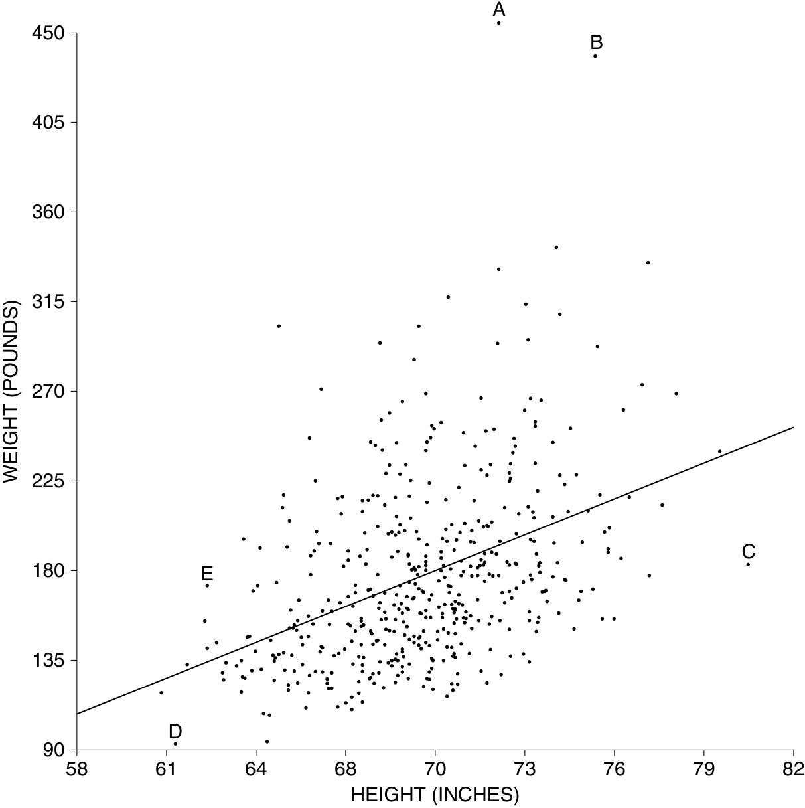

192 pounds (section 1 of chapter 10). However, A’s actual weight is 456 pounds. The prediction is off, by 264 pounds: 

error = actual weight − predicted weight = 456 lb − 192 lb = 264 lb. 

In the diagram, the prediction error is the vertical distance of A above the regression line. 

Person C on the diagram is 80.5 inches tall and weighs 183 pounds. The regression line predicts his weight as 243 pounds. So there is a prediction error of 183 lb − 243 lb = −60 lb. In the diagram, this error is represented by the vertical distance of C below the regression line. 

− The distance of a point above (+) or below ( ) the regression line is error = actual − predicted . 

182 THE R.M.S. ERROR FOR REGRESSION 

[CH. 11] 

Figure 2. Prediction error equals vertical distance from the line. 

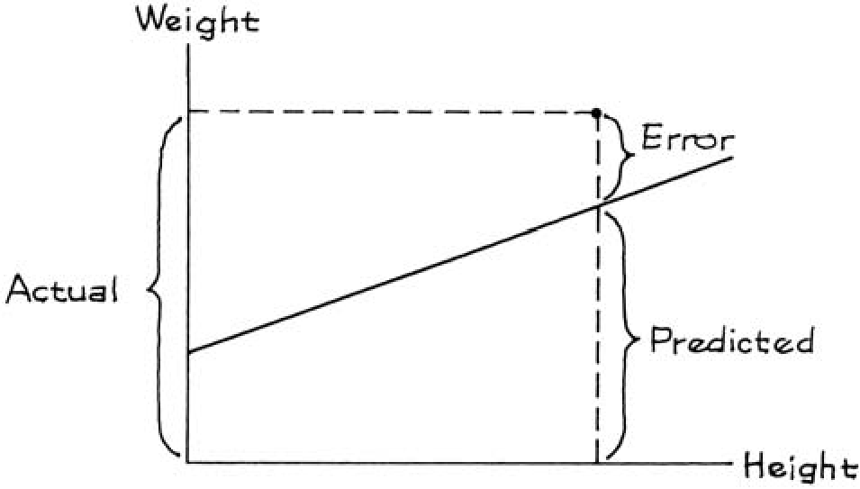

Figure 2 shows the connection between prediction errors and distances from the line. The overall size of these errors is measured by taking their root-mean-square (p. 66). The result is called the _r.m.s. error of the regression line_ . 

Go back to figure 1. Each of the 471 points in the scatter diagram is some vertical distance above or below the regression line, corresponding to a prediction error made by the line. The r.m.s. error of the regression line for predicting weight from height is 

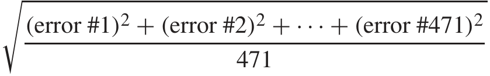

This looks painful, but the answer is about 41 pounds. (A short-cut through the arithmetic will be presented in the next section.) 

The r.m.s. error has a graphical interpretation: a typical point in figure 1 is above or below the regression line by something like 41 pounds. Since the line is predicting weight from height, we conclude that for typical men in the study, actual weight differs from predicted weight by around 41 pounds or so. 

The r.m.s. error for regression says how far typical points are above or below the regression line. 

The r.m.s. error is to the regression line as the SD is to the average. For instance, about 68% of the points on a scatter diagram will be within one r.m.s. error of the regression line; about 95% of them will be within two r.m.s. errors. This rule of thumb holds for many data sets, but not all; it is illustrated in figure 3. 

What about the height-weight data? The computer found that the predictions were right to within one r.m.s. error (41 pounds) for 340 out of 471 men, or 72% of them. The rule of thumb doesn’t look bad at all. The predictions were right to 

INTRODUCTION 183 

Figure 3. Rule of thumb. About 68% of the points on a scatter diagram fall inside the strip whose edges are parallel to the regression line, and one r.m.s. error away (up or down). About 95% of the points are in the wider strip whose edges are parallel to the regression line, and twice the r.m.s. error away. 

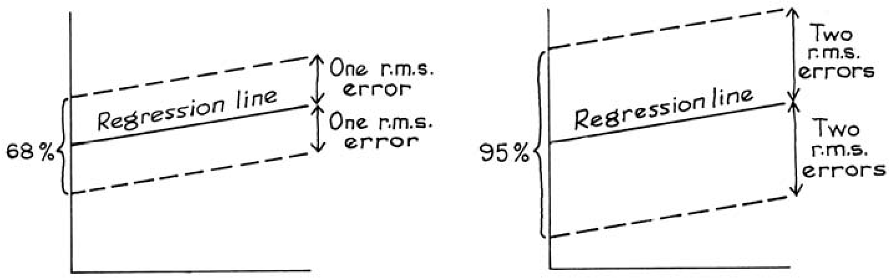

within two r.m.s. errors (82 pounds) for 451 out of the 471 men, which is 96%. This is even better for the rule of thumb. 

Soon, we will compare the r.m.s. error for regression to the r.m.s. error for a baseline prediction method. The baseline method just ignores the _x_ -values and uses the average value of _y_ to predict _y_ . With this method, the predictions fall along a horizontal line through the average of _y_ . 

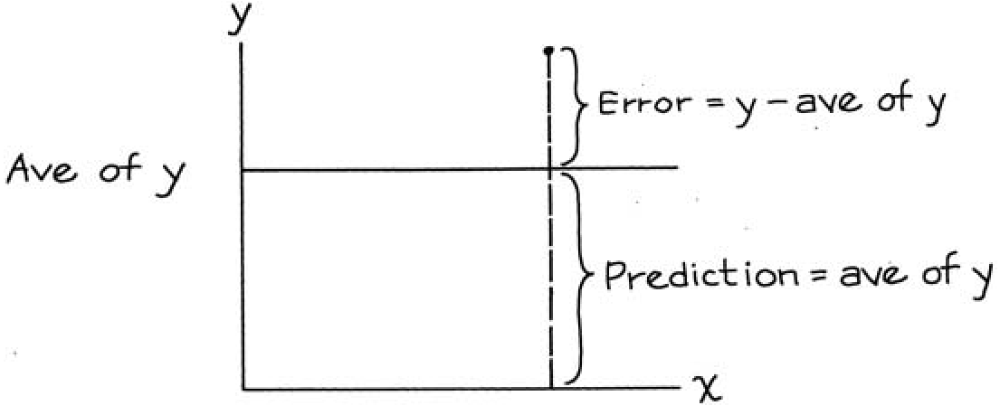

Graphically, the prediction errors for the second method are the vertical distances above and below this horizontal line, as shown by the sketch. Numerically, the errors are the deviations from the average of _y_ . So the r.m.s. error for the second method is the SD of _y_ : remember, the SD is the r.m.s. of the deviations from average. 

The SD of _y_ says how far typical points are above or below a horizontal line through the average of _y_ . In other words, the SD of _y_ is the r.m.s. error for the baseline method—predicting _y_ by its average, just ignoring the _x_ -values. 

184 THE R.M.S. ERROR FOR REGRESSION 

[CH. 11] 

### Exercise Set A 

1. Look at figure 1, then fill in the blanks: person B is and , while D is and . Options: short, tall, skinny, chubby. 

2. Look at figure 1, then say whether each statement is true or false: 

   - (a) E is above average in weight. 

   - (b) E is above average in weight, for men of his height. 

3. A regression line is fitted to a small data set. For each subject, the table shows the actual value of _y_ and the predicted value from the regression line. (The value of _x_ is not shown.) Compute the prediction errors, and the r.m.s. error of the regression line. 

|_Actual_|_Predicted_|
|---|---|
|_value of y_|_value of y_|
|57|64|
|63|62|
|43|40|
|51|52|
|49|45|

4. Below are three scatter diagrams. The regression line has been drawn across each one, by eye. In each case, guess whether the r.m.s. error is 0.2, or 1, or 5. 

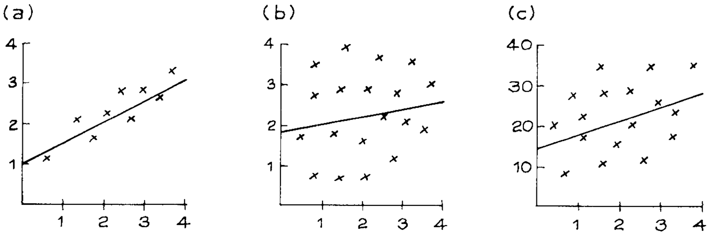

5. A regression line for predicting income has an r.m.s. error of $2,000. It predicts someone’s income as $20,000. This is likely to be right give or take: a few hundred dollars, a few thousand dollars, ten or twenty thousand dollars. 

6. An admissions officer is trying to choose between two methods of predicting firstyear scores. One method has an r.m.s. error of 12. The other has an r.m.s. error of 7. Other things being equal, which should he choose? Why? 

7. A regression line for predicting test scores has an r.m.s. error of 8 points. 

   - (a) About 68% of the time, the predictions will be right to within points. (b) About 95% of the time, the predictions will be right to within points. 

8. The scatter diagram on the next page shows incomes for a sample of 168 working couples in Louisiana. Summary statistics are as follows: 

      - average husband’s income = $45,000, SD = $25,000 average wife’s income = $28,000, SD = $20,000 

   - (a) If you predict wife’s income as $28,000, ignoring husband’s income, your r.m.s. error will be . 

COMPUTING THE R.M.S. ERROR 185 

- (b) All the predictions are on one of the lines in the diagram. Which one? Explain your answer. 

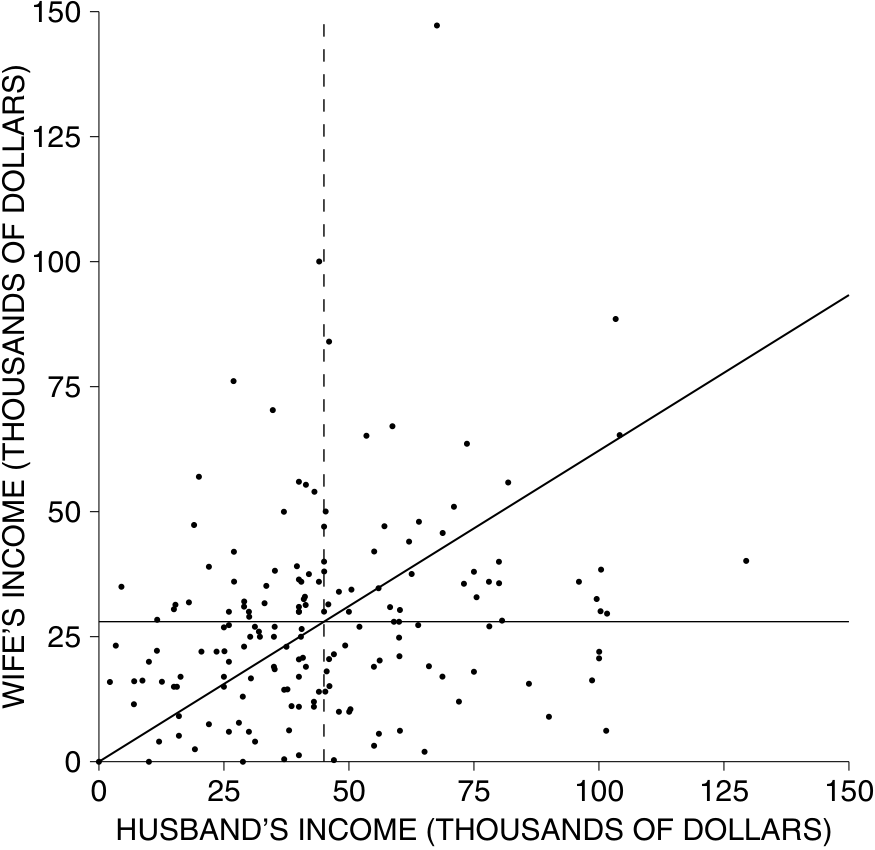

_The answers to these exercises are on pp. A63–64._ 

#### 2. COMPUTING THE R.M.S. ERROR 

The r.m.s. error for the regression line measures distances above or below the regression line (left-hand panel of figure 4). The right-hand panel of figure 4 shows another line, namely, the horizontal line through the average of _y_ . The r.m.s. error for that line is just the SD of _y_ , as discussed on p. 183. 

Figure 4. The r.m.s. error of the regression line, and the SD of _y_ . 

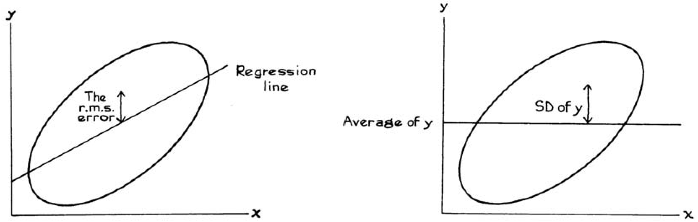

The r.m.s. error for the regression line will be smaller than the SD of _y_ , because the regression line gets closer to the points than the horizontal line. The r.m.s. will be smaller by the factor �1 − _r_2 . 

186 THE R.M.S. ERROR FOR REGRESSION [CH. 11] 

The r.m.s. error for the regression line of _y_ on _x_ can be figured as �1 − _r_2 × the SD of _y_ . 

Which SD goes into the formula? The SD of the variable being predicted. If you are predicting weight from height, use the SD of weight. The r.m.s. error has to come out in pounds, not inches. If you are predicting income from education, use the SD of income. The r.m.s. error has to come out in dollars, not years. 

The units for the r.m.s. error are the same as the units for the variable being predicted. 

In the height-weight scatter diagram (figure 1), there were 471 prediction errors, one for each man. Finding the root-mean-square of these 471 errors looked like a lot of work. But the factor �1 − _r_2 gives you a shortcut through the arithmetic. The r.m.s. error of the regression line for predicting weight from height equals 

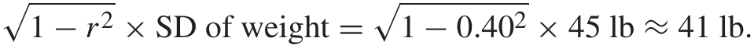

The r.m.s. error isn’t much smaller than the SD of weight, because weight is not that well correlated with height: _r_ ≈ 0 . 40. Knowing a man’s height does not help so much in predicting his weight. 

The formula is hard to prove without algebra. But three special cases are easy to see. First, suppose _r_ = 1. Then all the points lie on a straight line which slopes up. The regression line goes through all the points on the scatter diagram, and all the prediction errors are 0. So the r.m.s. error should be 0. And that is what the formula says. The factor works out to 

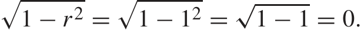

The case _r_ = −1 is the same, except that the line slopes down. The r.m.s. error should still be 0, and the factor is 

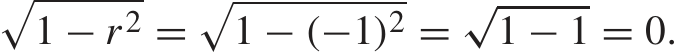

The third case is _r_ = 0. Then there is no linear relationship between the variables. So the regression line does not help in predicting _y_ , and its r.m.s. error should equal the SD. The factor is 

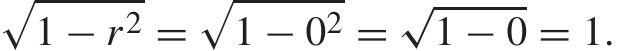

The r.m.s. error measures spread around the regression line in absolute terms: pounds, dollars, and so on. The correlation coefficient, on the other hand, measures spread relative to the SD, and has no units. The r.m.s. error is connected to the SD through the correlation coefficient. This is the third time that _r_ comes into the story. 

PLOTTING THE RESIDUALS 187 

- _r_ describes the clustering of the points around a line, relative to the SDs (chapter 8). 

- _r_ says how the average value of _y_ depends on _x_ —associated with each one-SD increase in _x_ there is an increase of only _r_ SDs in _y_ , on the average (chapter 10). 

- _r_ determines the accuracy of the regression predictions, through the formula for r.m.s. error. 

_A cautionary note._ If you extrapolate beyond the data, or use the line to make estimates for people who are different from the subjects in the study, the r.m.s. error cannot tell you how far off you are likely to be. That is beyond the power of mathematics. 

### Exercise Set B 

1. A law school finds the following relationship between LSAT scores and first-year scores: 

average LSAT score = 165 , SD = 5 average first-year score = 65 , SD = 10 _, r_ = 0 . 6 

The admissions officer uses the regression line to predict first-year scores from LSAT scores. The r.m.s. error of the line is . Options: 5 10 �1 − 0 . 62 × 5 �1 − 0 . 62 × 10 

2. (This continues exercise 1.) 

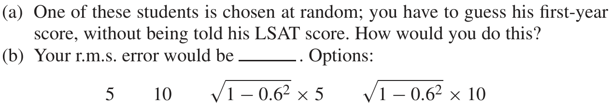

   - (c) Repeat parts (a) and (b), if you are allowed to use his LSAT score. 

3. At a certain college, first-year GPAs average about 3.0, with an SD of about 0.5; they are correlated about 0.6 with high-school GPA. Person A predicts first- year GPAs just using the average. Person B predicts first-year GPAs by regression, using the high-school GPAs. Which person makes the smaller r.m.s. error? Smaller by what factor? 

_The answers to these exercises are on p. A64._ 

#### 3. PLOTTING THE RESIDUALS 

Prediction errors are often called _residuals_ . Statisticians recommend graphing the residuals. The method is indicated by figure 5 on the next page. Each point on the scatter diagram is transferred to a second diagram, called the _residual plot_ , in the following way.The _x_ -coordinate is left alone. But the _y_ -coordinate is replaced by the residual at the point—the distance above (+) or below (−) 

188 

THE R.M.S. ERROR FOR REGRESSION [CH. 11] 

Figure 5. Plotting the residuals. 

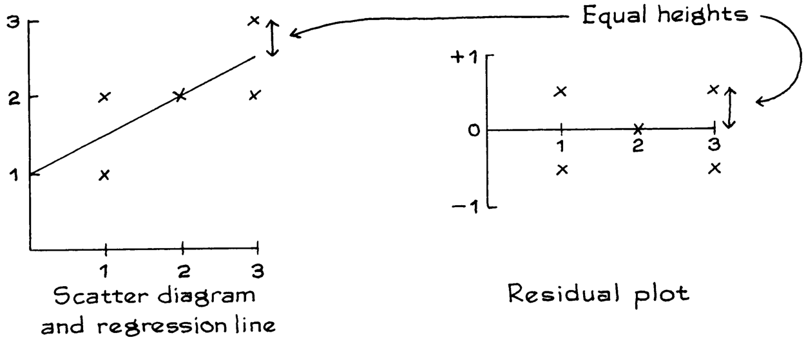

the regression line. Figure 6 shows the residual plot for the height-weight scatter diagram of figure 1. Figures 5 and 6 suggest that the positive residuals balance out the negative ones. Mathematically, the residuals from the regression line must average out to 0. The figures show something else too. As you look across the residual plot, there is no systematic tendency for the points to drift up (or down). Basically, the reason is that all the trend up or down has been taken out of the residuals, and has been absorbed into the regression line. 

The residuals average out to 0; and the regression line for the residual plot is horizontal. 

Figure 6. A residual plot. The scatter diagram at the left shows the heights and weights of the 471 men age 18–24 in the HANES5 sample, with the regression line. The residual plot is shown at the right. There is no trend or pattern in the residuals. 

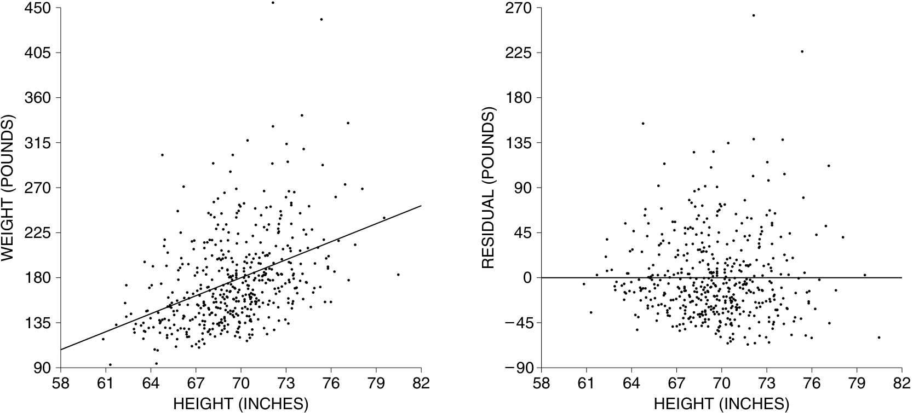

PLOTTING THE RESIDUALS 189 

The residual plot in figure 6 shows no pattern. By comparison, figure 7 shows a residual plot (for hypothetical data) with a strong pattern. With this kind of pattern, it is probably a mistake to use a regression line. Often, you can spot non-linearities by looking at the scatter diagram. However, the residual plot may give a more sensitive test—because the vertical scale can be made big enough so things can be examined carefully. Residual plots are useful diagnostics in _multiple regression_ ; for example, in predicting first-year GPA from SAT scores and highschool GPA.2 (Multiple regression is discussed in section 3 of chapter 12.) 

Figure 7. A residual plot with a strong pattern. It may have been a mistake to fit the regression line. 

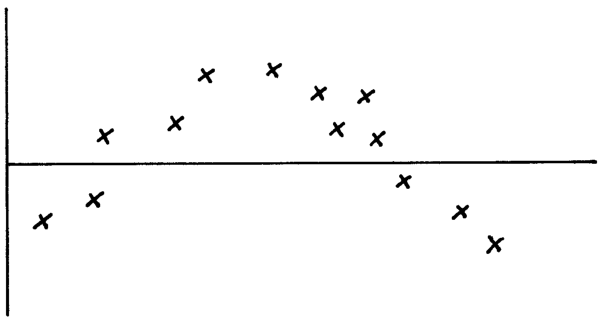

### Exercise Set C 

1. Several different regression lines are used to predict the price of a stock (from different independent variables). Histograms for the residuals from each line are sketched below. Match the description with the histogram: 

   - (a) r.m.s. error = $5 (b) r.m.s. error = $15 (c) something’s wrong 

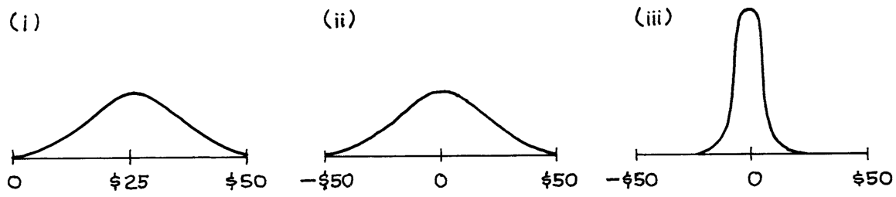

2. Several regression lines are used to predict the monthly salaries in a certain company, from different independent variables. Residual plots from each regression are shown below. Match the description with the plot. Explain. (You may use the same description more than once.) 

   - (a) r.m.s. error = $1,000 (b) r.m.s. error = $5,000 (c) something’s wrong 

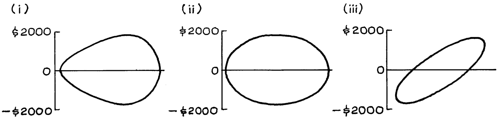

190 THE R.M.S. ERROR FOR REGRESSION 

[CH. 11] 

3. Look at the figure below. 

   - (a) Is the SD of _y_ about 0.6, 1.0, or 2.0? 

   - (b) Is the SD of the residuals about 0.6, 1.0, or 2.0? 

   - (c) Take the points in the scatter diagram whose _x_ -coordinates are between 4.5 and 5.5. Is the SD of their _y_ -coordinates about 0.6, 1.0, or 2.0? 

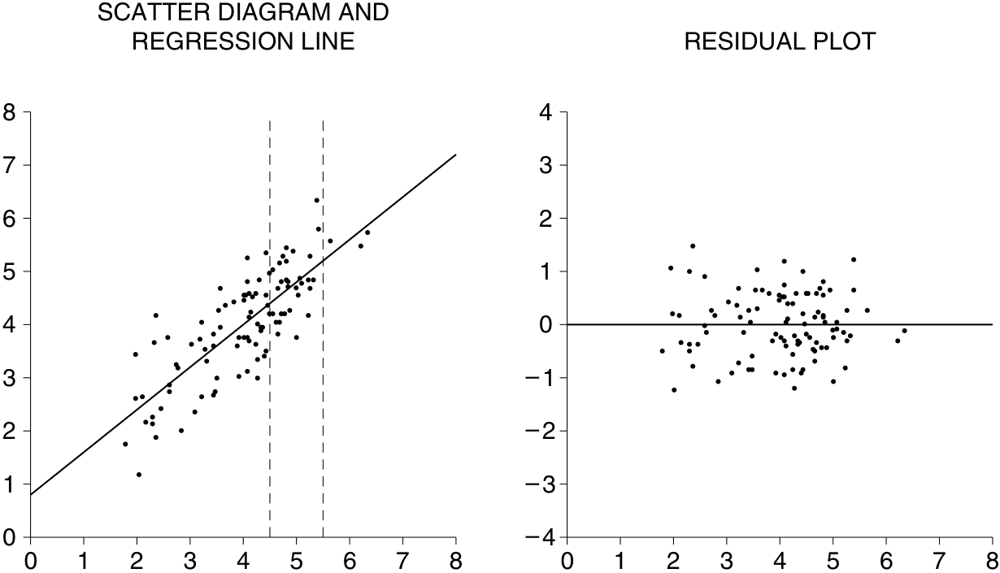

_The answers to these exercises are on p. A64._ 

#### 4. LOOKING AT VERTICAL STRIPS 

Figure 8 repeats the scatter diagram for the heights of the 1,078 fathers and sons in Pearson’s study (section 1 of chapter 8). The families where the father is 64 inches tall, to the nearest inch, are plotted in the vertical strip on the left. A histogram for son’s heights in these families is shown at the bottom of the figure (solid line). The families with 72-inch fathers are plotted in the vertical strip on the right. A histogram for the heights of those sons is shown too (dashed line). The dashed histogram is farther to the right than the solid one: on the average, the taller fathers do have taller sons. However, both histograms have similar shapes, and just about the same amount of spread.3 

When all the vertical strips in a scatter diagram show similar amounts of spread, the diagram is said to be _homoscedastic_ . The scatter diagram in figure 8 is homoscedastic. The range of sons’ heights for given father’s height is greater in the middle of the picture, but that is only because there are more families in the middle of things than at the extremes. The SD of sons’ height for given father’s height is pretty much the same from one end of the picture to the other. _Homo_ means “same,” _scedastic_ means “scatter.” _Homoscedasticity_ is a terrible word, but statisticians insist on it: we prefer “football-shaped.”4 

When the scatter diagram is football-shaped, the prediction errors are similar all along the regression line. In figure 8, the regression line for predicting son’s 

LOOKING AT VERTICAL STRIPS 191 

height from father’s height had an r.m.s. error of 2.3 inches. If the father is 64 inches tall, the prediction for the son’s height is 67 inches, and this is likely to be off by 2.3 inches or so. If the father is 72 inches tall, the prediction for the son’s height is 71 inches, and this is likely to be off by the same amount, 2.3 inches or so.5 

Figure 8. Homoscedastic scatter diagram. Heights of fathers and sons. Families with 64-inch fathers are plotted in the solid vertical strip: the solid histogram is for the heights of those sons. Families with 72-inch fathers are plotted in the dashed vertical strip; the dashed histogram is for the heights of those sons. The two histograms have similar shapes, and their SDs are nearly the same. 

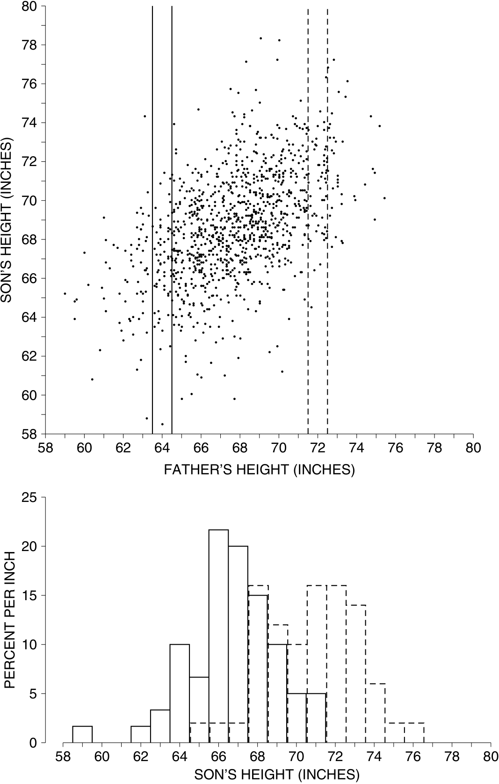

192 THE R.M.S. ERROR FOR REGRESSION 

[CH. 11] 

By comparison, figure 9 shows the _heteroscedastic_ scatter diagram of income against education ( _hetero_ means “different”). As education goes up, average income goes up, and so does the spread in income. When the scatter diagram is heteroscedastic, the regression method is off by different amounts in different parts of the scatter diagram. In figure 9, the r.m.s. error of the regression line is about $19,000. However, it is quite a bit harder to predict the incomes of the highly educated people. With 8 years of schooling, the prediction errors are something like $6,000. At 12 years, the errors go up to $15,000 or so. At 16 years, the errors go up even more, to $27,000 or so. In this case, the r.m.s. error of the regression line gives a sort of average error—across all the different _x_ -values. 

Figure 9. Heteroscedastic scatter diagram. Income and education (years of schooling completed) for a sample of 570 California women age 25–29 in 2005.6 The regression line is shown too. 

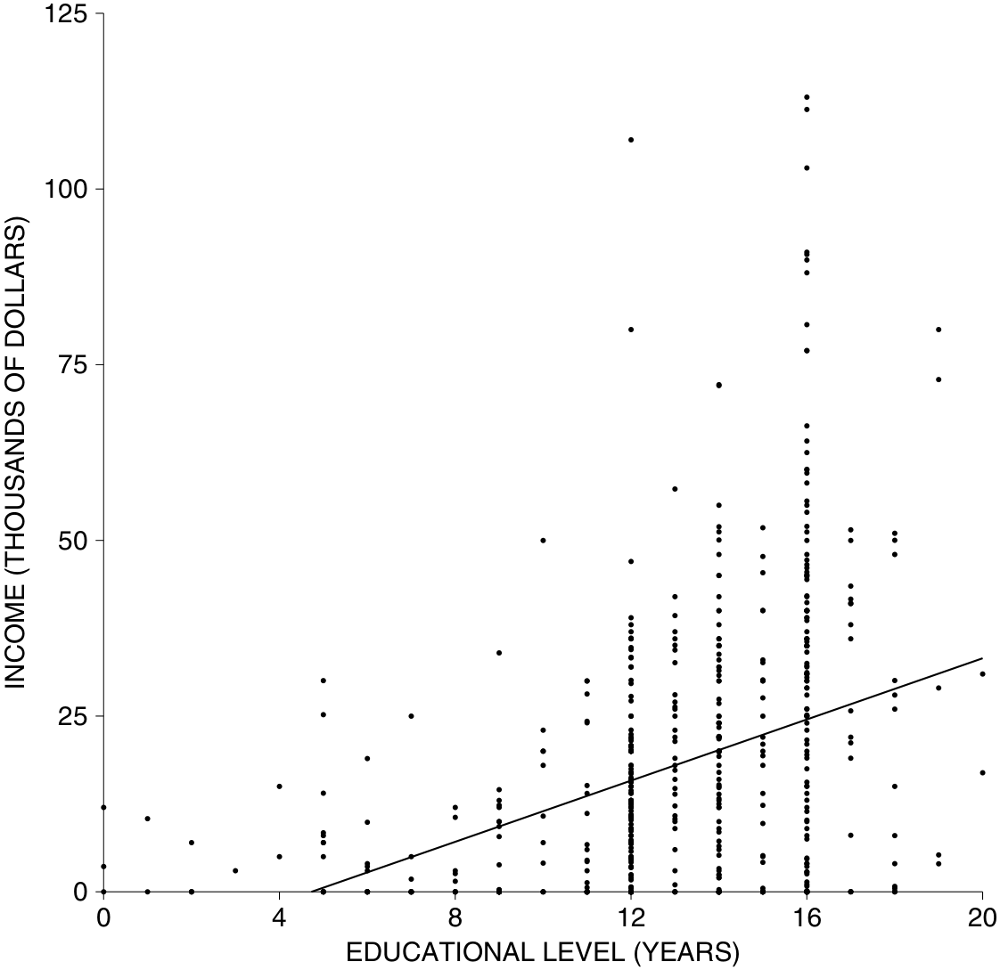

Suppose that a scatter diagram is football-shaped. Take the points in a narrow vertical strip. They will be off the regression line (up or down) by amounts similar in size to the r.m.s. error. If the diagram is heteroscedastic, the r.m.s. error should not be used for individual strips. 

LOOKING AT VERTICAL STRIPS 193 

### Exercise Set D 

1. In 1937, the Stanford-Binet IQ test was restandardized with two forms (L and M). A large number of subjects took both tests. The results can be summarized as follows: 

Form L average ≈ 100, SD ≈ 15 Form M average ≈ 100, SD ≈ 15, _r_ ≈ 0 . 80 

- (a) True or false, and explain: the regression line for predicting the score on form M from the score on form L has an r.m.s. error of about 9 points. 

- (b) Suppose the scatter diagram looks like (i) below. If someone scores 130 on form L, the regression method predicts 124 for the score on form M. True or false, and explain: this prediction is likely to be off by 9 points or so. 

- (c) Repeat, if the scatter diagram looks like (ii). 

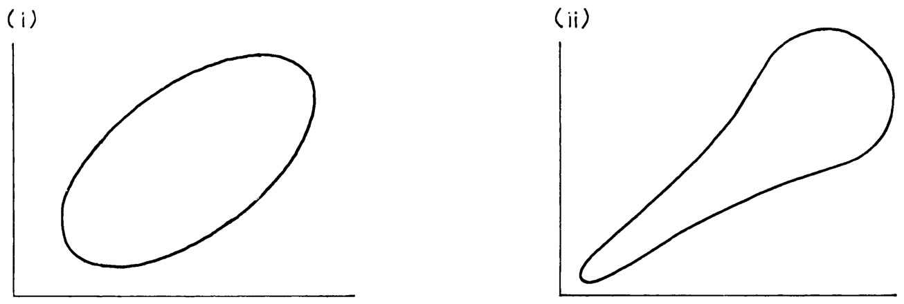

2. The data in figure 8 can be summarized as follows: 

      - average height of fathers ≈ 68 inches, SD ≈ 2.7 inches average height of sons ≈ 69 inches, SD ≈ 2.7 inches, _r_ ≈ 0 . 5 

   - (a) Find the r.m.s. error of the regression line for predicting son’s height from father’s height. 

   - (b) If a father is 72 inches tall, predict his son’s height. 

   - (c) This prediction is likely to be off by inches or so. If more information is needed, say what it is, and why. 

   - (d) Repeat parts (b) and (c), if the father is 66 inches tall. 

3. The data in figure 9 can be summarized as follows: 

average education ≈ 13 . 0 years, SD ≈ 3 . 4 years average income ≈ $18,000, SD ≈ $20,000, _r_ ≈ 0 . 37 

- (a) Find the r.m.s. error of the regression line for predicting income from education. 

- (b) Predict the income of a woman with 16 years of education. 

- (c) This prediction is likely to be off by $ or so. If more information is needed, say what it is, and why. 

- (d) Repeat parts (b) and (c), for a woman with 8 years of education. 

194 THE R.M.S. ERROR FOR REGRESSION 

[CH. 11] 

4. The figure below is a scatter diagram for the ages of husbands and wives in Indiana. Data are from the March 2005 Current Population Survey.7 The vertical strip represents the families where the is between and years of age. 

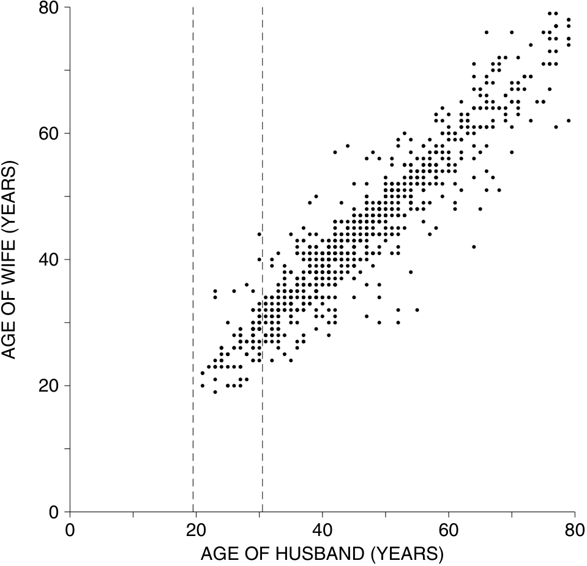

5. (Continues exercise 4.) Fill in the blanks, using the options given below. 

      - .25 .5 .95 1 5 15 25 50 

   - (a) The average age for all the husbands is about ; the SD is about 

         - . 

   - (b) The average age for all the wives is about ; the SD is about . 

   - (c) The correlation between the ages of all the husbands and wives is about . 

   - (d) Among families plotted in the vertical strip, the average age for the wives is about ; the SD is about . 

   - (e) Among families plotted in the vertical strip, the correlation between the ages of the husbands and wives is about . 

6. (Continues exercises 4 and 5.) 

   - (a) The SD is computed for the ages of— 

      - (i) all the wives, and 

      - (ii) the wives whose husbands are 20–30 years old. 

Which SD is bigger? Or are the SDs about the same? 

- (b) The SD is computed for the ages of— 

   - (i) all the wives, and 

   - (ii) the wives whose husbands were born in March. 

Which SD is bigger? Or are the SDs about the same? 

USING THE NORMAL CURVE INSIDE A VERTICAL STRIP 195 

7. In one study of identical male twins, the average height was found to be about 68 inches, with an SD of about 3 inches. The correlation between the heights of the twins was about 0.95, and the scatter diagram was football-shaped. 

   - (a) You have to guess the height of one of these twins, without any further information. What method would you use? 

   - (b) Find the r.m.s. error for the method in (a). 

   - (c) One twin of the pair is standing in front of you. You have to guess the height of the other twin. What method would you use? (For instance, suppose the twin you see is 6 feet 6 inches.) 

   - (d) Find the r.m.s. error for the method in (c). 

_The answers to these exercises are on pp. A64–65._ 

#### 5. USING THE NORMAL CURVE INSIDE A VERTICAL STRIP 

Often, it is possible to use the normal approximation when working inside a vertical strip. For this to be legitimate, the scatter diagram has to be footballshaped, with the dots thickly scattered in the center of the picture and fading off toward the edges. Figure 8 is a good example. On the other hand, if the scatter diagram is heteroscedastic (figure 9), or shows a non-linear pattern (figure 7), do not use the method of this section. With the height-weight data in figure 6, the normal curve would not work especially well either: the cloud isn’t footballshaped, it is stretched out on top and squeezed in at the bottom. 

_Example 1._ A law school finds the following relationship between LSAT scores and first-year scores (for students who finish the first year): 

average LSAT score = 162, SD = 6 average first-year score = 68, SD = 10 _, r_ = 0 . 60 

The scatter diagram is football-shaped. 

- (a) About what percentage of the students had first-year scores over 75? 

- (b) Of the students who scored 165 on the LSAT, about what percentage had first-year scores over 75? 

_Solution. Part (a)_ . This is a straightforward normal approximation problem. The LSAT results and _r_ have nothing to do with it. 

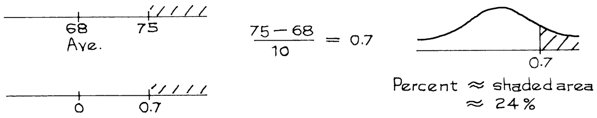

_Part (b)._ This is a new problem. It is about a special group of students— those who scored 165 on the LSAT. These students are all in the same vertical 

196 THE R.M.S. ERROR FOR REGRESSION 

[CH. 11] 

Figure 10. A football-shaped scatter diagram. Take the points inside a narrow vertical strip. Their _y_ -values are a new data set. The new average is given by the regression method. The new SD is given by the r.m.s. error of the regression line. Inside the strip, a typical _y_ -value is around the new average—give or take the new SD. 

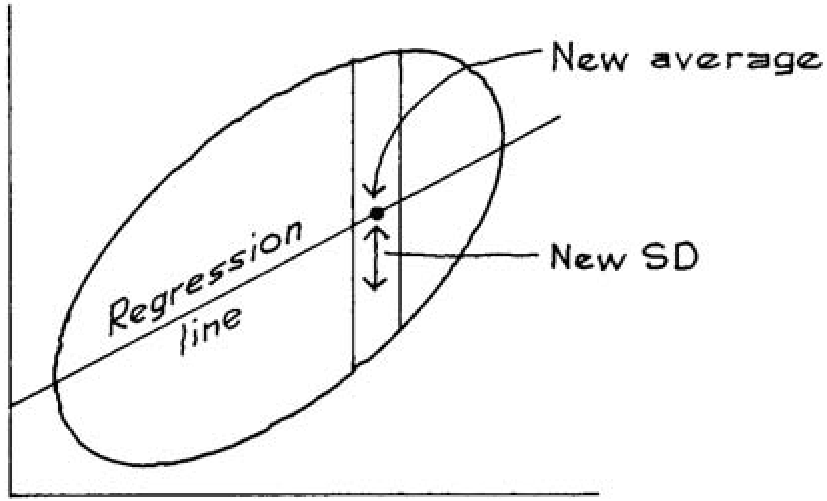

strip (figure 10). Their first-year scores are a new data set. To do the normal approximation, you need the average and the SD of this new data set. 

_The new average._ The students who scored 165 on the LSAT are better than average. As a group, they will do better than average in the first year of law school—although there is a fair amount of spread (vertical scatter inside the strip). The group average can be estimated by the regression method: 165 is 0.5 SDs above average, so the group will score above average in the first year, by about _r_ × 0 . 5 = 0 . 6 × 0 . 5 = 0 . 3 SDs. This is 0 . 3 × 10 = 3 points. The new average is 68 + 3 = 71. 

_The new SD._ The students who scored 165 on the LSAT are a smaller and more homogeneous group. So the SD of their first-year scores is less than 10 points. How much less? Since the diagram is football-shaped, the scatter around the regression line is about the same in each vertical strip, and is given by the r.m.s. error for the regression line (section 4). The new SD is 

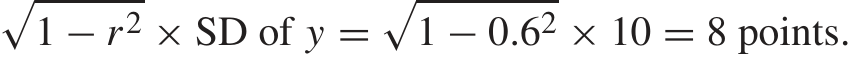

(We are predicting first-year scores from LSAT scores, so the error is in first-year points: 10 goes into the formula, not 6.) A typical student who scored around 165 on the LSAT will have a first-year score of about 71, give or take 8 or so. The new average is 71, and the new SD is 8. 

_The normal approximation_ is the last step. This is done as usual, but is based on the new average and the new SD. 

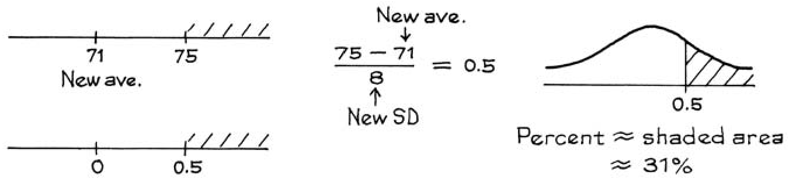

USING THE NORMAL CURVE INSIDE A VERTICAL STRIP 197 

Why is the new SD smaller? Look at figure 10: there is less vertical scatter in the strip than in the whole diagram. Also see exercises 4–6 on p. 194. 

Suppose that a scatter diagram is football-shaped. Take the points in a narrow vertical strip. Their _y_ -values are a new data set. The new average is estimated by the regression method. The new SD is about equal to the r.m.s. error for the regression line. 

The normal approximation can be done as usual, based on the new average and the new SD. 

_Technical note._ What can you do with non-linear or heteroscedastic data? Often a transformation will help—for example, taking logarithms. The left hand panel in figure 11 shows a scatter diagram for Secchi depth (a measure of water clarity) versus total chlorophyll concentration (a measure of algae in the water).8 The data are non-linear and heteroscedastic. The right hand panel shows the same data, after taking logs: the diagram is more like a football. 

Figure 11. Left-hand panel: scatter diagram for Secchi depth versus total chlorophyll concentration. (Units for chlorophyll concentration are ppb, or parts per billion in the water.) Right-hand panel: data have been transformed by taking logarithms to base 10. 

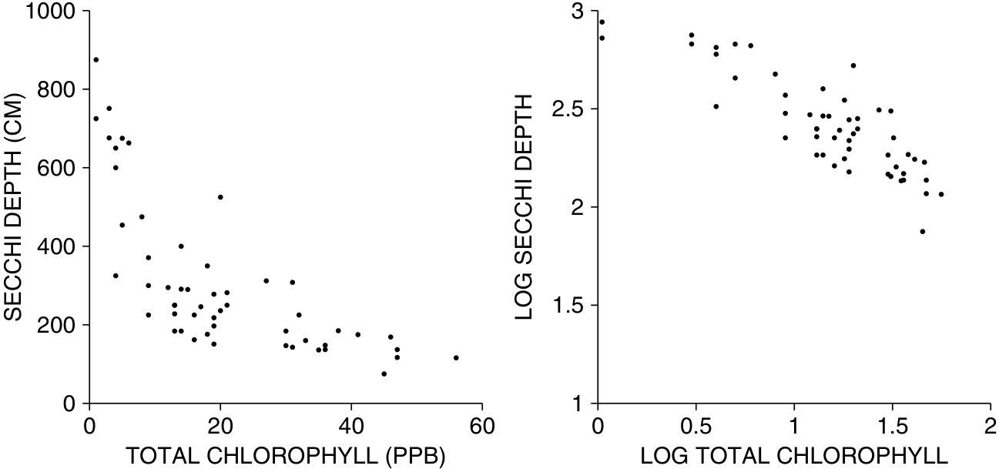

### Exercise Set E 

1. Pearson and Lee obtained the following results for about 1,000 families: 

      - average height of husband ≈ 68 inches, SD ≈ 2.7 inches average height of wife ≈ 63 inches, SD ≈ 2.5 inches, _r_ ≈ 0 . 25 

   - (a) What percentage of the women were over 5 feet 8 inches? 

   - (b) Of the women who were married to men of height 6 feet, what percentage were over 5 feet 8 inches? 

198 THE R.M.S. ERROR FOR REGRESSION 

[CH. 11] 

2. From the same study: 

average height of father ≈ 68 inches, SD ≈ 2.7 inches average height of son ≈ 69 inches, SD ≈ 2.7 inches, _r_ ≈ 0 . 50 

   - (a) What percentage of the sons were over 6 feet tall? 

   - (b) What percentage of the 6-foot fathers had sons over 6 feet tall? 

3. From the same study: 

average height of men ≈ 68 inches, SD ≈ 2.7 inches average forearm length ≈ 18 inches, SD ≈ 1 inch, _r_ ≈ 0 . 80 

- (a) What percentage of men have forearms which are 18 inches long, to the nearest inch? 

- (b) Of the men who are 68 inches tall, what percentage have forearms which are 18 inches long, to the nearest inch? 

_The answers to these exercises are on p. A65._ 

#### 6. REVIEW EXERCISES 

_Review exercises may cover material from previous chapters._ 

1. The r.m.s. error of the regression line for predicting _y_ from _x_ is 

. 

(i) SD of _y_ (iv) _r_ × SD of _x_ (ii) SD of _x_ (v) �1 − _r_2 × SD of _y_ (iii) _r_ × SD of _y_ (vi) �1 − _r_2 × SD of _x_ 

2. A computer program is developed to predict the GPA of college freshmen from their high-school GPAs. This program is tried out on a class whose college GPAs are known. The r.m.s. error is 3.12. Is anything wrong? Answer yes or no, and explain. 

3. Tuddenham and Snyder obtained the following results for 66 California boys at ages 6 and 18 (the scatter diagram is football-shaped):9 

average height at 6 ≈ 3 feet 10 inches, SD ≈ 1.7 inches, average height at 18 ≈ 5 feet 10 inches, SD ≈ 2.5 inches, _r_ ≈ 0 . 80 

   - (a) Find the r.m.s. error for the regression prediction of height at 18 from height at 6. 

   - (b) Find the r.m.s. error for the regression prediction of height at 6 from height at 18. 

4. A statistical analysis was made of the midterm and final scores in a large course, with the following results: 

average midterm score ≈ 50, SD ≈ 25 average final score ≈ 55, SD ≈ 15, _r_ ≈ 0 . 60 

The scatter diagram was football-shaped. For each student, the final score was predicted from the midterm score using the regression line. 

REVIEW EXERCISES 199 

- (a) For about 1 _/_ 3 of the students, the prediction for the final score was off by more than points. Options: 6, 9, 12, 15, 25. 

- (b) 

- (c) This prediction is likely to be off by points or so. Options: 6, 9, 12, 15, 25. 

Explain your answers. 

5. Use the data in exercise 4 to answer the following questions. 

   - (a) About what percentage of students scored over 80 on the final? 

   - (b) Of the students who scored 80 on the midterm, about what percentage scored over 80 on the final? 

Explain your answers. 

6. In a study of high-school students, a positive correlation was found between hours spent per week doing homework, and scores on standardized achievement tests. The investigators concluded that doing homework helps prepare students for these tests. Does the conclusion follow from the data? Answer yes or no, and explain briefly. 

7. The freshmen at a large university are required to take a battery of aptitude tests. Students who score high on the mathematics test also tend to score high on the physics test. On both tests, the average score is 60; the SDs are the same too. The scatter diagram is football-shaped. Of the students who scored about 75 on the mathematics test: 

   - (i) just about half scored over 75 on the physics test. (ii) more than half scored over 75 on the physics test. 

   - (iii) less than half scored over 75 on the physics test. 

Choose one option and explain. 

8. The bends are caused by rapid changes in air pressure, resulting in the formation of nitrogen bubbles in the blood. The symptoms are acute pain, and sometimes paralysis leading to death. In World War II, pilots got the bends during certain battle maneuvers. It was feasible to simulate these conditions in a pressure chamber. As a result, pilot trainees were tested under these conditions once, at the beginning of their training. If they got the bends (only mild cases were induced), they were excluded from the training on the grounds that they were more likely to get the bends under battle conditions. This procedure was severely criticized by the statistician Joe Berkson, and he persuaded the Air Force to replicate the test—that is, repeat it several times for each trainee. 

   - (a) Why might Berkson have suggested this? 

   - (b) Give another example where replication is helpful. 

9. Every year, baseball’s major leagues honor their outstanding first-year players with the title “Rookie of the Year.” The overall batting average for the Rookies of the Year is around .290, far above the major league batting average of .260. However, Rookies of the Year don’t do so well in their second year—their 

200 THE R.M.S. ERROR FOR REGRESSION [CH. 11] 

   - overall second-season batting average is only .275. Baseball writers call this “sophomore slump,” the idea being that star players get distracted by outside activities like product endorsements and television appearances. Do the data support the idea of the sophomore slump? Answer yes or no, and explain briefly.10 

10. A study was made of the relationship between stock prices on the last trading day of 2005 and the last trading day of 2006. A formula was developed to predict the 2006 price from the 2005 price, using data on 100 stocks. An analyst is now reviewing the results. Data are shown below for five out of the 100 stocks; prices are in dollars. Was the regression method used to predict the 2006 price from the 2005 price? Answer yes or no and explain. If you need more information, explain why. 

||_2005 price_|_2006 price_|
|---|---|---|
|_Stock_|_actual_|_predicted_ _actual_|
|A|10|8 8|
|B|10|8 3|
|C|12|13 17|
|D|14|12 6|
|E|15|20 27|

11. The figure below is a scatter plot of income against education, for a representative sample of men age 25–29 in Texas. Or is something wrong? Explain briefly. (“Educational level” means years of schooling completed, not counting kindergarten.) 

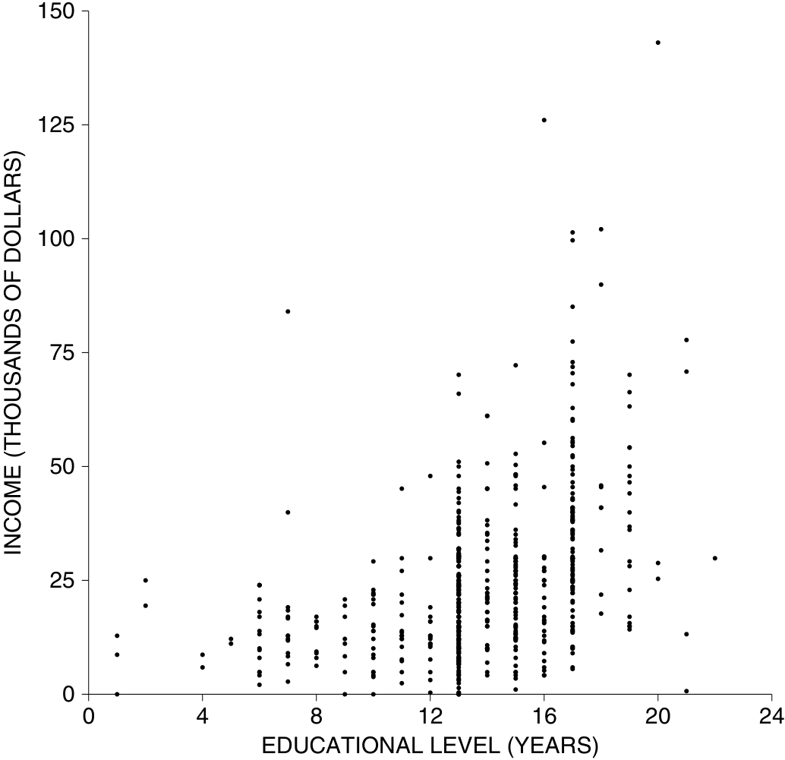

SUMMARY 201 

12. For the men age 25–34 in HANES5, the relationship between education (years of schooling completed) and systolic blood pressure can be summarized as follows.11 

average education ≈ 13 years, SD ≈ 3 years average blood pressure ≈ 119 mm, SD ≈ 11 mm, _r_ ≈−0 . 1 

One man in the sample had 20 years of education, and his blood pressure was 118 mm. True or false, and explain: compared to other men at his educational level, his blood pressure was a bit on the high side. 

#### 7. SUMMARY 

1. When the regression line is used to predict _y_ from _x_ , the difference between the actual value and the predicted value is a _residual_ , or prediction error. 

2. In a scatter diagram, the vertical distance of a point above or below the regression line is the graphical counterpart of the prediction error made by the regression method. 

3. The _r.m.s. error_ of the regression line is the root-mean-square of the residuals. This measures the accuracy of the regression predictions. The predictions are off by amounts similar in size to the r.m.s. error. For many scatter diagrams, about 68% of the predictions will be right to within one r.m.s. error. About 95% will be right to within two r.m.s. errors. 

4. The SD of _y_ is equal to the r.m.s. error of a horizontal line through the average of _y_ . The r.m.s. error of the regression line is smaller, by the factor �1 − _r_2 . Therefore, the r.m.s. error for the regression line of _y_ on _x_ can be figured as 

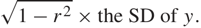

5. After carrying out a regression, statisticians often graph the residuals. If the _residual plot_ shows a pattern, the regression may not have been appropriate. 

6. When all the vertical strips in a scatter diagram show similar amounts of spread, the diagram is _homoscedastic_ : the prediction errors are similar in size all along the regression line. When the scatter diagram is _heteroscedastic_ , the prediction errors are different in different parts of the scatter diagram. Footballshaped diagrams are homoscedastic. 

7. Suppose that a scatter diagram is football-shaped. Take the points inside a narrow vertical strip. Their _y_ -values are a new data set. The new average is estimated by the regression method. The new SD is about equal to the r.m.s. error for the regression line. And the normal approximation can be done as usual, based on the new average and the new SD. 

