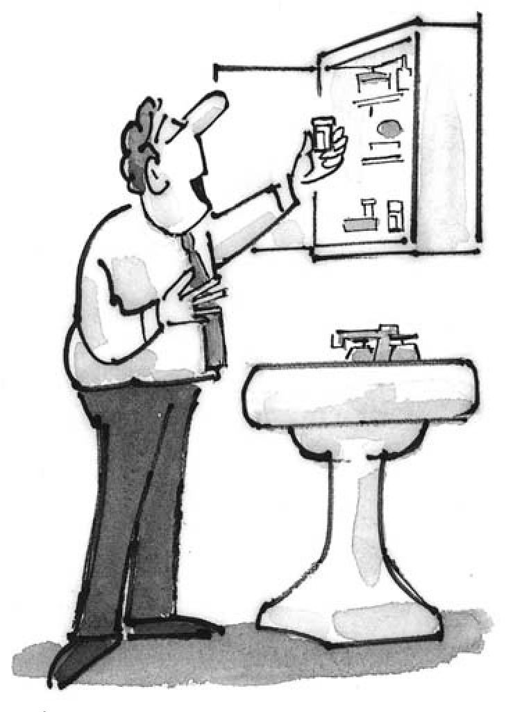
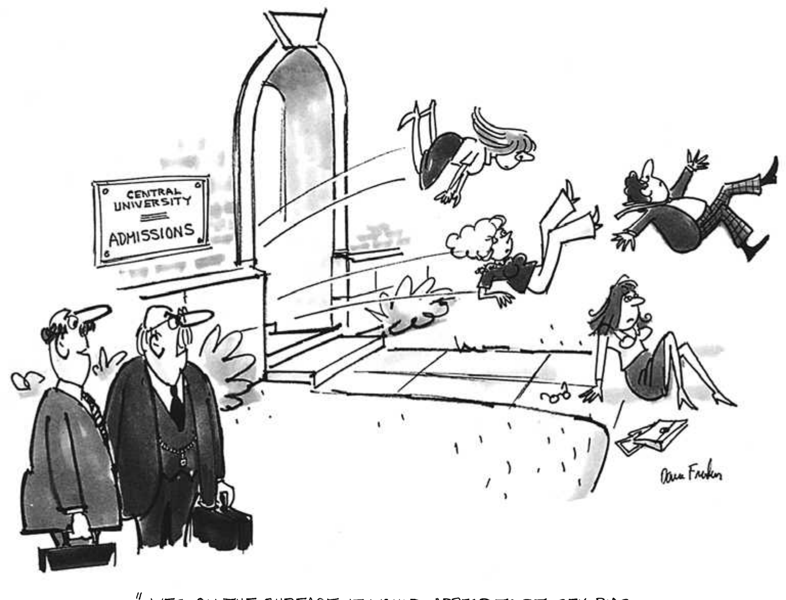
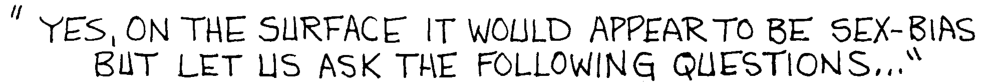
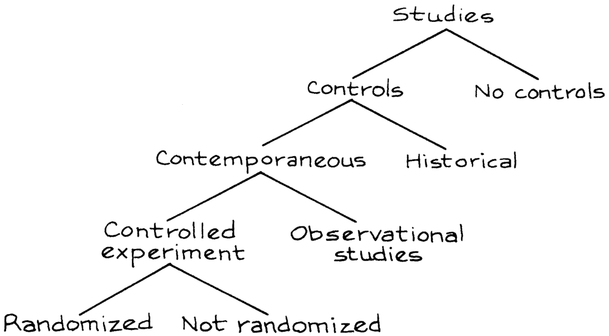

2 

## Observational Studies 

_That’s not an experiment you have there, that’s an experience._ —SIR R. A. FISHER (ENGLAND, 1890–1962) 

#### 1. INTRODUCTION 

Controlled experiments are different from _observational studies_ . In a controlled experiment, the investigators decide who will be in the treatment group and who will be in the control group. By contrast, in an observational study it is the subjects who assign themselves to the different groups: the investigators just watch what happens. 

The jargon is a little confusing, because the word _control_ has two senses. 

- A _control_ is a subject who did not get the treatment. 

- A _controlled experiment_ is a study where the investigators decide who will be in the treatment group and who will not. 

Studies on the effects of smoking, for instance, are necessarily observational: nobody is going to smoke for ten years just to please a statistician. However, the treatment-control idea is still used. The investigators compare smokers (the treatment or “exposed” group) with non-smokers (the control group) to determine the effect of smoking. 

The smokers come off badly in this comparison. Heart attacks, lung cancer, and many other diseases are more common among smokers than non-smokers. So there is a strong _association_ between smoking and disease. If cigarettes cause 

THE CLOFIBRATE TRIAL 13 

disease, that explains the association: death rates are higher for smokers because cigarettes kill. Thus, association is circumstantial evidence for causation. However, the proof is incomplete. There may be some hidden confounding factor which makes people smoke and also makes them get sick. If so, there is no point in quitting; that will not change the hidden factor. Association is not the same as causation. 

Statisticians like Joseph Berkson and Sir R. A. Fisher did not believe the evidence against cigarettes, and suggested possible confounding variables. Epidemiologists (including Sir Richard Doll in England, and E. C. Hammond, D. Horn, H. A. Kahn in the United States) ran careful observational studies to show these alternative explanations were not plausible. Taken together, the studies make a powerful case that smoking causes heart attacks, lung cancer, and other diseases. If you give up smoking, you will live longer.1 

Observational studies are a powerful tool, as the smoking example shows. But they can also be quite misleading. To see if confounding is a problem, it may help to find out how the controls were selected. The main issue: was the control group really similar to the treatment group—apart from the exposure of interest? If there is confounding, something has to be done about it, although perfection cannot be expected. Statisticians talk about _controlling for_ confounding factors in an observational study. This is a third use of the word _control_ . 

One technique is to make comparisons separately for smaller and more homogeneous groups. For example, a crude comparison of death rates among smokers and non-smokers could be misleading, because smokers are disproportionately male and men are more likely than women to have heart disease anyway. The difference between smokers and non-smokers might be due to the sex difference. To eliminate that possibility, epidemiologists compare male smokers to male nonsmokers, and females to females. 

Age is another confounding variable. Older people have different smoking habits, and are more at risk for lung cancer. So the comparison between smokers and non-smokers is done separately by age as well as by sex. For example, male smokers age 55–59 are compared to male non-smokers age 55–59. This controls for age and sex. Good observational studies control for confounding variables. In the end, however, most observational studies are less successful than the ones on smoking. The studies may be designed by experts, but experts make mistakes too. Finding the weak points is more an art than a science, and often depends on information outside the study. 

#### 2. THE CLOFIBRATE TRIAL 

The Coronary Drug Project was a randomized, controlled double-blind experiment, whose objective was to evaluate five drugs for the prevention of heart attacks. The subjects were middle-aged men with heart trouble. Of the 8,341 subjects, 5,552 were assigned at random to the drug groups and 2,789 to the control group. The drugs and the placebo (lactose) were administered in identical capsules. The patients were followed for 5 years. 

14 OBSERVATIONAL STUDIES 

[CH. 2] 

One of the drugs on test was clofibrate, which reduces the levels of cholesterol in the blood. Unfortunately, this treatment did not save any lives. About 20% of the clofibrate group died over the period of followup, compared to 21% of the control group. A possible reason for this failure was suggested—many subjects in the clofibrate group did not take their medicine. 

Subjects who took more than 80% of their prescribed medicine (or placebo) were called “adherers” to the protocol. For the clofibrate group, the 5-year mortality rate among the adherers was only 15%, compared to 25% among the nonadherers (table 1). This looks like strong evidence for the effectiveness of the drug. However, caution is in order. This particular comparison is observational not experimental—even though the data were collected while an experiment was going on. After all, the investigators did not decide who would adhere to protocol and who would not. The subjects decided. 

Table 1. The clofibrate trial. Numbers of subjects, and percentages who died during 5 years of followup. Adherers take 80% or more of prescription. 

||_Clofb_|_rate_|_Plac_|_ebo_|
|---|---|---|---|---|
||_Number_|_Deaths_|_Number_|_Deaths_|
|Adherers|708|15%|1,813|15%|
|Non-adherers|357|25%|882|28%|
|Total group|1,103|20%|2,789|21%|

Note: Data on adherence missing for 38 subjects in the clofibrate group and 94 in the placebo group. Deaths from all causes. Source: The Coronary Drug Project Research Group, “Influence of adherence to treatment and response of cholesterol on mortality in the Coronary Drug Project,” _New England Journal of Medicine_ vol. 303 (1980) pp. 1038–41. 

Maybe adherers were different from non-adherers in other ways, besides the amount of the drug they took. To find out, the investigators compared adherers and non-adherers in the control group. Remember, the experiment was doubleblind. The controls did not know whether they were taking an active drug or the placebo; neither did the subjects in the clofibrate group. The psychological basis for adherence was the same in both groups. 

In the control group too, the adherers did better. Only 15% of them died during the 5-year period, compared to 28% among the non-adherers. The conclusions: 

- (i) 

- (ii) Adherers are different from non-adherers. 

Probably, adherers are more concerned with their health and take better care of themselves in general. That would explain why they took their capsules and why they lived longer. Observational comparisons can be quite misleading. The investigators in the clofibrate trial were unusually careful, and they found out what was wrong with comparing adherers to non-adherers.2 

MORE EXAMPLES 15 

#### 3. MORE EXAMPLES 

_Example 1._ “ _Pellagra_ was first observed in Europe in the eighteenth century by a Spanish physician, Gaspar Casal, who found that it was an important cause of ill-health, disability, and premature death among the very poor inhabitants of the Asturias. In the ensuing years, numerous _. . ._ authors described the same condition in northern Italian peasants, particularly those from the plain of Lombardy. By the beginning of the nineteenth century, pellagra had spread across Europe, like a belt, causing the progressive physical and mental deterioration of thousands of people in southwestern France, in Austria, in Rumania, and in the domains of the Turkish Empire. Outside Europe, pellagra was recognized in Egypt and South Africa, and by the first decade of the twentieth century it was rampant ”3 in the United States, especially in the south _. . . ._ 

Pellagra seemed to hit some villages much more than others. Even within affected villages, many households were spared; but some had pellagra cases year after year. Sanitary conditions in diseased households were primitive; flies were everywhere. One blood-sucking fly ( _Simulium_ ) had the same geographical range as pellagra, at least in Europe; and the fly was most active in the spring, just when most pellagra cases developed. Many epidemiologists concluded the disease was infectious, and—like malaria, yellow fever, or typhus—was transmitted from one person to another by insects. Was this conclusion justified? 

16 OBSERVATIONAL STUDIES 

[CH. 2] 

_Discussion._ Starting around 1914, the American epidemiologist Joseph Goldberger showed by a series of observational studies and experiments that pellagra is caused by a bad diet, and is not infectious. The disease can be prevented or cured by foods rich in what Goldberger called the P-P (pellagra-preventive) factor. Since 1940, most of the flour sold in the United States is enriched with the P-P factor, among other vitamins; the P-P factor is called “niacin” on the label. 

Niacin occurs naturally in meat, milk, eggs, some vegetables, and certain grains. Corn, however, contains relatively little niacin. In the pellagra areas, the poor ate corn—and not much else. Some villages and some households were poorer than others, and had even more restricted diets. That is why they were harder hit by the disease. The flies were a marker of poverty, not a cause of pellagra. Association is not the same as causation. 

_Example 2. Cervical cancer and circumcision._ For many years, cervical cancer was one of the most common cancers among women. Many epidemiologists worked on identifying the causes of this disease. They found that in several different countries, cervical cancer was quite rare among Jews. They also found the disease to be very unusual among Moslems. In the 1950s, several investigators wrote papers concluding that circumcision of the males was the protective factor. Was this conclusion justified? 

_Discussion._ There are differences between Jews or Moslems and members of other communities, besides circumcision. It turns out that cervical cancer is a sexually transmitted disease, spread by contact. Current research suggests that certain strains of HPV (human papilloma virus) are the causal agents. Some women are more active sexually than others, and have more partners; they are more likely to be exposed to the viruses causing the disease. That seems to be what makes the rate of cervical cancer higher for some groups of women. Early studies did not pay attention to this confounding variable, and reached the wrong conclusions.4 (Cancer takes a long time to develop; sexual behavior in the 1930s or 1940s was the issue.) 

_Example 3. Ultrasound and low birthweight._ Human babies can now be examined in the womb using ultrasound. Several experiments on lab animals have shown that ultrasound examinations can cause low birthweight. If this is true for humans, there are grounds for concern. Investigators ran an observational study to find out, at the Johns Hopkins hospital in Baltimore. 

Of course, babies exposed to ultrasound differed from unexposed babies in many ways besides exposure; this was an observational study. The investigators found a number of confounding variables and adjusted for them. Even so, there was an association. Babies exposed to ultrasound in the womb had lower birthweight, on average, than babies who were not exposed. Is this evidence that ultrasound causes lower birthweight? 

_Discussion._ Obstetricians suggest ultrasound examinations when something seems to be wrong. The investigators concluded that the ultrasound exams and low birthweights had a common cause—problem pregnancies. Later, a randomized controlled experiment was done to get more definite evidence. If anything, ultrasound was protective.5 

SEX BIAS IN GRADUATE ADMISSIONS 

17 

_Example 4. The Samaritans and suicide._ Over the period 1964–70, the suicide rate in England fell by about one-third. During this period, a volunteer welfare organization called “The Samaritans” was expanding rapidly. One investigator thought that the Samaritans were responsible for the decline in suicides. He did an observational study to prove it. This study was based on 15 pairs of towns. To control for confounding, the towns in a pair were matched on the variables regarded as important. One town in each pair had a branch of the Samaritans; the other did not. On the whole, the towns with the Samaritans had lower suicide rates. So the Samaritans prevented suicides. Or did they? 

_Discussion._ A second investigator replicated the study, with a bigger sample and more careful matching. He found no effect. Furthermore, the suicide rate was stable in the 1970s (after the first investigator had published his paper) although the Samaritans continued to expand. The decline in suicide rates in the 1960s is better explained by a shift from coal gas to natural gas for heating and cooking. Natural gas is less toxic. In fact, about one-third of suicides in the early 1960s were by gas. At the end of the decade, there were practically no such cases, explaining the decline in suicides. The switch to natural gas was complete, so the suicide rate by gas couldn’t decline much further. Finally, the suicide rate by methods other than gas was nearly constant over the 1960s—despite the Samaritans. The Samaritans were a good organization, but they do not seem to have had much effect on the suicide rate. And observational studies, no matter how carefully done, are not experiments.6 

#### 4. SEX BIAS IN GRADUATE ADMISSIONS 

To review briefly, one source of trouble in observational studies is that subjects differ among themselves in crucial ways besides the treatment. Sometimes these differences can be adjusted for, by comparing smaller and more homogeneous subgroups. Statisticians call this technique _controlling for_ the confounding factor—the third sense of the word _control_ . 

An observational study on sex bias in admissions was done by the Graduate Division at the University of California, Berkeley.7 During the study period, there were 8,442 men who applied for admission to graduate school and 4,321 women. About 44% of the men and 35% of the women were admitted. Taking percents adjusts for the difference in numbers of male and female applicants: 44 out of every 100 men were admitted, and 35 out of every 100 women. 

Assuming that the men and women were on the whole equally well qualified (and there is no evidence to the contrary), the difference in admission rates looks like a strong piece of evidence to show that men and women are treated differently in the admissions procedure. The university seems to prefer men, 44 to 35. 

Each major did its own admissions to graduate work. By looking at them separately, the university should have been able to identify the ones which discriminated against the women. At that point, a puzzle appeared. Major by major, there did not seem to be any bias against women. Some majors favored men, but others favored women. On the whole, if there was any bias, it ran against the men. What was going on? 

18 OBSERVATIONAL STUDIES [CH. 2] 

Over a hundred majors were involved. However, the six largest majors together accounted for over one-third of the total number of applicants to the campus. And the pattern for these majors was typical of the whole campus. Table 2 shows the number of male and female applicants, and the percentage admitted, for each of these majors. 

Table 2. Admissions data for the graduate programs in the six largest majors at University of California, Berkeley. 

||_Me_|_n_|_Wom_|_en_|
|---|---|---|---|---|
|_Major_|_Number of_ _applicants_|_Percent_ _admitted_|_Number of_ _applicants_|_Percent_ _admitted_|
|A|825|62|108|82|
|B|560|63|25|68|
|C|325|37|593|34|
|D|417|33|375|35|
|E|191|28|393|24|
|F|373|6|341|7|

Note: University policy does not allow these majors to be identified by name. Source: The Graduate Division, University of California, Berkeley. 

SEX BIAS IN GRADUATE ADMISSIONS 

19 

In each major, the percentage of female applicants who were admitted is roughly equal to the percentage for male applicants. The only exception is major A, which appears to discriminate against men. It admitted 82% of the women but only 62% of the men. The department that looks most biased against women is E. It admitted 28% of the men and 24% of the women. This difference only amounts to 4 percentage points. However, when all six majors are taken together, they admitted 44% of the male applicants, and only 30% of the females. The difference is 14 percentage points. 

This seems paradoxical, but here is the explanation. 

- The first two majors were easy to get into. Over 50% of the men applied to these two majors. 

- The other four majors were much harder to get into. Over 90% of the women applied to these four majors. 

The men were applying to the easy majors, the women to the harder ones. There was an effect due to the choice of major, confounded with the effect due to sex. When the choice of major is controlled for, as in table 2, there is little difference in the admissions rates for men or women. The statistical lesson: relationships between percentages in subgroups (for instance, admissions rates for men and women in each department separately) can be reversed when the subgroups are combined. This is called _Simpson’s paradox_ .8 

_Technical note._ Table 2 is hard to read because it compares twelve admissions rates. A statistician might summarize table 2 by computing one overall admissions rate for men and another for women, but adjusting for the sex difference in application rates. The procedure would be to take some kind of average admission rate separately for the men and women. An ordinary average ignores the differences in size among the departments. Instead, a _weighted average_ of the admission rates could be used, the weights being the total number of applicants (male and female) to each department; see table 3. 

Table 3. Total number of applicants, from table 2. 

|_Major_|_Total number_ _of applicants_|
|---|---|
|A|933|
|B|585|
|C|918|
|D|792|
|E|584|
|F|714|
||4,526|

The weighted average admission rate for men is 

_._ 62×933 + _._ 63×585 + _._ 37×918 + _._ 33×792 + _._ 28×584 + _._ 06×714 4 _,_ 526 

20 OBSERVATIONAL STUDIES [CH. 2] 

This works out to 39%. Similarly, the weighted average admission rate for the women is 

This works out to 43%. In these formulas, the weights are the same for the men and women; they are the totals from table 3. The admission rates are different for men and women; they are the rates from table 2. The final comparison: the weighted average admission rate for men is 39%, while the weighted average admission rate for women is 43%. The weighted averages control for the confounding factor—choice of major. These averages suggest that if anything, the admissions process is biased against the men. 

#### 5. CONFOUNDING 

Hidden confounders are a major problem in observational studies. As discussed in section 1, epidemiologists found an association between exposure (smoking) and disease (lung cancer): heavy smokers get lung cancer at higher rates than light smokers; light smokers get the disease at higher rates than nonsmokers. According to the epidemiologists, the association comes about because smoking causes lung cancer. However, some statisticians—including Sir R. A. Fisher—thought the association could be explained by confounding. 

Confounders have to be associated with (i) the disease and (ii) the exposure. For example, suppose there is a gene which increases the risk of lung cancer. Now, if the gene also gets people to smoke, it meets both the tests for a confounder. This gene would create an association between smoking and lung cancer. The idea is a bit subtle: a gene that causes cancer but is unrelated to smoking is not a confounder and is sideways to the argument, because it does not account for the facts—the association between smoking and cancer.9 Fisher’s “constitutional hypothesis” explained the association on the basis of genetic confounding; nowadays, there is evidence from twin studies to refute this hypothesis (review exercise 11, chapter 15). 

Confounding means a difference between the treatment and control groups—other than the treatment—which affects the responses being studied. A confounder is a third variable, associated with exposure and with disease. 

### Exercise Set A 

1. In the U.S. in 2000, there were 2.4 million deaths from all causes, compared to 1.9 million in 1970—a 25% increase.10 True or false, and explain: the data show that the public’s health got worse over the period 1970–2000. 

CONFOUNDING 21 

2. Data from the Salk vaccine field trial suggest that in 1954, the school districts in the NFIP trial and in the randomized controlled experiment had similar exposures to the polio virus. 

   - (a) The data also show that children in the two vaccine groups (for the randomized controlled experiment and the NFIP design) came from families with similar incomes and educational backgrounds. Which two numbers in table 1 (p. 6) confirm this finding? 

   - (b) The data show that children in the two no-consent groups had similar family backgrounds. Which pair of numbers in the table confirm this finding? 

   - (c) The data show that children in the two control groups had different family backgrounds. Which pair of numbers in the table confirm this finding? 

   - (d) In the NFIP study, neither the control group nor the no-consent group got the vaccine. Yet the no-consent group had a lower rate of polio. Why? 

   - (e) To show that the vaccine works, someone wants to compare the 44 _/_ 100 _,_ 000 in the NFIP study with the 25 _/_ 100 _,_ 000 in the vaccine group. What’s wrong with this idea? 

3. Polio is an infectious disease; for example, it seemed to spread when children went swimming together. The NFIP study was not done blind: could that bias the results? Discuss briefly. 

4. The Salk vaccine field trials were conducted only in certain experimental areas (school districts), selected by the Public Health Service in consultation with local officials.11 In these areas, there were about 3 million children in grades 1, 2, or 3; and there were about 11 million children in those grades in the United States. In the experimental areas, the incidence of polio was about 25% higher than in the rest of the country. Did the Salk vaccine field trials cause children to get polio instead of preventing it? Answer yes or no, and explain briefly. 

5. Linus Pauling thought that vitamin C prevents colds, and cures them too. Thomas Chalmers and associates did a randomized controlled double-blind experiment to find out.12 The subjects were 311 volunteers at the National Institutes of Health. These subjects were assigned at random to 1 of 4 groups: 

|_Group_|_Prevention_|_Therapy_|
|---|---|---|
|1|placebo|placebo|
|2|vitamin C|placebo|
|3|placebo|vitamin C|
|4|vitamin C|vitamin C|

All subjects were given six capsules a day for prevention, and an additional six capsules a day for therapy if they came down with a cold. However, in group 1 both sets of capsules just contained the placebo (lactose). In group 2, the prevention capsules had vitamin C while the therapy capsules were filled with the placebo. Group 3 was the reverse. In group 4, all the capsules were filled with vitamin C. 

There was quite a high dropout rate during the trial. And this rate was significantly higher in the first 3 groups than in the 4th. The investigators noticed this, and found the reason. As it turned out, many of the subjects broke the blind. (That 

22 OBSERVATIONAL STUDIES 

[CH. 2] 

is quite easy to do; you just open a capsule and taste the contents; vitamin C— ascorbic acid—is sour, lactose is not.) Subjects who were getting the placebo were more likely to drop out. 

The investigators analyzed the data for the subjects who remained blinded, and vitamin C had no effect. Among those who broke the blind, groups 2 and 4 had the fewest colds; groups 3 and 4 had the shortest colds. How do you interpret these results? 

6. (Hypothetical.) One of the other drugs in the Coronary Drug Project (section 2) was nicotinic acid.13 Suppose the results on nicotinic acid were as reported below. Something looks wrong. What, and why? 

||_Nicotini_|_c acid_|_Placeb_|_o_|
|---|---|---|---|---|
||_Number_|_Deaths_|_Number_|_Deaths_|
|Adherers|558|13%|1,813|15%|
|Non-adherers|487|26%|882|28%|
|Total group|1,045|19%|2,695|19%|

7. (Hypothetical.) In a clinical trial, data collection usually starts at “baseline,” when the subjects are recruited into the trial but before they are assigned to treatment or control. Data collection continues until the end of followup. Two clinical trials on prevention of heart attacks report baseline data on smoking, shown below. In one of these trials, the randomization did not work. Which one, and why? 

|||_Number of_ _persons_|_Percent_ _who smoked_|
|---|---|---|---|
|i|Treatment |1,012|49.3%|
|()|� Control|997|69.0%|
|(ii)|Treatment �|995|59.3%|
||Control|1,017|59.0%|

8. Some studies find an association between liver cancer and smoking. However, alcohol consumption is a confounding variable. This means— 

   - (i) Alcohol causes liver cancer. 

   - (ii) Drinking is associated with smoking, and alcohol causes liver cancer. 

   - Choose one option, and explain briefly. 

9. Breast cancer is one of the most common malignancies among women in the U.S. If it is detected early enough—before the cancer spreads—chances of successful treatment are much better. Do screening programs speed up detection by enough to matter? 

The first large-scale trial was run by the Health Insurance Plan of Greater New York, starting in 1963. The subjects (all members of the plan) were 62,000 women age 40 to 64. These women were divided at random into two equal groups. In the treatment group, women were encouraged to come in for annual screening, including examination by a doctor and X-rays. About 20,200 women in the treatment group did come in for the screening; but 10,800 refused. The control group was offered usual health care. All the women were followed for many years. 

CONFOUNDING 23 

Results for the first 5 years are shown in the table below.14 (“HIP” is the usual abbreviation for the Health Insurance Plan.) 

_Deaths in the first five years of the HIP screening trial, by cause. Rates per 1,000 women._ 

||||_Cause o_|_f Death_||
|---|---|---|---|---|---|
|||_Breast ca_|_ncer_|_All ot_|_her_|
|||_Number_|_Rate_|_Number_|_Rate_|
|Treatment group||||||
|Examined|20,200|23|1.1|428|21|
|Refused|10,800|16|1.5|409|38|
|Total|31,000|39|1.3|837|27|
|Control group|31,000|63|2.0|879|28|

Epidemiologists who worked on the study found that (i) screening had little impact on diseases other than breast cancer; (ii) poorer women were less likely to accept screening than richer ones; and (iii) most diseases fall more heavily on the poor than the rich. 

   - (a) Does screening save lives? Which numbers in the table prove your point? 

   - (b) Why is the death rate from all other causes in the whole treatment group (“examined” and “refused” combined) about the same as the rate in the control group? 

   - (c) Breast cancer (like polio, but unlike most other diseases) affects the rich more than the poor. Which numbers in the table confirm this association between breast cancer and income? 

   - (d) The death rate (from all causes) among women who accepted screening is about half the death rate among women who refused. Did screening cut the death rate in half? If not, what explains the difference in death rates? 

10. (This continues exercise 9.) 

   - (a) To show that screening reduces the risk from breast cancer, someone wants to compare 1.1 and 1.5. Is this a good comparison? Is it biased against screening? For screening? 

   - (b) Someone claims that encouraging women to come in for breast cancer screening increases their health consciousness, so these women take better care of themselves and live longer for that reason. Is the table consistent or inconsistent with the claim? 

   - (c) In the first year of the HIP trial, 67 breast cancers were detected in the “examined” group, 12 in the “refused” group, and 58 in the control group. True or false, and explain briefly: screening causes breast cancer. 

11. Cervical cancer is more common among women who have been exposed to the herpes virus, according to many observational studies.15 Is it fair to conclude that the virus causes cervical cancer? 

12. Physical exercise is considered to increase the risk of spontaneous abortion. Furthermore, women who have had a spontaneous abortion are more likely to have another. One observational study finds that women who exercise regularly have fewer spontaneous abortions than other women.16 Can you explain the findings of this study? 

24 OBSERVATIONAL STUDIES 

[CH. 2] 

13. A hypothetical university has two departments, A and B. There are 2,000 male applicants, of whom half apply to each department. There are 1,100 female applicants: 100 apply to department A and 1,000 to department B. Department A admits 60% of the men who apply and 60% of the women. Department B admits 30% of the men who apply and 30% of the women. “For each department, the percentage of men admitted equals the percentage of women admitted; this must be so for both departments together.” True or false, and explain briefly. 

_Exercises 14 and 15 are designed as warm-ups for the next chapter. Do not use a calculator when working them. Just remember that “%” means “per hundred.” For example, 41 people out of 398 is just about 10%. The reason: 41 out of 398 is like 40 out of 400, that’s 10 out of 100, and that’s 10%._ 

14. Say whether each of the following is about 1%, 10%, 25%, or 50%— 

   - (a) 39 out of 398 (b) 99 out of 407 (c) 57 out of 209 (d) 99 out of 197 

15. Among beginning statistics students in one university, 46 students out of 446 reported family incomes ranging from $40,000 to $50,000 a year. 

   - (a) About what percentage had family incomes in the range $40,000 to $50,000 a year? 

   - (b) Guess the percentage that had family incomes in the range $45,000 to $46,000 a year. 

   - (c) Guess the percentage that had family incomes in the range $46,000 to $47,000 a year. 

   - (d) Guess the percentage that had family incomes in the range $47,000 to $49,000 a year. 

_The answers to these exercises are on pp. A43–45._ 

#### 6. REVIEW EXERCISES 

_Review exercises may cover material from previous chapters._ 

1. The Federal Bureau of Investigation reports state-level and national data on crimes.17 

   - (a) An investigator compares the incidence of crime in Minnesota and in Michigan. In 2001, there were 3,584 crimes in Minnesota, compared to 4,082 in Michigan. He concludes that Minnesotans are more lawabiding. After all, Michigan includes the big bad city of Detroit. What do you say? 

   - (b) An investigator compares the incidence of crime in the U.S. in 1991 and 2001. In 1991, there were 28,000 crimes, compared to 22,000 in 2001. She concludes that the U.S. became more law-abiding over that time period. What do you say? 

2. The National Highway and Traffic Safety Administration analyzed thefts of new cars in 2002, as well as sales figures for that year.18 

   - (a) There were 99 Corvettes stolen, and 26 Infiniti Q45 sedans. Should you conclude that American thieves prefer American cars? Or is something missing from the equation? 

REVIEW EXERCISES 25 

   - (b) There were 50 BMW 7-series cars stolen, compared to 146 in the 3-series. Should you conclude that thieves prefer smaller cars, which are more economical to run and easier to park? Or is something missing from the equation? 

   - (c) There were 429 Liberty Jeeps stolen, compared to 207,991 sold, for a rate of 2 per 100,000. True or false and explain: the rate is low because the denominator is large. 

3. From table 1 in chapter 1 (p. 6), those children whose parents refused to participate in the randomized controlled Salk trial got polio at the rate of 46 per 100,000. On the other hand, those children whose parents consented to participation got polio at the slightly higher rate of 49 per 100,000 in the treatment group and control group taken together. Suppose that this field trial was repeated the following year. On the basis of the figures, some parents refused to allow their children to participate in the experiment and be exposed to this higher risk of polio. Were they right? Answer yes or no, and explain briefly. 

4. The Public Health Service studied the effects of smoking on health, in a large sample of representative households.19 For men and for women in each age group, those who had never smoked were on average somewhat healthier than the current smokers, but the current smokers were on average much healthier than those who had recently stopped smoking. 

   - (a) Why did they study men and women and the different age groups separately? 

   - (b) The lesson seems to be that you shouldn’t start smoking, but once you’ve started, don’t stop. Comment briefly. 

5. There is a rare neurological disease (idiopathic hypoguesia) that makes food taste bad. It is sometimes treated with zinc sulfate. One group of investigators did two randomized controlled experiments to test this treatment. In the first trial, the subjects did not know whether they were being given the zinc sulfate or a placebo. However, the doctors doing the evaluations did know. In this trial, patients on zinc sulfate improved significantly; the placebo group showed little improvement. The second trial was run double-blind: neither the subjects nor the doctors doing the evaluation were told who had been given the drug or the placebo. In the second trial, zinc sulfate had no effect.20 Should zinc sulfate be given to treat the disease? Answer yes or no, and explain briefly. 

6. (Continues the previous exercise.) The second trial used what is called a “crossover” design. The subjects were assigned at random to one of four groups: 

placebo placebo placebo zinc zinc placebo zinc zinc 

In the first group, the subjects stayed on the placebo through the whole experiment. In the second group, subjects began with the placebo, but halfway 

26 OBSERVATIONAL STUDIES 

[CH. 2] 

through the experiment they were switched to zinc sulfate. Similarly, in the third group, subjects began on zinc sulfate but were switched to placebo. In the last group, they stayed on zinc sulfate. Subjects knew the design of the study, but were not told the group to which they were assigned. 

Some subjects did not improve during the first half of the experiment. In each of the four groups, these subjects showed some improvement (on average) during the second half of the experiment. How can this be explained? 

7. According to a study done at Kaiser Permanente in Walnut Creek, California, users of oral contraceptives have a higher rate of cervical cancer than nonusers, even after adjusting for age, education, and marital status. Investigators concluded that the pill causes cervical cancer.21 

   - (a) Is this a controlled experiment or an observational study? 

   - (b) Why did the investigators adjust for age? education? marital status? 

   - (c) Women using the pill were likely to differ from non-users on another factor which affects the risk of cervical cancer. What factor is that? 

   - (d) Were the conclusions of the study justified by the data? Answer yes or no, and explain briefly. 

8. Ads for ADT Security Systems claim22 

When you go on vacation, burglars go to work _. . . ._ According to FBI statistics, over 25% of home burglaries occur between Memorial Day and Labor Day. 

Do the statistics prove that burglars go to work when other people go on vacation? Answer yes or no, and explain briefly. 

9. People who get lots of vitamins by eating five or more servings of fresh fruit and vegetables each day (especially “cruciferous” vegetables like broccoli) have much lower death rates from colon cancer and lung cancer, according to many observational studies. These studies were so encouraging that two randomized controlled experiments were done. The treatment groups were given large doses of vitamin supplements, while people in the control groups just ate their usual diet. One experiment looked at colon cancer; the other, at lung cancer. 

The first experiment found no difference in the death rate from colon cancer between the treatment group and the control group. The second experiment found that beta carotene (as a diet supplement) increased the death rate from lung cancer.23 True or false, and explain: 

- (a) The experiments confirmed the results of the observational studies. 

- (b) The observational studies could easily have reached the wrong conclusions, due to confounding—people who eat lots of fruit and vegetables have lifestyles that are different in many other ways too. 

- (c) The experiments could easily have reached the wrong conclusions, due to confounding—people who eat lots of fruit and vegetables have lifestyles that are different in many other ways too. 

SUMMARY AND OVERVIEW 27 

10. A study of young children found that those with more body fat tended to have more “controlling” mothers; the _San Francisco Chronicle_ concluded that “Parents of Fat Kids Should Lighten Up.”24 

   - (a) Was this an observational study or a randomized controlled experiment? 

   - (b) Did the study find an association between mother’s behavior and her child’s level of body fat? 

   - (c) If controlling behavior by the mother causes children to eat more, would that explain an association between controlling behavior by the mother and her child’s level of body fat? 

   - (d) Suppose there is a gene which causes obesity. Would that explain the association? 

   - (e) Can you think of another way to explain the association? 

   - (f) Do the data support the _Chronicle_ ’s advice on child-rearing? 

Discuss briefly. 

11. California is evaluating a new program to rehabilitate prisoners before their release; the object is to reduce the recidivism rate—the percentage who will be back in prison within two years of release. The program involves several months of “boot camp”—military-style basic training with very strict discipline. Admission to the program is voluntary. According to a prison spokesman, “Those who complete boot camp are less likely to return to prison than other inmates.”25 

   - (a) What is the treatment group in the prison spokesman’s comparison? the control group? 

   - (b) Is the prison spokesman’s comparison based on an observational study or a randomized controlled experiment? 

   - (c) True or false: the data show that boot camp worked. 

Explain your answers. 

12. (Hypothetical.) A study is carried out to determine the effect of party affiliation on voting behavior in a certain city. The city is divided up into wards. In each ward, the percentage of registered Democrats who vote is higher than the percentage of registered Republicans who vote. True or false: for the city as a whole, the percentage of registered Democrats who vote must be higher than the percentage of registered Republicans who vote. If true, why? If false, give an example. 

#### 7. SUMMARY AND OVERVIEW 

1. In an _observational study_ , the investigators do not assign the subjects to treatment or control. Some of the subjects have the condition whose effects are being studied; this is the treatment group. The other subjects are the controls. For example, in a study on smoking, the smokers form the treatment group and the non-smokers are the controls. 

28 OBSERVATIONAL STUDIES 

[CH. 2] 

2. Observational studies can establish _association_ : one thing is linked to another. Association may point to causation: if exposure causes disease, then people who are exposed should be sicker than similar people who are not exposed. But association does not prove causation. 

3. In an observational study, the effects of treatment may be confounded with the effects of factors that got the subjects into treatment or control in the first place. Observational studies can be quite misleading about cause-and-effect relationships, because of confounding. A _confounder_ is a third variable, associated with exposure and with disease. 

4. When looking at a study, ask the following questions. Was there any control group at all? Were historical controls used, or contemporaneous controls? How were subjects assigned to treatment—through a process under the control of the investigator (a controlled experiment), or a process outside the control of the investigator (an observational study)? If a controlled experiment, was the assignment made using a chance mechanism (randomized controlled), or did assignment depend on the judgment of the investigator? 

5. With observational studies, and with nonrandomized controlled experiments, try to find out how the subjects came to be in treatment or in control. Are the groups comparable? different? What factors are confounded with treatment? What adjustments were made to take care of confounding? Were they sensible? 

6. In an observational study, a confounding factor can sometimes be _controlled for_ , by comparing smaller groups which are relatively homogeneous with respect to the factor. 

7. Study design is a central issue in applied statistics. Chapter 1 introduced the idea of randomized experiments, and chapter 2 draws the contrast with observational studies. The great weakness of observational studies is confounding; randomized experiments minimize this problem. Statistical inference from randomized experiments will be discussed in chapter 27. 

# PART II Descriptive Statistics 

