# Đáp án Bài tập

## **Phần I. Thiết kế Thực nghiệm**

### **Chương 2. Nghiên cứu Quan sát**

Bài tập A, trang 20

1. Sai. Quy mô dân số cũng đã lớn hơn. Bạn cần xem xét số ca tử vong tương đối so với tổng quy mô dân số. Dân số năm 2000 là khoảng 281 triệu người, và năm 1970 là khoảng 203 triệu người: 2,4 trên 281 thì nhỏ hơn 1,9 trên 203, do đó tỷ lệ tử vong năm 2000 đã thấp hơn. Đã có một sự gia tăng rất đáng kể về tuổi thọ từ năm 1970 đến năm 2000.

_Bình luận._ Từ năm 1970 đến năm 2000, trung bình dân số đã già đi, do đó sự giảm sút tỷ lệ tử vong thậm chí còn ấn tượng hơn.

2. Các thực tế cơ bản: các gia đình giàu có hơn có khả năng tình nguyện tham gia thực nghiệm cao hơn, và con cái họ dễ mắc bệnh bại liệt hơn (phần 1 của chương 1).

   - (a) Từ dòng 1 của bảng, tỷ lệ mắc bại liệt ở hai nhóm dùng vắc-xin gần như bằng nhau. Nếu (ví dụ) nhóm đồng ý trong nghiên cứu NFIP giàu có hơn, thì tỷ lệ của họ sẽ cao hơn.

   - (b) Từ dòng 3 của bảng, tỷ lệ mắc bại liệt ở hai nhóm không đồng ý là gần như bằng nhau.

   - (c) Từ dòng 2 của bảng, tỷ lệ mắc bại liệt ở nhóm đối chứng NFIP thấp hơn khá nhiều so với tỷ lệ ở nhóm đối chứng kia.

   - (d) Nhóm không đồng ý chủ yếu là những người có thu nhập thấp hơn, và con cái họ có khả năng chống lại bệnh bại liệt tốt hơn. Nhóm đối chứng NFIP có nhiều mức thu nhập, bao gồm cả những trẻ em dễ mắc bệnh hơn từ các gia đình có thu nhập cao hơn.

   - (e) Những người đồng ý thì khác biệt so với những người không đồng ý (trang 4).

_Bình luận về (c)._ Các đối chứng NFIP có nhiều nền tảng gia đình khác nhau. Các đối chứng trong thực nghiệm ngẫu nhiên hóa là từ những gia đình đã đồng ý tham gia. Các gia đình này giàu có hơn, và con cái họ dễ mắc bệnh bại liệt hơn. Thiết kế NFIP có độ chệch chống lại vắc-xin.

3. Trẻ em đã được tiêm vắc-xin có thể tham gia vào các hành vi rủi ro nhiều hơn—một độ chệch chống lại vắc-xin. Mặt khác, hiệu ứng giả dược lại ủng hộ vắc-xin. (Sự tương đồng của các tỷ lệ ở dòng 1 của bảng 1, trang 6, gợi ý rằng các độ chệch là nhỏ.)

4. Không, vì các khu vực thực nghiệm được chọn ở những vùng của đất nước có nguy cơ mắc bệnh bại liệt cao nhất. Xem phần 1 của chương 1.

5. Những người phá vỡ việc làm mù đã phát hiện ra họ có đang nhận vitamin C hay không. Những người biết rằng họ đang nhận vitamin C để phòng ngừa có xu hướng ít bị cảm lạnh hơn. Những người dùng vitamin C để điều trị có xu hướng bị cảm lạnh ngắn hơn. Đây là hiệu ứng giả dược. Việc làm mù là quan trọng.

6. 558 _/_ 1 _,_ 045 ≈ 53%, và 1 _,_ 813 _/_ 2 _,_ 695 ≈ 67%. Tỷ lệ tuân thủ thấp hơn ở nhóm dùng axit nicotinic. Đã có điều gì đó sai sót với việc ngẫu nhiên hóa hoặc việc làm mù. (Ví dụ, axit nicotinic có thể có các tác dụng phụ khó chịu, khiến các đối tượng ngừng dùng nó.)

A–44 ĐÁP ÁN BÀI TẬP _(trang 22–23)_

7. Trong thử nghiệm (i), chắc chắn đã có lỗi xảy ra với việc ngẫu nhiên hóa. Sự khác biệt giữa 49,3% và 69,0% cho thấy rằng nhóm can thiệp đã hút thuốc ít hơn ngay từ ban đầu, điều này sẽ tạo ra độ chệch cho bất kỳ sự so sánh nào sau này. Sự khác biệt không thể là do can thiệp, vì dữ liệu cơ sở cho biết các đối tượng như thế nào trước khi được phân bổ vào nhóm can thiệp hay nhóm đối chứng. (Tìm hiểu thêm về điều này ở chương 27.)

8. Lựa chọn (ii) giải thích cho sự liên quan, lựa chọn (i) thì không. Chọn (ii). Xem trang 20.

9. (a) Có: 39 ca tử vong do ung thư vú ở nhóm can thiệp, so với 63 ca ở nhóm đối chứng.

   - (b) Tỷ lệ tử vong ở nhóm can thiệp (đã sàng lọc và từ chối được gộp chung) là gần bằng với tỷ lệ tử vong ở nhóm đối chứng vì việc sàng lọc có rất ít tác động đến các ca tử vong từ các nguyên nhân khác ngoài ung thư vú.

   - (c) So sánh A) nhóm đối chứng với B) những người từ chối sàng lọc trong nhóm can thiệp. Nhóm A bao gồm những phụ nữ sẽ chấp nhận sàng lọc cũng như những người sẽ từ chối. Do đó, xét về trung bình, nhóm A giàu hơn nhóm B. Cả hai nhóm đều không bị ảnh hưởng bởi việc sàng lọc, và nhóm A có tỷ lệ tử vong do ung thư vú cao hơn.

   - (d) Hầu hết các ca tử vong là do các nguyên nhân khác ngoài ung thư vú; những tỷ lệ đó không bị ảnh hưởng bởi việc sàng lọc. Tuy nhiên, những phụ nữ từ chối sàng lọc thường nghèo hơn và dễ mắc hầu hết các bệnh tật hơn. Đó là lý do tại sao tỷ lệ tử vong của họ cao hơn.

_Các bình luận._ (i) Trong phần (a), bạn nên so sánh toàn bộ nhóm can thiệp với toàn bộ nhóm đối chứng. Đây là nguyên tắc "intention to treat" (ý định can thiệp). Nó mang tính bảo thủ, nghĩa là, nó nói giảm đi lợi ích của việc sàng lọc. (Nếu tất cả phụ nữ đều đến sàng lọc, lợi ích sẽ còn cao hơn.) Bạn không nên so sánh những người "đã khám" với những người "đã từ chối" hoặc với các đối chứng: điều đó tạo ra độ chệch chống lại can thiệp, xem bài tập 10(a).

(ii) Thử nghiệm thực địa vắc-xin Salk có thể đã được tổ chức giống như HIP: (1) xác định một quần thể nghiên cứu gồm, giả sử, 1.000.000 trẻ em; (2) ngẫu nhiên hóa một nửa trong số chúng vào nhóm can thiệp và một nửa vào nhóm đối chứng, trong đó can thiệp là lời mời đến để được tiêm vắc-xin; (3) so sánh tỷ lệ mắc bại liệt cho toàn bộ nhóm can thiệp với toàn bộ nhóm đối chứng. Trong thiết lập này, sẽ không hợp lệ nếu chỉ so sánh những trẻ em đã tiêm vắc-xin với các đối chứng; bạn sẽ phải so sánh toàn bộ nhóm can thiệp với toàn bộ nhóm đối chứng. Thiết kế thực sự được sử dụng trong thử nghiệm thực địa Salk thì tốt hơn, bởi vì sự làm mù (phần 1 của chương 1); tuy nhiên, đây dường như là một vấn đề tương đối nhỏ đối với HIP, và thiết kế họ đã sử dụng về cơ bản dễ quản lý hơn.

10. (a) Đây không phải là một so sánh tốt. Có một độ chệch chống lại việc sàng lọc. Việc so sánh giữa nhóm "đã khám" và "từ chối" là có tính quan sát, mặc dù bối cảnh là một thực nghiệm: chính người phụ nữ mới quyết định có đi khám hay không. Điều này giống như sự tuân thủ phác đồ trong thử nghiệm clofibrate (phần 2). Có các biến gây nhiễu, như thu nhập và giáo dục, cần phải lo ngại. Chúng đóng vai trò quan trọng. Sự so sánh có độ chệch chống lại việc sàng lọc bởi vì những phụ nữ đến khám thì giàu hơn, và dễ mắc ung thư vú hơn.

   - (b) Đây không phải là một giả thuyết tốt: tỷ lệ tử vong tổng thể ở nhóm can thiệp do các bệnh khác ngoài ung thư vú gần như bằng với ở nhóm đối chứng, và sự giảm tỷ lệ tử vong do ung thư vú là nhờ vào sàng lọc.

   - (c) Sai. Sàng lọc phát hiện ra các bệnh ung thư vú đang hiện hữu và nếu không có sàng lọc thì sẽ bị phát hiện muộn hơn. Đó là mục đích của sàng lọc.

A–45 

ĐÁP ÁN BÀI TẬP _(trang 23–34)_

_Các bình luận._ (i) Trong thử nghiệm HIP, số ca tử vong từ các nguyên nhân khác là lớn, và chịu tác động ngẫu nhiên khá lớn, do đó hiệu số 837−879 = −42 không phải là một thống kê quá đáng tin cậy. Tìm hiểu thêm về điều này ở chương 27. Sự so sánh giữa 1,1 và 1,5 trong 10(a) là rất không đáng tin cậy, vì số lượng bệnh ung thư vú quá nhỏ—23 và 16. Tuy nhiên, hiệu số giữa 39 và 63 trong 9(a) rất khó để giải thích là một biến thiên ngẫu nhiên.

(ii) Trong phần 10(c), bên trong nhóm can thiệp, những phụ nữ đã sàng lọc có tỷ lệ mắc ung thư vú được chẩn đoán cao hơn, so với những phụ nữ đã từ chối. Hai lý do chính: (1) sàng lọc giúp phát hiện ung thư; (2) ung thư vú—giống như bệnh bại liệt và không giống như hầu hết các bệnh khác—tấn công người giàu mạnh hơn so với người nghèo, và người giàu có nhiều khả năng chấp nhận sàng lọc hơn.

(iii) Những lợi ích của chụp nhũ ảnh (mammography) đối với phụ nữ từ 50–70 tuổi hiện nay đã được công nhận chung; vẫn còn một số câu hỏi về việc liệu những lợi ích này có mở rộng cho phụ nữ dưới 50 tuổi hay không. Để tham khảo, xem chú thích 14 của chương 2.

11. Những phụ nữ đã phơi nhiễm với mụn rộp (herpes) là những người có hoạt động tình dục tích cực hơn; bằng chứng này không thuyết phục. (Xem ví dụ 2 ở trang 16.)

   - _Bình luận._ Vào những năm 1970, herpes (HSV-2) được cho là có tính nhân quả. Vào những năm 1980, các bằng chứng mới từ sinh học phân tử cho thấy rằng HSV không phải là một tác nhân gây bệnh chính, và đã chỉ ra các chủng virus u nhú ở người (HPV-16,18). Để tham khảo, xem chú thích 4 của chương 2.

12. Nếu một người phụ nữ đã từng sẩy thai trong một lần mang thai trước đó—và do vậy có nguy cơ cao hơn trong lần mang thai hiện tại—một bác sĩ có khả năng sẽ khuyên cô ấy nên giảm bớt tập thể dục. Trong trường hợp này, tập thể dục là một dấu hiệu của sức khỏe tốt, không phải là một nguyên nhân.

13. Sai. Tổng cộng, 900 trên 2.000 nam giới được trúng tuyển, hay 45%; trong khi 360 trên 1.100 nữ giới được trúng tuyển, hay 33%. Điều này là do nữ giới có xu hướng ứng tuyển vào khoa B, nơi khó trúng tuyển hơn. Xem phần 4.

14. (a) 39 trên 398 cũng giống như 40 trên 400, hay 10 trên 100, hay 10%. (b) 25% (c) 25% (d) 50%

15. (a) 10%. Con số đó trải dài trong khoảng $10.000, vì vậy cho ba phần tiếp theo, hãy ước tính khoảng 1% trong mỗi khoảng $1.000.

(b) 1% (c) 1% (d) 2%

## **Phần II. Thống kê Mô tả**

### **Chương 3. Biểu đồ Histogram**

Bài tập A, trang 33

1. (a) 2% (b) 3% (c) 4% (d) 5% (e) 15% (f) 15%

2. Nhiều hơn ở khoảng giữa $10.000 và $11.000.

3. (a) B (b) 20% (c) 70%

4. (a) Cao hơn nhiều mức 50%. (b) Thấp hơn nhiều mức 50%. (c) Khoảng 50%.

5. Lớp (b).

A–46 ĐÁP ÁN BÀI TẬP _(trang 34–42)_

6. Có nhiều hơn ở khoảng từ 90 đến 100.

7. A(ii), B(i), C(iii)

8. Hình vẽ này không điều chỉnh theo lạm phát, do đó sự so sánh là không tốt. _Bình luận._ Vào năm 1973, sức mua của một đô-la gấp khoảng 4 lần so với năm 2004. Hình vẽ bên dưới so sánh biểu đồ histogram năm 2004 với biểu đồ histogram năm 1973—đã điều chỉnh cho sự thay đổi về sức mua này. Thu nhập gia đình đã tăng lên khoảng 4 lần tính theo đô-la "danh nghĩa", nhưng tính theo đô-la "thực tế"—đã điều chỉnh theo lạm phát—thì không có quá nhiều sự cải thiện. (Chúng tôi đã dịch chuyển biểu đồ histogram năm 2004 sang phải một chút; dữ liệu về chỉ số giá tiêu dùng được lấy từ _Statistical Abstract_ , 1993, bảng 756; 2003, bảng 713; bảng 690 trong ấn phẩm sau cho thấy thu nhập thực tế của gia đình tăng khoảng 15% trong giai đoạn 1980–2000; các chỉ số giá không phải là các số liệu thống kê đáng tin cậy nhất, bởi vì chúng có thể không phản ánh những sự cải thiện về chất lượng.)

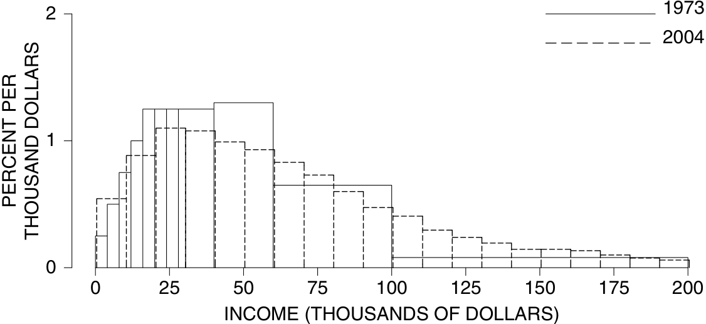

Bài tập B, trang 38

1. Biểu đồ histogram năm 1991 được biểu diễn trong hình 5 ở trang 39, và nguyên nhân của những đợt tăng vọt được thảo luận ở trang đó.

2. Làm phẳng đồ thị giữa 0 và 8.

3. Trình độ học vấn đã tăng lên. Ví dụ, nhiều người đã tốt nghiệp trung học và vào đại học trong năm 1991 hơn so với năm 1970.

   - _Bình luận._ Trong thế kỷ này, đã có sự gia tăng đáng kể và ổn định về trình độ học vấn của dân số. Năm 1940, chỉ có 25% dân số ở độ tuổi 25+ đã tốt nghiệp trung học. Đến năm 1993, tỷ lệ này đã lên tới 80% và vẫn đang tăng. Trong năm đó, khoảng 7% dân số ở độ tuổi 25+ đã hoàn thành bằng thạc sĩ trở lên. Vào năm 2005, khoảng 85% dân số ở độ tuổi 25+ có bằng tốt nghiệp trung học, và 9% có bằng thạc sĩ trở lên.

4. Đã tăng.

Bài tập C, trang 41

1. 15% cho mỗi $100.

2. Lựa chọn (ii) là câu trả lời, vì (i) không có đơn vị, và (iii) có đơn vị sai đối với mật độ.

3. 1.750, 2.000, 1, 0,5. Ý tưởng về mật độ: Nếu bạn rải đều 10 phần trăm trên 1 cm = 10 mm, sẽ có 1 phần trăm trong mỗi mm, tức là, 1 phần trăm mỗi mm.

4. (a) 1,5% mỗi điếu thuốc × 10 điếu thuốc = 15%. (b) 30% (c) 30% + 20% = 50% (d) 10% (e) 3,5%

ĐÁP ÁN BÀI TẬP _(trang 44–60)_ A–47

Bài tập D, trang 44

1. (a) định tính

   - (b) định tính

   - (c) định lượng, liên tục

   - (d) định lượng, liên tục

   - (e) định lượng, rời rạc

2. (a) Số trẻ em là một biến rời rạc.

   - (b) 

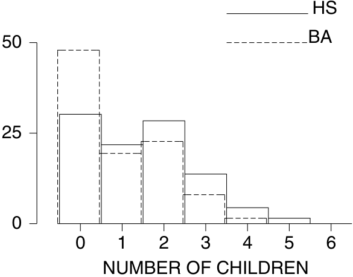

- (c) Những phụ nữ có học vấn cao hơn thì có ít con hơn.

Bài tập E, trang 46

1. Nhìn chung, những người mẹ có bốn con có huyết áp cao hơn. Tính nhân quả không được chứng minh, có yếu tố gây nhiễu là tuổi tác. Những người mẹ có bốn con thì lớn tuổi hơn. (Sau khi kiểm soát độ tuổi, Nghiên cứu Thuốc đã phát hiện ra rằng không còn sự liên quan nào giữa số trẻ em và huyết áp.)

2. Trái: thêm 10 mm Phải: thêm 10%

Bài tập F, trang 48

1. (a) 7% (b) 5%

   - (c) Những người sử dụng có xu hướng có huyết áp cao hơn.

2. Việc sử dụng thuốc tránh thai có liên quan đến việc tăng huyết áp thêm vài mm.

3. Những phụ nữ trẻ hơn có huyết áp hơi cao hơn một chút. _Bình luận._ Đây là một sự bất thường rõ rệt. Hầu hết các nghiên cứu ở Mỹ cho thấy huyết áp tâm thu tăng theo độ tuổi. Để so sánh, những phụ nữ trẻ hơn trong Nghiên cứu Thuốc tránh thai có huyết áp quá cao, trong khi những phụ nữ lớn tuổi có huyết áp quá thấp. Điều này có thể là do độ chệch trong quy trình được sử dụng để đo huyết áp tại đợt khám đa giai đoạn, vốn có xu hướng làm giảm thiểu sự phổ biến của các mức huyết áp trên 140 mm.

### **Chương 4. Số trung bình và Độ lệch chuẩn**

Bài tập A, trang 60

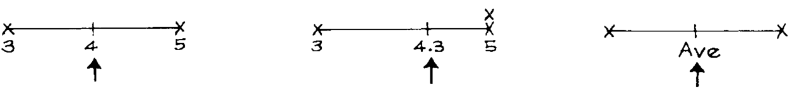

A–48 ĐÁP ÁN BÀI TẬP _(trang 60–65)_

_Bình luận._ Với hai số, số trung bình nằm ở giữa. Nếu bạn thêm các số lớn hơn vào danh sách, số trung bình sẽ tăng lên. (Các số nhỏ hơn sẽ làm nó giảm xuống.) Số trung bình luôn nằm ở một điểm nào đó giữa số nhỏ nhất và số lớn nhất trong danh sách.

2. Nếu số trung bình là 1, danh sách bao gồm mười số 1. Nếu số trung bình là 3, danh sách bao gồm mười số 3. Số trung bình không thể là 4: nó phải nằm giữa 1 và 3.

3. Số trung bình của (ii) lớn hơn, nó có một giá trị lớn là 11.

4. _(_ 10×66 inch + 77 inch _)/_ 11 = 67 inch = 5 feet 7 inch. Hoặc lập luận theo cách này: người mới cao hơn 11 inch so với số trung bình cũ. Vì vậy, người đó đã thêm 11 inch _/_ 11 = 1 inch vào số trung bình.

5. 5 feet 6 1/2 inches. Khi số lượng người trong phòng tăng lên, mỗi người thêm vào sẽ ít có tác động đến mức trung bình hơn.

6. 5 feet 6 inches + 22 inches = 7 feet 4 inches: đó là một con hươu cao cổ.

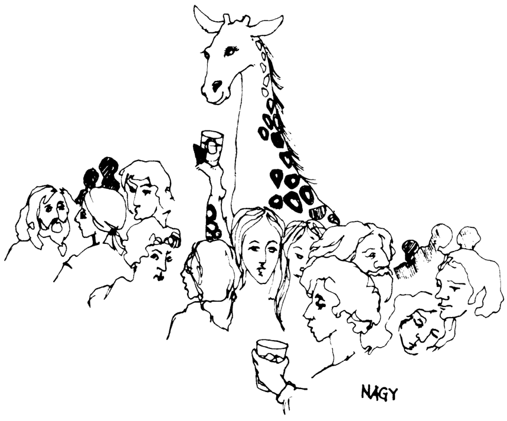

7. Dãy núi Rocky ở đầu bên phải, Kansas ở khoảng 0 (ngang mực nước biển), và rãnh Marianas ở đầu bên trái.

8. Kết luận không hoàn toàn đúng, dữ liệu là dữ liệu chéo (cross-sectional) chứ không phải dữ liệu dọc (longitudinal). Những người đàn ông có huyết áp tâm trương cao hơn có khả năng tử vong sớm hơn; họ sẽ không được biểu diễn trong đồ thị. Hơn nữa, những người đàn ông có huyết áp cao hơn có nhiều khả năng được sử dụng các loại thuốc làm giảm huyết áp.

9. Trong các thời kỳ suy thoái, các công ty có xu hướng sa thải những công nhân có thâm niên thấp nhất, cũng là những người được trả lương thấp nhất. Điều này làm tăng mức lương trung bình của những người còn lại trong danh sách trả lương. Khi suy thoái kết thúc, những công nhân lương thấp này được thuê lại.

   - _Nhận xét._ Việc ai được đưa vào một mức trung bình—và ai bị loại trừ—là rất quan trọng.

Set B, trang 65

1. (a) 50 (b) 25 (c) 40

2. (a) trung vị = trung bình (b) trung vị = trung bình

   - (c) trung vị nằm bên trái của trung bình—do phần đuôi dài bên phải.

ĐÁP ÁN CHO CÁC BÀI TẬP _(trang 65–70)_ A–49

3. 20

4. Trung bình phải lớn hơn trung vị, vì vậy hãy đoán là 25. (Đáp án chính xác là 27.)

5. Trung bình: phần đuôi dài bên phải.

6. (a) 1 (b) 10 (c) 5 (d) 5 ("Kích thước" có nghĩa là, bỏ qua dấu.)

### Set C, trang 67

1. (a) trung bình = 0, kích thước r.m.s. = 4 (b) trung bình = 0, kích thước r.m.s. = 10. Nhìn chung, các con số trong danh sách (b) có kích thước lớn hơn.

2. (a) 10 (đến một chữ số thập phân, đáp án chính xác là 9.0). (b) 20 (đến một chữ số thập phân, đáp án chính xác là 19.8).

   - (c) 1 (đến một chữ số thập phân, đáp án chính xác là 1.3).

   - Trung bình của các danh sách là 0; phép toán r.m.s. xóa bỏ các dấu.

3. Đối với cả hai danh sách, đó là 7; tất cả các mục đều có cùng kích thước, 7.

4. Kích thước r.m.s. là 3.2.

5. Kích thước r.m.s. là 3.1.

_Nhận xét._ r.m.s. trong bài tập 5 nhỏ hơn trong bài tập 4. Có một lý do. Giả sử chúng ta sẽ so sánh mỗi số trên một danh sách với một giá trị chung nào đó. Kích thước r.m.s. của các lượng chênh lệch phụ thuộc vào giá trị này. Đối với một số giá trị, r.m.s. lớn hơn, đối với những giá trị khác, r.m.s. nhỏ hơn. Khi nào r.m.s. nhỏ nhất? Có thể chứng minh bằng toán học rằng kích thước r.m.s. của các lượng chênh lệch là nhỏ nhất đối với mức trung bình.

6. Các sai số lớn hơn nhiều so với 3.6, vốn được cho là kích thước r.m.s. Có gì đó không ổn với máy tính.

### Set D, trang 70

1. (a) 170 cm là cao hơn 24 cm so với trung bình, SD là 8 cm, vì vậy 24 cm đại diện cho 3 SD. (b) 2 cm là 0.25 SD.

   - (c) 1.5 × 8 = 12 cm, cậu bé cao 146 − 12 = 134 cm.

   - (d) thấp nhất, 146 − 18 = 128 cm; cao nhất, 146 + 18 = 164 cm.

2. (a) 150 cm—khoảng trung bình; 4 cm chỉ là 0.5 SD. 130 cm—thấp bất thường; 16 cm là 2 SD. 165 cm—cao bất thường.

      - 140 cm—khoảng trung bình.

   - (b) Khoảng 68% nằm trong khoảng 138 đến 154 cm (trung bình ± 1 SD), và 95% nằm trong khoảng 130 đến 162 cm (trung bình ± 2 SD).

3. lớn nhất, (iii); nhỏ nhất, (ii).

_Nhận xét._ Cả ba danh sách đều có cùng mức trung bình là 50 và cùng phạm vi, từ 0 đến 100. Nhưng trong danh sách (iii), có nhiều số nằm xa 50 hơn. Trong danh sách (ii), có nhiều số nằm gần 50 hơn. Có nhiều thứ liên quan đến "độ phân tán" hơn là chỉ phạm vi.

4. (a) 1, vì tất cả các độ lệch khỏi mức trung bình 50 đều là ±1. (b) 2 (c) 2 (d) 2 (e) 10

A–50 ĐÁP ÁN CHO CÁC BÀI TẬP _(trang 70–73)_

_Nhận xét._ SD cho biết các mục nhập lệch khỏi mức trung bình bao xa, nhìn chung. Chỉ cần tự hỏi xem các mức chênh lệch nhìn chung giống với 1, 2, hay 10 về kích thước hơn.

5. 25 năm. Mức trung bình có thể là 30 năm, vì vậy nếu 5 năm là câu trả lời, nhiều người sẽ cách mức trung bình 4 SD; với 50 năm, mọi người đều sẽ nằm trong khoảng 1 SD so với mức trung bình.

6. (a) (i)

   - (b) (ii) (c) (v)

7. Trong thử nghiệm (i), có gì đó không ổn: nhóm điều trị nặng hơn nhiều so với nhóm đối chứng. (Xem bài tập 7 ở trang 22.)

8. Các mức trung bình và SD phải xấp xỉ bằng nhau, nhưng điều tra viên với mẫu lớn hơn có khả năng lấy được người đàn ông cao nhất, cũng như người thấp nhất. Mẫu càng lớn, phạm vi càng lớn. SD và phạm vi đo lường những thứ khác nhau.

9. Đoán mức trung bình, 69 inch. Bạn có khoảng 1/3 cơ hội bị sai lệch hơn một SD, tức là 3 inch.

10. 3 inch. SD là độ lệch r.m.s. khỏi mức trung bình.

Set E, trang 72

1. SD của (ii) lớn hơn; trên thực tế, SD của (i) là 1, SD của (ii) là 2.

2. Không, SD khác với độ lệch tuyệt đối trung bình, vì vậy phương pháp này sai.

3. Không, số 0 có được tính, vì vậy phương pháp này sai.

4. (a) Cả ba lớp đều có cùng mức trung bình, 50.

   - (b) Lớp B có SD lớn nhất; có nhiều sinh viên ở xa mức trung bình hơn.

   - (c) Cả ba lớp đều có cùng phạm vi. Có nhiều thứ liên quan đến độ phân tán hơn là phạm vi; xem bài tập 3 ở trang 70.

5. (a) (i) trung bình = 4; các độ lệch = −3, −1, 0, 1, 3; SD = 2. (ii) trung bình = 9; các độ lệch = −3, −1, 0, 1, 3; SD = 2.

   - (b) Danh sách (ii) có được từ danh sách (i) bằng cách cộng thêm 5 vào mỗi mục. Điều này cộng thêm 5 vào mức trung bình, nhưng không ảnh hưởng đến các độ lệch khỏi mức trung bình. Vì vậy, nó không ảnh hưởng đến SD. Việc cộng thêm cùng một số vào mỗi mục trên một danh sách không ảnh hưởng đến SD.

6. (a) (i) trung bình = 4; các độ lệch = −3, −1, 0, 1, 3; SD = 2. (ii) trung bình = 12; các độ lệch = −9, −3, 0, 3, 9; SD = 6.

   - (b) Danh sách (ii) có được từ danh sách (i) bằng cách nhân mỗi mục với 3. Điều này nhân mức trung bình với 3. Nó cũng nhân các độ lệch khỏi mức trung bình với hệ số 3, vì vậy nó nhân SD với hệ số 3. Việc nhân mỗi mục trên một danh sách với cùng một số dương chỉ làm nhân SD với số đó.

7. (a) (i) trung bình = 2; các độ lệch = 3, −6, 1, −3, 5; SD = 4.

      - (ii) trung bình = −2; các độ lệch = −3, 6, −1, 3, −5; SD = 4.

   - (b) Danh sách (ii) có được từ danh sách (i) bằng cách đổi dấu của mỗi mục. Điều này làm đổi dấu của mức trung bình và tất cả các độ lệch khỏi mức trung bình, nhưng không ảnh hưởng đến SD.

8. (a) Điều này sẽ làm tăng mức trung bình thêm $250 nhưng giữ nguyên SD. (b) Điều này sẽ làm tăng mức trung bình và SD thêm 5%.

9. Kích thước r.m.s. là 17, và SD là 0.

A–51

ĐÁP ÁN CHO CÁC BÀI TẬP _(trang 73–88)_

10. SD nhỏ hơn nhiều so với kích thước r.m.s. Xem trang 72.

11. Không.

12. Có; ví dụ, danh sách 1, 1, 16 có mức trung bình là 6 và SD khoảng 7.

### **Chương 5. Xấp xỉ Chuẩn cho Dữ liệu**

Set A, trang 82

1. (a) 60 là cao hơn mức trung bình 10; đó là 1 SD. Vì vậy 60 là +1 ở các đơn vị chuẩn. Tương tự, 45 là −0.5 và 75 là +2.5.

   - (b) 0 tương ứng với mức trung bình, 50. Điểm số là 1.5 ở các đơn vị chuẩn thì cao hơn mức trung bình 1.5 SD; đó là 1.5 × 10 = 15 điểm cao hơn mức trung bình, hay 65 điểm. Điểm số 22 là −2.8 ở các đơn vị chuẩn.

2. Mức trung bình là 10; SD là 2.

   - (a) Ở các đơn vị chuẩn, danh sách là +1.5, −0.5, +0.5, −1.5, 0.

   - (b) Danh sách đã chuyển đổi có mức trung bình là 0 và SD là 1. (Điều này luôn đúng: khi được chuyển đổi sang các đơn vị chuẩn, bất kỳ danh sách nào cũng sẽ có mức trung bình là 0 và SD sẽ là 1.)

Set B, trang 84

1. (a) 11% (b) 34% (c) 79% (d) 25% (e) 43% (f) 13%

2. (a) 1 (b) 1.15

3. (a) 1.65

   - (b) 1.30. Đây KHÔNG phải là cùng một _z_ như trong (a).

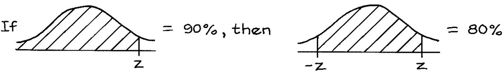

4. (a) 100% − 39% = 61%.

   - (b) không thể nếu không có thêm thông tin

5. (a) 58% ÷ 2 = 29% (b) 50% − 29% = 21%. (c) không thể nếu không có thêm thông tin.

Set C, trang 88

1. (a)

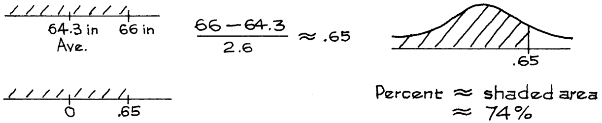

- (b) 69% (c) 0.2 của 1%.

A–52 ĐÁP ÁN CHO CÁC BÀI TẬP _(trang 88–111)_

2. (a) 77% (b) 69%

3. Trong hình 2, phần trăm phụ nữ có chiều cao từ 61 inch đến 66 inch chính xác bằng với diện tích dưới biểu đồ tần suất và xấp xỉ bằng diện tích dưới đường cong chuẩn.

Set D, trang 89

1. (a) 75% (b) $29,000 

   - (c) 75%. Lý do: 90% − 10% = 80% nằm trong khoảng $15,000 đến $135,000; và $15,000 đến $125,000 nằm trong khoảng gần tương đương nhưng nhỏ hơn một chút. 

2. 5, 95. 

3. $7,000. 

4. Diện tích ở bên trái bách phân vị thứ 25 phải là 25% tổng diện tích, vì vậy bách phân vị thứ 25 phải nhỏ hơn một chút so với 25 mm. 

5. (a) Nó có các đuôi dày hơn. 

   - (b) Khoảng tứ phân vị xấp xỉ 15. 

Set E, trang 92 

1. Cô ấy cao hơn trung bình 2.15 SD, ở bách phân vị thứ 98. 

2. Điểm số cao hơn trung bình 0.85 SD, tức là cao hơn trung bình 0 _._ 85 × 100 ≈ 85 điểm. Đó là 535 + 85 = 620. 

3. 2.75 điểm—thấp hơn trung bình 0.50 SD. 

Set F, trang 93 

1. (a) Trung bình là 

5 9×_(_98_._6 −32_)_= 37_._0 

SD là 5 9× 0_._3 = 0_._17 

- (b) Trong các đơn vị chuẩn, sự thay đổi thang đo bị triệt tiêu, vì vậy đáp án là 1.5. 

### **Chương 7. Vẽ Điểm và Đường** 

Set A, trang 111 

1. A = _(_ 1 _,_ 2 _)_ B = _(_ 4 _,_ 4 _)_ C = _(_ 5 _,_ 3 _)_ D = _(_ 5 _,_ 1 _)_ E = _(_ 3 _,_ 0 _)_ . 

2. _x_ tăng 3, _y_ tăng 2. 

3. Điểm D. 

ĐÁP ÁN BÀI TẬP _(trang 112–114)_ A–53 

Set B, trang 112 

1. Bốn điểm đều nằm trên một đường thẳng. 

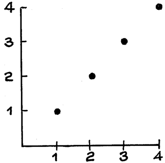

2. Điểm ngoại lai (maverick) là _(_ 1 _,_ 2 _)_ và nó nằm phía trên đường thẳng. 

3. Tất cả các điểm đều nằm trên một đường thẳng. 

|_x_ _y_ 1 3 2 5 3 7 4 9|
|---|

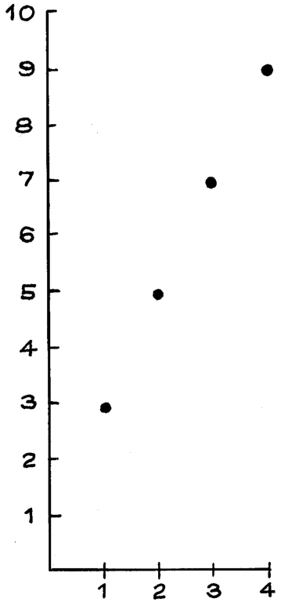

4. _(_ 1 _,_ 2 _)_ là ngoài; _(_ 2 _,_ 1 _)_ là trong. 

5. _(_ 1 _,_ 2 _)_ là trong; _(_ 2 _,_ 1 _)_ là ngoài. 

6. _(_ 1 _,_ 2 _)_ là trong; _(_ 2 _,_ 1 _)_ là ngoài. 

Set C, trang 114 

|1.|_Hình 16_|_Hình 17_|_Hình 18_|
|---|---|---|---|
|Hệ số góc|−1_/_4 in trên lb|5|1|
|Hệ số chặn|1 in|−10|0|

_Lưu ý:_ Trong Hình 18, các trục cắt nhau tại _(_ 2 _,_ 2 _)_ . 

A–54 ĐÁP ÁN BÀI TẬP _(trang 115–116)_ 

Set D, trang 115 

1. 

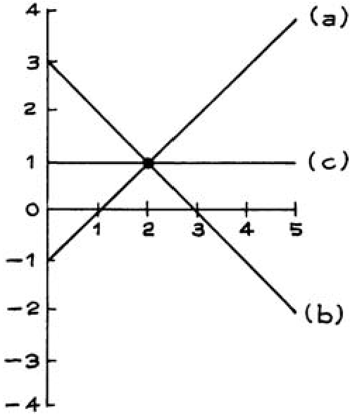

2. Trên đường thẳng. 

3. Trên đường thẳng. 

4. Bên trên đường thẳng. 

5. 

6. 

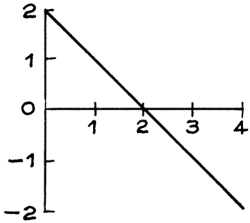

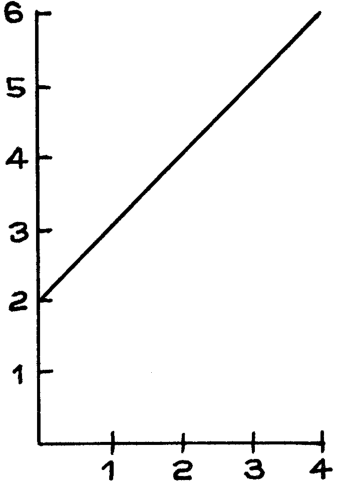

Set E, trang 116 

|1.||||
|---|---|---|---|
||_Hệ số góc_|_Hệ số chặn_|_Chiều cao tại x_ =2|
|(a)|2|1|5|
|(b)|1_/_2|2|3|

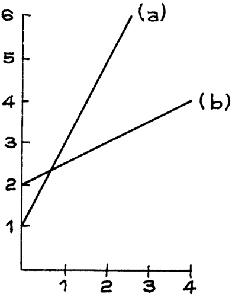

ĐÁP ÁN BÀI TẬP _(trang 116–123)_ A–55 

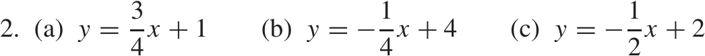

3. Tất cả chúng đều nằm trên đường thẳng _y_ = 2 _x_ . 

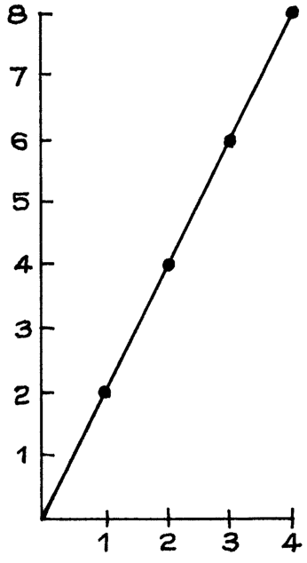

4. Tất cả chúng đều nằm trên đường thẳng _y_ = _x_ . 

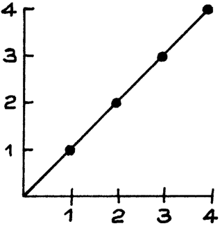

5. (a) trên đường thẳng. (b) bên trên đường thẳng. (c) bên dưới đường thẳng. 

6. Cả ba khẳng định đều đúng. Nếu bạn hiểu các bài tập 4, 5, và 6, bạn đã sẵn sàng cho phần III. 

## **Phần III. Tương quan và Hồi quy** 

### **Chương 8. Tương quan** 

Set A, trang 122 

1. (a) người cha thấp nhất, 59 inch; con trai của ông, 65 inch. 

   - (b) người cha cao nhất, 75 inch; con trai của ông, 70 inch. 

   - (c) 76 inch, 64 inch. 

   - (d) hai: 69 inch, 70 inch. 

   - (e) ave = 68 inch. (f) SD = 3 inch. 

2. _x y_ 

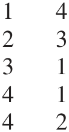

A–56 ĐÁP ÁN BÀI TẬP _(trang 123–130)_ 

3. (a) ave _x_ = 1 _._ 5 (b) SD của _x_ = 0 _._ 5 (c) ave _y_ = 2 (d) SD của _y_ = 1 _._ 5 

4. 

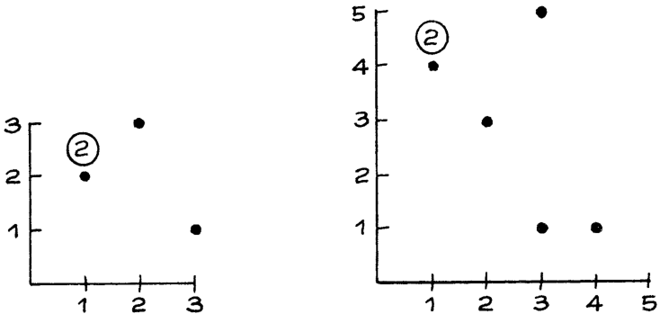

5. (a) A, B, F (b) C, G, H (c) ave ≈ 50 (d) SD ≈ 25 (e) ave ≈ 30 (f) Sai. (g) Sai, sự liên kết là âm. 

6. (a) 75 (b) 10 (c) 20 (d) Kỳ thi cuối kỳ. (e) Kỳ thi cuối kỳ. (f) Đúng. 

Tập B, trang 128 

1. (a) Âm. Xe càng cũ, giá càng thấp. (b) Âm. Xe càng nặng, hiệu suất càng kém. 

2. Trái: ave _x_ = 3 _._ 0, SD _x_ = 1 _._ 0, ave _y_ = 1 _._ 5, SD _y_ = 0 _._ 5, tương quan dương. Phải: ave _x_ = 3 _._ 0, SD _x_ = 1 _._ 0, ave _y_ = 1 _._ 5, SD _y_ = 0 _._ 5, tương quan âm. 

3. Biểu đồ bên trái có hệ số tương quan gần 0 hơn, nó ít giống một đường thẳng hơn. 

4. Hệ số tương quan khoảng 0.5. 

5. Hệ số tương quan gần bằng 0. 

_Nhận xét._ Các nhà tâm lý học gọi đây là sự "suy giảm" (attenuation). Nếu bạn giới hạn phạm vi của một biến, điều đó thường làm giảm hệ số tương quan. 

6. (a) Tất cả các điểm trên biểu đồ phân tán sẽ nằm trên một đường thẳng dốc lên, do đó hệ số tương quan sẽ bằng 1. 

   - (b) Gần 1; điều này giống như phần (a), với một số nhiễu được đưa vào dữ liệu. 

   - _Nhận xét._ Trong Khảo sát Dân số Hiện tại tháng 3 năm 2005, hệ số tương quan giữa tuổi của chồng và vợ là khoảng 0.93; trung bình, những người chồng lớn hơn vợ của họ 2.3 tuổi. 

7. (a) Gần −1: bạn càng lớn tuổi, bạn càng sinh ra sớm hơn; nhưng có một số yếu tố làm mờ, tùy thuộc vào việc sinh nhật của bạn là trước hay sau ngày thực hiện bảng câu hỏi. 

   - (b) Hơi dương. 

8. (a) Hơi dương. Mặc dù thu nhập của vợ phải nhỏ hơn thu nhập của gia đình, hai biến này có sự liên kết dương. 

   - (b) Gần −1. Nếu thu nhập của gia đình gần như không đổi, vợ kiếm được càng nhiều thì chồng càng kiếm được ít. 

_Nhận xét._ Trong Khảo sát Dân số Hiện tại tháng 3 năm 2005, hệ số tương quan giữa thu nhập của vợ và tổng thu nhập là khoảng 0.70. Trong số các gia đình có tổng thu nhập trong khoảng $80,000–$90,000, hệ số tương quan giữa thu nhập của chồng và thu nhập của vợ là khoảng −0 _._ 98. 

9. Sai: xem tr. 126. 

ĐÁP ÁN BÀI TẬP _(trang 131–144)_ A–57 

Tập C, trang 131 

1. (a) Đúng. (b) Sai. 

2. Nét đứt. 

3. Anh ấy cao hơn mức trung bình một SD và phải nặng 140 + 20 = 160 pound. 4. (a) Có. (b) Không. (c) Có. 

Tập D, trang 134 

1. (a) ave của _x_ = 4, SD của _x_ = 2 ave của _y_ = 4, SD của _y_ = 2 

|_Đơn vị chuẩn_ _x_ _y_|_Tích_|
|---|---|
|−1_._5 1.0|−1_._50|
|−1_._0 1.5|−1_._50|
|−0_._5 0.5|−0_._25|
|0.0 0.0|0.00|
|0.5 −0_._5|−0_._25|
|1.0 −1_._5|−1_._50|
|1.5 −1_._0|−1_._50|

_r_ = trung bình của các tích ≈−0 _._ 93 

   - (b) _r_ = 0 _._ 82, bằng tính toán. 

   - (c) Không cần tính toán: _r_ = −1. Tất cả các điểm đều nằm trên một đường thẳng dốc xuống, _y_ = 8 − _x_ . 

2. Khoảng 50%. 

3. Khoảng 25%. 

4. Khoảng 5%. 

### **Chương 9. Thêm về Tương quan** 

Tập A, trang 143 

1. (a) Gần bằng nhau. 

   - (b) Giá trị lớn nhất phải lớn hơn giá trị nhỏ nhất. 

2. Không: hệ số tương quan giữa _x_ và _y_ giống như hệ số tương quan giữa _y_ và _x_ . 

3. _r_ giữ nguyên. 

4. _r_ giữ nguyên. 

5. _r_ thay đổi. 

6. (a) Tăng lên. (b) Giảm xuống. (c) Đảo ngược dấu. 

7. (a) 1 (b) Giảm xuống. 

   - (c) _r_ sẽ nhỏ hơn 1 — sai số đo lường. 

8. Hệ số tương quan sẽ giảm (thực tế là xuống khoảng 0.25). 

A–58 ĐÁP ÁN BÀI TẬP _(trang 144–148)_ 

9. Hệ số tương quan cho cả năm lớn hơn; ví dụ, trời sẽ rất lạnh vào mùa đông, rất nóng vào mùa hè—ở cả hai thành phố. _Nhận xét._ Đây là một ví dụ khác về sự "suy giảm" (bài tập 5 trên trang 130). Trong biểu đồ phân tán bên dưới, các dấu chéo cho thấy dữ liệu của tháng 6 năm 2005 ( _r_ = 0 _._ 42); các dấu chấm cho thấy dữ liệu của các ngày trong những tháng khác; hệ số tương quan cho cả 365 ngày là 0.92. Việc tập trung vào tháng 6 làm giới hạn phạm vi của nhiệt độ, và làm giảm (làm yếu đi) sự tương quan. 

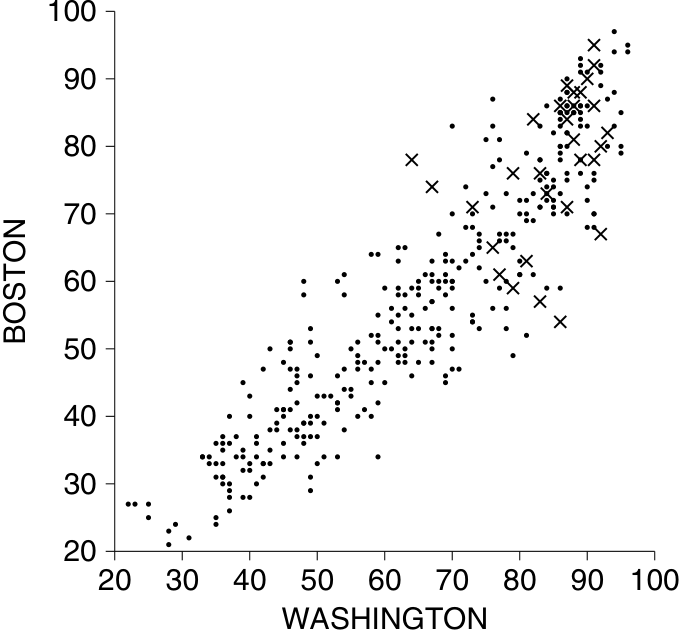

10. Tập dữ liệu (iii) giống như (ii), với _x_ và _y_ được hoán đổi; do đó _r_ là 0.7857. Tập dữ liệu (iv) xuất phát từ (i), bằng cách cộng thêm 1 vào mỗi giá trị _x_, do đó _r_ là 0.8571. Tập dữ liệu (v) xuất phát từ (i) bằng cách nhân đôi mỗi giá trị _y_, do đó _r_ cũng là 0.8571. Tập dữ liệu (vi) xuất phát từ (ii) bằng cách trừ đi 1 từ mỗi giá trị _x_, và nhân mỗi giá trị _y_ với 3, do đó _r_ là 0.7857. 

Tập B, trang 145 

1. Mỗi biểu đồ riêng biệt có hệ số tương quan gần 0.6. Nhưng khi gộp tất cả lại, mọi thứ trông giống một đường thẳng hơn nhiều, và hệ số tương quan gần với 0.9 hơn — đây là sự suy giảm theo chiều ngược lại. 

2. Hơi lớn hơn 0.67 một chút. Điều này giống như bài tập trước: khi bạn gộp tất cả những đứa trẻ lại với nhau, dữ liệu trở nên tuyến tính hơn nhiều. Cũng xem bài tập 9 ở trang 144. 

3. Có; điểm khác biệt duy nhất là sự thay đổi về thang đo. 

4. Có; nó giống như bất kỳ biểu đồ nào trong bài tập trước, do đó _r_ ≈ 0 _._ 7. 

Tập C, trang 148 

1. (i) nên được tóm tắt bằng cách sử dụng _r_ , (ii) và (iii) thì không. 

2. Sai: giống như biểu đồ (iii) trong bài tập 1. 

3. Gần bằng 1. Có một sự liên kết mạnh, nhưng mối quan hệ là bậc hai chứ không phải tuyến tính, do đó hệ số tương quan không thể là 1. 

4. Cả hai đều sai. Bạn cần nhìn vào biểu đồ phân tán để kiểm tra các giá trị ngoại lai (outliers) hoặc tính phi tuyến. 

ĐÁP ÁN BÀI TẬP _(trang 149–161)_ A–59 

Tập D, trang 149 

1. (a) Biểu đồ không được cho. (b) Đúng. 

   - (c) Điều này không thể được xác định từ dữ liệu (nhưng đúng theo các nghiên cứu khác). 

2. Không. Sự tương quan này có thể phóng đại sức mạnh của mối quan hệ — nó được dựa trên các tỷ lệ. 

Tập E, trang 152 

1. Thời lượng (Duration) chỉ được đo chính xác đến 2 triệu năm gần nhất; biến này không dễ để xác định rất chính xác. 

2. Có, và điều này sẽ phóng đại sức mạnh của sự liên kết. 

3. (a) Đúng. (b) Đúng. (c) Đúng. (d) Sai. Bài học: sự liên kết không giống với quan hệ nhân quả. 

4. Có lẽ, nhưng điều này không suy ra từ dữ liệu. Ví dụ, có thể là những người gặp khó khăn trong việc đọc lại xem truyền hình nhiều hơn—vậy nên quan hệ nhân quả chạy theo hướng ngược lại. Suy cho cùng, hệ số tương quan giữa _x_ và _y_ bằng hệ số tương quan giữa _y_ và _x_ . 

5. Lời giải thích tốt nhất là sự liên kết giữa việc uống cà phê và hút thuốc lá. Những người uống cà phê có nhiều khả năng hút thuốc hơn, và hút thuốc gây ra các vấn đề về tim mạch. 

6. Đây là một nghiên cứu quan sát (observational study), không phải một thử nghiệm có đối chứng (controlled experiment), và việc vẽ các điểm từ thập niên năm mươi hoặc bảy mươi lên biểu đồ chỉ làm nó trở nên lộn xộn. 

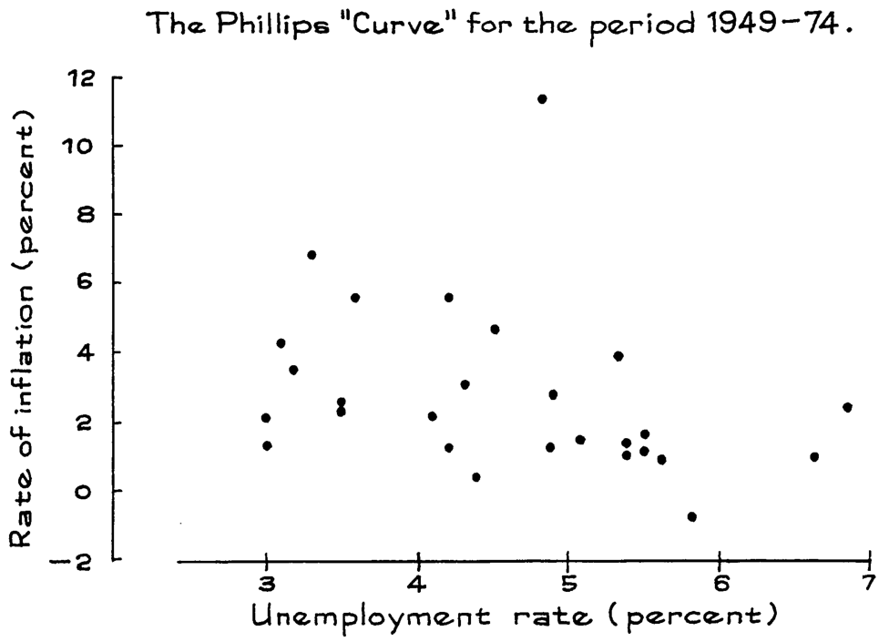

### **Chương 10. Hồi quy** 

Tập A, trang 161 

1. (a) 67.5 (b) 45 (c) 60 

   - Bài làm cho (a). Điểm 75 cao hơn mức trung bình 1 SD. Tuy nhiên, _r_ chỉ bằng 0.5. Nếu bạn lấy những học sinh có điểm cao hơn mức trung bình 1 SD ở kỳ thi giữa kỳ, điểm trung bình của họ trong 

A–60 ĐÁP ÁN BÀI TẬP _(trang 161)_ 

kỳ thi cuối kỳ sẽ chỉ cao hơn mức trung bình ở kỳ thi cuối kỳ khoảng 0.5 SD, nghĩa là, 0 _._ 5 × 15 = 7 _._ 5 điểm. Do đó, điểm số trung bình ước tính trong kỳ thi cuối kỳ cho nhóm này là 60 + 7 _._ 5 = 67 _._ 5. _Nhận xét._ Các ước lượng hồi quy luôn nằm trên một đường thẳng—đường hồi quy. Thêm về điều này ở chương 12. 

2. (a) 190 pound (b) 173 pound − − 

(c) 68 pound (d) 206 pound. 

   - _Nhận xét về (c)._ Điều này bắt đầu trở nên nực cười, nhưng Cơ quan Dịch vụ Y tế Công cộng không gặp bất kỳ người đàn ông nhỏ bé nào cao 2 feet, vì vậy đường hồi quy không chú ý nhiều đến khả năng này. Đường hồi quy sẽ càng ít đáng tin cậy hơn khi nó càng rời xa trung tâm của biểu đồ phân tán. 

3. Sai. Hãy nghĩ về biểu đồ phân tán về chiều cao và cân nặng của tất cả nam giới. Lấy một dải dọc tại 69 inch, đại diện cho tất cả những người đàn ông có chiều cao chỉ ở mức trung bình. Cân nặng trung bình của họ cũng chỉ ở khoảng mức trung bình tổng thể. Nhưng những người đàn ông trong độ tuổi 45–74 được đại diện bởi một tập hợp điểm khác, một số trong đó nằm trong dải này, và nhiều điểm khác thì không. Đường hồi quy cho biết cân nặng trung bình phụ thuộc vào chiều cao như thế nào, chứ không phải tuổi tác. (Những người đàn ông lớn tuổi hơn thực sự nặng hơn mức trung bình một chút — sự phì nộn tuổi trung niên đã bắt đầu.) 

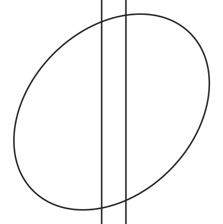

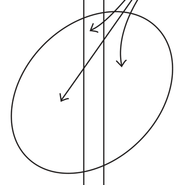

4. Những phụ nữ này đã hoàn thành 12 năm đi học, thấp hơn 2 năm so với mức trung bình. Họ có số năm đi học dưới mức trung bình là 2 _/_ 2 _._ 4 ≈ 0 _._ 83 SD (độ lệch chuẩn). Ước tính là thu nhập của họ ở dưới mức trung bình, nhưng không phải là 0.83 SD—mà chỉ là _r_ × 0 _._ 83 ≈ 0 _._ 28 SD thu nhập. Tính bằng đô la, đó là 0 _._ 28 × $26 _,_ 000 ≈ $7 _,_ 300. Thu nhập trung bình của họ được ước tính là 

   - mức trung bình tổng thể − $7 _,_ 300 = $32 _,_ 000 − $7 _,_ 300 = $24 _,_ 700 _._ 

5. Tất cả các điểm phải nằm trên đường SD, đường này dốc xuống; tỷ lệ là một SD của _y_ cho mỗi SD của _x_ . 

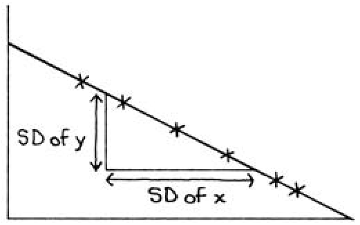

ĐÁP ÁN CHO CÁC BÀI TẬP _(trang 163–165)_ A–61 

Tập B, trang 163 

1. (a) Đúng: đồ thị của các giá trị trung bình dốc lên. Nhìn chung, những người đàn ông có thu nhập cao hơn thì có vợ có thu nhập cao hơn. Mọi người thường chọn bạn đời có trình độ học vấn và nền tảng gia đình tương tự, điều này cũng có xu hướng làm cho mức thu nhập tương đồng nhau. 

   - (b) Sai số ngẫu nhiên (chance error). Dữ liệu lấy từ một mẫu, và chỉ có 4 cặp vợ chồng phía sau điểm chấm đó. 

   - (c) Các ước tính hồi quy sẽ hơi quá thấp: đường thẳng chạy phía dưới các điểm chấm. 

2. 

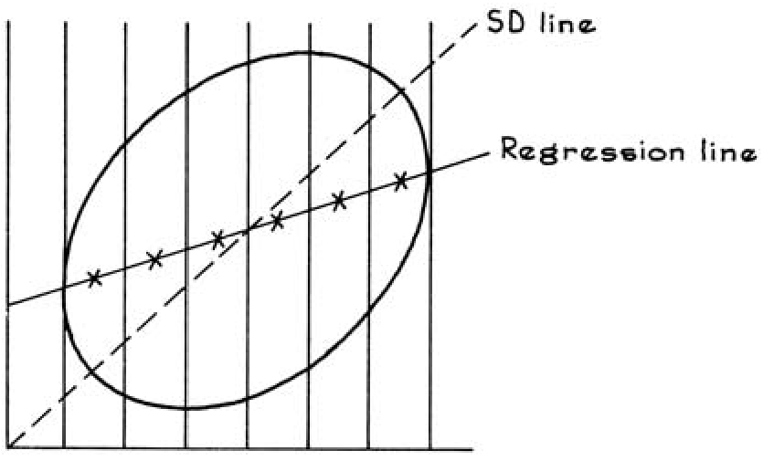

Các dấu thập nằm trên đường hồi quy nét liền, đường nét đứt là đường SD. 

3. Đối với hai biểu đồ bên trái, đường SD là nét đứt và đường hồi quy là nét liền. Đối với hai biểu đồ bên phải, đường SD là nét liền và đường hồi quy là nét đứt. Bài học: đường hồi quy không dốc bằng đường SD. 

4. 

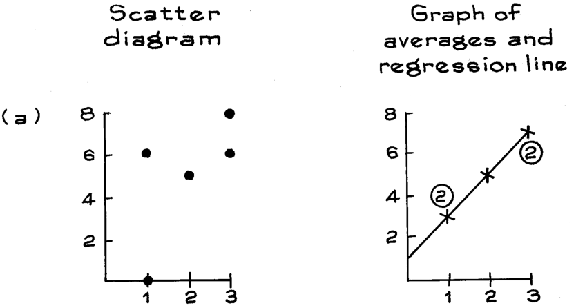

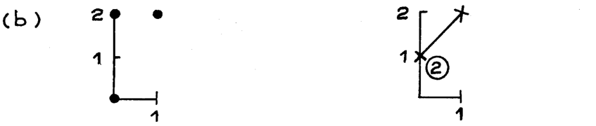

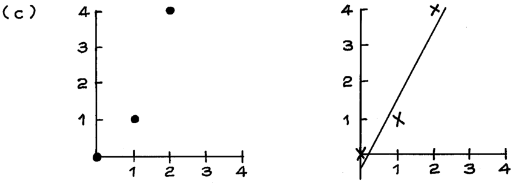

A–62 ĐÁP ÁN CHO CÁC BÀI TẬP _(trang 164–174)_ 

4. 

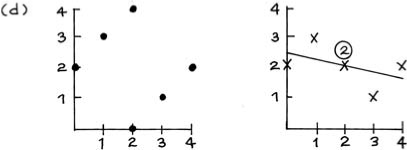

Tập C, trang 167 

1. (a) 67.5 (b) 45 (c) 60 (d) 60 

Bài tập này nói về các cá nhân; bài tập 1 ở trang 161 nói về các nhóm. Phép toán cho các phần (a–c) là giống nhau; trang 165–66. 

2. (a) 79% (b) 38% (c) 50% (d) 50% Bài làm cho (a): 

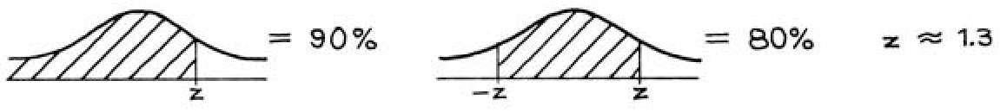

Ở các đơn vị chuẩn (standard units), điểm SAT của anh ấy là 1.3. Dự báo (prediction) hồi quy cho điểm năm nhất của anh ấy là 0 _._ 6 × 1 _._ 3 ≈ 0 _._ 8 tính theo đơn vị chuẩn. 

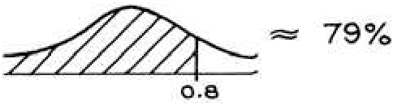

Điều này tương ứng với thứ hạng phân vị là 79%. Trong ví dụ 2, thứ hạng phân vị được dự báo chỉ là 69%, gần hơn với mức 50%. Đó là do hệ số tương quan thấp hơn trong ví dụ 2. Có nhiều sự hồi quy về giá trị trung bình (regression to the mean) hơn trong ví dụ 2. 

3. (a) Đường SD—nét đứt. (b) Đường hồi quy—nét liền. 

4. (a) Có độ tuổi tối thiểu để kết hôn. 

   - (b) Tuổi được báo cáo dưới dạng số nguyên năm; có rất nhiều người chồng 30 tuổi, nhưng không có ai 30.33 tuổi; điều tương tự cũng áp dụng cho những người vợ. 

5. Sai. Đường hồi quy cho biết cân nặng trung bình phụ thuộc vào chiều cao như thế nào, chứ không phải phụ thuộc vào tuổi tác. Xem bài tập 3 ở trang 161. 

Tập D, trang 174 

1. Không, điều này trông giống như hiệu ứng hồi quy (regression effect). Hãy tưởng tượng một thí nghiệm có đối chứng (controlled experiment). Tại một sân bay, các giảng viên thảo luận về các xếp hạng với các phi công. Tại sân bay khác, các giảng viên giữ kín các xếp hạng đó. Ngay cả ở sân bay thứ hai, các xếp hạng ở hai lần hạ cánh sẽ không giống hệt nhau—sự khác biệt sẽ xuất hiện. Vì vậy hiệu ứng hồi quy xuất hiện: trung bình thì nhóm dưới cùng cải thiện một chút, và nhóm trên cùng bị tụt lại. Đó có lẽ là tất cả những gì lực lượng không quân thấy trong dữ liệu của họ. 

2. Không. Có vẻ như việc gia sư đã có tác dụng—hồi quy sẽ chỉ đưa họ đến gần hơn với mức trung bình, nhưng họ đã vượt sang mức bên kia. 

3. Những người con trai của các ông bố cao 61 inch thì trung bình sẽ cao hơn những người con trai của các ông bố cao 62-

ĐÁP ÁN CHO CÁC BÀI TẬP _(trang 175–184)_ A–63 

inch. Đây chỉ là sự biến thiên ngẫu nhiên (chance variation). Theo xác suất may rủi, Pearson đã lấy phải quá nhiều gia đình mà người bố cao 61 inch và người con trai đặc biệt cao. _Bình luận._ Chỉ có 8 gia đình mà người bố cao khoảng 61 inch, và 15 gia đình mà người bố cao 62 inch—có rất nhiều khả năng cho sai số ngẫu nhiên. 

Tập E, trang 175 

1. Sai. Có hai nhóm đàn ông hoàn toàn khác nhau ở đây. (Xem biểu đồ bên dưới.) Những người cao 63 inch nằm trong dải dọc. Cân nặng trung bình của họ là 138 pound, như được hiển thị bằng dấu thập. Những người nặng 138 pound nằm trong dải ngang. Chiều cao trung bình của họ được hiển thị bằng một dấu chấm đậm, và nó cao hơn nhiều so với 63 inch. 

Hãy nhớ rằng, có hai đường hồi quy— 

- một cho cân nặng theo chiều cao, 

- một cho chiều cao theo cân nặng. 

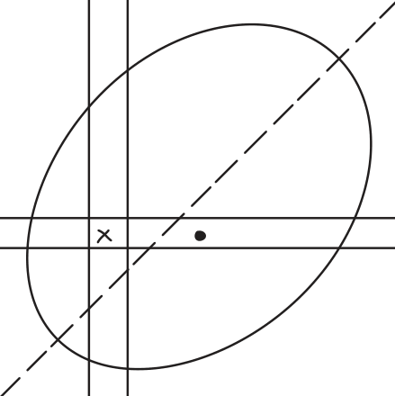

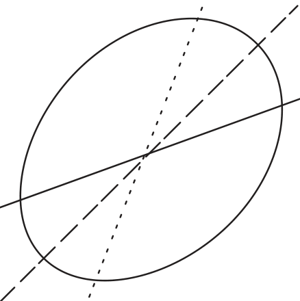

2. Sai. Những người bố chỉ cao trung bình 69 inch; bạn phải sử dụng đường còn lại. 

3. Sai. Điều này giống hệt như bài tập 1 và 2. (Một sinh viên tiêu biểu ở bách phân vị thứ 69 của các bài kiểm tra năm nhất sẽ ở bách phân vị thứ 58 trong kỳ thi SAT; hãy sử dụng đường còn lại.) 

### **Chương 11. Sai số R.M.S. cho Hồi quy** 

Tập A, trang 184 

1. B thì cao và mũm mĩm, trong khi D thì thấp và gầy. 

2. (a) Sai. (b) Đúng. 

3. Các sai số dự báo (prediction errors) = −7, 1, 3, −1, 4; sai số r.m.s. = 3 _._ 9. 

4. (a) 0.2 (b) 1 (c) 5. 

5. Vài ngàn đô la. 

6. Nên sử dụng đường có sai số r.m.s. nhỏ hơn, vì nó sẽ chính xác hơn xét về tổng thể. 

A–64 ĐÁP ÁN CHO CÁC BÀI TẬP _(trang 184–193)_ 

7. (a) 8 điểm—một sai số r.m.s. 

8. (a) $20,000. 

(b) 16 điểm—hai sai số r.m.s. 

- (b) Đường nằm ngang. Xem trang 183. 

Tập B, trang 187 

1. 1 − 0 _._ 62 × 10 = 8 điểm. 

2. (a) Đoán giá trị trung bình, 65. 

   - (b) 10. Nếu bạn sử dụng đường hồi quy, sai số r.m.s. được cho bởi công thức (bài tập 1). Nếu bạn sử dụng giá trị trung bình, sai số r.m.s. là SD. (Xem bài tập 9–10 ở trang 71.) 

   - (c) Sử dụng đường hồi quy, và sai số r.m.s. được cho bởi công thức là 8 điểm (bài tập 1). 

3. Nhìn chung, việc có thêm thông tin sẽ giúp ích. Sai số r.m.s. sẽ nhỏ hơn đối với người B, theo hệ số 1 − 0 _._ 62 = 0 _._ 8. Xem trang 186. 

Tập C, trang 189 

1. (a) (iii) (b) (ii) (c) (i) 2. (a) (i) (ii) (b) không được sử dụng (c) (iii) 

3. (a) SD của _y_ ≈ 1 

   - (b) SD của các phần dư (residuals) ≈ 0 _._ 6 

   - (c) SD của _y_ trong dải ≈ 0 _._ 6, xấp xỉ bằng SD của các phần dư. 

_Bình luận._ Sự phân tán theo chiều dọc (vertical scatter) trong dải gần bằng với sai số r.m.s. của đường hồi quy—nhưng sự phân tán theo chiều dọc trong toàn bộ biểu đồ thì nhiều hơn rất nhiều so với sự phân tán theo chiều dọc trong dải. 

Tập D, trang 193 

1. (a) Đúng. 

   - (b) Đúng; biểu đồ phân tán là đồng phương sai (homoscedastic), vì vậy các đối tượng (subjects) chệch khỏi đường hồi quy với một lượng tương tự nhau trong mỗi dải dọc. 

   - (c) Sai, bởi vì biểu đồ phân tán là dị phương sai (heteroscedastic); 9 điểm là một loại lượng chệch trung bình, nhưng các sai số dự báo sẽ lớn hơn với các mức điểm cao. 

2. (a) 1 − 0 _._ 52 × 2 _._ 7 ≈ 2 _._ 3 inch. 

   - (b) 71 inch—phương pháp hồi quy. 

   - (c) 2.3 inch. Biểu đồ phân tán là đồng phương sai, vì vậy chiều cao của các người con trai chệch khỏi đường hồi quy với một lượng tương tự nhau, đối với bất kỳ chiều cao nào của người bố. Lượng chệch chính là sai số r.m.s. của đường. 

   - (d) Dự báo là 68 inch, và nó có khả năng bị chệch đi khoảng 2.3 inch hoặc cỡ đó. 

3. (a) 1 − 0 _._ 372 × $20 _,_ 000 ≈ $18 _,_ 600. 

   - (b) $24,500—phương pháp hồi quy. 

   - (c) Điều này không thể được xác định từ thông tin đã cho. Khoản $18,600 là loại lượng chệch trung bình khỏi đường. Nhưng biểu đồ phân tán là dị phương sai, vì vậy lượng chệch khỏi đường thay đổi từ dải này sang dải khác. Độ phân tán của thu nhập lớn hơn đối với những người có học vấn cao hơn, vì vậy lượng chệch sẽ lớn hơn $18,600. 

   - (d) Dự đoán là $7,100. Không thể xác định được mức chênh lệch, nhưng sẽ ít hơn $18,600. 

ĐÁP ÁN BÀI TẬP _(trang 194–207)_ A–65 

4. Người chồng có độ tuổi từ 20 đến 30. 

5. (a) 50, 15 (b) 50, 15 (c) 0.95 (d) 25, 5 

   - (e) 0.5—suy giảm. Xem bài tập 9 ở trang 144 và bài tập 1–2 ở trang 145–146. 

6. (a) Độ lệch chuẩn (SD) của tất cả các người vợ lớn hơn nhiều. Đó là điểm chính của các bài tập 4–6. Xem các bình luận bên dưới. 

   - (b) Hai SD này gần như bằng nhau. 

_Bình luận._ Nếu bạn chỉ lấy những gia đình mà người chồng có độ tuổi từ 20 đến 30, những người vợ sẽ có tuổi tương đồng hơn nhiều, SD của họ giảm từ khoảng 15 năm xuống còn khoảng 5 năm. Nếu bạn lấy những người chồng sinh vào tháng 3, điều đó không làm giảm mức độ biến thiên trong độ tuổi của các người vợ. Các mẫu nhỏ hơn thường không có SD nhỏ hơn (bài tập 8 ở trang 71). Nhưng nếu bạn giới hạn phạm vi của _x_ , điều đó thường sẽ làm giảm SD của _y_ . 

7. (a) 68 inch, giá trị trung bình. 

   - (b) 3 inch, SD. 

   - (c) Hồi quy. Nếu một trong hai người sinh đôi cao 6 ft 6 in, hãy đoán người kia cao 6 ft 51 2in. (d) 1 − 0 _._ 952 × 3 ≈ 0 _._ 9 inch. 

_Bình luận._ (i) Nếu _r_ = 1, bạn nên đoán rằng chiều cao của người sinh đôi thứ hai bằng chiều cao của người thứ nhất. Nhưng _r_ nhỏ hơn 1 một chút. Vì vậy, bạn hồi quy người sinh đôi thứ hai về giá trị trung bình—một chút. 

(ii) Câu trả lời cho (d) nhỏ hơn khá nhiều so với câu trả lời cho (b). Khi _r_ = 0 _._ 95, có một sự giảm đáng kể về sai số r.m.s. khi bạn sử dụng đường hồi quy. 

Set E, trang 197 

1. (a) 

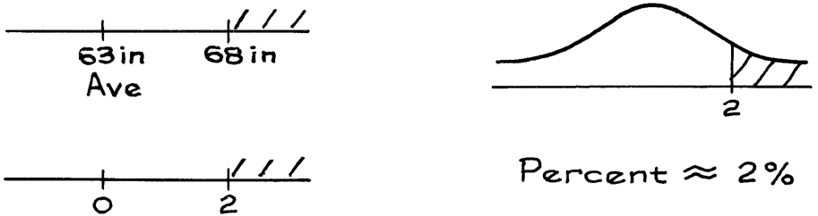

- (b) giá trị trung bình mới ≈ 63 _._ 9 inch, SD mới ≈ 2 _._ 4 inch 

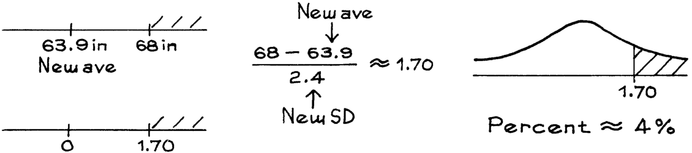

2. (a) 14% (b) 33% 

3. (a) 38% (b) 60% 

### **Chương 12. Đường hồi quy** 

Set A, trang 207 

1. (a) $2 _,_ 000 × 8 + $5 _,_ 000 = $21 _,_ 000 

   - (b) $2 _,_ 000 × 12 + $5 _,_ 000 = $29 _,_ 000 

   - (c) $2 _,_ 000 × 16 + $5 _,_ 000 = $37 _,_ 000 

A–66 ĐÁP ÁN BÀI TẬP _(trang 207–227)_ 

2. (a) 240 ounce = 15 pound (b) 20 ounce. 

   - (c) 3 ounce nitơ mang lại 18 lb 12 oz gạo, 4 ounce nitơ mang lại 20 pound gạo. 

   - (d) Có đối chứng (Controlled). 

   - (e) Có. Đường này khá phù hợp ( _r_ = 0 _._ 95), và 3 ounce gần với một giá trị đã được sử dụng. 

   - (f) Không. Nó quá xa so với các lượng đã được sử dụng. 

3. (a) Chiều cao dự đoán của con trai = 0 _._ 5 × chiều cao của cha + 35 inch. (b) Chiều cao dự đoán của cha = 0 _._ 5 × chiều cao của con trai + 33 _._ 5 inch. _Bình luận._ Có hai đường hồi quy, một đường dự đoán chiều cao của con trai từ chiều cao của cha, đường kia dự đoán chiều cao của cha từ chiều cao của con trai (phần 5 của chương 10). 

4. Lời khai này là nói quá. Các mối liên hệ trong dữ liệu có thể là do yếu tố gây nhiễu (confounding). Nếu không thực hiện thí nghiệm, hoặc không làm việc rất cẩn thận với dữ liệu quan sát, bạn không thể chắc chắn tác động của các can thiệp sẽ là gì. 

Set B, trang 210 

1. Với 12 năm đi học, chiều cao được dự đoán là 69.75 inch; với 16 năm, chiều cao được dự đoán là 70.75 inch. Việc học đại học rõ ràng không có tác động đến chiều cao. Nghiên cứu quan sát này đã ghi nhận một tương quan giữa chiều cao và quá trình học tập do một yếu tố thứ ba nào đó về nền tảng gia đình. 

2. 439.16 cm, 439.26 cm. Treo một quả nặng lớn hơn lên sợi dây làm nó giãn ra nhiều hơn. Bạn có thể tin tưởng đường hồi quy trong bài tập 2 vì nó dựa trên một thí nghiệm. Trong bài tập 1, đường hồi quy được khớp với dữ liệu từ một nghiên cứu quan sát. 

3. (a) 540 + 110 = 650 (b) 540 (c) Lớn hơn (trang 208). 

4. (a) 540 

- (b) 540 (c) Lớn hơn (trang 208). 

_Bình luận._ nếu bạn sử dụng giá trị trung bình của _y_ để dự đoán _y_ , sai số r.m.s. chính là SD của _y_ ; xem trang 183. 

5. Đường hồi quy tạo ra sai số r.m.s. nhỏ nhất (trang 208). 

## **Phần IV. Xác suất** 

### **Chương 13. Cơ hội là gì?** 

Set A, trang 225 

1. (a) (vi) (b) (iii) (c) (iv) (d) (i) (e) (ii) (f) (v) (g) (vi) 

2. Khoảng 500. 

3. Khoảng 1,000. 

4. Khoảng 14. 

5. Hộp (ii), bởi vì 3 trả nhiều hơn 2 , và tấm vé còn lại là giống nhau. 

Set B, trang 227 

1. (a) Câu hỏi này nói về tấm vé thứ hai, không phải tấm vé thứ nhất: xem phần (a) của ví dụ 2. Câu trả lời là 1 _/_ 4. 

ĐÁP ÁN BÀI TẬP _(trang 227–232)_ A–67 

   - (b) 1 _/_ 3; có 3 tấm vé còn lại sau khi tấm số 2 được rút. 

2. (a) 1 _/_ 4 (b) 1 _/_ 4 Với việc có hoàn lại, chiếc hộp vẫn như cũ. 

3. (a) 1 _/_ 2 (b) 1 _/_ 2 Các cơ hội cho lần tung đồng xu thứ 5 không phụ thuộc vào kết quả của 4 lần tung đầu tiên. 

4. (a) 1 _/_ 52 (b) 1 _/_ 48 Tương tự như ví dụ 2 ở trang 226. 

Set C, trang 229 

1. (a) 12 _/_ 51 (b) 13 _/_ 52 × 12 _/_ 51 = 1 _/_ 17 ≈ 6%. 

2. (a) 1 _/_ 6 (b) 1 _/_ 6 × 1 _/_ 6 × 1 _/_ 6 = 1 _/_ 216 ≈ 1 _/_ 2 của 1%. 

3. (a) 4 _/_ 52 (b) 4 _/_ 52 × 4 _/_ 51 × 4 _/_ 50 ≈ 5 _/_ 10 _,_ 000. _Bình luận._ Trong bài tập này, các lá bài là phụ thuộc; trong bài tập 2, các lần gieo xúc xắc là độc lập. 

4. "Ít nhất một quân Át" là lựa chọn tốt hơn: bạn sẽ chọn một bài kiểm tra mà bạn phải làm đúng ít nhất một câu trong số sáu câu, thay vì một bài kiểm tra mà bạn phải làm đúng cả sáu câu. 

5. Điều này là ổn, đó là quy tắc nhân. 

6. Đồng xu phải rơi vào mặt "sấp, ngửa"; cơ hội là 1 _/_ 4. 

7. (a) 1 _/_ 8 

   - (b) 1 − 1 _/_ 8 = 7 _/_ 8 

   - (c) 7 _/_ 8; bạn nhận được ít nhất một mặt sấp khi bạn không nhận được ba mặt ngửa: vì vậy (b) và (c) là giống nhau. 

   - (d) 7 _/_ 8; chỉ cần đổi chỗ mặt ngửa và mặt sấp trong (c). 

Set D, trang 232 

1. (a) độc lập: nếu bạn nhận được một vé trắng, có 1 cơ hội trong 3 để nhận "1" và 2 cơ hội trong 3 để nhận "2"; nếu bạn nhận được vé đen, cơ hội cho các con số vẫn giữ nguyên. 

   - (b) độc lập 

   - (c) phụ thuộc: với vé trắng, chỉ có 1 cơ hội trong 3 để nhận "2"; với vé đen, có 2 cơ hội trong 3. 

2. (a,b) độc lập (c) phụ thuộc 

   - _Bình luận._ Loại hộp này sẽ xuất hiện lại trong chương 27. Đây là lập luận cho (a). Giả sử bạn rút một vé, và thấy số đầu tiên là 4 nhưng không thấy số thứ hai: cơ hội để số thứ hai là 3 là 1 _/_ 2. Tương tự nếu số đầu tiên là 1. Đó chính là sự độc lập. 

3. Mười năm là 520 tuần, nên cơ hội là _(_ 999 _,_ 999 _/_ 1 _,_ 000 _,_ 000 _)_520 ≈ 0 _._ 9995. _Bình luận._ Trong Xổ số bang New York, cơ hội để bạn trúng một giải thưởng nào đó là khoảng 1 _/_ 12 _,_ 000 _,_ 000. 

4. Điều này là sai. Giống như nói ai đó không bị sốt vì bạn không thể tìm thấy nhiệt kế. Để tìm ra xem hai thứ có độc lập hay không, bạn giả vờ biết thứ thứ nhất đã diễn ra như thế nào, và sau đó xem liệu các cơ hội cho thứ thứ hai có thay đổi không. Sự nhấn mạnh nằm ở từ "giả vờ". 

A–68 ĐÁP ÁN BÀI TẬP _(trang 232–242)_ 

5. (a) 5% (b) 20% 

   - Để tính ra (a), giả sử bạn có 80 nam và 20 nữ trong lớp. Bạn cũng có 15 thẻ đánh dấu "sinh viên năm nhất" và 85 thẻ đánh dấu "sinh viên năm hai". Bạn muốn phát một thẻ cho mỗi sinh viên, sao cho càng ít nữ sinh viên nhận được thẻ "sinh viên năm hai" càng tốt. Chiến lược là đưa một thẻ sinh viên năm hai cho mỗi nam sinh viên; bạn còn lại 5 thẻ, phải đưa cho 5 nữ sinh viên. 15 thẻ sinh viên năm nhất sẽ thuộc về 15 nữ sinh viên còn lại. 

   - _Bình luận._ Nếu năm học và giới tính là độc lập, phần trăm nữ sinh viên năm hai sẽ là 85% của 20% = 17%, nằm giữa hai cực trị. 

6. Giống như bài tập trước: cơ hội có được một nữ sinh viên năm hai bằng phần trăm nữ sinh viên năm hai trong lớp. 

7. Sai. Việc tính toán giả định rằng tỷ lệ phụ nữ là như nhau ở mọi nhóm tuổi, và thực tế không phải vậy: phụ nữ sống thọ hơn nam giới. (Thực tế, phụ nữ từ 85 tuổi trở lên chiếm gần 1,1% dân số Mỹ vào năm 2002.) 

8. Nếu đối tượng rút quân Át bích từ cọc nhỏ, anh ta có 13 cơ hội trong 52 để rút một quân bích từ bộ bài lớn, và giành giải thưởng. Tương tự nếu anh ta rút quân Hai nhép. Hoặc bất kỳ lá bài nào khác. Vì vậy câu trả lời là 13 _/_ 52 = 1 _/_ 4. 

### **Chương 14. Thêm về Cơ hội** 

Set A, trang 240 

1. 

   - . Cơ hội là 4 _/_ 36. 

2. Có 25 kết quả có thể xảy ra; đối với 5 trong số chúng, tổng là 6. Vì vậy cơ hội là 5 _/_ 25. (Hình ảnh không được hiển thị.) 

3. Thường xuyên nhất, 7; ít thường xuyên nhất, 2, 12. (Sử dụng hình 1 để có được cơ hội cho mỗi tổng, như trong bài tập 1.) 

4. (a) 2 _/_ 4 (b) 2 _/_ 6 (c) 3 _/_ 6 

Set B, trang 242 

1. Sai. Câu hỏi là về số trẻ em đã ăn bánh quy hoặc kem, bao gồm cả những đứa háu ăn đã ăn cả hai. Con số này phụ thuộc vào những lựa chọn của bọn trẻ, và hai khả năng được chỉ ra trong bảng. 

|_Chỉ bánh quy_|_Chỉ kem_|_Cả hai_|_Không ăn gì_|
|---|---|---|---|
|12|17|0|21|
|3|8|9|30|

Trong trường hợp đầu tiên, 12 đứa trẻ chỉ ăn bánh quy, 17 đứa trẻ chỉ ăn kem, 0 đứa trẻ ăn cả hai, và 21 đứa trẻ không ăn gì. Do đó 12 + 17 = 29 đứa trẻ đã ăn bánh quy hoặc kem. Dòng thứ hai cho thấy một khả năng khác, khi 9 đứa trẻ ăn cả bánh quy và kem. Trong tình huống này, số lượng trẻ ăn bánh quy hoặc kem là 3 + 8 + 9 = 20. Chỉ để kiểm tra: số lượng trẻ ăn bánh quy là 3 + 9 = 12, và số lượng trẻ ăn kem là 8 + 9 = 17, đúng như đã cho trong bài toán. Nhưng số lượng trẻ ăn bánh quy hoặc kem không phải là 12 + 17, vì phép cộng đếm gấp đôi 9 đứa trẻ tham ăn. Số lượng người ăn bánh quy hoặc kem phụ thuộc vào số lượng người tham ăn đã ăn cả hai. 

ĐÁP ÁN CHO CÁC BÀI TẬP _(trang 243–247)_ A–69 

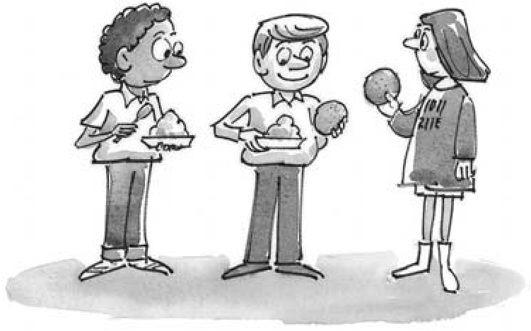

2. (a) 4 _/_ 20 (b) 8 _/_ 20 (c) 12 _/_ 20 (d) 14 _/_ 20 _Nhận xét. (_ 4 + 8 + 12 _)/_ 20 đưa ra câu trả lời sai cho (d)—bằng cách đếm gấp đôi một số dấu chấm và đếm gấp ba một số khác. 

3. Chúng giống nhau. 

4. Sai. Việc đơn giản là cộng hai cơ hội lại sẽ đếm gấp đôi cơ hội của . Xem ví dụ 5 ở trang 242. 

5. Sai. Có 1 cơ hội trong 10 để nhận được 7 trong bất kỳ lần rút cụ thể nào, nhưng các biến cố (events) này không loại trừ lẫn nhau (mutually exclusive). 

6. Đúng. 100% − _(_ 10% + 20% _)_ = 70%. Sử dụng quy tắc cộng, và trang 223 cho phép trừ. 

### Tập C, trang 246 

1. (a) 1 _/_ 52 số thí sinh bước lên phía trước. 

   - (b) 1 _/_ 52 số thí sinh bước lên phía trước; ví dụ 2 trong chương 13. 

   - (c) Những người nhận được cả quân át cơ (ace of hearts) ở lá bài đầu tiên và quân K cơ (king of hearts) ở lá bài thứ hai bước lên phía trước hai lần. (Xét về việc có được kỳ nghỉ cuối tuần, điều đó là quá mức cần thiết.) Tỷ lệ những người bước lên phía trước hai lần là 1 _/_ 52 × 1 _/_ 51. 

   - (d) Sai; như (c) cho thấy, các biến cố không loại trừ lẫn nhau, nên phép cộng đếm gấp đôi cơ hội cả hai cùng xảy ra. 

   - _Nhận xét._ Cơ hội trong (d) là 

1 _/_ 52 + 1 _/_ 52 − 1 _/_ 52 × 1 _/_ 51 _._ 

2. (a) 1 _/_ 52 số thí sinh bước lên phía trước. 

   - (b) 1 _/_ 52 số thí sinh bước lên phía trước. 

   - (c) Nếu bạn nhận được quân át cơ ở lá bài đầu tiên, bạn không thể nhận nó ở lá bài thứ hai; không ai bước lên phía trước hai lần. 

   - (d) Đúng; như (c) cho thấy, các biến cố loại trừ lẫn nhau, nên phép cộng là hợp lệ. 

   - _Nhận xét._ Trong bài tập 2, hai cách để chiến thắng loại trừ lẫn nhau; trong bài tập 1 thì không như vậy. Phép cộng là hợp lệ trong bài tập 2, không phải trong bài tập 1. 

3. (a,b) Đúng; xem ví dụ 2 trong chương 13. 

   - (c) Sai. "Lá bài trên cùng là quân J nhép (jack of clubs)" và "Lá bài dưới cùng là quân J rô (jack of diamonds)" không loại trừ lẫn nhau, vì vậy bạn không thể cộng các cơ hội. 

   - (d) Đúng. "Lá bài trên cùng là quân J nhép" và "Lá bài dưới cùng là quân J nhép" loại trừ lẫn nhau. 

   - (e,f) Sai; các biến cố này không độc lập (independent), bạn cần các cơ hội có điều kiện (conditional chances). 

A–70 ĐÁP ÁN CHO CÁC BÀI TẬP _(trang 247–258)_ 

4. (a) Sai; 1 _/_ 2 × 1 _/_ 3 = 1 _/_ 6, nhưng A và B có thể phụ thuộc (dependent): bạn cần cơ hội có điều kiện của B cho trước A. 

   - (b) Đúng; xem phần 4 của chương 13. 

   - (c) Sai. ("Loại trừ lẫn nhau" ngụ ý sự phụ thuộc, và cơ hội thực tế là 0.) 

   - (d) Sai; 1 _/_ 2 + 1 _/_ 3 = 5 _/_ 6, nhưng bạn không thể cộng các cơ hội vì A và B có thể không loại trừ lẫn nhau. 

   - (e) Sai; nếu chúng độc lập, chúng có một số cơ hội xảy ra cùng nhau, vì vậy chúng không thể loại trừ lẫn nhau: đừng cộng các cơ hội. 

   - (f) Đúng. 

_Nhận xét._ Nếu bạn gặp khó khăn với các bài tập 3 và 4, hãy xem ví dụ 6, trang 244. 

5. Xem ví dụ 2 trong chương 13. 

   - (a) 4 _/_ 52 (b) 4 _/_ 51 (c) 4 _/_ 52 × 4 _/_ 51 

Tập D, trang 250 

1. (a) (i) (b) (i) (ii) (c) (iii) (d) (ii) (iii) (e) (i) (ii) (f) (i) 

2. Các cược (a) và (f) nói cùng một điều bằng ngôn ngữ khác nhau. Tương tự đối với (b) và (e). Cược (d) tốt hơn (c). 

3. (a) 3 _/_ 4 (b) 3 _/_ 4 (c) 9 _/_ 16 (d) 9 _/_ 16 (e) 1 − 9 _/_ 16 = 7 _/_ 16 

4. (a) Cơ hội không có quân át nào = _(_ 5 _/_ 6 _)_3 ≈ 58%, vì vậy cơ hội có ít nhất một quân át ≈ 42%. Giống như de M´er´e, với 3 lần tung thay vì 4. 

(b) 67% (c) 89% 

5. 1 − _(_ 35 _/_ 36 _)_36 ≈ 64% 

6. Cơ hội để điểm 17 không xuất hiện trong 22 lần tung là _(_ 31 _/_ 32 _)_22 ≈ 49 _._ 7%. Do đó, cơ hội để nó xuất hiện trong 22 lần tung là 100% − 49 _._ 7% = 50 _._ 3%. Vì vậy, vụ cá cược này (đặt cược với tỷ lệ ăn chia đều) cũng có lợi cho Quản trị viên của trò chơi. Thật tội nghiệp cho những người phiêu lưu. 

7. Cơ hội sống sót qua 50 nhiệm vụ là _(_ 0 _._ 98 _)_50 ≈ 36%. Deighton đang cộng các cơ hội cho các biến cố không loại trừ lẫn nhau. 

### **Chương 15.** 

Tập A, trang 258 

1. Con số là 4. 

2. Con số là 6. 

3. (a) _(_ 5 _/_ 6 _)_4 = 625 _/_ 1 _,_ 296 ≈ 48% 

   - (b) 4 _(_ 1 _/_ 6 _)(_ 5 _/_ 6 _)_3 = 500 _/_ 1 _,_ 296 ≈ 39% 

   - (c) 6 _(_ 1 _/_ 6 _)_2 _(_ 5 _/_ 6 _)_2 = 150 _/_ 1 _,_ 296 ≈ 12% 

   - (d) 4 _(_ 1 _/_ 6 _)_3 _(_ 5 _/_ 6 _)_ = 20 _/_ 1 _,_ 296 ≈ 1 _._ 5% 

   - (e) _(_ 1 _/_ 6 _)_4 = 1 _/_ 1 _,_ 296 ≈ 0 _._ 08 của 1% 

   - (f) Quy tắc cộng: _(_ 150 + 20 + 1 _)/_ 1 _,_ 296 ≈ 13%. 

4. Điều này giống với bài tập 3(a–c). Việc tung được một quân át giống như việc rút được một viên bi màu đỏ, trong khi các số từ 2 đến 6 tương ứng với màu xanh lá cây. Để hiểu lý do tại sao, hãy tưởng tượng hai người, A và B, đang thực hiện các thí nghiệm may rủi khác nhau: 

ĐÁP ÁN CHO CÁC BÀI TẬP _(trang 258–277)_ 

A–71 

- A tung một con xúc xắc bốn lần và đếm số lượng quân át. 

- B rút bốn lần ngẫu nhiên có hoàn lại (with replacement) từ một hộp có chứa R G G G G G và đếm số lượng chữ R. 

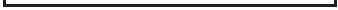

Các thiết bị là khác nhau, nhưng xét về cơ hội nhận được bất kỳ số lượng bi đỏ cụ thể nào, hai thí nghiệm này là tương đương nhau. 

- Có bốn lần tung, cũng giống như có bốn lần rút. 

- Các lần tung là độc lập; các lần rút cũng vậy. 

- Mỗi lần tung có 1 cơ hội trong 6 để đóng góp một cho tổng số (át); tương tự cho mỗi lần rút (đỏ). 

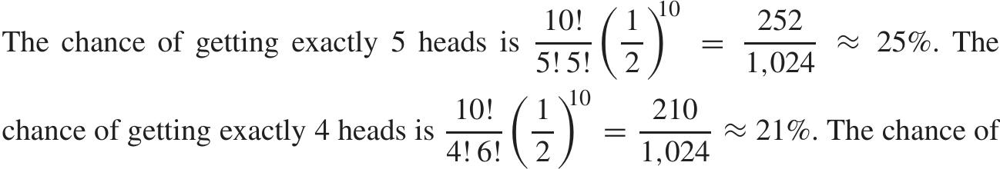

5. Cơ hội để có được chính xác 5 mặt ngửa là10! 

nhận được chính xác 6 mặt ngửa là giống nhau. Theo quy tắc cộng, cơ hội để nhận được từ 4 đến 6 mặt ngửa là 672 _/_ 1 _,_ 024 ≈ 66%. 

6. Bạn cần cơ hội để nhận được 7, 8, 9 hoặc 10 mặt ngửa khi một đồng xu được tung 10 lần. Sử dụng công thức nhị thức, và quy tắc cộng: 

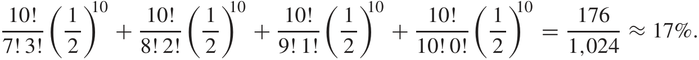

_Nhận xét._ Có vẻ như là may rủi, không phải vitamin. 

## **Phần V. Tính Biến Thiên Do May Rủi (Chance Variability)** 

### **Chương 16. Quy Luật Số Lớn (The Law of Averages)** 

Tập A, trang 277 

1. Sai số (error) là 50 ở dạng tuyệt đối, 5% ở dạng tỷ lệ phần trăm. 

2. Sai số là 1.000 ở dạng tuyệt đối, 1 _/_ 10 của 1% ở dạng tỷ lệ phần trăm. Hãy so sánh điều này với bài tập trước: sai số do may rủi (chance error) đã tăng lên ở dạng tuyệt đối (từ 50 lên 1.000) nhưng giảm xuống ở dạng tỷ lệ phần trăm (từ 5% xuống 1 _/_ 10 của 1%). 

3. Sai. Cơ hội vẫn ở mức 50%. Xem trang 274. 

4. (a) Mười lần tung. Khi số lần tung tăng lên, bạn càng có nhiều khả năng đạt gần 50% mặt ngửa, càng ít có khả năng đạt trên 60% mặt ngửa. Ở đây, tính biến thiên do may rủi trong các tỷ lệ phần trăm giúp bạn, một số lượng ít các lần tung sẽ tốt hơn một số lượng lớn. 

   - (b) Một trăm lần tung: bây giờ tính biến thiên do may rủi trong các tỷ lệ phần trăm gây tổn hại cho bạn— bởi vì bạn muốn đạt gần 50%. Với nhiều lần tung hơn, tính biến thiên do may rủi trong tỷ lệ phần trăm sẽ ít hơn. Nhiều lần tung hơn thì tốt hơn. 

   - (c) Một trăm lần tung; giống như (b). 

   - (d) Mười lần tung. Khi số lần tung tăng lên, sẽ ngày càng ít cơ hội để số mặt ngửa đúng bằng số lượng kỳ vọng (expected number). Hãy lấy một trường hợp cực đoan hơn: giả sử bạn tung đồng xu 1.000.000 lần. Cơ hội để nhận được chính xác 500.000 mặt ngửa—thay vì 500.001 hoặc 500.043 hoặc 499.997 hoặc một số lượng nào khác gần 500.000—là khá mong manh. 

A–72 ĐÁP ÁN CHO CÁC BÀI TẬP _(trang 277–290)_ 

5. Tùy chọn (i) tốt hơn. Điều này giống như bài tập 4(a). 

6. Tùy chọn (ii), lý do là sai số do may rủi. 

7. Khoảng như nhau khi có hoặc không có hoàn lại. 

8. Giống nhau. Cả hai đều có 50% là −1 và 50% là +1. 

9. Cuối cùng, sai số ngẫu nhiên sẽ trở nên lớn và mang dấu âm. Sau đó, nó sẽ mang dấu dương trở lại. Về giá trị tuyệt đối, các dao động ngày càng trở nên dữ dội hơn. 

Set B, trang 280 

1. 47 × 1 + 53 × 2 = 153. 

2. (a) 100, 200 (b) 50, 50 (c) 50 × 1 + 50 × 2 = 150. 

3. (a) 100, 900. 

   - (b) 33 × 1 + 33 × 2 + 33 × 9 ≈ 400. 

_Bình luận._ 400 không nằm giữa 100 và 900. 

4. Đoán 500 trong cả ba trường hợp; (iii) là tốt nhất, (i) là tệ nhất. 

5. Cơ hội cho "1" là 1 trong 10; cơ hội cho "3 hoặc ít hơn" là 3 trong 10; cơ hội cho "4 hoặc nhiều hơn" là 7 trong 10—có 7 số từ 4 đến 10 bao gồm cả hai đầu mút. Việc rút ngẫu nhiên từ các hộp được thảo luận trong các chương 13–14. 

6. Hộp (i) tốt hơn, nó có ít −1 hơn, và cùng số lượng số 2. 

7. Tùy chọn (i) và (ii) làm được. Lợi nhuận ròng của bạn là tổng số tiền thắng và thua, có tính đến các dấu. 

Set C, trang 284 

1. (i) và (ii) là giống nhau. (iii) có nghĩa là tất cả mười lần rút đều phải là "1," điều này tệ hơn (i). 

2. Tùy chọn (i) không tốt; tổng các lần rút không liên quan đến lợi nhuận ròng. Tùy chọn (ii) không tốt; nó nói rằng bạn thắng $17 với 2 cơ hội trong 36 trong một lần chơi duy nhất, nhưng cơ hội của bạn là 2 trong 38. Tùy chọn (iii) là đúng. Nếu nghi ngờ, hãy xem lại ví dụ 1 ở trang 283. 

3. Lợi nhuận ròng của bạn giống như tổng của 10 lần rút được thực hiện ngẫu nhiên có hoàn lại từ hộp 

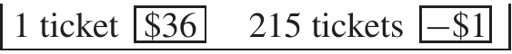

Đây là một trò chơi tồi tệ. 

### **Chương 17. Giá trị kỳ vọng và Sai số chuẩn** 

Set A, trang 290 

1. (a) 100 × 2 = 200 (b) −25 (c) 0 (d) 662 3 _Bình luận về (d)._ "Giá trị kỳ vọng" không nhất thiết phải là một trong các giá trị có thể xảy ra. Nó giống như nói rằng gia đình trung bình có 2,1 đứa trẻ. Điều này có ý nghĩa, mặc dù "gia đình trung bình" là một sự hư cấu thống kê. 

2. Điều này giống như giá trị kỳ vọng cho tổng của hai lần rút từ hộp 1 2 3 4 5 6 . Vì vậy câu trả lời là 2 × 3 _._ 5 = 7 ô vuông. 

ĐÁP ÁN BÀI TẬP _(các trang 290–294)_ A–73 

3. Mô hình được cho ở các trang 283–284. Trung bình của các số trong hộp là _(_ $35 − $37 _)/_ 38 = −$2 _/_ 38 ≈−$0 _._ 05 

(Để tính trung bình, bạn phải cộng các vé trong hộp lại; +$35 thêm $35 vào tổng, nhưng 37 vé −$1 trừ đi $37; sau đó bạn phải chia cho số lượng vé trong hộp, là 38.) Lợi nhuận ròng kỳ vọng bằng 100 × _(_ −$ _._ 05 _)_ = −$5. Bạn có thể kỳ vọng mất khoảng $5. 

4. Hộp nằm ở trang 283. Trung bình của hộp là 

_(_ $18 − $20 _)/_ 38 = −$2 _/_ 38 ≈−$0 _._ 05 

(Trung bình là tổng các số trong hộp, chia cho 38; 18 vé được đánh dấu "+$1" đóng góp $18 vào tổng, trong khi 20 vé được đánh dấu "−$1" trừ đi $20.) Lợi nhuận ròng kỳ vọng là 100 × _(_ −$0 _._ 05 _)_ = −$5. 

_Bình luận._ Bài tập 3 và 4 cho thấy với bất kỳ cược nào (số hoặc đỏ-đen), bạn có thể kỳ vọng mất 1 _/_ 19 số tiền cược của mình trong mỗi lần chơi. 

5. −$50. Bài học: bạn càng chơi nhiều, bạn càng thua nhiều. 

6. Trung bình của hộp là _(_ 18 _x_ − $20 _)/_ 38. Để công bằng, điều này phải bằng 0. Phương trình là 18 _x_ − $20 = 0. Vì vậy _x_ ≈ $1 _._ 11. Họ nên trả cho bạn $1.11. 

7. Người làm chủ Quả bóng (Master of the Ball) đáng lẽ phải trả 31 bảng, đúng như các Nhà thám hiểm (Adventurers) nghĩ. Bài học: các Nhà thám hiểm có thể có được niềm vui, nhưng người làm chủ Quả bóng mới là người có được lợi nhuận. 

Set B, trang 293 

1. (a) Trung bình của hộp là 4; độ lệch chuẩn (SD) là 2. Vì vậy giá trị kỳ vọng cho tổng là 100 × 4 = 400; sai số chuẩn (SE) cho tổng là √100 × 2 = 20. 

(b) Khoảng 400, xê dịch khoảng 20 hoặc cỡ đó. 

   - (c) Đoán là 400, chênh lệch khoảng 20 hoặc cỡ đó. Các phần (b) và (c) diễn giải các con số ở (a). 

2. Lợi nhuận ròng giống như tổng của 100 lần rút từ hộp −$1 $1 . Trung bình của hộp là $0; SD là $1. Tổng của 100 lần rút có giá trị kỳ vọng là $0; SE cho tổng là √100 × $1 = $10. Vì vậy lợi nhuận ròng của bạn sẽ ở khoảng $0, xê dịch khoảng $10 hoặc cỡ đó. 

3. Với tùy chọn (ii), các con số quá gần với 50; không có số nào cách xa hơn 5. Với tùy chọn (iii), các con số luân phiên nhau quá đều đặn. Tùy chọn (i) là đáp án đúng. 

4. Giá trị kỳ vọng là 150, giá trị quan sát được là 157, sai số ngẫu nhiên là 7, sai số chuẩn là 10. 

5. Nhân số lần rút với 4 sẽ nhân giá trị kỳ vọng lên 4 và SE lên √4 = 2. Giá trị kỳ vọng cho tổng của 100 lần rút là 4 × 50 = 200, và SE là 2 × 10 = 20. 

6. (a) đúng, (b) sai: giá trị kỳ vọng cho tổng các lần rút có thể được tính chính xác bằng 

#### số lần rút × trung bình của hộp 

(c) sai, (d) đúng: tổng sẽ chênh lệch so với giá trị kỳ vọng của nó, và SE cho bạn biết nó lệch khoảng bao nhiêu. 

7. Có. Cơ hội là nhỏ, nhưng dương. Nếu bạn chờ đủ lâu, các sự kiện có xác suất nhỏ sẽ xảy ra. 

A–74 ĐÁP ÁN BÀI TẬP _(các trang 296–299)_ 

Set C, trang 296 

1. (a) Nhỏ nhất, 100; lớn nhất, 400. 

   - (b) Trung bình của hộp là 2; SD là 1. Tổng có giá trị kỳ vọng là 100 × 2 = 200; SE cho tổng là √100 × 1 = 10. Tổng sẽ ở khoảng 200, xê dịch khoảng 10 hoặc cỡ đó. 

(c) 

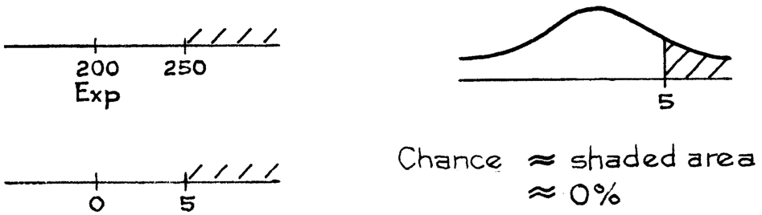

2. (a) Lớn nhất, 900; nhỏ nhất, 100. (b) Cơ hội ≈ 68% 

3. (a) Giá trị kỳ vọng là 0, vì vậy tổng sẽ ở khoảng 0, và hy vọng tốt nhất của bạn là sự biến thiên ngẫu nhiên (chance variability) trong tổng—bạn muốn tổng cách xa giá trị kỳ vọng của nó. Sự biến thiên ngẫu nhiên tăng lên theo số lần rút, chọn 100. 

(b) Giống như (a). 

   - (c) Bây giờ sự biến thiên ngẫu nhiên trong tổng chống lại bạn, vì bạn muốn tổng gần với giá trị kỳ vọng của nó; chọn 10. 

4. (i) Giá trị kỳ vọng cho tổng = 500, SE cho tổng = 30. (ii) Giá trị kỳ vọng cho tổng = 500, SE cho tổng = 20. Cả hai tổng sẽ ở khoảng 500, nhưng tổng (i) sẽ xa hơn. Ở (a) và (b), sự biến thiên ngẫu nhiên giúp ích—chọn (i). Ở (c), sự biến thiên ngẫu nhiên gây hại—chọn (ii). 

5. 98%. 

6. Hoặc là họ thắng $25.000 (với cơ hội 20 _/_ 38 ≈ 53% _)_ hoặc họ thua $25.000 (với cơ hội 18 _/_ 38 ≈ 47% _)_ . Câu trả lời là 50%. 

   - _Bình luận._ Sòng bạc hài lòng hơn nhiều với nhiều cược nhỏ, nơi lợi nhuận gần như được đảm bảo, so với một cược lớn, nơi có nhiều rủi ro. 

7. Một số sẽ trả lại $35.000, nhưng 37 số khác sẽ thua, vì vậy người chơi bạc chắc chắn thua $2.000. 

   - _Bình luận._ Sòng bạc thích những người chơi bạc phân tán các khoản cược của họ. 

8. Tùy chọn (ii) đúng; SE không tăng theo toàn bộ hệ số 2, mà chỉ là √2 ≈ 1 _._ 4. 

Set D, trang 299 

1. (a) Không, thay số 5 bằng 7 − _(_ −2 _)_ = 9. (b) Có. (c) Có. (d) Không—danh sách hiển thị 3 con số khác nhau, vì vậy cách làm nhanh không áp dụng. 

2. Lợi nhuận ròng giống như tổng của 100 lần rút từ hộp 

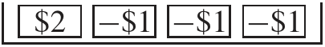

Trung bình của hộp là ($2 − $1 − $1 − $1 _)/_ 4 = −$0 _._ 25. SD là 

[$2 − _(_ −$1 _)_ ] × 1 _/_ 4 × 3 _/_ 4 ≈ $1 _._ 30 _._ 

Lợi nhuận ròng trong 100 lần chơi sẽ ở khoảng 100 × _(_ −$0 _._ 25 _)_ = −$25, xê dịch khoảng √100 × $1 _._ 30 = $13 hoặc cỡ đó. 

3. (a) Từ quan điểm của nhà cái, một đô la cược vào cửa đặc biệt của nhà cái (house special) giống như một lần rút từ hộp 

ĐÁP ÁN BÀI TẬP _(các trang 299–304)_ A–75 

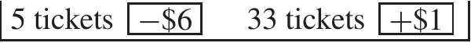

Trung bình của hộp là [5 × _(_ −$6 _)_ + 33 × $1 _)_ ] _/_ 38 ≈ $ _._ 08. Vì vậy nhà cái kỳ vọng kiếm được khoảng 8 xu trên mỗi đô la cược. Đối với nhà cái, đây là một cược tuyệt vời. 

- (b) Lợi nhuận ròng của người chơi giống như tổng của 100 lần rút ngẫu nhiên có hoàn lại từ cùng một hộp với các dấu bị đảo ngược: 

5 vé +$6 33 vé −$1 

Trung bình của hộp là −$ _._ 08; SD là 

[$6 − _(_ −$1 _)_ ] × 5 _/_ 38 × 33 _/_ 38 ≈ $2 _._ 37 _._ Lợi nhuận ròng kỳ vọng của người chơi trong 100 lần chơi là −$8, xê dịch khoảng $24 hoặc cỡ đó. 

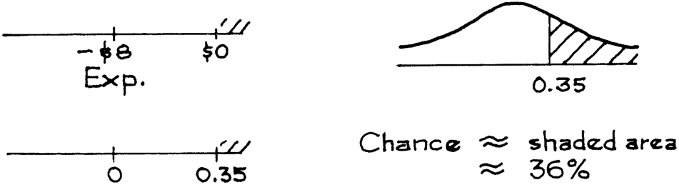

4. Lợi nhuận ròng kỳ vọng trong 100 cược một đô la vào một phần (section) là −$5; SE là $14. Lợi nhuận ròng kỳ vọng trong 100 cược vào màu đỏ là −$5; SE là $10. Tùy chọn (i) và (ii) có cùng lợi nhuận ròng kỳ vọng. Nhưng (i) có SE lớn hơn, nghĩa là tính biến thiên nhiều hơn: (a) sai, (b) và (c) đúng. 

Set E, trang 303 

1. (a) Bạn không thể cộng các từ, vì vậy hộp (i) bị loại. Với hộp (iii), bạn nhận được 2 cơ hội trong 3 để đi lên mỗi lần, và nó chỉ nên là 1 trong 2. Hộp (ii) là đáp án đúng. 

   - (b) Trung bình của hộp = 0 _._ 5 và SD của hộp cũng = 0 _._ 5. Tổng của 16 lần rút có giá trị kỳ vọng là 16 × 0 _._ 5 = 8; SE là √16 × 0 _._ 5 = 2. Số mặt ngửa (heads) sẽ ở khoảng 8, xê dịch khoảng 2 hoặc cỡ đó. 

2. Hộp mới: 0 0 0 0 1 . Nó là ±3 SE, cơ hội là khoảng 99.7%. 

3. Hộp mới: 0 1 . Nó là 1 SE hoặc lớn hơn, cơ hội là khoảng 16%. 

|4. _Nhóm của_|_Giá trị_|_Giá trị_|_Sai số_|_Sai số_|
|---|---|---|---|---|
|_100 lần tung_|_quan sát_|_kỳ vọng_|_ngẫu nhiên_|_chuẩn_|
|1–100|44|50|−6|5|
|101–200|54|50|+4|5|
|201–300|48|50|−2|5|
|301–400|53|50|+3|5|

5. Kỳ vọng khoảng 68—ví dụ 5 ở trang 301; thực tế, bạn thấy 69. 

6. (a,b) Khoảng 99.7%—nó là 3 SE. 

   - _Bình luận._ Khi số lần tung tăng từ 10.000 lên 1.000.000, tỷ lệ mặt ngửa tiến gần hơn đến 50%: khoảng 99,7% thu hẹp từ 

50% ± 1.5% thành 50% ± 0.15%. 

7. Kỳ vọng là 30, quan sát được là 33, sai số ngẫu nhiên (chance error) là 3, SE khoảng 3,5. 

8. 

9. Không sao cả. Số lượng quân Át (aces) không bắt buộc phải chính xác là 16,67, nó chỉ được kỳ vọng là xoay quanh 16,67. 

A–76 ĐÁP ÁN BÀI TẬP _(các trang 312–319)_ 

### **Chương 18. Xấp xỉ Chuẩn cho Biểu đồ Tần suất Xác suất (Probability Histograms)** 

Tập A, trang 312 

1. Từ 70 đến 80 (bao gồm cả hai đầu mút). 

2. (a) Giữa 6,5 và 10,5. 

   - (b) Giữa 6,5 và 7,5—các cạnh trái và phải của hình chữ nhật nằm trên số 7. 

3. (a) 7 

   - (b) 7: thanh cao nhất trong biểu đồ thứ 2. 

   - (c) Không, đây chỉ là biến thiên ngẫu nhiên (chance variation). Thực tế 4 ít có khả năng xảy ra hơn 5, như biểu đồ tần suất xác suất ở biểu đồ dưới cùng cho thấy. 

   - (d) (iii). Biểu đồ trên cùng là biểu đồ tần suất thực nghiệm (empirical histogram)—nó hiển thị các tỷ lệ quan sát được, không phải các cơ hội (chances). 

4. (a) 3, 6 

   - (b) Biểu đồ dưới cùng—biểu đồ tần suất xác suất cho thấy các cơ hội. Các giá trị 2 và 3 có khả năng bằng nhau đối với tích số. 

   - (c) Nhìn vào biểu đồ thứ hai: 3 xuất hiện thường xuyên hơn. Lại là biến thiên ngẫu nhiên. 

   - (d) Giá trị 14 là bất khả thi đối với tích số. Lý do: chỉ có hai cách để phân tích số 14, là 1 × 14 hoặc 2 × 7; không có viên xúc xắc nào có thể hiện ra 7 hoặc 14. 

   - (e) Biểu đồ dưới cùng là biểu đồ tần suất xác suất, do đó các diện tích bên dưới nó đại diện cho các cơ hội: 11,1% là cơ hội để đạt được tích là 6 khi bạn tung một cặp xúc xắc. 

5. A đi với (i) và B đi với (ii). B thấp hơn, trải rộng hơn, và nằm xa hơn về phía bên phải. Hộp (ii) có trung bình lớn hơn và SD (Độ lệch chuẩn) lớn hơn. 

6. Sai. Biểu đồ tần suất xác suất cho tổng số cho bạn biết các cơ hội của tổng số. Nó không cho bạn biết các lần rút thăm đã diễn ra như thế nào. Vùng được tô bóng đại diện cho cơ hội mà tổng số sẽ nằm trong phạm vi từ 5 đến 10 (bao gồm cả hai đầu). (Hộp có 85 thẻ đánh số 0, 2 thẻ đánh số 1, và 13 thẻ đánh số 2.) 

Tập B, trang 318 

1. (i) Chính xác 6 mặt ngửa. (ii) 3 đến 7 mặt ngửa (không bao gồm 2 đầu). (iii) 3 đến 7 mặt ngửa (bao gồm cả 2 đầu). 

2. Diện tích từ 51,5 đến 52,5 dưới biểu đồ tần suất cho cơ hội chính xác. Đường cong chuẩn chỉ là một phép xấp xỉ (nhưng là một xấp xỉ rất tốt). 

3. Số mặt ngửa kỳ vọng là 50; SE là 5. Bạn cần tính diện tích của hình chữ nhật phía trên số 60 trong hình 3, trang 315. 

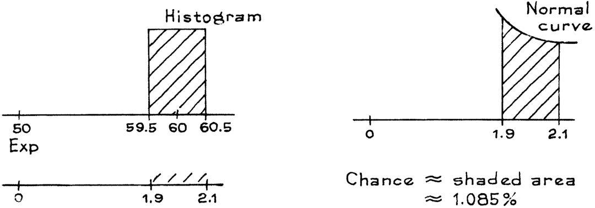

_Bình luận._ Cơ hội chính xác là 1,084%. 

ĐÁP ÁN BÀI TẬP _(các trang 319–324)_ A–77 

4. Từ bài tập 3, khoảng một phần trăm các nhóm nên có 60 mặt ngửa. Thực tế, chính xác là có một nhóm trong số một trăm nhóm có kết quả đó (#6.901–7.000). 

5. Số mặt ngửa kỳ vọng là 5.000; SE là 50. 

   - (a) 

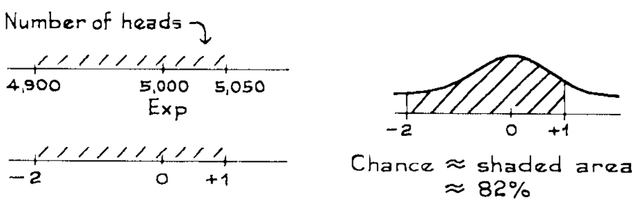

- (b) cơ hội ≈ 2% 

   - (c) cơ hội ≈ 16%. 

6. (a) Có. Các khối thì lớn. (b) Không. Các khối nhỏ. _Bình luận về (a)._ Việc theo dõi các cạnh làm thay đổi ước lượng từ 50% thành 54%. 

Tập C, trang 324 

1. (a) 

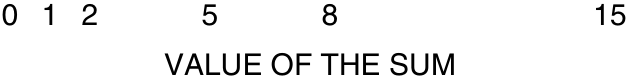

   - (b) 3 có khả năng xảy ra nhiều hơn 8: khối phía trên số 3 lớn hơn. 

2. Số mặt ngửa trong 400 lần tung của đồng xu bị lệch này giống như tổng của 400 lần rút từ hộp có 9 số `0` và 1 số `1`. Số mặt ngửa kỳ vọng là 40, và SE là 6. Bạn cần tìm diện tích của hình chữ nhật nằm trên số 40, ở dưới cùng của hình 6 trên trang 320. 

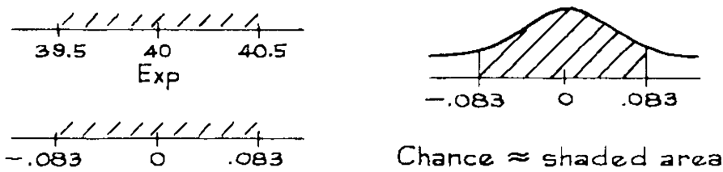

Từ bảng, diện tích này nằm trong khoảng 4% đến 8%. (Thực tế, diện tích là 6,6%, và cơ hội cũng vậy.) 

3. Đường cong chuẩn thấp hơn biểu đồ tần suất xung quanh giá trị 1, do đó ước lượng sẽ quá thấp. 

4. Có. Các khối lớn. 

5. A (ii), B (i), C (iii). Hộp càng lệch (lopsided), biểu đồ tần suất càng lệch (skewed). _Bình luận._ Với 25 lần rút từ hộp 24 số `0` và 1 số `1`, bạn không thể hy vọng nhận được nhiều số `1`. Hình chữ nhật ngoài cùng bên trái trong biểu đồ tần suất xác suất cho cơ hội tổng số sẽ bằng không—tất cả các lần rút đều là `0`. Cơ hội này là 36%. Hình chữ nhật tiếp theo cho cơ hội tổng số sẽ là một—một số `1` trong số các lần rút, và 24 số `0`. Cơ hội này là 38%. Và cứ tiếp tục như vậy. (Có thể tính các cơ hội này bằng công thức nhị thức, chương 15.) 

A–78 ĐÁP ÁN BÀI TẬP _(các trang 325–349)_ 

6. (i) 100 (ii) 400 (iii) 900 

Các biểu đồ tần suất tiến gần đến đường cong chuẩn hơn khi số lần rút tăng lên. 

7. Chọn (i). 

   - _Bình luận._ Các cơ hội được cho bởi diện tích bên dưới các biểu đồ tần suất xác suất. Thông thường, diện tích tương ứng dưới đường cong chuẩn là một xấp xỉ tốt, nhưng không phải ở đây— đường cong cao hơn nhiều so với biểu đồ tần suất, do đó diện tích dưới đường cong lớn hơn nhiều so với diện tích dưới biểu đồ tần suất. 

8. Nhiều khả năng nhất, 105; ít khả năng nhất, 101; giá trị kỳ vọng (expected value), 100. 

   - _Bình luận._ Có một đáy (trough) trong biểu đồ tần suất này ở gần giá trị kỳ vọng. (Với 100 lần rút, đáy đã biến mất.) 

9. (a) Nhỏ hơn nhiều so với 50%. Giá trị 276.000 là 0,276 triệu, nằm khoảng giữa 0,2 và 0,4 trên trục hoành. Diện tích bên phải điểm này nhỏ hơn nhiều so với 50%. (Biểu đồ tần suất này có đuôi bên phải rất dài, và giá trị kỳ vọng lớn hơn rất nhiều so với trung vị.) 

   - (b) 1.000.000 / 100 = 10.000 

   - (c) 400.000 đến 410.000 có khả năng xảy ra cao hơn rất nhiều, theo cách nói tương đối. Khối nằm ngay bên phải của 400.000 cao hơn tương đối nhiều so với khối ngay bên trái. Các tích số có các biểu đồ tần suất xác suất khá bất thường. 

## **Phần VI. Lấy mẫu (Sampling)** 

### **Chương 19. Các Khảo sát Mẫu (Sample Surveys)** 

Tập A, trang 349 

1. Quần thể (population) bao gồm tất cả các sinh viên đại học đã đăng ký trong học kỳ hiện tại. Tham số là tỷ lệ phần trăm các sinh viên này sống ở nhà. 

2. (a) Đây là một phương pháp xác suất: nó hoàn toàn xác định, cơ hội (chance) can thiệp theo một cách có kế hoạch—khi bạn chọn điểm bắt đầu ngẫu nhiên đó giữa 1 và 100—và không ai có bất kỳ quyền quyết định nào về việc ai sẽ được đưa vào mẫu. 

   - (b) Phương pháp này khác với lấy mẫu ngẫu nhiên đơn giản (simple random sampling). Ví dụ, hai người có tên liền kề nhau trong danh sách sẽ không có cơ hội được chọn vào mẫu cùng nhau. (Các mẫu ngẫu nhiên đơn giản được định nghĩa trong phần 4.) 

   - (c) Mẫu không bị chệch (unbiased): mỗi người đều có cơ hội bằng nhau để được đưa vào mẫu. 

3. Chọn (ii). Xem các trang 334, 339, và 342. 

4. Quần thể và mẫu là như nhau, cụ thể là, tất cả nam giới 18 tuổi ở Hà Lan vào năm 1968; không có chỗ cho sai số lấy mẫu (sampling error). 

5. Việc thực hiện khảo sát qua điện thoại có thể gây ra độ chệch (bias), bởi vì những người có điện thoại có thể khác biệt so với những người không có. Tuy nhiên, tỷ lệ phần trăm những người không có điện thoại là rất nhỏ nên độ chệch này thường có thể bị bỏ qua. (Nếu bạn đang ước lượng các tỷ lệ nhỏ, hoặc quan tâm đến những kiểu người có thể không có điện thoại, thì độ chệch này có thể đáng kể.) Việc sử dụng danh bạ điện thoại sẽ gây ra độ chệch nghiêm trọng, vì có rất nhiều số điện thoại không được liệt kê trong danh bạ. Xem phần 7. 

_Bình luận._ Khoảng 95% hộ gia đình ở Hoa Kỳ có điện thoại, theo _Statistical Abstract_ , 2006, bảng 1117. Con số tương ứng vào năm 1980 là 93%. 

ĐÁP ÁN BÀI TẬP _(các trang 349–361)_ A–79 

6. Không. Bạn có thể dự đoán rằng những người trả lời được phỏng vấn bởi người da đen sẽ chỉ trích nhiều hơn. (Và thực tế là họ đã làm vậy.) 

7. Không, giáo xứ (parish) này có thể khá khác biệt so với phần còn lại của miền Nam. (Đúng vậy: Plaquemines là vùng trồng mía, và trồng mía đòi hỏi lao động có tay nghề cao hơn so với trồng bông.) 

8. Không. Đầu tiên, phán đoán của ETS về các trường "đại diện" ("representative") có thể đã bị chệch (biased). Tiếp theo, các trường có thể đã không sử dụng các phương pháp tốt để rút ra một mẫu các học sinh của riêng họ. 

   - _Bình luận._ Có khoảng 3.600 cơ sở giáo dục đại học ở Hoa Kỳ, bao gồm các trường cao đẳng cơ sở (junior colleges), cao đẳng cộng đồng, cao đẳng sư phạm. Khoảng 1.000 trong số đó rất nhỏ, tổng cộng chỉ thu nhận 10% dân số sinh viên. Ở phía bên kia, có khoảng 100 trường có lượng ghi danh trên 20.000—và chúng chiếm khoảng một phần ba dân số sinh viên. 

9. Khá là khác biệt. Những người không trả lời (non-respondents) nói chung sẽ khác biệt so với những người trả lời—những người trả lời sớm có thể khác với những người trả lời muộn. (Trong nghiên cứu, tỷ lệ phần trăm bị lao cao hơn khá nhiều trong số 200 người trả lời cuối cùng: có lẽ những người đó không muốn bệnh tình của họ bị xác nhận.) 

10. Một mô tả về thiết kế mẫu sẽ tạo sự yên tâm hơn là một lời chào hàng theo sau là một tuyên bố miễn trừ trách nhiệm (disclaimer). 

11. Với 200 phản hồi trong số 20.000 bảng câu hỏi, độ chệch do không trả lời (nonresponse bias) là một vấn đề áp đảo. Với 200 phản hồi trong số 400 bảng câu hỏi, tỷ lệ phản hồi (response rate) là đủ để cho thấy một điều quan trọng: một bộ phận đáng kể các giáo viên sinh học trung học phổ thông giữ quan điểm sáng tạo học (creationist views). 

12. Sai. Vấn đề nghiêm trọng là độ chệch do không trả lời. Việc đưa thêm những người bổ sung vào mẫu để bù lại quy mô mẫu đã được lên kế hoạch thì rất có thể những người đó sẽ khác biệt so với những người không trả lời, và không giải quyết được vấn đề độ chệch do không trả lời. 

### **Chương 20. Sai số Ngẫu nhiên (Chance Errors) trong Lấy mẫu** 

Tập A, trang 361 

|1. quần thể|hộp|
|---|---|
|tỷ lệ phần trăm quần thể mẫu|40% các lần rút|
|quy mô mẫu|1.000|
|số lượng mẫu|số lượng các số 1 trong số các lần rút|
|tỷ lệ phần trăm mẫu|tỷ lệ phần trăm các số 1 trong số các lần rút|
|mẫu số cho tỷ lệ phần trăm mẫu|1.000|

2. Mô hình hộp: thực hiện 400 lần rút từ một hộp có 10.000 số 1 và 15.000 số 0. Trung bình của hộp là 0,40, và SD (độ lệch chuẩn) là khoảng 0,5, do đó giá trị kỳ vọng cho tổng số là 400 × 0.4 = 160 và SE cho tổng số là √400 × 0.5 ≈ 10. 

   - (a) EV cho số lượng = 160 và SE cho số lượng = 10. 

   - (b) EV cho phần trăm = (160 / 400) × 100% = 40%, và

SE cho tỷ lệ phần trăm = _(_ 10 _/_ 400 _)_ × 100% = 2 _._ 5% _._ 

(c) 40%, 2.5%. 

_Nhận xét._ (i) Các phần (b) và (c) yêu cầu cùng các con số, trong phần (c) bạn phải diễn giải kết quả. (ii) Giá trị kỳ vọng (expected value) cho tỷ lệ phần trăm của mẫu là tỷ lệ phần trăm của quần thể (tr. 359). 

A–80 ĐÁP ÁN CHO CÁC BÀI TẬP _(trang 361–366)_ 

3. Sai số chuẩn (SE) cho số mặt ngửa là √ 10 _,_ 000 × 0 _._ 5 = 50. SE cho tỷ lệ phần trăm là _(_ 50 _/_ 10 _,_ 000 _)_ × 100% = 0 _._ 5 của 1%. 

4. Cả (a) và (b) đều đúng. 

   - _Nhận xét._ Khi rút ngẫu nhiên từ một hộp chứa các số 0–1, giá trị kỳ vọng (EV) cho tỷ lệ phần trăm của các số 1 trong số các lần rút bằng tỷ lệ phần trăm của các số 1 trong hộp. Điều này đúng bất kể các lần rút được thực hiện có hay không có hoàn lại. Sự bằng nhau này là chính xác. 

5. Sai. Họ đã quên đổi hộp. Số lượng các số 1 giống như tổng của 400 lần rút từ hộp 

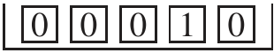

_._ 

6. 10%+1%. Số lượng bi đỏ trong mẫu là 90±9. Nếu con số này cao hơn 1 SE, nó sẽ là 90 + 9: bây giờ chuyển đổi thành tỷ lệ phần trăm trên 900. Sai số chuẩn (SE) cho một tỷ lệ phần trăm của chúng ta được cộng vào hoặc trừ đi khỏi giá trị kỳ vọng, chứ không phải nhân lên. 

7. Tổng khoảng cách tiến lên bằng tổng số chấm được gieo. Điều này giống như tổng của 200 lần rút (ngẫu nhiên có hoàn lại) từ hộp 

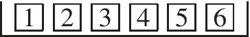

_._ 

Trung bình của hộp này là 3.5, và độ lệch chuẩn (SD) là 1.7. Vì vậy, anh ta có thể kỳ vọng tiến lên khoảng 200 × 3 _._ 5 = 700 ô, sai số khoảng √200 × 1 _._ 7 ≈ 24 ô hoặc xấp xỉ mức đó. 

8. Sherlock Holmes đang quên mất sai số ngẫu nhiên (chance error). 

Tập B, trang 366 

1. (a) Giá trị kỳ vọng cho tỷ lệ phần trăm số bi đỏ trong mẫu bằng tỷ lệ phần trăm số bi đỏ trong quần thể. (Quần thể = hộp, mẫu = các lần rút.) Xem tr. 359. 

   - (b) Khi số lần rút tăng lên, sai số chuẩn (SE) cho số lượng bi đỏ trong mẫu tăng lên nhưng SE cho tỷ lệ phần trăm bi đỏ lại giảm xuống. Xem tr. 360. 

2. Điều đầu tiên cần làm là thiết lập một mô hình hộp (box model). Sẽ có 30.000 vé trong hộp, một vé cho mỗi cử tri đã đăng ký; 12.000 vé được đánh dấu 1 (Đảng viên Dân chủ) và 18.000 vé được đánh dấu 0. Số lượng Đảng viên Dân chủ trong mẫu giống như tổng của 1.000 lần rút từ hộp. Phân số các số 1 trong hộp là 0.4. Giá trị kỳ vọng cho tổng này là 1 _,_ 000 × 0 _._ 4 = 400. Độ lệch chuẩn (SD) của hộp là √0 _._ 4 × 0 _._ 6 ≈ 0 _._ 49. Sai số chuẩn (SE) cho tổng là √ 1 _,_ 000 × 0 _._ 49 ≈ 15. 

   - (a) Giá trị kỳ vọng cho tỷ lệ phần trăm là 400 trên 1.000, hoặc 40%. Sai số chuẩn (SE) cho tỷ lệ phần trăm là 15 trên 1.000, hoặc 1.5%. (Không có gì đáng ngạc nhiên về giá trị kỳ vọng: 40% số cử tri đã đăng ký là Đảng viên Dân chủ.) 

   - (b) Tỷ lệ phần trăm Đảng viên Dân chủ trong mẫu sẽ vào khoảng 40.0%, với sai số khoảng 1.5% hoặc xấp xỉ. Các phần (a) và (b) yêu cầu cùng các phép tính; trong (b), bạn phải diễn giải các kết quả. 

   - (c) Đây là ±0 _._ 67 SE, xác suất là khoảng 48%. 

3. (a) Nên có 100.000 vé trong hộp, một vé cho mỗi người trong quần thể, trong đó 60.000 vé được đánh dấu 1 (đã kết hôn) và 40.000 vé được đánh dấu 0. Số người đã kết hôn trong mẫu giống như tổng của 1.600 lần rút từ hộp. Giá trị kỳ vọng cho tổng này là 1 _,_ 600 × 0 _._ 6 = 960. Độ lệch chuẩn (SD) của hộp là √0 _._ 6 × 0 _._ 4 ≈ 0 _._ 5. Sai số chuẩn (SE) cho tổng là √ 1 _,_ 600 × 0 _._ 5 = 20. Số người đã kết hôn trong mẫu sẽ là 960, với sai số khoảng 20 hoặc xấp xỉ mức đó. Bây giờ 960 trong số 1.600 là 60%, và 20 trong số 1.600 là 1.25%. Vì vậy 60% số người trong mẫu sẽ đã kết hôn, với sai số khoảng 1.25% hoặc xấp xỉ mức đó. 

ĐÁP ÁN CHO CÁC BÀI TẬP _(trang 366–379)_ A–81 

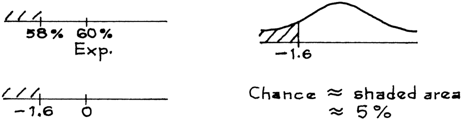

   - (b) Nên có 100.000 vé trong hộp, trong đó 10.000 vé được đánh dấu 1 (thu nhập trên $75.000) và 90.000 vé còn lại được đánh dấu 0. Có 1.600 lần rút. Xác suất là khoảng 9%. 

   - (c) Hộp có 100.000 vé, trong đó 20.000 vé được đánh dấu 1 (có bằng đại học) và 80.000 vé còn lại được đánh dấu 0. Có 1.600 lần rút. Xác suất là khoảng 68%. 

4. Vùng được tô bóng biểu diễn xác suất rút được một mẫu mà trong đó 22% hoặc nhiều hơn số người trong mẫu kiếm được hơn $50.000 một năm. 

5. (a) xác suất mà mẫu sẽ có 88 người thu nhập cao 

   - (b) xác suất mà mẫu sẽ có 22% người thu nhập cao 

   - (c) 88 là 22% của 400, vì vậy cùng một xác suất được mô tả theo hai cách khác nhau. Không phải là sự trùng hợp ngẫu nhiên chút nào. 

Tập C, trang 370 

1. Lựa chọn (iii) là đúng. Đó là điểm chính của phần này. 

|2.|_Số lượng_|_SE cho tỷ lệ phần trăm của_|
|---|---|---|
||_các lần rút_|_các số 1 trong số các lần rút_|
||2,500|1%|
||25,000|0.27 của 1%|
||100,000|0%|

_Nhận xét._ Sau 100.000 lần rút, không còn vé nào trong hộp, và không có sự không chắc chắn nào về tỷ lệ phần trăm của các số 1 trong số các lần rút. 

3. Kích thước mẫu nên là 2.500. 

4. Sai số chuẩn (SE) là như nhau cho cả ba hộp, bởi vì cả ba đều có cùng phân số các số 1, do đó có cùng độ lệch chuẩn (SD). 

- 10 − 4 

- 5. SE khi có hoàn lại = 20%; SE khi không hoàn lại =  10 − 1× 20% ≈16%. 

_Nhận xét._ Đây là một ví dụ nhân tạo mà trong đó số lần rút là một phần lớn của số vé trong hộp, vì vậy hệ số hiệu chỉnh (correction factor) thực sự phát huy tác dụng. 

### **Chương 21. Độ chính xác của các tỷ lệ phần trăm** 

Tập A, trang 379 

1. (a) được quan sát (b,c) được ước lượng từ dữ liệu dưới dạng _Nhận xét._ Có một sự khác biệt lớn giữa chương 20 và chương 21. Trong chương 20, bạn đã biết cấu phần của hộp, và có thể tính chính xác giá trị kỳ vọng và sai số chuẩn (SE). Ở đây, cấu phần của hộp phải được ước lượng từ dữ liệu. Trong chương 20, bạn suy luận xuôi, từ hộp đến các lần rút. Ở đây, bạn suy luận ngược, từ các lần rút về lại hộp. 

A–82 ĐÁP ÁN CHO CÁC BÀI TẬP _(trang 379–383)_ 

2. Bước đầu tiên là thiết lập mô hình. (Chúng ta cần mô hình hộp để tính sai số chuẩn (SE) cho tổng các lần rút.) Có 100.000 vé trong hộp, một số được đánh dấu 1 (hiện đang học đại học) và số khác là 0 (không theo học). Sau đó 500 lần rút được thực hiện từ hộp để có được mẫu. Số lượng sinh viên đại học trong mẫu giống như tổng của các lần rút. Phân số các số 1 trong hộp chưa được biết, nhưng có thể được ước lượng bằng phân số các số 1 được quan sát trong mẫu, tức là 194 _/_ 500 ≈ 0 _._ 388. Vì vậy, độ lệch chuẩn (SD) của hộp được ước lượng là √0 _._ 388 × 0 _._ 612 ≈ 0 _._ 49. Sai số chuẩn (SE) cho tổng là √500 × 0 _._ 49 ≈ 11. 11 là độ lớn có thể có của sai số ngẫu nhiên trong 194. Sai số chuẩn (SE) cho tỷ lệ phần trăm của các số 1 là _(_ 11 _/_ 500 _)_ × 100% = 2 _._ 2%. Tỷ lệ phần trăm những người từ 18–24 tuổi trong thị trấn là sinh viên đại học được ước lượng là 38.8%. Ước lượng này có khả năng sai lệch khoảng 2.2% hoặc xấp xỉ mức đó. Ước lượng là 38.8%, và mức sai số (give-or-take) là 2.2%. 

3. Ước lượng là 48%, sai số khoảng 5% hoặc xấp xỉ mức đó. 

4. Ước lượng là 2.8%, sai số khoảng 0.8 của 1% hoặc xấp xỉ mức đó. 

5. Ước lượng là 46.8%, sai số khoảng 2.5% hoặc xấp xỉ mức đó. 

6. Không. Hầu hết mọi người làm việc cho một vài cơ sở lớn. 

7. SE = 2%. 

8. (a) 18 _._ 0% ± 1 _._ 9% (b) 21 _._ 0% ± 2 _._ 0% (c) 24 _._ 5% ± 2 _._ 2% 

_Nhận xét._ Người thứ ba đã sai lệch một vài SE trong việc ước lượng tỷ lệ phần trăm các số 1 trong hộp; mặc dù vậy, sai số chuẩn được ước lượng chỉ sai lệch 0.2 của 1%. Phương pháp bootstrap rất tốt trong việc ước lượng các SE. 

9. 

||_Được biết_ _là_|_Được ước lượng_ _từ dữ liệu dưới dạng_|
|---|---|---|
|Giá trị quan sát|30.8%|N/A|
|Giá trị kỳ vọng|N/A|30.8%|
|SE|N/A|1.5%|
|SD của hộp|N/A|0.46|
|Số lần rút|1,000|N/A|

Tập B, trang 383 

1. (a) được quan sát (b,c) được ước lượng từ dữ liệu dưới dạng Xem bài tập 1 ở tr. 379. 

2. (a) 38 _._ 8% ± 4 _._ 4% (b) 38 _._ 8% ± 6 _._ 6% (c) 38 _._ 8% ± 3 _._ 3% _Nhận xét._ Khi mức độ tin cậy (confidence level) tăng lên, khoảng tin cậy (confidence interval) trở nên dài hơn. Tuy nhiên, khi kích thước mẫu tăng lên, khoảng tin cậy trở nên ngắn hơn. 

3. (a) Kỳ vọng có 1 viên bi đỏ trong số các lần rút, với sai số khoảng 1 hoặc xấp xỉ mức đó. 

   - (b) Không thể rút được ít hơn 0 viên bi đỏ, vì vậy xác suất là 0. (c) Khoảng 16%. 

   - (d) Không. Nếu biểu đồ tần suất xác suất (probability histogram) trông giống như đường cong chuẩn (normal curve), thì xác suất = 

   - của việc rút được ít hơn 0 viên bi đỏ có thể được đọc từ đường cong. Vì 16% khác 0%—xem (b) và (c)—biểu đồ tần suất không trông giống như đường cong. 

   - _Nhận xét._ Biểu đồ tần suất được hiển thị ở đầu trang tiếp theo. 

4. Sai. Xấp xỉ chuẩn (normal approximation) không thể được sử dụng ở đây. Dựa trên ước lượng tốt nhất của chúng ta từ mẫu, 1% số bi trong hộp là màu đỏ, và 99% là màu xanh. Đây là 

ĐÁP ÁN CHO CÁC BÀI TẬP _(trang 383–387)_ A–83 

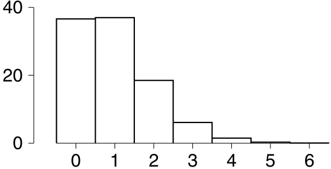

hộp trong bài tập 3. Biểu đồ tần suất xác suất cho tỷ lệ phần trăm các viên bi đỏ trong số 100 viên bi được rút từ hộp này không trông giống như đường cong chuẩn. (Với 100 lần rút trong số 10.000, có rất ít sự khác biệt giữa việc lấy mẫu có hoặc không có hoàn lại.) Nếu mẫu lớn hơn, hoặc hộp ít bị lệch (lopsided) hơn, đường cong chuẩn sẽ là phù hợp. 

### Tập C, trang 386 

1. Các xác suất (probabilities) được sử dụng khi suy luận từ hộp đến các lần rút; các mức độ tin cậy (confidence levels) được sử dụng khi suy luận từ các lần rút về lại hộp. 

2. (a) Sai số ngẫu nhiên (chance error) nằm trong giá trị quan sát. 

   - (b) Khoảng tin cậy là cho tỷ lệ phần trăm của quần thể. 

3. (a) 18 _._ 0% ± 3 _._ 8%, bao hàm (covers). 

   - (b) 21 _._ 0% ± 4 _._ 0%, bao hàm. 

   - (c) 24 _._ 5% ± 4 _._ 4%, vừa vặn bỏ lỡ (just misses). 

4. (a) Đúng. 

   - (b) Sai. Giá trị kỳ vọng (EV) được tính toán một cách chính xác; sai số ngẫu nhiên nằm trong tỷ lệ phần trăm các viên bi đỏ của mẫu, không phải trong giá trị kỳ vọng. 

   - (c) Đúng. 

   - (d) Sai. Các khoảng tin cậy là cho các tham số (parameters), không phải dữ liệu mẫu. Xem tr. 385–386. 

   - (e) Đúng. 

_Nhận xét về (b)._ SE cho bạn biết kích thước có khả năng xảy ra của sai số ngẫu nhiên trong tỷ lệ phần trăm các quả đỏ trong số các lần rút. Tuy nhiên, 50% là một thuộc tính của hộp và không phụ thuộc vào kết quả của các lần rút: không có sai số ngẫu nhiên trong 50%. Ví dụ, nếu bạn rút 100 lần và nhận được 53 quả đỏ, tỷ lệ phần trăm các quả đỏ trong mẫu là 53%, và sai số ngẫu nhiên—trong 53%—là +3%. Nếu bạn nhận được 42 quả đỏ, tỷ lệ phần trăm các quả đỏ trong số các lần rút là 42%, và sai số ngẫu nhiên trong 42% là −8%. Nhưng giá trị kỳ vọng vẫn giữ nguyên, bất kể các lần rút diễn ra như thế nào. Xem thêm bài tập 6 ở trang 294. 

5. (a) Đúng. (b) Đúng. (c) Đúng. (d) Đúng. 

   - (e) Sai; tỷ lệ phần trăm mẫu là 53%, bạn không cần một khoảng tin cậy cho điều đó. 

6. (a) Đúng. 

   - (b) Đúng. 

   - (c) Sai. Tỷ lệ phần trăm mẫu đã được biết và nằm trong khoảng này. 

   - (d) Sai. Nếu bạn xem khoảng này là cố định, thì xác suất là 0 hoặc 1. Bài học: các xác suất nằm ở quá trình lấy mẫu, không phải ở quần thể. Đó là lý do tại sao các nhà thống kê sử dụng thuật ngữ "khoảng tin cậy". 

7. Sai. SE cho tỷ lệ phần trăm đo lường kích thước có khả năng xảy ra của sự khác biệt giữa 

A–84 ĐÁP ÁN CÁC BÀI TẬP _(trang 387–404)_ 

một tỷ lệ phần trăm mẫu và tỷ lệ phần trăm quần thể; không phải sự khác biệt giữa hai tỷ lệ phần trăm mẫu. 

_Nhận xét._ SE cho sự khác biệt giữa hai tỷ lệ phần trăm mẫu phải lớn hơn, bởi vì cả hai đều chịu sự biến động ngẫu nhiên; ngược lại, tỷ lệ phần trăm quần thể không thay đổi. Xem chương 27 để biết thêm về sự khác biệt giữa hai tỷ lệ phần trăm mẫu. 

8. Đúng. Các xác suất được sử dụng khi bạn suy luận tiến, từ hộp đến các lần rút; các mức độ tin cậy được sử dụng khi suy luận lùi, từ các lần rút đến hộp: xem trang 385–386. 

Bộ D, trang 388 

1. Lý thuyết nói rằng, hãy cẩn thận với người đàn ông này. Ông ta đang nói về quần thể nào? Tại sao các sinh viên của ông ta lại giống như một mẫu ngẫu nhiên đơn giản từ quần thể? Cho đến khi ông ta có thể trả lời những câu hỏi này, đừng chú ý nhiều đến các SE mà ông ta tính toán. 

2. Đây không phải là một mẫu ngẫu nhiên đơn giản: bạn được đảm bảo có 25 sinh viên từ mỗi lớp, một mẫu ngẫu nhiên đơn giản sẽ không làm điều đó. Quy trình này không được áp dụng. 

Bộ E, trang 390 

1. Đây không phải là một mẫu ngẫu nhiên đơn giản, các công thức không được áp dụng. 

2. 

3. (a) "sự nhiệt tình của cử tri bị thay đổi" 

   - (b) Biến thiên ngẫu nhiên—Cuộc thăm dò ý kiến Gallup dựa trên một mẫu ngẫu nhiên. 

   - (c) Như bảng 2 cho thấy, các sai số ngẫu nhiên của vài điểm phần trăm là hoàn toàn có thể xảy ra. Có thể cuối tháng 9 rốt cuộc không phải là một chỉ báo tốt cho đầu tháng 11. (Mặt khác, Bush đã giành chiến thắng.) 

### **Chương 22. Đo lường Việc làm và Thất nghiệp** 

Bộ A, trang 403 

1. (a) Đúng. 

   - (b) Sai. Cục sẽ chia mẫu thành các nhóm, theo chủng tộc, độ tuổi, v.v., sau đó lấy trọng số riêng cho từng nhóm; phần 4. 

2. 151,4 triệu ± 0,1 triệu; phần 5. 

3. Đây là một mẫu ngẫu nhiên đơn giản về các hộ gia đình, và suy diễn là về các hộ gia đình. SD của hộp được ước lượng là √0,80 × 0,20 = 0,40. SE cho tổng là √100 × 0,40 = 4. SE cho tỷ lệ phần trăm là 4%. 

4. Đây là một mẫu ngẫu nhiên đơn giản về các hộ gia đình, nhưng là một mẫu cụm về con người. (Hộ gia đình là cụm.) Suy diễn là về con người. Vì vậy, bạn cần thêm thông tin để ước lượng SE—các công thức cho các mẫu ngẫu nhiên đơn giản không được áp dụng (phần 5). 

   - _Nhận xét về bài tập 3 và 4._ Trong bài tập 3, bạn có một mẫu ngẫu nhiên đơn giản về các hộ gia đình, và đưa ra một suy diễn về các hộ gia đình—tỷ lệ phần trăm nơi tất cả những người cư ngụ đều được tiêm chủng. Trong bài tập 4, bạn đang đưa ra một suy diễn về con người từ một mẫu cụm về con người. 

5. SE cho tỷ lệ phần trăm chỉ là 0,2 của 1%, do đó một sự chênh lệch là 55% − 52% = 3% 

A–85 ĐÁP ÁN CÁC BÀI TẬP _(trang 404–420)_ 

gần như không thể giải thích là một sai số ngẫu nhiên. Mọi người thích nói rằng họ đã bỏ phiếu, ngay cả khi họ không làm thế. 

6. Khoảng dành cho nam giới da trắng; nó dựa trên nhiều người hơn nhiều. 

### **Chương 23. Độ chính xác của các giá trị trung bình** 

Bộ A, trang 413 

1. (a) 7.611 / 100 = 76,11 (b) 73,94 × 100 = 7.394 

2. SE cho trung bình là 1. Câu trả lời cho (a) gần như là 100%. Câu trả lời cho (b) là 68%. Đừng nhầm lẫn SE cho trung bình của các lần rút với SD của hộp. 

3. (a) Sai. (b) Đúng. Nhắc lại, đừng nhầm lẫn SE cho trung bình của các lần rút với SD của hộp. 

4. (a) Giá trị kỳ vọng cho trung bình của các lần rút bằng trung bình của hộp. (b) Khi số lượng các lần rút tăng lên, SE cho tổng của các lần rút tăng lên nhưng SE cho trung bình của các lần rút giảm xuống. 

5. SE cho tổng của các lần rút là √100 × 20 = 200. SE cho trung bình là 200 / 100 = 2. Trung bình của các lần rút sẽ vào khoảng 50, cộng trừ 2 hoặc cỡ đó. Điều này vẫn đúng nếu các lần rút được thực hiện không hoàn lại, bởi vì chỉ một phần nhỏ các vé trong hộp được rút ra. Mặt khác, nếu bạn rút 100 vé ngẫu nhiên không hoàn lại từ một hộp 100 vé, thì SE là 0. 

6. Xác suất để trung bình của các lần rút nằm trong khoảng từ 2,25 đến 2,75. 

7. Tỷ lệ phần trăm số lần 4 xuất hiện trong 50 lần rút. 

8. (a) Xác suất để tổng sẽ là 90. 

   - (b) Xác suất để trung bình sẽ là 3,6. 

   - (c) 3,6 = 90 / 25, vì vậy cùng một xác suất được mô tả theo hai cách khác nhau. Hoàn toàn không phải là sự trùng hợp. Xem bài tập 5 ở trang 366. 

9. (a), (c), (e) là đúng; (b), (d), (f) là sai. Bạn biết các nội dung của hộp; bạn có thể tính toán giá trị kỳ vọng cho trung bình mà không có sai số; tuy nhiên, có sai số ngẫu nhiên trong trung bình của các lần rút. Xem bài tập 6 ở trang 294, các bài tập 4–6 ở trang 386–387. 

10. Trung bình của các lần rút chỉ là tổng của chúng, chia cho 25 (số lần rút). Do đó 25 thay đổi thành 1, 50 thành 2, và 55 thành 55 / 25 = 2,2. 

Bộ B, trang 420 

1. 

quần thể hộp trung bình quần thể trung bình của hộp mẫu các lần rút trung bình mẫu trung bình của các lần rút kích thước mẫu số lần rút 

2. (a) "SD của hộp" là hợp lý; "SE cho hộp" thì không. (b) "SE cho trung bình của các lần rút" là hợp lý; "SE cho trung bình của hộp" thì không. Thuật ngữ "SD" áp dụng cho một danh sách các số; "SE" áp dụng cho một quá trình ngẫu nhiên. Các vé trong hộp (và trung bình của chúng) là cố định, nhưng các lần rút là ngẫu nhiên. 

A–86 ĐÁP ÁN CÁC BÀI TẬP _(trang 420–422)_ 

3. (a,b) Được ước lượng từ mẫu dưới dạng. SD của mẫu là $19.000; giá trị này được sử dụng để ước lượng SD của hộp. SE dựa trên SD đã ước lượng; do đó nó cũng là một ước lượng. Nếu bạn không biết những gì có trong hộp, bạn phải ước lượng SD và SE từ dữ liệu. 

   - (c) quan sát được. 

4. 95% của 50 ≈ 48. 

5. (a) Mỗi tổ chức lấy trung bình mẫu của mình làm tâm của khoảng tin cậy của nó. Các trung bình mẫu là khác nhau, do biến động ngẫu nhiên. 

(b) Các SD của mẫu là khác nhau (biến động ngẫu nhiên), vì vậy các SE được ước lượng là khác nhau. Đó là lý do tại sao độ dài của các khoảng là khác nhau. 

(c) 49. 

6. Hộp có 30.000 vé, mỗi vé cho một sinh viên đã đăng ký, hiển thị tuổi của người đó. Dữ liệu giống như 900 lần rút từ hộp; trung bình mẫu giống như trung bình của các lần rút. SD của hộp được ước lượng là 4,5 năm, SE cho tổng của các lần rút là √900 × 4,5 = 135 năm, SE cho trung bình là 135 / 900 = 0,15 năm. 

   - (a) Ước lượng là 22,3 năm, sai số khoảng 0,15 năm. 

   - (b) Khoảng là 22,3 ± 0,3 năm. 

7. (a) Khoảng là $568 ± $24. Mặc dù dữ liệu không tuân theo đường cong chuẩn, biểu đồ histogram xác suất cho trung bình của các lần rút thì có. 

   - (b) Sai: $24 là SE cho trung bình của các lần rút, không phải SD của hộp. 

8. Sai. SE cho trung bình đưa ra kích thước có khả năng xảy ra của sự khác biệt giữa trung bình mẫu và trung bình quần thể, không phải sự khác biệt giữa hai trung bình mẫu. Vì vậy $18 là biên độ sai số sai. Xem bài tập 7 ở trang 387. 

9. Biểu đồ histogram xác suất là về các xác suất cho trung bình mẫu; nó không phải là về dữ liệu. Ở đây, biểu đồ histogram xác suất được cho trước. Phần (a) yêu cầu tìm +1 theo các đơn vị chuẩn, tương đối so với biểu đồ histogram xác suất. Chúng ta cần tâm và độ trải của biểu đồ này. Tâm là giá trị kỳ vọng cho trung bình mẫu, giá trị này bằng trung bình của hộp. Điều này được cho biết: nó là $61.700. Độ trải là SE cho trung bình mẫu. Điều này có thể được tính toán chính xác, bởi vì bài toán cho biết SD của hộp. Nó là $50.000. Vì vậy, SE cho tổng của các lần rút là √625 × $50.000 = $1.250.000. SE cho trung bình của các lần rút là $1.250.000 / 625 = $2.000. Và +1 trong các đơn vị chuẩn là $61.700 + $2.000 = $63.700. Đó là câu trả lời cho (a). Trong phần (b), bạn được yêu cầu xem giá trị $58.700 nằm ở đâu trên trục của biểu đồ histogram xác suất. Nó nằm dưới giá trị kỳ vọng: $58.700 thấp hơn $61.700. Do đó, $58.700 nằm trên phần âm của trục. Trên thực tế, giá trị này thấp hơn $3.000 so với giá trị kỳ vọng. Và 1 SE là $2.000. Do đó, $58.700 là −1,5 theo các đơn vị chuẩn. Đó là câu trả lời cho (b). 

_Nhận xét._ (i) Điểm chính: trong bài toán này, trung bình và SD của hộp được cho trước. 

(ii) Một trung bình mẫu điển hình cách trung bình quần thể khoảng 1 SE. Trung bình mẫu của chúng ta đã quá thấp đi 1,5 SE. Chúng ta đã không lấy được đủ người giàu trong mẫu. 

(iii) Hãy nhìn vào hình 1 ở trang 411. Biểu đồ histogram là về quá trình rút ngẫu nhiên và lấy trung bình; nó không phải là về bất kỳ tập hợp các lần rút cụ thể nào. Nếu bạn rút 25 vé và trung bình của chúng tình cờ là 3,2, điều đó không làm thay đổi biểu đồ. Bài tập này minh họa cho cùng một điểm, trong một bối cảnh phức tạp hơn. 

(iv) Bạn sẽ sử dụng SD là $50.000 để chuyển đổi sang các đơn vị chuẩn so với một biểu đồ histogram dữ liệu—đối với thu nhập của tất cả 25.000 gia đình trong thị trấn. SD của 

A–87 ĐÁP ÁN CÁC BÀI TẬP _(trang 421–424)_ 

$49.000 có tác dụng khi đối chiếu với một biểu đồ histogram dữ liệu khác—đối với thu nhập của 625 gia đình trong mẫu. 

Bộ C, trang 423 

|1. _Số lượng_|_EV cho tổng_|_SE cho tổng_|_EV cho trung bình_|_SE cho trung bình_|
|---|---|---|---|---|
|_các lần rút_|_các lần rút_|_các lần rút_|_các lần rút_|_các lần rút_|
|25|75|10|3,0|0,4|
|100|300|20|3,0|0,2|
|400|1.200|40|3,0|0,1|

2. (a) Đúng. Giá trị kỳ vọng cho trung bình của các lần rút bằng trung bình của hộp (trang 410). 

   - (b) Không thể biết; bạn cần SD của hộp. 

3. (a) Được ước lượng từ dữ liệu như là; bạn sẽ cần trung bình của hộp để tính chính xác giá trị kỳ vọng. 

   - (b) Để tính chính xác SE, bạn cần SD của hộp; thậm chí để ước lượng nó, bạn sẽ cần SD của các lần rút. 

_Nhận xét._ Giá trị kỳ vọng áp dụng cho quá trình rút ngẫu nhiên, thay vì bất kỳ tập hợp các lần rút cụ thể nào. Ví dụ, giả sử bạn rút 25 lần ngẫu nhiên có hoàn lại từ hộp 0 2 3 4 6 . Giá trị kỳ vọng cho trung bình của các lần rút là 3. Trung bình của các lần rút của bạn có thể là 3,1, cao hơn 0,1 so với giá trị kỳ vọng; hoặc, trung bình của các lần rút có thể là 2,6, thấp hơn 0,4. Có nhiều khả năng khác. Nhưng giá trị kỳ vọng chỉ phụ thuộc vào hộp, và giữ nguyên bất kể các lần rút diễn ra như thế nào. 

4. (a) SE cho tổng của các lần rút là 7,1, và SE cho trung bình của các lần rút là 0,18. 

- (b) Giá trị kỳ vọng là 100 nằm ở tâm; vạch đánh dấu tiếp theo sang bên phải cách 10 hộp, đó phải là 110, và cứ thế. 

5. Bạn không thể ước lượng SD của hộp, vì vậy bạn không thể có được các biên độ sai số. 

6. Đối với cả ba hộp, EV cho tổng của 100 lần rút là 200. SE cho trung bình của các lần rút là 

1 từ hộp A, 1,4 từ hộp B, 2 từ hộp C. 

- (a) 203.6 rất khó có thể đến từ hộp A—nó cách giá trị kỳ vọng cho trung bình của 100 lần rút từ hộp A là 3.6 SE. Nó cũng khá khó có thể đến từ hộp B, bởi vì 3 _._ 6 _/_ 1 _._ 4 ≈ 2 _._ 6 là quá nhiều SE. Vì vậy nó đến từ hộp C. Tương tự, 198.1 đến từ hộp B, suy ra 200.4 thuộc về hộp A bằng phương pháp loại trừ. 

- (b) Nó có thể khác đi, nhưng như vậy sẽ là gượng ép. 

A–88 ĐÁP ÁN CHO CÁC BÀI TẬP _(trang 424–445)_ 

Tập D, trang 424 

1. _._ 86 ± 0 _._ 06. 

2. Đây là dữ liệu định tính, hãy sử dụng phương pháp của chương 21. Khoảng tin cậy là 60 _._ 1%±5 _._ 4%. 

3. Không thể thực hiện được với đường cong chuẩn. Giả sử mẫu phản ánh chính xác tổng thể. Khi đó công ty đang rút từ một hộp có 99.87% là các số 1 và 0.13% là các số 0. Hộp này quá lệch đến mức với 750 lần rút, biểu đồ tần suất xác suất cho tổng sẽ không giống với đường cong chuẩn chút nào. Xem bài tập 3 và 4 ở trang 383. 

4. Đây không phải là một mẫu ngẫu nhiên đơn giản của những người tham gia: bạn hoặc là chọn được tất cả mọi người trong một hộ gia đình, hoặc không có ai cả. Vì vậy SE không thể được ước lượng bằng các phương pháp của chương này. Xem bài tập 3 và 4 ở trang 404. 

_Bình luận._ (i) Đây là một mẫu chùm gồm nhiều người—hộ gia đình là một chùm; phương pháp nửa mẫu có thể được sử dụng để tính SE (trang 402), nhưng sẽ cần thêm thông tin. 

(ii) Những người trong cùng một hộ gia đình thường có thói quen xem TV giống nhau, vì vậy mẫu này sẽ ít mang tính thông tin hơn một mẫu ngẫu nhiên đơn giản có cùng kích thước. Các mẫu chùm ít chính xác hơn so với các mẫu ngẫu nhiên đơn giản, nhưng lại rẻ hơn nhiều để thực hiện. 

(iii) Vấn đề thông thường đối với các mẫu chùm là sai số ngẫu nhiên, thay vì độ chệch; phương pháp lấy mẫu trong bài tập này là không chệch. 

5. (a) Đây không phải là bất kỳ loại mẫu xác suất nào. Nó là một mẫu thuận tiện. (b) Tương tự như (a). 

   - _Bình luận._ Mẫu chùm là một loại mẫu xác suất đặc biệt (trang 340, 342). 

6. Trung bình của hộp được ước lượng bằng trung bình của mẫu: 297 _/_ 100 ≈ 3 _._ 0; đối với SE, bạn cần SD. 

7. Hai thủ tục là như nhau: lấy mẫu ngẫu nhiên đơn giản có nghĩa là rút ngẫu nhiên không hoàn lại (trang 340). 

## **Phần VII. Các Mô Hình Ngẫu Nhiên** 

### **Chương 24. Mô Hình cho Sai Số Đo Lường** 

Tập A, trang 444 

1. Sử dụng SE cho tổng; giá trị này được tính là 60 microgam. 

2. Ước lượng là trung bình của các phép đo, 82,670 pound. Giá trị này có khả năng sai lệch bằng SE cho giá trị trung bình, 100 pound. 

3. (a) 800 micron (b) 80 micron (c) 91.4402 cm ± 160 micron 

4. (a) Sai. Khoảng này là 2 SE, không phải 2 SD, về mỗi phía tính từ trung bình. (b) Sai. Cùng lý do như trong (a). (c) Đúng. Xem trang 384. 

   - (d) Sai. Điều này giống hệt bài tập 8, trang 421. 

5. Yếu tố này là 5. 

ĐÁP ÁN CHO CÁC BÀI TẬP _(trang 449–454)_ A–89 

### Tập B, trang 449 

1. Bạn sẽ phải tung chiếc đinh ghim nhiều lần, và xem liệu tỷ lệ phần trăm số lần nó rơi xuống với mũi nhọn hướng xuống dưới có gần với 50% hay 67% hơn. (Điều này sẽ phụ thuộc vào bề mặt: trong một thí nghiệm, chiếc đinh ghim rơi mũi nhọn hướng xuống 66% số lần khi được tung trên thảm linoleum, nhưng chỉ 50% số lần khi được tung trên thảm lông.) 

2. Không. Những ngày mưa đều đến gần nhau trong mùa mưa. Nếu trời mưa một ngày, khả năng cao là sẽ mưa vào ngày tiếp theo. 

3. Chữ số cuối, đúng. Chữ số đầu tiên, sai. Ví dụ, trong danh bạ điện thoại San Francisco chữ số đầu tiên không thể là 0. Ngoài ra, có nhiều số điện thoại bắt đầu bằng 9 hơn là bằng 2. 

4. Không, các chữ cái xuất hiện theo thứ tự bảng chữ cái. Không có hộp nào sẽ làm điều đó. 

5. Chắc chắn rồi. Bạn có cơ hội 50-50 để thắng $5 hoặc thua $4. 

Tập C, trang 452 

1. Trong cả hai trường hợp, giá trị đo được đều cao hơn 504 microgam so với mười gam. 

2. Không, như bài tập trước đã chỉ ra. 

3. Sáu microgam là SD của 100 phép đo được báo cáo trong bảng 1 ở trang 99. Giá trị này được sử dụng để ước lượng SD của hộp sai số. Vì vậy, "được ước lượng từ dữ liệu là." 

4. (a) Biến thiên ngẫu nhiên (chance variation)—các nhà điều tra thu được các trung bình mẫu khác nhau. 

   - (b) Lại là biến thiên ngẫu nhiên—các nhà điều tra thu được các SD mẫu khác nhau. 

   - (c) Khoảng 95% trong số 50 khoảng tin cậy sẽ bao phủ trọng lượng chính xác, tức là khoảng 48 khoảng. 

   - (d) 48. (Một trong số các khoảng này bị lệch đi khá nhiều—đó là do biến thiên ngẫu nhiên.) 

5. SD của hộp sai số được ước lượng là 50 microgam. 

   - (a) 5 microgam—SE cho giá trị trung bình. 

   - (b) 50 microgam—SD ước lượng của hộp sai số. 

   - (c) 95%—hai SE. 

6. Câu trả lời là 1.2 microgam. Xem ví dụ 5, trang 451. 

7. (a) 300,007 (giá trị trung bình); 2 (SE cho giá trị trung bình). 

   - (b) Sai: trung bình chính xác là 300,007. 

   - (c) Đúng: mỗi con số trong một danh sách chênh lệch so với trung bình của danh sách đó khoảng một SD. 

   - (d) Đúng: khoảng tin cậy là "trung bình ± 2 SE." 

   - (e) Sai: trung bình của 25 phép đo chính xác là 300,007. 

   - (f) Sai: 2 là SE, không phải là SD. 

8. Câu trả lời là 2 inch. Đây là lý do. Mỗi phép đo bằng chiều dài chính xác, cộng với một lần rút từ hộp sai số. Khoảng cách ước lượng AE là tổng của 4 phép đo, và sai lệch so với chiều dài chính xác AE bằng tổng của 4 lần rút từ hộp. Trung bình của hộp sai số là 0. Vì vậy tổng của 4 lần rút sẽ xoay quanh 0, cộng trừ khoảng một SE. Đó là SE cho tổng, là con số cộng trừ chính xác. SD của hộp là 1 inch, vậy SE cho tổng là √4 × 1 inch = 2 inch. _Bình luận._ Việc tìm độ dài AE liên quan đến việc cộng các phép đo lại, chứ không phải lấy trung bình của chúng. 

9. Các sai số ngẫu nhiên đối với những người khác nhau có thể có các SD khác nhau. Ngoài ra, nếu cùng một 

A–90 ĐÁP ÁN CHO CÁC BÀI TẬP _(trang 454–463)_ 

người làm bài kiểm tra nhiều lần, các sai số có thể bị phụ thuộc. Mô hình Gauss có vẻ không áp dụng được. 

### **Chương 25. Các Mô Hình Ngẫu Nhiên trong Di Truyền Học** 

Tập A, trang 461 

1. Mỗi hạt giống có 50% cơ hội nhận _y_ từ cây bố/mẹ _y/g_, và 50% cơ hội nhận _g_ . Nó chắc chắn sẽ nhận _g_ từ cây bố/mẹ _g/g_. Vì vậy hạt giống có 50% cơ hội là _y/g_ và có màu vàng; nó có 50% cơ hội là _g/g_ và có màu xanh. Khoảng 50% số hạt giống sẽ có màu vàng. 

   - Số lượng hạt vàng trong số 1,600 hạt giống giống như tổng của 1,600 lần rút từ hộp 0 1 . Số lượng kỳ vọng của hạt vàng là 1 _,_ 600 × 1 _/_ 2 = 800. SE cho con số này là√ 1 _,_ 600 × 1 _/_ 2 = 20. Bây giờ phép xấp xỉ chuẩn có thể được sử dụng: 

2. (a) trắng × đỏ → 100% hồng 

   - trắng × hồng → 50% trắng, 50% hồng hồng × hồng → 25% đỏ, 50% hồng, 25% trắng. 

_Phép tính cho hồng_ × _hồng:_ Mỗi cây bố/mẹ là _r/w_ , do đó màu hoa của cây con được xác định bằng cách chọn ngẫu nhiên một hàng và một cột từ bảng bên dưới. 

- (b) Số lượng kỳ vọng của hoa màu hồng trong 400 cây là 200, với SE là 10. Sử dụng phép xấp xỉ chuẩn: 

3. (a) Một cặp gen kiểm soát chiều rộng của lá, với các biến thể _w_ (rộng) và _n_ (hẹp). Các quy tắc: _w/w_ tạo ra lá rộng, _w/n_ và _n/w_ tạo ra lá trung bình, và _n/n_ tạo ra lá hẹp. 

(b) hẹp × hẹp = _n/n_ × _n/n_ → 100% _n/n_ = hẹp hẹp × trung bình = _n/n_ × _n/w_ → 

   - 50% _n/n_ = hẹp _,_ 50% _n/w_ = trung bình _._ 

4. _B_ = nâu, _b_ = xanh da trời. Người chồng là _B/b_ , người vợ là _b/b_ . Mỗi đứa trẻ có 1 phần 2 cơ hội có mắt nâu. Ba đứa trẻ độc lập với nhau, vì vậy khả năng cả ba đứa trẻ đều có mắt nâu là _(_ 1 _/_ 2 _)_3 = 1 _/_ 8. 

ĐÁP ÁN CHO CÁC BÀI TẬP _(trang 476–481)_ A–91 

## **Phần VIII.** 

### **Chương 26.** 

Tập A, trang 476 

1. (a) ước lượng từ dữ liệu là (b) quan sát được 

2. Giá trị quan sát được chỉ thấp hơn 1.3 SE so với kỳ vọng, lý thuyết của Tiến sĩ Null có vẻ hợp lý. 

3. Một lần nữa, giá trị quan sát được thấp hơn kỳ vọng khoảng 1.3 SE, và Tiến sĩ Null có vẻ hợp lý. Bài học rút ra: kết quả phụ thuộc vào giá trị quan sát được, giá trị kỳ vọng, và SE. SE phụ thuộc vào SD và kích thước mẫu. 

4. Nếu con xúc xắc là công bằng, tổng số chấm giống như tổng của 100 lần rút từ hộp 1 2 3 4 5 6 . Trung bình của hộp là 3.5; SD là 1.7. Vì vậy, giá trị kỳ vọng 

cho tổng là 350, và SE là 17. Tổng số chấm chỉ cao hơn giá trị kỳ vọng một chút xíu hơn 1 SE, điều này trông giống như một biến thiên ngẫu nhiên. 

5. Bài toán này có thể được thiết lập giống như bài tập 4, nhưng lần này tổng số chấm cao hơn giá trị kỳ vọng của nó tới hơn 3 SE. Điều này không giống như biến thiên ngẫu nhiên. _Bình luận._ (i) Kích thước mẫu rất quan trọng; hãy so sánh bài tập 4 và 5. 

   - (ii) Một bài kiểm định đầy đủ hơn cho tính công bằng của con xúc xắc sẽ được trình bày ở chương 28. 

### Tập B, trang 478 

1. (iii) 

2. Giả thuyết không nói rằng sự khác biệt là do ngẫu nhiên nhưng giả thuyết đối nói rằng sự khác biệt là thực sự. 

3. Chọn (ii). Tiến sĩ Null và Tiến sĩ Alt đều biết dữ liệu, nhưng họ không biết trong hộp có gì. Giả thuyết không là một tuyên bố về cái hộp, và kiểm định cho bạn biết liệu tuyên bố này có hợp lý hay không. 

4. hộp. Giả thuyết không là về cái hộp. 

5. SD của hộp có thể được ước lượng là 10, vì vậy SE cho trung bình của 100 lần rút được ước lượng là 1. Nếu trung bình của hộp là 20, thì trung bình của các lần rút sẽ cao hơn giá trị kỳ vọng của nó 2.7 SE. Điều này không hợp lý. 

Tập C, trang 481 

1. (a) _P_ = 32% là có lợi nhất cho giả thuyết không. 

   - (b) _P_ = 0 _._ 1 của 1% là tốt nhất cho giả thuyết đối (alternative). 

   - _P_ lớn là tốt cho giả thuyết không (null); _P_ nhỏ là xấu cho giả thuyết không. 

2. (a) Đúng. (b) Sai. Xem trang 480–81. 

3. (a) Đúng, xem trang 480–81. (b) Sai, xem trang 480–81. 

4. Sai số chuẩn (SE) cho trung bình ≈ 1 _._ 25, do đó _z_ ≈ _(_ 52 _._ 7−50 _)/_ 1 _._ 25 ≈ 2 _._ 16 và _P_ xấp xỉ bằng diện tích bên phải của 2.16 dưới đường cong chuẩn (normal curve). Từ bảng, diện tích này là khoảng 1.6%. Sự khác biệt là khó giải thích như một sự biến thiên do cơ hội (chance variation). Giả thuyết đối đang có vẻ hợp lý.

A–92 ĐÁP ÁN CHO CÁC BÀI TẬP _(trang 481–486)_ 

5. hộp (box). Giả thuyết không là về hộp. 

6. Không. Với 10 lần rút (draws), biểu đồ xác suất (probability histogram) cho trung bình mẫu có thể không giống đường cong chuẩn, và độ lệch chuẩn (SD) của dữ liệu sẽ không phải là một ước lượng tốt cho độ lệch chuẩn của hộp. 

7. Mẫu này giống như 100 lần rút ngẫu nhiên từ một hộp có một vé cho mỗi nhân viên, thể hiện số ngày nhân viên đó vắng mặt. Giả thuyết không: trung bình của hộp là 6.3 ngày. Giả thuyết đối: trung bình của hộp nhỏ hơn 6.3 ngày. Độ lệch chuẩn của hộp được ước lượng là 2.9 ngày, do đó sai số chuẩn cho trung bình là 0.29 ngày, và _z_ ≈ _(_ 5 _._ 5 − 6 _._ 3 _)/_ 0 _._ 29 ≈−2 _._ 8, do đó _P_ ≈ 0 _._ 3 của 1%. Đây là bằng chứng mạnh mẽ chống lại giả thuyết không; sự biến thiên do cơ hội sẽ không giải thích được sự sụt giảm trong việc vắng mặt. 

8. Bây giờ _z_ ≈ _(_ 5 _._ 9 − 6 _._ 3 _)/_ 0 _._ 29 ≈−1 _._ 4, do đó _P_ ≈ 8%. Giả thuyết không trông có vẻ khả thi hơn. 

Set D, trang 482 

1. (a) Sai. Ngay cả khi giả thuyết không là đúng, 1% số lần thí nghiệm sẽ cho kết quả "có ý nghĩa cao" ("highly significant"). 

   - (b) Sai; trang 480–81. (c) Sai; trang 480–81. 

2. (a) Đúng. _P_ lớn là tốt cho giả thuyết không. 

   - (b) Đúng. _P_ nhỏ là xấu cho giả thuyết không. 

3. (a) Đúng; trang 482. 

   - (b) Sai; _P_ phải nhỏ hơn 1%. 

   - (c) Đúng; trang 482. (d) Đúng; trang 479. 

   - (e) Đúng; _z_ = _(_ obs − exp _)/_ SE, và “exp” được tính dựa trên giả thuyết không. 

4. Khoảng 2%. 

5. (a) Đúng; _z_ = _(_ obs − exp _)/_ SE; “obs” là trung bình của các lần rút; “exp” là trung bình của hộp, được cho là 50. 

   - (b) Khoảng 50. 

   - (c) Khoảng 2; và 3 trong số chúng thì có. 

   - (d) Khoảng 2%. Xem bài tập 4. 

Set E, trang 486 

1. Tùy chọn (i) đúng: “giống như” có nghĩa là “xét về mặt cơ hội”. Mỗi lần đoán có một phần tư cơ hội là đúng, và mỗi lần rút có một phần tư cơ hội là 1. Khi đó số lần đoán đúng giống như tổng các lần rút, và định luật căn bậc hai (square root law) được áp dụng. 

Tùy chọn (ii) sai: nếu không có ESP, cơ hội của một lần đoán đúng là 1 _/_ 4 chứ không phải 1 _/_ 3. Tùy chọn (iii) còn tệ hơn: 2 _,_ 006 _/_ 7 _,_ 500 là tỷ lệ số 1 trong mẫu, không phải trong hộp. Tùy chọn (iv) sai: tỷ lệ số 1 trong mẫu đã được biết, không có tranh luận gì về điều đó. Tùy chọn (v) thì hoàn toàn chệch hướng: giả thuyết không tương ứng với ý tưởng rằng không có ESP. 

2. (a) sinh viên đăng ký tại Berkeley trong học kỳ đó. Lý do: hộp tương ứng với quần thể (population). 

   - (b) 1 = nam, 0 = nữ. Lý do: bạn đang đếm số nam. (Nếu bạn muốn đếm nữ, điều đó cũng ổn, nhưng hãy nhất quán.) 

   - (c) Có 25,000 vé trong hộp, và 100 lần rút. Lý do: mẫu giống như các lần rút. 

ĐÁP ÁN CHO CÁC BÀI TẬP _(trang 486–488)_ A–93 

   - (d) 100 lần rút. 

   - (e) 67%. Lý do: Bạn biết tỷ lệ phần trăm nam giới trong quần thể. 

3. (a) 53 (b) 67 (c) tổng (d) √100 × √0 _._ 67 × 0 _._ 33 ≈ 4 _._ 7 

   - (e) _z_ ≈ _(_ 53 − 67 _)/_ 4 _._ 7 ≈−3 và _P_ ≈ 1 _/_ 1 _,_ 000. 

4. Không. Anh ấy nhận được quá nhiều nữ giới. _P_ là rất nhỏ, do đó sự biến thiên do cơ hội sẽ không giải thích được sự khác biệt. Việc chọn người một cách tình cờ (haphazardly) không giống như việc lấy mẫu ngẫu nhiên đơn giản (chương 19). 

5. (a) Được tính từ giả thuyết không: 100×0 _._ 67. Giá trị kỳ vọng luôn được tính từ giả thuyết không. 

   - (b) Được tính từ giả thuyết không. Ở đây, giả thuyết không cho bạn biết thành phần của hộp. Nếu không, bạn có thể phải ước lượng độ lệch chuẩn của hộp từ dữ liệu (trang 485). 

6. (a) Giả thuyết không: số lần đoán đúng giống như tổng của 1,000 lần rút từ một hộp có một vé đánh dấu 1 và chín vé 0. 

(b) √0 _._ 1 × 0 _._ 9. Giả thuyết không cho bạn biết có gì trong hộp. Hãy sử dụng nó. 

   - (c) _z_ ≈ _(_ 173 − 100 _)/_ 9 _._ 5 ≈ 7 _._ 7, và _P_ là cực nhỏ. 

   - (d) Bất kể đó là gì, nó không phải là sự biến thiên do cơ hội. 

7. (a) Việc tung đồng xu giống như rút ngẫu nhiên có hoàn lại 10,000 lần từ hộp 0–1, với 0 = sấp và 1 = ngửa. Tỷ lệ số 1 trong hộp là chưa biết. Giả thuyết không: tỷ lệ này bằng 1 _/_ 2. Giả thuyết đối: tỷ lệ này lớn hơn 1 _/_ 2. Số lần mặt ngửa giống như tổng của các lần rút. 

(b) _z_ = 3 _._ 34, _P_ ≈ 4 _/_ 10 _,_ 000. 

   - (c) Có quá nhiều mặt ngửa để có thể giải thích đó là sự biến thiên do cơ hội. 

8. (a) Giống như 7(a). (b) _z_ = 1 _._ 34, _P_ ≈ 9%. 

   - (c) Đồng xu có vẻ cân bằng. 

9. (a) hộp. Giả thuyết không là về hộp. (b) Sai; xem trang 480–81. 

10. Dữ liệu bao gồm 25 mức trọng lượng. Giả thuyết không nói rằng dữ liệu giống như 25 lần rút ngẫu nhiên từ một hộp. Có một vé trong hộp cho mỗi con vật trong quần thể (colony), thể hiện trọng lượng của nó. Do đó trung bình của hộp là 30 gram. Và độ lệch chuẩn của nó là 5 gram, vì vậy sai số chuẩn cho trung bình của 25 lần rút là 1 gram. Bây giờ _z_ = _(_ 33 − 30 _)/_ 1 = 3, và _P_ ≈ 1 _/_ 1 _,_ 000. 

_Bình luận._ (i) Ở đây, giả thuyết không cho bạn biết độ lệch chuẩn của hộp, do đó bạn không cần ước lượng nó từ dữ liệu. Độ lệch chuẩn của dữ liệu không được sử dụng trong việc giải quyết vấn đề. Xem trang 485. 

(ii) Việc chọn một cách tình cờ không giống như lấy mẫu ngẫu nhiên đơn giản (chương 19). Khi bạn thò tay vào lồng để bắt một con vật, có khả năng những con dạn dĩ hơn sẽ tiến lại tay bạn, và chúng hơi nặng hơn những con khác. 

11. Giả thuyết không nói rằng mức giá giảm không có tác động đến khối lượng bán hàng. Vì vậy trong mỗi cặp cửa hàng, cửa hàng với mức giá thông thường có khả năng bán được nhiều hơn cũng tương đương với đối tác của nó ở mức giá đã giảm. Về phương diện mô hình hộp, giả thuyết không nói rằng dữ liệu giống như 25 lần rút từ hộp 1 0 , trong đó 1 có nghĩa là cửa hàng với mức giá thông thường bán được nhiều hơn và 0 có nghĩa là cửa hàng với mức giá thông thường bán được ít hơn. Số lượng số 1 kỳ vọng là 12.5, và SE là 2.5, do đó _z_ = _(_ 18 − 12 _._ 5 _)/_ 2 _._ 5 = 2 _._ 2 và _P_ ≈ 1 _._ 4%. Bằng chứng chống lại giả thuyết không là khá mạnh mẽ. 

_Bình luận._ Quy trình này được gọi là "kiểm định dấu" ("the sign test"). Xem bài tập 6 ở trang 258 (chuột túi) và bài tập 11 ở trang 262 (người hút thuốc). Nếu việc hiệu chỉnh tính liên tục (continuity correction) được thực hiện, xấp xỉ chuẩn sẽ cho _P_ ≈ 2 _._ 28%, so với 2.16% từ công thức nhị thức. 

A–94 ĐÁP ÁN CHO CÁC BÀI TẬP _(trang 494–503)_ 

Set F, trang 493 

1. (a) 5% (b) 5% (c) 90% (d) 95% 

2. Từ bảng, diện tích bên phải của 2.92 là 5%, và diện tích bên phải của 6.96 là 1%. Vì 4.02 nằm giữa 2.92 và 6.96, diện tích bên phải của 4.02 nằm giữa 1% và 5%. 

3. Không, 3 bậc tự do (degrees of freedom). 

4. (a) bậc tự do = 2, trung bình ≈ 72 _._ 7, SD+ ≈ 5 _._ 7, SE ≈ 3 _._ 3, 

         - _t_ ≈ _(_ 72 _._ 7 − 70 _)/_ 3 _._ 3 ≈ 0 _._ 8 _,_ 

      - _P_ 

   - (b) _P_ là khoảng 2.5%, hiệu chuẩn lại (recalibrate). 

   - (c) Một phép đo lường không bao giờ là đủ. 

   - (d) _P_ là khoảng 25%. 

   - _Bình luận._ Hai phép đo thì tốt hơn một; càng nhiều thì càng tốt. 

5. Trong (a), số 93 là một giá trị ngoại lai (outlier), do đó các sai số không có vẻ tuân theo đường cong chuẩn. Trong (c), các con số chỉ thay đổi qua lại giữa 69 và 71. Điều này không phù hợp với mô hình Gauss. 

6. Theo mô hình Gauss, mỗi 10 phép đo mới bằng trọng lượng chính xác, cộng với độ chệch (bias), cộng với một lần rút từ hộp sai số (error box). Giả thuyết không nói rằng độ chệch bằng không; giả thuyết đối nói rằng có một số độ chệch. Độ lệch chuẩn của hộp sai số được ước lượng là√ 10 _/_ 9 × 9 ≈ 9 _._ 5. (Các sai số thuộc về chiếc cân đã được làm lại, nên độ lệch chuẩn cũ là 7 microgram thì không liên quan.) Sai số chuẩn cho trung bình ≈ 3 microgram, _t_ ≈−2 _._ 67. Diện tích bên trái của −2 _._ 67 dưới đường cong Student với 9 bậc tự do là khoảng 1%, một bằng chứng mạnh mẽ chống lại giả thuyết không. 

7. (a) Theo mô hình Gauss, mỗi 100 phép đo bằng trọng lượng chính xác cộng với một lần rút từ hộp sai số. Các vé trong hộp sai số có giá trị trung bình là 0. Tham số chưa biết là trọng lượng chính xác. Giả thuyết không nói rằng mức này vẫn là 512 microgram cao hơn một kilogram. Giả thuyết đối nói rằng trọng lượng chính xác thì nhỏ hơn. 

   - (b) Độ lệch chuẩn của hộp sai số có thể được ước lượng từ dữ liệu quá khứ là 50 microgram: hộp sai số thuộc về thiết bị. (Độ lệch chuẩn mới là 52 microgram là không liên quan.) 

   - (c) Với 100 phép đo, hãy sử dụng _z_ chứ không phải _t_ . Sai số chuẩn cho trung bình của 100 phép đo là 5 microgram, do đó _z_ = _(_ 508 − 512 _)/_ 5 = −0 _._ 8 và _P_ ≈ 21%. 

   - (d) Sự giảm trọng lượng giống như một sự biến thiên do cơ hội. 

### **Chương 27. Thêm Kiểm định Cho Trung bình** 

Set A, trang 503 

1. Đúng, bây giờ các con số đã độc lập, nên định luật căn bậc hai được áp dụng. 

2. Giá trị kỳ vọng là 100 − 50 = 50, và SE là √22 + 32 ≈ 3 _._ 6. Định luật căn bậc hai được áp dụng vì các lần rút đều độc lập. 

3. Giá trị kỳ vọng cho mỗi phần trăm là 50%; các sai số chuẩn là 2.5 và 5 điểm phần trăm (percentage points). Giá trị kỳ vọng cho sự chênh lệch là 0, và SE là √2 _._ 52 + 52 ≈ 5 _._ 6 điểm phần trăm. Định luật căn bậc hai được áp dụng vì hai phần trăm này là độc lập. 

ĐÁP ÁN CHO CÁC BÀI TẬP _(trang 503–506)_ A–95 

4. (a,b) Đúng. 

   - (c) Sai. Các tỷ lệ phần trăm là phụ thuộc: nếu đồng xu ra mặt ngửa, nó không thể ra mặt sấp. Định luật căn bậc hai không được áp dụng. 

_Bình luận._ Sự chênh lệch “số mặt ngửa − số mặt sấp” giống như tổng của 500 lần rút từ hộp −1 +1 , do đó SE cho sự chênh lệch ở hai số lượng là khoảng 22, và SE cho sự chênh lệch trong tỷ lệ phần trăm là 

_(_ 22 _/_ 500 _)_ × 100% = 4 _._ 4% _._ 

5. Đúng. Nếu các lần rút được thực hiện có hoàn lại, hai trung bình sẽ độc lập với nhau: SE cho sự chênh lệch sẽ bằng chính xác √32 + 32. Hộp là quá lớn đến mức không có sự khác biệt trên thực tế giữa việc rút có hoặc không hoàn lại. 

6. Độ lệch chuẩn của hộp F có thể được ước lượng là 3, do đó SE cho trung bình của 100 lần rút từ hộp F là 0.3; tương tự, SE cho trung bình của 400 lần rút từ hộp G được ước lượng là 0.4; các trung bình là độc lập, do đó SE cho sự chênh lệch là √0 _._ 32 + 0 _._ 42 = 0 _._ 5. Nếu hai hộp có cùng trung bình, sự chênh lệch quan sát được 51 − 48 = 3 cách 6 SE so với giá trị kỳ vọng là 0. Không phải một câu chuyện có khả năng xảy ra. 

Set B, trang 506 

1. Kiểm định _z_ hai mẫu (Two-sample _z_-test). 

2. (a) Kiểm định _z_ hai mẫu: bạn đang so sánh hai mẫu. 

   - (b) Việc thiết lập cũng giống như trong văn bản, với một hộp năm 1990 và một hộp năm 2004. Có vô số (oodles) vé trong mỗi hộp, và 1,000 lần rút từ mỗi hộp. Các vé hiển thị điểm kiểm tra. Giả thuyết không nói rằng trung bình của các hộp là giống nhau. Giả thuyết đối nói rằng các trung bình là khác nhau. 

   - (c) SE cho sự chênh lệch là 1.37, do đó _z_ = 2 _/_ 1 _._ 37 ≈ 1 _._ 46. Điều này có thể dễ dàng là một sự biến thiên do cơ hội. 

3. Sự khác biệt này là lớn, và có ý nghĩa cao—cả về mặt thực tiễn và thống kê. 

4. Sự chênh lệch giữa hai trung bình mẫu là 2.1 giờ, và SE cho sự chênh lệch là 0.35 giờ. Do đó _z_ ≈ 6, và _P_ ≈ 0. Sự chênh lệch là rất khó để giải thích như một sự biến thiên do cơ hội. Sinh viên trong các đại học tư nhìn chung đến từ các gia đình khá giả hơn, và có nhiều hỗ trợ hơn từ gia đình. 

5. Tử số tính theo phần trăm, và mẫu số là số thập phân. Đó là một sai lầm. Thực tế, _z_ = _(_ 41 − 17 _)/_ 4 _._ 8 = 5. Nếu bạn thích số thập phân, _z_ = _(._ 41 − _._ 17 _)/._ 048 = 5. _Bình luận._ Quên chuyển đổi mẫu số sang phần trăm là một sự sơ suất (slip) phổ biến. Bạn có thể làm toàn bộ bài toán bằng phần trăm hoặc bằng số thập phân, nhưng đừng thay đổi ở giữa chừng. 

6. Có hai mẫu, do đó bạn cần thực hiện một kiểm định _z_ hai mẫu. Dữ liệu bao gồm 1,600 số 0 và 1 cho nam giới (1 = mù chữ), và thêm 1,600 số 0 và 1 khác cho nữ giới. Mô hình có hai hộp, M và F. Hộp M có một vé cho mỗi thanh niên nam trên toàn quốc, đánh dấu 1 cho những người mù chữ và 0 cho những người biết chữ. Hộp F tương tự, dành cho nữ giới. Dữ liệu đối với nam giới giống như 1,600 lần rút từ hộp M, và tương tự cho nữ giới. Giả thuyết không: phần trăm số 1 là như nhau ở hai hộp. Giả thuyết đối: phần trăm số 1 lớn hơn trong hộp M. SE cho phần trăm số 1 ở mẫu nam giới có thể được ước lượng là 0.64 của 1%; cho mẫu nữ giới, SE là 0.43 của 1%. Do đó SE cho sự chênh lệch là √0 _._ 642 + 0 _._ 432 ≈ 0 _._ 77 của 1%. Suy ra _z_ ≈ _(_ 7 − 3 _)/_ 0 _._ 77 ≈ 5 _._ 2 và _P_ là gần bằng 0. Sự khác biệt này hầu như không thể giải thích là một sự biến thiên do cơ hội. 

A–96 ĐÁP ÁN CHO CÁC BÀI TẬP _(trang 506–512)_ 

7. Sai số chuẩn (SE) cho sự khác biệt của hai giá trị trung bình có thể được ước lượng là √0 _._ 52 + 0 _._ 52 ≈ 0 _._ 7. Vậy _z_ = _(_ 26 − 25 _)/_ 0 _._ 7 ≈ 1 _._ 4, và _P_ ≈ 8%. Sự khác biệt này hoàn toàn có thể là do ngẫu nhiên (chance variation). 

8. _z_ = 1 _/_ 0 _._ 45 ≈ 2 _._ 2 và _P_ ≈ 1 _._ 4%. 

   - _Bình luận._ Mức ý nghĩa (significance level) quan sát được phụ thuộc vào kích thước mẫu (sample size). Với các mẫu lớn, ngay cả những khác biệt nhỏ cũng sẽ có ý nghĩa thống kê rất cao (highly statistically significant). Thêm thông tin về điều này ở chương 29. 

9. Các giá trị trung bình của nhóm điều trị (treatment) và nhóm đối chứng (control) là phụ thuộc (dependent), vì những con chuột được lấy thành từng cặp từ cùng một lứa, do đó nếu một con chuột có vỏ não nặng, thì con còn lại trong cặp cũng có khả năng như vậy. Phép tính sai số chuẩn (SE) không tính đến sự ghép cặp này. _Bình luận._ Xem bài tập ôn tập 12 trong chương 26 để có một phân tích tốt hơn. Trong mỗi cặp, hãy lấy hiệu số "điều trị − đối chứng". Thực hiện kiểm định _z_ ( _z_ -test) trên các hiệu số đó. 

Set C, trang 511 

1. (a) Hai con số. Số B không được quan sát thấy; nó cho biết điểm của cậu bé sẽ là bao nhiêu, nếu cậu bé được phân vào nhóm đối chứng (control group). 

   - (b) Có. Số A cho biết điểm của cô bé sẽ là bao nhiêu, nếu cô bé được phân vào nhóm luyện thi (coaching group). Con số này không được quan sát thấy, vì cô bé thuộc nhóm đối chứng. Các nhà nghiên cứu không biết số A là bao nhiêu. 

   - (c) Chọn con đường an toàn (conservative route). Sai số chuẩn (SE) cho giá trị trung bình của nhóm luyện thi là 9.8 điểm. SE cho giá trị trung bình của nhóm đối chứng là 10.3 điểm. SE cho sự khác biệt là √9 _._ 82 + 10 _._ 32 ≈ 14 _._ 2 điểm. Sự khác biệt trong điểm số trung bình là 9, vì vậy _z_ ≈ 9 _/_ 14 _._ 2 ≈ 0 _._ 65, và _P_ ≈ 26%. Điều này rất có thể là do sự biến thiên ngẫu nhiên (chance variation). 

_Bình luận._ Bài tập 1 không giống như việc so sánh điểm bài thi NAEP vào các năm 1990 và 2004 (phần 2), vì chúng ta không có hai mẫu độc lập (independent samples). Nhưng nó giống như thí nghiệm vitamin C (ví dụ 4). Mỗi học sinh trong số 200 học sinh có hai phản hồi có thể xảy ra—một nếu được luyện thi và một nếu không được luyện thi. Các nhà nghiên cứu chỉ được xem một trong hai phản hồi, và đưa ra lựa chọn của họ một cách ngẫu nhiên. Đó là lý do tại sao việc tính toán sai số chuẩn (SE) là hợp lý (trang 509–511). 

2. (a) Sự khác biệt là 66 − 59 = 7 điểm, và SE là 1.8 điểm. Vì vậy _z_ ≈ 3 _._ 9, và _P_ ≈ 0. Sự khác biệt này khó có thể được giải thích như là một sự biến thiên ngẫu nhiên. Ngũ cốc Wheaties có tác dụng! 

   - (b) Các sinh viên sẽ biết họ đang ăn loại ngũ cốc nào, vì vậy thật khó để làm mù (blind) khía cạnh đó của nghiên cứu. Việc chấm điểm bài kiểm tra cuối kỳ có thể được thực hiện ẩn danh (blind). Sự đồng thuận tham gia nghiên cứu nên được lấy trước khi phân bổ ngẫu nhiên (randomization), chứ không phải sau đó, để giảm thiểu việc bỏ cuộc có chọn lọc (selective drop outs). 

3. (a) Sự khác biệt là 1 điểm, và SE là 1.75 điểm. Điều này trông giống như một sự biến thiên ngẫu nhiên. Hai nhóm này có thể so sánh được—việc phân bổ ngẫu nhiên đã hoạt động tốt. 

   - (b) Bây giờ sự khác biệt là 9 điểm, với cùng mức SE là 1.75 điểm. Vì vậy _z_ ≈ 5, và _P_ ≈ 0. Đã có sự cố xảy ra trong việc phân bổ ngẫu nhiên. 

_Bình luận._ Sự khác biệt trong câu (b) không thể được giải thích là kết quả của việc ăn ngũ cốc Wheaties, vì việc cho ăn ngũ cốc chưa bắt đầu cho đến sau kỳ thi giữa kỳ. Xem bài tập 7 ở trang 22. Bài tập này mang tính giả định; đối với một nghiên cứu thực tế về ngũ cốc ngô, hãy xem N. Vaisman và cộng sự, "Effect of breakfast timing on the cognitive functions of elementary school students," _Archives of Pediatric and Adolescent Medicine_ tập 150 (1996) trang 1089–92; ăn sáng giúp cải thiện điểm thi của bạn. 

4. (a) Sự khác biệt giữa hai giá trị trung bình của mẫu là 0.1, và SE là 0.13. Vì vậy _z_ ≈ 0 _._ 8 và _P_ ≈ 21%. Điều này trông giống như một sự biến thiên ngẫu nhiên. 

ĐÁP ÁN CHO CÁC BÀI TẬP _(trang 512–515)_ A–97 

   - (b) Có một đợt các số ngẫu nhiên mới, và các yếu tố khác cũng có thể đang tác động—thời tiết, các loại virus cảm lạnh mới, v.v. Xét cho cùng, các nghiên cứu này liên quan đến hai nhóm người khác nhau, ở hai thời điểm khác nhau. 

5. (a,b) Đúng (True). 

   - (c) Sai (False). Các giá trị trung bình của mẫu là phụ thuộc, vì vậy định luật căn bậc hai (square root law) không được áp dụng (phần 1). 

Set D, trang 514 

1. (a) 0 1 

   - (b) Biểu mẫu A (Form A), ưu tiên phẫu thuật; biểu mẫu B, ưu tiên xạ trị (radiation). 

   - (c) Chỉ có (ii). 

   - (d) Số sinh viên nhận biểu mẫu A là 84 + 112 = 196; trong số này, 112 _/_ 196 × 100% ≈ 57% ưu tiên phẫu thuật. Trong số những sinh viên nhận biểu mẫu B, khoảng 83% ưu tiên phẫu thuật. Sự khác biệt giữa các tỷ lệ phần trăm là 26%, và SE là khoảng 5.2%. Vì vậy _z_ ≈ 5, và _P_ ≈ 0. Sự khác biệt này khó có thể được giải thích như là một sự biến thiên ngẫu nhiên. 

2. "Phần trăm" (Percent) có nghĩa là "trên 100", nhưng các tỷ lệ trong bài toán này quá nhỏ nên sẽ thuận tiện hơn khi biểu diễn chúng trên 100,000. Tỷ lệ trong nhóm tiêm vắc-xin là 57 _/_ 200 _,_ 000, hoặc 28.5 trên 100,000. Sai số chuẩn (SE) cho số lượng các ca bệnh là 

(Xem phần 4 của chương 17 về phương pháp tính tắt). Do đó, SE cho tỷ lệ là 8 _/_ 200 _,_ 000 hoặc 4 trên 100,000. Trong nhóm dùng giả dược (placebo group), tỷ lệ là 71 trên 100,000, và SE cho tỷ lệ là 6 trên 100,000. SE cho sự khác biệt trong các tỷ lệ là 

Sự khác biệt trong các tỷ lệ là 28 _._ 5 − 71 = −42 _._ 5 trên 100,000. Dựa trên giả thuyết không (null hypothesis), sự khác biệt kỳ vọng (expected difference) trong các tỷ lệ là 0. Vì vậy _z_ ≈ −42 _._ 5 _/_ 7 ≈ −6. Sự khác biệt trong các tỷ lệ không thể được giải thích là do sự may rủi trong phân bổ ngẫu nhiên. Vắc-xin có hiệu quả. 

3. (a) _z_ ≈ −2 _._ 4, _P_ ≈ 1%, có ý nghĩa thống kê (significant). Sự khác biệt này khó có thể được giải thích là do sự biến thiên ngẫu nhiên. Việc tầm soát (screening) giúp ngăn ngừa tử vong do ung thư vú. 

   - (b) _z_ ≈ −1, _P_ ≈ 16%, không có ý nghĩa thống kê (not significant). Ung thư vú rất hiếm gặp: bạn sẽ không thấy được tác động của việc tầm soát lên tổng tỷ lệ tử vong. 

4. Trong nhóm điều trị, 6.9% phụ nữ đã trải qua ít nhất một biến cố, so với 7.1% trong nhóm đối chứng. Sự khác biệt là 0.2 của 1%. SE cho sự khác biệt là 0.7 của 1%. Sự khác biệt này là không có ý nghĩa thống kê (not significant). Sự khác biệt này hoàn toàn có thể là do ngẫu nhiên. Chế độ ăn uống không có tác dụng bảo vệ. 

5. Không thể trả lời câu hỏi này từ những thông tin được cung cấp. Các nhà nghiên cứu không có hai mẫu độc lập, với một mẫu trả lời câu hỏi về nước Anh (Great Britain) và mẫu kia trả lời câu hỏi về nước Pháp (France). Vì vậy phương pháp của ví dụ 3 (trang 507) không được áp dụng. Các nhà nghiên cứu chỉ có một mẫu, và có hai câu trả lời cho mỗi sinh viên trong mẫu: 

      - 1 1 đã tìm thấy nước Anh và Pháp trên bản đồ 

      - 1 0 

      - 0 1 

      - 0 0 không thể tìm thấy cả hai quốc gia 

A–98 ĐÁP ÁN CHO CÁC BÀI TẬP _(trang 515–516)_ 

Các nhà nghiên cứu quan sát cả hai câu trả lời khi họ chấm điểm bài kiểm tra; điều đó làm cho nó khác với thí nghiệm ở phần 4, nơi chỉ có một trong hai phản hồi có thể được quan sát. 

_Bình luận._ Câu hỏi này có thể được trả lời bằng cách sử dụng các phương pháp thống kê nâng cao hơn, nếu bạn biết tỷ lệ phần trăm trong mỗi nhóm của 4 danh mục được liệt kê ở trên. 

6. (a) Đây là một kiểm định _z_ hai mẫu (two-sample _z_ -test) đơn giản, như trong phần 2, vì có hai mẫu ngẫu nhiên đơn giản (simple random samples) độc lập. SE cho tỷ lệ phần trăm năm 2005 được ước lượng là 1.6%; tương tự cho SE đối với tỷ lệ phần trăm năm 2000. SE cho sự khác biệt được tính toán từ định luật căn bậc hai (phần 1) là √1 _._ 62 + 1 _._ 62 ≈ 2 _._ 2%. Sự khác biệt quan sát được (observed difference) là 41 − 50 = −9%. Theo giả thuyết không, sự khác biệt kỳ vọng (expected difference) là 0%. Vậy _z_ = _(_ obs − exp _)/_ SE = −9 _/_ 2 _._ 2 ≈ −4 _._ 1, _P_ ≈ 2 _/_ 100 _,_ 000. Sự khác biệt là có thật (real). Mọi người đang mất niềm tin vào Tòa án Tối cao. 

   - (b) Bạn không thể phân biệt được. Phương pháp của phần 2 không được áp dụng, vì bạn không có hai mẫu độc lập. Phương pháp của các phần 3–4 không được áp dụng, vì bạn quan sát hai câu trả lời cho mỗi người. Xem bài tập 5 ở trên. 

7. (a) Sự khác biệt giữa hai tỷ lệ phần trăm của mẫu là 0.6% và SE là khoảng 3.6%. Điều này trông giống như một sự biến thiên ngẫu nhiên. Việc ngưng cung cấp thức ăn bổ sung (supplementation) không có tác dụng đối với việc cho con bú sau đó. 

   - (b) Sự khác biệt là 20.9 ml _/_ ngày và SE là 3.1 ml _/_ ngày. Điều này gần như không thể được giải thích như là một sự biến thiên ngẫu nhiên. Các mô hình cho bú dường như đã bị ảnh hưởng bởi các phương pháp điều trị khác nhau trong nhà trẻ. 

   - (c) Sự khác biệt là 0.9% và SE là 0.14%. Vì vậy _z_ ≈ 6 _._ 4. Việc ngưng cung cấp thức ăn bổ sung làm tăng khả năng sụt cân: một tác dụng phụ tồi tệ. 

   - (d) Sự khác biệt giữa hai giá trị trung bình của mẫu là 27 gram và SE là khoảng 31 gram. Đây là biến thiên ngẫu nhiên: việc phân bổ ngẫu nhiên đã thành công. 

   - _Bình luận._ (i) Có một điểm đánh lừa ở câu (c). Sụt cân ở mỗi trẻ sơ sinh được đo bằng phần trăm, so với trọng lượng lúc sinh. Các tỷ lệ phần trăm này là dữ liệu định lượng (quantitative data), với các giá trị trung bình và độ lệch chuẩn (SD) được tính toán. 

(ii) Thí nghiệm cho thấy việc ngưng cung cấp thức ăn bổ sung không thúc đẩy việc cho con bú bằng sữa mẹ, và có một tác dụng phụ tồi tệ—sụt cân. Các nghiên cứu quan sát (observational studies) đã bị sai. Lời giải thích: có một biến gây nhiễu (confounding variable) quan trọng. Những bà mẹ chăm sóc tốt hơn có xu hướng cho con bú bằng sữa mẹ trong bệnh viện nhiều hơn, và con của họ nhận được ít thức ăn bổ sung hơn. Những bà mẹ này cũng có khả năng cao sẽ tiếp tục cho con bú sữa mẹ sau đó, do đó có một mối tương quan âm (negative association) giữa việc bú bình trong bệnh viện và việc bú mẹ sau đó. Nhưng mối tương quan này bị chi phối bởi một yếu tố thứ ba—tính cách của người mẹ. 

ĐÁP ÁN CHO CÁC BÀI TẬP _(trang 531–533)_ A–99 

### **Chương 28. Kiểm định Chi-bình phương (The Chi-Square Test)** 

Set A, trang 531 

1. (a) 90% (b) 10% (c) 1% 

2. Khoảng 10%. 

_Bình luận._ Hãy so sánh điều này với 1(c). Khi số bậc tự do (degrees of freedom) tăng lên, đường cong dịch chuyển sang phải và trải rộng ra, do đó có nhiều diện tích nằm bên phải của 15.09 với 10 bậc tự do hơn so với với 5 bậc tự do. Xem hình 1. 

3. _χ_2 = 13 _._ 2, _d_ = 5, 1% _< P <_ 5%; thực tế, _P_ ≈ 2 _._ 2%. 

   - _Bình luận. d_ = bậc tự do (degrees of freedom). Dữ liệu không khớp với mô hình cho lắm. 

4. _χ_2 = 1 _._ 0, _d_ = 5, 95% _< P <_ 99%. 

5. _χ_2 = 10 _._ 0, _d_ = 5, 5% _< P <_ 10%; thực tế, _P_ ≈ 7 _._ 5%. 

   - _Bình luận._ Hãy so sánh bài tập 4 và 5. Các tần số quan sát được (observed frequencies) chỉ được nhân với 10; điều này không làm thay đổi các tỷ lệ phần trăm. Nhưng kết quả của kiểm định _χ_2 ( _χ_2 -test) phụ thuộc vào kích thước mẫu. Với các mẫu lớn, kiểm định _χ_2 sẽ bác bỏ các mô hình rất hợp lý. Thêm thông tin về điều này trong các bài tập dưới đây và trong chương 29. 

6. _χ_2 ≈ 18 _._ 6, _d_ = 5, _P <_ 1%—mặc dù với hầu hết các mục đích, xúc xắc đã đủ công bằng như mong muốn; thêm thông tin về điều này trong chương 29. 

7. (a) Sai; kiểm định _χ_2 được ưu tiên hơn, xem trang 524. 

   - (b) _χ_2 , xem trang 525. 

   - (c) Đúng. 

   - (d) Kỳ vọng (Expected); ví dụ, trong dòng 1, giá trị kỳ vọng là 0 _._ 42×66 ≈ 27 _._ 7; xem trang 524. 

   - (e) Các bước cho kiểm định _χ_2 : 

|_Độ tuổi_|_Quan sát_|_Kỳ vọng_|
|---|---|---|
|21 đến 40|5|27.7|
|41 đến 50|9|15.2|
|51 đến 60|19|10.6|
|61 trở lên|33|12.5|

_χ_2 ≈ 61, _d_ = 3, _P_ ≈ 0. Với lấy mẫu ngẫu nhiên đơn giản, hầu như không thể có việc một bồi thẩm đoàn (jury) khác biệt quá nhiều so với phân phối độ tuổi của quận (county age distribution). Suy luận ở đây là các đại bồi thẩm đoàn (grand juries) không được lựa chọn một cách ngẫu nhiên. 

_Bình luận._ (i) Các tần số kỳ vọng không nhất thiết phải là các số nguyên. 

   - (ii) Các đại bồi thẩm đoàn được đề cử bởi các thẩm phán, những người ưu tiên các bồi thẩm viên lớn tuổi hơn. 

8. Đây không phải là một phương pháp tốt. Công thức cho _χ_2 liên quan đến các tần số—các con số chứ không phải phần trăm. Hãy so sánh các bài tập 4 và 5 ở trên. 

9. (a) 12 

   - (b) Bạn sử dụng _χ_2 . Các giá trị thống kê _χ_2 : A) 15.2, B) 26.7, C) 7.5, D) 16.5. Với 9 bậc tự do, mức 10% là 14.68, mức 5% là 16.92, và mức 1% là 21.67. Do đó A ở mức biên (marginal), B đi chệch quá xa (way out of line), C ổn, D ở mức biên. 

   - (c) Trong lần kiểm tra lại (retest), giá trị _χ_2 cho tập hợp A là 14.5, và cho D là 18.8. Bác bỏ (Reject) D, và có thể bác bỏ cả A. 

10. (a) Kiểm định _χ_2 sẽ thực hiện được công việc này. 

A–100 ĐÁP ÁN CHO CÁC BÀI TẬP _(trang 533–540)_ 

- (b) Không thể thực hiện được: cả hai hộp đều có cùng các tỷ lệ các số 1, số 2, v.v.; kiểm định không thể phân biệt được sự khác nhau. 

Set B, trang 534 

1. _χ_2 gộp (Pooled _χ_2 ) = 13 _._ 2 + 10 = 23 _._ 2, _d_ = 5 + 5 = 10, _P_ ≈ 1%. 

2. Không, các thí nghiệm phụ thuộc (dependent experiments). 

3. _χ_2 ≈ 0 _._ 5, _d_ = 3, _P_ ≈ 8%. Không đi đến kết luận (Inconclusive), nhưng chỉ ra sự giả mạo (fudging). 

Set C, trang 539 

1. Điều này là bình thường. Phương pháp trong văn bản là _(_ 28 _/_ 2 _,_ 237 _)_ × 1 _,_ 170. Phương pháp trong bài tập là _(_ 1 _,_ 170 _/_ 2 _,_ 237 _)_ × 28. Kết quả là như nhau, bởi vì 28 × 1 _,_ 170 = 1 _,_ 170 × 28. 

|2.||_Quan sát_||_Kỳ_|_vọng_|_Khác_|_biệt_|
|---|---|---|---|---|---|---|---|
||2,792|3,591|6,383|2,730.6|3,652.4|61.4|−61.4|
||1,486|2,131|3,617|1,547.4|2,069.6|−61.4|61.4|
||4,278|5,722|10,000|||||

Các tần số kỳ vọng được tính như ở trang 538: ví dụ, số lượng đàn ông dự kiến đã bỏ phiếu là _(_ 4 _,_ 278 _/_ 10 _,_ 000 _)_ × 6 _,_ 383 ≈ 2 _,_ 730 _._ 6. 

_Bình luận._ (i) 65% đàn ông đã bỏ phiếu, so với 63% phụ nữ. Đây là một sự khác biệt nhỏ, nhưng với một mẫu lớn, nó được ước lượng một cách chính xác. Những gì _P_ cho bạn biết chỉ là liệu sự khác biệt có thể được giải thích bằng sự tình cờ hay không. Chi tiết hơn về điều này ở chương 29. (ii) Một bảng 2 × 2 có thể được xử lý bằng kiểm định _χ_2 hoặc kiểm định _z_: xem chú thích 3 của chương 27. 

3. Chọn tùy chọn (iv); kiểm định _z_ là không phù hợp vì có nhiều danh mục, và giả thuyết vô hiệu không cho bạn biết có gì trong hộp. 

||_Quan_|_sát_|_Kỳ_|_vọng_|_Khác_|_biệt_|
|---|---|---|---|---|---|---|
|45|30|75|35.9|39.1|9.1|−9.1|
|86|105|191|91.3|99.7|−5.3|5.3|
|12|21|33|15.8|17.2|−3_._8|3.8|
|143|156|299|||||

Các tần số kỳ vọng được tính như ở trang 538: ví dụ, số lượng nam giới chưa từng kết hôn dự kiến là _(_ 143 _/_ 299 _)_ × 75 ≈ 35 _._ 9. Nhìn chung, phụ nữ kết hôn sớm hơn nam giới; và ở nhóm tuổi 25–34, nhiều phụ nữ đã kết hôn hơn mức kỳ vọng. ("Kỳ vọng" có nghĩa là, theo giả thuyết vô hiệu rằng nam giới và phụ nữ có cùng phân phối về tình trạng hôn nhân.) Những người chồng còn lại nằm ở các nhóm tuổi cao hơn, như 35–44. 

4. Khảo sát Dân số Hiện tại không phải là một mẫu ngẫu nhiên đơn giản, các công thức không được áp dụng, tính phân cụm sẽ phải được tính đến. 

5. Bạn đang xem xét các giá trị trung bình, vì vậy đây là lúc sử dụng kiểm định _z_ chứ không phải kiểm định _χ_2. Có hai mẫu chứ không chỉ một, vì vậy tùy chọn (ii) là đúng: _z_ ≈ _(_ $50 _,_ 000 − $30 _,_ 000 _)/_ $3 _,_ 000 ≈ 6 _._ 7, _P_ ≈ 0, sự khác biệt có vẻ là thật. Những người tốt nghiệp đại học kiếm được nhiều tiền hơn. 

ĐÁP ÁN BÀI TẬP _(trang 540–552)_ A–101 

6. Bạn đang so sánh phần trăm của một mẫu với một tiêu chuẩn bên ngoài, vì vậy tùy chọn (i) là đúng: _z_ ≈ _(_ 568 − 550 _)/_ 15 _._ 7 ≈ 1 _._ 15, _P_ ≈ 25% (hai phía), lý thuyết của các nhà nhân khẩu học có vẻ ổn. 

   - Bạn cũng có thể giải bài toán này bằng phương pháp (iii): hộp chứa 55 số 1 và 45 số 0; có 1.000 lần rút ngẫu nhiên có hoàn lại; thực hiện kiểm định _χ_2. 

   - _Bình luận._ Khi chỉ có hai loại vé trong hộp, bạn có thể sử dụng kiểm định _z_ hoặc kiểm định _χ_2. Kiểm định _χ_2 sẽ cho kết quả giống như kiểm định _z_ hai phía vì _χ_2 = _z_2. 

7. Chọn tùy chọn (iii). Chỉ vì dữ liệu được trình bày trong một bảng 2 × 2 không có nghĩa là bạn đang kiểm định tính độc lập. Kiểm định _χ_2 được thực hiện bên dưới, chỉ có bằng chứng yếu chống lại giả thuyết vô hiệu. 

||_Cách_|_Khả năng_|_Kỳ vọng_|_Quan sát_|
|---|---|---|---|---|
|Chẵn, lớn|4_,_6|2_/_6|200|183|
|Chẵn, nhỏ|2|1_/_6|100|113|
|Lẻ, lớn|5|1_/_6|100|88|
|Lẻ, nhỏ|1_,_3|2_/_6|200|216|

_χ_2 ≈ 6 _, d_ = 3 _, P_ ≈ 10% _._ 

### **Chương 29.** 

Nhóm A, trang 546 

1. (a) Đúng. (b) Đúng. Xem trang 482. 2. (a) Sai. (b) Sai. Xem trang 480–481. Nhóm B, trang 550 

1. (a) Khoảng 5. (b) 8. (c) Khoảng 1. 

   - _Bình luận._ Nếu bạn tung 100 đồng xu, bạn kỳ vọng nhận được khoảng 50 mặt ngửa. Nếu giả thuyết vô hiệu là đúng, khả năng nhận được kết quả “có ý nghĩa” là 5%; vì vậy bạn có thể mong đợi điều này xảy ra khoảng 5 lần trong 100 lần. 

2. (a) 25 (b) 0 0 1 1 

   - (c) Tổng của các hạng giống như tổng của 25 lần rút ngẫu nhiên có hoàn lại từ hộp 1 2 3 4 . 

      - . 

3. (a) Khoảng 3. Theo giả thuyết vô hiệu, số lần trúng giống như tổng của 25 lần rút từ hộp 0 0 0 1 , vì vậy khả năng nhận được kết quả "có ý nghĩa" là khoảng 3%. (Khả năng này được đưa ra ngay trước bài tập, ở trang 551.) 

(b) Khoảng 5. (c) Khoảng 5. 

4. Nhiều hơn một chút. Bản thân kiểm định đầu tiên có khoảng 3% cơ hội nhận được kết quả "có ý nghĩa"; kiểm định thứ hai và thứ ba mỗi cái có khoảng 5% cơ hội. Nhưng cơ hội mà ít nhất một trong ba kiểm định tìm thấy điều gì đó là lớn hơn 5%. 

   - _Bình luận._ Vấn đề với việc rình mò dữ liệu (data snooping) là nó làm cho các mức ý nghĩa gần như trở nên vô nghĩa. Những người rình mò dữ liệu sẽ tìm thấy thứ gì đó—ngay cả khi không có gì thực sự diễn ra. 

5. Lại là rình mò dữ liệu. Nếu 25 giả thuyết khác nhau được kiểm định, một số kết quả có khả năng sẽ có ý nghĩa. 

6. Hai phía. 

A–102 ĐÁP ÁN BÀI TẬP _(trang 552–555)_ 

7. Một phía. 

8. (a) Có; _P_ ≈ 4%. (b) Không; _P_ ≈ 96%. 

   - (c) Không; _P_ ≈ 8%. 

9. Các bác sĩ có nhiều khả năng viết một bài báo khoa học hơn nếu họ có tỷ lệ tử vong cao bất thường, và điều đó có nhiều khả năng xảy ra hơn với một mẫu nhỏ—điều này chừa nhiều chỗ hơn cho những sự may rủi. Như Chalmers nói, "Các bác sĩ có xu hướng báo cáo những điều bất thường." 

Nhóm C, trang 554 

1. (a) Sai. (b) Sai. Xem trang 552–554. 

2. Câu hỏi này hợp lý, bởi vì chúng ta đang xử lý các mẫu ngẫu nhiên đơn giản, và nó có thể được trả lời bằng một kiểm định _z_ hai mẫu: 

   - SE cho trung bình của nam giới ≈ 1 _,_ SE cho trung bình của phụ nữ ≈ 1 

SE cho sự khác biệt ≈ √12 + 12 ≈ 1 _._ 4 _, z_ ≈ 1 _._ 4 _, P_ ≈ 8% _(_ một phía _)_ 

Đây có thể là một sự biến thiên ngẫu nhiên. 

3. SE cho mỗi giá trị trung bình là 0.5, vì vậy SE cho sự khác biệt là 0.7, _z_ ≈ 2 _._ 8, và _P_ giảm xuống còn 1 _/_ 4 của 1%. 

   - _Bình luận._ Mức ý nghĩa quan sát được phụ thuộc vào kích thước của mẫu. Với mẫu nhỏ hơn, sự khác biệt được ước lượng là 2 ± 1 _._ 4 điểm; với mẫu lớn hơn, là 2 ± 0 _._ 7 điểm. 

4. Câu thứ hai là đúng. Tuy nhiên, giả thuyết vô hiệu có thể bị bác bỏ dựa trên một sự khác biệt nhỏ nhặt—nếu mẫu lớn (trang 553). 

5. _P_ = 27%. _P_ lớn thì tốt cho giả thuyết vô hiệu, _P_ nhỏ thì xấu. 

6. (a) Kiểm định này là hợp lệ. Điều này giống như ví dụ về xạ trị-phẫu thuật (phần 4 của chương 27). 

   - (b) Nếu _P_ ≈ 2% (một phía) thì _z_ ≈ 2. Sự khác biệt là 71 _._ 5 − 25 = 46 _._ 5 điểm phần trăm, vì vậy SE chắc hẳn khoảng 23 điểm phần trăm. 

   - (c) Sự khác biệt giữa 71.5% và 25% là rất lớn. 

   - (d) Để thấy _P_ -value bổ sung thêm điều gì, hãy tưởng tượng các biên tập viên của tạp chí nói rằng, 

      - Nghe này. Một số người phản biện của chúng ta khắt khe hơn những người khác. Do sự may rủi của việc chọn lựa, quá nhiều người khắt khe đã được chọn để nhận phiên bản tiêu cực. 

_P_ -value cho bạn biết rằng các biên tập viên không thể trơ trẽn sử dụng lý lẽ phòng thủ về sự may rủi. _P_ -value không giúp bạn so sánh 71.5% và 25%. 

- (e) Nghiên cứu này chứng minh sự thiên lệch công bố (publication bias). Những người phản biện có nhiều khả năng tìm thấy sai sót trong các bài báo mà họ không đồng tình—điều này là bình thường ở con người. 

_Bình luận._ Sự khác biệt quan sát được là 46 điểm phần trăm. SE đưa ra một con số sai số (give-or-take) là 23 điểm phần trăm đối với ước lượng. Sự khác biệt là lớn, nhưng được ước lượng không tốt. (Để đạt độ chính xác cao hơn, một mẫu lớn hơn sẽ là cần thiết, và điều đó có thể khó sắp xếp: chỉ có một số lượng người phản biện hữu hạn.) _P_ -value cho bạn biết rằng sự khác biệt sẽ khó có thể được giải thích như là một sự biến thiên ngẫu nhiên. 

7. _P_ -value không đo lường kích thước của sự khác biệt, vì vậy không có cách nào biết được tác động là yếu hay mạnh chỉ từ _P_: điều quyết định _P_ là kích thước tương đối so với SE. 

ĐÁP ÁN BÀI TẬP _(trang 555–562)_ A–103 

8. Khoảng tin cậy 99% là −6 _._ 0 ± 2 _._ 6 SE, tức là, −6 ± 6 _._ 5. Ước lượng không chính xác lắm. _P_ -value cho thấy độ co giãn không hoàn toàn là 0; không ai nói rằng nó bằng 0. Việc sử dụng các kiểm định có vẻ đáng ngờ, và mô hình cũng vậy. 

### Nhóm D, trang 558 

1. Không có các mẫu xác suất ở đây, vì vậy cần phải thận trọng. Các sinh viên đã làm khá tốt khi so sánh với các trợ giảng (TA). 

2. Ý nghĩa thống kê không có nhiều ý nghĩa ở đây. Hai hành tinh vòng trong không cấu thành một mẫu ngẫu nhiên có kích thước 2 từ quần thể các hành tinh vòng trong. Chúng _chính là_ các hành tinh vòng trong. Tương tự đối với các hành tinh vòng ngoài. 

3. Một kiểm định ý nghĩa là không phù hợp ở đây, trừ khi một mô hình hộp có thể được chỉ định cho dữ liệu. 

4. Câu hỏi này hợp lý, bởi vì chúng ta đang xử lý một mẫu xác suất. Tuy nhiên, nó không thể được trả lời dựa trên thông tin đã cho. Đây là một mẫu cụm (cluster sample), vì vậy các công thức mẫu ngẫu nhiên đơn giản không được áp dụng: phần 4 của chương 21 và phần 5 của chương 22. 

   - _Bình luận._ Trong nghiên cứu này, giống như nhiều nghiên cứu khác, hiệu suất của trẻ em trong các bài kiểm tra trí thông minh tăng lên cùng với thu nhập của gia đình. 

5. Mẫu lớn đến mức những sự khác biệt không quan trọng có khả năng sẽ rất có ý nghĩa. _Bình luận._ Các quy trình thống kê trong nghiên cứu này cũng có thể bị đặt nghi vấn. 

6. Một kiểm định ý nghĩa đang được thực hiện trên dữ liệu cho toàn bộ một quần thể—“giới tinh hoa.” Một mô hình hộp không có nhiều ý nghĩa ở đây. 

### Nhóm E, trang 561 

1. Trong nghiên cứu, sự vắng mặt được so sánh với sự vắng mặt ở các năm trước. Nhưng năm nay có thể khác với năm ngoái (thời tiết ôn hòa hơn, công việc thú vị hơn, v.v.). Sẽ tốt hơn nếu so sánh số lượng vắng mặt giữa những công nhân làm việc theo thời gian linh hoạt (flex-time) và những người đối chứng đương thời. Để tránh sự oán giận từ những người không được làm việc theo thời gian linh hoạt, việc phân công toàn bộ các đơn vị công việc vào nhóm điều trị hoặc nhóm đối chứng có thể là một ý tưởng hay. 

2. Thí nghiệm này được thiết kế rất tốt. Công bằng mà nói thì có thể kết luận rằng vắc-xin đã bảo vệ những đứa trẻ chống lại bệnh bại liệt. Các cách giải thích khác (như hiệu ứng giả dược) bị loại bỏ bởi thiết kế của thí nghiệm. 

3. Không. _P_ -value cho bạn biết rằng sự gia tăng không phải là một sự may rủi trong việc phân công ngẫu nhiên các động vật vào nhóm điều trị hay đối chứng. _P_ -value không giúp bạn ngoại suy từ liều cao ở chuột sang liều thấp ở người. 

4. Mô hình đâu? Tại sao mức lương thấp hơn lại là bằng chứng của sự phân biệt đối xử? (Bạn có thể phải xem xét kinh nghiệm, học vấn, năng suất, v.v.) Và nếu chuyên gia này khăng khăng muốn thực hiện một kiểm định, các cặp rất phụ thuộc vào nhau—ví dụ, có thể có một người đàn ông được trả lương cao xuất hiện trong 16 cặp. 

