# Đáp án Bài tập

## **Phần I. Thiết kế Thí nghiệm**

### **Chương 2. Nghiên cứu Quan sát**

Set A, page 20

1. **Sai.** Dân số cũng đã tăng lên. Bạn cần phải xem xét số ca tử vong tương đối so với tổng quy mô dân số. Dân số năm 2000 là khoảng 281 triệu người, và năm 1970 là khoảng 203 triệu người. Tỷ lệ 2,4 trên 281 nhỏ hơn 1,9 trên 203, do đó tỷ lệ tử vong đã thấp hơn vào năm 2000. Đã có một sự gia tăng rất đáng kể về tuổi thọ giữa năm 1970 và 2000.
_Nhận xét:_ Giữa năm 1970 và 2000, trung bình độ tuổi của dân số trở nên già hơn, vì vậy sự giảm tỷ lệ tử vong trên thực tế thậm chí còn ấn tượng hơn.

2. Các sự thật cơ bản: các gia đình giàu có hơn có khả năng tình nguyện tham gia thí nghiệm cao hơn, và đồng thời con cái của họ cũng dễ mắc bệnh bại liệt hơn (phần 1 của chương 1).
   - (a) Từ dòng 1 của bảng, tỷ lệ mắc bại liệt ở hai nhóm tiêm vắc-xin là xấp xỉ nhau. Nếu (chẳng hạn) nhóm đồng ý trong nghiên cứu NFIP giàu có hơn, tỷ lệ mắc bệnh của họ sẽ cao hơn.
   - (b) Từ dòng 3 của bảng, tỷ lệ mắc bại liệt ở hai nhóm không đồng ý là xấp xỉ nhau.
   - (c) Từ dòng 2 của bảng, tỷ lệ mắc bại liệt ở nhóm chứng của NFIP thấp hơn khá nhiều so với tỷ lệ ở nhóm chứng còn lại.
   - (d) Nhóm không đồng ý chủ yếu thuộc những gia đình có thu nhập thấp hơn, và trẻ em ở nhóm này có sức đề kháng với bệnh bại liệt cao hơn. Nhóm chứng của NFIP bao gồm nhiều mức thu nhập khác nhau, bao gồm cả những trẻ em dễ mắc bệnh hơn từ các gia đình có thu nhập cao hơn.
   - (e) Những người đồng ý tham gia thì có đặc điểm khác biệt so với những người không đồng ý (trang 4).
_Nhận xét về (c):_ Nhóm chứng NFIP có hoàn cảnh gia đình rất đa dạng. Nhóm chứng trong thí nghiệm ngẫu nhiên đến từ các gia đình đã đồng ý tham gia. Các gia đình này giàu có hơn, và con cái của họ dễ mắc bại liệt hơn. Do đó, thiết kế thí nghiệm của NFIP đã vô tình tạo ra một sự thiên lệch (bias) làm giảm hiệu quả thực tế của vắc-xin.

3. Trẻ em đã được tiêm vắc-xin có thể tham gia vào các hành vi có rủi ro nhiễm bệnh cao hơn — điều này tạo ra một sự thiên lệch chống lại vắc-xin (làm giảm hiệu quả biểu kiến của vắc-xin). Mặt khác, hiệu ứng giả dược (placebo effect) lại ủng hộ vắc-xin (làm cho vắc-xin có vẻ hiệu quả hơn so với thực tế). Sự tương đồng về tỷ lệ mắc bệnh ở dòng 1 của bảng 1, trang 6, cho thấy các sự thiên lệch này nhìn chung là nhỏ và triệt tiêu lẫn nhau.

4. **Không**, bởi vì các khu vực thử nghiệm được chọn một cách có chủ đích ở những vùng của đất nước có nguy cơ mắc bệnh bại liệt cao nhất. Xem phần 1 của chương 1. Do đó, tỷ lệ mắc bệnh tự nhiên ở các khu vực này đã cao hơn mức trung bình của toàn quốc.

5. Những người làm mất tính "mù" (phát hiện ra mình đang dùng thuốc gì) đã biết được liệu họ có đang được uống vitamin C hay không. Những người biết mình đang dùng vitamin C để phòng bệnh có xu hướng khai báo bị cảm lạnh ít hơn. Những người dùng vitamin C để điều trị có xu hướng khai báo bị cảm lạnh trong thời gian ngắn hơn. Đây chính là hiệu ứng giả dược. Việc duy trì tính mù (blinding) trong thí nghiệm là rất quan trọng để loại bỏ các yếu tố tâm lý này.

6. $558 / 1,045 \approx 53\%$, và $1,813 / 2,695 \approx 67\%$. Tỷ lệ tuân thủ (adherence) ở nhóm dùng axit nicotinic thấp hơn rõ rệt. Chắc chắn đã có điều gì đó không ổn với quá trình ngẫu nhiên hóa hoặc quá trình làm mù. (Ví dụ, axit nicotinic có thể gây ra tác dụng phụ khó chịu, khiến các đối tượng thí nghiệm phát hiện ra họ đang dùng thuốc thật và sau đó ngừng dùng thuốc.)

7. Trong thử nghiệm (i), chắc chắn đã có lỗi xảy ra với quá trình ngẫu nhiên hóa. Sự khác biệt giữa 49,3% và 69,0% cho thấy nhóm điều trị ngay từ đầu đã có tỷ lệ hút thuốc ít hơn, điều này sẽ làm thiên lệch bất kỳ sự so sánh nào sau đó. Sự khác biệt này không thể là do phương pháp điều trị, bởi vì dữ liệu đường cơ sở (baseline data) cho biết tình trạng của các đối tượng trước khi được phân bổ vào nhóm điều trị hoặc nhóm chứng. (Xem thêm về vấn đề này ở chương 27).

8. Lựa chọn (ii) giải thích được mối liên hệ, trong khi lựa chọn (i) thì không. Chọn (ii). Lý do: trẻ em ở các gia đình giàu có ít tiếp xúc với mầm bệnh từ nhỏ nên không có miễn dịch tự nhiên, dẫn đến nguy cơ mắc bại liệt cao hơn khi lớn lên. Xem trang 20.

9.
   - (a) **Có**: Có 39 ca tử vong do ung thư vú ở nhóm điều trị, so với 63 ca ở nhóm chứng.
   - (b) Tỷ lệ tử vong ở nhóm điều trị (bao gồm cả những người được tầm soát và những người từ chối) xấp xỉ bằng tỷ lệ tử vong ở nhóm chứng, bởi vì việc tầm soát hiếm khi tác động đến các ca tử vong do nguyên nhân khác ngoài ung thư vú.
   - (c) So sánh A) nhóm chứng với B) những người từ chối tầm soát trong nhóm điều trị. Nhóm A bao gồm cả những phụ nữ có xu hướng chấp nhận tầm soát cũng như những người có xu hướng từ chối. Do đó, tính trung bình, nhóm A giàu có hơn nhóm B. Cả hai nhóm đều không bị ảnh hưởng bởi việc tầm soát (nhóm B từ chối, nhóm A không được mời), và nhóm A có tỷ lệ tử vong do ung thư vú cao hơn, cho thấy người giàu dễ mắc bệnh hơn.
   - (d) Hầu hết các ca tử vong đều xuất phát từ các nguyên nhân khác ngoài ung thư vú; những tỷ lệ này không bị ảnh hưởng bởi việc tầm soát. Tuy nhiên, những phụ nữ từ chối tầm soát thường nghèo hơn và dễ mắc hầu hết các loại bệnh tật khác hơn. Đó là lý do tại sao tỷ lệ tử vong chung của họ lại cao hơn.
_Nhận xét:_ (i) Trong phần (a), bạn nên so sánh toàn bộ nhóm điều trị với toàn bộ nhóm chứng. Đây là nguyên tắc "ý định điều trị" (intention to treat). Phương pháp này mang tính bảo thủ, tức là nó đánh giá thấp lợi ích thực sự của việc tầm soát. (Nếu tất cả phụ nữ trong nhóm đều đến tầm soát, lợi ích quan sát được sẽ cao hơn). Tuyệt đối không nên so sánh những "người đã khám" với những "người từ chối" hoặc với "nhóm chứng": việc so sánh đó tạo ra sự thiên lệch chống lại phương pháp điều trị, xem bài tập 10(a).
(ii) Thử nghiệm thực địa vắc-xin Salk lẽ ra có thể được tổ chức giống như HIP: (1) xác định dân số nghiên cứu, ví dụ 1.000.000 trẻ em; (2) ngẫu nhiên hóa phân nửa vào nhóm điều trị và nửa vào nhóm chứng, trong đó việc "điều trị" chỉ là lời mời đến tiêm vắc-xin; (3) so sánh tỷ lệ mắc bại liệt của toàn bộ nhóm điều trị so với toàn bộ nhóm chứng. Với cách thiết lập này, việc chỉ so sánh trẻ em đã được tiêm vắc-xin với nhóm chứng là không hợp lệ; bắt buộc phải so sánh toàn bộ hai nhóm với nhau. Thiết kế thực tế được sử dụng trong thử nghiệm Salk tốt hơn nhờ tính mù (phần 1 của chương 1); tuy nhiên, đây dường như là vấn đề nhỏ đối với thử nghiệm HIP, và thiết kế của họ dễ quản lý hơn nhiều.

10. (a) Đây không phải là một so sánh tốt. So sánh này có sự thiên lệch chống lại việc tầm soát. Việc so sánh giữa nhóm "đã khám" và nhóm "từ chối" chỉ mang tính chất quan sát, dù bối cảnh là một thí nghiệm: chính bản thân những người phụ nữ mới là người quyết định có đi khám hay không. Điều này hoàn toàn giống như việc tuân thủ phác đồ trong thử nghiệm clofibrate (phần 2). Có các biến gây nhiễu (confounding variables), như thu nhập và học vấn, chi phối quyết định này. Những biến số này có tác động thực sự. So sánh bị thiên lệch chống lại việc tầm soát vì những phụ nữ đến khám thường giàu có hơn, do đó vốn dĩ đã có nguy cơ mắc ung thư vú cao hơn.
    - (b) Đây không phải là một giả thuyết hợp lý: tỷ lệ tử vong tổng thể ở nhóm điều trị do các bệnh khác ngoài ung thư vú xấp xỉ bằng tỷ lệ ở nhóm chứng, do đó sự suy giảm tỷ lệ tử vong do ung thư vú thực sự là kết quả của việc tầm soát.
    - (c) **Sai**. Việc tầm soát chỉ phát hiện ra các khối u ung thư vú vốn dĩ đã tồn tại và đằng nào cũng sẽ được phát hiện ở giai đoạn muộn hơn nếu không tầm soát. Phát hiện sớm chính là mục đích cốt lõi của việc tầm soát.
_Nhận xét:_ (i) Trong thử nghiệm HIP, số ca tử vong do các nguyên nhân khác là rất lớn và chịu tác động của các hiệu ứng biến thiên ngẫu nhiên (chance effects) khá lớn, do đó hiệu số $837 - 879 = -42$ không phải là một thống kê đáng tin cậy (xem thêm chương 27). Việc so sánh 1,1 và 1,5 ở bài 10(a) cũng rất kém tin cậy vì số ca ung thư vú quá nhỏ (23 và 16). Ngược lại, sự khác biệt giữa 39 và 63 ở bài 9(a) khó có thể giải thích bằng biến thiên ngẫu nhiên.
(ii) Ở bài 10(c), ngay trong nhóm điều trị, những phụ nữ được tầm soát có tỷ lệ phát hiện ung thư vú cao hơn so với người từ chối. Có hai lý do: (1) tầm soát chủ động phát hiện ung thư; (2) ung thư vú—giống bại liệt và khác hầu hết bệnh khác—tấn công người giàu mạnh hơn người nghèo, và người giàu có xu hướng đi tầm soát cao hơn.

11. Những phụ nữ đã phơi nhiễm với herpes thường là những người có mức độ hoạt động tình dục cao hơn; do đó bằng chứng này không đủ sức thuyết phục. (Ở đây, tần suất hoạt động tình dục là biến gây nhiễu). (Xem ví dụ 2 ở trang 16).
_Nhận xét:_ Vào những năm 1970, herpes (HSV-2) bị nghi ngờ là nguyên nhân gây bệnh. Nhưng vào những năm 1980, các bằng chứng mới từ sinh học phân tử chỉ ra HSV không phải là tác nhân cốt lõi, mà thủ phạm chính là các chủng virus u nhú ở người (HPV-16, 18).

12. Nếu một người phụ nữ đã từng bị sẩy thai trong lần mang thai trước—và do đó có nguy cơ cao hơn ở thai kỳ hiện tại—bác sĩ nhiều khả năng sẽ khuyên cô ấy giảm thiểu tập thể dục. Trong trường hợp này, tập thể dục đóng vai trò là một "chỉ báo" (marker) cho tình trạng sức khỏe tốt (vì những người khỏe mạnh mới được tập), chứ không phải nguyên nhân gây sẩy thai.

13. **Sai**. Xét tổng thể, có 900 trong số 2.000 nam giới trúng tuyển (đạt 45%); trong khi có 360 trong số 1.100 nữ giới trúng tuyển (đạt 33%). Sự chênh lệch này xảy ra vì nữ giới có xu hướng nộp đơn nhiều hơn vào Khoa B, một khoa có tỷ lệ cạnh tranh khó hơn nhiều. (Đây là một dạng nghịch lý Simpson). Xem phần 4.

14. (a) 39 trên 398 có tỷ lệ xấp xỉ 40 trên 400, hay 10 trên 100, tức 10%. (b) 25% (c) 25% (d) 50%

15. (a) 10%. Con số này được trải đều trên khoảng $10.000, vì vậy cho ba phần tiếp theo, ta chia trung bình là khoảng 1% trong mỗi khoảng $1.000.
(b) 1% (c) 1% (d) 2%

### **Chương 3. Biểu đồ Histogram**

Set A, page 33

1. (a) 2% (b) 3% (c) 4% (d) 5% (e) 15% (f) 15%
2. Có nhiều gia đình hơn nằm trong khoảng thu nhập từ 10.000 đến 11.000 đô la.
3. (a) B (b) 20% (c) 70%
4. (a) Lớn hơn 50% rất nhiều. (b) Nhỏ hơn 50% rất nhiều. (c) Khoảng 50%.
5. Lớp (b).
6. Có nhiều người hơn trong nhóm điểm từ 90 đến 100.
7. A(ii), B(i), C(iii)
8. Biểu đồ trong đề bài không được điều chỉnh theo lạm phát, do đó phép so sánh này không có giá trị thực tiễn.
_Nhận xét:_ Vào năm 1973, một đô la mua được lượng hàng hóa gấp khoảng 4 lần so với năm 2004. Hình dưới đây so sánh biểu đồ năm 2004 với biểu đồ năm 1973—nhưng đã được điều chỉnh theo sức mua. Mặc dù thu nhập gia đình tính bằng đô la "danh nghĩa" (nominal) đã tăng gấp 4 lần, nhưng khi tính bằng đô la "thực tế" (real, đã khử lạm phát) thì không có nhiều sự cải thiện rõ rệt.

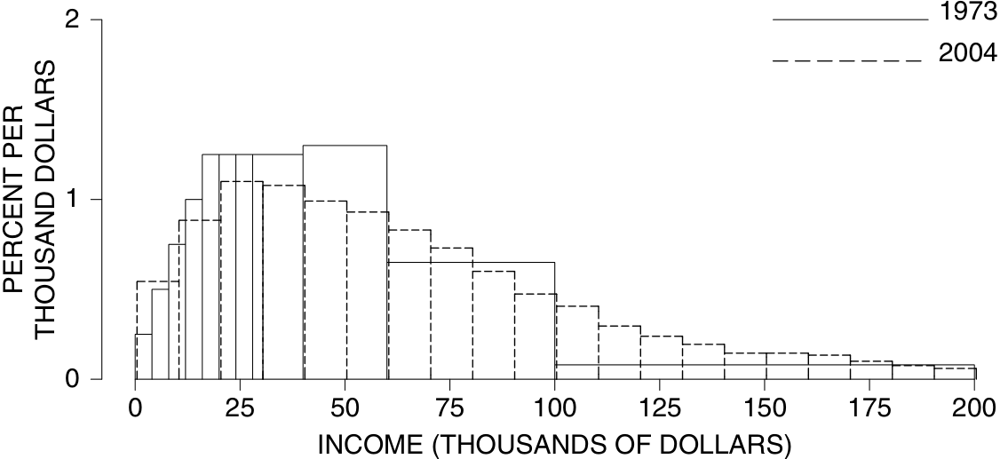

Set B, page 38

1. Biểu đồ năm 1991 được hiển thị tại hình 5 trên trang 39, và lý do cho các đỉnh nhọn (spikes) được thảo luận trên trang đó. Hiện tượng này thường xảy ra do thói quen làm tròn số của người trả lời khảo sát khi báo cáo mức thu nhập của họ.
2. Việc sử dụng các khoảng lớn hơn sẽ làm phẳng (smooths out) phần đồ thị trong khoảng từ 0 đến 8, giúp loại bỏ các nhiễu cục bộ và tập trung vào xu hướng phân phối tổng thể.
3. Trình độ học vấn chung đã tăng lên. Ví dụ, tỷ lệ người hoàn thành chương trình trung học phổ thông và tiếp tục học lên đại học vào năm 1991 cao hơn đáng kể so với năm 1970.
_Nhận xét:_ Trong thế kỷ qua, đã có sự gia tăng đều đặn và đáng kinh ngạc về trình độ học vấn của dân số. Năm 1940, chỉ 25% dân số độ tuổi 25+ hoàn thành trung học. Đến năm 1993, con số này đã lên đến 80% và vẫn tiếp tục tăng.

4. Tăng lên.

Set C, page 41

1. 15% cho mỗi $100.
2. Lựa chọn (ii) là đáp án đúng. Lý do: lựa chọn (i) thiếu đơn vị đo lường, còn lựa chọn (iii) sử dụng sai đơn vị cho khái niệm mật độ (density). Trong biểu đồ histogram, mật độ thường được tính bằng phần trăm trên mỗi đơn vị của trục x.
3. 1,750, 2,000, 1, 0.5. Khái niệm cơ bản về mật độ: Nếu bạn phân bổ đều 10% dữ liệu vào một khoảng có chiều dài 1 cm (tương đương 10 mm), thì mỗi mm sẽ chứa 1% dữ liệu, hay nói cách khác, mật độ là 1% trên mỗi mm.
4. (a) 1,5% mỗi điếu thuốc $\times$ 10 điếu thuốc = 15%. (b) 30% (c) 30% + 20% = 50% (d) 10% (e) 3,5%

Set D, page 44

1. (a) Biến định tính (qualitative)
   - (b) Biến định tính
   - (c) Biến định lượng, liên tục (quantitative, continuous)
   - (d) Biến định lượng, liên tục
   - (e) Biến định lượng, rời rạc (quantitative, discrete)
2. (a) Số lượng trẻ em là một biến rời rạc, vì nó chỉ có thể nhận các giá trị là số nguyên.
   - (b)
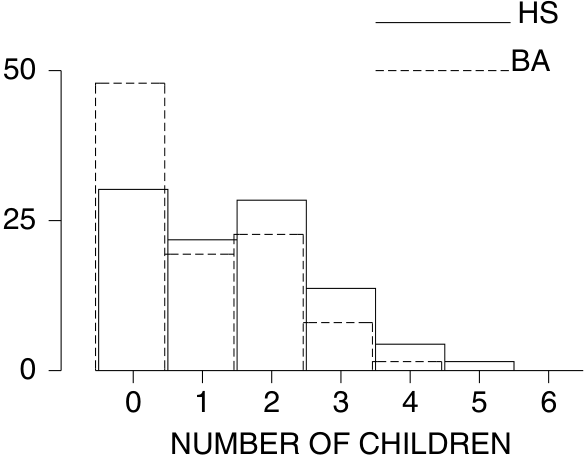
   - (c) Những phụ nữ có trình độ học vấn cao hơn sinh ít con hơn. Điều này được thể hiện thông qua sự dịch chuyển của biểu đồ phân bố số lượng con về phía giá trị nhỏ ở nhóm phụ nữ học vấn cao.

Set E, page 46

1. Nhìn chung, các bà mẹ sinh bốn con có huyết áp cao hơn. Tuy nhiên, điều này không chứng minh được quan hệ nhân quả. Yếu tố tuổi tác đóng vai trò là biến gây nhiễu (confounding factor) ở đây: các bà mẹ sinh bốn con thì đương nhiên lớn tuổi hơn, và tuổi tác lại là nguyên nhân trực tiếp làm tăng huyết áp. (Sau khi kiểm soát yếu tố tuổi tác, Nghiên cứu Thuốc đã kết luận không có mối liên hệ thực sự nào giữa số lượng con và chỉ số huyết áp).
2. Hình bên trái: cộng thêm một hằng số 10 mm vào tất cả các giá trị (tịnh tiến biểu đồ sang phải). Hình bên phải: cộng thêm một tỷ lệ 10% vào tất cả các giá trị (kéo giãn trục x).

Set F, page 48

1. (a) 7% (b) 5%
   - (c) Những người sử dụng thuốc tránh thai có xu hướng có huyết áp cao hơn, dựa trên sự dịch chuyển phân bố về phía bên phải.
2. Việc sử dụng thuốc tránh thai (the pill) có mối liên hệ với việc tăng huyết áp lên vài mm.
3. Những phụ nữ trẻ tuổi hơn trong nghiên cứu lại có huyết áp cao hơn một chút.
_Nhận xét:_ Đây là một sự bất thường (anomaly) rõ rệt. Phần lớn các nghiên cứu tại Mỹ đều chỉ ra rằng huyết áp tâm thu sẽ tăng thuận chiều với tuổi tác. Ngược lại, trong Nghiên cứu Thuốc tránh thai, dữ liệu đo đạc của phụ nữ trẻ lại cao một cách bất thường, còn của phụ nữ lớn tuổi thì lại quá thấp. Nguyên nhân rất có thể bắt nguồn từ sai lệch (bias) trong quy trình đo huyết áp tại phòng khám, khi các nhân viên y tế có xu hướng báo cáo thấp đi (minimize) những trường hợp huyết áp vượt mức 140 mm.

### **Chương 4. Số trung bình và Độ lệch chuẩn**

Set A, page 60

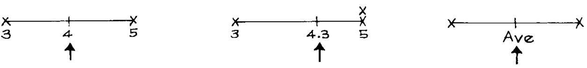

_Nhận xét:_ Khi có hai con số, số trung bình nằm chính giữa chúng. Nếu bạn thêm các giá trị lớn hơn vào danh sách, số trung bình sẽ dịch chuyển lên cao. Ngược lại, các số nhỏ hơn sẽ kéo nó xuống. Dù thế nào, số trung bình luôn bị giới hạn trong khoảng từ giá trị nhỏ nhất đến giá trị lớn nhất trong tập dữ liệu.

2. Nếu số trung bình là 1, toàn bộ danh sách phải bao gồm mười số 1 (do các số được cho là không âm). Nếu số trung bình là 3, danh sách chỉ bao gồm mười số 3. Số trung bình không bao giờ có thể là 4: theo tính chất toán học, nó phải bị kẹp giữa phần tử nhỏ nhất và phần tử lớn nhất trong danh sách (tức là từ 1 đến 3).
3. Số trung bình của danh sách (ii) lớn hơn, bởi vì sự xuất hiện của giá trị ngoại lai lớn là 11 đã kéo mức trung bình lên cao.
4. $(10 \times 66\text{ inches} + 77\text{ inches}) / 11 = 67\text{ inches} = 5\text{ feet } 7\text{ inches}$. Hoặc giải thích theo cách này: người mới vào lớp cao hơn mức trung bình cũ là 11 inches. Do đó, người này đóng góp thêm một khoản chênh lệch là $11\text{ inches} / 11\text{ người} = 1\text{ inch}$ vào số trung bình của lớp.
5. $5\text{ feet } 6 \frac{1}{2}\text{ inches}$. Khi tổng số lượng người trong phòng càng lớn, sự xuất hiện của mỗi một cá nhân mới (dù có cực đoan đến đâu) sẽ càng ít ảnh hưởng đến số trung bình tổng thể. Cụ thể, $22\text{ inches}$ chênh lệch nay được san sẻ cho 44 người, tức là mỗi người đóng góp $0.5\text{ inch}$.
6. $5\text{ feet } 6\text{ inches} + 22\text{ inches} = 7\text{ feet } 4\text{ inches}$: chiều cao này là của một con hươu cao cổ! Để 1 cá thể mới có thể kéo trung bình của 10 cá thể ban đầu tăng thêm tới 2 inches, khoảng chênh lệch tích lũy đòi hỏi phải lên tới $11 \times 2 = 22\text{ inches}$ so với trung bình ban đầu.

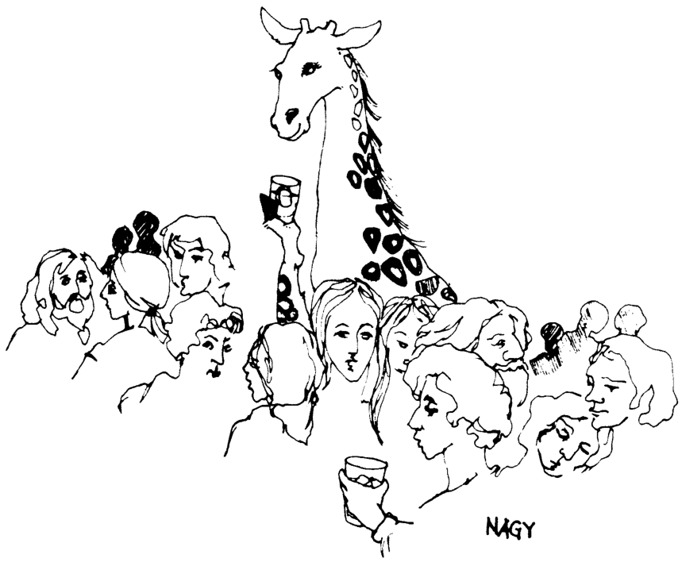

7. Dãy núi Rocky Mountains nằm ở phía đầu bên phải (cao hơn mực nước biển), bang Kansas nằm xoay quanh mốc 0 (mực nước biển), và rãnh Marianas nằm ở phía đầu bên trái trục tọa độ (rất sâu dưới mực nước biển).
8. Kết luận được rút ra là sai logic, bởi vì bản thân dữ liệu chỉ là dữ liệu cắt ngang (cross-sectional) tại một thời điểm, chứ không phải dữ liệu dọc (longitudinal) theo dõi vòng đời của từng cá thể. Những người đàn ông mang huyết áp tâm trương cao có xác suất tử vong sớm cao hơn; vì vậy, khi quan sát ở các nhóm tuổi già hơn, nhóm người này không còn xuất hiện trong biểu đồ nữa. Hơn thế nữa, những người có tiền sử huyết áp cao có nhiều khả năng đang phải dùng các loại thuốc điều hòa huyết áp khi họ có tuổi.
9. Trong các thời kỳ suy thoái kinh tế, các công ty thường ưu tiên sa thải những nhân sự có thâm niên thấp nhất, đồng thời cũng là những người có bậc lương thấp nhất. Việc loại bỏ phần đuôi dưới này làm tăng giả tạo mức lương trung bình của tập thể những người còn giữ được việc. Khi kinh tế phục hồi và các nhân sự lương thấp này được tuyển dụng lại, mức lương trung bình tự động sẽ bị kéo ngược trở lại.
_Nhận xét:_ Việc xác định rõ đối tượng nào được tính—và đối tượng nào bị loại trừ—vào một phép trung bình là vô cùng quan trọng.

Set B, page 65

1. (a) 50 (b) 25 (c) 40
2. (a) trung vị = trung bình (vì phân phối đối xứng). (b) trung vị = trung bình.
   - (c) trung vị nằm phía bên trái của số trung bình—do đặc điểm của cái đuôi dài bên phải (long right-hand tail), phần tử cực trị lớn kéo trung bình lên rất nhiều nhưng trung vị (phần tử đứng giữa) thì ít bị ảnh hưởng.
3. 20
4. Đối với phân phối có đuôi lệch phải, số trung bình luôn phải lớn hơn số trung vị, vì vậy ước lượng hợp lý là 25. (Đáp án tính toán chính xác là 27).
5. Số trung bình sẽ cao hơn. Lý do: mức thu nhập gia đình thường có phân phối lệch phải cực mạnh do tồn tại một nhóm nhỏ các gia đình siêu giàu. Những tỷ phú này đẩy mức trung bình lên rất cao, nhưng trung vị (đại diện cho gia đình đứng ở giữa xã hội) lại không bị tác động.
6. (a) 1 (b) 10 (c) 5 (d) 5 ("Kích thước" - size ở đây có nghĩa là giá trị tuyệt đối, bỏ qua dấu âm/dương).

Set C, page 67

1. (a) trung bình = 0, kích thước r.m.s. = 4. (b) trung bình = 0, kích thước r.m.s. = 10. Xét về tổng thể, các con số nằm trong danh sách (b) có độ lớn (kích thước tuyệt đối) lớn hơn nhiều so với danh sách (a).
2. (a) 10 (làm tròn một chữ số thập phân, đáp án chính xác là 9,0). (b) 20 (làm tròn một chữ số thập phân, đáp án chính xác là 19,8).
   - (c) 1 (làm tròn một chữ số thập phân, đáp án chính xác là 1,3).
   - Mức trung bình của các danh sách này đều bằng 0 do số âm và số dương triệt tiêu nhau; nhưng phép toán r.m.s. (bình phương trước khi lấy trung bình) đã xóa bỏ dấu âm, giữ lại độ lớn thực sự của độ lệch.
3. Đối với cả hai danh sách, giá trị r.m.s. đều là 7. Tất cả các phần tử đều có chung một kích thước (trị tuyệt đối) là 7.
4. Kích thước r.m.s. là 3,2.
5. Kích thước r.m.s. là 3,1.
_Nhận xét:_ Giá trị r.m.s. ở bài tập 5 nhỏ hơn so với bài tập 4. Có một nguyên lý cơ bản ẩn đằng sau: Giả sử chúng ta muốn so sánh mọi phần tử trong một danh sách với một hằng số chung. Kích thước r.m.s. của các khoảng chênh lệch này sẽ thay đổi tùy thuộc vào việc chọn hằng số đó. Toán học có thể chứng minh được rằng kích thước r.m.s. của các khoảng chênh lệch sẽ đạt giá trị nhỏ nhất khi hằng số chung được chọn chính là số trung bình (average) của tập dữ liệu.
6. Các sai số tính toán được lớn hơn rất nhiều so với mức 3,6 (vốn được xác định là kích thước r.m.s. chuẩn). Rõ ràng là đã có trục trặc kỹ thuật hoặc lỗi phát sinh từ máy tính.

Set D, page 70

1. (a) Mức 170 cm cao hơn mức trung bình 24 cm. Độ lệch chuẩn (SD) là 8 cm, vì vậy 24 cm tương đương đúng bằng 3 SDs. (b) 2 cm là 0,25 SDs ($2 / 8 = 0.25$).
   - (c) $1.5 \times 8 = 12\text{ cm}$, cậu bé này cao $146 - 12 = 134\text{ cm}$.
   - (d) thấp nhất: $146 - 18 = 128\text{ cm}$; cao nhất: $146 + 18 = 164\text{ cm}$.
2. (a) 150 cm—gần bằng mức trung bình; độ chênh lệch 4 cm chỉ mới là 0,5 SDs. 130 cm—thấp bất thường; độ chênh lệch 16 cm lên tới 2 SDs. 165 cm—cao bất thường (độ chênh lệch 19 cm, hơn 2 SDs). 140 cm—gần bằng mức trung bình (độ chênh lệch 6 cm, chưa tới 1 SD).
   - (b) Khoảng 68% học sinh nằm trong dải phân bố 138 đến 154 cm ($\text{trung bình} \pm 1\text{ SD}$), và 95% học sinh nằm trong dải phân bố 130 đến 162 cm ($\text{trung bình} \pm 2\text{ SD}$).
3. Lớn nhất là tập (iii); nhỏ nhất là tập (ii).
_Nhận xét:_ Cả ba danh sách này đều chia sẻ chung một mức trung bình là 50 và cùng một dải phạm vi biến thiên (range) từ 0 đến 100. Thế nhưng trong danh sách (iii), dữ liệu có xu hướng phân bổ xa mức 50 hơn (đẩy về hai thái cực). Ngược lại, trong danh sách (ii), hầu hết mọi con số đều bám rất sát mức 50. Điều này cho thấy "sự phân tán" (spread) của dữ liệu còn mang nhiều sắc thái hơn việc chỉ đơn thuần dựa vào phạm vi (range).
4. (a) 1, do tất cả các độ lệch so với mức trung bình 50 đều mang giá trị $\pm 1$. (b) 2 (c) 2 (d) 2 (e) 10.
_Nhận xét:_ Độ lệch chuẩn (SD) biểu thị khoảng cách lệch trung bình của các phần tử. Bạn chỉ cần tự đặt câu hỏi xem nhìn chung, quy mô (kích thước) của các khoản chênh lệch này giống với mức 1, mức 2 hay mức 10 hơn.
5. 25 năm. Số trung bình về độ tuổi có thể rơi vào khoảng 30 tuổi. Nếu SD là 5 năm, thì nhiều người lớn tuổi trong xã hội sẽ cách mức trung bình hàng chục SDs (điều này hoàn toàn vô lý với một phân phối thực tế). Nếu SD là 50 năm, toàn bộ mọi người trong xã hội đều lọt thỏm trong phạm vi 1 SD (cũng hoàn toàn vô lý). Do đó mức hợp lý nhất là 25 năm.
6. (a) (i)
   - (b) (ii) (c) (v)
7. Trong thử nghiệm (i), đã có một lỗi nghiêm trọng: cân nặng của nhóm điều trị cao hơn quá nhiều so với nhóm chứng. Điều này có thể bắt nguồn từ lỗi của quá trình ngẫu nhiên hóa ban đầu. (Xem thêm bài tập 7 ở trang 22).
8. Về mặt lý thuyết, số trung bình và độ lệch chuẩn (SD) giữa hai nhóm phải tương đương nhau do chúng đều đại diện cho cùng một quần thể. Tuy nhiên, nhà điều tra có số lượng mẫu lớn hơn sẽ có xác suất bốc trúng những người đàn ông cao nhất (cũng như thấp nhất) cao hơn rất nhiều. Kích thước mẫu càng lớn thì khoảng phạm vi (range) cũng càng mở rộng. Điều này phản ánh thực tế rằng SD và phạm vi (range) đo lường các đặc tính phân tán hoàn toàn khác nhau.
9. Đặt ước đoán của bạn ở mức trung bình, tức là 69 inches. Dựa trên tính chất của phân phối hình chuông, bạn có khoảng $1/3$ xác suất (cụ thể là khoảng 32%) bị sai số vượt quá 1 SD (tức là lệch quá 3 inches).
10. 3 inches. Độ lệch chuẩn (SD) về bản chất chính là độ lệch r.m.s. (căn bậc hai của trung bình bình phương độ lệch) so với số trung bình. Do đó, khi bạn lấy trung bình làm con số ước đoán, sai số r.m.s. kỳ vọng chính xác bằng giá trị độ lệch chuẩn.

Set E, page 72 

1. Độ lệch chuẩn (SD - Standard Deviation) của danh sách (ii) lớn hơn. Trên thực tế, SD của danh sách (i) là 1, trong khi SD của danh sách (ii) là 2.
*Giải thích chi tiết:* Độ lệch chuẩn đo lường mức độ phân tán của dữ liệu xung quanh giá trị trung bình (average). Nếu dữ liệu trong danh sách (ii) phân bố rộng hơn so với danh sách (i), SD của nó sẽ lớn hơn.

2. Không, độ lệch chuẩn (SD) khác với độ lệch tuyệt đối trung bình (average absolute deviation), do đó phương pháp này là sai.
*Giải thích chi tiết:* Độ lệch tuyệt đối trung bình là trung bình của các giá trị tuyệt đối của sai số so với trung bình, tức là $\frac{1}{n}\sum |x_i - \bar{x}|$. Trong khi đó, độ lệch chuẩn (SD) được tính bằng căn bậc hai của trung bình các bình phương sai số, hay căn quân phương của độ lệch: $\sqrt{\frac{1}{n}\sum (x_i - \bar{x})^2}$. Hai đại lượng này có công thức khác nhau và thường cho kết quả khác nhau.

3. Không, giá trị 0 vẫn được tính, do đó phương pháp này là sai.
*Giải thích chi tiết:* Khi tính toán trung bình hoặc độ lệch chuẩn của một danh sách dữ liệu, số 0 cũng là một điểm dữ liệu hợp lệ và có ảnh hưởng đến tổng số lượng phần tử (kích thước mẫu $n$) cũng như giá trị trung bình. Việc bỏ qua số 0 sẽ làm sai lệch hoàn toàn kết quả.

4. 
   - (a) Cả ba lớp đều có cùng điểm trung bình (average) là $50$.
   - (b) Lớp B có độ lệch chuẩn (SD) lớn nhất; vì có nhiều học sinh có điểm số nằm cách xa điểm trung bình hơn so với các lớp khác.
   - (c) Cả ba lớp đều có cùng biên độ (range). Tuy nhiên, mức độ phân tán của dữ liệu không chỉ phụ thuộc vào biên độ; xem thêm bài tập 3 ở trang 70 để hiểu rõ hơn. *(Giải thích: Biên độ chỉ là hiệu số giữa giá trị lớn nhất và nhỏ nhất, nó không cho biết dữ liệu tập trung hay phân tán như thế nào ở giữa hai khoảng này, đó là lý do SD là một thước đo tốt hơn để đánh giá sự phân tán.)*

5. 
   - (a)
     - (i) Trung bình = $4$; các độ lệch so với trung bình = $-3, -1, 0, 1, 3$; Độ lệch chuẩn (SD) = $2$.
     - (ii) Trung bình = $9$; các độ lệch so với trung bình = $-3, -1, 0, 1, 3$; Độ lệch chuẩn (SD) = $2$.
   - (b) Danh sách (ii) được tạo ra từ danh sách (i) bằng cách cộng thêm $5$ vào mỗi phần tử. Việc này làm cho giá trị trung bình tăng thêm $5$, nhưng không làm thay đổi độ lệch của từng phần tử so với giá trị trung bình mới (vì cả dữ liệu và trung bình đều dịch chuyển cùng một khoảng). Do đó, độ lệch chuẩn (SD) không bị ảnh hưởng. **Kết luận:** Việc cộng thêm cùng một hằng số vào mọi phần tử trong danh sách không làm thay đổi độ lệch chuẩn của danh sách đó.

6. 
   - (a)
     - (i) Trung bình = $4$; các độ lệch so với trung bình = $-3, -1, 0, 1, 3$; Độ lệch chuẩn (SD) = $2$.
     - (ii) Trung bình = $12$; các độ lệch so với trung bình = $-9, -3, 0, 3, 9$; Độ lệch chuẩn (SD) = $6$.
   - (b) Danh sách (ii) được tạo ra từ danh sách (i) bằng cách nhân mỗi phần tử với $3$. Việc này làm cho giá trị trung bình cũng được nhân lên $3$ lần. Đồng thời, các độ lệch so với trung bình cũng tăng lên gấp $3$ lần. Kết quả là độ lệch chuẩn (SD) cũng được nhân lên gấp $3$ lần. **Kết luận:** Việc nhân mọi phần tử trong một danh sách với cùng một số dương sẽ làm độ lệch chuẩn được nhân lên đúng với số đó.

7. 
   - (a)
     - (i) Trung bình = $2$; các độ lệch so với trung bình = $3, -6, 1, -3, 5$; Độ lệch chuẩn (SD) = $4$.
     - (ii) Trung bình = $-2$; các độ lệch so với trung bình = $-3, 6, -1, 3, -5$; Độ lệch chuẩn (SD) = $4$.
   - (b) Danh sách (ii) được tạo ra từ danh sách (i) bằng cách đổi dấu từng phần tử. Thao tác này làm đổi dấu của giá trị trung bình cũng như toàn bộ các độ lệch so với trung bình. Tuy nhiên, nó không làm thay đổi độ lệch chuẩn (SD), bởi vì trong quá trình tính SD, các độ lệch sẽ được bình phương lên (làm mất đi dấu âm).

8. 
   - (a) Việc cộng thêm tiền vào thu nhập sẽ làm tăng giá trị trung bình lên $\$250$, nhưng không làm thay đổi độ lệch chuẩn (SD). *(Giải thích: Tương tự như nguyên lý ở bài tập 5b, tịnh tiến toàn bộ dữ liệu bằng phép cộng một hằng số sẽ làm trung bình thay đổi đúng một lượng bằng hằng số đó, nhưng phương sai và độ lệch chuẩn không thay đổi).*
   - (b) Việc tăng phần trăm thu nhập sẽ làm cả giá trị trung bình và độ lệch chuẩn (SD) tăng thêm $5\%$. *(Giải thích: Việc tăng $5\%$ tương đương với việc nhân tất cả các giá trị với $1.05$. Theo quy tắc ở bài tập 6b, cả trung bình và SD đều sẽ được nhân với hệ số này, tức là tăng $5\%$).*

9. Giá trị căn quân phương (r.m.s. size - root mean square) là $17$, và độ lệch chuẩn (SD) là $0$.
*Giải thích chi tiết:* Nếu độ lệch chuẩn bằng $0$, điều này chứng tỏ tất cả các phần tử trong danh sách đều giống hệt nhau (không có sự phân tán xung quanh trung bình). Trong trường hợp này, mọi giá trị đều bằng $17$ hoặc $-17$. R.m.s size tính toán bình phương của chúng, tính trung bình rồi lấy căn bậc hai, vì vậy r.m.s luôn bằng giá trị tuyệt đối của phần tử đó, tức là $17$.

A–51 

ANSWERS TO EXERCISES _(pages 73–88)_ 

10. Độ lệch chuẩn (SD) nhỏ hơn rất nhiều so với kích thước căn quân phương (r.m.s. size). Xem trang 72.
*Giải thích chi tiết:* Độ lệch chuẩn là căn quân phương của các *độ lệch* so với giá trị trung bình, trong khi r.m.s. size là căn quân phương của *chính các giá trị* dữ liệu gốc. Đối với những tập dữ liệu có trung bình lớn hơn rất nhiều so với sự phân tán, r.m.s. size sẽ bị chi phối bởi giá trị trung bình, khiến nó lớn hơn nhiều so với SD.

11. Không. 
*(Giải thích: Độ lệch chuẩn không thể mang giá trị âm vì nó là kết quả của một phép tính căn bậc hai số học của phương sai (trung bình các bình phương). Độ lệch chuẩn chỉ có thể lớn hơn hoặc bằng $0$, và nó bằng $0$ nếu toàn bộ dữ liệu là các hằng số không đổi).*

12. Có; ví dụ, danh sách $1, 1, 16$ có trung bình là $6$ và độ lệch chuẩn (SD) vào khoảng $7$.
*Giải thích chi tiết:* Ở đây, SD lớn hơn mức trung bình vì dữ liệu bị lệch rất nhiều (skewed) và có một giá trị cực trị lớn (outlier là $16$) kéo SD tăng lên mạnh. Trung bình = $(1+1+16)/3 = 6$. Các độ lệch: $-5, -5, 10$. Phương sai: $((-5)^2 + (-5)^2 + 10^2)/3 = (25 + 25 + 100)/3 = 150/3 = 50$. SD = $\sqrt{50} \approx 7.07$. Do đó, SD lớn hơn trung bình ($7.07 > 6$).

### **Chapter 5. The Normal Approximation for Data (Xấp xỉ Chuẩn cho Dữ liệu)** 

Set A, page 82 

1. 
   - (a) Giá trị $60$ cao hơn trung bình $10$ đơn vị; con số $10$ đó tương đương với $1$ Độ lệch chuẩn (SD). Vì vậy, giá trị $60$ tương ứng với $+1$ trong đơn vị chuẩn (standard units). Tương tự, giá trị $45$ cách trung bình $-5$ đơn vị, tương ứng với $-0.5$ đơn vị chuẩn, và $75$ cách trung bình $+25$ đơn vị, tương ứng với $+2.5$ đơn vị chuẩn. *(Giải thích: Đơn vị chuẩn - hay điểm $z$ - được tính bằng công thức $z = \frac{x - \mu}{\sigma}$. Với $\mu = 50$ và $\sigma = 10$).*
   - (b) Giá trị $0$ trong đơn vị chuẩn tương ứng với mức trung bình, tức là điểm số $50$. Một điểm số tương ứng với $1.5$ trong đơn vị chuẩn nghĩa là nó cao hơn trung bình $1.5$ SD; tương đương với việc cao hơn trung bình $1.5 \times 10 = 15$ điểm, tức là điểm số $65$. Điểm số $22$ sẽ tương ứng với $\frac{22 - 50}{10} = -2.8$ trong đơn vị chuẩn.

2. Giá trị trung bình là $10$; độ lệch chuẩn (SD) là $2$.
   - (a) Khi quy đổi sang đơn vị chuẩn (điểm $z$), danh sách trở thành: $+1.5, -0.5, +0.5, -1.5, 0$.
     *(Giải thích: Từ danh sách gốc, ta dùng công thức $z = \frac{x - 10}{2}$ cho mỗi phần tử để nhận được danh sách trên).*
   - (b) Danh sách sau khi chuyển đổi có giá trị trung bình là $0$ và độ lệch chuẩn (SD) là $1$. (Điều này luôn luôn đúng: khi bất kỳ danh sách dữ liệu nào được chuyển đổi sang đơn vị chuẩn, nó sẽ luôn có giá trị trung bình bằng $0$ và SD bằng $1$. Đây là bản chất của phép chuẩn hóa (standardization)).

Set B, page 84 

1. (a) $11\%$ (b) $34\%$ (c) $79\%$ (d) $25\%$ (e) $43\%$ (f) $13\%$
*(Giải thích: Các phần trăm này tương ứng với diện tích dưới đường cong phân phối chuẩn tiêu chuẩn nằm trong các khoảng cho trước được tra cứu từ bảng phân phối chuẩn z-table).*

2. (a) $1$ (b) $1.15$ 

3. 
   - (a) $1.65$ 
   - (b) $1.30$. Lưu ý rằng đây KHÔNG PHẢI là cùng một giá trị $z$ giống như ở câu (a). 

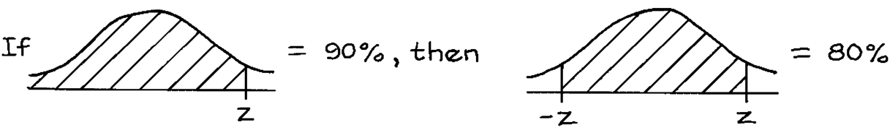

4. 
   - (a) $100\% - 39\% = 61\%$. *(Giải thích: Do tính chất đối xứng của đường cong chuẩn, hoặc dùng phần bù của xác suất để tính toán phần diện tích còn lại dưới đường cong).*
   - (b) Không thể xác định nếu không có thêm thông tin.

5. 
   - (a) $58\% \div 2 = 29\%$. *(Giải thích: Vì đường cong chuẩn có tính chất đối xứng qua tâm $z = 0$, diện tích từ khoảng $0$ đến một điểm $z$ dương bằng một nửa tổng diện tích từ $-z$ đến $z$).*
   - (b) $50\% - 29\% = 21\%$. *(Giải thích: Diện tích từ tâm $z=0$ đến tận cùng bên phải của đường cong ($+\infty$) luôn bằng $50\%$. Ta trừ đi khoảng từ $0$ đến $z$ vừa tính được để tìm diện tích phần đuôi bên phải).*
   - (c) Không thể xác định nếu không có thêm thông tin.

Set C, page 88 

1. (a) 

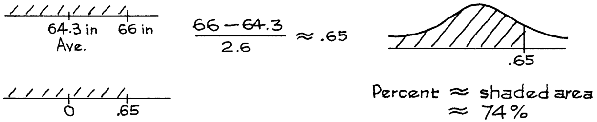

   - (b) $69\%$ 
   - (c) $0.2$ của $1\%$ (tức là $0.002$ hay $0.2\%$). 

A–52 ANSWERS TO EXERCISES _(pages 88–111)_ 

2. (a) $77\%$ (b) $69\%$ 

3. Trong Hình 2, phần trăm số lượng phụ nữ có chiều cao nằm trong khoảng từ $61$ inch đến $66$ inch hoàn toàn chính xác bằng với diện tích nằm dưới biểu đồ tần suất (histogram), và chỉ xấp xỉ bằng (approximately equal) với diện tích nằm dưới đường cong phân phối chuẩn (normal curve).
*Giải thích chi tiết:* Biểu đồ histogram phản ánh chính xác dữ liệu thực tế thu thập được, do đó diện tích của nó chính là tỷ lệ phần trăm chính xác. Tuy nhiên, đường cong phân phối chuẩn chỉ là một mô hình toán học trơn tru để *xấp xỉ* bộ dữ liệu, do đó nó thường có một mức độ sai số nhất định so với phân bố thực tế.

Set D, page 89 

1. 
   - (a) $75\%$ 
   - (b) $\$29,000$ 
   - (c) $75\%$. **Lý do:** Ta có $90\% - 10\% = 80\%$ số liệu nằm trong khoảng từ $\$15,000$ đến $\$135,000$. Khoảng từ $\$15,000$ đến $\$125,000$ gần như là cùng một khoảng nhưng hẹp hơn một chút, do đó con số $75\%$ là một ước lượng xấp xỉ hợp lý.

2. $5, 95$.

3. $\$7,000$. 

4. Diện tích nằm ở phía bên trái của bách phân vị thứ 25 (25th percentile) bắt buộc phải bằng đúng $25\%$ của tổng diện tích. Do đó, điểm bách phân vị thứ 25 phải có giá trị nhỏ hơn khá nhiều so với mức $25$ mm.
*Giải thích chi tiết:* Bách phân vị thứ $p$ của một phân phối là giá trị mà tại đó $p\%$ dữ liệu có giá trị nhỏ hơn hoặc bằng nó. Dựa trên hình dạng phân bố, điểm cắt chia $25\%$ diện tích nằm bên trái không tỷ lệ thuận tuyến tính với trục tọa độ, dẫn đến giá trị thực tế của nó sẽ lệch nhỏ hơn khá nhiều.

5. 
   - (a) Phân phối này có phần đuôi dày hơn (fatter tails) so với phân phối chuẩn thông thường. *(Giải thích: Hiện tượng đuôi dày, hay kurtosis lớn, có nghĩa là có nhiều dữ liệu tập trung ở vùng giá trị cực đoan (outliers) hơn so với mô hình phân phối chuẩn lý tưởng).*
   - (b) Khoảng tứ phân vị (interquartile range - IQR) là khoảng $15$. *(Giải thích: IQR là khoảng cách giữa bách phân vị thứ 75 (Q3) và bách phân vị thứ 25 (Q1). IQR = Q3 - Q1, đại diện cho độ phân tán của $50\%$ dữ liệu nằm ở giữa tập dữ liệu).*

Set E, page 92 

1. Cô ấy cao hơn mức trung bình $2.15$ Độ lệch chuẩn (SDs), tương ứng nằm ở vị trí bách phân vị thứ $98$ (98th percentile).
*Giải thích chi tiết:* Một giá trị $z = 2.15$ trên đường cong phân phối chuẩn (tương đương với nằm trên mức trung bình $2.15$ SD) có diện tích phía bên trái (tích lũy từ $-\infty$) xấp xỉ $98.4\%$. Việc làm tròn cho thấy cô ấy xuất sắc hơn khoảng $98\%$ số người khác.

2. Điểm số đó cao hơn mức trung bình $0.85$ Độ lệch chuẩn (SD). Điều này tương đương với $0.85 \times 100 \approx 85$ điểm cao hơn trung bình. Do đó, điểm số đó là $535 + 85 = 620$.

3. $2.75$ điểm — tương đương với mức điểm thấp hơn trung bình $0.50$ Độ lệch chuẩn (SDs).

Set F, page 93 

1. 
   - (a) Giá trị trung bình mới là:
     $$ \frac{5}{9} \times (98.6 - 32) = 37.0 $$
     Độ lệch chuẩn (SD) mới là:
     $$ \frac{5}{9} \times 0.3 = 0.17 $$
     *(Giải thích: Đây là quá trình chuyển đổi nhiệt độ từ thang độ Fahrenheit sang thang độ Celsius, sử dụng công thức $C = \frac{5}{9}(F - 32)$. Áp dụng quy tắc tuyến tính, mức trung bình bị thay đổi theo cả phép trừ và phép nhân, trong khi độ lệch chuẩn chỉ bị ảnh hưởng bởi phép nhân hệ số góc là $5/9$).*
   - (b) Trong đơn vị chuẩn (standard units), sự thay đổi về mặt thang đo tỷ lệ bị triệt tiêu hoàn toàn, vì vậy kết quả điểm $z$ không đổi và vẫn là $1.5$.
     *(Giải thích: Điểm chuẩn $z = \frac{x - \mu}{\sigma}$. Nếu áp dụng một phép biến đổi tuyến tính $y = ax + b$, thì $z_y = \frac{y - \mu_y}{\sigma_y} = \frac{(ax+b) - (a\mu+b)}{a\sigma} = \frac{a(x-\mu)}{a\sigma} = \frac{x - \mu}{\sigma} = z_x$. Vì $a$ (hệ số tỷ lệ dương) bị triệt tiêu, điểm chuẩn $z$ của một giá trị là bất biến, không phụ thuộc vào đơn vị gốc của dữ liệu).*

### **Chapter 7. Plotting Points and Lines (Vẽ Các Điểm và Đường Thẳng)** 

Set A, page 111 

1. Tọa độ các điểm: $A = (1, 2)$, $B = (4, 4)$, $C = (5, 3)$, $D = (5, 1)$, $E = (3, 0)$.

2. Tọa độ $x$ tăng thêm $3$, tọa độ $y$ tăng thêm $2$.
*(Giải thích: Đây là sự thay đổi khi di chuyển từ điểm này sang điểm khác; $\Delta x = 3$ và $\Delta y = 2$).*

3. Điểm D.

ANSWERS TO EXERCISES _(pages 112–114)_ A–53 

Set B, page 112 

1. Cả bốn điểm đều cùng nằm trên một đường thẳng.

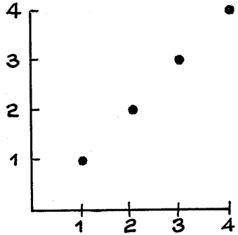

2. Điểm dị biệt (maverick/outlier) là điểm $(1, 2)$ và nó nằm ở vị trí phía trên của đường thẳng.

3. Tất cả các điểm đều nằm trên một đường thẳng. Dữ liệu bảng tọa độ là:

| $x$ | $y$ |
|:---:|:---:|
| 1 | 3 |
| 2 | 5 |
| 3 | 7 |
| 4 | 9 |

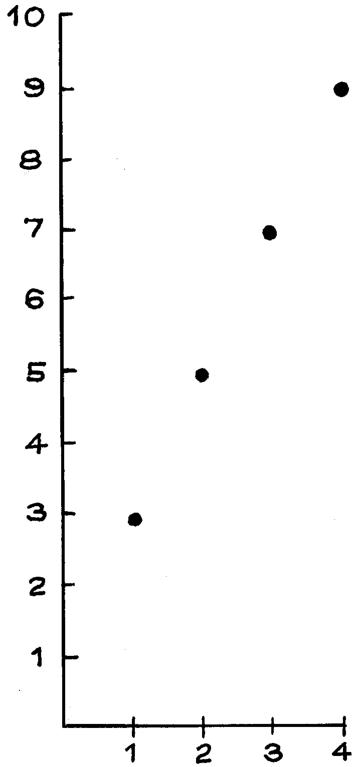

4. Điểm $(1, 2)$ nằm ngoài đường thẳng (out); điểm $(2, 1)$ nằm trên đường thẳng (in).

5. Điểm $(1, 2)$ nằm trên đường thẳng (in); điểm $(2, 1)$ nằm ngoài đường thẳng (out).

6. Điểm $(1, 2)$ nằm trên đường thẳng (in); điểm $(2, 1)$ nằm ngoài đường thẳng (out).

Set C, page 114 

1. 

| Đặc điểm đường thẳng | Hình 16 (Fig. 16) | Hình 17 (Fig. 17) | Hình 18 (Fig. 18) |
|---|---|---|---|
| Độ dốc (Slope) | $-1/4$ inch mỗi pound | $5$ | $1$ |
| Tung độ gốc (Intercept) | $1$ inch | $-10$ | $0$ |

_Note:_ Trong Hình 18, các trục tọa độ cắt nhau tại điểm gốc mới là tọa độ $(2, 2)$.

A–54 ANSWERS TO EXERCISES _(pages 115–116)_ 

Set D, page 115 

1. 

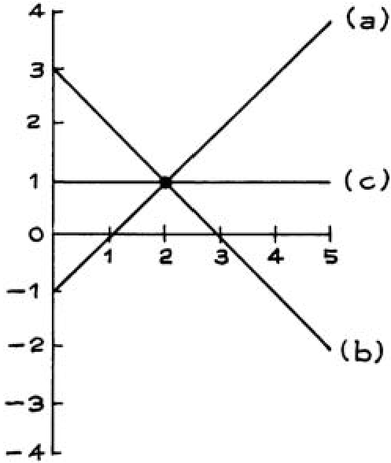

2. Nằm trên đường thẳng.

3. Nằm trên đường thẳng.

4. Nằm ở phía trên đường thẳng.

5. 

6. 

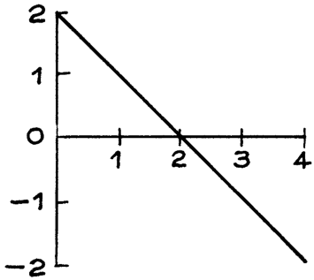

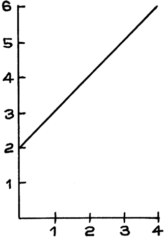

Set E, page 116 

1. 

| Câu hỏi | Độ dốc (Slope) | Tung độ gốc (Intercept) | Chiều cao (Giá trị $y$) tại $x = 2$ |
|:---:|:---:|:---:|:---:|
| (a) | 2 | 1 | 5 |
| (b) | $1/2$ | 2 | 3 |

*Giải thích chi tiết:* Đường thẳng có phương trình dạng $y = mx + b$, với $m$ là độ dốc và $b$ là tung độ gốc.
- Ở câu (a), phương trình là $y = 2x + 1$. Khi thay $x = 2$, ta tính được $y = 2(2) + 1 = 5$.
- Ở câu (b), phương trình là $y = \frac{1}{2}x + 2$. Khi thay $x = 2$, ta tính được $y = \frac{1}{2}(2) + 2 = 3$.

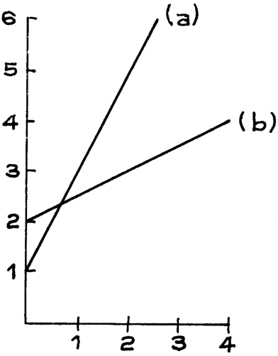

ANSWERS TO EXERCISES _(pages 116–123)_ A–55 

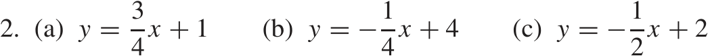

3. Tất cả các điểm đều nằm trên đường thẳng có phương trình $y = 2x$.
*(Giải thích: Điều này có nghĩa là mọi điểm dữ liệu đều biểu diễn một tỷ lệ thuận hoàn hảo, với giá trị trục tọa độ tung ($y$) luôn gấp đôi giá trị của trục tọa độ hoành ($x$)).*

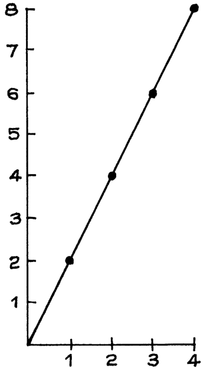

4. Tất cả các điểm đều nằm trên đường thẳng có phương trình $y = x$.
*(Giải thích: Đường thẳng $y = x$ là đường phân giác của góc phần tư thứ nhất và thứ ba, thể hiện sự bằng nhau hoàn hảo giữa hai biến số tương ứng trên trục tọa độ).*

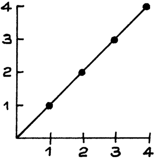

5. 
   - (a) Nằm trên đường thẳng (on the line).
   - (b) Nằm ở phía trên đường thẳng (above the line).
   - (c) Nằm ở phía dưới đường thẳng (below the line).

6. Cả ba phát biểu đều đúng. Nếu bạn hiểu rõ cách giải quyết các bài tập 4, 5 và 6, bạn đã được trang bị một nền tảng vững chắc để chuyển sang học Phần III.

## **Part III. Correlation and Regression (Phần III. Tương Quan và Hồi Quy)** 

### **Chapter 8. Correlation (Chương 8. Tương Quan)** 

Set A, page 122 

1. 
   - (a) Người cha lùn nhất có chiều cao là $59$ inch; con trai của ông ấy có chiều cao là $65$ inch. *(Giải thích: Ta quan sát điểm dữ liệu xa nhất về phía trái trên trục $x$ đại diện cho chiều cao của cha, và đối chiếu sang trục $y$ để thấy chiều cao con trai).*
   - (b) Người cha cao nhất có chiều cao là $75$ inch; con trai của ông ấy có chiều cao là $70$ inch. *(Giải thích: Tương tự, quan sát điểm cực phải trên trục $x$ và đối chiếu cao độ sang trục $y$).*
   - (c) Cha cao $76$ inch, con cao $64$ inch. *(Giải thích: Xác định dựa vào việc ngóng tọa độ điểm của từng trường hợp).*
   - (d) Có hai người: với chiều cao lần lượt là $69$ inch và $70$ inch.
   - (e) Chiều cao trung bình (ave) = $68$ inch. 
   - (f) Độ lệch chuẩn (SD) = $3$ inch.

2. Đồ thị phân tán (Scatter plot) giữa $x$ và $y$

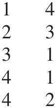

A–56 ANSWERS TO EXERCISES _(pages 123–130)_ 

3. 
(a) Giá trị trung bình $\text{ave } x = 1.5$.
(b) Độ lệch chuẩn $\text{SD } x = 0.5$.
(c) Giá trị trung bình $\text{ave } y = 2$.
(d) Độ lệch chuẩn $\text{SD } y = 1.5$.
*(Lưu ý: Các giá trị này được tính toán từ các công thức cơ bản của trung bình và độ lệch chuẩn của một tập dữ liệu rút gọn).*

4. 

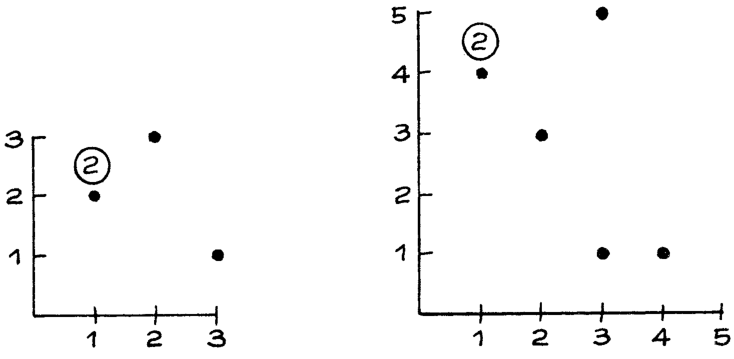

5. 
(a) A, B, F.
(b) C, G, H.
(c) Giá trị trung bình $\text{ave} \approx 50$.
(d) Độ lệch chuẩn $\text{SD} \approx 25$.
(e) Giá trị trung bình $\text{ave} \approx 30$.
(f) Sai (False).
(g) Sai (False), mối liên hệ ở đây là tương quan âm (negative association), tức là khi biến này tăng thì biến kia có xu hướng giảm.

6. 
(a) 75.
(b) 10.
(c) 20.
(d) Bài thi cuối kỳ (The final). Do bài thi cuối kỳ có độ lệch chuẩn (SD) lớn hơn.
(e) Bài thi cuối kỳ (The final).
(f) Đúng (True).

**Bài tập Nhóm B, trang 128**

1. 
(a) Tương quan âm (Negative). Tuổi thọ của xe càng cao thì giá trị của xe trên thị trường càng thấp. Điều này hoàn toàn hợp lý vì ô tô cũ thường bị khấu hao và mất giá theo thời gian.
(b) Tương quan âm (Negative). Xe càng nặng thì hiệu suất sử dụng nhiên liệu càng kém (tiêu hao nhiều nhiên liệu hơn). Động cơ phải tiêu tốn nhiều năng lượng hơn để di chuyển một khối lượng lớn.

2. 
- Hình bên trái: Trung bình $\text{ave } x = 3.0$, độ lệch chuẩn $\text{SD } x = 1.0$, trung bình $\text{ave } y = 1.5$, độ lệch chuẩn $\text{SD } y = 0.5$. Đây là tương quan dương (positive correlation) do đám mây điểm có xu hướng đi lên từ trái sang phải.
- Hình bên phải: Trung bình $\text{ave } x = 3.0$, độ lệch chuẩn $\text{SD } x = 1.0$, trung bình $\text{ave } y = 1.5$, độ lệch chuẩn $\text{SD } y = 0.5$. Đây là tương quan âm (negative correlation) do đám mây điểm có xu hướng đi xuống từ trái sang phải.
*(Có thể thấy rằng hai tập dữ liệu có cùng các tham số thống kê cơ bản là trung bình và độ lệch chuẩn nhưng lại có chiều hướng tương quan trái ngược nhau hoàn toàn).*

3. Biểu đồ phân tán ở bên trái có hệ số tương quan gần với 0 hơn. Lý do là các điểm dữ liệu phân tán rộng hơn, tạo thành một đám mây tròn và ít bám sát vào một đường thẳng so với biểu đồ bên phải.

4. Hệ số tương quan khoảng $0.5$. Sự phân tán ở mức độ vừa phải cho thấy có một mối quan hệ đồng biến tương đối, không quá chặt chẽ cũng không quá rời rạc.

5. Hệ số tương quan gần như bằng $0$.
*Bình luận:* Trong lĩnh vực tâm lý học, hiện tượng này được gọi là "sự suy giảm tương quan" (attenuation). Khi bạn giới hạn phạm vi (restrict the range) của một biến (chẳng hạn chỉ lấy nhóm mẫu có chỉ số rất hẹp), điều đó thường làm cắt giảm mạnh hệ số tương quan thực tế giữa biến đó với một biến khác, vì tính biến thiên của dữ liệu đã bị loại bỏ phần lớn.

6. 
(a) Hệ số tương quan sẽ bằng $1$. Nếu tuổi của chồng luôn luôn bằng tuổi của vợ cộng thêm một hằng số chính xác, tất cả các điểm trên biểu đồ phân tán sẽ nằm hoàn hảo trên một đường thẳng dốc lên.
(b) Hệ số tương quan sẽ gần bằng $1$. Thực tế trường hợp này tương tự như phần (a) nhưng sẽ có thêm một chút "nhiễu" (noise) ném vào dữ liệu, vì độ chênh lệch tuổi của các cặp vợ chồng là không giống hệt nhau.
*Bình luận:* Trong Khảo sát Dân số Hiện tại (Current Population Survey) tháng 3 năm 2005, hệ số tương quan giữa tuổi của chồng và tuổi của vợ xấp xỉ $0.93$; trung bình, những người chồng lớn hơn vợ họ $2.3$ tuổi.

7. 
(a) Gần bằng $-1$: Độ tuổi của bạn càng cao thì năm sinh của bạn bắt buộc phải càng nhỏ (càng lùi về quá khứ). Tuy nhiên, có một chút sai số nhỏ (fuzz) phụ thuộc vào việc sinh nhật của bạn diễn ra trước hay sau ngày bạn điền bảng câu hỏi khảo sát trong năm đó.
(b) Hơi dương (Somewhat positive). Thường thì người lớn tuổi hơn sẽ có xu hướng tích lũy được nhiều kinh nghiệm và tài sản hơn, dẫn đến mức thu nhập có thể cao hơn, nhưng mối liên hệ này không quá chặt chẽ trong đời thực.

8. 
(a) Hơi dương (Somewhat positive). Mặc dù thu nhập của người vợ bắt buộc phải nhỏ hơn hoặc bằng tổng thu nhập gia đình (vì tổng là kết quả cộng gộp), hai biến này thường có tương quan đồng biến. Thu nhập người vợ tăng góp phần trực tiếp làm tổng thu nhập gia đình tăng.
(b) Gần bằng $-1$. Giả sử tổng thu nhập của gia đình gần như là một hằng số không đổi (bị giới hạn trong một dải hẹp), thì người vợ kiếm được càng nhiều tiền, số tiền người chồng kiếm được sẽ bắt buộc phải càng ít đi để tổng không thay đổi.
*Bình luận:* Trong Khảo sát Dân số Hiện tại tháng 3 năm 2005, hệ số tương quan giữa thu nhập của vợ và tổng thu nhập gia đình là khoảng $0.70$. Tuy nhiên, nếu chỉ xét trong nhóm các gia đình có tổng thu nhập nằm chặt trong khoảng \$80,000–\$90,000, hệ số tương quan giữa thu nhập của chồng và thu nhập của vợ lại giảm sâu xuống mức $\approx -0.98$.

9. Sai (False): Xem giải thích ở trang 126. Hệ số tương quan đo lường mức độ chặt chẽ của mối quan hệ tuyến tính, chứ không phải tỷ lệ các điểm bám sát một quy tắc toán học đơn điệu.

**Bài tập Nhóm C, trang 131**

1. 
(a) Đúng (True).
(b) Sai (False).

2. Đường nét đứt (Dashed line).

3. Chiều cao của anh ấy cao hơn mức trung bình 1 độ lệch chuẩn ($\text{SD}$). Do điểm dự đoán phải bám sát đường tuyến tính nếu tương quan cao, cân nặng của anh ấy được ước lượng cũng cao hơn mức trung bình tương ứng. Vậy cân nặng ước tính là $140 + 20 = 160$ pounds.
4. (a) Có (Yes). (b) Không (No). (c) Có (Yes).

**Bài tập Nhóm D, trang 134**

1. 
(a) 
Giá trị trung bình của $x = 4$, độ lệch chuẩn của $x = 2$
Giá trị trung bình của $y = 4$, độ lệch chuẩn của $y = 2$

| Đơn vị chuẩn của $x$ | Đơn vị chuẩn của $y$ | Tích (Product) |
|---|---|---|
| $-1.5$ | $1.0$ | $-1.50$ |
| $-1.0$ | $1.5$ | $-1.50$ |
| $-0.5$ | $0.5$ | $-0.25$ |
| $0.0$ | $0.0$ | $0.00$ |
| $0.5$ | $-0.5$ | $-0.25$ |
| $1.0$ | $-1.5$ | $-1.50$ |
| $1.5$ | $-1.0$ | $-1.50$ |

Hệ số tương quan $r$ = trung bình của các tích số $\approx -0.93$.

(b) Bằng phương pháp tính toán tương tự, thu được $r = 0.82$.
(c) Không cần thực hiện tính toán cũng có thể suy ra $r = -1$. Tất cả các điểm đều nằm chính xác hoàn hảo trên một đường thẳng có độ dốc âm, với phương trình là $y = 8 - x$. Khi tập dữ liệu bám tuyệt đối vào một đường thẳng đi xuống, tương quan luôn bằng $-1$.

2. Khoảng 50%. (Dựa trên cấu trúc đối xứng của phân phối và đám mây điểm, tỷ lệ cá thể nằm ở nửa trên so với một trục trung tâm là khoảng một nửa).

3. Khoảng 25%.

4. Khoảng 5%. (Đây là khu vực phần đuôi xa của phân phối, nơi mật độ dữ liệu rất thưa thớt).

### **Chương 9. Chi tiết hơn về Tương quan (Correlation)**

**Bài tập Nhóm A, trang 143**

1. 
(a) Gần như giống nhau (About the same). Hệ số tương quan phản ánh mức độ tuyến tính chứ không bị ảnh hưởng bởi đơn vị đo (dù tính bằng tiền hay logarit v.v.).
(b) Giá trị lớn nhất (maximum) bắt buộc phải lớn hơn giá trị nhỏ nhất (minimum) đối với bất kỳ bộ dữ liệu nào có sự biến thiên thực tế.

2. Không (No): Hệ số tương quan giữa $x$ và $y$ hoàn toàn bằng với hệ số tương quan giữa $y$ và $x$. Phép tính $r$ mang tính đối xứng toán học.

3. Hệ số tương quan $r$ không thay đổi (stays the same). Tịnh tiến toàn bộ dữ liệu (cộng/trừ một lượng không đổi) không làm suy xuyển mối quan hệ tuyến tính.

4. Hệ số tương quan $r$ không thay đổi (stays the same). Nhân toàn bộ dữ liệu với một hằng số dương (chuyển đổi thang đo/đơn vị) không ảnh hưởng tới sự liên hệ tương đối giữa các điểm.

5. Hệ số tương quan $r$ thay đổi. (Ví dụ khi có thêm phần tử bất thường lớn, r có thể biến động).

6. (a) Tăng lên (Up). (b) Giảm xuống (Down). (c) Đảo ngược dấu (Reverses the sign - nếu nhân với số âm).

7. 
(a) Bằng $1$. Mối quan hệ chuyển đổi đơn vị đo lường cơ bản (inch sang cm) là tuyến tính hoàn hảo.
(b) Giảm xuống (Goes down).
(c) Hệ số $r$ sẽ nhỏ hơn $1$. Dù đo cùng một đối tượng, nhưng "sai số đo lường" (measurement error) ở mỗi lần đo ngẫu nhiên sẽ làm cho dữ liệu không còn bám thành một đường thẳng hoàn hảo $100\%$ nữa.

8. Hệ số tương quan sẽ giảm xuống (trên thực tế là giảm xuống khoảng $0.25$). Bằng cách thu hẹp dải dữ liệu, ta đang tạo ra "hiệu ứng suy giảm" (attenuation).

9. Hệ số tương quan được đo trên toàn bộ khoảng thời gian một năm sẽ lớn hơn; ví dụ như, thời tiết sẽ rất lạnh vào mùa đông và rất nóng vào mùa hè ở cả hai thành phố được đem ra so sánh.
*Bình luận.* Đây là một ví dụ rõ rệt khác của "sự suy giảm tương quan" (attenuation, xem bài tập 5 ở trang 130). Trong biểu đồ phân tán bên dưới, các dấu chữ thập biểu diễn dữ liệu của tháng 6 năm 2005 ($r = 0.42$); các dấu chấm tròn biểu diễn dữ liệu cho các ngày trong những tháng còn lại; hệ số tương quan tổng hợp cho toàn bộ 365 ngày lên tới $0.92$. Việc chỉ lấy tiêu điểm là tháng 6 đã làm hạn chế nghiêm trọng phạm vi dao động của nhiệt độ, và làm suy yếu (attenuates) độ mạnh của tương quan.

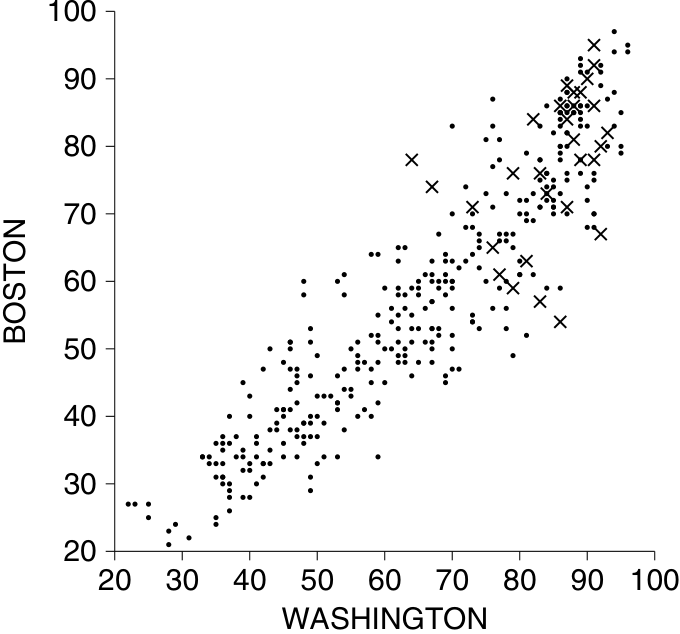

10. Tập dữ liệu (iii) giống hệt với tập (ii), chỉ hoán đổi vị trí trục $x$ và $y$; do tính đối xứng nên $r$ vẫn là $0.7857$. Tập dữ liệu (iv) có được từ tập (i), bằng cách cộng thêm $1$ vào mỗi giá trị $x$, tịnh tiến không đổi $r$ nên $r$ là $0.8571$. Tập dữ liệu (v) được tạo ra từ tập (i) bằng cách nhân đôi mỗi giá trị $y$, đổi thang đo không đổi $r$ nên $r$ vẫn là $0.8571$. Tập dữ liệu (vi) có được từ tập (ii) bằng cách trừ $1$ khỏi mỗi giá trị $x$, và nhân mỗi giá trị $y$ với $3$, cũng không thay đổi mức độ gắn kết tuyến tính nên $r$ vẫn là $0.7857$.

**Bài tập Nhóm B, trang 145**

1. Mỗi biểu đồ một cách riêng lẻ có hệ số tương quan dao động gần $0.6$. Nhưng khi gộp tất cả chúng lại với nhau trong một mẫu lớn, xu hướng tổng thể trông sát với một đường thẳng hơn rất nhiều, và hệ số tương quan tăng vọt lên gần $0.9$ — đây chính là hiệu ứng "suy giảm bị đảo ngược" (attenuation in reverse) khi dải quan sát được mở rộng hết mức.

2. Lớn hơn $0.67$ một chút. Điều này hoàn toàn mang tính hệ quả giống như bài tập trước: khi bạn thu thập và tổng hợp dữ liệu của tất cả trẻ em ở đủ các nhóm tuổi lại với nhau, tập dữ liệu sẽ phân tán rộng và tạo thành tính tuyến tính chặt chẽ hơn so với việc lấy mẫu trên một độ tuổi hẹp. Hãy xem lại bài tập 9 ở trang 144.

3. Có (Yes); điểm khác biệt duy nhất ở biểu đồ chỉ là sự thay đổi về thang đo (change of scale). Hệ số tương quan độc lập với thang đo.

4. Có (Yes); dạng dữ liệu này trông giống như bất kỳ biểu đồ nào trong bài tập trước, vì vậy $r \approx 0.7$.

**Bài tập Nhóm C, trang 148**

1. Biểu đồ (i) nên sử dụng $r$ để tóm tắt dữ liệu (vì đây là đám mây điểm tuyến tính chuẩn), trong khi (ii) và (iii) thì KHÔNG NÊN. Biểu đồ (ii) có điểm ngoại lai làm méo mó kết quả của $r$, còn biểu đồ (iii) thể hiện hình thái cong phi tuyến tính.

2. Sai (False): Hãy xem lại đồ thị (iii) trong bài tập 1, dữ liệu tạo hình vòng cung rõ rệt. Tương quan bằng 0 không có nghĩa là không có bất kỳ mối quan hệ nào, mà chỉ là không có mối liên hệ *tuyến tính* nào.

3. Gần bằng $1$. Ở đây có một sự gắn kết mạnh mẽ và liền mạch, nhưng mối quan hệ giữa hai biến mang đặc trưng của phương trình bậc hai (quadratic) thay vì đường thẳng bậc nhất (linear), vì vậy hệ số tương quan tuyến tính không thể đạt mức điểm tuyệt đối là $1$.

4. Cả hai phát biểu đều sai. Bạn bắt buộc phải vẽ và quan sát biểu đồ phân tán (scatter diagram) để kiểm tra bằng mắt thường xem có sự tồn tại của các điểm ngoại lai (outliers) hoặc hiện tượng phi tuyến tính làm sai lệch con số $r$ tĩnh hay không.

**Bài tập Nhóm D, trang 149**

1. 
(a) Không có biểu đồ cụ thể nào được đưa ra trong đề.
(b) Đúng (True).
(c) Điều này không thể được xác định từ những dữ liệu đang có (nhưng trên thực tế nó được cho là đúng bởi các nghiên cứu khoa học khác).

2. Không (No). Hệ số tương quan được tính bằng cách dùng giá trị tỷ lệ (rates) như mức trung bình của nhóm, rất có khả năng sẽ phóng đại cường độ thực sự của mối liên hệ, so với khi tính toán mức độ phân tán giữa từng cá thể độc lập trong nhóm.

**Bài tập Nhóm E, trang 152**

1. Thông số thời lượng (Duration) chỉ được đo lường chính xác xấp xỉ làm tròn đến con số $2$ triệu năm; biến số này cực kỳ khó để xác định một cách tuyệt đối chính xác trong thực tế.

2. Có (Yes), và việc dùng dữ liệu gộp nhóm (tổng thể chung) này thường sẽ phóng đại mức độ gắn bó chặt chẽ của mối tương quan.

3. (a) Đúng. (b) Đúng. (c) Đúng. (d) Sai. 
*Bài học rút ra:* Có sự tương quan (association) hoàn toàn KHÔNG đồng nghĩa với việc có sự nhân quả (causation).

4. Có thể đúng (Probably), nhưng khẳng định này không suy diễn một cách lô-gic từ dữ liệu. Có khi sự thật là ngược lại, những người có xu hướng gặp khó khăn và đọc kém lại thích dùng nhiều thời gian để xem tivi hơn — tức là nhân quả chạy theo chiều ngược lại. Xét cho cùng, hệ số tương quan giữa $x$ và $y$ về mặt toán học bằng chính hệ số tương quan giữa $y$ và $x$.

5. Cách giải thích tốt nhất là ở mối liên hệ ẩn gián tiếp giữa việc uống cà phê và thói quen hút thuốc lá. Những người thích uống cà phê thường có xu hướng hút thuốc. Hút thuốc mới chính là nguyên nhân tạo ra rắc rối về tim. Cà phê chỉ đơn thuần mang yếu tố tương quan trùng lặp.

6. Đây là một cuộc nghiên cứu mang tính quan sát thông thường (observational study), không hề là một thí nghiệm có đối chứng (controlled experiment). Việc rải điểm (plotting) và chồng chéo những dữ liệu thập niên 50 hay thập niên 70 lên trên cùng một đồ thị sẽ chỉ tạo ra một "chiếc bánh bùn" (mud pie) — một mớ hỗn độn vô nghĩa.

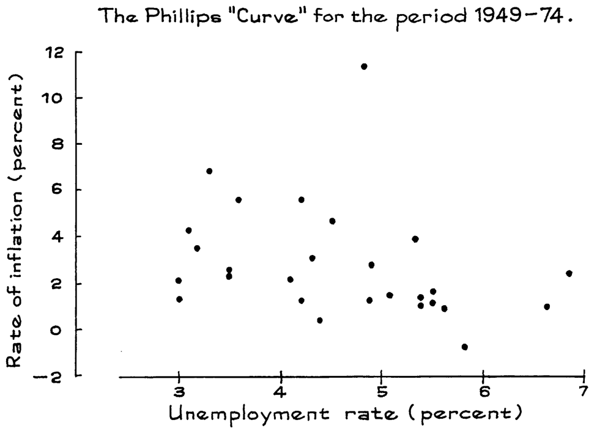

### **Chương 10. Hồi quy (Regression)**

**Bài tập Nhóm A, trang 161**

1. 
(a) $67.5$
(b) $45$
(c) $60$

*Diễn giải logic tính toán cho phần (a):* Điểm $75$ ở bài thi giữa kỳ cao hơn mức trung bình chung $1$ độ lệch chuẩn ($\text{SD}$). Tuy nhiên, hệ số $r$ chỉ là $0.5$. Do hiệu ứng hồi quy về mức trung bình, nếu bạn gộp những sinh viên giỏi hơn trung bình $1$ SD ở kỳ thi giữa kỳ, điểm của họ ở kỳ thi cuối kỳ theo kỳ vọng sẽ chỉ cao hơn trung bình khoảng $0.5$ lần của SD ở kỳ cuối. 
Vì SD cuối kỳ = $15$, sự chênh lệch này là: $0.5 \times 15 = 7.5$ điểm. Vì vậy, điểm trung bình ước lượng của nhóm này vào kỳ cuối là mốc gốc cộng thêm phần dư: $60 + 7.5 = 67.5$.
*Bình luận.* Các ước lượng hồi quy luôn luôn tạo ra một đường thẳng — gọi là đường hồi quy. Chúng ta sẽ đào sâu về vấn đề này ở chương 12.

2. 
(a) $190$ pounds.
(b) $173$ pounds.
(c) $68$ pounds.
(d) $206$ pounds.

*Bình luận về phần (c).* Việc ước lượng ra con số $68$ pounds trở nên khá nực cười. Lý do là Cơ quan Y tế Công cộng chưa bao giờ chạm trán với bất kỳ người đàn ông trưởng thành bé nhỏ nào chỉ cao vỏn vẹn $2$ feet (tương đương 61 cm) trong tập mẫu của họ, vậy nên đường hồi quy không có cơ sở dữ liệu thực để nhận thức khả năng kỳ dị này. Đường hồi quy sẽ ngày càng thiếu đáng tin cậy nếu bạn càng cố dùng nó dự báo cho những điểm nằm xa tít ra khỏi vùng trung tâm của đám mây đồ thị thực tế (hiện tượng ngoại suy).

3. Sai (False). Hãy liên tưởng đến biểu đồ phân tán mô tả sự liên hệ giữa chiều cao và cân nặng của tất cả đàn ông. Thử trích xuất một dải cắt dọc hẹp ở ngay mức chiều cao $69$ inches, đại diện cho những người có vóc dáng vừa khít với mức trung bình chuẩn. Cân nặng trung bình của những người nằm trong dải phân tán này sẽ chỉ ngang bằng với mốc cân nặng tổng thể.
Thế nhưng, những người đàn ông nằm trong đoạn tuổi $45–74$ lại được đại diện bởi một bộ sưu tập những điểm dữ liệu hoàn toàn khác. Vài người nằm trong dải cắt vừa rồi, và số đông khác thì không. Đường hồi quy đang cố diễn đạt cách thức cân nặng biến chuyển theo hệ quy chiếu *chiều cao*, CHỨ KHÔNG PHẢI *độ tuổi*. (Người lớn tuổi thực tế có xu hướng nặng hơn trung bình đôi chút vì sự tích tụ mỡ ở tuổi trung niên đã bắt đầu).

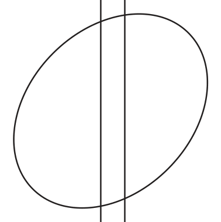

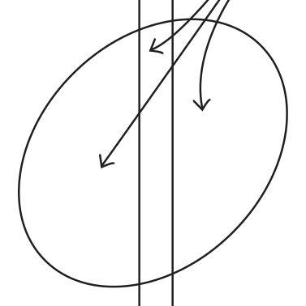

4. Những người phụ nữ này đã được tiếp nhận $12$ năm học tập quy chuẩn, con số này thấp hơn $2$ năm so với mức trung bình. Họ đang ở mức thấp hơn mức trung bình khoảng $2 / 2.4 \approx 0.83$ lần độ lệch chuẩn (SD) về khoảng thời gian đi học. Mô hình ước lượng cho thấy thu nhập của họ cũng sẽ nằm ở nhóm dưới trung bình, nhưng sự giảm sút thu nhập sẽ không nặng nề tới tận $0.83$ SD — độ tụt lùi bị hãm lại theo hệ số hồi quy: chỉ tụt $r \times 0.83 \approx 0.28$ độ lệch chuẩn của mức thu nhập.
Quy đổi ra giá trị tiền tệ, nó tương đương $0.28 \times \$26,000 \approx \$7,300$. Thu nhập trung bình dự kiến của họ được ước lượng là:
$\text{Mức thu nhập tổng thể trung bình} - \$7,300 = \$32,000 - \$7,300 = \$24,700$.

5. Tất cả các điểm bắt buộc phải nằm vắt ngang trên trục đường thẳng SD, có hướng dốc lao thẳng xuống; tỷ lệ tuyến tính là cứ mỗi $1$ đơn vị SD của $y$ bị thay đổi thì tương ứng kéo theo $1$ SD của $x$.

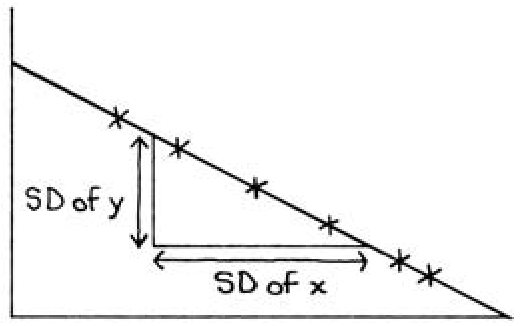

**Bài tập Nhóm B, trang 163**

1. 
(a) Đúng (True): Đường đồ thị của các giá trị trung bình hướng dốc lên. Nhìn chung, đàn ông kiếm được nhiều thu nhập có khuynh hướng sẽ xây dựng gia đình với những người vợ cũng có nguồn thu nhập cao. Mọi người hay lựa chọn kết hôn với bạn đời có những điểm tương đồng về mặt tri thức học vấn hay gốc gác gia đình, và yếu tố này cũng gián tiếp làm kéo mức thu nhập của họ về sát nhau.
(b) Do sai số ngẫu nhiên ngẫu nhiên (Chance error). Dữ liệu này được trích ra từ một mẫu nhỏ, và thực sự thì chỉ có 4 cặp vợ chồng làm dữ liệu nòng cốt cho điểm ảnh đó.
(c) Những con số ước lượng qua phép hồi quy sẽ ra kết quả hơi thiên thấp một chút: bạn có thể thấy đồ thị đường thẳng chạy luồn ở phía dưới các điểm giá trị thực.

2. 

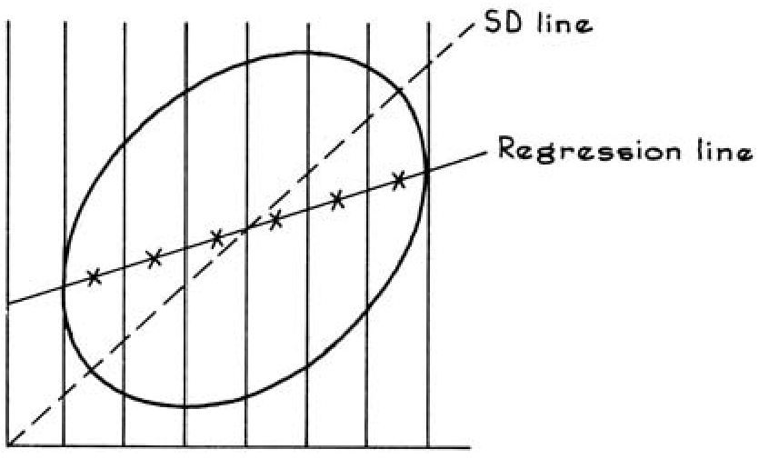

Các dấu tích chữ thập nằm đè lên đường nét liền mạch (đây là đường hồi quy), còn đường gạch nét đứt là ký hiệu đại diện cho đường lệch SD (SD line).

3. Đối với hai hình biểu đồ ở bên trái, đường gạch nét đứt biểu hiện cho đường SD và đường nét liền nguyên vẹn là đường hồi quy. Đối với hai hình phân tán ở hướng bên phải, đường SD là đường nét liền mạch và đường hồi quy trở thành nét gạch đứt.
*Bài học cốt lõi rút ra (Moral):* Đường hồi quy về bản chất toán học luôn không bao giờ dốc đứng bằng đường SD (do hệ số $r$ luôn mang độ lớn từ 0 đến 1 hãm lại sự trượt độ dốc).

4. 

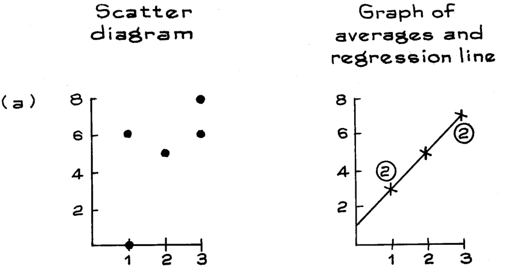

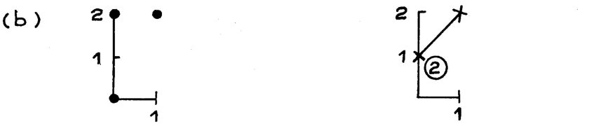

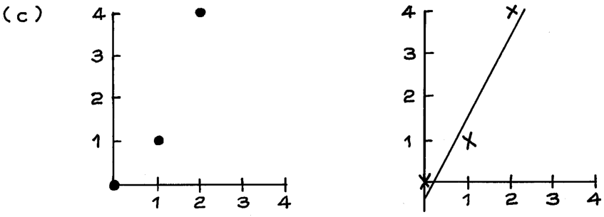

4. 

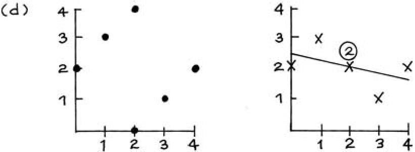

**Bài tập Nhóm C, trang 167**

1. 
(a) $67.5$ 
(b) $45$ 
(c) $60$ 
(d) $60$

Bài tập này đặc tả về những phân tích ở quy mô các cá nhân độc lập (individuals); ngược lại, bài tập 1 ở trang 161 vừa rồi lại thiên về phân tích ở lăng kính quy mô nhóm gộp (groups). Trình tự tính toán các phép toán số học cho phần (a–c) hoàn toàn tương đồng y như nhau; các bạn có thể tham chiếu lại trang 165–66.

2. 
(a) $79\%$ 
(b) $38\%$ 
(c) $50\%$ 
(d) $50\%$ 

*Diễn giải tính toán cho phần (a):*

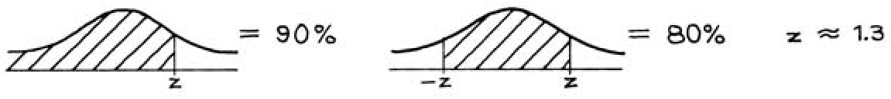

Nếu quy đổi thành đơn vị chuẩn hóa chuẩn, điểm đánh giá kỳ thi SAT của sinh viên nam này đạt mức $1.3$. Dự đoán theo mô hình hồi quy quy đổi cho điểm học kỳ năm nhất đầu tiên của anh ấy ước chừng vào khoảng $0.6 \times 1.3 \approx 0.8$ ở thang điểm đơn vị chuẩn hóa.

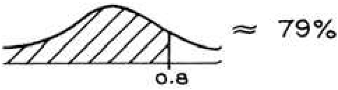

Hệ số điểm chuẩn này đối chiếu chính xác tương ứng vào mức thứ hạng phần trăm bách phân vị là $79\%$. Trong Ví dụ số 2, thứ hạng bách phân vị được nội suy dự báo kỳ vọng chỉ vươn tới mốc $69\%$, tức là khoảng mốc gần hơn với giá trị trung tâm $50\%$. Sở dĩ có chênh lệch này là bởi hệ số tương quan ở Ví dụ 2 đo đạc được ở mức thấp hơn. Sự kìm hãm tương quan lỏng lẻo sẽ tạo đà mạnh hơn cho hiện ứng quy nạp hồi quy kéo thành tích về sát với cột mốc trung bình.

3. 
(a) Đường SD line — vẽ theo kiểu đường đứt đoạn (dashed).
(b) Đường hồi quy Regression line — vẽ thành đường liền mạch nguyên vẹn (solid).

4. 
(a) Hệ thống luật định luôn ràng buộc rõ một giới hạn tuổi tối thiểu nghiêm ngặt quy định độ tuổi được phép kết hôn.
(b) Chỉ số tuổi luôn luôn được công bố làm tròn dưới dạng số năm trọn vẹn; có vô số những người đàn ông làm chồng chẵn $30$ tuổi, nhưng không bao giờ xuất hiện bất cứ ai báo cáo mình ở mốc $30.33$ tuổi trên văn bản hành chính; điều này cũng y hệt với thông tin ghi nhận của phía người làm vợ.

5. Sai (False). Đường hồi quy trong bối cảnh phân tích này đang muốn diễn giải cách thông số trung bình của cân nặng trượt dốc biến thiên phụ thuộc vào biến số chiều cao (height), chứ không phải phụ thuộc theo dòng thời gian độ tuổi (age). Xin vui lòng tham khảo kỹ lại câu phân tích của bài tập số 3 nằm ở trang 161.

**Bài tập Nhóm D, trang 174**

1. Không (No), những chi tiết mô tả này trông hoàn toàn rập khuôn như hiện tượng hiệu ứng hồi quy thông thường. Thử hình dung một cuộc thử nghiệm có tổ chức kiểm soát đối chiếu. Tại phân khu sân bay số một, các viên sĩ quan đào tạo thẳng thắn thảo luận công khai bảng điểm cùng với các tổ bay. Còn tại sân bay số hai, hệ thống đánh giá chỉ được giữ ngầm khép kín. Nhưng ngay cả tại cứ điểm sân bay số hai, thành tích điểm số của 2 đợt đáp xuống chắc chắn sẽ chẳng bao giờ khớp hoàn hảo $100\%$ — sự xê dịch biến thiên tự nhiên kiểu gì cũng sẽ xen vào.
Do đó, hiệu ứng hồi quy về điểm trung bình sẽ hiển hiện: tính trên trung bình tổng quát, nhóm phi công chót bảng ở lần một sẽ cải thiện nhích lên một chút ở đợt kế, ngược lại nhóm ngôi sao dẫn đầu sẽ bị kìm hãm rớt hạng lại. Kịch bản này gần như chắc chắn là toàn bộ những gì giới chức không quân thực sự đã chứng kiến từ thông số hệ thống, chứ không hề phản ánh ảnh hưởng từ việc chê bai hay khích lệ tinh thần.

2. Không (No). Những biểu hiện này cho thấy nỗ lực học kèm phụ đạo (tutoring) mới là thứ đem tới hiệu quả lột xác. Nếu chỉ thuần túy bị chi phối bởi quy luật hồi quy, thành tích của nhóm kém nhất này sẽ chỉ nhích nhẹ mon men dần tới gần hơn với mốc trung bình, nhưng thay vào đó, họ đã tạo ra được đột phá lọt hẳn tới bờ vạch bên kia dải phân cách (vượt xa lên trên mức trung bình).

3. Nhờ hiệu ứng hồi quy về mức trung bình, những cậu con trai sinh ra bởi các ông bố cao vóc $61$ inch (khoảng 1m55), khi xét tính theo giá trị trung bình, có xu hướng sẽ phát triển vươn cao nhỉnh hơn thông số của bố mình. Dù vậy, họ vẫn sẽ luôn có tầm vóc trung bình kém cao lớn hơn so với thế hệ con trai sinh ra bởi những người cha mang vóc dáng mức $62$ inch.

inch fathers. Đây chỉ là sự biến thiên ngẫu nhiên. Do tình cờ, Pearson đã thu thập được quá nhiều gia đình mà trong đó người cha cao $61$ inch và người con trai lại cao vượt trội. 
*Nhận xét.* Chỉ có 8 gia đình mà người cha cao khoảng 61 inch, và 15 gia đình người cha cao 62 inch — kích thước mẫu nhỏ này để lại rất nhiều khoảng trống cho sai số ngẫu nhiên.

Nhóm E, trang 175

1. **Sai.** Ở đây chúng ta đang xem xét hai nhóm người hoàn toàn khác nhau (xem biểu đồ bên dưới). Những người có chiều cao 63 inch nằm trong một dải dọc (vertical strip). Trung bình cân nặng của họ là 138 pound, được biểu diễn bằng một dấu thập. Ngược lại, những người có cân nặng 138 pound nằm trong một dải ngang (horizontal strip). Chiều cao trung bình của nhóm này được biểu diễn bằng một chấm đậm, và giá trị này lớn hơn 63 inch rất nhiều. *Giải thích thêm: Điều này minh họa cho hiện tượng hồi quy về giá trị trung bình (regression to the mean) và cho thấy tại sao đường hồi quy dự đoán cân nặng từ chiều cao lại khác với đường hồi quy dự đoán chiều cao từ cân nặng.*

Hãy nhớ rằng, luôn có hai đường hồi quy (regression lines):
- một đường dự báo cân nặng dựa trên chiều cao,
- một đường dự báo chiều cao dựa trên cân nặng.

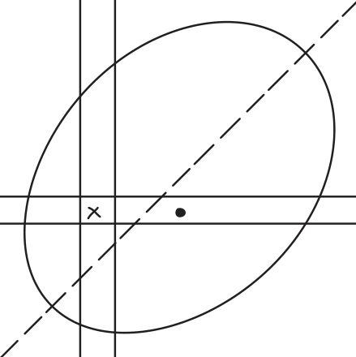

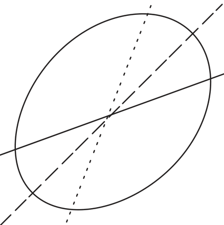

2. **Sai.** Chiều cao trung bình của những người cha chỉ là 69 inch. Bạn phải sử dụng đường hồi quy còn lại (đường hồi quy dự đoán chiều cao của cha dựa trên chiều cao của con trai) chứ không phải đường ngược lại.

3. **Sai.** Tình huống này hoàn toàn tương tự như bài tập 1 và 2. (Một sinh viên tiêu biểu nằm ở bách phân vị thứ 69 trong các bài kiểm tra năm thứ nhất thì thường sẽ nằm ở bách phân vị thứ 58 trong kỳ thi SAT; bạn cần sử dụng đường hồi quy dự báo điểm SAT từ điểm kiểm tra năm nhất, tức là đường hồi quy còn lại).

### **Chương 11. Sai số R.M.S. cho Hồi quy**

Nhóm A, trang 184

1. B cao và mũm mĩm, trong khi D thấp và gầy. *Giải thích: Dựa vào vị trí trên biểu đồ phân tán (scatter plot), điểm B nằm ở phần giá trị cao của cả chiều cao và cân nặng, cho thấy người này vừa cao vừa nặng. Điểm D nằm ở phần giá trị thấp của cả hai biến, cho thấy người này thấp và nhẹ cân.*

2. 
- (a) **Sai.** 
- (b) **Đúng.**

3. Các sai số dự đoán (prediction errors / residuals) lần lượt là: $-7, 1, 3, -1, 4$. Sai số R.M.S. (root-mean-square error) bằng $3.9$. *Giải thích: Sai số dự đoán được tính bằng Giá trị thực tế trừ đi Giá trị dự đoán. Sai số R.M.S. là căn bậc hai của trung bình các bình phương sai số: $\sqrt{\frac{(-7)^2 + 1^2 + 3^2 + (-1)^2 + 4^2}{5}} = \sqrt{\frac{49 + 1 + 9 + 1 + 16}{5}} = \sqrt{\frac{76}{5}} = \sqrt{15.2} \approx 3.9$.*

4. 
- (a) $0.2$ 
- (b) $1$ 
- (c) $5$

5. Vài ngàn đô la. *Giải thích: Trong các mô hình dự báo thu nhập, sai số R.M.S. thường nằm ở mức hàng ngàn đô la do sự biến động lớn của thu nhập giữa các cá nhân.*

6. Nên sử dụng phương pháp có sai số R.M.S. (r.m.s. error) nhỏ hơn, vì xét về tổng thể nó sẽ đưa ra dự đoán chính xác hơn. *Giải thích: Sai số R.M.S. đo lường mức độ sai lệch trung bình của các dự đoán so với giá trị thực tế. R.M.S. càng nhỏ nghĩa là các điểm dữ liệu càng nằm sát đường hồi quy, độ chính xác của dự đoán càng cao.*

7. 
- (a) $8$ điểm — tương đương một sai số R.M.S.
- (b) $16$ điểm — tương đương hai sai số R.M.S.

8. 
- (a) $\$20,000$.
- (b) Đường nằm ngang. Xem trang 183.

Nhóm B, trang 187

1. $\sqrt{1 - 0.6^2} \times 10 = 8$ điểm. *Giải thích: Công thức tính sai số R.M.S. của đường hồi quy là $SD_y \times \sqrt{1 - r^2}$. Ở đây hệ số tương quan $r = 0.6$ và độ lệch chuẩn của biến phụ thuộc $SD_y = 10$. Do đó, ta có $\sqrt{1 - 0.36} \times 10 = \sqrt{0.64} \times 10 = 0.8 \times 10 = 8$.*

2. 
- (a) Hãy dự đoán bằng giá trị trung bình, tức là $65$.
- (b) $10$. Nếu bạn sử dụng đường hồi quy (regression line), sai số R.M.S. được tính bằng công thức như ở bài tập 1 (là 8). Nhưng nếu bạn chỉ dùng giá trị trung bình để dự đoán cho tất cả các trường hợp, sai số R.M.S. chính là Độ lệch chuẩn (SD), tức là $10$. (Xem bài tập 9–10 ở trang 71). *Giải thích: Đường hồi quy sử dụng thêm thông tin từ biến độc lập $x$ để dự báo, nhờ đó làm giảm sai số dự đoán so với việc chỉ dùng trung bình của $y$.*
- (c) Sử dụng đường hồi quy, và sai số R.M.S. được tính bằng công thức là $8$ điểm (như kết quả bài tập 1).

3. Nhìn chung, việc có thêm thông tin luôn mang lại lợi ích dự báo tốt hơn. Sai số R.M.S. đối với người B sẽ nhỏ hơn so với người A theo một hệ số là $\sqrt{1 - 0.6^2} = 0.8$. (Xem trang 186). *Giải thích: Người B sử dụng đường hồi quy với hệ số tương quan $r = 0.6$, do đó sai số R.M.S. của họ sẽ chỉ bằng $80\%$ so với sai số R.M.S. ban đầu (chính là độ lệch chuẩn $SD_y$ khi không có thông tin bổ sung).*

Nhóm C, trang 189

1. 
- (a) (iii) 
- (b) (ii) 
- (c) (i) 

2. 
- (a) (i), (ii) 
- (b) không được sử dụng 
- (c) (iii)

3. 
- (a) Độ lệch chuẩn (SD) của $y \approx 1$.
- (b) Độ lệch chuẩn (SD) của các phần dư (residuals) $\approx 0.6$.
- (c) Độ lệch chuẩn của $y$ trong một dải dọc (strip) $\approx 0.6$, xấp xỉ bằng với độ lệch chuẩn của các phần dư.
*Giải thích: Trong giả định phương sai đồng nhất (homoscedasticity), độ phân tán của $y$ trong bất kỳ dải dọc nào cũng xấp xỉ bằng nhau và bằng sai số R.M.S. của toàn bộ đường hồi quy.*

*Nhận xét.* Độ phân tán theo chiều dọc (vertical scatter) bên trong mỗi dải hẹp xấp xỉ bằng sai số R.M.S. của đường hồi quy — tuy nhiên, độ phân tán theo chiều dọc trên toàn bộ biểu đồ lại lớn hơn rất nhiều so với độ phân tán trong một dải cụ thể (đó là độ lệch chuẩn chung của $y$).

Nhóm D, trang 193

1. 
- (a) **Đúng.**
- (b) **Đúng;** biểu đồ phân tán có tính phương sai đồng nhất (homoscedastic). Do đó, khoảng cách từ các đối tượng đến đường hồi quy ở mỗi dải dọc (vertical strip) đều có mức độ dao động tương đương nhau. *Giải thích: Thuật ngữ "homoscedastic" chỉ tình trạng mà phương sai của phần dư không đổi ở mọi mức giá trị của biến dự báo $x$.*
- (c) **Sai,** vì biểu đồ phân tán có tính phương sai không đồng nhất (heteroscedastic). Dù $9$ điểm là một dạng sai số trung bình (r.m.s. error), nhưng sai số dự đoán thực tế sẽ có xu hướng lớn hơn đối với những điểm số cao. *Giải thích: Trong trường hợp "heteroscedastic", dải phân tán có hình dạng giống cái phễu (mở rộng dần), tức là giá trị của $x$ càng cao thì mức độ dao động của $y$ (hay sai số dự báo) càng lớn.*

2. 
- (a) $\sqrt{1 - 0.5^2} \times 2.7 \approx 2.3$ inch.
- (b) $71$ inch — tính bằng phương pháp hồi quy (regression method).
- (c) $2.3$ inch. Biểu đồ phân tán có tính phương sai đồng nhất (homoscedastic), nên chiều cao của các con trai có mức độ sai lệch so với đường hồi quy là tương đương nhau đối với bất kỳ chiều cao nào của người cha. Mức sai lệch này chính là sai số R.M.S. của đường hồi quy.
- (d) Kết quả dự đoán là $68$ inch, và sai số có khả năng dao động trong khoảng $2.3$ inch.

3. 
- (a) $\sqrt{1 - 0.37^2} \times \$20,000 \approx \$18,600$.
- (b) $\$24,500$ — tính bằng phương pháp hồi quy.
- (c) Không thể xác định được từ các thông tin đã cho. Mức $\$18,600$ chỉ là một dạng sai số trung bình so với đường hồi quy. Nhưng do biểu đồ phân tán ở đây có tính phương sai không đồng nhất (heteroscedastic), mức sai lệch so với đường hồi quy sẽ thay đổi tùy theo từng dải dữ liệu. Độ phân tán về thu nhập thường lớn hơn nhiều ở những người có trình độ học vấn cao, do đó sai số dự báo cho nhóm này sẽ lớn hơn mức $\$18,600$.
- (d) Dự đoán là $\$7,100$. Không thể xác định chính xác sai số là bao nhiêu, nhưng nó sẽ nhỏ hơn $\$18,600$. *(Lý do là ở nhóm có mức học vấn thấp, độ phân tán của thu nhập thường nhỏ hẹp hơn mức trung bình chung).*

4. Người chồng có độ tuổi từ $20$ đến $30$ tuổi.

5. 
- (a) $50, 15$ 
- (b) $50, 15$ 
- (c) $0.95$ 
- (d) $25, 5$
- (e) $0.5$ — sự suy giảm (attenuation). (Xem bài tập 9 ở trang 144 và bài tập 1–2 ở trang 145–146). *Giải thích: Hiện tượng suy giảm tương quan (attenuation effect) xảy ra khi có sự hạn chế về khoảng giá trị (restriction of range). Khi ta thu hẹp mẫu vào một nhóm hẹp hơn (ví dụ: chỉ xét những người chồng 20-30 tuổi thay vì toàn bộ độ tuổi), hệ số tương quan giữa tuổi vợ và tuổi chồng sẽ giảm đi đáng kể.*

6. 
- (a) Độ lệch chuẩn (SD) đối với tất cả những người vợ là lớn hơn nhiều. Đây chính là điểm cốt lõi của các bài tập từ 4 đến 6. Xem phần nhận xét bên dưới.
- (b) Hai độ lệch chuẩn này xấp xỉ bằng nhau.

*Nhận xét.* Nếu bạn chỉ chọn lọc các gia đình mà người chồng trong độ tuổi từ 20 đến 30, tuổi của các người vợ sẽ trở nên tương đồng với nhau hơn rất nhiều, độ lệch chuẩn (SD) của họ giảm mạnh từ khoảng 15 năm xuống chỉ còn khoảng 5 năm. Tuy nhiên, nếu bạn chỉ chọn những người chồng sinh vào tháng Ba, điều này lại không hề làm giảm bớt sự biến động trong độ tuổi của các người vợ (SD vẫn giữ nguyên). Cần lưu ý rằng các mẫu có kích thước nhỏ hơn không có nghĩa là sẽ có độ lệch chuẩn nhỏ hơn (xem bài tập 8 trang 71). Tuy nhiên, nếu bạn **hạn chế khoảng giá trị của biến $x$ (restrict the range of $x$)**, thì điều này thường sẽ làm giảm độ lệch chuẩn của biến phụ thuộc $y$.

7. 
- (a) $68$ inch, chính là giá trị trung bình.
- (b) $3$ inch, chính là độ lệch chuẩn (SD).
- (c) Hồi quy (Regression). Nếu một người trong cặp sinh đôi cao 6 ft 6 in, hãy dự đoán người còn lại cao 6 ft 5.5 in (tức là $6$ foot $5\frac{1}{2}$ inch).
- (d) $\sqrt{1 - 0.95^2} \times 3 \approx 0.9$ inch.

*Nhận xét.* 
(i) Nếu hệ số tương quan $r = 1$, bạn nên dự đoán chiều cao của người sinh đôi thứ hai bằng chính xác chiều cao của người thứ nhất. Nhưng trong thực tế $r$ thường nhỏ hơn 1 một chút. Do đó, bạn cần kéo giá trị dự đoán của người thứ hai về phía giá trị trung bình (regress toward the mean) một lượng nhỏ.
(ii) Đáp án ở câu (d) nhỏ hơn khá nhiều so với đáp án ở câu (b). Khi hệ số tương quan $r = 0.95$, sẽ có một sự giảm thiểu rất lớn đối với sai số R.M.S. nếu bạn sử dụng đường hồi quy để dự đoán (thay vì chỉ dùng giá trị trung bình chung).

Nhóm E, trang 197

1. 
- (a) 
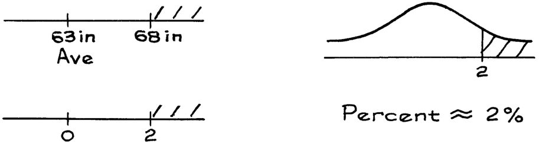

- (b) giá trị trung bình mới (new average) $\approx 63.9$ inch, độ lệch chuẩn mới (new SD) $\approx 2.4$ inch.
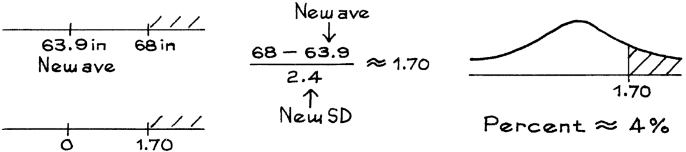

2. (a) $14\%$ (b) $33\%$

3. (a) $38\%$ (b) $60\%$

### **Chương 12. Đường Hồi quy**

Nhóm A, trang 207

1. 
- (a) $\$2,000 \times 8 + \$5,000 = \$21,000$. *Giải thích: Áp dụng phương trình đường hồi quy với độ dốc (slope) là $\$2,000$ mỗi năm kinh nghiệm, hằng số (intercept) là $\$5,000$, và $x=8$.*
- (b) $\$2,000 \times 12 + \$5,000 = \$29,000$.
- (c) $\$2,000 \times 16 + \$5,000 = \$37,000$.

2. 
- (a) $240$ ounce = $15$ pound. 
- (b) $20$ ounce.
- (c) $3$ ounce nitơ cho sản lượng $18$ lb $12$ oz gạo, còn $4$ ounce nitơ cho sản lượng $20$ pound gạo.
- (d) Đây là một thí nghiệm có đối chứng (Controlled experiment). *Giải thích: Trong thí nghiệm này, lượng nitơ được nhà nghiên cứu chủ động kiểm soát và thiết lập cho từng mảnh ruộng, thay vì chỉ quan sát thụ động trong tự nhiên.*
- (e) **Có.** Đường hồi quy khớp khá tốt với dữ liệu (hệ số tương quan $r = 0.95$), và giá trị $3$ ounce nằm khá gần với các mức giá trị nitơ thực tế đã được sử dụng trong thí nghiệm (nên dự báo nội suy là đáng tin cậy).
- (f) **Không.** Giá trị đó nằm quá xa so với khoảng lượng nitơ đã được kiểm nghiệm thực tế. *Giải thích: Việc ngoại suy (extrapolation) quá xa ngoài khoảng dữ liệu ban đầu thường rất rủi ro, vì mối quan hệ tuyến tính có thể không còn giữ đúng. (Ví dụ: bón quá nhiều phân có thể làm cây chết thay vì tăng năng suất).*

3. 
- (a) Chiều cao con trai dự đoán = $0.5 \times$ Chiều cao cha $+ 35$ inch. 
- (b) Chiều cao cha dự đoán = $0.5 \times$ Chiều cao con trai $+ 33.5$ inch. 
*Nhận xét.* Lưu ý rằng có tới hai đường hồi quy khác biệt: một đường dùng để dự báo chiều cao của con từ chiều cao của cha, và một đường ngược lại dự báo chiều cao của cha dựa trên chiều cao của con (như đã được giải thích ở mục 5, chương 10). Cả hai đường này không thể biến đổi đại số qua lại cho nhau giống như phương trình đường thẳng thông thường.

4. Lời chứng này là một sự phóng đại (overstatement). Các mối tương quan (associations) trong dữ liệu quan sát hoàn toàn có thể là do tác động của các biến gây nhiễu (confounding variables). Nếu không thực hiện thí nghiệm ngẫu nhiên, hoặc không kiểm soát thật chặt chẽ các dữ liệu quan sát được, bạn không thể chắc chắn liệu việc áp dụng một can thiệp (intervention) cụ thể có mang lại kết quả như dự báo của mô hình hay không. *Nguyên tắc cốt lõi: Tương quan không đồng nghĩa với nhân quả.*

Nhóm B, trang 210

1. Với $12$ năm học tập, chiều cao dự đoán là $69.75$ inch; với $16$ năm học tập, chiều cao dự đoán là $70.75$ inch. Rõ ràng, việc đi học đại học không hề có tác dụng làm tăng chiều cao. Nghiên cứu quan sát (observational study) này đã ghi nhận được một mối tương quan giữa chiều cao và trình độ học vấn, nhưng thực chất là do một yếu tố thứ ba (ví dụ: hoàn cảnh gia đình, dinh dưỡng thời thơ ấu, thu nhập của bố mẹ) ảnh hưởng đồng thời đến cả hai biến này.

2. $439.16$ cm và $439.26$ cm. Việc treo một vật nặng hơn vào sợi dây kim loại thực sự làm nó giãn ra nhiều hơn (quan hệ nhân quả). Bạn hoàn toàn có thể tin cậy vào đường hồi quy ở bài tập 2 vì nó được thiết lập dựa trên một thí nghiệm vật lý có kiểm soát. Trái lại, trong bài tập 1, đường hồi quy chỉ được khớp (fitted) vào dữ liệu lấy từ một nghiên cứu quan sát nên nó không thể hiện mối quan hệ nguyên nhân - hệ quả.

3. 
- (a) $540 + 110 = 650$ 
- (b) $540$ 
- (c) Lớn hơn (Greater than) (xem trang 208).

4. 
- (a) $540$
- (b) $540$ 
- (c) Lớn hơn (Greater than) (xem trang 208).
*Nhận xét.* Nếu bạn luôn dùng giá trị trung bình của $y$ để đưa ra dự báo cho $y$, thì sai số R.M.S. của bạn sẽ bằng đúng với độ lệch chuẩn (SD) của $y$. (Xem trang 183).

5. Đường hồi quy là phương pháp dự báo mang lại sai số R.M.S. nhỏ nhất (so với mọi đường thẳng khác). *Giải thích: Đây là bản chất của phương pháp bình phương tối thiểu (Ordinary Least Squares - OLS), nó toán học hóa việc tìm ra một đường thẳng sao cho tổng bình phương các khoảng cách theo phương thẳng đứng từ các điểm dữ liệu đến đường thẳng là bé nhất.* (Xem trang 208).

## **Phần IV. Xác suất**

### **Chương 13. Xác suất là bao nhiêu?**

Nhóm A, trang 225

1. (a) (vi) (b) (iii) (c) (iv) (d) (i) (e) (ii) (f) (v) (g) (vi)

2. Khoảng $500$. *Giải thích: Nếu tung đồng xu $1000$ lần với xác suất ra mặt ngửa là $50\%$, số lần ngửa kỳ vọng sẽ là $1000 \times 0.5 = 500$.*

3. Khoảng $1,000$.

4. Khoảng $14$.

5. Hộp (ii), bởi vì tấm vé "3" mang lại phần thưởng lớn hơn so với vé "2", trong khi tấm vé còn lại ở cả hai hộp là như nhau. *Giải thích: Khi xác suất trúng là như nhau, ta nên chọn phương án có giá trị kỳ vọng cao hơn.*

Nhóm B, trang 227

1. 
- (a) Câu hỏi đang hỏi về lần rút vé thứ hai chứ không phải lần đầu tiên: hãy xem phần (a) của ví dụ 2. Đáp án là $1/4$. *Giải thích: Khi rút ngẫu nhiên và chưa biết kết quả lần 1, xác suất của một sự kiện ở lần rút thứ 2 vẫn giống như lần đầu tiên (tính đối xứng trong xác suất cơ bản).*
- (b) $1/3$; chỉ còn lại $3$ tấm vé trong hộp sau khi tấm vé mang số 2 đã được rút ra (và không hoàn lại).

2. 
- (a) $1/4$ 
- (b) $1/4$. 
*Giải thích: Vì việc rút vé được thực hiện "có hoàn lại" (with replacement), nên cấu trúc của hộp vé sau lần rút thứ nhất vẫn y nguyên như ban đầu. Xác suất các lần rút là độc lập với nhau.*

3. 
- (a) $1/2$ 
- (b) $1/2$. 
*Giải thích: Xác suất rơi vào mặt ngửa của lần tung đồng xu thứ 5 hoàn toàn độc lập và không bị ảnh hưởng bởi kết quả của $4$ lần tung trước đó (hiệu ứng không có trí nhớ của đồng xu).*

4. 
- (a) $1/52$ 
- (b) $1/48$. 
*Giải thích: Ban đầu bộ bài có 52 lá, nên cơ hội rút trúng một lá cụ thể là $1/52$. Tuy nhiên, nếu bạn đã biết được 4 lá bài đầu tiên không phải là lá bạn cần, và không hoàn lại, bộ bài chỉ còn $48$ lá, làm tăng tỷ lệ thành $1/48$. Bài toán này giống ví dụ 2 ở trang 226.*

Nhóm C, trang 229

1. 
- (a) $12/51$ 
- (b) $(13/52) \times (12/51) = 1/17 \approx 6\%$. 
*Giải thích: Quy tắc nhân xác suất. Biến cố thứ nhất: Rút được một lá bích ở lần đầu ($13/52$). Biến cố thứ hai: Rút thêm một lá bích nữa ở lần hai, lúc này bộ bài chỉ còn 51 lá và số lá bích chỉ còn 12 ($12/51$).*

2. 
- (a) $1/6$ 
- (b) $(1/6) \times (1/6) \times (1/6) = 1/216 \approx 0.5\%$. 
*Giải thích: Vì ba lần gieo xúc xắc là các sự kiện hoàn toàn độc lập, ta tính xác suất đồng thời bằng cách nhân trực tiếp các xác suất đơn lẻ.*

3. 
- (a) $4/52$ 
- (b) $(4/52) \times (4/51) \times (4/50) \approx 5/10,000$. 
*Nhận xét.* Trong bài tập này, các lần rút bài là những biến cố phụ thuộc (dependent events) vì không có sự hoàn lại. Ngược lại, ở bài tập 2, các lần gieo xúc xắc là các biến cố độc lập.

4. Phương án "Có ít nhất một lá Át" (At least one ace) là một lựa chọn tốt hơn nhiều: giống như việc bạn ưu tiên chọn một bài kiểm tra chỉ yêu cầu trả lời đúng ít nhất 1 trên 6 câu, thay vì chọn bài thi đòi hỏi bạn phải làm đúng toàn bộ cả 6 câu. *Giải thích: Biến cố "ít nhất một" bao trùm nhiều trường hợp (1 lá, 2 lá, 3 lá, v.v.), do đó xác suất xảy ra sẽ cao hơn nhiều so với biến cố "tất cả đều phải thỏa mãn".*

5. Cách làm này hoàn toàn chính xác, đó chính là việc áp dụng Quy tắc nhân (multiplication rule) cho các biến cố độc lập.

6. Đồng xu phải rơi theo đúng trình tự là "sấp, rồi ngửa" (tails, heads); xác suất để xảy ra trình tự cụ thể này là $(1/2) \times (1/2) = 1/4$.

7. 
- (a) $1/8$. *(Xác suất tung được 3 mặt ngửa liên tiếp: $0.5^3$)*
- (b) $1 - 1/8 = 7/8$. *(Sử dụng quy tắc phần bù để tính xác suất không rơi vào trường hợp cả 3 đều ngửa).*
- (c) $7/8$; bạn sẽ nhận được "ít nhất một mặt sấp" trong tất cả các trường hợp ngoại trừ trường hợp "cả ba đều ngửa". Vì thế, đáp án của câu (b) và (c) bản chất là một.
- (d) $7/8$; bạn chỉ cần hoán đổi chữ "ngửa" (heads) và "sấp" (tails) ở câu (c) là sẽ có cùng lập luận.

Nhóm D, trang 232

1. 
- (a) **Độc lập (independent):** nếu bạn rút được vé trắng, bạn có $1/3$ cơ hội nhận được số "1" và $2/3$ cơ hội nhận được số "2". Đổi lại, nếu bạn rút được vé đen, tỷ lệ các con số đó vẫn không hề thay đổi. Do đó, màu vé không mang lại thêm thông tin gì về con số bên trong.
- (b) **Độc lập.**
- (c) **Phụ thuộc (dependent):** trong số các vé trắng, cơ hội để rút được số "2" chỉ là $1/3$; nhưng nếu bạn rút từ vé đen, cơ hội để được số "2" lại tăng lên đến $2/3$. Việc biết được màu sắc của tấm vé làm thay đổi hoàn toàn xác suất của các con số.

2. 
- (a,b) **Độc lập.** 
- (c) **Phụ thuộc.**
*Nhận xét.* Mô hình hộp kiểu này sẽ xuất hiện trở lại trong chương 27. Đây là lập luận cho câu (a): Giả sử bạn rút một tấm vé, bạn nhìn thấy con số đầu tiên là 4 nhưng chưa nhìn thấy số thứ hai. Lúc này, xác suất để con số thứ hai là 3 sẽ là $1/2$. Tương tự, nếu con số đầu tiên là 1, xác suất con số thứ hai là 3 vẫn là $1/2$. Tình trạng tỷ lệ không đổi này chính là định nghĩa của sự độc lập (independence).

3. Mười năm tương đương với $520$ tuần. Xác suất để **KHÔNG** trúng thưởng trong một tuần là $999,999/1,000,000$. Do đó, xác suất để không trúng giải nào trong suốt 10 năm là: $(999,999 / 1,000,000)^{520} \approx 0.9995$ (khoảng $99.95\%$). 
*Nhận xét.* Trong hệ thống xổ số New York State Lotto, cơ hội để bạn trúng một giải bất kỳ chỉ rơi vào khoảng $1/12,000,000$.

4. Khẳng định này là **Sai.** Lập luận đó cũng giống như việc nói rằng một người không bị sốt chỉ vì bạn không tìm thấy nhiệt kế. Để xác định xem hai biến cố có độc lập hay không, bạn phải "giả vờ" (tưởng tượng) rằng bạn đã biết kết quả của biến cố thứ nhất, và sau đó xét xem liệu thông tin mới đó có làm thay đổi xác suất xảy ra của biến cố thứ hai hay không. Trọng tâm ở đây nằm ở từ "giả vờ" — đó là một thử nghiệm logic toán học độc lập với giới hạn vật lý của người quan sát.

5. 
- (a) $5\%$ 
- (b) $20\%$
Để tính toán được trường hợp biên ở câu (a), hãy giả sử lớp học của bạn gồm có 80 nam và 20 nữ (tổng 100 người). Bạn cũng có 15 thẻ "sinh viên năm nhất" (freshman) và 85 thẻ "sinh viên năm hai" (sophomore). Bạn cần phát cho mỗi sinh viên một thẻ sao cho số lượng nữ sinh nhận được thẻ "sinh viên năm hai" là ít nhất có thể (để tìm xác suất tối thiểu). Chiến lược là hãy ưu tiên phát tối đa số thẻ "sinh viên năm hai" cho 80 nam sinh. Sau khi phát xong 80 thẻ, bạn còn dư lại 5 thẻ "sinh viên năm hai". Bắt buộc 5 thẻ này phải được phát cho 5 nữ sinh. 15 thẻ "sinh viên năm nhất" còn lại sẽ thuộc về 15 nữ sinh kia. Vậy tỷ lệ nữ sinh viên năm hai tối thiểu là $5/100 = 5\%$.
*Nhận xét.* Nếu yếu tố năm học và giới tính là hoàn toàn độc lập với nhau, thì tỷ lệ phần trăm nữ sinh viên năm hai sẽ là $85\%$ của $20\%$, tương đương với $17\%$. Con số này nằm giữa hai giá trị thái cực ($5\%$ và $20\%$).

6. Lập luận tương tự như bài tập trước: Cơ hội chọn ngẫu nhiên trúng một nữ sinh viên năm hai đúng bằng tỷ lệ phần trăm của nữ sinh viên năm hai trong tổng số học sinh của lớp học.

7. **Sai.** Phép tính đó đã tự mặc định đưa ra giả định rằng tỷ lệ phụ nữ là bằng nhau ở mọi nhóm tuổi. Tuy nhiên, điều này không đúng trong thực tế: phụ nữ có tuổi thọ trung bình cao hơn nam giới. (Trên thực tế, ở Mỹ vào năm 2002, phụ nữ từ 85 tuổi trở lên chiếm tới gần $1.1\%$ tổng dân số). Sự không đồng đều về phân bố độ tuổi khiến ta không thể nhân xác suất đơn giản như khi chúng độc lập.

8. Nếu đối tượng rút được lá Át bích từ cọc bài nhỏ, anh ta sẽ có $13$ cơ hội trong tổng số $52$ lá để rút được một lá bích từ bộ bài lớn, qua đó giành chiến thắng. Tương tự, nếu lá đầu tiên rút được là một lá 2 nhép, anh ta cũng có $13/52$ cơ hội rút được lá nhép từ bộ bài lớn. Lập luận này luôn đúng đối với bất kỳ chất bài nào được rút ra đầu tiên. Do đó, xác suất chiến thắng cuối cùng luôn luôn là $13/52 = 1/4$.

### **Chương 14. Tìm hiểu thêm về Xác suất**

Nhóm A, trang 240

1. Xác suất là $4/36$.

2. Có tổng cộng 25 kết quả có thể xảy ra; trong số đó có 5 kết quả mà tổng bằng 6. Do đó, xác suất là $5/25$. (Hình vẽ minh họa không được hiển thị). *Giải thích: Xác suất được tính bằng tỷ số giữa số kết quả thỏa mãn biến cố và tổng số kết quả có thể xảy ra trong không gian mẫu.*

3. Kết quả xuất hiện thường xuyên nhất: tổng bằng $7$. Kết quả xuất hiện ít thường xuyên nhất: tổng bằng $2$ hoặc tổng bằng $12$. (Hãy sử dụng hình 1 để xác định số cách hình thành mỗi tổng, từ đó tính ra xác suất, tương tự như cách làm ở bài tập 1). *Giải thích: Tổng 7 có nhiều cách xuất hiện nhất (ví dụ: 1+6, 2+5, 3+4, 4+3, 5+2, 6+1), trong khi tổng 2 chỉ có một cách là 1+1, và tổng 12 chỉ có một cách là 6+6.*

4. 
- (a) $2/4$ 
- (b) $2/6$ 
- (c) $3/6$

Nhóm B, trang 242

1. Sai (False). Câu hỏi đang đề cập đến số lượng trẻ em ăn bánh quy hoặc ăn kem, bao gồm cả những đứa trẻ phàm ăn đã ăn cả hai. Số lượng này phụ thuộc vào sự lựa chọn của bọn trẻ, và có hai khả năng được thể hiện trong bảng dưới đây.

| Chỉ ăn bánh quy | Chỉ ăn kem | Ăn cả hai | Không ăn gì |
|---|---|---|---|
| 12 | 17 | 0 | 21 |
| 3 | 8 | 9 | 30 |

**Giải thích chi tiết:**
Trong trường hợp đầu tiên, có 12 trẻ chỉ ăn bánh quy, 17 trẻ chỉ ăn kem, 0 trẻ ăn cả hai và 21 trẻ không ăn gì. Vì vậy, số trẻ ăn bánh quy hoặc ăn kem là $12 + 17 = 29$. Dòng thứ hai cho thấy một khả năng khác, trong đó có 9 đứa trẻ ăn cả bánh quy và kem. Trong tình huống này, số trẻ ăn bánh quy hoặc kem là $3 + 8 + 9 = 20$. 
Kiểm tra lại: Số trẻ ăn bánh quy là $3 + 9 = 12$, và số trẻ ăn kem là $8 + 9 = 17$, đúng như dữ kiện của bài toán. Tuy nhiên, số trẻ "ăn bánh quy hoặc kem" không phải là phép cộng đơn thuần $12 + 17$, bởi vì phép cộng này đã đếm lặp lại (double counts) 9 đứa trẻ phàm ăn ăn cả hai. Do đó, số lượng trẻ ăn bánh quy hoặc kem phụ thuộc vào số lượng những đứa trẻ đã ăn cả hai món.

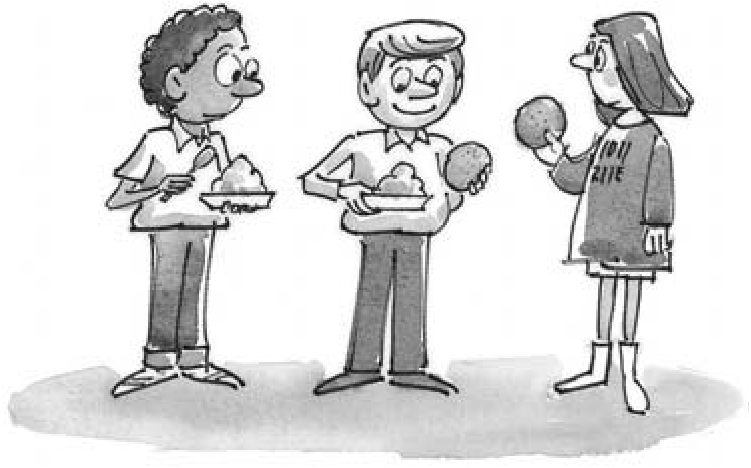

2. (a) 4 / 20 (b) 8 / 20 (c) 12 / 20 (d) 14 / 20
_Nhận xét:_ Việc cộng $(4 + 8 + 12) / 20$ sẽ cho ra đáp án sai ở câu (d)—vì phép tính này đã đếm lặp (double-counting) một số dấu chấm và đếm tới ba lần (triple-counting) một số dấu chấm khác. 
**Giải thích chi tiết:** Xác suất của hợp các sự kiện không đơn giản là tổng các xác suất nếu các sự kiện đó không xung khắc. Ta phải loại bỏ đi các phần giao bị tính trùng lặp.

3. Chúng giống nhau (They are the same).
**Giải thích chi tiết:** Hai xác suất này bằng nhau vì chúng đại diện cho cùng một sự kiện, hoặc các sự kiện có cùng số lượng kết quả thuận lợi trên cùng một không gian mẫu.

4. Sai (False). Việc cộng đơn thuần hai xác suất (chances) sẽ tính lặp lại (double count) xác suất phần giao của hai sự kiện. Xem ví dụ 5 ở trang 242.
**Giải thích chi tiết:** Khi hai biến cố A và B không xung khắc, ta cần sử dụng quy tắc cộng tổng quát: $P(A \cup B) = P(A) + P(B) - P(A \cap B)$. Phép cộng đơn thuần chỉ áp dụng khi $P(A \cap B) = 0$.

5. Sai (False). Có 1/10 cơ hội rút được số 7 trong bất kỳ lần rút cụ thể nào, nhưng các lần rút này không phải là các sự kiện xung khắc (mutually exclusive).
**Giải thích chi tiết:** Hai sự kiện không xung khắc có nghĩa là chúng có thể đồng thời xảy ra (bạn có thể rút được số 7 ở cả lần đầu lẫn lần sau). Vì vậy, bạn không thể cộng đơn giản hai xác suất $1/10 + 1/10$.

6. Đúng (True). 100% − _(_ 10% + 20% _)_ = 70%. Sử dụng quy tắc cộng, và trang 223 cho quy tắc trừ.
**Giải thích chi tiết:** Ở đây hai biến cố đã cho là xung khắc, nên ta áp dụng quy tắc cộng để tìm xác suất hợp ($10\% + 20\% = 30\%$). Xác suất để điều ngược lại xảy ra (biến cố phần bù) sẽ là tổng không gian mẫu ($100\%$) trừ đi $30\%$, kết quả là $70\%$.

### Tập C, trang 246

1. (a) 1 / 52 số thí sinh bước lên.
**Giải thích chi tiết:** Có 52 lá bài, và chỉ có 1 lá Át Cơ. Xác suất rút trúng Át Cơ là 1/52, tức là tỷ lệ thí sinh bước lên là 1/52.

   - (b) 1 / 52 số thí sinh bước lên; xem ví dụ 2 trong chương 13.
**Giải thích chi tiết:** Tương tự câu (a), xác suất rút trúng lá Già Cơ (King of Hearts) ở lần thứ hai cũng là 1/52.

   - (c) Những người rút được Át Cơ ở lá bài đầu tiên và Già Cơ ở lá bài thứ hai sẽ bước lên hai lần. (Xét về việc giành được kỳ nghỉ cuối tuần, như vậy là thừa mứa). Tỷ lệ số người bước lên hai lần là 1 / 52 × 1 / 51.
**Giải thích chi tiết:** Vì đây là rút không hoàn lại (rút xong không bỏ lại vào bộ bài), nên sau khi rút lá đầu tiên, bộ bài chỉ còn 51 lá. Xác suất để xảy ra đồng thời cả hai sự kiện liên tiếp này là tích của hai xác suất: $(1/52) \times (1/51)$.

   - (d) Sai (False); như đã chỉ ra ở câu (c), các sự kiện này không hề xung khắc với nhau, do đó phép cộng đơn thuần sẽ tính lặp (double count) xác suất mà cả hai cùng xảy ra.

   - _Nhận xét._ Xác suất đúng ở câu (d) phải là:
1 / 52 + 1 / 52 − (1 / 52 × 1 / 51) .
**Giải thích chi tiết:** Áp dụng quy tắc $P(A \cup B) = P(A) + P(B) - P(A \cap B)$.

2. (a) 1 / 52 số thí sinh bước lên.

   - (b) 1 / 52 số thí sinh bước lên.

   - (c) Nếu bạn rút được Át Cơ ở lá bài đầu tiên, bạn không thể rút được nó ở lá bài thứ hai; không ai bước lên hai lần.
**Giải thích chi tiết:** Vì mỗi bộ bài chỉ có một lá Át Cơ, nếu lá đầu tiên đã là Át Cơ thì chắc chắn lá thứ hai không thể là Át Cơ nữa.

   - (d) Đúng (True); như câu (c) đã chỉ ra, các sự kiện này là xung khắc (mutually exclusive), nên phép cộng xác suất là hợp lệ.

   - _Nhận xét._ Trong bài tập 2, hai cách để chiến thắng là xung khắc với nhau; điều này không đúng ở bài tập 1. Phép cộng xác suất hợp lệ cho bài 2, nhưng sai ở bài 1.

3. (a,b) Đúng (True); xem ví dụ 2 trong chương 13.
**Giải thích chi tiết:** Xác suất của một sự kiện đơn lẻ sẽ không thay đổi khi bạn không biết (hoặc chưa mở) kết quả của các lá bài khác.

   - (c) Sai (False). "Lá bài trên cùng là J Nhép (Jack of clubs)" và "lá bài dưới cùng là J Rô (Jack of diamonds)" không phải là hai biến cố xung khắc, do đó bạn không thể cộng các xác suất của chúng.
**Giải thích chi tiết:** Cả hai biến cố này hoàn toàn có thể xảy ra đồng thời trên cùng một bộ bài, nên chúng không xung khắc. Do đó, phép cộng sẽ bị tính lặp phần giao.

   - (d) Đúng (True). "Lá bài trên cùng là J Nhép" và "lá bài dưới cùng là J Nhép" là hai biến cố xung khắc.
**Giải thích chi tiết:** Bộ bài chỉ có duy nhất một lá J Nhép. Nếu nó đã ở trên cùng thì không thể nằm ở dưới cùng được, hai sự kiện này không thể cùng xảy ra, nên có thể dùng phép cộng xác suất.

   - (e,f) Sai (False); các sự kiện này không độc lập với nhau, bạn cần sử dụng các xác suất có điều kiện (conditional chances).
**Giải thích chi tiết:** Khi rút bài không hoàn lại, thành phần của bộ bài thay đổi ở lần rút thứ hai. Do đó, sự kiện thứ hai phụ thuộc vào sự kiện thứ nhất.

4. (a) Sai (False); 1 / 2 × 1 / 3 = 1 / 6, nhưng A và B có thể là các biến cố phụ thuộc: bạn cần xác suất có điều kiện của B khi biết A đã xảy ra.
**Giải thích chi tiết:** Phép nhân $P(A) \times P(B)$ chỉ đúng khi A và B hoàn toàn độc lập. Trong trường hợp tổng quát, công thức đúng phải là $P(A \cap B) = P(A) \times P(B|A)$.

   - (b) Đúng (True); xem phần 4 của chương 13.
**Giải thích chi tiết:** Đây chính là định nghĩa toán học của hai biến cố độc lập.

   - (c) Sai (False). ("Xung khắc" hàm ý về sự phụ thuộc, và xác suất thực tế là 0.)
**Giải thích chi tiết:** Nếu A và B xung khắc, nghĩa là nếu A xảy ra thì chắc chắn B không thể xảy ra (phụ thuộc tuyệt đối). Khi đó xác suất để cả hai cùng xảy ra là $P(A \cap B) = 0$.

   - (d) Sai (False); 1 / 2 + 1 / 3 = 5 / 6, nhưng bạn không thể cộng các xác suất lại vì A và B có thể không xung khắc.
**Giải thích chi tiết:** Phép cộng đơn thuần chỉ áp dụng khi hai biến cố không có phần giao (xung khắc). Nếu chúng có phần giao, bạn phải trừ đi phần xác suất giao đó.

   - (e) Sai (False); nếu chúng độc lập, chúng có một xác suất nhất định để cùng xảy ra, nên chúng không thể xung khắc: không được cộng các xác suất lại với nhau.
**Giải thích chi tiết:** Biến cố độc lập (với xác suất khác 0) thì luôn có giao điểm $P(A \cap B) = P(A) \times P(B) > 0$. Vì chúng có thể cùng xảy ra, nên không xung khắc, và ta không được dùng phép cộng xác suất đơn giản.

   - (f) Đúng (True).
**Giải thích chi tiết:** Đây là nguyên lý cơ bản của hai biến cố xung khắc: xác suất hợp bằng tổng các xác suất.

_Nhận xét._ Nếu bạn gặp khó khăn với bài tập 3 và 4, hãy xem ví dụ 6, trang 244.

5. Xem ví dụ 2 trong chương 13.

   - (a) 4 / 52
**Giải thích chi tiết:** Bộ bài 52 lá có 4 lá Át. Xác suất để rút trúng 1 lá Át bất kỳ ở lần đầu tiên là 4/52.

   - (b) 4 / 51
**Giải thích chi tiết:** Giả sử đây là xác suất rút được lá Át ở lần thứ hai sau khi đã biết lá đầu tiên KHÔNG phải là Át. Bộ bài lúc này còn 51 lá và vẫn còn nguyên 4 lá Át, nên xác suất là 4/51.

   - (c) 4 / 52 × 4 / 51
**Giải thích chi tiết:** Đây là xác suất của hai sự kiện liên tiếp không hoàn lại. Ví dụ, xác suất rút lá bài đầu thuộc một nhóm 4 lá (như Át) là $4/52$, và lá bài thứ hai thuộc một nhóm 4 lá khác (như Già) trong 51 lá còn lại là $4/51$. Tích của chúng là $(4/52) \times (4/51)$.

Tập D, trang 250

1. (a) (i) (b) (i) (ii) (c) (iii) (d) (ii) (iii) (e) (i) (ii) (f) (i)

2. Cược (a) và (f) nói về cùng một ý nghĩa nhưng bằng các ngôn từ khác nhau. (b) và (e) cũng vậy. Cược (d) thì tốt hơn (c).
**Giải thích chi tiết:** Các phát biểu (a)-(f), (b)-(e) là những cách diễn đạt tương đương nhau về mặt xác suất. Cược (d) mang lại cơ hội chiến thắng cao hơn hoặc giá trị kỳ vọng lớn hơn so với (c).

3. (a) 3 / 4 (b) 3 / 4 (c) 9 / 16 (d) 9 / 16 (e) 1 − 9 / 16 = 7 / 16
**Giải thích chi tiết:**
- (a), (b): Xác suất một sự kiện độc lập xảy ra là $3/4$.
- (c), (d): Xác suất hai sự kiện độc lập cùng xảy ra là tích các xác suất: $(3/4) \times (3/4) = 9/16$.
- (e): Xác suất của biến cố bù (ít nhất một sự kiện không xảy ra) là $1 - P(\text{cả hai cùng xảy ra}) = 1 - 9/16 = 7/16$.

4. (a) Xác suất không có mặt Át nào = _(_ 5 / 6 _)_^3 ≈ 58%, vì vậy xác suất có ít nhất một mặt Át ≈ 42%. Giống như bài toán của de Méré, nhưng với 3 lần tung thay vì 4.
**Giải thích chi tiết:** Mỗi lần tung xúc xắc có xác suất 5/6 để không ra mặt Át (mặt 1). Tung 3 lần độc lập, xác suất để cả 3 lần đều không ra Át là $(5/6)^3 \approx 58\%$. Xác suất để có "ít nhất một lần ra Át" là phần bù của trường hợp trên: $100\% - 58\% = 42\%$.

(b) 67% (c) 89%

5. 1 − _(_ 35 / 36 _)_^36 ≈ 64%
**Giải thích chi tiết:** Khi tung cặp xúc xắc, có tổng cộng 36 kết quả có thể, và chỉ có 1 kết quả là "hai mặt 6" (double 6). Xác suất không ra double 6 trong 1 lần tung là 35/36. Với 36 lần tung, xác suất để không lần nào ra double 6 là $(35/36)^{36}$. Vì vậy, xác suất để có ít nhất 1 lần ra double 6 là phần bù: $1 - (35/36)^{36} \approx 64\%$.

6. Xác suất để điểm 17 không xuất hiện trong 22 lần ném là _(_ 31 / 32 _)_^22 ≈ 49.7%. Do đó, xác suất để nó xuất hiện trong 22 lần ném là 100% − 49.7% = 50.3%. Vì vậy, kèo cược này (đặt cược với tỷ lệ ăn 1:1) mang lại lợi thế cho Người làm cái (Master of the Ball). Thật tội nghiệp cho những Người chơi mạo hiểm (Adventurers).
**Giải thích chi tiết:** Trò chơi có 32 kết quả khả dĩ, chỉ có 1 kết quả cho ra điểm 17. Xác suất không ra điểm 17 trong 1 lần là 31/32. Qua 22 lần tung độc lập, xác suất để hoàn toàn không thấy điểm 17 là $(31/32)^{22} \approx 49.7\%$. Xác suất xuất hiện ít nhất một lần là $100\% - 49.7\% = 50.3\%$. Vì xác suất này lớn hơn 50%, nhà cái sẽ có lợi thế thắng cao hơn trong dài hạn.

7. Xác suất sống sót qua 50 nhiệm vụ là _(_ 0.98 _)_^50 ≈ 36%. Tác giả Deighton đang cộng dồn xác suất của các sự kiện không hề xung khắc với nhau.
**Giải thích chi tiết:** Xác suất sống sót sau 1 nhiệm vụ là 98% (0.98). Giả sử các nhiệm vụ là độc lập, xác suất sống sót qua 50 nhiệm vụ liên tiếp phải dùng phép nhân xác suất: $(0.98)^{50} \approx 36\%$. Lỗi sai phổ biến là lấy $2\% \times 50 = 100\%$ tỷ lệ tử vong; phép cộng xác suất này hoàn toàn sai vì rủi ro ở mỗi nhiệm vụ không loại trừ lẫn nhau (chúng không xung khắc).

### **Chương 15.**

Tập A, trang 258

1. Số đó là 4.

2. Số đó là 6.

3. (a) _(_ 5 / 6 _)_^4 = 625 / 1,296 ≈ 48%
**Giải thích chi tiết:** (a) Đây là xác suất không có lần nào xuất hiện mặt Át (mặt 1) trong 4 lần tung. Mỗi lần tung có xác suất 5/6 không ra Át. Lặp lại 4 lần tung độc lập là phép tính nhân: $(5/6)^4$.

   - (b) 4 _(_ 1 / 6 _)(_ 5 / 6 _)_^3 = 500 / 1,296 ≈ 39%
**Giải thích chi tiết:** (b) Xác suất có đúng 1 lần ra mặt Át. Dùng phân phối nhị thức: Có 4 vị trí có thể xuất hiện mặt Át, nhân với xác suất tung ra 1 mặt Át $(1/6)$ và 3 mặt không phải Át $(5/6)^3$.

   - (c) 6 _(_ 1 / 6 _)_^2 _(_ 5 / 6 _)_^2 = 150 / 1,296 ≈ 12%
**Giải thích chi tiết:** (c) Xác suất có đúng 2 mặt Át. Theo phân phối nhị thức, có $C(4,2) = 6$ cách sắp xếp 2 mặt Át trong 4 lần tung, nhân với xác suất của 2 mặt Át $(1/6)^2$ và 2 mặt không Át $(5/6)^2$.

   - (d) 4 _(_ 1 / 6 _)_^3 _(_ 5 / 6 _)_ = 20 / 1,296 ≈ 1.5%
**Giải thích chi tiết:** (d) Xác suất có đúng 3 mặt Át. Có 4 cách chọn vị trí cho mặt không phải Át, nhân với xác suất của 3 mặt Át và 1 mặt không Át.

   - (e) _(_ 1 / 6 _)_^4 = 1 / 1,296 ≈ 0.08 của 1%
**Giải thích chi tiết:** (e) Xác suất cả 4 lần đều ra mặt Át: $(1/6)^4$.

   - (f) Quy tắc cộng (Addition rule): _(_ 150 + 20 + 1 _)_ / 1,296 ≈ 13%.
**Giải thích chi tiết:** (f) Xác suất để ra "từ 2 mặt Át trở lên". Vì các biến cố "đúng 2", "đúng 3", và "đúng 4" mặt Át không thể xảy ra cùng lúc (chúng xung khắc), ta có thể áp dụng quy tắc cộng: cộng xác suất của các phần (c), (d), và (e) lại với nhau.

4. Điều này giống với bài tập 3(a–c). Tung ra một mặt Át giống như việc rút được một viên bi màu đỏ, trong khi các mặt từ 2 đến 6 tương ứng với viên bi màu xanh lá cây. Để hiểu tại sao, hãy tưởng tượng hai người, A và B, thực hiện các thí nghiệm ngẫu nhiên khác nhau:

A–71

- A tung một viên xúc xắc bốn lần và đếm số lần ra mặt Át.

- B rút bốn lần ngẫu nhiên có hoàn lại từ một hộp chứa R G G G G G (1 Đỏ, 5 Xanh) và đếm số lượng bi R (Đỏ).

Thiết bị là khác nhau, nhưng xét về mặt xác suất để nhận được một số lượng bi đỏ cụ thể nào đó, hai thí nghiệm này hoàn toàn tương đương nhau.

- Có bốn lần tung, giống như có bốn lần rút bi.

- Các lần tung là độc lập với nhau; các lần rút bi cũng vậy.

- Mỗi lần tung có 1 phần 6 cơ hội đóng góp 1 vào kết quả đếm (ra mặt Át); tương tự cho mỗi lần rút (bi Đỏ).

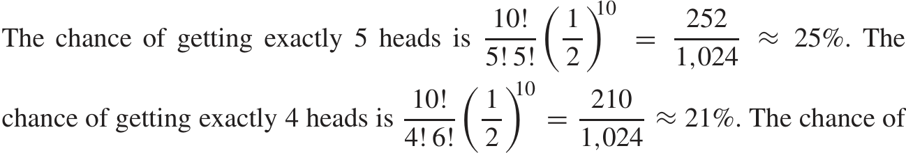

5. Xác suất để nhận được chính xác 5 mặt ngửa là 10! / (5!5!) * (1/2)^10... xác suất nhận được chính xác 6 mặt ngửa cũng tương tự. Theo quy tắc cộng, xác suất nhận được từ 4 đến 6 mặt ngửa là 672 / 1,024 ≈ 66%.
**Giải thích chi tiết:** Xác suất cho số lượng mặt ngửa cụ thể được tính bằng công thức phân phối nhị thức. Vì các biến cố (đúng 4 ngửa, đúng 5 ngửa, đúng 6 ngửa) là xung khắc (không thể cùng xảy ra), ta có thể cộng trực tiếp các xác suất riêng lẻ của chúng lại với nhau để tìm ra xác suất có "từ 4 đến 6 mặt ngửa". 

6. Bạn cần tính xác suất để có được 7, 8, 9, hoặc 10 mặt ngửa khi một đồng xu được tung 10 lần. Sử dụng công thức nhị thức và quy tắc cộng:

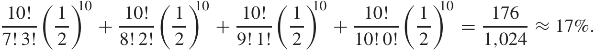

_Nhận xét._ Có vẻ như đây là kết quả của sự ngẫu nhiên, chứ không phải do tác dụng của vitamin.
**Giải thích chi tiết:** Kết quả thống kê không vượt quá giới hạn của độ lệch chuẩn thông thường sinh ra từ ngẫu nhiên, do đó không có bằng chứng thuyết phục nào cho thấy vitamin có tác động thực sự đến xác suất.

## **Phần V. Biến động ngẫu nhiên (Chance Variability)**

### **Chương 16. Định luật số lớn (The Law of Averages)**

Tập A, trang 277

1. Sai số là 50 ở dạng giá trị tuyệt đối, 5% ở dạng phần trăm.
**Giải thích chi tiết:** Sai số ngẫu nhiên (chance error) tuyệt đối là mức chênh lệch giữa số lượng thực tế quan sát được so với giá trị kỳ vọng lý thuyết. Khi chia cho tổng quy mô mẫu, sai số này tương đương 5%.

2. Sai số là 1.000 ở dạng giá trị tuyệt đối, 1 / 10 của 1% ở dạng phần trăm. So sánh điều này với bài tập trước: sai số ngẫu nhiên đã tăng lên ở giá trị tuyệt đối (từ 50 lên 1.000) nhưng lại giảm xuống ở dạng phần trăm (từ 5% xuống 0.1%).
**Giải thích chi tiết:** Đây là cốt lõi của Định luật số lớn (Law of Averages): Khi kích thước mẫu (số lần thử nghiệm) ngày càng tăng, sai số tuyệt đối có xu hướng lớn hơn, nhưng sai số tương đối (tính theo phần trăm trên tổng mẫu) lại tiệm cận về 0.

3. Sai (False). Xác suất vẫn giữ nguyên ở mức 50%. Xem trang 274.
**Giải thích chi tiết:** Đồng xu hay các quá trình ngẫu nhiên không có "trí nhớ". Bất kể kết quả của hàng loạt các lần tung trước đó có ra sao, xác suất mặt ngửa ở lần tung tiếp theo độc lập vẫn luôn luôn là 50%. Sự bù trừ ngẫu nhiên không xảy ra ngay lập tức ở lần thử tiếp theo.

4. (a) Mười lần tung. Khi số lần tung tăng lên, tỷ lệ phần trăm mặt ngửa có khả năng ngày càng gần với mức 50% hơn, và khả năng vượt mức 60% mặt ngửa ngày càng ít đi. Ở đây, sự biến động ngẫu nhiên trong tỷ lệ phần trăm (chance variability) giúp ích cho bạn, một số lượng lần tung nhỏ sẽ tốt hơn một số lượng lớn.
**Giải thích chi tiết:** Bạn muốn đạt tỷ lệ vượt ngưỡng kỳ vọng khá xa (> 60%). Khi quy mô thử nghiệm nhỏ (10 lần), sai số tính theo phần trăm rất cao, tạo cơ hội cho bạn vượt mốc dễ dàng hơn so với mẫu thử lớn.

   - (b) Một trăm lần tung: lúc này sự biến động ngẫu nhiên trong tỷ lệ phần trăm lại gây bất lợi cho bạn— vì bạn muốn kết quả nằm sát mốc 50%. Với nhiều lần tung hơn, biến động tỷ lệ phần trăm sẽ giảm đi. Nhiều lần tung hơn thì tốt hơn.
**Giải thích chi tiết:** Khi mục tiêu của bạn là có được kết quả ổn định và bám sát giá trị kỳ vọng (giữa 40% và 60%), định luật số lớn sẽ hỗ trợ bạn. Số lượng thử nghiệm càng lớn, kết quả tỷ lệ càng hội tụ về 50%.

   - (c) Một trăm lần tung; tương tự như (b).
**Giải thích chi tiết:** Việc tăng số lần thử nghiệm luôn giúp tỷ lệ tổng thể tiến về gần đúng với xác suất lý thuyết (kỳ vọng) hơn.

   - (d) Mười lần tung. Khi số lần tung tăng lên, khả năng số lượng mặt ngửa bằng chính xác giá trị kỳ vọng sẽ ngày càng giảm đi. Hãy xét một trường hợp khắc nghiệt hơn: giả sử bạn tung đồng xu 1.000.000 lần. Cơ hội để nhận được CHÍNH XÁC 500.000 mặt ngửa—thay vì 500.001, hoặc 500.043, hoặc 499.997, hoặc một con số nào đó sát với 500.000—là vô cùng mong manh.
**Giải thích chi tiết:** Mặc dù tỷ lệ phần trăm hội tụ về 50%, nhưng không gian mẫu (số lượng các kết quả có thể xảy ra) trở nên quá lớn, khiến xác suất rơi vào trúng phóc một con số giá trị cụ thể bất kỳ (ngay cả là con số kỳ vọng) bị pha loãng và trở nên cực kỳ thấp.

5. Lựa chọn (i) tốt hơn. Tương tự như bài tập 4(a).
**Giải thích chi tiết:** Khi bạn muốn đặt cược vào một kết quả tỷ lệ phần trăm lệch xa đáng kể so với kỳ vọng (như > 60%), quy mô mẫu nhỏ hơn sẽ tạo ra sự dao động (biến động) mạnh hơn, mang lại cho bạn cơ hội chiến thắng lớn hơn.

6. Lựa chọn (ii), lý do là vì sai số ngẫu nhiên (chance error).
**Giải thích chi tiết:** Nếu điều kiện thắng cược dựa trên sai số tính bằng *giá trị tuyệt đối* (ví dụ: lệch 50 đơn vị so với kỳ vọng), số lần thử càng lớn thì sai số tuyệt đối có xu hướng càng giãn ra. Do đó mẫu lớn hơn (ii) sẽ giúp bạn vượt mốc tuyệt đối này dễ dàng hơn.

7. Khá giống nhau cho dù là rút có hoàn lại hay không hoàn lại.
**Giải thích chi tiết:** Khi kích thước của tổng thể (dân số) cực kỳ lớn so với kích thước mẫu được rút, sự thay đổi xác suất do việc "không hoàn lại" gây ra là không đáng kể, tỷ lệ bên trong quần thể gần như giữ nguyên.

8. Giống nhau. Cả hai hộp đều có 50% vé mang giá trị −1 và 50% mang giá trị +1.
**Giải thích chi tiết:** Phân phối xác suất của hai chiếc hộp hoàn toàn tương đồng về tỷ lệ. Giá trị kỳ vọng và độ biến động sinh ra từ chúng là như nhau.

9. Cuối cùng, sai số ngẫu nhiên sẽ lớn và mang giá trị âm. Sau đó, nó sẽ quay lại giá trị dương. Xét về giá trị tuyệt đối, biên độ dao động (swings) ngày càng trở nên dữ dội và rộng hơn.
**Giải thích chi tiết:** Khi số lượng lần lặp lại tăng lên không giới hạn, sai số tuyệt đối không hội tụ về 0 mà sẽ dao động như một quỹ đạo bước ngẫu nhiên (random walk). Biên độ dao động của nó tăng theo hàm căn bậc hai của số lần thử ($\sqrt{N}$), tạo ra các bước ngoặt ngày càng lớn về cả hai phía âm và dương.

Tập B, trang 280

1. 47 × 1 + 53 × 2 = 153.
**Giải thích chi tiết:** Tổng giá trị kỳ vọng (Expected value) được tính bằng cách lấy tần suất kỳ vọng (số lần) nhân với giá trị của mỗi kết quả. Ở đây là 47 lần ra giá trị 1 và 53 lần ra giá trị 2.

2. (a) 100, 200 (b) 50, 50 (c) 50 × 1 + 50 × 2 = 150.
**Giải thích chi tiết:**
- (a) Nếu kết quả kém nhất xảy ra (tất cả 100 lần rút đều ra 1), tổng là 100; cao nhất là 200 (nếu tất cả ra 2).
- (b) Giá trị kỳ vọng là kết quả chia đều dựa trên xác suất (50 lần ra 1, 50 lần ra 2).
- (c) Do đó, tổng giá trị kỳ vọng tính được là $50 \times 1 + 50 \times 2 = 150$.

3. (a) 100, 900.
   - (b) 33 × 1 + 33 × 2 + 33 × 9 ≈ 400.
_Nhận xét._ 400 không nằm chính giữa 100 và 900.
**Giải thích chi tiết:**
- (a) Tối thiểu là tất cả rút được 1 (tổng 100), tối đa là tất cả rút được 9 (tổng 900).
- (b) Hộp chứa 3 loại vé với tỷ lệ ngang nhau ($1/3$). Kỳ vọng sau 100 lần rút được tính bằng $100 \times (1 + 2 + 9) / 3 \approx 400$.
- Nhận xét chỉ ra rằng do các giá trị bên trong hộp (1, 2, 9) bị lệch (skewed) chứ không phân bố đều, nên tổng kỳ vọng cũng không nằm ở trung điểm của khoảng Min-Max.

4. Dự đoán 500 cho cả ba trường hợp; hộp (iii) là tốt nhất, hộp (i) là tệ nhất.
**Giải thích chi tiết:** Cả 3 hộp đều có trung bình (kỳ vọng) là 500. Tuy nhiên, nếu bạn phải cá cược tổng điểm sẽ sát mốc 500, thì hộp (iii) tốt nhất do các giá trị của vé bên trong tập trung rất sát giá trị trung bình (độ lệch chuẩn thấp), dẫn đến tổng điểm ổn định. Hộp (i) chứa các giá trị rất cực đoan (0, 1000) khiến kết quả dễ biến động hoang dại nhất.

5. Xác suất rút được "1" là 1 phần 10; xác suất rút được "từ 3 trở xuống" là 3 phần 10; xác suất rút được "từ 4 trở lên" là 7 phần 10—vì có 7 số từ 4 đến 10 bao gồm cả biên. Việc rút ngẫu nhiên từ hộp được thảo luận chi tiết ở chương 13–14.
**Giải thích chi tiết:** Giả định hộp có 10 thẻ đánh số từ 1 đến 10. Xác suất của từng biến cố phụ thuộc trực tiếp vào số lượng thẻ thỏa mãn điều kiện tương ứng chia cho tổng số 10 thẻ.

6. Hộp (i) tốt hơn, nó có ít số −1 hơn, và cùng một số lượng số 2.
**Giải thích chi tiết:** Vì hộp (i) có ít thẻ âm (-1) hơn, giá trị trung bình (kỳ vọng lợi nhuận) cho mỗi lần rút của nó cao hơn so với hộp còn lại. Do đó nó có lợi cho người chơi hơn.

7. Các tùy chọn (i) và (ii) thực hiện điều đó. Lợi nhuận ròng của bạn là tổng của các khoản thắng và thua, có tính đến các dấu âm và dương.
**Giải thích chi tiết:** Hai tùy chọn này mô phỏng chính xác cấu trúc thưởng phạt. Khoản thu về ròng không chỉ là số lần thắng mà phải được lấy tổng dồn đại số (cộng phần thắng, trừ phần thua).

Tập C, trang 284

1. (i) và (ii) là giống nhau. (iii) có nghĩa là toàn bộ mười lần rút đều phải là “1,” điều này tồi tệ hơn so với (i).
**Giải thích chi tiết:** Tùy chọn (i) và (ii) là những cách diễn đạt tương đương cho cùng một thí nghiệm xác suất. Tùy chọn (iii) đặt ra một điều kiện thắng vô cùng hẹp và ngặt nghèo (bắt buộc phải rút trúng đúng 1 số liên tiếp 10 lần), do đó xác suất thắng cực kỳ thấp và là lựa chọn tồi.

2. Tùy chọn (i) là không tốt; tổng các lần rút không phản ánh lợi nhuận ròng. Tùy chọn (ii) không tốt; nó nói rằng bạn thắng $17 với 2 cơ hội trong tổng số 36 cho một lần chơi, nhưng cơ hội thực sự của bạn là 2 trong 38. Tùy chọn (iii) là đúng. Nếu còn nghi ngờ, hãy xem lại ví dụ 1 trên trang 283.
**Giải thích chi tiết:**
- (i) sai vì mô hình tổng điểm không tương đương với cơ chế thưởng phạt của sòng bạc.
- (ii) sai vì bàn Roulette kiểu Mỹ có 38 ô (kể cả 0 và 00), nên tỷ lệ là 2/38 chứ không phải 2/36.
- (iii) mô phỏng chính xác tỷ lệ xác suất thực tế và quy trình diễn ra lợi nhuận ròng.

3. Lợi nhuận ròng của bạn giống như tổng của 10 lần rút ngẫu nhiên có hoàn lại từ hộp dưới đây:

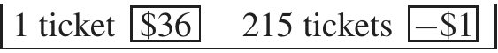

Đây là một trò chơi tồi tệ (terrible game).
**Giải thích chi tiết:** Trung bình của hộp mô phỏng này mang giá trị âm khá lớn. Sự phân bố số lượng vé thắng/thua được thiết kế hoàn toàn bất lợi, khiến bạn đối mặt với kỳ vọng thua lỗ liên tục nếu chơi trò này.

### **Chương 17. Giá trị kỳ vọng và Sai số chuẩn (The Expected Value and Standard Error)**

Tập A, trang 290

1. (a) 100 × 2 = 200 (b) −25 (c) 0 (d) 66 2/3
_Nhận xét về (d)._ “Giá trị kỳ vọng” (Expected value) không nhất thiết phải là một trong những giá trị có thể thực sự xảy ra. Nó giống như câu nói thống kê rằng trung bình một gia đình có 2.1 trẻ em. Điều này hoàn toàn có ý nghĩa, mặc dù "gia đình trung bình" có lẻ đứa trẻ chỉ là một hư cấu mang tính thống kê (statistical fiction).
**Giải thích chi tiết:** Giá trị kỳ vọng đơn thuần là trọng tâm toán học của phân phối xác suất. Dù thực tế bạn chỉ có thể rút được số nguyên (như 1 hoặc 2), trung bình cộng sau vô số lần rút sẽ hội tụ về một số thập phân hoặc phân số như 66.67.

2. Điều này tương tự như việc tính giá trị kỳ vọng cho tổng của hai lần rút từ hộp chứa các số 1 2 3 4 5 6. Vì vậy, đáp án là 2 × 3.5 = 7 ô vuông.
**Giải thích chi tiết:** Tung hai con xúc xắc là sự kiện độc lập. Trung bình mỗi xúc xắc (tương đương 1 hộp chứa 6 số) là $(1+2+3+4+5+6)/6 = 3.5$. Khi tung hai xúc xắc, ta chỉ việc cộng hai giá trị kỳ vọng lại với nhau: $3.5 + 3.5 = 7$.

3. Mô hình được cho ở các trang 283–284. Giá trị trung bình của các số trong hộp là:
_(_ $35 − $37 _)_ / 38 = −$2 / 38 ≈ −$0.05
(Để tính giá trị trung bình, bạn phải cộng tất cả các vé trong hộp lại với nhau; vé +$35 cộng thêm $35 vào tổng, nhưng 37 vé −$1 lại lấy đi mất $37; sau đó bạn phải chia cho tổng số vé trong hộp là 38.) Lợi nhuận ròng kỳ vọng bằng 100 × _(_ −$0.05 _)_ = −$5. Bạn có thể dự kiến sẽ thua khoảng $5.
**Giải thích chi tiết:** Cược một số cụ thể trên bàn Roulette Mỹ. Bạn có 1/38 cơ hội thắng $35, và 37/38 cơ hội thua $1. Lợi nhuận trung bình mỗi ván là âm $0.05 (nhà cái luôn nắm lợi thế). Chơi 100 ván, theo kỳ vọng bạn sẽ cúng cho nhà cái $5.

4. Hộp được cho ở trang 283. Giá trị trung bình của hộp là:
_(_ $18 − $20 _)_ / 38 = −$2 / 38 ≈ −$0.05
(Giá trị trung bình là tổng các con số trong hộp chia cho 38; 18 vé ghi "+$1" đóng góp $18 vào tổng, trong khi 20 vé ghi "−$1" lấy đi $20.) Lợi nhuận ròng kỳ vọng là 100 × _(_ −$0.05 _)_ = −$5.
**Giải thích chi tiết:** Đây là mô hình cá cược vào màu (Đỏ hoặc Đen). Bạn có 18 cơ hội thắng $1, và 20 cơ hội thua $1 (do có hai ô 0 và 00 màu xanh lá không thuộc Đỏ hay Đen). Tương tự, trung bình mỗi lần chơi bạn đều mất $0.05, và chơi 100 lần dự kiến sẽ mất $5.

_Nhận xét._ Các bài tập 3 và 4 cho thấy dù bạn đặt cược kiểu nào (cược số hay cược màu đỏ-hoặc-đen), bạn đều đặn được kỳ vọng sẽ mất đi 1 / 19 số tiền đặt cược của mình trong mỗi lần chơi.

5. −$50. Bài học rút ra: bạn càng chơi nhiều, bạn càng thua nhiều.
**Giải thích chi tiết:** Khi số lần chơi tăng từ 100 lên 1.000 ván, thua lỗ kỳ vọng tỷ lệ thuận nhân lên ($1.000 \times -0.05 = -50$). Bất kỳ trò chơi nào có lợi thế kỳ vọng âm đối với người chơi đều bào mòn túi tiền của họ một cách từ từ nhưng chắc chắn nếu chơi đủ lâu theo Định luật số lớn.

6. Giá trị trung bình của hộp là _(_ 18 x − $20 _)_ / 38. Để công bằng, trung bình này phải bằng 0. Phương trình là 18 x − $20 = 0. Do đó, x ≈ $1.11. Sòng bạc đáng lẽ phải trả cho bạn $1.11.
**Giải thích chi tiết:** Một trò chơi "công bằng" (fair game) trong lý thuyết thống kê là trò chơi không đem lại lợi thế cho bên nào, tức lợi nhuận kỳ vọng = 0. Với tỷ lệ thắng 18/38 và thua 20/38, tỷ lệ thưởng cho mỗi lần thắng phải được nâng lên thành $1.11 thay vì mức $1 hiện hành để triệt tiêu lợi thế của nhà cái.

7. Master of the Ball đáng lẽ phải trả 31 bảng Anh, đúng như những gì hội Adventurers nghĩ. Bài học rút ra: các Adventurers (Người chơi) có thể có được niềm vui, nhưng Master of the Ball (Nhà cái) mới là người có lợi nhuận.
**Giải thích chi tiết:** Tương tự câu trên, để cuộc cược cân bằng hoàn hảo, giải thưởng phải được đẩy lên 31 bảng để bù đắp rủi ro cho mức tỷ lệ chiến thắng quá thấp. Khi phần thưởng không tương xứng, dòng tiền hiển nhiên sẽ chảy về túi người làm cái.

Tập B, trang 293

1. (a) Giá trị trung bình của hộp là 4; độ lệch chuẩn (SD) là 2. Vì vậy, giá trị kỳ vọng cho tổng của 100 lần rút là 100 × 4 = 400; sai số chuẩn (SE) cho tổng số là √100 × 2 = 20.
**Giải thích chi tiết:** Giá trị kỳ vọng của tổng $N$ lần rút tăng tỷ lệ thuận với $N$ ($N \times \text{Trung bình}$), trong khi Sai số chuẩn (SE) chỉ tăng theo tỷ lệ căn bậc hai của $N$ ($\sqrt{N} \times \text{SD}$). Công thức này cho thấy sự lan rộng của sai số.

   - (b) Dao động quanh mức 400, cộng hoặc trừ 20 hoặc cỡ đó.
**Giải thích chi tiết:** Kết quả thực tế quan sát được sẽ rơi vào lân cận của khoảng (380, 420) trong phần lớn thời gian (phạm vi của một độ lệch chuẩn).

   - (c) Dự đoán là 400, sai số cỡ khoảng 20. Phần (b) và (c) là cách diễn giải thực tiễn ý nghĩa của các con số được tính toán ở phần (a).

2. Lợi nhuận ròng giống như tổng của 100 lần rút từ hộp chứa các vé −$1 $1 . Giá trị trung bình của hộp là $0; độ lệch chuẩn (SD) là $1. Tổng của 100 lần rút có giá trị kỳ vọng là $0; sai số chuẩn (SE) cho tổng là √100 × $1 = $10. Vậy lợi nhuận ròng của bạn sẽ dao động xung quanh $0, cộng hoặc trừ khoảng $10.
**Giải thích chi tiết:** Trò chơi tung đồng xu fair (50/50 ăn 1 thua 1) sẽ không nghiêng lợi thế về bên nào, nên lợi nhuận kỳ vọng là 0. Tuy nhiên, mức độ biến động dòng tiền trong túi bạn sau 100 ván sẽ dao động quanh mốc 0 với biên độ điển hình là cộng/trừ 10 đô la.

3. Với tùy chọn (ii), các con số quá sát với 50; không có con số nào cách xa hơn 5 đơn vị. Với tùy chọn (iii), các con số luân phiên đan xen nhau quá đều đặn. Tùy chọn (i) là đáp án đúng.
**Giải thích chi tiết:** Một chuỗi ngẫu nhiên thực sự sinh ra từ thực tế (100 lần tung) phải có sai số chuẩn SE = 5. Do đó kết quả thực tế phải dao động ra xa hơn 5 (có kết quả nằm ở 40 hoặc 60). Tùy chọn (ii) không có kết quả nào >55 hoặc <45 là không hợp lý về mặt thống kê. Tùy chọn (iii) bị can thiệp nhân tạo nên thiếu tính hỗn loạn tự nhiên. Chỉ (i) là phản ánh tính ngẫu nhiên đúng.

4. Giá trị kỳ vọng là 150, giá trị quan sát thực tế là 157, sai số ngẫu nhiên (chance error) là 7, sai số chuẩn (standard error) lý thuyết là 10.
**Giải thích chi tiết:** 
- Kỳ vọng (150) là lý thuyết. 
- Quan sát (157) là thực tế. 
- Sai số ngẫu nhiên (7) là khoảng cách giữa thực tế và lý thuyết ($157-150$). 
- Sai số chuẩn (10) là biên độ dao động *dự kiến* (lý thuyết) mà sai số ngẫu nhiên có thể trải ra trong hầu hết các lần thực nghiệm. Sai số 7 nằm tốt bên trong dải dao động dự kiến này.

5. Việc nhân số lần rút lên gấp 4 lần sẽ khiến giá trị kỳ vọng tăng lên gấp 4 lần và sai số chuẩn (SE) tăng lên √4 = 2 lần. Giá trị kỳ vọng cho tổng của 100 lần rút là 4 × 50 = 200, và SE là 2 × 10 = 20.
**Giải thích chi tiết:** Đây là bản chất toán học của phân phối tổng các biến ngẫu nhiên. Trong khi trung bình (kỳ vọng) tăng trưởng theo tốc độ tuyến tính, độ phân tán (biến động, SE) chỉ tăng trưởng theo tốc độ bậc hai. Đây là nguyên lý giải thích tại sao tỷ lệ phần trăm sai số lại giảm dần khi mẫu tăng lên.

6. (a) đúng, (b) sai: giá trị kỳ vọng cho tổng các lần rút CÓ THỂ được tính toán chính xác tuyệt đối bằng công thức:
#### số lần rút × giá trị trung bình của hộp
**Giải thích chi tiết:** Kỳ vọng là một giá trị toán học thuần túy cố định, hoàn toàn dự đoán được và không thay đổi đối với một mô hình đã cho.

(c) sai, (d) đúng: tổng thực tế sẽ chệch khỏi giá trị kỳ vọng của nó, và sai số chuẩn (SE) sẽ cho bạn biết mức độ chệch khoảng bao nhiêu.
**Giải thích chi tiết:** Kết quả thực nghiệm hiếm khi trúng phóc vào giá trị lý thuyết. SE không đóng vai trò tiên tri chính xác độ lệch, mà đóng vai trò như một chiếc "thước đo" ước tính biên độ chệch thông thường để cảnh báo người quan sát.

7. Có. Xác suất xảy ra là rất nhỏ, nhưng vẫn là một số dương (lớn hơn 0). Theo luật số lớn, nếu bạn chờ đợi đủ lâu (thực hiện phép thử đủ nhiều lần), các sự kiện có xác suất nhỏ bé chắc chắn vẫn sẽ xảy ra.

**Set C, trang 296**

1. 
   - (a) Giá trị nhỏ nhất là 100; giá trị lớn nhất là 400. *(Giải thích: Vì ta rút ngẫu nhiên 100 lần từ hộp có các thẻ mang giá trị nhỏ nhất là 1 và lớn nhất là 4, nên tổng nhỏ nhất khi cả 100 lần đều rút được thẻ 1 (100 × 1 = 100), và tổng lớn nhất khi cả 100 lần đều rút được thẻ 4 (100 × 4 = 400).)*
   - (b) Trung bình của hộp (average of the box) là $2$; độ lệch chuẩn (SD) là $1$. Tổng số sau 100 lần rút có giá trị kỳ vọng (expected value) là $100 \times 2 = 200$; sai số chuẩn (SE) cho tổng số là $\sqrt{100} \times 1 = 10$. Do đó, tổng số này sẽ nằm xoay quanh khoảng $200$, cộng trừ thêm khoảng $10$.
   - (c)

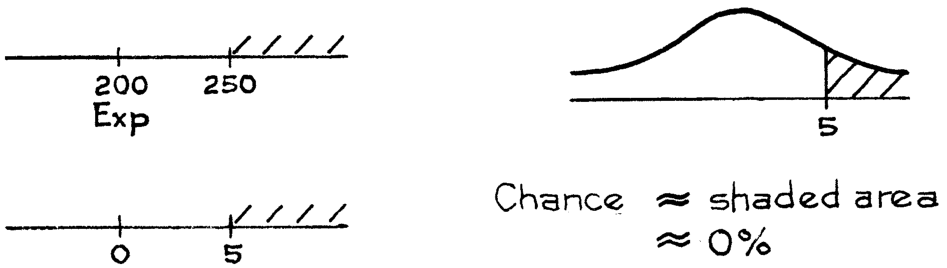

2. 
   - (a) Giá trị lớn nhất là 900; giá trị nhỏ nhất là 100. *(Giải thích: Hộp có giá trị lớn nhất là 9 và nhỏ nhất là 1, rút 100 lần nên tổng lớn nhất là 900 và nhỏ nhất là 100).*
   - (b) Xác suất $\approx 68\%$. *(Giải thích: Dựa vào quy tắc thực nghiệm (empirical rule) của phân phối chuẩn, khoảng $\pm 1$ SE (sai số chuẩn) tính từ giá trị kỳ vọng sẽ chiếm khoảng $68\%$ diện tích dưới đường cong chuẩn, tương đương với xác suất $68\%$).*

3. 
   - (a) Giá trị kỳ vọng là 0, nên tổng của các lần rút sẽ xoay quanh 0. Hy vọng tốt nhất của bạn lúc này phụ thuộc vào biến động ngẫu nhiên (chance variability) của tổng số — bạn muốn tổng số lệch xa khỏi giá trị kỳ vọng của nó. Vì biến động ngẫu nhiên tăng lên khi số lần rút tăng lên, bạn nên chọn 100 lần rút.
   - (b) Tương tự như (a). Bạn cần độ lệch ngẫu nhiên càng lớn càng tốt để đạt được giá trị mong muốn khác 0, do đó số lần rút nhiều hơn sẽ có lợi hơn.
   - (c) Trong trường hợp này, biến động ngẫu nhiên của tổng số lại gây bất lợi cho bạn, bởi vì bạn muốn tổng số nằm gần sát với giá trị kỳ vọng (tức là mức sai số càng thấp càng tốt). Sai số chuẩn của tổng số (SE) tỷ lệ với căn bậc hai của số lần rút, vì thế để SE nhỏ, bạn nên chọn số lần rút ít hơn là 10 lần.

4. 
   - (i) Giá trị kỳ vọng của tổng = 500, sai số chuẩn (SE) của tổng = 30.
   - (ii) Giá trị kỳ vọng của tổng = 500, sai số chuẩn (SE) của tổng = 20.
   
   Cả hai tổng số đều sẽ xoay quanh mức 500, nhưng tổng của trường hợp (i) có xu hướng phân tán xa mức 500 hơn do có SE lớn hơn. Trong các tình huống (a) và (b), sự biến động ngẫu nhiên (chance variability) giúp ích cho bạn vì bạn cần giá trị lệch khỏi kỳ vọng — do đó chọn (i). Trong tình huống (c), sự biến động ngẫu nhiên làm giảm cơ hội của bạn vì bạn muốn tổng nằm sát kỳ vọng — do đó chọn (ii).

5. 98%. *(Giải thích: Kết quả này thu được bằng cách tính giá trị z (z-score) của các biên, sau đó tra bảng phân phối chuẩn để tìm diện tích dưới đường cong tương ứng với xác suất $98\%$).*

6. Hoặc họ sẽ thắng $\$25.000$ (với xác suất là $20/38 \approx 53\%$), hoặc họ sẽ thua $\$25.000$ (với xác suất là $18/38 \approx 47\%$). Do đó, đáp án cho khả năng casino hòa vốn hoặc thắng là không phù hợp bằng việc tính trực tiếp khả năng sòng bạc phải chịu lỗ. Cụ thể, xác suất để có đúng nửa số lần (nếu chia nhỏ) hoặc ở đây xác suất xấp xỉ là $50\%$ dựa trên đường cong chuẩn. (Lưu ý: trong một số bài toán tính xấp xỉ bằng phân phối chuẩn cho giá trị kỳ vọng là $0$ trong một khoản cụ thể, diện tích sẽ chia đôi).
   
   - *Bình luận.* Sòng bạc (casino) sẽ hài lòng hơn rất nhiều với nhiều khoản cược nhỏ, bởi khi đó theo luật số lớn, lợi nhuận của họ gần như được đảm bảo chắc chắn (biến động ngẫu nhiên nhỏ so với tổng vốn). Ngược lại, với một khoản cược lớn duy nhất, sòng bạc phải đối mặt với rủi ro rất cao vì biến động ngẫu nhiên hoàn toàn có thể khiến họ thua đậm.

7. Chỉ có một con số trúng thưởng mang lại $\$35.000$, nhưng $37$ con số còn lại đều thua (mất $\$1.000$ mỗi số, tổng cộng mất $\$37.000$). Vì thế, nếu người chơi cược vào tất cả 38 con số, người đó chắc chắn sẽ lỗ $\$2.000$ (bởi $\$35.000 - \$37.000 = -\$2.000$).
   
   - *Bình luận.* Sòng bạc rất thích những người chơi rải đều tiền cược của họ ra nhiều ô khác nhau, vì như vậy tỷ lệ chiến thắng chung cuộc của nhà cái (house edge) sẽ phát huy tác dụng tối đa và họ cầm chắc phần thắng.

8. Lựa chọn (ii) là đúng; sai số chuẩn (SE) không tăng lên theo hệ số $2$ nguyên vẹn, mà nó chỉ tăng theo hệ số $\sqrt{2} \approx 1.4$. *(Giải thích: Khi tăng gấp đôi số lần rút hoặc số cỡ mẫu từ $n$ lên $2n$, SE của tổng sẽ tỉ lệ với căn bậc hai của số lần rút mới, tức là tăng thêm một khoảng là $\sqrt{2}$ lần chứ không phải tăng gấp đôi).*

**Set D, trang 299**

1. 
   - (a) Không, cần thay thế số $5$ bằng $7 - (-2) = 9$. *(Giải thích: Khi tính độ lệch chuẩn (SD) cho một danh sách có hai giá trị, công thức tính nhanh đòi hỏi ta phải dùng chênh lệch giữa hai giá trị đó. Chênh lệch ở đây phải là $7 - (-2) = 9$).*
   - (b) Có. Áp dụng đúng công thức ngắn gọn cho 2 giá trị.
   - (c) Có. Tương tự như trên.
   - (d) Không — danh sách này có tới 3 con số khác nhau, do đó không thể áp dụng công thức tính nhanh (short-cut) vốn dĩ chỉ dành riêng cho danh sách chứa đúng hai giá trị khác nhau.

2. Lợi nhuận ròng (net gain) thu được giống như tổng của 100 lần rút từ hộp sau:

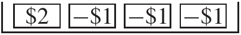

Trung bình của hộp (kỳ vọng cho 1 lần chơi) là: $(\$2 - \$1 - \$1 - \$1) / 4 = -\$0.25$. 
Độ lệch chuẩn (SD) của hộp được tính bằng công thức ngắn gọn cho hộp có 2 giá trị ($\$2$ và $-\$1$):

$[\$2 - (-\$1)] \times \sqrt{(1/4) \times (3/4)} \approx \$1.30$.

Lợi nhuận ròng sau 100 lượt chơi sẽ xoay quanh giá trị kỳ vọng là: $100 \times (-\$0.25) = -\$25$, với mức sai số (give or take) là sai số chuẩn (SE) của tổng: $\sqrt{100} \times \$1.30 = \$13$.
*(Nói cách khác, người chơi dự kiến sẽ lỗ $25 đô la, nhưng con số thực tế có thể dao động trong khoảng từ lỗ $38 đến lỗ $12).*

3. 
   - (a) Từ góc độ của nhà cái (the house), một đô la cược vào "nhà cái đặc biệt" (house special) tương đương với một lần rút từ hộp:

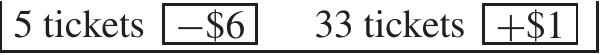

Trung bình của hộp là: $[5 \times (-\$6) + 33 \times \$1] / 38 \approx \$0.08$. Do đó, nhà cái kỳ vọng sẽ kiếm được khoảng 8 xu (cents) trên mỗi đô la được đặt cược. Xét về phía nhà cái, đây là một món cược cực kỳ béo bở.
   - (b) Lợi nhuận ròng của người chơi tương đương với tổng của 100 lần rút ngẫu nhiên có hoàn lại (with replacement) từ cùng một hộp nhưng bị đảo ngược dấu:

5 thẻ mang giá trị $+\$6$ và 33 thẻ mang giá trị $-\$1$

Trung bình của hộp đối với người chơi là $-\$0.08$; Độ lệch chuẩn (SD) của hộp là:

$[\$6 - (-\$1)] \times \sqrt{(5/38) \times (33/38)} \approx \$2.37$. 

Lợi nhuận ròng kỳ vọng của người chơi sau 100 lượt chơi là: $100 \times (-\$0.08) = -\$8$, với mức dao động (sai số chuẩn SE) vào khoảng $\sqrt{100} \times \$2.37 = \$23.7 \approx \$24$.
*(Giải thích: Người chơi dự kiến sẽ lỗ $8, nhưng do sai số ngẫu nhiên, họ có thể lời hoặc lỗ thêm khoảng $24 nữa).*

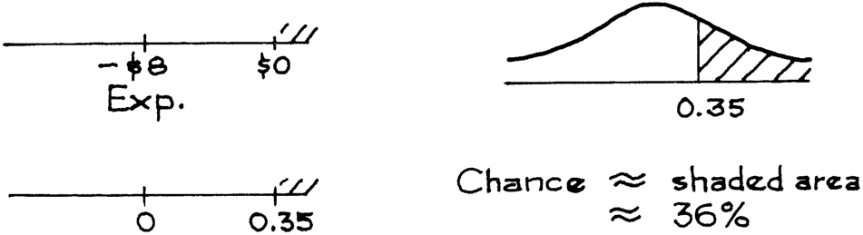

4. Lợi nhuận ròng kỳ vọng khi đặt cược 100 lần (mỗi lần 1 đô la) vào một nhóm khu vực (section) là $-\$5$; sai số chuẩn (SE) là $\$14$. Lợi nhuận ròng kỳ vọng khi đặt 100 lần cược vào màu đỏ (red) là $-\$5$; sai số chuẩn (SE) là $\$10$. Lựa chọn (i) và (ii) đều có chung một mức lợi nhuận ròng kỳ vọng (cùng bằng $-\$5$). Tuy nhiên, lựa chọn (i) có mức SE lớn hơn, đồng nghĩa với việc mức độ biến động (variability) cao hơn:
   - (a) là sai.
   - (b) và (c) là đúng.
   *(Giải thích: Vì lựa chọn (i) có biến động lớn hơn, người chơi có cơ hội thắng lớn hơn nhưng rủi ro thua đậm cũng cao hơn so với lựa chọn (ii) có cùng kỳ vọng nhưng ít biến động).*

**Set E, trang 303**

1. 
   - (a) Bạn không thể cộng các từ ngữ lại với nhau (để tính tổng), do đó hộp (i) bị loại. Với hộp (iii), bạn có 2/3 cơ hội đi lên mỗi lần, trong khi bài toán yêu cầu cơ hội đó chỉ là 1/2. Vì vậy, hộp (ii) là lựa chọn chính xác duy nhất để mô phỏng.
   - (b) Trung bình của hộp $= 0.5$ và độ lệch chuẩn (SD) của hộp cũng $= 0.5$. Tổng số sau 16 lần rút có giá trị kỳ vọng là $16 \times 0.5 = 8$; sai số chuẩn (SE) là $\sqrt{16} \times 0.5 = 2$. Do đó, số lượng mặt ngửa (heads) xuất hiện sẽ xoay quanh $8$, cộng trừ dao động khoảng $2$.

2. Mô hình hộp mới: gồm 4 thẻ $0$ và 1 thẻ $1$ (xác suất 1/5 cho giá trị 1). Với giá trị này, độ chênh lệch rơi vào khoảng $\pm 3$ SE. Dựa trên phân phối chuẩn, xác suất để biến cố nằm trong khoảng $\pm 3$ SE là khoảng $99.7\%$.

3. Mô hình hộp mới: gồm 1 thẻ $0$ và 1 thẻ $1$ (mô phỏng đồng xu đồng chất, xác suất 50%). Khoảng cần tính rơi vào mức lệch $1$ SE trở lên (về một phía). Theo đường cong chuẩn, diện tích phần đuôi (tail) lớn hơn $1$ SE là $(100\% - 68\%) / 2 = 16\%$. Do đó, xác suất là khoảng $16\%$.

4. Bảng tính toán cho các nhóm tung đồng xu: *(Giải thích: Giá trị kỳ vọng cho 100 lần tung là $50$ mặt ngửa. Sai số chuẩn (SE) là $\sqrt{100} \times 0.5 = 5$. Sai số ngẫu nhiên (Chance error) = Giá trị quan sát (Observed value) - Giá trị kỳ vọng (Expected value).)*

| Nhóm   100 lần tung | Giá trị   quan sát | Giá trị   kỳ vọng | Sai số   ngẫu nhiên | Sai số   chuẩn (SE) |
|---|---|---|---|---|
| 1–100 | 44 | 50 | −6 | 5 |
| 101–200 | 54 | 50 | +4 | 5 |
| 201–300 | 48 | 50 | −2 | 5 |
| 301–400 | 53 | 50 | +3 | 5 |

5. Kỳ vọng rơi vào khoảng 68 — xem lại ví dụ 5 ở trang 301; trên thực tế, kết quả quan sát được là 69. *(Giải thích: Khi tính toán xác suất thực nghiệm, giá trị thực tế quan sát được (69) rất gần với giá trị kỳ vọng (68), minh họa cho độ chính xác của ước lượng trong giới hạn sai số chuẩn).*

6. (a, b) Khoảng $99.7\%$ — vì khoảng giá trị này tương ứng với $\pm 3$ SE.
   
   - *Bình luận.* Khi số lần tung đồng xu tăng từ 10.000 lên 1.000.000, tỷ lệ phần trăm số mặt ngửa (heads) xuất hiện càng hội tụ sát về mức 50%: khoảng tin cậy $99.7\%$ đã bị thu hẹp đáng kể từ $50\% \pm 1.5\%$ (đối với 10.000 lần) xuống chỉ còn $50\% \pm 0.15\%$ (đối với 1.000.000 lần). Điều này minh họa sinh động cho Định lý Giới hạn Trung tâm (Central Limit Theorem) và Luật Số lớn (Law of Large Numbers), khi cỡ mẫu tăng thì tỷ lệ thực nghiệm sẽ càng sát với xác suất lý thuyết.

7. Giá trị kỳ vọng (Expected) là 30, giá trị quan sát thực tế (observed) là 33, do đó sai số ngẫu nhiên (chance error) là $33 - 30 = 3$. Sai số chuẩn (SE) được tính toán ra xấp xỉ 3.5. *(Giải thích: Vì sai số ngẫu nhiên (3) nằm trong phạm vi 1 SE (3.5), sự chênh lệch này là hoàn toàn bình thường và chỉ là do yếu tố ngẫu nhiên).*

8. *(Bài toán không có đáp án chi tiết, có thể là vẽ đồ thị hoặc tính toán đơn giản).*

9. Điều này là hoàn toàn bình thường. Số lượng quân Át (aces) xuất hiện không nhất thiết phải bằng chính xác con số lẻ $16.67$, mà trên thực tế nó chỉ dao động xung quanh giá trị kỳ vọng là $16.67$. Do đó, việc quan sát thấy một số nguyên (như 16 hay 17) là hệ quả tất yếu của phép thử rời rạc.

### **Chương 18. Xấp xỉ Chuẩn cho Biểu đồ Tần suất Xác suất**

**Set A, trang 312**

1. Nằm trong khoảng từ 70 đến 80, bao gồm cả hai đầu mút (inclusive). *(Giải thích: Khoảng diện tích được xét dưới biểu đồ bao trùm từ mép trái của 70 đến mép phải của 80).*

2. 
   - (a) Nằm trong khoảng từ $6.5$ đến $10.5$. *(Giải thích: Để biểu diễn các giá trị rời rạc từ 7 đến 10 trên một biểu đồ liên tục (histogram), ta cần dùng sự hiệu chỉnh liên tục (continuity correction), mở rộng $0.5$ về mỗi phía).*
   - (b) Nằm trong khoảng từ $6.5$ đến $7.5$ — đây chính là các cạnh bên trái và bên phải của hình chữ nhật biểu diễn cho giá trị 7 trên biểu đồ.

3. 
   - (a) 7. *(Tổng phổ biến nhất khi đổ 2 con xúc xắc là 7).*
   - (b) 7: Đây là thanh cao nhất (tallest bar) trong bảng biểu đồ thứ 2.
   - (c) Không, hiện tượng này chỉ đơn thuần là do biến động ngẫu nhiên (chance variation) trong các mẫu nhỏ. Thực tế thì theo lý thuyết, tổng bằng 4 ít có khả năng xảy ra hơn so với tổng bằng 5, điều này được thể hiện rõ trên biểu đồ tần suất xác suất (probability histogram) ở bảng dưới cùng.
   - (d) (iii). Bảng trên cùng là một biểu đồ tần suất thực nghiệm (empirical histogram) — nó hiển thị các tỷ lệ phần trăm được quan sát thực tế (observed percentages), chứ không phải xác suất lý thuyết (chances).

4. 
   - (a) 3, 6. *(Trong trường hợp thực nghiệm, đây là các kết quả nổi bật).*
   - (b) Bảng dưới cùng — bởi vì biểu đồ tần suất xác suất hiển thị các xác suất lý thuyết (chances). Dựa trên biểu đồ này, cả hai giá trị 2 và 3 đều có khả năng xảy ra ngang nhau đối với tích của hai con xúc xắc.
   - (c) Hãy nhìn vào bảng thứ hai: giá trị 3 xuất hiện thường xuyên hơn. Một lần nữa, điều này chỉ là do biến động ngẫu nhiên (chance variation) của dữ liệu thực tế.
   - (d) Giá trị 14 là bất khả thi đối với tích số của 2 con xúc xắc. Lý do: chỉ có hai cách để phân tích số 14 thành tích của 2 số nguyên, đó là $1 \times 14$ hoặc $2 \times 7$. Tuy nhiên, không có con xúc xắc tiêu chuẩn nào có mặt 7 hoặc 14.
   - (e) Bảng dưới cùng là biểu đồ tần suất xác suất, do đó các diện tích dưới biểu đồ sẽ đại diện cho xác suất (chances): $11.1\%$ chính là xác suất lý thuyết để tung được một cặp xúc xắc có tích bằng 6.

5. Biểu đồ A tương ứng với hộp (i) và biểu đồ B tương ứng với hộp (ii). Biểu đồ B có hình dáng thấp hơn, phân bố trải rộng hơn, và nằm xa hơn về phía bên phải. Điều này hoàn toàn phù hợp với thực tế là hộp (ii) có số trung bình lớn hơn và độ lệch chuẩn (SD) cũng lớn hơn so với hộp (i).

6. Sai. Biểu đồ tần suất xác suất cho tổng số chỉ cung cấp cho bạn xác suất lý thuyết của mức tổng đó. Nó không hề cho bạn biết thực tế các lần rút đã diễn ra như thế nào. Phần diện tích được tô đậm (shaded area) biểu diễn xác suất để tổng số rơi vào khoảng từ 5 đến 10 (bao gồm cả 5 và 10). *(Chú thích thêm: Hộp này có chứa 85 thẻ mang số 0, 2 thẻ mang số 1, và 13 thẻ mang số 2).*

**Set B, trang 318**

1. 
   - (i) Chính xác 6 mặt ngửa (Exactly 6 heads).
   - (ii) Từ 3 đến 7 mặt ngửa, không bao gồm hai đầu mút (exclusive), tức là chỉ tính 4, 5, 6 mặt ngửa.
   - (iii) Từ 3 đến 7 mặt ngửa, bao gồm cả hai đầu mút (inclusive), tức là tính 3, 4, 5, 6, 7 mặt ngửa.

2. Phần diện tích nằm giữa $51.5$ và $52.5$ bên dưới biểu đồ tần suất (histogram) cho ra xác suất chính xác. Đường cong chuẩn (normal curve) ở đây chỉ là một sự xấp xỉ (mặc dù nó là một sự xấp xỉ rất tốt và sát với thực tế). Việc mở rộng ra $0.5$ về mỗi phía gọi là hiệu chỉnh liên tục (continuity correction) giúp xấp xỉ phân phối rời rạc bằng phân phối liên tục.

3. Số lượng mặt ngửa kỳ vọng là $50$; sai số chuẩn (SE) là $5$. Để tính xác suất ra đúng 60 mặt ngửa, bạn cần tìm diện tích của hình chữ nhật nằm ngay trên giá trị 60 trong hình 3, trang 315. Bằng cách sử dụng hiệu chỉnh liên tục, hình chữ nhật này kéo dài từ $59.5$ đến $60.5$.

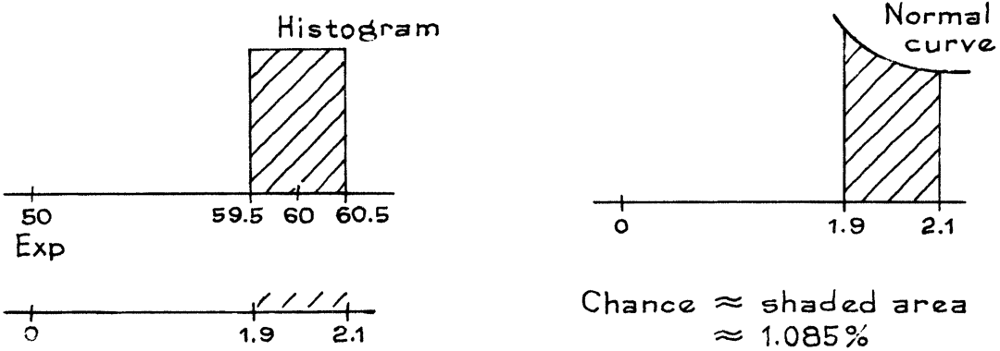

- *Bình luận.* Tính toán chính xác bằng phân phối nhị thức sẽ cho ra xác suất là $1.084\%$. Việc dùng xấp xỉ phân phối chuẩn trên khoảng $[59.5, 60.5]$ sẽ cho kết quả rất gần với con số này.

4. Dựa theo kết quả từ bài tập 3 (xác suất khoảng 1%), cứ khoảng một trăm nhóm thử nghiệm thì sẽ có một nhóm đạt chính xác 60 mặt ngửa. Trên thực tế (trong dữ liệu quan sát được), có đúng một nhóm trong số một trăm nhóm đạt được kết quả này (nhóm số #6,901–7,000). Điều này củng cố tính chính xác của lý thuyết xác suất khi áp dụng cho số lượng mẫu lớn.

5. Trong 10.000 lần tung, số lượng mặt ngửa kỳ vọng là $5.000$; sai số chuẩn (SE) là $\sqrt{10000} \times 0.5 = 50$.
   
   - (a)
   
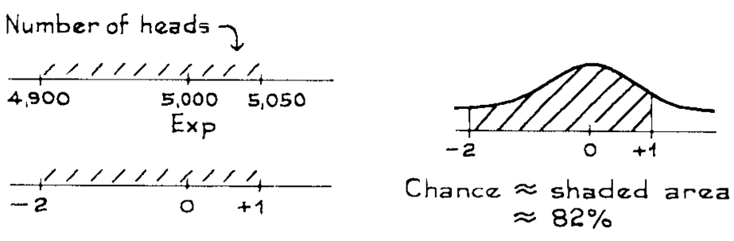

   - (b) Xác suất $\approx 2\%$. *(Giải thích: Giá trị cần tính nằm ở phần đuôi của phân phối chuẩn lớn hơn mức $+2$ SE. Dựa vào bảng phân phối chuẩn, diện tích của cả 2 đuôi (lớn hơn +2 SE và nhỏ hơn -2 SE) là $100\% - 95\% = 5\%$. Do ta chỉ lấy một đuôi bên phải, tỷ lệ thực tế khoảng $2.5\%$, ở đây xấp xỉ $2\%$).*
   - (c) Xác suất $\approx 16\%$. *(Giải thích: Yêu cầu tính xác suất nằm ở phần đuôi lớn hơn $+1$ SE. Diện tích một đuôi ngoài khoảng $\pm 1$ SE là $(100\% - 68\%) / 2 = 16\%$).*

6. 
   - (a) Có. Các khối hình (blocks) khá lớn, do đó việc sử dụng hiệu chỉnh liên tục (theo dõi sát các cạnh của hình chữ nhật) là cần thiết để tránh sai số lớn.
   - (b) Không. Các khối hình đã rất nhỏ, biểu đồ rất mịn, nên việc bỏ qua hiệu chỉnh cạnh không gây sai lệch đáng kể.
   - *Bình luận về (a).* Việc theo dõi kỹ các cạnh (edges) khi dùng hiệu chỉnh liên tục đã làm thay đổi đáng kể ước lượng xác suất từ $50\%$ lên $54\%$, cho thấy tầm quan trọng của kỹ thuật này với các phân phối có khối hình lớn.

**Set C, trang 324**

1. 
   - (a) 

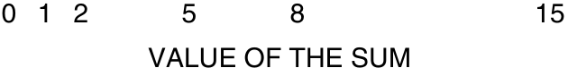

   - (b) Việc xuất hiện tổng là 3 có khả năng cao hơn so với tổng là 8, bởi vì khối hình nằm trên con số 3 to và cao hơn khối hình nằm trên số 8.

2. Số lượng mặt ngửa trong 400 lần tung của một đồng xu không đồng chất (biased coin) có xác suất ra ngửa 10%, được mô phỏng giống như tổng của 400 lần rút từ một hộp chứa: 9 thẻ số 0 và 1 thẻ số 1.
Số mặt ngửa kỳ vọng là: $400 \times (1/10) = 40$.
Sai số chuẩn (SE) là: $\sqrt{400} \times \sqrt{(1/10) \times (9/10)} = 20 \times 0.3 = 6$.
Bạn cần tìm diện tích của hình chữ nhật nằm trên số 40 (khoảng từ $39.5$ đến $40.5$), ở phần dưới cùng của hình 6 ở trang 320.

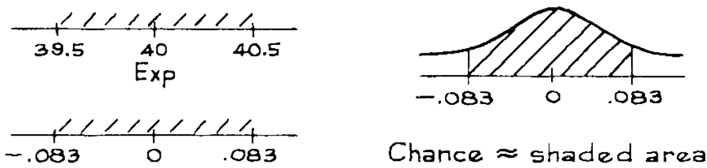

Dựa vào bảng số liệu phân phối chuẩn, diện tích này rơi vào khoảng từ $4\%$ đến $8\%$. (Chính xác hơn, tính toán chi tiết cho ra diện tích là $6.6\%$, và đó cũng chính là xác suất xuất hiện đúng 40 mặt ngửa.)

3. Đường cong chuẩn (normal curve) nằm thấp hơn so với đỉnh biểu đồ tần suất (histogram) ở vị trí quanh số 1. Do đó, nếu sử dụng đường cong chuẩn để xấp xỉ tính toán, kết quả ước lượng sẽ bị thấp hơn so với thực tế. Điều này thường xảy ra khi phân phối có độ lệch cao (skewness) và cỡ mẫu chưa đủ lớn để tiến gần đến phân phối chuẩn.

4. Có. Vì các khối hình (blocks) biểu diễn trên biểu đồ có kích thước lớn, việc không thực hiện hiệu chỉnh liên tục sẽ dẫn đến sai số đáng kể khi dùng xấp xỉ phân phối chuẩn.

5. Biểu đồ A tương ứng hộp (ii), biểu đồ B tương ứng hộp (i), biểu đồ C tương ứng hộp (iii). Nguyên tắc cơ bản là: Hộp càng mất cân đối (lopsided - tỷ lệ thẻ lệch nhiều về một phía), thì biểu đồ tần suất của nó cũng sẽ càng bị lệch (skewed) về một bên.
   
   - *Bình luận.* Khi thực hiện 25 lần rút từ hộp chứa 24 thẻ số 0 và 1 thẻ số 1, bạn không thể kỳ vọng sẽ rút được nhiều thẻ số 1. Khối hình chữ nhật ngoài cùng bên trái trong biểu đồ tần suất xác suất thể hiện xác suất để tổng số bằng 0 (tức là tất cả 25 lần rút đều là số 0). Xác suất này xấp xỉ $36\%$. Khối hình tiếp theo bên phải thể hiện xác suất để tổng số bằng 1 (tức là rút được đúng 1 thẻ số 1 và 24 thẻ số 0). Xác suất này xấp xỉ $38\%$. Các cột tiếp theo cũng tương tự. (Những xác suất này hoàn toàn có thể được tính toán chính xác bằng cách sử dụng công thức khai triển nhị thức ở Chương 15).

6. 
   - (i) 100 lần rút.
   - (ii) 400 lần rút.
   - (iii) 900 lần rút.
   
   Biểu đồ tần suất (histograms) sẽ ngày càng trở nên mịn hơn và có hình dáng sát với đường cong chuẩn (normal curve) hơn khi số lần rút (number of draws) tăng lên. Đây là hệ quả tất yếu của Định lý Giới hạn Trung tâm.

7. Chọn (i).
   
   - *Bình luận.* Các xác suất lý thuyết (chances) được xác định bằng diện tích nằm dưới biểu đồ tần suất xác suất. Thông thường, việc tính diện tích tương ứng bên dưới đường cong chuẩn sẽ cho ra một ước lượng xấp xỉ rất tốt. Tuy nhiên trong trường hợp đặc biệt này thì không — đường cong chuẩn nằm cao hơn hẳn so với biểu đồ tần suất thực tế, do đó phần diện tích được tính toán dưới đường cong chuẩn sẽ lớn hơn đáng kể so với diện tích thực tế dưới biểu đồ. Việc dùng xấp xỉ chuẩn ở đây sẽ dẫn đến sai số lớn.

8. Kết quả có khả năng xảy ra cao nhất (Most likely) là 105; ít có khả năng xảy ra nhất (least likely) là 101; giá trị kỳ vọng (expected value) là 100.
   
   - *Bình luận.* Trên biểu đồ tần suất này, có một "chỗ trũng" (trough) khá bất thường ngay gần vị trí của giá trị kỳ vọng. Đặc điểm hình học này không tuân theo dạng chuông truyền thống của phân phối chuẩn khi số mẫu nhỏ. (Tuy nhiên, nếu số lần rút tăng lên 100 lần, chỗ trũng này sẽ dần biến mất và đồ thị sẽ mượt mà hơn để tiệm cận phân phối chuẩn).

9. 
   - (a) Nhỏ hơn rất nhiều so với $50\%$. Giá trị 276.000 tương đương với 0.276 triệu, nằm ở khoảng giữa hai vạch 0.2 và 0.4 trên trục hoành. Phần diện tích nằm bên phải của điểm này trên đồ thị là cực kỳ khiêm tốn, chắc chắn nhỏ hơn mức $50\%$ rất nhiều. (Bởi vì biểu đồ tần suất này có phần đuôi bên phải vươn rất dài (right-skewed), dẫn đến giá trị kỳ vọng trung bình lớn hơn hẳn so với giá trị trung vị median).
   - (b) $1.000.000 / 100 = 10.000$. *(Giải thích: Tổng diện tích dưới biểu đồ xác suất phải bằng 1 hoặc $100\%$, dùng để tính tỷ lệ tương ứng).*
   - (c) Khoảng từ 400.000 đến 410.000 có khả năng xảy ra cao hơn hẳn nếu xét một cách tương đối. Khối hình (box) nằm ngay bên phải mốc 400.000 cao hơn đáng kể so với khối hình nằm sát ngay bên trái nó. Đặc điểm chung của các biến ngẫu nhiên dạng tích số (products) là chúng thường sở hữu những biểu đồ tần suất xác suất vô cùng bất quy tắc và không đối xứng.

## **Phần VI. Lấy mẫu (Sampling)**

### **Chương 19. Khảo sát Chọn mẫu (Sample Surveys)**

**Set A, trang 349**

1. Quần thể (population) bao gồm tất cả các sinh viên đại học đang đăng ký học trong học kỳ hiện tại. Tham số (parameter) cần quan tâm ở đây là tỷ lệ phần trăm các sinh viên này đang sống ở nhà (living at home) thay vì ở ký túc xá hoặc thuê ngoài. *(Giải thích: Quần thể là toàn bộ đối tượng mà cuộc khảo sát muốn nhắm đến, và tham số là giá trị thực tế của toàn quần thể mà chúng ta muốn đo lường hoặc ước lượng).*

2. 
   - (a) Đây là một phương pháp chọn mẫu xác suất (probability method): quy trình được định nghĩa hoàn toàn rõ ràng, yếu tố ngẫu nhiên (chance) can thiệp vào một cách có chủ đích — cụ thể là khi bạn chọn một điểm bắt đầu ngẫu nhiên từ 1 đến 100 — và hoàn toàn không có bất kỳ ai có quyền tự ý định đoạt người nào sẽ được đưa vào mẫu.
   - (b) Phương pháp này khác biệt so với lấy mẫu ngẫu nhiên đơn giản (simple random sampling). Ví dụ, theo cách chọn cách đều này, hai người có tên nằm kề sát nhau trên danh sách sẽ không bao giờ có cơ hội cùng xuất hiện trong một mẫu chọn. (Định nghĩa chi tiết về mẫu ngẫu nhiên đơn giản được trình bày ở phần 4). Kỹ thuật này thường được gọi là lấy mẫu hệ thống (systematic sampling).
   - (c) Mẫu được chọn ra là không chệch (unbiased): vì mỗi cá nhân trong danh sách đều chia sẻ cơ hội được chọn vào mẫu hoàn toàn bằng nhau (equal chance).

3. Chọn (ii). *(Giải thích: Lựa chọn (ii) mô tả đúng nguyên tắc cốt lõi của việc chọn mẫu xác suất giúp hạn chế được thiên kiến chủ quan (selection bias) của người đi thu thập dữ liệu).* Bạn có thể tham khảo thêm chi tiết ở các trang 334, 339 và 342 của sách giáo khoa.

4. Trong trường hợp này, quần thể (population) và mẫu (sample) là một và hoàn toàn đồng nhất với nhau, cụ thể là: tất cả nam giới 18 tuổi ở Hà Lan vào năm 1968. Vì toàn bộ dân số mục tiêu đã được lấy dữ liệu (hay còn gọi là tổng điều tra - census), không hề tồn tại sai số chọn mẫu (sampling error). Sai số chọn mẫu chỉ phát sinh khi bạn dùng một tập hợp nhỏ (mẫu) để suy luận cho một tập hợp lớn (quần thể).

5. Việc thực hiện khảo sát qua điện thoại có thể dẫn đến sai lệch (bias), bởi vì những người có đăng ký sử dụng điện thoại rất có thể mang đặc điểm kinh tế - xã hội khác biệt so với những người không sử dụng điện thoại. Tuy nhiên, tỷ lệ những người không dùng điện thoại ngày nay nhỏ đến mức sự sai lệch này thường có thể bị bỏ qua một cách an toàn. (Mặc dù vậy, nếu bạn đang cố gắng ước lượng những tỷ lệ rất nhỏ lẻ, hoặc nếu mục tiêu nghiên cứu của bạn nhắm thẳng vào nhóm người nghèo/người vô gia cư - những người thường không có điện thoại, thì sai lệch này trở thành một vấn đề nghiêm trọng). Mặt khác, việc chỉ sử dụng danh bạ điện thoại (telephone books) để chọn mẫu sẽ gây ra sai lệch cực kỳ nghiêm trọng, bởi có một lượng lớn người dùng sở hữu số điện thoại không được liệt kê công khai (unlisted numbers). Xem thêm giải thích ở phần 7.
   
   - *Bình luận.* Khoảng $95\%$ hộ gia đình ở Mỹ sở hữu điện thoại, theo số liệu từ _Statistical Abstract_, năm 2006, bảng 1117. Con số tương ứng vào năm 1980 là $93\%$. 

6. Không. Bạn có thể dễ dàng đoán trước rằng những người được phỏng vấn bởi các điều tra viên người da đen sẽ có xu hướng chỉ trích mạnh mẽ và bộc bạch quan điểm thật hơn về các vấn đề phân biệt chủng tộc. (Và trên thực tế diễn ra đúng như vậy). Đây là một ví dụ kinh điển về thiên kiến người phỏng vấn (interviewer bias), khi ngoại hình hoặc đặc điểm của người hỏi ảnh hưởng trực tiếp đến câu trả lời của người được hỏi.

7. Không, giáo xứ (parish) này rất có thể mang nhiều đặc điểm khác biệt hoàn toàn so với phần còn lại của miền Nam. (Thực tế đúng là vậy: Plaquemines là vùng đất chuyên canh tác mía đường, và việc trồng mía đòi hỏi nguồn lao động có tay nghề cao hơn đáng kể so với việc trồng bông). Do đó, việc chỉ lấy mẫu ở khu vực này sẽ dẫn đến một bức tranh sai lệch, không mang tính đại diện (unrepresentative) cho toàn bộ lực lượng lao động miền Nam.

8. Không. Thứ nhất, bản thân nhận định chủ quan của ETS về việc thế nào là các trường "có tính đại diện" (representative) đã có thể hàm chứa thiên kiến. Thứ hai, ngay cả khi các trường được chọn là tốt, các trường đó có thể đã không sử dụng các phương pháp lấy mẫu chuẩn xác (như lấy mẫu ngẫu nhiên) để chọn ra sinh viên của chính họ tham gia khảo sát. Cả hai yếu tố này đều có thể làm hỏng tính đại diện của kết quả.
   
   - *Bình luận.* Có khoảng 3.600 cơ sở giáo dục đại học tại Mỹ, bao gồm cao đẳng hai năm (junior colleges), cao đẳng cộng đồng (community colleges), và trường sư phạm. Có khoảng 1.000 trường trong số đó có quy mô rất nhỏ, tổng cộng chỉ chiếm khoảng $10\%$ tổng số sinh viên. Ở thái cực ngược lại, có khoảng 100 trường đại học lớn với quy mô hơn 20.000 sinh viên mỗi trường — nhưng nhóm nhỏ này lại chiếm tới một phần ba (1/3) tổng số sinh viên trên toàn quốc. Sự phân bố không đồng đều này khiến việc chọn "trường tiêu biểu" bằng cảm quan cực kỳ dễ dẫn đến sai lệch.

9. Có sự khác biệt khá lớn. Nhìn chung, nhóm người từ chối trả lời (non-respondents) luôn có những đặc điểm khác biệt so với nhóm người chịu trả lời (respondents) — ngay cả những người phản hồi sớm cũng có xu hướng khác với những người phản hồi muộn. (Trong nghiên cứu cụ thể này, tỷ lệ người mắc bệnh lao TB cao hơn hẳn ở nhóm 200 người phản hồi cuối cùng: rất có thể những người này e ngại và không muốn bệnh tình của mình bị xác nhận qua khảo sát). Đây là minh họa cho thiên kiến không phản hồi (non-response bias).

10. Một bản mô tả chi tiết và minh bạch về thiết kế chọn mẫu (sample design) sẽ mang lại độ tin cậy và sức thuyết phục cao hơn rất nhiều so với một lời quảng cáo đường mật (sales pitch) kèm theo sau là một tuyên bố miễn trừ trách nhiệm (disclaimer) sáo rỗng. Trong thống kê, tính minh bạch về cách dữ liệu được thu thập là quan trọng nhất.

11. Nếu chỉ nhận được 200 phản hồi từ 20.000 bảng câu hỏi được phát ra (tỷ lệ phản hồi 1%), thì thiên kiến không phản hồi (nonresponse bias) trở thành một vấn đề nghiêm trọng tàn phá toàn bộ giá trị của cuộc khảo sát (những người chịu trả lời chắc chắn không đại diện cho số đông). Tuy nhiên, nếu có 200 phản hồi từ 400 bảng câu hỏi (tỷ lệ 50%), thì tỷ lệ phản hồi này là đủ tốt để làm sáng tỏ một kết luận quan trọng: một bộ phận không nhỏ giáo viên sinh học trung học vẫn ủng hộ quan điểm thuyết sáng tạo (creationist views). Tỷ lệ phản hồi đóng vai trò quyết định đến độ tin cậy của khảo sát.

12. Sai. Vấn đề cốt lõi nghiêm trọng ở đây chính là thiên kiến không phản hồi (non-response bias). Nếu bạn lôi kéo thêm những người khác vào mẫu chỉ để bù đắp đủ số lượng (kích thước mẫu) đã lên kế hoạch ban đầu, những người mới này có nhiều khả năng mang đặc điểm khác biệt hoàn toàn so với những người đã từ chối trả lời trước đó. Do vậy, việc bù số lượng đơn thuần hoàn toàn không giúp khắc phục được sai lệch gốc do sự thiếu vắng dữ liệu của nhóm không phản hồi gây ra.

### **Chương 20. Sai số Ngẫu nhiên trong Lấy mẫu**

**Set A, trang 361**

1. Bảng đối chiếu các khái niệm lấy mẫu với mô hình hộp:

| Khái niệm khảo sát thực tế | Mô hình hộp tương ứng |
|---|---|
| Quần thể (population) | Hộp (box) chứa các thẻ |
| Tỷ lệ quần thể (population percentage) | Tỷ lệ thẻ số 1 trong hộp ($40\%$) |
| Mẫu (sample) | Các lần rút thẻ (draws) |
| Kích thước mẫu (sample size) | Số lần rút thẻ ($1.000$ lần) |
| Số lượng trong mẫu (sample number) | Số lượng thẻ mang số 1 trong các lần rút |
| Tỷ lệ của mẫu (sample percentage) | Tỷ lệ phần trăm thẻ mang số 1 trong các lần rút |
| Mẫu số để tính tỷ lệ mẫu | Số lần rút thẻ ($1.000$) |

2. Mô hình hộp: thực hiện 400 lần rút từ một hộp chứa 10.000 thẻ số 1 và 15.000 thẻ số 0. Trung bình của hộp là $0,40$, và độ lệch chuẩn (SD) là khoảng $0,5$. Do đó, giá trị kỳ vọng (EV) cho tổng số là $400 \times 0,4 = 160$ và sai số chuẩn (SE) cho tổng số là $\sqrt{400} \times 0,5 \approx 10$. 
Giải thích thêm: 
- Hộp chứa các số 0 và 1, tỷ lệ số 1 là $10.000 / 25.000 = 0,4$. Do đó trung bình của hộp bằng đúng tỷ lệ phần trăm số 1, là $0,40$.
- Độ lệch chuẩn của hộp chứa số 0 và 1 được tính bằng công thức: $\sqrt{\text{tỷ lệ số 1} \times \text{tỷ lệ số 0}} = \sqrt{0,4 \times 0,6} \approx 0,4899 \approx 0,5$.
- Giá trị kỳ vọng cho tổng (EV for sum) = số lần rút $\times$ trung bình hộp.
- Sai số chuẩn cho tổng (SE for sum) = $\sqrt{\text{số lần rút}} \times \text{SD hộp}$.

   - (a) EV cho số lượng = $160$ và SE cho số lượng = $10$. 

   - (b) EV cho phần trăm = $(160 / 400) \times 100\% = 40\%$, và 
   SE cho phần trăm = $(10 / 400) \times 100\% = 2,5\%$. 
   Giải thích thêm: Để chuyển từ "tổng số" sang "phần trăm", ta chỉ cần chia các giá trị EV và SE của tổng số cho tổng số lần rút (là $400$), sau đó nhân với $100\%$ để hiển thị dưới dạng phần trăm.

   - (c) Khoảng dự đoán cho phần trăm là $40\%$, với sai số chuẩn là $2,5\%$. 

_Nhận xét._ 
(i) Phần (b) và (c) yêu cầu tính ra cùng một kết quả con số, tuy nhiên trong phần (c) bạn cần diễn giải ý nghĩa của các con số đó (tức là 40% là kỳ vọng, còn 2,5% là mức độ dao động). 
(ii) Giá trị kỳ vọng cho phần trăm mẫu (sample percentage) luôn bằng đúng tỷ lệ phần trăm của tổng thể (population percentage) (tr. 359). 

3. SE cho số lần tung ra mặt ngửa là $\sqrt{10.000} \times 0,5 = 50$. SE cho phần trăm là $(50 / 10.000) \times 100\% = 0,5\%$. 
Giải thích thêm: Khi tung đồng xu công bằng, hộp tương ứng sẽ có trung bình bằng $0,5$ và SD bằng $0,5$. Do đó SE của tổng số mặt ngửa là $\sqrt{10.000} \times 0,5 = 50$. Khi chuyển sang phần trăm, ta lấy $50$ chia cho tổng số lần tung là $10.000$, tức là sai số là $0,5\%$.

4. (a) và (b) đều đúng. 

   - _Nhận xét._ Khi rút ngẫu nhiên từ một hộp chứa số 0 và 1, giá trị kỳ vọng (EV) cho phần trăm các số 1 được rút ra luôn bằng tỷ lệ phần trăm số 1 có trong hộp. Điều này luôn đúng bất kể việc rút thẻ có hoàn lại (with replacement) hay không hoàn lại (without replacement). Sự bằng nhau này là chính xác tuyệt đối, không có sai số.

5. Sai. Họ đã quên thay đổi mô hình hộp. Số lượng thẻ số 1 ở đây giống như tổng của 400 lần rút từ mô hình hộp được mô tả trong hình dưới đây:

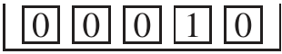

Giải thích thêm: Khi một mẫu ngẫu nhiên được lấy từ một tổng thể mới hoặc câu hỏi đặt ra giả định mới về cơ cấu tổng thể, tỷ lệ thành phần và SD của hộp cũng thay đổi theo. Do đó, ta không thể dùng nguyên EV và SE của mô hình ban đầu mà phải xây dựng một hộp mới phản ánh đúng bài toán.

6. Ước lượng đúng là $10\% + 1\%$. 
Giải thích thêm: Số lượng bi đỏ trong mẫu là $90 \pm 9$. Nếu số lượng cao hơn 1 SE, nghĩa là $90 + 9 = 99$. Bây giờ, ta chuyển con số này sang phần trăm của kích thước mẫu là $900$: $(99 / 900) \times 100\% = 11\%$, tức là $10\% + 1\%$. Sai số chuẩn (SE) cho một phần trăm được cộng vào hoặc trừ đi từ giá trị kỳ vọng (expected value), chứ không phải bằng phép nhân. Không được nhân phần trăm, vì SE phần trăm có bản chất là (SE của tổng / kích thước mẫu).

7. Tổng khoảng cách tiến lên bằng tổng số chấm gieo được của xúc xắc. Điều này tương đương với tổng của 200 lần rút (ngẫu nhiên có hoàn lại) từ một hộp chứa các số chấm của xúc xắc:

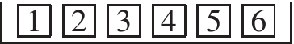

Trung bình của hộp này là $3,5$, và SD là $1,7$. Do đó, người chơi có thể kỳ vọng tiến lên khoảng $200 \times 3,5 = 700$ ô vuông, với sai số cộng trừ khoảng $\sqrt{200} \times 1,7 \approx 24$ ô vuông. 
Giải thích thêm: Xúc xắc có 6 mặt (từ 1 đến 6). Giá trị trung bình của 1 lần gieo là $(1+2+3+4+5+6)/6 = 3,5$. Độ lệch chuẩn của các giá trị từ 1 đến 6 tính ra xấp xỉ $1,7$. Áp dụng công thức căn bậc hai cho tổng của $n$ lần rút ngẫu nhiên, ta có kỳ vọng và sai số như trên.

8. Sherlock Holmes đã quên tính đến sai số ngẫu nhiên (chance error). 
Giải thích thêm: Dù mẫu có được lấy một cách ngẫu nhiên và chuẩn xác đến đâu, bất kỳ mẫu nhỏ nào cũng có sự dao động ngẫu nhiên xung quanh giá trị của tổng thể. Việc ngoại suy trực tiếp mà không đưa vào biên độ sai số (margin of error) sẽ dễ dẫn đến kết luận sai lệch.

Set B, trang 366 

1. (a) Giá trị kỳ vọng cho phần trăm bi đỏ trong mẫu bằng đúng phần trăm bi đỏ có trong tổng thể. (Tổng thể = hộp, mẫu = các lần rút thẻ.) Xem tr. 359. 

   - (b) Khi số lần rút tăng lên, SE cho số lượng bi đỏ trong mẫu cũng tăng lên, nhưng SE cho tỷ lệ phần trăm bi đỏ lại giảm xuống. Xem tr. 360. 
   Giải thích thêm: SE của tổng số tăng theo tỷ lệ thuận với $\sqrt{n}$. Tuy nhiên, SE của phần trăm bằng SE tổng số chia cho $n$ (tức là tỷ lệ thuận với $\frac{\sqrt{n}}{n} = \frac{1}{\sqrt{n}}$). Vì $\frac{1}{\sqrt{n}}$ giảm dần khi $n$ tăng, nên sai số phần trăm sẽ nhỏ đi. Điều này chứng tỏ mẫu càng lớn, tỷ lệ mẫu càng tiệm cận sát tỷ lệ của tổng thể.

2. Việc đầu tiên cần làm là thiết lập mô hình hộp. Hộp sẽ chứa 30.000 thẻ, mỗi thẻ tương ứng với một cử tri đã đăng ký; trong đó 12.000 thẻ được đánh số 1 (Đảng Dân chủ) và 18.000 thẻ được đánh số 0. Số lượng cử tri Đảng Dân chủ trong mẫu giống như tổng của 1.000 lần rút từ hộp này. Tỷ lệ thẻ số 1 trong hộp là $0,4$. Giá trị kỳ vọng cho tổng là $1.000 \times 0,4 = 400$. Độ lệch chuẩn (SD) của hộp là $\sqrt{0,4 \times 0,6} \approx 0,49$. Sai số chuẩn (SE) cho tổng là $\sqrt{1.000} \times 0,49 \approx 15$. 

   - (a) Giá trị kỳ vọng cho phần trăm là 400 trong 1.000 người, tức $40\%$. SE cho phần trăm là 15 trong số 1.000, tức là $1,5\%$. (Không có gì đáng ngạc nhiên về giá trị kỳ vọng: $40\%$ cử tri đã đăng ký là đảng viên Dân chủ). 

   - (b) Tỷ lệ phần trăm đảng viên Dân chủ trong mẫu sẽ ở mức khoảng $40,0\%$, cộng hoặc trừ sai số $1,5\%$. Phần (a) và (b) yêu cầu các phép tính giống hệt nhau; trong phần (b), bạn cần diễn giải kết quả đó thành ngôn ngữ thực tế. 

   - (c) Sự chênh lệch này ứng với $\pm 0,67$ SE, xác suất xảy ra khoảng $48\%$. 
   Giải thích thêm: Mức độ sai lệch từ $40\%$ là bao nhiêu phần trăm? Để tính phần diện tích dưới đường cong chuẩn, ta dùng giá trị z. Với $z = 0,67$, tra bảng phân phối chuẩn ta thấy diện tích ở giữa là khoảng $48\%$.

3. (a) Hộp sẽ chứa 100.000 thẻ, mỗi thẻ tương ứng với một người trong tổng thể, trong đó 60.000 thẻ đánh số 1 (đã kết hôn) và 40.000 thẻ đánh số 0. Số người đã kết hôn trong mẫu tương tự tổng của 1.600 lần rút từ hộp. Giá trị kỳ vọng cho tổng là $1.600 \times 0,6 = 960$. SD của hộp là $\sqrt{0,6 \times 0,4} \approx 0,5$. SE cho tổng là $\sqrt{1.600} \times 0,5 = 20$. Do đó, số người đã kết hôn trong mẫu sẽ là $960$, với sai số cộng trừ khoảng $20$. Đổi sang phần trăm, $960 / 1.600$ là $60\%$, và $20 / 1.600$ là $1,25\%$. Vì vậy, sẽ có $60\%$ số người trong mẫu đã kết hôn, với sai số khoảng $1,25\%$. 

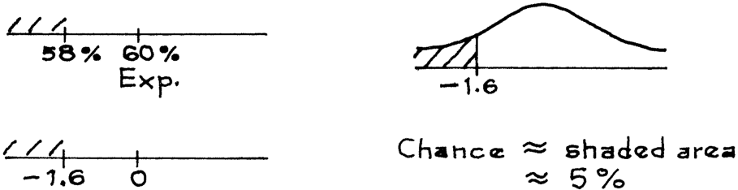

   - (b) Hộp chứa 100.000 thẻ, trong đó 10.000 thẻ được đánh số 1 (thu nhập trên 75.000 đô la) và 90.000 thẻ còn lại đánh số 0. Ta thực hiện 1.600 lần rút. Xác suất rơi vào khoảng cần tính là khoảng $9\%$. 
   Giải thích thêm: Tỷ lệ thẻ số 1 là $10.000 / 100.000 = 0,1$. Giá trị kỳ vọng của tổng là $1.600 \times 0,1 = 160$. SD của hộp = $\sqrt{0,1 \times 0,9} = 0,3$. SE = $\sqrt{1.600} \times 0,3 = 12$. Bằng việc chuyển đổi sang đơn vị tiêu chuẩn Z, ta tra cứu đường cong phân phối chuẩn và tìm được vùng diện tích tương ứng là khoảng $9\%$.

   - (c) Hộp có 100.000 thẻ, trong đó 20.000 thẻ đánh số 1 (có bằng đại học) và 80.000 thẻ còn lại đánh số 0. Thực hiện 1.600 lần rút. Xác suất tính được là khoảng $68\%$. 
   Giải thích thêm: Tỷ lệ thẻ số 1 là $0,2$. EV = $1.600 \times 0,2 = 320$. SD = $\sqrt{0,2 \times 0,8} = 0,4$. SE = $\sqrt{1.600} \times 0,4 = 16$. Một khoảng $\pm 1$ SE xung quanh giá trị trung bình sẽ chiếm phần diện tích xấp xỉ $68\%$ trên đường cong phân phối chuẩn.

4. Phần diện tích được tô đậm (shaded area) biểu diễn xác suất lấy được một mẫu trong đó có từ $22\%$ số người trở lên có thu nhập trên 50.000 đô la mỗi năm. 
Giải thích thêm: Đồ thị thể hiện hàm mật độ xác suất (đường cong chuẩn) của tỷ lệ phần trăm mẫu. Diện tích từ mốc $22\%$ trở về phía bên phải chính là xác suất bắt gặp sự kiện tỷ lệ đạt mức lớn hơn hoặc bằng $22\%$.

5. (a) Xác suất để mẫu có 88 người có thu nhập cao. 
   - (b) Xác suất để mẫu có $22\%$ số người có thu nhập cao. 
   - (c) 88 chính là $22\%$ của kích thước mẫu 400. Do đó, hai cách mô tả xác suất này thực chất là một và ám chỉ cùng một biến cố. Không có sự trùng hợp ngẫu nhiên nào ở đây cả. 

Set C, trang 370 

1. Lựa chọn (iii) là đúng. Đó cũng là điểm cốt lõi của phần này. 
Giải thích thêm: Sai số chuẩn của phần trăm (SE for percentage) phụ thuộc chủ yếu vào kích thước mẫu, không phụ thuộc vào tỷ lệ mẫu so với tổng thể (miễn là tổng thể đủ lớn).

2. Bảng dưới đây thể hiện mối liên hệ giữa số lần rút và sai số chuẩn của tỷ lệ phần trăm:

| Số lần rút | SE cho tỷ lệ phần trăm thẻ số 1 |
|---|---|
| 2.500 | 1% |
| 25.000 | 0,27% (0,27 của 1%) |
| 100.000 | 0% |

_Nhận xét._ Sau 100.000 lần rút (giả sử rút không hoàn lại từ hộp 100.000 thẻ), sẽ không còn thẻ nào trong hộp nữa. Khi đó ta đã lấy mẫu toàn bộ tổng thể nên sự không chắc chắn (sai số) về tỷ lệ phần trăm thẻ số 1 trong các lần rút bằng $0\%$.

3. Kích thước mẫu nên là 2.500. 
Giải thích thêm: Dựa vào bảng ở câu 2, để sai số chuẩn của tỷ lệ phần trăm đạt mức $1\%$, ta cần kích thước mẫu là $n = 2.500$.

4. SE là như nhau cho cả ba hộp, bởi vì cả ba hộp đều có cùng một tỷ lệ thẻ số 1, dẫn đến cùng một độ lệch chuẩn (SD). 
Giải thích thêm: SD của hộp 0-1 chỉ phụ thuộc vào tỷ lệ phần trăm các số 1. Vì tỷ lệ này bằng nhau nên SD không thay đổi. Nếu kích thước mẫu (số lần rút) cũng bằng nhau, thì SE của mẫu cũng phải giống nhau bất kể tổng thể có lớn như thế nào.

5. SE khi rút có hoàn lại = $20\%$; SE khi rút không hoàn lại = $\sqrt{\frac{10 - 4}{10 - 1}} \times 20\% \approx 16\%$. 
Giải thích thêm: Công thức Hệ số hiệu chỉnh cho quần thể hữu hạn (Finite Population Correction Factor - FPC) là $\sqrt{\frac{N - n}{N - 1}}$, với $N$ là quy mô tổng thể và $n$ là kích thước mẫu. Ở đây $N = 10, n = 4$. Tính ra $\sqrt{\frac{6}{9}} \approx 0,816$. Khi nhân với SE có hoàn lại là $20\%$, ta được kết quả $16\%$.

_Nhận xét._ Đây là một ví dụ nhân tạo trong đó số lần rút chiếm một tỷ lệ rất lớn so với số lượng thẻ trong hộp ($4$ so với $10$), vì vậy hệ số hiệu chỉnh (correction factor) phát huy tác dụng rõ rệt để làm giảm sai số chuẩn. Khi mẫu chiếm tỷ trọng lớn trong tổng thể, sai số mẫu thu hẹp lại.

### **Chương 21. Độ chính xác của Phần trăm** 

Set A, trang 379 

1. (a) Quan sát được (observed). (b, c) Ước lượng từ dữ liệu là...
_Nhận xét._ Có một sự khác biệt rất lớn giữa chương 20 và chương 21. Trong chương 20, bạn ĐÃ BIẾT thành phần cấu tạo của hộp, và có thể tính toán chính xác giá trị kỳ vọng và sai số chuẩn (SE). Ở chương 21, thành phần của hộp chưa được biết trước mà phải được **ước lượng từ dữ liệu**. Ở chương 20, bạn suy luận xuôi chiều: từ thông tin của hộp để dự đoán các lần rút (mẫu). Còn ở đây, bạn suy luận ngược chiều: từ dữ liệu của các lần rút (mẫu) để ước lượng về hộp (tổng thể). 

2. Bước đầu tiên là thiết lập mô hình. (Chúng ta cần mô hình hộp để tính toán SE cho tổng số các lần rút). Có 100.000 vé trong hộp, một số đánh dấu 1 (hiện đang học đại học) và số còn lại đánh dấu 0 (không theo học). Sau đó thực hiện rút 500 lần từ hộp để thu được mẫu. Số sinh viên đại học trong mẫu giống như tổng của các lần rút. Tỷ lệ thẻ số 1 trong hộp là một ẩn số chưa biết, nhưng có thể được ước lượng bằng tỷ lệ thẻ số 1 quan sát được trong mẫu, tức là $194 / 500 \approx 0,388$. Vậy SD của hộp được ước lượng là $\sqrt{0,388 \times 0,612} \approx 0,49$. SE cho tổng số là $\sqrt{500} \times 0,49 \approx 11$. Con số 11 ở đây là độ lớn khả dĩ của sai số ngẫu nhiên đối với giá trị quan sát $194$. Do đó, SE cho tỷ lệ phần trăm thẻ số 1 là $(11 / 500) \times 100\% = 2,2\%$. 
Tỷ lệ phần trăm người trong độ tuổi 18–24 ở thị trấn đang là sinh viên đại học được ước lượng là $38,8\%$. Ước lượng này có khả năng sai lệch (give or take) khoảng $2,2\%$. Vậy giá trị ước lượng là $38,8\%$ và biên độ sai số là $2,2\%$. 
Giải thích thêm: Khi không biết SD của tổng thể, ta buộc phải dùng SD của mẫu (dựa trên tỷ lệ quan sát $0,388$) làm giá trị xấp xỉ thay thế (Bootstrap method). Công thức tính toán các bước còn lại hoàn toàn tương tự như chương trước.

3. Ước lượng là $48\%$, cộng trừ sai số khoảng $5\%$. 
Giải thích thêm: Nếu mẫu có tỷ lệ thuận lợi là $48\%$, ta coi SD $\approx \sqrt{0,48 \times 0,52} \approx 0,5$. Nếu giả sử mẫu đủ lớn để SE sau khi chia ra bằng khoảng $5\%$, ta ghi nhận kết quả dưới dạng: Estimate $\pm$ Margin of Error.

4. Ước lượng là $2,8\%$, cộng trừ sai số khoảng $0,8\%$. (0,8 của 1%). 

5. Ước lượng là $46,8\%$, cộng trừ sai số khoảng $2,5\%$. 

6. Không hợp lý. Hầu hết mọi người đều làm việc cho một số ít các cơ sở quy mô lớn (large establishments). 
Giải thích thêm: Dù có nhiều cơ sở nhỏ lẻ tồn tại, nhưng các tập đoàn và cơ sở kinh doanh lớn thường tập trung lượng nhân sự khổng lồ. Nếu lấy mẫu ngẫu nhiên theo cơ sở làm việc mà không gán trọng số (weighting) dựa trên quy mô, ta sẽ đánh giá sai tỷ lệ người lao động.

7. $\text{SE} = 2\%$. 
Giải thích thêm: Tỷ lệ mẫu và kích thước mẫu đã cho phép tính ra sai số chuẩn tỷ lệ là $2\%$.

8. (a) $18,0\% \pm 1,9\%$ 
   (b) $21,0\% \pm 2,0\%$ 
   (c) $24,5\% \pm 2,2\%$ 
_Nhận xét._ Người thứ ba bị lệch mất vài SE khi ước lượng tỷ lệ phần trăm số 1 trong hộp; mặc dù vậy, sai số chuẩn (SE) được ước lượng cũng chỉ lệch mất $0,2\%$. Phương pháp bootstrap (sử dụng mẫu để thay thế tổng thể trong ước lượng SD) hoạt động rất tốt trong việc ước lượng các sai số chuẩn. 

9. Bảng phân loại các giá trị:

| Đại lượng | Đã biết chính xác | Ước lượng từ dữ liệu là |
|---|---|---|
| Giá trị quan sát (Observed value) | $30,8\%$ | N/A |
| Giá trị kỳ vọng (Expected value) | N/A | $30,8\%$ |
| SE | N/A | $1,5\%$ |
| SD của hộp | N/A | $0,46$ |
| Số lần rút (Number of draws) | $1.000$ | N/A |

Giải thích thêm: Số lần rút là hằng số thiết kế của cuộc khảo sát. Giá trị quan sát $30,8\%$ là con số thực tế đếm được từ mẫu. Tuy nhiên, giá trị kỳ vọng, SE, và SD thực của tổng thể (hộp) không thể biết chắc chắn và chỉ được ước lượng (estimated) thông qua phương pháp Bootstrap dùng dữ liệu mẫu.

Set B, trang 383 

1. (a) quan sát được (b,c) ước lượng từ dữ liệu. Xem bài tập 1 trang 379. 
Giải thích thêm: Tương tự như nguyên tắc của toàn chương, chúng ta đang đi từ mẫu (quan sát) để ước lượng cho tổng thể chưa biết.

2. (a) $38,8\% \pm 4,4\%$ 
   (b) $38,8\% \pm 6,6\%$ 
   (c) $38,8\% \pm 3,3\%$ 
_Nhận xét._ Khi mức độ tin cậy (confidence level) tăng lên, khoảng tin cậy (confidence interval) sẽ trải dài ra rộng hơn (ví dụ $\pm 6,6\%$ thay vì $\pm 4,4\%$). Tuy nhiên, nếu kích thước mẫu tăng lên, khoảng tin cậy sẽ thu hẹp lại (ngắn hơn), vì sai số chuẩn SE giảm xuống. 

3. (a) Kỳ vọng có 1 bi đỏ trong các lần rút, cộng trừ sai số khoảng 1. 
   - (b) Không thể nào rút được ít hơn 0 viên bi đỏ, do đó xác suất là 0. 
   - (c) Xác suất khoảng $16\%$. 
   - (d) Không. Nếu biểu đồ tần suất (probability histogram) trông giống như đường cong chuẩn, thì xác suất rút được ít hơn 0 bi đỏ có thể được đọc trực tiếp từ đường cong. Nhưng vì $16\%$ hoàn toàn khác $0\%$ — xem lại phần (b) và (c) — nên biểu đồ tần suất không hề giống với đường cong chuẩn. 
   - _Nhận xét._ Biểu đồ được hiển thị ở đầu trang tiếp theo. 
Giải thích thêm: Khi trung bình (EV = 1) nằm quá gần biên dưới (0) của vùng khả dĩ, và phân phối bị lệch nghiêm trọng (rất nhiều kết quả tập trung tại 0, 1, 2, 3 nhưng đuôi bên phải dài), hình dáng phân phối không thể là hình chuông đối xứng của phân phối chuẩn được.

4. Sai. Không thể sử dụng xấp xỉ phân phối chuẩn (normal approximation) ở đây. Dựa vào những ước lượng tốt nhất từ mẫu, $1\%$ bi trong hộp là màu đỏ, và $99\%$ là màu xanh lam. Điều này hoàn toàn giống với 

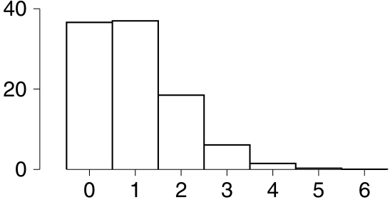

mô hình hộp ở bài tập 3. Biểu đồ tần suất xác suất cho tỷ lệ bi đỏ trong số 100 viên bi được rút từ hộp này không giống với đường cong chuẩn. (Với 100 lần rút ra từ 10.000 thẻ, hầu như không có sự khác biệt giữa việc lấy mẫu có hoàn lại hay không hoàn lại). Nếu kích thước mẫu lớn hơn nhiều, hoặc hộp bớt bị lệch đi (tỷ lệ đỏ và xanh cân bằng hơn), thì đường cong chuẩn mới hoạt động tốt. 

### Set C, trang 386 

1. Khái niệm Xác suất (Probabilities) được sử dụng khi bạn suy luận thuận: từ hộp (tổng thể) đến các lần rút (mẫu). Khái niệm Mức độ tin cậy (Confidence levels) được sử dụng khi bạn suy luận ngược: từ các lần rút (mẫu) suy ra hộp (tổng thể). 
Giải thích thêm: Khi bạn đã biết trong hộp có gì, bạn nói về "xác suất" để rút ra kết quả x. Nhưng khi bạn chỉ cầm trong tay một mẫu kết quả rút, bạn không thể dùng "xác suất" đối với tổng thể (vì tổng thể là một giá trị cố định, không ngẫu nhiên); thay vào đó bạn nói bạn tự tin (confidence) bao nhiêu phần trăm rằng tổng thể nằm trong khoảng giá trị y.

2. (a) Sai số ngẫu nhiên (chance error) nằm trong giá trị quan sát được (observed value). 
   - (b) Khoảng tin cậy (confidence interval) là để dùng cho tỷ lệ phần trăm của tổng thể (population percentage). 
   Giải thích thêm: Tham số của tổng thể là một con số tĩnh, không có tính ngẫu nhiên. Chỉ có các mẫu sinh ra từ tổng thể mới biến thiên ngẫu nhiên và mang theo sai số.

3. (a) Khoảng tin cậy $18,0\% \pm 3,8\%$, bao phủ trúng (covers). 
   - (b) Khoảng tin cậy $21,0\% \pm 4,0\%$, bao phủ trúng (covers). 
   - (c) Khoảng tin cậy $24,5\% \pm 4,4\%$, vừa vặn trượt mất (just misses). 
   Giải thích thêm: "Bao phủ trúng" nghĩa là giá trị thực của tổng thể đã nằm gọn bên trong khoảng tin cậy (từ Cận dưới đến Cận trên) được xây dựng từ mẫu.

4. (a) Đúng. 
   - (b) Sai. Giá trị kỳ vọng (EV) được tính toán một cách chính xác tuyệt đối; sai số ngẫu nhiên chỉ xuất hiện trong tỷ lệ phần trăm bi đỏ của mẫu, chứ không nằm trong giá trị kỳ vọng. 
   - (c) Đúng. 
   - (d) Sai. Khoảng tin cậy được thiết lập cho các tham số (parameters - của tổng thể), chứ không phải để ước lượng dữ liệu mẫu (vì dữ liệu mẫu đã biết rõ ràng rồi). Xem tr. 385–386. 
   - (e) Đúng. 

_Nhận xét về (b)._ SE cho bạn biết độ lớn khả dĩ của sai số ngẫu nhiên đối với tỷ lệ bi đỏ trong các lần rút (mẫu). Tuy nhiên, con số $50\%$ là một thuộc tính cố định của hộp và nó không phụ thuộc vào kết quả các lần rút diễn ra như thế nào: không có sai số ngẫu nhiên nào đối với mức $50\%$ này cả. Ví dụ: Nếu bạn rút 100 lần và lấy được 53 bi đỏ, tỷ lệ mẫu là $53\%$, và sai số ngẫu nhiên – xuất hiện trong số $53\%$ này – là $+3\%$. Nếu bạn được 42 bi đỏ, tỷ lệ mẫu là $42\%$, và sai số là $-8\%$. Nhưng giá trị kỳ vọng luôn giữ nguyên ở $50\%$, bất chấp các lần rút có diễn ra ra sao. Xem thêm bài tập 6 ở tr. 294. 

5. (a) Đúng. (b) Đúng. (c) Đúng. (d) Đúng. 
   - (e) Sai; tỷ lệ phần trăm của mẫu đã biết chính xác là $53\%$, bạn không cần phải tính khoảng tin cậy cho một đại lượng mà bạn đã đếm rõ ràng. 
   Giải thích thêm: Khoảng tin cậy chỉ dùng cho những điều chưa biết (tỷ lệ của tổng thể). 

6. (a) Đúng. 
   - (b) Đúng. 
   - (c) Sai. Tỷ lệ phần trăm của mẫu đã được biết đến, và nó dĩ nhiên luôn luôn nằm ở điểm chính giữa của khoảng tin cậy. 
   - (d) Sai. Nếu bạn coi khoảng tin cậy là cố định (fixed interval), xác suất chứa tỷ lệ tổng thể chỉ có thể là 0 hoặc 1 (tức là hoặc có chứa, hoặc không, vì bản thân tỷ lệ tổng thể cũng là số cố định). Bài học rút ra: các "cơ hội/xác suất" nằm ở quy trình lấy mẫu (sampling procedure), chứ không nằm ở bản thân tổng thể. Đó là lý do vì sao các nhà thống kê sử dụng thuật ngữ "Khoảng tin cậy" thay vì nói "Có x% xác suất tổng thể rơi vào khoảng này". 

7. Sai. Sai số chuẩn (SE) cho tỷ lệ phần trăm dùng để đo lường độ lớn khả dĩ của sự khác biệt giữa tỷ lệ của MỘT mẫu và tỷ lệ của tổng thể; chứ nó không đo lường sự khác biệt giữa HAI tỷ lệ mẫu. 

_Nhận xét._ SE cho sự khác biệt giữa hai tỷ lệ mẫu bắt buộc phải lớn hơn, bởi vì cả hai mẫu đều chịu sự biến thiên ngẫu nhiên (dao động từ 2 phía); ngược lại, đối với trường hợp so sánh mẫu và tổng thể, tỷ lệ tổng thể là cố định, không biến thiên. Xem chương 27 để biết thêm chi tiết về sai số của sự chênh lệch giữa hai tỷ lệ mẫu. 

8. Đúng. Xác suất (Probabilities) được sử dụng khi bạn suy luận thuận chiều, từ hộp (tổng thể) để đoán về các lần rút (mẫu); mức độ tin cậy (Confidence levels) được sử dụng khi bạn suy luận ngược chiều, từ các lần rút thu được để ước lượng về hộp: xem tr. 385–386. 

Set D, trang 388 

1. Về mặt lý thuyết, hãy cẩn trọng với lập luận của người đàn ông này. Ông ta đang nói về "tổng thể" (population) nào? Tại sao sinh viên của ông ta lại có thể coi là một "mẫu ngẫu nhiên đơn giản" được rút ra từ tổng thể đó? (Rõ ràng các sinh viên trong cùng một lớp học không bao giờ là đại diện ngẫu nhiên cho toàn xã hội). Cho đến khi ông ta có thể trả lời thỏa đáng những câu hỏi này, đừng bận tâm quá nhiều đến các mức SE mà ông ta đang tính toán. 
Giải thích thêm: Khi giả định về mẫu ngẫu nhiên (random sample) bị phá vỡ, các công thức tính SE truyền thống không còn giá trị. Một mẫu tự chọn (convenience sample) như học sinh trong lớp thường mang thiên kiến (bias) cực cao.

2. Đây hoàn toàn không phải là lấy mẫu ngẫu nhiên đơn giản (simple random sample): bạn được đảm bảo chắc chắn sẽ lấy đúng 25 học sinh từ mỗi lớp, một mẫu ngẫu nhiên đơn giản thực sự sẽ không bao giờ diễn ra đều đặn, chẵn số như thế. Trình tự này là lấy mẫu ngẫu nhiên phân tầng (stratified sampling). Do đó, các công thức tính SE cơ bản không được áp dụng ở đây. 

Set E, trang 390 

1. Đây không phải là lấy mẫu ngẫu nhiên đơn giản, nên các công thức tính toán không áp dụng được. 

2. (Không có đáp án cụ thể cho câu này trong tài liệu gốc, có thể là bỏ qua hoặc dành cho thảo luận mở).

3. (a) "altered voter enthusiasm" (sự thay đổi sự nhiệt tình của cử tri). 
   - (b) Biến thiên ngẫu nhiên (Chance variation) — vì Gallup Poll được thực hiện dựa trên một mẫu ngẫu nhiên, kết quả luôn có độ dao động tự nhiên quanh giá trị thực. 
   - (c) Như Bảng 2 cho thấy, các sai số ngẫu nhiên lệch vài điểm phần trăm là điều hoàn toàn có thể xảy ra. Có lẽ giai đoạn cuối tháng 9 không phải là một thước đo chỉ báo tốt cho cuộc bầu cử diễn ra vào đầu tháng 11, bởi vì thái độ người dân có thể thay đổi trong hơn 1 tháng đó. (Dù vậy, trên thực tế Bush đã thắng cử). 

### **Chương 22. Đo lường Việc làm và Thất nghiệp** 

Set A, trang 403 

1. (a) Đúng. 
   - (b) Sai. Cục Thống kê sẽ chia mẫu thành các nhóm nhỏ riêng biệt dựa trên chủng tộc, độ tuổi,... và sau đó tính toán gán trọng số (weighting) cho từng nhóm một cách tách biệt. Quy trình này thuộc phân đoạn 4. 

2. $151,4 \text{ triệu} \pm 0,1 \text{ triệu}$; tham khảo phân đoạn 5. 

3. Đây là một mẫu ngẫu nhiên đơn giản của các hộ gia đình (households), và mục tiêu suy diễn cũng là hướng tới các hộ gia đình. SD của hộp được ước lượng là $\sqrt{0,80 \times 0,20} = 0,40$. SE cho tổng số là $\sqrt{100} \times 0,40 = 4$. Do đó, SE cho tỷ lệ phần trăm hộ gia đình là $4\%$. 
Giải thích thêm: Khi đơn vị lấy mẫu trùng với đơn vị phân tích (đều là hộ gia đình), mô hình rút ngẫu nhiên cơ bản hoạt động đúng.

4. Đây là một mẫu ngẫu nhiên đơn giản của các hộ gia đình, nhưng lại đóng vai trò là một mẫu cụm (cluster sample) đối với các cá nhân. (Lúc này mỗi hộ gia đình được xem như một cụm chứa nhiều người). Mục tiêu suy diễn ở đây lại hướng tới con người (people). Vì vậy, bạn cần có thêm nhiều thông tin khác để có thể tính được SE — các công thức thông thường dành cho mẫu ngẫu nhiên đơn giản không thể áp dụng trong trường hợp này (phân đoạn 5). 

   - _Nhận xét đối với bài tập 3 và 4._ Trong bài tập 3, bạn có mẫu ngẫu nhiên đơn giản là các hộ gia đình, và bạn cũng đưa ra suy luận về chính hộ gia đình — cụ thể là tính tỷ lệ các hộ mà trong đó mọi thành viên đều đã tiêm vắc xin. Ở bài tập 4, bạn lại đưa ra suy luận về các cá nhân (people), trong khi mẫu gốc được lấy theo phương pháp cụm cá nhân (thông qua hộ). Sự lệch pha giữa đơn vị lấy mẫu và đơn vị suy diễn làm thay đổi công thức tính SE.

5. Sai số chuẩn (SE) cho tỷ lệ phần trăm chỉ là $0,2\%$, vì vậy một khoảng chênh lệch lớn đến $55\% - 52\% = 3\%$ 

hầu như không thể lý giải bằng sai số ngẫu nhiên (chance error). Nguyên nhân thực sự là nhiều người thích "khai báo" rằng họ đã đi bỏ phiếu (cho đẹp mặt), mặc dù thực tế họ không làm vậy. Đây gọi là response bias (thiên kiến phản hồi). 

6. Dữ liệu dành cho nam giới da trắng đáng tin cậy hơn; vì nó được dựa trên lượng mẫu người lớn hơn rất nhiều (kích thước mẫu lớn thì SE thấp). 

### **Chương 23. Độ chính xác của các Giá trị Trung bình** 

Set A, trang 413 

1. (a) $7.611 / 100 = 76,11$ 
   (b) $73,94 \times 100 = 7.394$ 

2. SE cho trung bình là 1. Đáp án cho (a) là gần như $100\%$. Đáp án cho (b) là $68\%$. Đừng nhầm lẫn giữa SE cho mức trung bình của các lần rút (SE for average of draws) với độ lệch chuẩn của hộp (SD of the box). 
Giải thích thêm: 
- Câu (a) có thể là hỏi xác suất rơi vào khoảng $\pm$ một số lượng lớn các SE. 
- Câu (b) liên quan đến khoảng $\pm 1 \text{ SE}$, chiếm $68\%$ diện tích phân phối chuẩn.
- SD của hộp là độ phân tán của dữ liệu gốc. Còn SE cho trung bình là thước đo độ dao động của giá trị trung bình mẫu, công thức $\text{SE} = \frac{\text{SD}}{\sqrt{n}}$, thường nhỏ hơn rất nhiều so với SD hộp.

3. (a) Sai. (b) Đúng. Nhắc lại một lần nữa, không được phép nhầm lẫn giữa SE dùng cho trung bình của các lần rút với SD của chính hộp thẻ. 

4. (a) Giá trị kỳ vọng cho trung bình của các lần rút luôn luôn bằng với trung bình của hộp (EV for average = box average). 
   (b) Khi số lần rút tăng lên, SE cho TỔNG CÁC LẦN RÚT sẽ tăng lên (do tỷ lệ với $\sqrt{n}$), nhưng SE cho TRUNG BÌNH CỦA CÁC LẦN RÚT lại giảm xuống (do tỷ lệ với $1/\sqrt{n}$). 
Giải thích thêm: Mẫu càng lớn, tổng số thu được càng có khoảng dao động lớn. Nhưng khi đem chia bình quân cho $n$ phần tử, khoảng dao động trung bình lại hẹp đi, nghĩa là ước lượng ngày càng chính xác.

5. SE cho tổng các lần rút là $\sqrt{100} \times 20 = 200$. SE cho trung bình là $200 / 100 = 2$. Trung bình của các lần rút sẽ loanh quanh mức 50, cộng trừ khoảng 2. Điều này vẫn đúng kể cả khi bạn lấy mẫu không hoàn lại (without replacement), bởi vì 100 chỉ là một phần rất nhỏ các thẻ trong hộp so với tổng số. Mặt khác, nếu bạn rút 100 thẻ một cách ngẫu nhiên và không hoàn lại từ một hộp cũng CHỈ CÓ đúng 100 thẻ, thì mức độ biến thiên không còn nữa, khi đó SE sẽ bằng 0. 
Giải thích thêm: Khi kích thước mẫu $n$ bằng với quy mô tổng thể $N$ và lấy mẫu không hoàn lại, hệ số hiệu chỉnh FPC $\sqrt{\frac{N-n}{N-1}}$ bằng 0, làm cho $\text{SE} = 0$.

6. Là xác suất để mức trung bình của các lần rút nằm trong khoảng từ 2,25 đến 2,75. 

7. Tỷ lệ phần trăm số lần số 4 xuất hiện trong toàn bộ 50 lần rút. 

8. (a) Xác suất để tổng các lần rút bằng 90.
   *Giải thích thêm:* Trong mô hình xác suất, khi chúng ta rút ngẫu nhiên có hoàn lại từ một hộp, tổng của các lần rút là một biến ngẫu nhiên. Câu này đang đề cập đến xác suất cụ thể để tổng giá trị của các lần rút đạt chính xác là 90.
   
   - (b) Xác suất để trung bình các lần rút bằng 3.6.
   *Giải thích thêm:* Tương tự như tổng, trung bình của các lần rút (được tính bằng tổng chia cho số lần rút) cũng là một biến ngẫu nhiên.
   
   - (c) Ta có $3.6 = 90 / 25$, vì vậy cùng một xác suất đang được mô tả theo hai cách khác nhau. Hoàn toàn không phải là sự trùng hợp. Xem bài tập 5 ở trang 366.
   *Giải thích thêm:* Nếu bạn rút 25 lần, tổng là 90 tương đương với việc trung bình là $90 / 25 = 3.6$. Bất kỳ sự kiện nào làm cho tổng bằng 90 cũng chính là sự kiện làm cho trung bình bằng 3.6. Do đó, xác suất của hai biến cố này hoàn toàn bằng nhau.

9. Các câu (a), (c), (e) là đúng; các câu (b), (d), (f) là sai. Bạn đã biết nội dung bên trong hộp; do đó bạn có thể tính toán giá trị kỳ vọng (expected value) cho trung bình một cách chính xác mà không có sai số. Tuy nhiên, sẽ luôn có sai số ngẫu nhiên (chance error) trong trung bình của các lần rút thực tế. Xem bài tập 6 ở trang 294, bài tập 4–6 ở trang 386–387.
   *Giải thích thêm:* Giá trị kỳ vọng là một hằng số lý thuyết tính từ các vé trong hộp, do đó khi biết hộp chứa gì, ta tính được con số này tuyệt đối chính xác (sai số bằng 0). Nhưng khi tiến hành rút vé thực tế, kết quả của trung bình mẫu (average of the draws) sẽ thay đổi ngẫu nhiên xung quanh giá trị kỳ vọng, tạo ra sai số ngẫu nhiên.

10. Trung bình của các lần rút thực chất chỉ là tổng của chúng, chia cho 25 (tổng số lần rút). Do đó, khi chuyển từ tổng sang trung bình, ta chia các giá trị cho 25: 25 chuyển thành 1, 50 chuyển thành 2, và 55 chuyển thành $55 / 25 = 2.2$.
   *Giải thích thêm:* Phép biến đổi này minh họa mối quan hệ tuyến tính giữa tổng mẫu và trung bình mẫu. Mọi giá trị trên thang đo tổng chỉ cần được chia cho kích thước mẫu (ở đây là 25) để ánh xạ sang thang đo trung bình.

Set B, trang 420

1. Dưới đây là sự tương ứng giữa các thuật ngữ thống kê mẫu và mô hình hộp (box model):
   - Quần thể (population) $\leftrightarrow$ Hộp (box).
   - Trung bình quần thể (population average) $\leftrightarrow$ Trung bình của hộp (average of the box).
   - Mẫu (sample) $\leftrightarrow$ Các lần rút (draws).
   - Trung bình mẫu (sample average) $\leftrightarrow$ Trung bình của các lần rút (average of the draws).
   - Kích thước mẫu (sample size) $\leftrightarrow$ Số lần rút (number of draws).
   *Giải thích thêm:* Trong lý thuyết thống kê, mô hình hộp là một công cụ trực quan để biểu diễn việc lấy mẫu ngẫu nhiên từ một quần thể. Các thuật ngữ bên trái là ngôn ngữ thống kê ứng dụng, còn bên phải là ngôn ngữ của mô hình hộp.

2. (a) Cụm từ "Độ lệch chuẩn (SD) của hộp" là hợp lý; nhưng "Sai số chuẩn (SE) cho hộp" thì không.
   (b) Cụm từ "SE cho trung bình của các lần rút" là hợp lý; nhưng "SE cho trung bình của hộp" thì không.
   *Giải thích thêm:* Thuật ngữ "SD" (Độ lệch chuẩn) được áp dụng cho một danh sách các con số cố định, dùng để đo lường mức độ phân tán của chúng. Trong khi đó, "SE" (Sai số chuẩn) được áp dụng cho một quá trình ngẫu nhiên, nhằm đo lường sai số có thể xảy ra do yếu tố ngẫu nhiên (chance error). Các thẻ trong hộp (và trung bình của hộp) là những giá trị cố định, nên không có sai số chuẩn. Ngược lại, các lần rút là ngẫu nhiên, kết quả thay đổi qua mỗi lần thực hiện, do đó trung bình của các lần rút sẽ có SE.

3. (a, b) Được ước lượng từ mẫu. SD của mẫu là $\$19,000$; giá trị này được sử dụng để ước lượng SD của hộp. SE (Sai số chuẩn) lại được tính dựa trên SD đã ước lượng này; do đó SE cũng chỉ là một giá trị ước lượng. Nếu bạn không biết những gì có trong hộp, bạn phải ước lượng SD và SE từ dữ liệu thực tế.
   *Giải thích thêm:* Trong thực tế, chúng ta thường không biết chính xác quần thể (hay các thẻ trong hộp) chứa gì. Vì vậy, ta không thể tính trực tiếp SD của hộp. Giải pháp là sử dụng độ lệch chuẩn của dữ liệu mẫu (ở đây là $\$19,000$) như một giá trị đại diện (ước lượng) cho SD của hộp, từ đó tính ra SE cho trung bình mẫu.
   - (c) Quan sát được (observed).

4. 95% của 50 $\approx 48$.
   *Giải thích thêm:* Trong một khoảng tin cậy 95% (95% confidence interval), nếu ta lặp lại việc lấy mẫu và xây dựng khoảng tin cậy 50 lần, thì theo lý thuyết, khoảng 95% trong số các khoảng đó (tức là $0.95 \times 50 = 47.5$, làm tròn thành 48) sẽ thực sự chứa giá trị trung bình thực của quần thể.

5. (a) Mỗi tổ chức đều lấy trung bình mẫu của riêng họ làm tâm (giá trị trung tâm) của khoảng tin cậy. Các giá trị trung bình mẫu này khác nhau là do biến thiên ngẫu nhiên (chance variation) trong quá trình lấy mẫu.
   (b) Các độ lệch chuẩn (SD) của mẫu giữa các tổ chức cũng khác nhau (lại do biến thiên ngẫu nhiên), dẫn đến các sai số chuẩn (SE) được ước lượng cũng khác nhau. Vì chiều dài của khoảng tin cậy tỷ lệ thuận với SE (ví dụ: khoảng tin cậy 95% là $\pm 2$ SE), nên chiều dài của các khoảng tin cậy này cũng sẽ khác nhau.
   (c) 49.
   *Giải thích thêm:* Nếu một sự kiện có xác suất xảy ra là 98% (ứng với độ tin cậy 98%), thì trong 50 lần lấy mẫu độc lập, kỳ vọng số lần thành công (khoảng tin cậy chứa giá trị thực) sẽ là $0.98 \times 50 = 49$.

6. Hộp chứa 30,000 thẻ, mỗi thẻ đại diện cho một sinh viên đã đăng ký, ghi tuổi của người đó. Dữ liệu này giống như 900 lần rút từ hộp; trung bình mẫu (sample average) giống như trung bình của các lần rút. Độ lệch chuẩn (SD) của hộp được ước lượng là 4.5 năm. Sai số chuẩn (SE) cho tổng các lần rút là $\sqrt{900} \times 4.5 = 135$ năm, SE cho trung bình là $135 / 900 = 0.15$ năm.
   *Giải thích thêm:* Ở đây ta dùng công thức tính SE cho tổng là $\sqrt{\text{số lần rút}} \times \text{SD của hộp}$, và SE cho trung bình bằng SE của tổng chia cho số lần rút.

   - (a) Giá trị ước lượng cho trung bình quần thể là 22.3 tuổi, sai lệch khoảng 0.15 tuổi (chính là 1 SE).
   - (b) Khoảng tin cậy (giả sử khoảng tin cậy 95%) là $22.3 \pm 0.3$ năm.
   *Giải thích thêm:* Khoảng tin cậy 95% thường được tính bằng Công thức: $\text{Trung bình mẫu} \pm 2 \times \text{SE}$. Do đó biên độ sai số là $2 \times 0.15 = 0.3$ năm.

7. (a) Khoảng tin cậy là $\$568 \pm \$24$. Mặc dù dữ liệu gốc có thể không tuân theo đường cong phân phối chuẩn (normal curve), biểu đồ tần suất xác suất (probability histogram) cho trung bình của các lần rút vẫn tuân theo phân phối chuẩn.
   *Giải thích thêm:* Điều này dựa trên Định lý Giới hạn Trung tâm (Central Limit Theorem). Dù cho quần thể gốc có hình dạng phân phối như thế nào (lệch, bimodal, v.v.), miễn là kích thước mẫu đủ lớn, phân phối của trung bình mẫu sẽ xấp xỉ phân phối chuẩn, cho phép chúng ta dùng $\pm 2$ SE để thiết lập khoảng tin cậy 95%.
   - (b) Sai: $\$24$ là Sai số chuẩn (SE) cho trung bình của các lần rút, không phải là Độ lệch chuẩn (SD) của hộp. SE đo lường độ phân tán của các trung bình mẫu khác nhau, còn SD đo lường độ phân tán của từng cá thể trong hộp.

8. Sai. Sai số chuẩn (SE) cho trung bình cho biết quy mô sai lệch có khả năng xảy ra giữa trung bình mẫu (sample average) và trung bình quần thể (population average), chứ không phải là sự chênh lệch giữa hai trung bình mẫu khác nhau. Do đó, $\$18$ là một biên độ sai số (margin of error) sai trong ngữ cảnh này. Xem bài tập 7 ở trang 387.
   *Giải thích thêm:* Khi so sánh hai trung bình mẫu độc lập với nhau, sai số của sự khác biệt sẽ lớn hơn SE của một mẫu đơn lẻ. Cụ thể, SE của hiệu hai trung bình mẫu phải được tính bằng công thức căn bậc hai của tổng các phương sai ($SE_{diff} = \sqrt{SE_1^2 + SE_2^2}$). Do vậy, không thể trực tiếp dùng SE của một mẫu để đánh giá khoảng cách giữa hai mẫu.

9. Biểu đồ tần suất xác suất (probability histogram) biểu diễn các xác suất cho trung bình mẫu; nó không phải là biểu đồ phân phối của dữ liệu thực tế. Ở đây, biểu đồ xác suất đã được cho.
   Phần (a) yêu cầu tìm giá trị tương ứng với $+1$ đơn vị chuẩn (standard unit), so với biểu đồ xác suất. Để làm vậy, chúng ta cần tìm tâm (center) và độ phân tán (spread) của biểu đồ này. Tâm chính là giá trị kỳ vọng (EV) của trung bình mẫu, và nó bằng với trung bình của hộp. Đề bài đã cho: tâm là $\$61,700$. Độ phân tán chính là Sai số chuẩn (SE) cho trung bình mẫu. Ta có thể tính chính xác giá trị này vì đề bài đã cho SD của hộp là $\$50,000$. Vậy SE cho tổng các lần rút là $\sqrt{625} \times \$50,000 = \$1,250,000$. SE cho trung bình các lần rút là $\$1,250,000 / 625 = \$2,000$. Do đó, $+1$ đơn vị chuẩn bằng $\$61,700 + \$2,000 = \$63,700$. Đó là đáp án cho (a).
   Trong phần (b), bạn cần xác định xem vị trí của $\$58,700$ nằm ở đâu trên trục của biểu đồ xác suất. Giá trị này thấp hơn giá trị kỳ vọng: $\$58,700$ nhỏ hơn $\$61,700$. Vì vậy, nó sẽ nằm ở phần âm của trục chuẩn. Cụ thể, giá trị này thấp hơn kỳ vọng $\$3,000$. Mà 1 SE là $\$2,000$. Vậy giá trị của $\$58,700$ là $-1.5$ đơn vị chuẩn. Đó là đáp án cho (b).

   *Bình luận.* 
   (i) Điểm mấu chốt: trong bài toán này, trung bình và SD của hộp đều đã được cho sẵn (không cần phải ước lượng).
   (ii) Một trung bình mẫu điển hình thường nằm cách trung bình quần thể khoảng 1 SE. Tuy nhiên, trung bình mẫu của chúng ta trong trường hợp này bị thấp đi 1.5 SE. Điều này có nghĩa là ngẫu nhiên mẫu của chúng ta đã không chọn đủ số lượng người giàu có.
   (iii) Hãy xem hình 1 ở trang 411. Biểu đồ histogram ở đó mô tả quá trình lấy ngẫu nhiên và tính trung bình; nó không mô tả bất kỳ tập hợp các lần rút cụ thể nào. Nếu bạn rút 25 thẻ và tình cờ trung bình của chúng là 3.2, điều đó không làm thay đổi biểu đồ xác suất. Bài tập này minh họa cho cùng một nguyên lý, nhưng trong một bối cảnh phức tạp hơn.
   (iv) Bạn sẽ sử dụng SD là $\$50,000$ để chuyển đổi sang đơn vị chuẩn (z-scores) so với biểu đồ phân phối dữ liệu gốc—dành cho thu nhập của toàn bộ 25,000 hộ gia đình trong thị trấn. Trong khi đó, SD là $\$49,000$ sẽ được sử dụng để chuẩn hóa so với một biểu đồ dữ liệu khác—biểu đồ thu nhập của 625 hộ gia đình trong mẫu.

Set C, trang 423

1. Tính toán giá trị kỳ vọng (EV) và sai số chuẩn (SE) khi rút từ một hộp.
   *Giải thích thêm:* Để tính bảng dưới đây, giả sử hộp có Trung bình (Average) là $3.0$ và Độ lệch chuẩn (SD) là $2.0$.
   - EV của tổng = Số lần rút $\times$ Trung bình hộp.
   - SE của tổng = $\sqrt{\text{Số lần rút}} \times \text{SD hộp}$.
   - EV của trung bình = Trung bình hộp.
   - SE của trung bình = $\frac{\text{SD hộp}}{\sqrt{\text{Số lần rút}}}$.

| Số lần rút | EV của tổng các lần rút | SE của tổng các lần rút | EV của trung bình các lần rút | SE của trung bình các lần rút |
|---|---|---|---|---|
| 25 | 75 | 10 | 3.0 | 0.4 |
| 100 | 300 | 20 | 3.0 | 0.2 |
| 400 | 1,200 | 40 | 3.0 | 0.1 |

2. (a) Đúng. Giá trị kỳ vọng (expected value) cho trung bình của các lần rút luôn luôn bằng với trung bình của hộp (trang 410).
   *Giải thích thêm:* Đây là một tính chất nền tảng không chệch của trung bình mẫu.
   - (b) Không thể biết được; bạn cần phải có độ lệch chuẩn (SD) của hộp để tính toán sai số chuẩn (SE) và đưa ra kết luận.

3. (a) Được ước lượng từ dữ liệu; bạn sẽ cần biết chính xác trung bình của hộp (trung bình quần thể) nếu muốn tính giá trị kỳ vọng một cách tuyệt đối chính xác.
   - (b) Để tính SE một cách chính xác, bạn cần SD của hộp; ngay cả khi chỉ muốn ước lượng SE, bạn cũng bắt buộc phải tính SD của các lần rút (mẫu) trước để làm giá trị thay thế.

   *Bình luận.* Giá trị kỳ vọng áp dụng cho quy trình rút ngẫu nhiên nói chung, chứ không phải áp dụng cho một tập hợp các lần rút cụ thể nào đó. Ví dụ, giả sử bạn rút ngẫu nhiên có hoàn lại 25 lần từ một hộp có các thẻ 0, 2, 3, 4, 6. Giá trị kỳ vọng cho trung bình của các lần rút là 3. Trung bình của các lần rút cụ thể của bạn có thể là 3.1, tức là cao hơn kỳ vọng 0.1; hoặc có thể là 2.6, tức là thấp hơn kỳ vọng 0.4. Có rất nhiều khả năng khác có thể xảy ra. Tuy nhiên, giá trị kỳ vọng thì hoàn toàn chỉ phụ thuộc vào hộp và luôn giữ nguyên, bất kể kết quả của các lần rút thực tế ra sao.

4. (a) Sai số chuẩn (SE) cho tổng của các lần rút là 7.1, và SE cho trung bình của các lần rút là 0.18.
   *Giải thích thêm:* Để tính được như vậy, ta có thể suy ra kích thước mẫu (số lần rút) là khoảng $(7.1 / 0.18)^2 \approx 1556$ lần rút.
   - (b) Giá trị kỳ vọng là 100 nằm ở vị trí trung tâm trục hoành; vạch đánh dấu tiếp theo về phía bên phải cách đó 10 ô (tương ứng với 1 SE), nên nó phải là 110, và cứ tiếp tục như vậy. Điều này cho thấy trục x được đánh dấu theo từng khoảng SE = 10 quanh giá trị trung tâm.

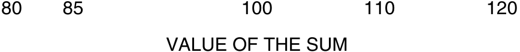

5. Bạn không thể ước lượng độ lệch chuẩn (SD) của hộp, vì vậy bạn sẽ không thể tính được các biên độ sai số (margins of error).
   *Giải thích thêm:* Biên độ sai số phụ thuộc trực tiếp vào Sai số chuẩn (SE), mà SE lại được tính dựa trên SD. Không có SD thì quy trình thống kê để tìm khoảng tin cậy không thực hiện được.

6. Đối với cả ba hộp, Giá trị kỳ vọng (EV) cho tổng của 100 lần rút đều là 200. Sai số chuẩn (SE) cho tổng của các lần rút (tác giả viết "average" trong bản gốc nhưng các phép tính tương ứng lại là cho tổng) lần lượt là:
   - 1 từ hộp A.
   - 1.4 từ hộp B.
   - 2 từ hộp C.

   - (a) Tổng 203.6 rất khó có khả năng xuất phát từ hộp A — vì nó cách kỳ vọng tới 3.6 SE (z-score $= \frac{203.6 - 200}{1} = 3.6$). Nó cũng khá khó có khả năng xuất phát từ hộp B, bởi vì $3.6 / 1.4 \approx 2.6$ SE vẫn là một khoảng cách rất lớn. Vì vậy, bằng phương pháp loại trừ, nó xuất phát từ hộp C (với khoảng cách $3.6 / 2 = 1.8$ SE, nằm trong vùng biến thiên ngẫu nhiên bình thường). Tương tự, 198.1 xuất phát từ hộp B (cách 1.36 SE), và còn lại 200.4 thuộc về hộp A (cách 0.4 SE).
   - (b) Thực tế vẫn có thể kết quả khác đi, nhưng xác suất đó rất nhỏ và mang tính gượng ép (pushing things).

Set D, trang 424

1. Khoảng tin cậy là $0.86 \pm 0.06$.
   *Giải thích thêm:* Đây là kết quả của việc áp dụng công thức $\text{Ước lượng điểm} \pm (Z \times \text{SE})$.

2. Đây là dữ liệu định tính (qualitative data), nên phải sử dụng phương pháp của chương 21 (ước lượng tỷ lệ). Khoảng tin cậy thu được là $60.1\% \pm 5.4\%$.
   *Giải thích thêm:* Đối với dữ liệu phân loại, ta dùng tỷ lệ mẫu thay vì trung bình mẫu, và SE của tỷ lệ được tính bằng công thức tương ứng.

3. Bài toán này không thể giải bằng đường cong phân phối chuẩn. Giả sử mẫu phản ánh quần thể một cách chính xác. Khi đó công ty đang lấy mẫu từ một hộp có chứa $99.87\%$ số 1 và $0.13\%$ số 0. Hộp này bị lệch (skewed) cực độ, đến mức với kích thước mẫu chỉ 750 lần rút, biểu đồ xác suất của tổng sẽ hoàn toàn không giống đường cong phân phối chuẩn. Xem bài tập 3 và 4 ở trang 383.
   *Giải thích thêm:* Định lý Giới hạn Trung tâm yêu cầu mẫu đủ lớn, phụ thuộc vào mức độ lệch của dữ liệu gốc. Với tỷ lệ thành công quá bé ($p = 0.0013$), quy tắc thực hành bị vi phạm ($np < 10$). Do đó, phân phối này không thể được xấp xỉ tốt bằng phân phối chuẩn.

4. Đây không phải là một mẫu ngẫu nhiên đơn giản (simple random sample) của các cá nhân: khi chọn một hộ gia đình, bạn sẽ lấy dữ liệu của tất cả mọi người trong nhà đó, hoặc không lấy ai cả. Do tính phụ thuộc này, Sai số chuẩn (SE) không thể được tính toán bằng các công thức chuẩn ở chương này. Xem bài tập 3 và 4 ở trang 404.

   *Bình luận.* 
   (i) Đây là phương pháp lấy mẫu cụm (cluster sample) — hộ gia đình đóng vai trò là một "cụm"; phương pháp nửa mẫu (half-sample method) có thể được dùng để tính SE cho trường hợp này (trang 402), nhưng sẽ cần thêm nhiều thông tin hơn.
   (ii) Những người sống chung trong một hộ gia đình thường có thói quen xem TV giống nhau, do đó mẫu này mang lại ít thông tin hơn so với một mẫu ngẫu nhiên đơn giản có cùng kích thước. Lấy mẫu cụm thường kém chính xác hơn lấy mẫu ngẫu nhiên đơn giản, nhưng bù lại chi phí thực hiện rẻ hơn nhiều.
   (iii) Vấn đề thường gặp nhất với lấy mẫu cụm là sai số ngẫu nhiên (chance error), chứ không phải là thiên lệch (bias); quy trình chọn mẫu trong bài tập này là không thiên lệch (unbiased).

5. (a) Đây hoàn toàn không phải là bất kỳ loại mẫu xác suất (probability sample) nào. Nó là một mẫu thuận tiện (sample of convenience).
   (b) Tương tự như (a).
   *Bình luận.* Cần phân biệt rõ, mẫu cụm (cluster sample) là một dạng đặc biệt của mẫu xác suất (trang 340, 342) bởi vì các cụm được chọn ngẫu nhiên. Mẫu thuận tiện thì không có yếu tố ngẫu nhiên.

6. Trung bình của hộp được ước lượng bằng trung bình của mẫu: $297 / 100 \approx 3.0$; tuy nhiên, để tính được sai số chuẩn (SE), bạn nhất thiết phải cần độ lệch chuẩn (SD).

7. Hai quy trình này thực chất là một: Lấy mẫu ngẫu nhiên đơn giản (simple random sampling) có nghĩa là rút ngẫu nhiên không hoàn lại (drawing at random without replacement) (trang 340).

## **Phần VII. Các mô hình xác suất**

### **Chương 24. Mô hình sai số đo lường**

Set A, trang 444

1. Dùng Sai số chuẩn (SE) cho tổng; giá trị này đã được tính toán ra là 60 microgam.
   *Giải thích thêm:* Khi bạn tính tổng của nhiều phép đo, sai số ngẫu nhiên của chúng tích lũy theo SE của tổng.

2. Giá trị ước lượng chính là trung bình của các phép đo, bằng $82,670$ pounds. Giá trị này có khả năng bị sai lệch một khoảng bằng với SE của trung bình, tức là $100$ pounds.
   *Giải thích thêm:* Trung bình của nhiều phép đo độc lập sẽ làm giảm sai số ngẫu nhiên. Sai số chuẩn (SE) của trung bình chính là thước đo cho sự sai lệch kỳ vọng.

3. (a) 800 micron
   (b) 80 micron
   (c) $91.4402 \text{ cm} \pm 160$ micron
   *Giải thích thêm:* 160 micron chính là 2 SE, cho ta một khoảng tin cậy 95% xung quanh giá trị trung bình mẫu.

4. (a) Sai. Khoảng cách biên độ này phải là 2 SE (Sai số chuẩn), chứ không phải là 2 SD (Độ lệch chuẩn) về cả hai phía tính từ giá trị trung bình.
   (b) Sai. Cùng lý do giải thích ở câu (a).
   (c) Đúng. Xem trang 384.
   - (d) Sai. Lập luận này mắc phải lỗi tương tự như bài tập 8 ở trang 421.

5. Hệ số tỷ lệ (factor) là 5.
   *Giải thích thêm:* Khi kích thước mẫu tăng lên $N$ lần, sai số chuẩn (SE) của trung bình sẽ giảm đi $\sqrt{N}$ lần. Nếu muốn SE giảm đi 5 lần, ta cần tăng số phép đo lên gấp $5^2 = 25$ lần.

### Set B, trang 449

1. Bạn sẽ phải tung chiếc đinh mũ (thumbtack) rất nhiều lần và quan sát xem tỷ lệ phần trăm số lần đinh rơi với đầu nhọn hướng xuống gần với 50% hay gần với 67% hơn. (Điều này sẽ phụ thuộc vào bề mặt rơi: trong một thí nghiệm, chiếc đinh rơi với mũi hướng xuống 66% số lần khi tung trên mặt thảm nhựa linoleum, nhưng chỉ 50% khi tung trên thảm vải.)
   *Giải thích thêm:* Theo Định luật Số lớn, tỷ lệ mẫu sẽ hội tụ về xác suất thực tế khi số lần thử đủ lớn.

2. Không. Các ngày mưa thường tập trung lại với nhau trong mùa mưa. Nếu hôm nay trời mưa, xác suất cao là ngày mai trời cũng sẽ mưa.
   *Giải thích thêm:* Mô hình lấy mẫu ngẫu nhiên từ hộp yêu cầu các lần rút phải độc lập với nhau. Hiện tượng thời tiết có tính phụ thuộc thời gian (tự tương quan), do đó không phù hợp.

3. Đối với các chữ số cuối, có. Đối với các chữ số đầu, không. Ví dụ, trong danh bạ điện thoại của San Francisco, chữ số đầu tiên không thể là 0. Ngoài ra, có nhiều số điện thoại bắt đầu bằng số 9 hơn là số 2.
   *Giải thích thêm:* Sự phân bố không đồng đều này phá vỡ giả định của mô hình hộp chứa các chữ số với cơ hội bằng nhau.

4. Không, các chữ cái được xuất ra theo thứ tự bảng chữ cái. Không có bất kỳ hộp rút thăm ngẫu nhiên nào có thể tạo ra điều đó.
   *Giải thích thêm:* Quá trình rút ngẫu nhiên tạo ra các kết quả xáo trộn, không thể tạo ra một chuỗi có trật tự cố định hoàn hảo.

5. Nhận ngay không chần chừ (Like a shot). Bạn có $50-50$ cơ hội để thắng được $\$5$ hoặc thua $\$4$.
   *Giải thích thêm:* Giá trị kỳ vọng của vụ cá cược này là $0.5 \times \$5 + 0.5 \times (-\$4) = \$0.5$. Vì giá trị kỳ vọng là số dương, đây là một trò chơi có lợi về mặt toán học.

Set C, trang 452

1. Trong cả hai trường hợp, giá trị đo được đều cao hơn 504 microgam so với 10 gram.

2. Không, như đã được chứng minh ở bài tập trước đó. Mức sai số không cố định mà thay đổi.

3. Sáu microgam là Độ lệch chuẩn (SD) của 100 phép đo được báo cáo trong bảng 1 ở trang 99. Giá trị này được sử dụng để ước lượng SD của hộp sai số. Do đó, đáp án là "được ước lượng từ dữ liệu" (estimated from the data as).

4. (a) Do biến thiên ngẫu nhiên (chance variation) — các nhà điều tra thu được các giá trị trung bình mẫu khác nhau.
   - (b) Lại là do biến thiên ngẫu nhiên — các nhà điều tra thu được các độ lệch chuẩn (SD) của mẫu khác nhau.
   - (c) Về lý thuyết, khoảng 95% trong số 50 khoảng tin cậy sẽ chứa đúng khối lượng thực tế, tức là khoảng 48 khoảng.
   - (d) 48. (Có một khoảng bị chệch ra khá xa — đây chính là minh chứng cho thấy biến thiên ngẫu nhiên đang hoạt động).

5. Độ lệch chuẩn (SD) của hộp sai số được ước lượng là 50 microgam.
   *Giải thích thêm:* Cần phân biệt rõ khi nào dùng SD và khi nào dùng SE.
   - (a) 5 microgam — đây là Sai số chuẩn (SE) cho trung bình.
   - (b) 50 microgam — đây là SD được ước lượng của hộp sai số.
   - (c) 95% — khoảng cách hai SE (2 SEs).

6. Đáp án là 1.2 microgam. Xem ví dụ 5, trang 451.
   *Giải thích thêm:* Đây là bài tập áp dụng công thức $SE = \frac{SD}{\sqrt{n}}$ để tính SE khi tăng kích thước mẫu.

7. (a) 300,007 (trung bình); 2 (SE cho trung bình).
   - (b) Sai: trung bình chính xác là 300,007.
   - (c) Đúng: mỗi con số trong danh sách phân tán xung quanh trung bình của danh sách một khoảng xấp xỉ bằng một SD.
   - (d) Đúng: khoảng tin cậy được định nghĩa là "trung bình $\pm 2$ SEs".
   - (e) Sai: trung bình của 25 phép đo chính xác là 300,007.
   - (f) Sai: 2 là SE, không phải là SD.

8. Đáp án là 2 inch. Lý do như sau. Mỗi phép đo bằng chiều dài chính xác cộng với một lần rút từ hộp sai số. Khoảng cách AE ước lượng chính là tổng của 4 phép đo, và nó sẽ sai lệch so với chiều dài AE thực tế bằng đúng tổng của 4 lần rút từ hộp sai số. Trung bình của hộp sai số là 0. Vì vậy, tổng của 4 lần rút sẽ dao động quanh mức 0, xê dịch trong khoảng một SE. Sai số chuẩn cho tổng (SE for the sum) chính là con số sai số phù hợp ở đây. SD của hộp là 1 inch, do đó SE cho tổng 4 lần đo là $\sqrt{4} \times 1\text{ inch} = 2\text{ inch}$. 
   *Bình luận.* Việc tìm chiều dài AE đòi hỏi phải cộng dồn các phép đo, chứ không phải là tính trung bình chúng.

9. Các sai số ngẫu nhiên của những người khác nhau có thể có những SD khác nhau. Hơn nữa, nếu cùng một người làm bài kiểm tra nhiều lần, các sai số có thể bị phụ thuộc lẫn nhau. Mô hình Gauss dường như không thể áp dụng được cho trường hợp này.

### **Chương 25. Mô hình xác suất trong Di truyền học**

Set A, trang 461

1. Mỗi hạt giống có 50% cơ hội nhận alen *y* từ cha mẹ *y/g*, và 50% cơ hội nhận alen *g*. Nó chắc chắn sẽ nhận alen *g* từ người cha/mẹ *g/g*. Do đó, hạt giống có 50% cơ hội trở thành *y/g* (và có màu vàng); đồng thời có 50% cơ hội trở thành *g/g* (và có màu xanh lá). Khoảng 50% số hạt giống sẽ có màu vàng.
   *Giải thích thêm:* Trong di truyền học, phép lai phân tích giữa cá thể dị hợp và đồng hợp lặn luôn tạo ra đời con có tỷ lệ 1:1.

   - Số lượng hạt màu vàng trong số 1,600 hạt giống tương đương với tổng của 1,600 lần rút từ hộp 0 1. Giá trị kỳ vọng cho số hạt vàng là $1,600 \times 1/2 = 800$. Sai số chuẩn (SE) cho con số này là $\sqrt{1,600 \times 1/2 \times 1/2} = 20$. Bây giờ có thể sử dụng xấp xỉ phân phối chuẩn:

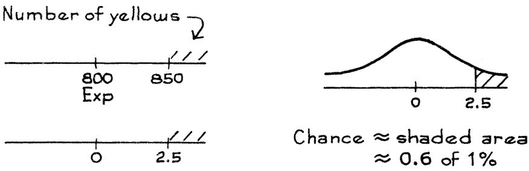

2. (a) trắng $\times$ đỏ $\rightarrow$ 100% hồng
   *Giải thích thêm:* Đây là hiện tượng trội không hoàn toàn.
   - trắng $\times$ hồng $\rightarrow$ 50% trắng, 50% hồng
   - hồng $\times$ hồng $\rightarrow$ 25% đỏ, 50% hồng, 25% trắng.

   *Phân tích cho phép lai hồng $\times$ hồng:* Mỗi phụ huynh là *r/w*, vì vậy màu hoa của thế hệ con được xác định bằng cách chọn ngẫu nhiên một hàng và một cột từ bảng dưới đây.

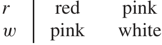

   - (b) Kỳ vọng số lượng hoa màu hồng trong 400 cây là 200, với SE là 10. Áp dụng xấp xỉ phân phối chuẩn:

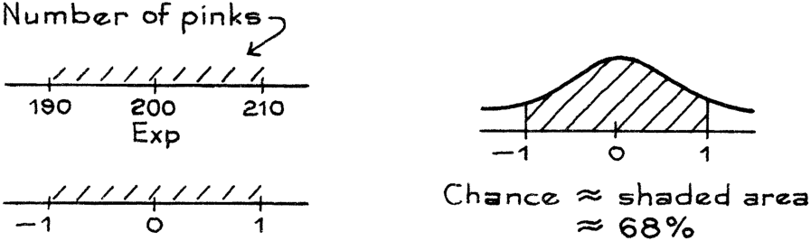

3. (a) Một cặp gen điều khiển chiều rộng của lá, với các biến thể *w* (rộng) và *n* (hẹp). Các quy tắc: *w/w* tạo ra lá rộng, *w/n* và *n/w* tạo ra lá trung bình, và *n/n* tạo ra lá hẹp.
   (b) lá hẹp $\times$ lá hẹp = *n/n* $\times$ *n/n* $\rightarrow$ 100% *n/n* = lá hẹp
   lá hẹp $\times$ lá trung bình = *n/n* $\times$ *n/w* $\rightarrow$
   - 50% *n/n* = lá hẹp , 50% *n/w* = lá trung bình .

4. *B* = mắt nâu, *b* = mắt xanh dương. Người chồng là *B/b*, người vợ là *b/b*. Mỗi đứa trẻ có 1 cơ hội trong 2 (50%) để có mắt nâu. Ba đứa trẻ là độc lập với nhau, do đó xác suất để cả ba đều có mắt nâu là $(1/2)^3 = 1/8$.

## **Phần VIII.**

### **Chương 26. Kiểm định ý nghĩa thống kê**

Set A, trang 476

1. (a) được ước lượng từ dữ liệu (estimated from the data as) 
   (b) quan sát được (observed)

2. Giá trị quan sát được chỉ nằm dưới mức kỳ vọng 1.3 SE, giả thuyết của Tiến sĩ Null vẫn đang hợp lý.
   *Giải thích thêm:* Nếu giá trị quan sát cách kỳ vọng $\le 2$ SE, ta thường không có đủ bằng chứng để bác bỏ Giả thuyết Không.

3. Một lần nữa, giá trị quan sát lại cách mức kỳ vọng khoảng 1.3 SE về phía dưới, và giả thuyết Null tiếp tục tỏ ra hợp lý. 
   *Bài học (Moral):* Kết quả phụ thuộc vào giá trị quan sát, giá trị kỳ vọng, và SE. Đổi lại, SE phụ thuộc vào SD và kích thước mẫu.

4. Nếu viên xúc xắc là công bằng, tổng số chấm giống như tổng của 100 lần rút từ hộp 1 2 3 4 5 6. Trung bình của hộp là 3.5; SD là 1.7. Do đó, giá trị kỳ vọng cho tổng là 350, và SE là 17. Tổng số chấm quan sát được chỉ cao hơn kỳ vọng một chút xíu, ở mức hơn 1 SE, điều này trông hoàn toàn giống như biến thiên ngẫu nhiên.

5. Bài toán này có thể được thiết lập giống bài tập 4, nhưng lần này tổng số chấm quan sát được lại cao hơn giá trị kỳ vọng một khoảng vượt quá 3 SE. Điều này không giống như biến thiên ngẫu nhiên.
   *Bình luận.* 
   (i) Kích thước mẫu rất quan trọng; hãy so sánh bài tập 4 và 5.
   - (ii) Một kiểm định đầy đủ hơn cho độ công bằng của viên xúc xắc sẽ được trình bày ở chương 28.

### Set B, trang 478

1. (iii)

2. Giả thuyết Không (null hypothesis) cho rằng sự khác biệt là do biến thiên ngẫu nhiên (chance), nhưng giả thuyết thay thế (alternative hypothesis) khẳng định rằng sự khác biệt này là có thật.

3. Chọn (ii). Cả Tiến sĩ Null và Tiến sĩ Alt đều đã biết dữ liệu, họ không biết những gì có trong hộp. Giả thuyết Không là một phát biểu về hộp, và kiểm định cho bạn biết liệu phát biểu này có hợp lý hay không.

4. hộp (box). Giả thuyết Không là về hộp.

5. Độ lệch chuẩn (SD) của hộp có thể được ước lượng là 10, do đó Sai số chuẩn (SE) cho trung bình của 100 lần rút được ước lượng là 1. Nếu trung bình của hộp là 20, thì trung bình của các lần rút quan sát được đang nằm ở mức cao hơn kỳ vọng tới 2.7 SE. Điều này là không hợp lý (isn't plausible).

Set C, trang 481

1. (a) Giá trị $P = 32\%$ là phù hợp nhất cho giả thuyết không (null hypothesis). 
   *Giải thích: Một giá trị P lớn cho thấy dữ liệu quan sát được khá phù hợp với giả định của giả thuyết không, do đó không có đủ bằng chứng để bác bỏ nó.*

   (b) Giá trị $P = 0.1\%$ là phù hợp nhất cho giả thuyết đối (alternative hypothesis).
   *Giải thích: Giá trị P rất nhỏ (ví dụ 0.1%, nhỏ hơn nhiều so với mức ý nghĩa thông thường như 5% hay 1%) cho thấy dữ liệu hiện tại rất khó có thể xảy ra nếu giả thuyết không là đúng, do đó cung cấp bằng chứng mạnh mẽ để ủng hộ giả thuyết đối.*

   Tóm lại: Giá trị $P$ lớn là "tin tốt" cho giả thuyết không; giá trị $P$ nhỏ là "tin xấu" cho giả thuyết không.

2. (a) Đúng (True). (b) Sai (False). Xem trang 480–481.

3. (a) Đúng, xem trang 480–481. (b) Sai, xem trang 480–481.

4. Sai số chuẩn (SE) cho giá trị trung bình $\approx 1.25$, do đó $z \approx (52.7 - 50) / 1.25 \approx 2.16$ và giá trị $P$ xấp xỉ bằng diện tích nằm bên phải giá trị 2.16 dưới đường cong phân phối chuẩn. Từ bảng phân phối chuẩn hóa, giá trị này vào khoảng $1.6\%$. Sự khác biệt này rất khó có thể được giải thích đơn thuần là do biến thiên ngẫu nhiên (chance variation). Do đó, giả thuyết đối có vẻ hợp lý.

5. Hộp (box). 
   *Giải thích: Giả thuyết không luôn đưa ra các phát biểu về quần thể (population), ở đây được mô hình hóa dưới dạng một chiếc hộp (box).*

6. Không (No). 
   *Giải thích: Với chỉ 10 lần rút (draws), biểu đồ tần suất xác suất (probability histogram) của trung bình mẫu có thể không có hình dạng giống với đường cong phân phối chuẩn (do mẫu quá nhỏ để áp dụng Định lý Giới hạn Trung tâm). Hơn nữa, độ lệch chuẩn (SD) của dữ liệu mẫu nhỏ sẽ không phải là một ước lượng tốt (reliable) cho độ lệch chuẩn thực sự của hộp.*

7. Mẫu này tương tự như việc thực hiện 100 lần rút ngẫu nhiên từ một hộp, trong đó mỗi vé đại diện cho một nhân viên và ghi số ngày nhân viên đó vắng mặt. 
   - Giả thuyết không: giá trị trung bình của hộp là 6.3 ngày. 
   - Giả thuyết đối: giá trị trung bình của hộp nhỏ hơn 6.3 ngày. 
   Độ lệch chuẩn (SD) của hộp được ước lượng là 2.9 ngày, do đó sai số chuẩn (SE) của trung bình mẫu là $0.29$ ngày (tính bằng $2.9 / \sqrt{100}$). Từ đó tính được $z \approx (5.5 - 6.3) / 0.29 \approx -2.8$, suy ra giá trị $P \approx 0.3\%$. Đây là bằng chứng rất mạnh mẽ chống lại giả thuyết không; biến thiên ngẫu nhiên không thể giải thích được sự sụt giảm trong số ngày vắng mặt.

8. Bây giờ $z \approx (5.9 - 6.3) / 0.29 \approx -1.4$, do đó $P \approx 8\%$. Mức giá trị $P$ này lớn hơn mức ý nghĩa 5%, nên giả thuyết không trở nên hợp lý hơn. 
   *Giải thích: Sự khác biệt so với trung bình 6.3 có thể chỉ là do biến thiên ngẫu nhiên, chưa đủ bằng chứng để khẳng định có sự sụt giảm thực sự.*

Set D, trang 482

1. (a) Sai. 
   *Giải thích: Thậm chí ngay cả khi giả thuyết không thực sự đúng, thì vẫn có 1% khả năng thí nghiệm (do tính ngẫu nhiên) sẽ cho ra một kết quả được coi là "rất có ý nghĩa thống kê" (highly significant) ở mức ý nghĩa 1%. Đây chính là xác suất mắc sai lầm loại I.*

   (b) Sai; trang 480–481. (c) Sai; trang 480–481.

2. (a) Đúng. Giá trị $P$ lớn ủng hộ giả thuyết không.

   (b) Đúng. Giá trị $P$ nhỏ chống lại giả thuyết không.

3. (a) Đúng; trang 482.

   (b) Sai; giá trị $P$ phải nhỏ hơn 1% thì mới được coi là "rất có ý nghĩa thống kê" (highly significant).

   (c) Đúng; trang 482. (d) Đúng; trang 479.

   (e) Đúng; công thức tính z là $z = (\text{obs} - \text{exp}) / \text{SE}$, và giá trị kỳ vọng "exp" luôn luôn được tính toán dựa trên giả định giả thuyết không là đúng.

4. Khoảng 2%.

5. (a) Đúng; $z = (\text{obs} - \text{exp}) / \text{SE}$; "obs" là giá trị trung bình quan sát được của các lần rút; "exp" là giá trị trung bình kỳ vọng của hộp, được cho là 50.

   (b) Khoảng 50.

   (c) Khoảng 2; và theo dữ liệu thì có 3 trong số chúng thỏa mãn.

   (d) Khoảng 2%. Xem bài tập 4.

Set E, trang 486

1. Lựa chọn (i) là đúng: "tương tự như" (like) ở đây mang ý nghĩa "xét về mặt xác suất" (as far as the chances are concerned). Mỗi dự đoán có 1 phần 4 cơ hội là đúng, và mỗi lần rút (từ hộp) có 1 phần 4 cơ hội được số 1. Vì vậy, số lượng dự đoán đúng tuân theo quy luật tương tự như tổng các lần rút, và quy luật căn bậc hai (square root law) được áp dụng một cách hợp lệ.

   Lựa chọn (ii) sai: nếu giả định không có khả năng ngoại cảm (ESP), cơ hội dự đoán đúng là $1/4$, chứ không phải $1/3$. 
   Lựa chọn (iii) còn sai sót nặng hơn: tỷ lệ $2,006 / 7,500$ là phần trăm số 1 có trong *mẫu* (sample), chứ không phải trong *hộp* (box). 
   Lựa chọn (iv) sai: phần trăm số 1 trong mẫu là một giá trị thực tế đã biết, không cần phải tranh luận hay kiểm định về nó. 
   Lựa chọn (v) hoàn toàn chệch hướng: giả thuyết không tương ứng với ý tưởng rằng *không có* khả năng ngoại cảm (ESP).

2. (a) sinh viên đã đăng ký học tại trường Berkeley trong học kỳ đó. Lý do: hộp phải tương ứng với toàn bộ quần thể (population).

   (b) $1 = \text{nam}, 0 = \text{nữ}$. Lý do: mục tiêu bạn đang quan tâm là đếm số lượng nam. (Nếu bạn muốn đếm số lượng nữ, điều đó cũng hoàn toàn được, nhưng bạn cần phải nhất quán trong suốt phần còn lại của bài toán.)

   (c) Có 25,000 vé trong hộp, và thực hiện 100 lần rút. Lý do: mẫu quan sát tương tự như các lần rút từ hộp.

   (d) 100 lần rút.

   (e) 67%. Lý do: Bạn đã biết chính xác phần trăm nam giới trong quần thể ban đầu.

3. (a) 53 (b) 67 (c) tổng (sum) (d) $\sqrt{100} \times \sqrt{0.67 \times 0.33} \approx 4.7$

   (e) $z \approx (53 - 67) / 4.7 \approx -3$ và $P \approx 1 / 1,000$.

4. Không. 
   *Giải thích: Anh ta đã thu được quá nhiều nữ (hoặc quá ít nam) so với kỳ vọng. Giá trị $P$ cực kỳ nhỏ, do đó biến thiên ngẫu nhiên (chance variation) không thể giải thích được sự khác biệt này. Việc lấy mẫu những người một cách tùy tiện, thiếu hệ thống (haphazardly) không mang lại kết quả giống như lấy mẫu ngẫu nhiên đơn giản (simple random sample) (chương 19). Anh ta đã gặp phải thiên lệch chọn mẫu.*

5. (a) Được tính toán từ giả thuyết không: $100 \times 0.67$. Giá trị kỳ vọng (expected) luôn luôn được tính toán từ giả định của giả thuyết không.

   (b) Được tính toán từ giả thuyết không. Ở đây, giả thuyết không đã chỉ cho bạn biết cấu trúc cụ thể của hộp. Nếu không có thông tin này, bạn có thể sẽ phải ước lượng độ lệch chuẩn (SD) của hộp thông qua dữ liệu mẫu (trang 485).

6. (a) Giả thuyết không: số lượng dự đoán đúng có quy luật phân bố tương tự như tổng của 1,000 lần rút từ một hộp chứa một vé đánh số 1 và chín vé đánh số 0.

   (b) $\sqrt{0.1 \times 0.9}$. Giả thuyết không cho bạn biết chính xác có những gì trong hộp. Hãy sử dụng trực tiếp thông tin đó để tính độ lệch chuẩn.

   (c) $z \approx (173 - 100) / 9.5 \approx 7.7$, và giá trị $P$ vô cùng nhỏ (gần như bằng 0).

   (d) Dù nguyên nhân thực sự là gì đi nữa, thì nó chắc chắn không phải là do biến thiên ngẫu nhiên. (Có thể là sự gian lận hoặc thiết kế thí nghiệm có lỗ hổng).

7. (a) Việc tung đồng xu tương tự như việc rút ngẫu nhiên có hoàn lại 10,000 lần từ một hộp số dạng 0–1, với $0 = \text{mặt ngửa (tails)}$ và $1 = \text{mặt sấp (heads)}$. Tỷ lệ thực sự của vé số 1 trong hộp là một số chưa biết. 
   - Giả thuyết không: tỷ lệ này đúng bằng $1/2$. 
   - Giả thuyết đối: tỷ lệ này lớn hơn $1/2$. 
   Số lần xuất hiện mặt sấp sẽ tương tự như tổng của các lần rút.

   (b) $z = 3.34, P \approx 4 / 10,000$.

   (c) Có quá nhiều mặt sấp để có thể giải thích đó là do biến thiên ngẫu nhiên. Đồng xu này khả năng cao không cân bằng.

8. (a) Tương tự như 7(a). (b) $z = 1.34, P \approx 9\%$.

   (c) Đồng xu có vẻ là công bằng (fair). 
   *Giải thích: Giá trị $P \approx 9\%$ lớn hơn ngưỡng 5%, nên sự chênh lệch có thể dễ dàng giải thích bằng biến thiên ngẫu nhiên. Chưa có bằng chứng bác bỏ việc đồng xu công bằng.*

9. (a) hộp (box). Giả thuyết không luôn luôn là một lời phát biểu về hộp (quần thể). (b) Sai; xem trang 480–481.

10. Dữ liệu bao gồm 25 mức trọng lượng. Giả thuyết không nói rằng dữ liệu này tương tự như 25 lần rút được thực hiện ngẫu nhiên từ một hộp. Có một vé trong hộp cho mỗi con vật trong quần thể, ghi trọng lượng của con vật đó. Vì vậy trung bình của hộp là 30 gram. Và độ lệch chuẩn (SD) của nó là 5 gram, do đó sai số chuẩn (SE) cho trung bình của 25 lần rút là 1 gram (vì $\text{SE} = \text{SD}_{\text{box}} / \sqrt{n} = 5 / \sqrt{25} = 1$). Bây giờ $z = (33 - 30) / 1 = 3$, và $P \approx 1 / 1,000$.

*Bình luận.* 
(i) Ở đây, giả thuyết không đã cho bạn biết độ lệch chuẩn (SD) của hộp, do đó bạn không cần phải ước lượng nó từ dữ liệu. Giá trị SD của dữ liệu không được sử dụng trong việc giải quyết bài toán này. Xem trang 485.

(ii) Việc chọn lựa các cá thể một cách tùy tiện (haphazardly) không giống như việc tiến hành lấy mẫu ngẫu nhiên đơn giản (chương 19). Khi bạn thò tay vào lồng để bắt một con vật, có khả năng cao là những con có tính khí thuần hóa, hiền lành hơn sẽ tự đến với tay bạn, và những con này thường nặng hơn một chút so với những con khác nhút nhát. Đây là một dạng thiên lệch do phương pháp chọn mẫu.

11. Giả thuyết không phát biểu rằng việc giảm giá không có tác động nào đến khối lượng bán hàng. Vì vậy, trong mỗi cặp cửa hàng, cửa hàng bán với giá thông thường có khả năng bán được nhiều hơn ngang bằng (50-50) với cửa hàng đối tác đang áp dụng mức giá giảm. Xét theo mô hình hộp, giả thuyết không nói rằng dữ liệu tương tự như 25 lần rút từ hộp chứa vé $\boxed{1}$ và $\boxed{0}$, trong đó 1 mang ý nghĩa là cửa hàng bán giá thông thường bán được số lượng lớn hơn và 0 mang ý nghĩa là cửa hàng bán giá thông thường bán được ít hơn. 
Số lượng thẻ số 1 kỳ vọng (expected) là $25 \times 0.5 = 12.5$, và SE là $\sqrt{25} \times \sqrt{0.5 \times 0.5} = 2.5$. Do đó $z = (18 - 12.5) / 2.5 = 2.2$ và $P \approx 1.4\%$. Bằng chứng để chống lại giả thuyết không là khá mạnh mẽ.

*Bình luận.* Quy trình này được gọi là "kiểm định dấu" (the sign test). Xem bài tập 6 ở trang 258 (chuột túi) và bài tập 11 ở trang 262 (người hút thuốc). Nếu áp dụng phép hiệu chỉnh tính liên tục (continuity correction), phương pháp xấp xỉ chuẩn cho ra $P \approx 2.28\%$, so với con số 2.16% tính từ công thức nhị thức chính xác.

Set F, trang 493

1. (a) 5% (b) 5% (c) 90% (d) 95%

2. Từ bảng phân bố, diện tích nằm bên phải của 2.92 là 5%, và diện tích nằm bên phải của 6.96 là 1%. Do giá trị 4.02 nằm giữa 2.92 và 6.96, diện tích nằm bên phải của 4.02 sẽ nằm trong khoảng từ 1% đến 5%.

3. Không, số bậc tự do (degrees of freedom) phải là 3. 
   *Giải thích: Với kích thước mẫu $n=4$, số bậc tự do được tính bằng $n - 1 = 3$.*

4. (a) bậc tự do (degrees of freedom) = 2, trung bình $\approx 72.7$, $\text{SD}^+ \approx 5.7$, sai số chuẩn (SE) $\approx 3.3$,
   - $t \approx (72.7 - 70) / 3.3 \approx 0.8$,
   - $P$ (diện tích bên phải của phân bố t) xấp xỉ khoảng 25%.

   (b) $P$ vào khoảng 2.5%, cần phải hiệu chuẩn lại. 
   *Giải thích: Giá trị P nhỏ dưới 5% cho thấy độ lệch quan sát được có ý nghĩa thống kê, tức là hệ thống đo lường có thể đã bị lệch và cần được hiệu chuẩn lại (recalibrate).*

   (c) Một lần đo lường duy nhất không bao giờ là đủ. 
   *Giải thích: Ta không thể tính được độ lệch chuẩn hay phương sai mẫu từ 1 lần đo, do đó không thể xác định được sai số do biến thiên ngẫu nhiên.*

   (d) $P$ vào khoảng 25%.
   *Giải thích: Giá trị P lớn, không đủ bằng chứng để khẳng định có sự sai lệch.*

   *Bình luận.* Hai lần đo lường luôn tốt hơn một lần; nhiều lần đo lường hơn sẽ lại càng tốt hơn vì giúp giảm sai số chuẩn.

5. Ở phần (a), con số 93 là một giá trị ngoại lai (outlier), do đó các sai số dường như không tuân theo đường cong chuẩn. Ở phần (c), các con số chỉ đơn thuần là sự chuyển đổi qua lại lặp lại giữa 69 và 71. Hiện tượng này cũng không phù hợp cho mô hình Gauss vốn đòi hỏi các sai số phân bố liên tục và hình chuông.

6. Theo mô hình Gauss, mỗi một trong 10 phép đo mới sẽ bằng trọng lượng chính xác, cộng với độ chệch (bias), cộng với một lần rút từ hộp sai số. Giả thuyết không nói rằng độ chệch bằng 0; giả thuyết đối nói rằng có tồn tại một số độ chệch khác 0. Độ lệch chuẩn (SD) của hộp sai số được ước lượng như sau: $\sqrt{10 / 9} \times 9 \approx 9.5$. (Các sai số này thuộc về chiếc cân đã được sửa lại, do đó SD cũ là 7 microgram hoàn toàn không liên quan). Sai số chuẩn (SE) cho trung bình $\approx 9.5 / \sqrt{10} \approx 3$ microgram, $t \approx -2.67$. Diện tích nằm bên trái của $-2.67$ dưới đường cong Student với 9 bậc tự do là khoảng 1%, đây là bằng chứng mạnh mẽ chống lại giả thuyết không. (Nghĩa là chiếc cân vẫn có độ chệch).

7. (a) Theo mô hình Gauss, mỗi một trong 100 phép đo bằng với trọng lượng chính xác cộng thêm một lần rút từ hộp sai số. Các vé trong hộp sai số có mức trung bình bằng 0. Tham số chưa biết là trọng lượng chính xác. Giả thuyết không nói rằng trọng lượng chính xác này vẫn ở mức 512 microgram cao hơn một kilogram. Giả thuyết đối nói rằng trọng lượng chính xác này là nhỏ hơn.

   (b) Độ lệch chuẩn (SD) của hộp sai số có thể được ước lượng từ các dữ liệu lịch sử trong quá khứ là 50 microgram: hộp sai số này là đặc tính của thiết bị. (Giá trị SD mới là 52 microgram tính từ mẫu không liên quan vì giá trị thiết kế/lịch sử chính xác hơn).

   (c) Với 100 phép đo, hãy sử dụng $z$ chứ không phải $t$. Sai số chuẩn (SE) cho trung bình của 100 phép đo là $50 / \sqrt{100} = 5$ microgram, do đó $z = (508 - 512) / 5 = -0.8$ và $P \approx 21\%$.

   (d) Sự sụt giảm về trọng lượng trông có vẻ giống như một sự biến thiên ngẫu nhiên (chance variation) do giá trị $P$ cao.

### **Chương 27. Các kiểm định khác cho Trung bình**

Set A, trang 503

1. Đúng, hiện tại các con số là độc lập (independent) với nhau, do đó quy luật căn bậc hai (square root law) được áp dụng để tính SE cho tổng/hiệu.

2. Giá trị kỳ vọng là $100 - 50 = 50$, và sai số chuẩn (SE) là $\sqrt{2^2 + 3^2} \approx 3.6$. Quy luật căn bậc hai được áp dụng vì các lần rút hoàn toàn độc lập với nhau.

3. Giá trị kỳ vọng cho mỗi tỷ lệ phần trăm là 50%; các giá trị SE tương ứng là 2.5 và 5 điểm phần trăm. Giá trị kỳ vọng cho sự khác biệt là 0, và SE là $\sqrt{2.5^2 + 5^2} \approx 5.6$ điểm phần trăm. Quy luật căn bậc hai được áp dụng vì hai tỷ lệ phần trăm này là độc lập.

4. (a,b) Đúng.

   (c) Sai. Các tỷ lệ phần trăm này là phụ thuộc vào nhau: nếu đồng xu rơi vào mặt ngửa, nó không thể rơi vào mặt sấp. Quy luật căn bậc hai không được áp dụng đối với các biến có tương quan.

*Bình luận.* Sự khác biệt "số lượng mặt ngửa − số lượng mặt sấp" tương tự như tổng của 500 lần rút từ hộp chứa thẻ $\boxed{-1}$ và $\boxed{+1}$, do đó SE cho sự khác biệt trong hai số lượng này là khoảng 22, và SE cho sự khác biệt tính theo phần trăm là 
$(22 / 500) \times 100\% = 4.4\%$.

5. Đúng. 
   *Giải thích: Nếu các lần rút được thực hiện có hoàn lại (with replacement), hai mức trung bình mẫu sẽ hoàn toàn độc lập với nhau: SE cho sự khác biệt sẽ bằng chính xác $\sqrt{3^2 + 3^2}$. Hộp ở đây lớn đến mức hầu như không có bất kỳ sự khác biệt thực tế nào giữa việc rút có hoàn lại và không hoàn lại.*

6. Độ lệch chuẩn (SD) của hộp F có thể được ước lượng là 3, do đó SE cho trung bình của 100 lần rút từ hộp F là $3 / \sqrt{100} = 0.3$; tương tự, SE cho trung bình của 400 lần rút từ hộp G được ước lượng là $8 / \sqrt{400} = 0.4$; các trung bình này là độc lập, do đó SE cho sự khác biệt là $\sqrt{0.3^2 + 0.4^2} = 0.5$. Nếu hai hộp có cùng giá trị trung bình, sự khác biệt quan sát được là $51 - 48 = 3$, nằm cách giá trị kỳ vọng 0 tới tận 6 lần SE (vì $z = 3 / 0.5 = 6$). Đây không phải là một câu chuyện có khả năng xảy ra (xác suất gần như bằng 0). Do đó 2 hộp khác nhau.

Set B, trang 506

1. Kiểm định $z$ hai mẫu (Two-sample z-test).

2. (a) Kiểm định $z$ hai mẫu: bạn đang so sánh hai mẫu độc lập.

   (b) Cấu trúc giống như trong giáo trình, với một hộp đại diện cho năm 1990 và một hộp cho năm 2004. Có vô số vé trong mỗi hộp, và thực hiện 1,000 lần rút từ mỗi hộp. Các vé hiển thị điểm thi. Giả thuyết không nói rằng mức trung bình của các hộp là giống hệt nhau. Giả thuyết đối nói rằng mức trung bình là khác nhau.

   (c) SE cho sự khác biệt là 1.37, do đó $z = 2 / 1.37 \approx 1.46$. Điều này có thể dễ dàng là do biến thiên ngẫu nhiên (vì mức $z=1.46$ tương ứng với $P$-value khoảng 14%, không đủ để bác bỏ giả thuyết không).

3. Sự khác biệt này là lớn, và rất có ý nghĩa thống kê (highly significant) — xét cả về mặt thực tiễn (khoảng cách điểm cao) và thống kê (P-value rất nhỏ).

4. Sự khác biệt giữa hai trung bình mẫu là 2.1 giờ, và SE cho sự khác biệt là 0.35 giờ. Vì vậy $z \approx 6$, và $P \approx 0$. Sự khác biệt là rất khó để giải thích bằng một biến thiên ngẫu nhiên. Sinh viên tại các trường đại học tư thục thường xuất thân từ các gia đình giàu có hơn, và nhận được nhiều sự hỗ trợ từ gia đình hơn.

5. Tử số đang được tính bằng phần trăm, nhưng mẫu số lại là số thập phân. Đó là một sai lầm. Thực tế, $z = (41 - 17) / 4.8 = 5$. Nếu bạn muốn dùng số thập phân, thì $z = (0.41 - 0.17) / 0.048 = 5$. 
*Bình luận.* Việc quên chuyển đổi mẫu số sang phần trăm là một sự trượt dốc phổ biến. Bạn có thể làm toàn bộ bài toán bằng phần trăm hoặc bằng số thập phân, nhưng tuyệt đối đừng thay đổi đơn vị giữa chừng.

6. Có hai mẫu, do đó bạn cần thực hiện một kiểm định $z$ hai mẫu. Dữ liệu bao gồm 1,600 số 0 và số 1 cho nam giới ($1 = \text{mù chữ}$), và 1,600 số 0 và số 1 khác cho nữ giới. Mô hình có hai hộp, M (Nam) và F (Nữ). Hộp M có một vé cho mỗi thanh niên nam trên toàn quốc, đánh dấu 1 cho người mù chữ và 0 cho người biết chữ. Hộp F tương tự, dành cho nữ giới. Dữ liệu cho nam giới tương tự như 1,600 lần rút từ hộp M, và tương tự cho nữ giới. 
   - Giả thuyết không: phần trăm vé số 1 là như nhau ở cả hai hộp. 
   - Giả thuyết đối: phần trăm vé số 1 ở hộp M cao hơn. 
   SE cho phần trăm số 1 trong mẫu nam giới có thể được ước lượng là $0.64\%$; cho mẫu nữ giới, SE là $0.43\%$. Vì vậy SE cho sự khác biệt là $\sqrt{0.64^2 + 0.43^2} \approx 0.77\%$. Khi đó $z \approx (7 - 3) / 0.77 \approx 5.2$ và $P$ gần như bằng 0. Sự khác biệt này gần như không thể giải thích là do biến thiên ngẫu nhiên. (Nam giới có tỷ lệ mù chữ cao hơn đáng kể).

7. SE cho sự khác biệt của hai mức trung bình có thể được ước lượng là $\sqrt{0.5^2 + 0.5^2} \approx 0.7$. Vì vậy $z = (26 - 25) / 0.7 \approx 1.4$, và $P \approx 8\%$. Sự khác biệt này có thể hoàn toàn là do ngẫu nhiên (chưa đạt mức ý nghĩa 5%).

8. $z = 1 / 0.45 \approx 2.2$ và $P \approx 1.4\%$.

   *Bình luận.* Mức ý nghĩa thống kê quan sát được phụ thuộc rất nhiều vào kích thước mẫu. Với những mẫu rất lớn, ngay cả những khác biệt nhỏ xíu về mặt thực tiễn cũng sẽ trở nên "rất có ý nghĩa thống kê". Tìm hiểu thêm về điều này trong chương 29.

9. Mức trung bình của nhóm điều trị và nhóm đối chứng là phụ thuộc vào nhau, bởi vì những con chuột này được ghép thành từng cặp đến từ cùng một lứa đẻ. Do đó, nếu một con chuột có vỏ não nặng, con còn lại trong cặp nhiều khả năng cũng sẽ như vậy. Việc tính toán SE theo mô hình hai mẫu độc lập không tính đến sự bắt cặp này. 
*Bình luận.* Xem bài tập ôn tập số 12 trong chương 26 để có phương pháp phân tích tốt hơn. Trong mỗi cặp, hãy lấy độ chênh lệch "điều trị − đối chứng". Tiến hành kiểm định $z$ (hoặc $t$) một mẫu trên chính các sự khác biệt đó (paired test).

Set C, trang 511

1. (a) Hai con số. Số B (B-number) không được quan sát thấy; nó cho biết điểm số của anh ta sẽ là bao nhiêu, *nếu* anh ta được phân công vào nhóm đối chứng.

   (b) Có. Số A (A-number) cho biết điểm số của cô ấy sẽ là bao nhiêu, *nếu* cô ấy được phân công vào nhóm nhận huấn luyện (coaching group). Con số này không được quan sát thấy, bởi vì thực tế cô ấy ở trong nhóm đối chứng. Các điều tra viên không thể biết con số A là bao nhiêu.

   (c) Thực hiện theo con đường thận trọng (conservative). SE cho trung bình nhóm huấn luyện là 9.8 điểm. SE cho trung bình nhóm đối chứng là 10.3 điểm. SE cho sự khác biệt là $\sqrt{9.8^2 + 10.3^2} \approx 14.2$ điểm. Sự khác biệt trong điểm trung bình thực tế là 9, do đó $z \approx 9 / 14.2 \approx 0.65$, và $P \approx 26\%$. Điều này có thể dễ dàng là do biến thiên ngẫu nhiên. (Không đủ bằng chứng để nói chương trình huấn luyện có hiệu quả).

*Bình luận.* Bài tập 1 không giống với việc so sánh điểm thi NAEP vào năm 1990 và 2004 (phần 2), bởi vì chúng ta không hề có hai mẫu hoàn toàn độc lập. Nhưng nó giống với thí nghiệm bổ sung vitamin C (ví dụ 4). Mỗi sinh viên trong số 200 sinh viên có hai phản hồi tiềm năng — một phản hồi nếu được huấn luyện và một phản hồi nếu không được huấn luyện. Các điều tra viên chỉ có cơ hội nhìn thấy một trong hai phản hồi, và họ đã thực hiện các lựa chọn của mình một cách ngẫu nhiên. Đó chính là lý do tại sao phương pháp tính SE (theo kiểu hai mẫu độc lập) vẫn được coi là hợp lệ (xem trang 509–511).

2. (a) Sự khác biệt là $66 - 59 = 7$ điểm, và SE là 1.8 điểm. Vì vậy $z \approx 3.9$, và $P \approx 0$. Sự khác biệt này rất khó có thể được giải thích là do biến thiên ngẫu nhiên. Ngũ cốc Wheaties đã phát huy tác dụng!

   (b) Các học sinh sẽ biết họ đang được ăn loại ngũ cốc nào, do đó rất khó để "làm mù" (blind) khía cạnh đó của nghiên cứu. Việc chấm điểm bài kiểm tra cuối kỳ thì có thể thực hiện mù (người chấm không biết bài của nhóm nào). Sự đồng thuận tham gia vào nghiên cứu nên được thu thập trước khi tiến hành phân chia ngẫu nhiên (randomization), chứ không phải sau đó, nhằm làm giảm bớt tỷ lệ những người bỏ cuộc có chọn lọc (selective drop outs).

3. (a) Sự khác biệt là 1 điểm, và SE là 1.75 điểm (z = 0.57). Điều này trông có vẻ giống như biến thiên ngẫu nhiên thông thường. Hai nhóm có sự tương đồng có thể so sánh được với nhau — việc phân chia ngẫu nhiên đã hoạt động tốt.

   (b) Bây giờ sự khác biệt là 9 điểm, với cùng mức SE là 1.75 điểm. Vì vậy $z \approx 5$, và $P \approx 0$. Có điều gì đó đã sai lệch trong quá trình phân chia ngẫu nhiên (vì giữa kỳ chưa có sự can thiệp mà 2 nhóm đã khác biệt).

*Bình luận.* Sự khác biệt ở phần (b) không thể được giải thích là do kết quả của việc ăn ngũ cốc Wheaties, bởi vì việc cho ăn ngũ cốc không hề bắt đầu cho đến khi *sau* kỳ thi giữa kỳ. Xem bài tập 7 trang 22. Bài tập này mang tính giả định; đối với một nghiên cứu thực tế về loại ngũ cốc cornflakes, hãy xem nghiên cứu của N. Vaisman và cộng sự, "Effect of breakfast timing on the cognitive functions of elementary school students," *Archives of Pediatric and Adolescent Medicine* vol. 150 (1996) pp. 1089–92; nghiên cứu chỉ ra rằng ăn sáng giúp cải thiện điểm số bài thi của bạn.

4. (a) Sự khác biệt giữa hai trung bình mẫu là 0.1, và SE là 0.13. Vì vậy $z \approx 0.8$ và $P \approx 21\%$. Điều này trông hoàn toàn giống một sự biến thiên ngẫu nhiên.

   (b) Sẽ có một loạt các bộ số ngẫu nhiên mới, và các yếu tố khác cũng có thể đang tác động — thời tiết, các loại vi-rút cúm mới, v.v. Xét cho cùng, các nghiên cứu này liên quan đến hai nhóm đối tượng người khác nhau, tiến hành tại hai thời điểm khác nhau.

5. (a,b) Đúng.

   (c) Sai. Các mức trung bình mẫu là phụ thuộc (dependent) vào nhau (ví dụ: tuổi tác hay trình độ học vấn của hai vợ chồng thường tương quan thuận), vì vậy quy luật căn bậc hai không áp dụng được ở đây (phần 1).

Set D, trang 514

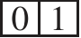

1. (a) Dạng bảng chuẩn hóa biểu diễn cho nhóm mẫu:

| Hộp (Box) | Thẻ đại diện (Tickets) |
|---|---|
| Hộp | 0, 1 |

   (b) Mẫu A (Form A), thích phẫu thuật; mẫu B (Form B), thích xạ trị.

   (c) Chỉ (ii) là đúng.

   (d) Số lượng sinh viên nhận được mẫu A là $84 + 112 = 196$; trong số này, $112 / 196 \times 100\% \approx 57\%$ nghiêng về phẫu thuật. Trong số những sinh viên nhận mẫu B, có khoảng 83% nghiêng về phẫu thuật. Sự khác biệt giữa các tỷ lệ phần trăm này là 26%, và SE vào khoảng 5.2%. Do đó $z \approx 5$, và $P \approx 0$. Sự khác biệt là rất khó để giải thích bằng biến thiên ngẫu nhiên. Cấu trúc câu hỏi rõ ràng đã gây ra thiên lệch về phía phương pháp điều trị.

2. "Phần trăm" (Percent) có nghĩa là "trên 100" (per 100), nhưng các tỷ lệ trong bài toán này nhỏ đến mức sẽ thuận tiện hơn nếu chúng ta diễn đạt chúng dưới dạng "trên 100,000". Tỷ lệ ở nhóm tiêm vắc-xin là $57 / 200,000$, tức là 28.5 trên 100,000. SE cho số ca mắc bệnh là:

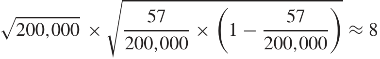

(Xem phần 4 của chương 17 để biết phương pháp tính đường tắt). Vì vậy, SE cho tỷ lệ là $8 / 200,000$ hay 4 trên 100,000. Ở nhóm nhận giả dược (placebo), tỷ lệ là 71 trên 100,000, và SE cho tỷ lệ là 6 trên 100,000. SE cho sự khác biệt giữa các tỷ lệ là:

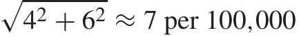

Sự khác biệt trong tỷ lệ thực tế là $28.5 - 71 = -42.5$ trên 100,000. Theo giả định của giả thuyết không, kỳ vọng về sự khác biệt trong tỷ lệ là 0. Vì vậy $z \approx -42.5 / 7 \approx -6$. Sự khác biệt trong tỷ lệ này hoàn toàn không thể được giải thích là do sự ngẫu nhiên ngẫu hứng trong quá trình phân nhóm. Vắc-xin thực sự có hiệu quả rõ rệt.

3. (a) $z \approx -2.4, P \approx 1\%$, có ý nghĩa thống kê (significant). Sự khác biệt rất khó có thể được giải thích bằng biến thiên ngẫu nhiên. Chương trình tầm soát ung thư thực sự giúp ngăn ngừa tử vong do ung thư vú.

   (b) $z \approx -1, P \approx 16\%$, không có ý nghĩa thống kê (not significant). Ung thư vú là căn bệnh hiếm gặp so với tổng thể các bệnh: do đó bạn sẽ không quan sát thấy được tác động của việc tầm soát phản ánh lên trên *tổng* tỷ lệ tử vong chung (bởi vì nó bị nhiễu bởi vô vàn các nguyên nhân tử vong khác).

4. Trong nhóm điều trị, có 6.9% số phụ nữ trải qua ít nhất một sự cố (event), so sánh với 7.1% ở trong nhóm đối chứng. Sự khác biệt là 0.2 của 1% (tức 0.2%). SE cho sự khác biệt là 0.7 của 1%. Sự khác biệt này là hoàn toàn không có ý nghĩa thống kê (vì z < 1). Sự khác biệt này có thể cực kỳ dễ dàng là do nguyên nhân ngẫu nhiên. Chế độ ăn kiêng không mang lại tác dụng bảo vệ rõ rệt.

5. Câu hỏi này không thể được trả lời từ những thông tin đã cho. Các điều tra viên không hề có hai mẫu độc lập, một mẫu trả lời câu hỏi về Vương quốc Anh và mẫu còn lại trả lời câu hỏi về nước Pháp. Vì vậy phương pháp ở ví dụ 3 (trang 507) không được áp dụng. Các điều tra viên chỉ có duy nhất một mẫu, và có tới hai phản hồi thu được trên mỗi sinh viên trong mẫu đó. Có thể biểu diễn kết quả theo dạng bảng dưới đây:

| Kết quả Anh (GB) | Kết quả Pháp (France) | Phân loại / Ý nghĩa (Meaning) |
|:---:|:---:|---|
| 1 | 1 | Tìm thấy cả Vương quốc Anh và Pháp trên bản đồ |
| 1 | 0 | Chỉ tìm thấy Vương quốc Anh |
| 0 | 1 | Chỉ tìm thấy nước Pháp |
| 0 | 0 | Không thể tìm thấy quốc gia nào |

Các nhà nghiên cứu quan sát được cả hai phản hồi khi họ chấm điểm bài kiểm tra; điều đó làm cho nó khác với thí nghiệm ở phần 4, nơi chỉ có một trong hai phản hồi có thể được quan sát. (Nói cách khác, trong thí nghiệm này, dữ liệu thu được từ mỗi người tham gia bao gồm hai trạng thái/kết quả cùng lúc, dẫn đến sự phụ thuộc lẫn nhau giữa các quan sát. Trong khi đó, ở phần 4, mỗi người chỉ đưa ra một phản hồi duy nhất, tạo ra các mẫu độc lập).

_Nhận xét._ Câu hỏi này có thể được trả lời bằng cách sử dụng các phương pháp thống kê nâng cao hơn, nếu bạn biết tỷ lệ phần trăm trong từng nhóm thuộc 4 hạng mục được liệt kê ở trên.

6. (a) Đây là một bài toán kiểm định $z$ hai mẫu (two-sample $z$-test) cơ bản, giống như trong phần 2, bởi vì có hai mẫu ngẫu nhiên đơn giản độc lập (independent simple random samples). Sai số chuẩn (SE - Standard Error) cho tỷ lệ phần trăm của năm 2005 được ước tính là $1.6\%$; SE cho năm 2000 cũng tương tự là $1.6\%$. Dựa vào quy tắc căn bậc hai (phần 1), ta tính được SE của hiệu số giữa hai tỷ lệ là $\sqrt{1.6^2 + 1.6^2} \approx 2.2\%$. Hiệu số quan sát được là $41\% - 50\% = -9\%$. Theo giả thuyết không (null hypothesis), ta kỳ vọng rằng không có sự khác biệt, tức là hiệu số kỳ vọng (expected difference) bằng $0\%$. Do đó, ta có giá trị thống kê kiểm định $z = \frac{\text{obs} - \text{exp}}{\text{SE}} = \frac{-9}{2.2} \approx -4.1$. Với giá trị $z$ này, $P$-value rất nhỏ, $P \approx \frac{2}{100,000}$. Vì $P$-value cực kỳ nhỏ, ta bác bỏ giả thuyết không. Sự khác biệt này là có thật và có ý nghĩa thống kê. Điều này cho thấy người dân đang thực sự mất niềm tin vào Tòa án Tối cao (Supreme Court).

- (b) Bạn không thể kết luận được. Phương pháp ở phần 2 không áp dụng được vì bạn không có hai mẫu độc lập (các câu trả lời đến từ cùng một nhóm người qua các năm). Phương pháp ở phần 3-4 cũng không áp dụng được vì với mỗi người, bạn quan sát tới hai phản hồi (phản hồi trong quá khứ và phản hồi hiện tại, tạo ra dữ liệu bắt cặp). Xem lại bài tập 5 ở trên.

7. (a) Sự khác biệt giữa hai tỷ lệ phần trăm của mẫu là $0.6\%$ và sai số chuẩn (SE) là khoảng $3.6\%$. Giá trị thống kê $z = 0.6 / 3.6 \approx 0.17$ rất nhỏ, cho thấy sự khác biệt này giống như một sự biến thiên ngẫu nhiên (chance variation). Việc ngừng cung cấp thực phẩm bổ sung (withholding supplementation) không có tác động gì đến việc cho con bú sữa mẹ sau này.

- (b) Sự khác biệt là $20.9 \text{ ml/ngày}$ và SE là $3.1 \text{ ml/ngày}$. Tính giá trị $z = 20.9 / 3.1 \approx 6.74$, đây là một giá trị rất lớn. Gần như không thể giải thích sự khác biệt lớn như vậy là do biến thiên ngẫu nhiên ($P$-value cực kỳ nhỏ). Các thói quen cho ăn dường như thực sự bị ảnh hưởng bởi các phương pháp điều trị khác nhau trong phòng chăm sóc trẻ sơ sinh.

- (c) Sự khác biệt là $0.9\%$ và SE là $0.14\%$. Suy ra $z = \frac{0.9}{0.14} \approx 6.4$. Tương tự như câu (b), giá trị $z$ này rất lớn, chỉ ra sự khác biệt có ý nghĩa thống kê cao. Việc ngừng cung cấp thực phẩm bổ sung thực sự làm tăng mức độ sụt cân của trẻ: đây là một tác dụng phụ xấu.

- (d) Sự khác biệt giữa trung bình của hai mẫu là $27 \text{ gram}$ và SE là khoảng $31 \text{ gram}$. Giá trị $z = \frac{27}{31} \approx 0.87$, khá nhỏ. Đây chỉ là sự biến thiên ngẫu nhiên, cho thấy không có sự khác biệt có ý nghĩa thống kê về trọng lượng sinh ban đầu giữa các nhóm. Điều này khẳng định rằng quá trình phân nhóm ngẫu nhiên (randomization) đã thành công trong việc tạo ra các nhóm có đặc điểm ban đầu tương đương nhau.

- _Nhận xét._ (i) Có một điểm dễ nhầm lẫn ở câu (c). Mức độ sụt cân của mỗi trẻ sơ sinh được đo bằng phần trăm (%) so với trọng lượng lúc sinh. Mặc dù là "phần trăm", nhưng ở đây chúng đóng vai trò là dữ liệu định lượng (quantitative data) liên tục, do đó ta có thể tính toán được giá trị trung bình (averages) và độ lệch chuẩn (SD - Standard Deviations) cho chúng, chứ không phải dữ liệu phân loại (categorical data).

(ii) Thí nghiệm này cho thấy việc ngừng cung cấp thực phẩm bổ sung không hề khuyến khích việc cho con bú sữa mẹ, mà lại gây ra một tác dụng phụ xấu là sụt cân. Các nghiên cứu quan sát (observational studies) trước đây đã rút ra kết luận sai lầm. Lời giải thích là: có một biến gây nhiễu (confounding variable) quan trọng đã bị bỏ qua. Những người mẹ có bản tính chăm sóc ân cần (nurturing mothers) thường có xu hướng cho con bú sữa mẹ ngay tại bệnh viện, và do đó trẻ của họ ít được nhận thực phẩm bổ sung hơn. Những người mẹ này cũng có xu hướng tiếp tục cho con bú sữa mẹ sau này. Do đó, trên bề mặt dữ liệu, có vẻ như tồn tại một mối tương quan âm (negative association) giữa việc cho bú bình ở bệnh viện và việc cho bú mẹ sau này. Nhưng thực chất, mối liên hệ này bị chi phối bởi một yếu tố thứ ba - đó là tính cách và thái độ chăm sóc của người mẹ (chứ không phải bản thân việc bú bình làm giảm khả năng bú mẹ).

### **Chương 28. Kiểm định Chi-Bình phương (The Chi-Square Test)**

Set A, trang 531

1. (a) 90% (b) 10% (c) 1%

2. Khoảng 10%.

_Nhận xét._ So sánh kết quả này với câu 1(c). Khi bậc tự do (degrees of freedom) tăng lên, đường cong của phân phối Chi-bình phương (Chi-square distribution) sẽ dịch chuyển sang phải và trải rộng ra hơn. Do đó, diện tích nằm dưới đường cong ở bên phải giá trị $15.09$ với 10 bậc tự do sẽ lớn hơn đáng kể so với khi chỉ có 5 bậc tự do. Hãy xem hình 1 để rõ hơn về sự thay đổi hình dạng này.

3. $\chi^2 = 13.2$, bậc tự do $d = 5$. Dựa vào bảng phân phối $\chi^2$, giá trị $P$-value nằm trong khoảng $1\% < P < 5\%$; thực tế tính toán chính xác ta được $P \approx 2.2\%$.

- _Nhận xét._ $d$ ký hiệu cho bậc tự do (degrees of freedom). Vì $P$-value khá nhỏ (nhỏ hơn mức ý nghĩa $5\%$), ta có bằng chứng để bác bỏ giả thuyết không. Điều này cho thấy dữ liệu không hoàn toàn phù hợp với mô hình dự kiến (mô hình không khớp tốt với dữ liệu quan sát).

4. $\chi^2 = 1.0$, bậc tự do $d = 5$. Dựa vào bảng phân phối, giá trị $P$-value rất lớn, nằm trong khoảng $95\% < P < 99\%$. Dữ liệu hoàn toàn khớp với mô hình dự kiến.

5. $\chi^2 = 10.0$, bậc tự do $d = 5$. Giá trị $P$-value nằm trong khoảng $5\% < P < 10\%$; thực tế $P \approx 7.5\%$. Ta chưa đủ cơ sở để bác bỏ mô hình ở mức ý nghĩa $5\%$, nhưng cũng cho thấy có một số sự khác biệt nhất định.

- _Nhận xét._ Hãy so sánh bài tập 4 và 5. Tần số quan sát được (observed frequencies) ở bài 5 chỉ đơn giản là nhân lên 10 lần so với bài 4; điều này không hề làm thay đổi cấu trúc tỷ lệ phần trăm. Tuy nhiên, kết quả của kiểm định $\chi^2$ lại bị thay đổi đáng kể ($P$-value giảm từ $>95\%$ xuống còn $\approx 7.5\%$) vì thống kê $\chi^2$ phụ thuộc vào kích thước mẫu (sample size). Với kích thước mẫu cực lớn, kiểm định $\chi^2$ có thể sẽ bác bỏ cả những mô hình vốn dĩ rất hợp lý, vì bất kỳ độ lệch cực nhỏ nào cũng có thể trở nên có ý nghĩa thống kê (statistical significance). Sẽ có thêm thảo luận về vấn đề này ở các bài tập dưới và trong chương 29.

6. $\chi^2 \approx 18.6$, bậc tự do $d = 5$, suy ra $P < 1\%$. Dù $P$-value nhỏ và kết luận thống kê là viên xúc xắc có sự thiên vị (không đồng đều 100%), nhưng trên thực tế ứng dụng thông thường, viên xúc xắc này vẫn có thể được coi là đủ công bằng (sự sai lệch nhỏ đến mức không ảnh hưởng thực tiễn). Khái niệm về sự khác biệt giữa 'ý nghĩa thống kê' và 'ý nghĩa thực tiễn' sẽ được nói thêm trong chương 29.

7. (a) Sai; kiểm định $\chi^2$ được ưu tiên sử dụng hơn trong trường hợp này vì có nhiều hơn hai nhóm phân loại, xem trang 524.

- (b) Thống kê $\chi^2$, xem trang 525.

- (c) Đúng.

- (d) Kỳ vọng (Expected); ví dụ, ở dòng đầu tiên, tần số kỳ vọng là tỷ lệ phần trăm trong dân số nhân với tổng số mẫu: $0.42 \times 66 \approx 27.7$; xem trang 524 để biết chi tiết.

- (e) Tính toán cho kiểm định $\chi^2$:

| Nhóm Tuổi | Quan sát (Observed) | Kỳ vọng (Expected) |
|---|---|---|
| 21 đến 40 | 5 | 27.7 |
| 41 đến 50 | 9 | 15.2 |
| 51 đến 60 | 19 | 10.6 |
| 61 trở lên | 33 | 12.5 |

Tính được $\chi^2 \approx 61$, với bậc tự do $d = 4 - 1 = 3$. Từ đó suy ra $P \approx 0$. 
Giải thích: Với phương pháp lấy mẫu ngẫu nhiên đơn giản, hầu như không thể có chuyện một bồi thẩm đoàn lại có sự chênh lệch lớn đến như vậy so với phân bố độ tuổi của toàn quận. Do $P$-value gần như bằng 0, ta có thể bác bỏ mạnh mẽ giả thuyết không. Kết luận rút ra là: các bồi thẩm đoàn (grand juries) này thực chất không được lựa chọn một cách ngẫu nhiên.

_Nhận xét._ 
(i) Các tần số kỳ vọng (expected frequencies) không nhất thiết phải là số nguyên (chúng đại diện cho giá trị trung bình kỳ vọng dài hạn).
(ii) Trong thực tế, các thành viên bồi thẩm đoàn được đề cử bởi các thẩm phán, và họ thường có xu hướng ưu tiên chọn những bồi thẩm viên lớn tuổi hơn (điều này giải thích nguyên nhân của sự sai lệch quan sát được).

8. Đây không phải là một phương pháp đúng. Công thức tính $\chi^2$ bắt buộc phải dựa trên tần số thực tế (số đếm - counts), chứ không được dùng tỷ lệ phần trăm (percents). Nếu dùng phần trăm, thông tin về kích thước mẫu bị mất đi, dẫn đến giá trị $\chi^2$ bị tính sai hoàn toàn. Hãy so sánh lại với bài tập 4 và 5 ở trên để thấy kích thước mẫu quan trọng như thế nào đối với giá trị thống kê.

9. (a) 12

- (b) Bạn sử dụng kiểm định $\chi^2$. Các giá trị thống kê $\chi^2$ được tính như sau: A) $15.2$, B) $26.7$, C) $7.5$, D) $16.5$. Với bậc tự do $d = 9$, các mức giới hạn là: mức $10\%$ là $14.68$, mức $5\%$ là $16.92$, và mức $1\%$ là $21.67$. Dựa vào các mốc này: 
  - **A ($15.2$)** nằm ở mức ranh giới (marginal) giữa $10\%$ và $5\%$.
  - **B ($26.7$)** lớn hơn rất nhiều so với mốc $1\%$, có sự sai lệch cực kỳ lớn.
  - **C ($7.5$)** rất nhỏ, mô hình phù hợp tốt (fine).
  - **D ($16.5$)** cũng nằm ở mức ranh giới sát với mức $5\%$.

- (c) Khi kiểm tra lại (retest), giá trị $\chi^2$ cho tập A là $14.5$ (vẫn quanh mức $10\%$), và cho tập D là $18.8$ (vượt qua mốc $5\%$). Do đó, ta quyết định bác bỏ mô hình cho tập D, và cũng có thể xem xét bác bỏ cả tập A nếu yêu cầu khắt khe.

10. (a) Kiểm định $\chi^2$ sẽ thực hiện được nhiệm vụ này vì có thể so sánh phân phối quan sát với phân phối giả thuyết kỳ vọng.

- (b) Không thể thực hiện được: cả hai hộp đều có cùng một tỷ lệ các vé số 1, số 2, v.v.; kiểm định $\chi^2$ chỉ so sánh cấu trúc tần số tổng thể nên sẽ không thể phân biệt được sự khác biệt giữa hai hộp này.

Set B, trang 534

1. Ta gom chung (pooled) kết quả bằng cách cộng các giá trị: $\chi^2_{\text{pooled}} = 13.2 + 10 = 23.2$, bậc tự do tương ứng cộng lại $d = 5 + 5 = 10$. Tra bảng với $\chi^2 = 23.2$ và $d = 10$, ta có $P \approx 1\%$. Sự kết hợp các bằng chứng độc lập lại với nhau cho thấy xác suất để kết quả này xảy ra do ngẫu nhiên là rất thấp.

2. Không được, bởi vì các thí nghiệm này phụ thuộc lẫn nhau (dependent experiments), vi phạm giả định của việc cộng dồn giá trị $\chi^2$ vốn chỉ áp dụng cho các thí nghiệm độc lập.

3. $\chi^2 \approx 0.5$, bậc tự do $d = 3$, xác suất ở đuôi bên trái (left-tail) là $P \approx 8\%$. Giá trị $\chi^2$ quá nhỏ có nghĩa là dữ liệu khớp với mô hình một cách "hoàn hảo" đến mức đáng ngờ. Dù chưa đủ cơ sở chắc chắn (inconclusive), nhưng điều này chỉ ra dấu hiệu có thể dữ liệu đã bị chỉnh sửa hoặc ngụy tạo (fudging) để khớp với kết quả mong muốn.

Set C, trang 539

1. Phương pháp này hoàn toàn ổn. Phương pháp trình bày trong sách giáo khoa là tính bằng biểu thức: $(28 / 2,237) \times 1,170$. Phương pháp trong bài tập tính bằng: $(1,170 / 2,237) \times 28$. Kết quả toán học là hoàn toàn giống nhau, bởi vì tính chất giao hoán của phép nhân: $28 \times 1,170 = 1,170 \times 28$. Cả hai cách đều tính đúng tần số kỳ vọng cho ô tương ứng trong bảng.

2. Bảng kết quả tính toán:

| Nhóm | Quan sát (Nam) | Quan sát (Nữ) | Tổng | Kỳ vọng (Nam) | Kỳ vọng (Nữ) | Hiệu số (Nam) | Hiệu số (Nữ) |
|---|---|---|---|---|---|---|---|
| **Đã bầu cử** | 2,792 | 3,591 | 6,383 | 2,730.6 | 3,652.4 | 61.4 | -61.4 |
| **Không bầu cử** | 1,486 | 2,131 | 3,617 | 1,547.4 | 2,069.6 | -61.4 | 61.4 |
| **Tổng** | **4,278** | **5,722** | **10,000** | | | | |

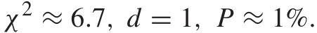

Tần số kỳ vọng (expected frequencies) được tính toán như ở trang 538: ví dụ, kỳ vọng số lượng nam giới đã đi bầu cử được tính bằng cách lấy (Tổng số nam / Tổng dân số) nhân với Tổng số người đã bầu cử: $(4,278 / 10,000) \times 6,383 \approx 2,730.6$.

_Nhận xét._ 
(i) Nhìn vào dữ liệu quan sát, có khoảng $65\%$ nam giới đã đi bầu cử ($2792/4278$), so với $63\%$ ở nữ giới ($3591/5722$). Đây là một sự khác biệt nhỏ về mặt tuyệt đối, nhưng vì kích thước mẫu rất lớn ($10,000$ người), sự khác biệt này được ước lượng với độ chính xác cao. Giá trị $P$-value trong kiểm định này chỉ cho bạn biết liệu sự khác biệt đó có thể giải thích được bằng yếu tố biến thiên ngẫu nhiên hay không, chứ không đo lường độ lớn của sự khác biệt. Vấn đề này sẽ được phân tích kỹ hơn ở chương 29. 
(ii) Một bảng chéo kích thước $2 \times 2$ có thể được xử lý bằng cả kiểm định $\chi^2$ (để kiểm tra tính độc lập) hoặc kiểm định $z$ (so sánh hai tỷ lệ phần trăm độc lập); điều này đã được ghi chú ở note 3 của chương 27.

3. Chọn phương án (iv); kiểm định $z$ không phù hợp để sử dụng ở đây bởi vì có nhiều hơn hai nhóm phân loại (multiple categories), và đồng thời giả thuyết không (null hypothesis) không chỉ định cụ thể tỷ lệ phần trăm chính xác bên trong mô hình hộp (nó chỉ phát biểu rằng các nhóm độc lập với nhau).

| Tình trạng hôn nhân | Quan sát (Nam) | Quan sát (Nữ) | Tổng | Kỳ vọng (Nam) | Kỳ vọng (Nữ) | Hiệu số (Nam) | Hiệu số (Nữ) |
|---|---|---|---|---|---|---|---|
| **Chưa từng kết hôn** | 45 | 30 | 75 | 35.9 | 39.1 | 9.1 | -9.1 |
| **Đã kết hôn** | 86 | 105 | 191 | 91.3 | 99.7 | -5.3 | 5.3 |
| **Khác** | 12 | 21 | 33 | 15.8 | 17.2 | -3.8 | 3.8 |
| **Tổng** | **143** | **156** | **299** | | | | |

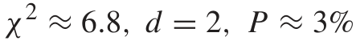

Các tần số kỳ vọng được tính toán giống như cách làm ở trang 538: ví dụ, số lượng nam giới chưa từng kết hôn kỳ vọng là (Tổng số nam / Tổng dân số) nhân với Tổng số người chưa từng kết hôn: $(143 / 299) \times 75 \approx 35.9$. 
Nhìn vào kết quả, ta thấy nhìn chung phụ nữ thường kết hôn sớm hơn nam giới. Cụ thể trong nhóm tuổi 25–34, số lượng phụ nữ đã kết hôn quan sát được ($105$) cao hơn đáng kể so với mức kỳ vọng ($99.7$). (Ở đây, "Kỳ vọng" được tính dựa trên giả thuyết không rằng nam và nữ có cùng một phân phối về tình trạng hôn nhân). Phần lớn những người chồng "dư ra" (extra husbands) để tạo thành các cặp đôi này thường nằm ở các nhóm tuổi cao hơn, chẳng hạn như 35–44.

4. Cuộc khảo sát dân số hiện tại (Current Population Survey) không phải là một mẫu ngẫu nhiên đơn giản (simple random sample). Do đó, các công thức cơ bản cho kiểm định $\chi^2$ hay $z$ sẽ không được áp dụng trực tiếp. Việc lấy mẫu theo cụm (clustering) phải được đưa vào tính toán, nếu không sẽ dẫn đến việc ước lượng sai sai số chuẩn (SE).

5. Bạn đang so sánh các giá trị trung bình (averages), vì vậy đây là lúc phải dùng kiểm định $z$ (two-sample $z$-test) chứ không phải kiểm định $\chi^2$ (kiểm định $\chi^2$ thường dùng cho dữ liệu phân loại hoặc tần số). Đồng thời, ở đây có hai mẫu độc lập, nên phương án (ii) là đúng: $z \approx \frac{\$50,000 - \$30,000}{\$3,000} \approx 6.7$. Giá trị $P \approx 0$, cho thấy sự khác biệt là rất thực tế và có ý nghĩa thống kê. Kết luận: những người tốt nghiệp đại học thực sự kiếm được nhiều tiền hơn đáng kể.

6. Bạn đang so sánh tỷ lệ phần trăm (hoặc số lượng thực tế) của một mẫu với một tiêu chuẩn ngoại lai (external standard - một giá trị cố định từ lý thuyết), vì vậy phương án (i) - kiểm định $z$ một mẫu (one-sample $z$-test) - là đúng. Giá trị kiểm định: $z \approx \frac{568 - 550}{15.7} \approx 1.15$, dẫn đến $P$-value $\approx 25\%$ (hai phía). Vì $P$-value khá lớn, không có bằng chứng để bác bỏ giả thuyết. Lý thuyết của các nhà nhân khẩu học (demographers) có vẻ hoàn toàn phù hợp với dữ liệu mẫu.

- Bạn cũng có thể giải quyết bài toán này bằng phương pháp (iii): xây dựng mô hình hộp chứa $55$ vé số "1" và $45$ vé số "0"; thực hiện $1,000$ lần rút ngẫu nhiên có hoàn lại; và sau đó tiến hành một kiểm định $\chi^2$ về mức độ phù hợp (goodness-of-fit test).

- _Nhận xét._ Khi trong hộp chỉ có hai loại vé (nghĩa là biến phân loại chỉ có 2 nhóm, ví dụ: Thành công/Thất bại), bạn có thể sử dụng kiểm định $z$ hoặc kiểm định $\chi^2$ đều được. Kiểm định $\chi^2$ (với 1 bậc tự do) sẽ luôn cho ra kết quả $P$-value giống hệt như kiểm định $z$ hai phía (two-sided $z$-test), nguyên nhân cốt lõi là do mối quan hệ toán học: $\chi^2 = z^2$.

7. Chọn phương án (iii). Việc dữ liệu được trình bày dưới dạng một bảng $2 \times 2$ không có nghĩa là bạn luôn phải thực hiện kiểm định tính độc lập (test for independence). Ở đây, ta đang kiểm tra xem dữ liệu có tuân theo một phân phối xác suất định trước hay không (đây là kiểm định mức độ phù hợp - goodness-of-fit). Kiểm định $\chi^2$ được thực hiện ở bảng dưới, và chỉ cho thấy bằng chứng rất yếu (weak evidence) chống lại giả thuyết không.

| Kết quả xúc xắc | Các mặt (Ways) | Xác suất (Chance) | Kỳ vọng (Expected) | Quan sát (Observed) |
|---|---|---|---|---|
| Chẵn, Lớn | 4, 6 | 2/6 | 200 | 183 |
| Chẵn, Nhỏ | 2 | 1/6 | 100 | 113 |
| Lẻ, Lớn | 5 | 1/6 | 100 | 88 |
| Lẻ, Nhỏ | 1, 3 | 2/6 | 200 | 216 |

Ta tính được $\chi^2 \approx 6$, với bậc tự do $d = 4 - 1 = 3$. Từ đó suy ra $P$-value $\approx 10\%$. Mức $P$-value này lớn hơn $5\%$, không đủ để kết luận viên xúc xắc có vấn đề.

### **Chương 29. Phân tích Sâu Hơn Về Các Kiểm Định Thống Kê**

Set A, trang 546

1. (a) Đúng. (b) Đúng. (Xem trang 482 để rõ lý do).
2. (a) Sai. (b) Sai. (Xem chi tiết giải thích ở trang 480–481). 

Set B, trang 550

1. (a) Khoảng 5. (b) 8. (c) Khoảng 1.

- _Nhận xét._ Giống như khi bạn tung 100 đồng xu, bạn kỳ vọng sẽ nhận được khoảng 50 lần ngửa. Ở đây, nếu giả thuyết không thực sự đúng, thì xác suất để vô tình thu được một kết quả có "ý nghĩa thống kê" (bị sai số loại I) khi xét ở mức $5\%$ chính là $5\%$. Vì vậy, nếu bạn thực hiện 100 kiểm định, bạn có thể kỳ vọng điều này sẽ vô tình xảy ra khoảng 5 lần hoàn toàn do ngẫu nhiên.

2. (a) 25
- (b) Hộp chứa các vé: 0, 0, 1, 1.
- (c) Tổng của các thứ hạng (sum of the ranks) có tính chất giống như tổng của 25 lần rút ngẫu nhiên có hoàn lại (with replacement) từ một mô hình hộp chứa các vé: 1, 2, 3, 4.

3. (a) Khoảng 3. Dựa trên giả thuyết không, số lượng lần "trúng" (hits) giống như tổng của 25 lần rút từ một hộp chứa các vé 0, 0, 0, 1. Do đó, xác suất để nhận được một kết quả "có ý nghĩa" ngẫu nhiên là khoảng $3\%$. (Xác suất này đã được cho ngay trước phần bài tập, ở trang 551).
(b) Khoảng 5.
(c) Khoảng 5.

4. Lớn hơn một chút. Bản thân kiểm định đầu tiên có khoảng $3\%$ cơ hội nhận được một kết quả "có ý nghĩa" do ngẫu nhiên; kiểm định thứ hai và thứ ba mỗi cái có khoảng $5\%$ cơ hội. Nhưng xác suất để có **ít nhất một** trong ba kiểm định tìm thấy điều gì đó có ý nghĩa sẽ là sự kết hợp của các rủi ro này, do đó chắc chắn sẽ lớn hơn $5\%$.
- _Nhận xét._ Vấn đề nguy hiểm của việc "lục lọi dữ liệu" (data snooping - liên tục thử nhiều kiểm định khác nhau trên cùng một tập dữ liệu cho đến khi tìm thấy kết quả mong muốn) là nó làm cho các mức ý nghĩa (significance levels) trở nên gần như vô nghĩa. Những người cố tình lục lọi kiểu gì cũng sẽ tìm thấy một thứ gì đó "có ý nghĩa", ngay cả khi thực tế chẳng có quy luật hay hiệu ứng nào đang diễn ra cả (tăng cao nguy cơ mắc sai lầm loại I).

5. Lại là một trường hợp của việc "lục lọi dữ liệu" (data snooping). Nếu người ta thử nghiệm đồng thời 25 giả thuyết khác nhau trên cùng một tập dữ liệu, chắc chắn theo xác suất ngẫu nhiên, một vài kết quả trong số đó sẽ tỏ ra "có ý nghĩa thống kê" (ngay cả khi giả thuyết không là đúng cho tất cả). Do đó, không thể tin tưởng mù quáng vào các kết quả được "cherry-pick" ra như vậy.

6. Kiểm định hai phía (Two-tailed test).

7. Kiểm định một phía (One-tailed test).

8. (a) Có (Yes); giá trị $P \approx 4\%$ (nhỏ hơn mức ý nghĩa $5\%$, cho thấy có sự khác biệt đáng kể).
- (b) Không (No); giá trị $P \approx 96\%$ (rất lớn, hoàn toàn là biến thiên ngẫu nhiên).
- (c) Không (No); giá trị $P \approx 8\%$ (vẫn lớn hơn mức $5\%$, mặc dù hơi gần sát ranh giới nhưng chưa đủ để kết luận).

9. Nguyên nhân là do các bác sĩ có xu hướng dễ dàng quyết định viết bài báo khoa học hơn nếu họ tình cờ gặp phải một tỷ lệ tử vong cao bất thường. Mà tỷ lệ sai lệch cao bất thường này lại rất dễ xảy ra ở những nghiên cứu có kích thước mẫu nhỏ — vì mẫu nhỏ tạo ra nhiều không gian cho những biến động ngẫu nhiên hoặc hiện tượng trùng hợp (flukes). Như tác giả Chalmers đã nói, "Các bác sĩ thường có xu hướng báo cáo những trường hợp bất thường".

Set C, trang 554

1. (a) Sai. (b) Sai. (Xem giải thích ở các trang 552–554 về ý nghĩa thực sự của P-value và tầm quan trọng của thiết kế nghiên cứu).

2. Câu hỏi này hoàn toàn hợp lý, bởi vì chúng ta đang xử lý các mẫu ngẫu nhiên đơn giản (simple random samples). Có thể trả lời câu hỏi bằng cách sử dụng kiểm định $z$ hai mẫu (two-sample $z$-test):
- Sai số chuẩn (SE) cho điểm trung bình của nam $\approx 1$, SE cho điểm trung bình của nữ $\approx 1$.
- Từ đó, sai số chuẩn cho hiệu số giữa nam và nữ được tính là $\text{SE}_{\text{diff}} \approx \sqrt{1^2 + 1^2} \approx 1.4$.
- Giá trị thống kê $z \approx \frac{\text{Hiệu số}}{1.4} \approx 1.4$.
- Tra bảng, ta tính được $P \approx 8\%$ (kiểm định một phía - one-sided).
Vì $P$-value $> 5\%$, kết luận là sự khác biệt này hoàn toàn có thể chỉ là do sự biến thiên ngẫu nhiên của mẫu (chance variation).

3. Ở trường hợp này (do kích thước mẫu tăng lên), SE cho mỗi giá trị trung bình giảm xuống còn $0.5$. Do đó, SE cho hiệu số là $\sqrt{0.5^2 + 0.5^2} \approx 0.7$. Dẫn đến giá trị $z \approx \frac{2}{0.7} \approx 2.8$, và giá trị $P$-value sụt giảm mạnh xuống chỉ còn khoảng $1/4$ của $1\%$ ($0.25\%$).
- _Nhận xét._ Mức độ ý nghĩa thống kê quan sát được (observed significance level - hay $P$-value) phụ thuộc rất lớn vào kích thước của mẫu. Với mẫu nhỏ hơn, sự khác biệt được ước lượng là $2 \pm 1.4$ điểm (độ tin cậy thấp, khoảng biên độ lỗi lớn); nhưng với mẫu lớn hơn, sự khác biệt được ước lượng chính xác hơn nhiều là $2 \pm 0.7$ điểm, do đó $P$-value cũng nhỏ đi nhanh chóng để khẳng định sự khác biệt.

4. Câu thứ hai là đúng. Tuy nhiên, cần lưu ý một điểm rất quan trọng: giả thuyết không (null hypothesis) hoàn toàn có thể bị bác bỏ mặc dù sự khác biệt quan sát được là vô cùng nhỏ nhặt và không có ý nghĩa thực tiễn (trivial difference) — miễn là kích thước mẫu cực kỳ lớn (như đã giải thích ở trang 553). Mẫu càng lớn, kiểm định càng dễ phát hiện ra những khác biệt dù là li ti.

5. Giá trị $P = 27\%$. Một nguyên tắc cơ bản: Giá trị $P$ lớn là tin tốt cho giả thuyết không (chưa có bằng chứng để bác bỏ nó), trong khi giá trị $P$ nhỏ là tin xấu cho giả thuyết không (dữ liệu có bằng chứng mạnh mẽ chống lại nó).

6. (a) Việc thực hiện kiểm định là hoàn toàn hợp lệ (legitimate). Quy trình ngẫu nhiên hóa phân bổ dữ liệu ở đây tương tự như ví dụ về so sánh phẫu thuật - xạ trị (xem phần 4 của chương 27).

- (b) Nếu $P \approx 2\%$ (đối với kiểm định một phía), tra ngược bảng phân phối chuẩn ta có được $z \approx 2$. Hiệu số quan sát được giữa hai nhóm là $71.5\% - 25\% = 46.5$ điểm phần trăm. Vì $z = \text{Hiệu số} / \text{SE}$, ta có thể suy ngược ra sai số chuẩn (SE) ắt hẳn phải nằm ở mức khoảng $46.5 / 2 \approx 23$ điểm phần trăm.

- (c) Sự khác biệt giữa $71.5\%$ và $25\%$ là một khoảng cách rất lớn.

- (d) Để hiểu giá trị $P$-value bổ sung thêm thông tin gì, hãy tưởng tượng các biên tập viên của tạp chí cố gắng bào chữa rằng:
  "Nhìn xem. Vài người phản biện của chúng tôi vốn dĩ luôn khắt khe hơn những người khác. Chỉ là do ngẫu nhiên xui xẻo (luck of the draw) nên quá nhiều người khắt khe đã được chọn để đọc phiên bản bài viết có kết quả tiêu cực."
  Giá trị $P$-value ($2\%$) cho bạn biết rằng xác suất sự xui xẻo đó xảy ra chỉ là $2\%$. Do đó, các biên tập viên không thể đưa ra lý do "rủi ro ngẫu nhiên" đó một cách nghiêm túc để biện minh được. Tuy nhiên, cần nhớ rằng $P$-value KHÔNG trực tiếp giúp bạn so sánh hay định lượng độ lớn của sự khác biệt giữa con số $71.5\%$ và $25\%$.

- (e) Nghiên cứu này là một minh chứng rõ ràng cho thiên kiến xuất bản (publication bias). Các chuyên gia phản biện thường có xu hướng dễ dàng bới móc và tìm ra lỗi sai hơn trong các bài báo có kết luận mà họ không đồng tình — điều này vốn dĩ là bản tính tự nhiên của con người (confirmation bias).

_Nhận xét._ Hiệu số quan sát được lên đến 46 điểm phần trăm. Tuy nhiên, SE lại gán một mức độ dao động (give-or-take) rất lớn là 23 điểm phần trăm cho ước lượng đó ($46 \pm 23$). Điều này có nghĩa: mặc dù sự khác biệt là lớn, nhưng việc ước lượng lại cực kỳ thiếu chính xác (poorly estimated). (Để có độ chính xác cao hơn, cần phải có một mẫu lớn hơn nhiều; thế nhưng điều này lại rất khó thực hiện vì tổng số các chuyên gia phản biện trong ngành là có hạn). Tuy nhiên, giá trị $P$-value nhỏ đã giúp củng cố thêm rằng: dù ước lượng có thiếu chính xác, thì mức chênh lệch lớn thế này vẫn rất khó để bị gạt đi như một sự biến thiên ngẫu nhiên (chance variation).

7. Giá trị $P$-value tuyệt đối không đo lường độ lớn của sự khác biệt hay mức độ tác động. Do đó, không có cách nào để chỉ nhìn vào $P$-value mà kết luận rằng một tác động là yếu hay mạnh. Yếu tố quyết định giá trị $P$ là tỷ lệ giữa độ lớn của hiệu số so với sai số chuẩn (SE), tức là nó phụ thuộc vào cả kích thước mẫu. Một hiệu ứng cực kỳ nhỏ (nhưng vô nghĩa thực tiễn) vẫn có thể có $P$-value rất bé nếu kích thước mẫu đủ lớn.

8. Khoảng tin cậy $99\%$ được tính bằng giá trị ước lượng $\pm\ 2.6 \times \text{SEs}$, trong trường hợp này là $-6.0 \pm (2.6 \times 2.5) = -6 \pm 6.5$. Biên độ dao động từ $+0.5$ đến $-12.5$ cho thấy ước lượng này không hề chính xác (khoảng tin cậy quá rộng). Mặc dù $P$-value cho thấy độ co giãn (elasticity) không hoàn toàn bằng 0, nhưng thực tế vốn dĩ chẳng có ai nghĩ rằng nó bằng 0 tuyệt đối cả. Việc lạm dụng các kiểm định thống kê trong trường hợp này có vẻ rất đáng ngờ (questionable), và tính hợp lý của cả mô hình (model) cũng vậy.

### Set D, trang 558

1. Ở đây không hề có các mẫu xác suất (probability samples - dữ liệu không được lấy mẫu ngẫu nhiên từ một quần thể lớn hơn), vì vậy cần phải hết sức thận trọng khi đưa ra kết luận tổng quát. Dù sao thì, đánh giá trên dữ liệu hiện tại, các sinh viên (students) đã làm khá tốt khi so sánh với các trợ giảng (TAs).

2. Khái niệm "ý nghĩa thống kê" (statistical significance) hoàn toàn không có nghĩa lý gì ở đây. Hai hành tinh vòng trong không phải là một mẫu ngẫu nhiên có kích thước 2 được rút ra từ "quần thể các hành tinh vòng trong". Bản thân chúng **chính là** toàn bộ các hành tinh vòng trong của hệ mặt trời. Tương tự như vậy cho các hành tinh vòng ngoài. Khi ta đã có dữ liệu của toàn bộ quần thể (population), không có sai số lấy mẫu ngẫu nhiên, thì việc làm kiểm định suy diễn thống kê là hoàn toàn sai lầm.

3. Việc áp dụng một kiểm định ý nghĩa thống kê ở đây là không phù hợp, trừ khi ta có thể xây dựng và mô tả rõ ràng một mô hình hộp (box model - mô hình biểu diễn cơ chế ngẫu nhiên) sinh ra dữ liệu này.

4. Việc đặt câu hỏi ở đây là hợp lý vì chúng ta đang làm việc với một mẫu xác suất. Tuy nhiên, nó không thể được trả lời dứt khoát dựa trên những thông tin được cung cấp. Đây là trường hợp của việc lấy mẫu theo cụm (cluster sample), do đó, các công thức toán học cơ bản vốn dành cho lấy mẫu ngẫu nhiên đơn giản (simple random sample) sẽ không được phép áp dụng. (Lý do chi tiết xem phần 4 của chương 21 và phần 5 của chương 22).

- _Nhận xét._ Trong nghiên cứu này, cũng tương tự như nhiều nghiên cứu khác, hiệu suất làm bài kiểm tra trí thông minh (IQ) của trẻ em có xu hướng tăng lên đồng biến với mức thu nhập của gia đình.

5. Kích thước mẫu (sample size) quá lớn đến mức ngay cả những khác biệt li ti vô nghĩa về mặt thực tiễn cũng rất dễ trở nên có "ý nghĩa thống kê" cực cao ($P$-value rất nhỏ). 
- _Nhận xét._ Các quy trình tính toán thống kê được sử dụng trong nghiên cứu này cũng có thể chứa nhiều vấn đề đáng bàn cãi (open to question).

6. Một kiểm định ý nghĩa đang bị áp dụng sai bối cảnh lên dữ liệu của toàn bộ quần thể (whole population) - ở đây là nhóm "giới tinh hoa" (elites). Vì không có quá trình lấy mẫu ngẫu nhiên, việc cố gắng áp dụng một mô hình hộp ngẫu nhiên (box model) để giải thích dữ liệu này là hoàn toàn vô nghĩa.

### Set E, trang 561

1. Trong nghiên cứu này, tỷ lệ vắng mặt (absenteeism) được so sánh với tỷ lệ của các năm trước. Nhưng việc so sánh theo thời gian như vậy rất rủi ro vì năm nay có thể có nhiều yếu tố ngoại cảnh khác với năm ngoái (ví dụ: thời tiết ôn hòa hơn, công việc thú vị hơn, hoặc ít dịch bệnh hơn v.v.). Một phương pháp thiết kế tốt hơn là so sánh tỷ lệ vắng mặt giữa những công nhân được áp dụng lịch làm việc linh hoạt (flex-time) với một nhóm đối chứng cùng thời điểm (contemporary controls). Để tránh gây ra sự bất mãn hoặc ghen tị cho những người không được áp dụng giờ làm linh hoạt, chiến lược tốt nhất là tiến hành phân bổ ngẫu nhiên theo cấp độ "toàn bộ đơn vị làm việc" (whole work units) vào nhóm thử nghiệm hoặc nhóm đối chứng, thay vì phân bổ từng cá nhân.

2. Thí nghiệm này được thiết kế cực kỳ tốt (có nhóm đối chứng ngẫu nhiên, làm mù đôi). Rất công bằng và có cơ sở khoa học để kết luận rằng vaccine thực sự đã bảo vệ trẻ em khỏi bệnh bại liệt (polio). Các cách giải thích khác cho sự suy giảm bệnh tật (chẳng hạn như hiệu ứng giả dược - placebo effect hoặc thiên lệch quan sát) đều đã bị loại trừ nhờ vào thiết kế chặt chẽ của thí nghiệm.

3. Không. Giá trị $P$-value ở đây chỉ cho bạn biết rằng: sự gia tăng tỷ lệ mắc bệnh không phải là một sự ngẫu nhiên xui xẻo (fluke) trong quá trình phân bổ động vật vào nhóm thử nghiệm hay nhóm đối chứng. $P$-value hoàn toàn KHÔNG có chức năng giúp bạn ngoại suy (extrapolate) hậu quả sinh học từ việc dùng liều lượng cao trên chuột sang việc dùng liều lượng thấp trên cơ thể con người. Việc suy luận như vậy đòi hỏi các mô hình sinh học, không phải thống kê.

4. Mô hình thống kê (model) nằm ở đâu? Tại sao chỉ dựa vào việc mức lương thấp hơn lại có thể kết luận chắc chắn đó là bằng chứng của sự phân biệt đối xử (discrimination)? (Để đánh giá đúng, bạn bắt buộc phải kiểm soát các biến số gây nhiễu khác như số năm kinh nghiệm, trình độ học vấn, năng suất làm việc, v.v.). Thêm vào đó, nếu vị chuyên gia này vẫn khăng khăng đòi thực hiện một kiểm định thống kê, thì phương pháp của họ cũng sai vì các cặp quan sát (pairs) này phụ thuộc vào nhau rất nhiều (highly dependent) — ví dụ, có thể có một người đàn ông được trả lương rất cao nhưng lại xuất hiện lặp lại trong 16 cặp so sánh khác nhau, làm sai lệch toàn bộ giả định độc lập của kiểm định.

