   # 10 

## Hồi quy (Regression) 

_Đôi khi bạn phải vạch ra một đường ranh giới._ 

#### 1. GIỚI THIỆU 

Phương pháp hồi quy mô tả cách một biến phụ thuộc vào một biến khác. Ví dụ, hãy xét đến chiều cao và cân nặng. Chúng ta có dữ liệu của 471 nam giới trong độ tuổi từ 18–24 (từ Khảo sát Khám Sức khỏe và Dinh dưỡng — HANES5; xem trang 58). Nói một cách làm tròn, chiều cao trung bình của những người đàn ông này là 70 inch, và cân nặng trung bình tổng thể của họ là 180 pound. Đương nhiên, những người đàn ông cao hơn sẽ nặng hơn. Sự gia tăng bao nhiêu cân nặng thì tương ứng với sự gia tăng một đơn vị chiều cao? Để bắt đầu, hãy xem biểu đồ phân tán (scatter diagram) (Hình 1 ở trang tiếp theo). Chiều cao được biểu diễn trên trục hoành (trục ngang) và cân nặng trên trục tung (trục dọc). Các thống kê tóm tắt là:1 

chiều cao trung bình ≈ 70 inch, độ lệch chuẩn (SD) ≈ 3 inch; cân nặng trung bình ≈ 180 pound, độ lệch chuẩn (SD) ≈ 45 pound; _, r_ ≈ 0,40 

Tỷ lệ trên trục tung và trục hoành đã được chọn sao cho một SD của chiều cao và một SD của cân nặng có cùng một khoảng cách hiển thị trên trang. Điều này làm cho đường SD (đường đứt nét) dốc lên một góc 45 độ ngang qua trang. Có khá nhiều sự phân tán xung quanh đường này: hệ số tương quan _r_ chỉ là 0,40. 

Dải dọc trong Hình 1 cho thấy những người đàn ông có chiều cao cao hơn mức trung bình một SD (làm tròn đến inch gần nhất). Những người đàn ông đồng thời có cân nặng cao hơn mức trung bình một SD sẽ được biểu diễn nằm trên đường SD. Tuy nhiên, hầu hết các điểm trong dải dọc này đều nằm thấp hơn nhiều so với đường SD. Nói cách khác, hầu hết những người đàn ông có chiều cao cao hơn mức trung bình một SD lại có mức cân nặng kém khá xa so với mốc một SD trên mức trung bình về 

Hình 1. Biểu đồ phân tán (Scatter diagram). Mỗi điểm hiển thị chiều cao và cân nặng của một trong số 471 nam giới độ tuổi 18–24 trong khảo sát HANES5. Dải dọc đại diện cho những người đàn ông có chiều cao cao hơn mức trung bình khoảng một SD. Những người đồng thời có cân nặng cao hơn mức trung bình một SD sẽ được biểu diễn dọc theo đường SD (đường đứt nét). Hầu hết những người đàn ông trong dải dọc này đều nằm dưới đường SD: cân nặng của họ chỉ cao hơn mức trung bình tổng thể một phần nhỏ của một SD. Đường hồi quy (regression line) nét liền ước tính cân nặng trung bình tại mỗi mức chiều cao. 

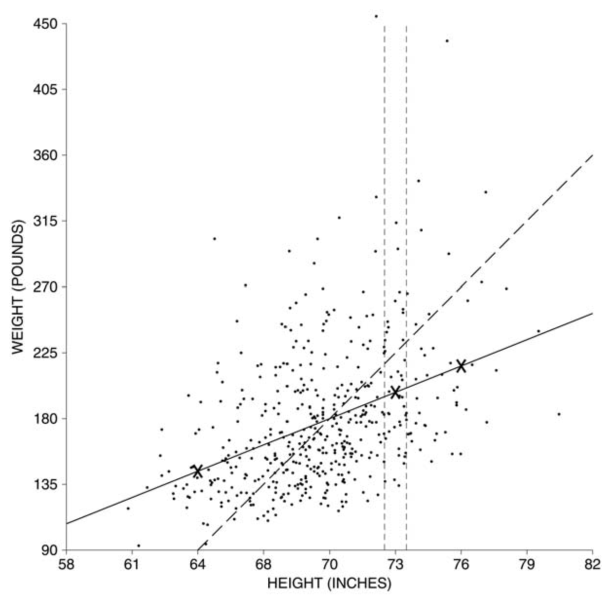

cân nặng. Cân nặng trung bình của những người đàn ông này chỉ cao hơn mức trung bình tổng thể một phần của một SD. Đây là lúc hệ số tương quan 0,40 thể hiện vai trò. Trung bình, gắn với mức tăng một SD về chiều cao thì cân nặng chỉ tăng 0,40 SD. 

Cụ thể hơn, hãy lấy những người đàn ông có chiều cao cao hơn mức trung bình một SD: 

chiều cao trung bình + SD của chiều cao = 70 inch + 3 inch = 73 inch. 

Cân nặng trung bình của họ sẽ cao hơn mức trung bình tổng thể là 0,40 SD của cân nặng. Đổi ngược lại sang đơn vị pound, ta có 

0,40 × 45 lb = 18 lb. 

Vì vậy, cân nặng trung bình của những người đàn ông này là khoảng 

180 lb + 18 lb = 198 lb. 

Điểm (73 inch, 198 pound) được đánh dấu bằng một dấu chéo trong Hình 1. 

Còn những người đàn ông có chiều cao cao hơn mức trung bình 2 SD thì sao? Lúc này: 

chiều cao trung bình + 2 SD của chiều cao = 70 inch + 2 × 3 inch = 76 inch. 

Cân nặng trung bình của nhóm nam giới thứ hai này sẽ cao hơn mức trung bình tổng thể là 0,40 × 2 = 0,80 SD của cân nặng. Nghĩa là 0,80 × 45 lb = 36 lb. Vì vậy, cân nặng trung bình của họ là khoảng 180 lb + 36 lb = 216 lb. Điểm (76 inch, 216 pound) cũng được đánh dấu bằng một dấu chéo trong Hình 1. 

Thế còn những người đàn ông có chiều cao thấp hơn mức trung bình 2 SD thì sao? Chiều cao của họ bằng: 

chiều cao trung bình − 2 SD của chiều cao = 70 inch − 2 × 3 inch = 64 inch. 

Cân nặng trung bình của họ thấp hơn mức trung bình tổng thể là 0,40 × 2 = 0,80 SD của cân nặng. Nghĩa là 0,80 × 45 lb = 36 lb. Cân nặng trung bình của nhóm thứ ba này là khoảng 180 lb − 36 lb = 144 lb. Điểm (64 inch, 144 pound) được đánh dấu bằng dấu chéo thứ ba trong Hình 1. 

Tất cả các điểm (chiều cao, ước tính cho cân nặng trung bình) đều nằm trên đường nét liền được thể hiện trong Hình 1. Đây là _đường hồi quy_ (regression line). Đường này đi qua điểm trung bình: những người đàn ông có chiều cao trung bình thì cũng nên có cân nặng trung bình. 

Đường hồi quy của _y_ theo _x_ ước tính giá trị trung bình của _y_ tương ứng với mỗi giá trị của _x_ . 

Dọc theo đường hồi quy, gắn với mỗi mức tăng một SD về chiều cao thì chỉ có mức tăng 0,40 SD về cân nặng. Cụ thể hơn, hãy tưởng tượng việc phân nhóm những người đàn ông theo chiều cao. Có một nhóm có chiều cao trung bình, một nhóm khác có chiều cao cao hơn mức trung bình một SD, và cứ tiếp tục như vậy. Từ nhóm này sang nhóm tiếp theo, cân nặng trung bình cũng tăng lên, nhưng chỉ tăng khoảng 0,40 SD. Hãy nhớ lại con số 0,40 đến từ đâu. Đó chính là hệ số tương quan giữa chiều cao và cân nặng. 

Cách sử dụng hệ số tương quan để ước tính giá trị trung bình của _y_ cho từng giá trị của _x_ được gọi là _phương pháp hồi quy_ (regression method). Phương pháp này có thể được phát biểu như sau. 

Trung bình, gắn với mỗi mức tăng một SD của _x_ thì chỉ có mức tăng là _r_ SD của _y_. 

Có hai loại độ lệch chuẩn (SD) khác nhau được sử dụng ở đây: SD của _x_, để đo lường các thay đổi trong _x_; và SD của _y_, để đo lường các thay đổi trong _y_. Chúng ta rất dễ bị nhầm lẫn và cuốn theo quy luật kiểu như: nếu _x_ tăng lên một SD, thì _y_ cũng vậy. Nhưng điều đó là sai. Trung bình, _y_ chỉ tăng thêm _r_ SD (Hình 2, trang tiếp theo). 

Tại sao _r_ lại là hệ số thích hợp? Có ba trường hợp dễ dàng thấy được trực tiếp. Thứ nhất, giả sử _r_ là 0. Khi đó không có sự liên hệ nào giữa _x_ và _y_. Vì vậy, một mức tăng một SD trong _x_ sẽ đi kèm với mức tăng 0 SD trong _y_ trên mức trung bình. Thứ hai, giả sử _r_ là 1. Khi đó tất cả các điểm đều nằm trên đường SD: một mức tăng một SD trong _x_ sẽ đi kèm với mức tăng một SD trong _y_. Thứ ba, giả sử _r_ là −1. Lập luận cũng tương tự, ngoại trừ việc 

Hình 2. Phương pháp hồi quy. Khi _x_ tăng lên một SD, giá trị trung bình của _y_ chỉ tăng lên _r_ SD. 

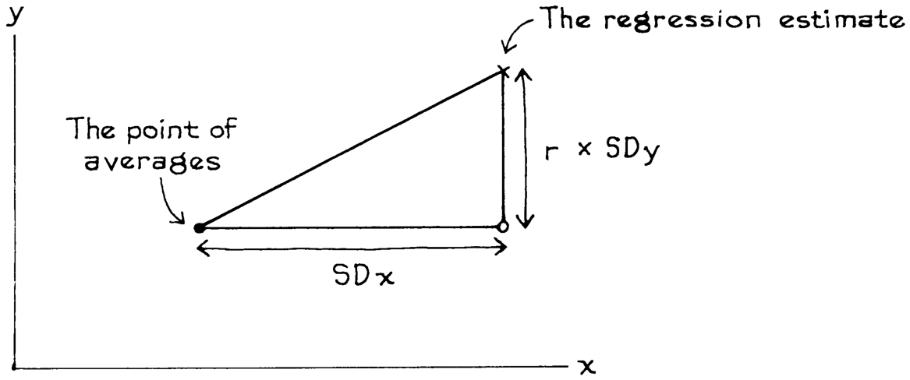

đường thẳng dốc xuống. Với các giá trị _r_ nằm ở giữa các khoảng này, chúng ta cần một lập luận toán học phức tạp — nhưng _r_ chính là hệ số được sử dụng. 

### Bài tập nhóm A (Exercise Set A) 

1. Trong một lớp học nọ, điểm thi giữa kỳ trung bình là 60 với SD là 15, và điểm thi cuối kỳ cũng tương tự (trung bình 60, SD 15). Hệ số tương quan giữa điểm thi giữa kỳ và điểm thi cuối kỳ là khoảng 0,50. Hãy ước tính điểm thi cuối kỳ trung bình cho những sinh viên có điểm thi giữa kỳ là: 

(a) 75 (b) 30 (c) 60 

Vẽ biểu đồ các ước lượng hồi quy của bạn, tương tự như trong Hình 1. 

2. Đối với nam giới từ 18 tuổi trở lên trong khảo sát HANES5, 

chiều cao trung bình ≈ 69 inch, SD ≈ 3 inch; cân nặng trung bình ≈ 190 pound, SD ≈ 42 pound; _, r_ ≈ 0,41. Hãy ước tính cân nặng trung bình của những người đàn ông có chiều cao là: (a) 69 inch (b) 66 inch (c) 24 inch (d) 0 inch. Hãy đưa ra nhận xét về câu trả lời của bạn cho (c) và (d). 

3. Nam giới độ tuổi 45–74 trong HANES5 có chiều cao trung bình là 69 inch, bằng với chiều cao trung bình tổng thể (bài tập 2). Đúng hay sai, và hãy giải thích: cân nặng trung bình của họ sẽ vào khoảng 190 pound, vì đó là mức cân nặng trung bình tổng thể. 

4. Đối với phụ nữ độ tuổi 25–34 ở Hoa Kỳ năm 2005 có việc làm toàn thời gian, mối quan hệ giữa học vấn (số năm đi học đã hoàn thành) và thu nhập cá nhân có thể được tóm tắt như sau:2 

học vấn trung bình ≈ 14 năm, SD ≈ 2,4 năm; thu nhập trung bình ≈ $32.000, SD ≈ $26.000, _r_ ≈ 0,34 

Hãy ước tính thu nhập trung bình của những phụ nữ đã học xong trung học nhưng chưa học lên đại học (tức là họ có 12 năm đi học). 

5. Giả sử _r_ = −1. Bạn có thể giải thích tại sao mức tăng một SD trong _x_ lại đi kèm với mức giảm một SD trong _y_ không? 

_Đáp án cho các bài tập này nằm ở trang A59–60._ 

#### 2. ĐỒ THỊ CỦA CÁC GIÁ TRỊ TRUNG BÌNH (THE GRAPH OF AVERAGES) 

Hình 3 là _đồ thị của các giá trị trung bình_ (graph of averages) đối với chiều cao và cân nặng của nam giới độ tuổi 18–24 trong mẫu HANES5.3 Đồ thị này biểu diễn cân nặng trung bình của nam giới tại mỗi mức chiều cao, và gần giống với một đường thẳng ở phần giữa — nơi tập trung hầu hết mọi người. Nhưng ở hai đầu, đồ thị khá gập ghềnh. Chẳng hạn, những người đàn ông cao 78 inch (làm tròn đến inch gần nhất) có cân nặng trung bình là 241 pound. Điều này được biểu diễn bằng điểm (78 inch, 241 pound) trong hình. Những người đàn ông cao 80 inch có cân nặng trung bình là 211 pound. Mức này thấp hơn đáng kể so với mức trung bình của những người cao 78 inch. Những người đàn ông cao hơn lại nặng ít hơn những người thấp hơn. Sự biến thiên ngẫu nhiên (chance variation) đang đóng vai trò ở đây. Những người đàn ông này được chọn ngẫu nhiên cho mẫu. Nhờ vào sự may rủi, những người cao 78 inch quá nặng, trong khi những người cao 80 inch lại không đủ nặng. Tất nhiên, chỉ có 2 người trong mỗi nhóm, như được chỉ ra bởi các con số nhỏ bên trên hoặc bên dưới các điểm chấm. Đường hồi quy sẽ làm phẳng đi (smooth away) loại biến thiên ngẫu nhiên này. 

Đường hồi quy là một phiên bản được làm phẳng của đồ thị các giá trị trung bình. Nếu đồ thị các giá trị trung bình tuân theo một đường thẳng, thì đường thẳng đó chính là đường hồi quy. 

Hình 3. Đồ thị của các giá trị trung bình. Cho thấy cân nặng trung bình ở từng mức chiều cao đối với 471 nam giới trong độ tuổi 18–24 thuộc mẫu HANES5. Đường hồi quy làm phẳng đồ thị này. 

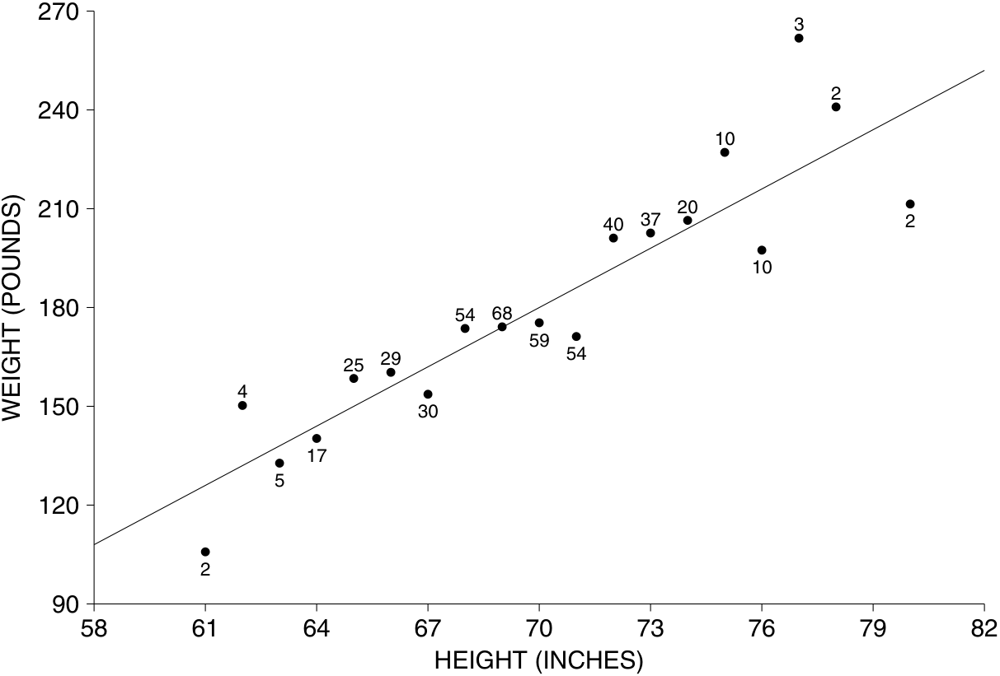

Trong một số trường hợp, đường hồi quy (regression line) làm mượt (smooths away) dữ liệu quá mức. Nếu có một mối liên hệ phi tuyến (non-linear association) giữa hai biến số, như trong Hình 4 ở trang tiếp theo, đường hồi quy sẽ đi chệch khỏi xu hướng thực tế của dữ liệu. Khi đó, tốt hơn hết là sử dụng đồ thị của các giá trị trung bình (graph of averages). (Tính phi tuyến tính đã được đề cập khi bàn về hệ số tương quan ở mục 3 của chương 9; bạn cũng có thể xem trang 59 và 61 để thấy các dữ liệu mà đồ thị của các giá trị trung bình có dạng phi tuyến). 

ĐỒ THỊ CỦA CÁC GIÁ TRỊ TRUNG BÌNH (THE GRAPH OF AVERAGES) 163 

Hình 4. Mối liên hệ phi tuyến. Không nên sử dụng các đường hồi quy khi có một mối liên hệ phi tuyến giữa các biến số. 

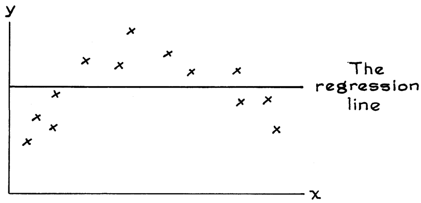

### Bài tập phần B 

1. Hình dưới đây được dựa trên một mẫu đại diện gồm các cặp vợ chồng ở New York. Biểu đồ thể hiện thu nhập trung bình của người vợ, dựa trên mức thu nhập của người chồng. Với 102 cặp vợ chồng, thu nhập của người chồng nằm trong khoảng $1–$5,000; đối với những cặp này, thu nhập của người vợ trung bình là $15,390, như được biểu diễn bởi điểm ($2,500, $15,390). Với 58 cặp vợ chồng, thu nhập của người chồng nằm trong khoảng $5,001–$10,000; đối với những cặp này, thu nhập của người vợ trung bình là $18,645, như được biểu diễn bởi điểm ($7,500, $18,645). Và tiếp tục như vậy. Đường hồi quy cũng được vẽ trên đồ thị.4 

   - (a) Đúng hay sai: có một mối liên hệ đồng biến (positive association) giữa thu nhập của chồng và thu nhập của vợ. Nếu đúng, bạn sẽ giải thích mối liên hệ này như thế nào? 

   - (b) Tại sao điểm ở mức $127,500 lại nằm xa bên dưới đường hồi quy đến vậy? 

   - (c) Nếu bạn sử dụng đường hồi quy để ước lượng thu nhập của vợ từ thu nhập của chồng, các ước lượng của bạn thường sẽ hơi cao quá, hơi thấp quá, hay gần chính xác — đối với các cặp vợ chồng trong mẫu có thu nhập của chồng nằm trong khoảng $65,000–$80,000? 

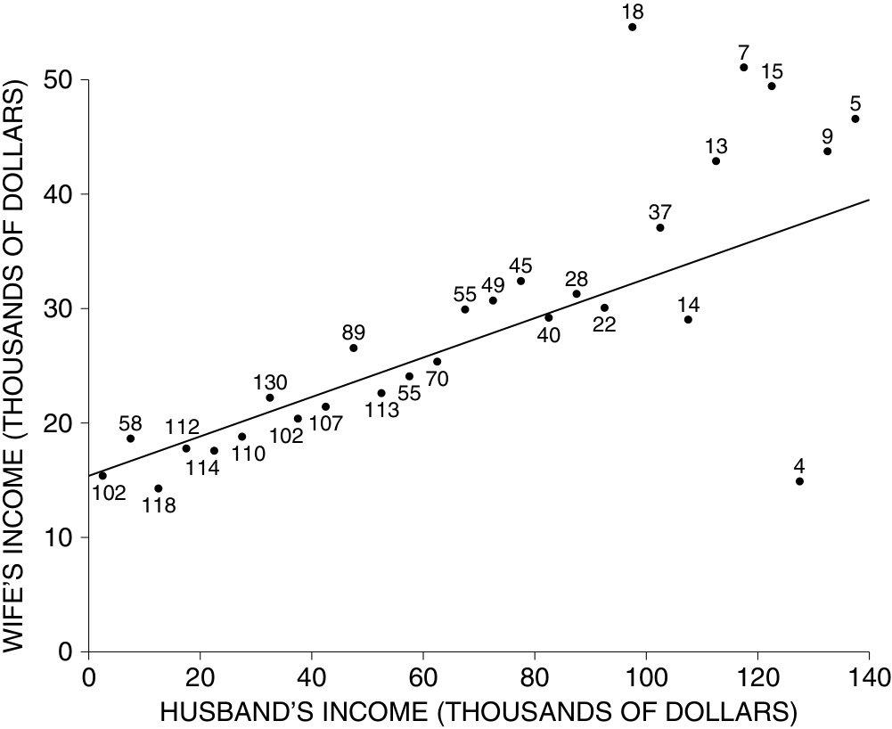

Nguồn: Khảo sát Dân số Hiện tại tháng 3 năm 2005 (March 2005 Current Population Survey); CD-ROM do Cục Điều tra Dân số (Bureau of the Census) cung cấp. 

2. Vẽ lại biểu đồ dưới đây lên một tờ giấy, và đánh dấu chéo (cross) tại điểm trung bình cho mỗi dải dọc (vertical strips); một dải đã được làm mẫu. Sau đó vẽ đường hồi quy của _y_ theo _x_ . (Đường SD được vẽ nét đứt). 

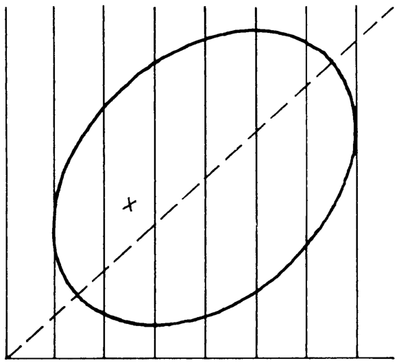

3. Dưới đây là bốn biểu đồ phân tán (scatter diagrams), mỗi biểu đồ có một đường nét liền và một đường nét đứt. Với mỗi biểu đồ, hãy cho biết đường nào là đường SD (SD line) và đường nào là đường hồi quy của _y_ theo _x_ . 

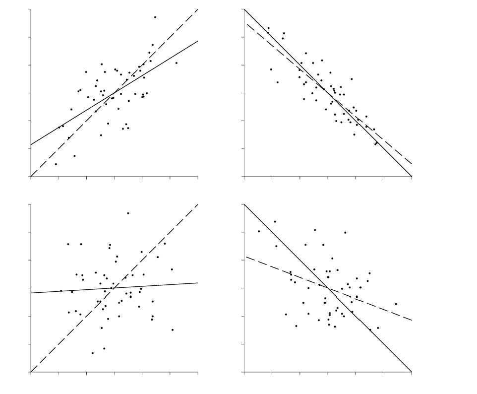

4. Ở phần đầu trang tiếp theo là một số tập dữ liệu giả định. Với mỗi tập, hãy vẽ biểu đồ phân tán, vẽ đồ thị của các giá trị trung bình (graph of averages), và vẽ đường hồi quy của _y_ theo _x_ . Vui lòng không thực hiện bất kỳ tính toán nào: hãy đưa ra dự đoán tốt nhất của bạn. 

PHƯƠNG PHÁP HỒI QUY DÀNH CHO CÁC CÁ THỂ (THE REGRESSION METHOD FOR INDIVIDUALS) 

|(|a)|(|b)|(c|)|(d|)|
|---|---|---|---|---|---|---|---|
|_x_|_y_|_x_|_y_|_x_|_y_|_x_|_y_|
|1|0|0|0|0|0|0|2|
|1|6|0|2|1|1|1|3|
|2|5|1|2|2|4|2|0|
|3|6|||||2|4|
|3|8|||||3|1|
|||||||4|2|

_Đáp án cho các bài tập này nằm ở trang A61–62._ 

_Ghi chú kỹ thuật (Technical note)._ Nhìn chung, đường hồi quy được khớp (fitted) vào đồ thị của các giá trị trung bình (graph of averages), với mỗi điểm được gán trọng số dựa trên số lượng các trường hợp mà nó đại diện, trùng khớp với đường hồi quy được khớp vào biểu đồ phân tán ban đầu. Điều này chính xác hoàn toàn khi các điểm có tọa độ _x_ khác nhau được giữ riêng biệt trong đồ thị của các giá trị trung bình; nếu không, đó là một phép xấp xỉ tốt (good approximation). 

#### 3. PHƯƠNG PHÁP HỒI QUY DÀNH CHO CÁC CÁ THỂ (THE REGRESSION METHOD FOR INDIVIDUALS) 

Đối với nam giới trong độ tuổi 18–24 ở khảo sát HANES5, mối quan hệ giữa chiều cao và cân nặng có thể được tóm tắt như sau: 

chiều cao trung bình ≈ 70 inches, SD ≈ 3 inches 
cân nặng trung bình ≈ 180 pounds, SD ≈ 45 pounds 
_, r_ ≈ 0.40 

Giả sử một trong số những người đàn ông này được chọn ngẫu nhiên, và bạn phải đoán cân nặng của anh ấy mà không được biết thêm thông tin gì. Dự đoán tốt nhất là mức cân nặng trung bình tổng thể (overall average weight), 180 pounds. Tiếp theo, bạn được cho biết chiều cao của người đàn ông này: ví dụ, 73 inches. Người đàn ông này cao, và nhiều khả năng sẽ nặng hơn mức trung bình. Dự đoán tốt nhất của bạn cho cân nặng của anh ấy là mức cân nặng trung bình của tất cả những người đàn ông cao 73 inches trong nghiên cứu. Mức trung bình mới này có thể được ước lượng bằng phương pháp hồi quy, kết quả là 198 pounds (trang 159). Quy tắc là: nếu bạn phải dự đoán một biến dựa trên một biến khác, hãy sử dụng mức trung bình mới. Trong nhiều trường hợp, phương pháp hồi quy cung cấp một cách hợp lý để ước lượng mức trung bình mới này. Tất nhiên, nếu có một mối liên hệ phi tuyến (non-linear association) giữa các biến, phương pháp hồi quy sẽ không thể áp dụng được. 

_Ví dụ 1._ Một trường đại học đã thực hiện một phân tích thống kê về mối liên hệ giữa điểm Toán SAT (Math SAT scores, dao động từ 200 đến 800) và điểm trung bình năm nhất GPA (first-year GPAs, dao động từ 0 đến 4.0), cho các sinh viên hoàn thành năm thứ nhất. Kết quả là: 

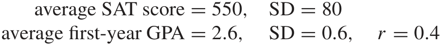

Biểu đồ phân tán có dạng hình quả bóng bầu dục (football-shaped). Một sinh viên được chọn ngẫu nhiên, và có điểm SAT là 650. Hãy dự đoán điểm GPA năm nhất của cá nhân này. 

_Cách giải (Solution)._ Sinh viên này có điểm SAT cao hơn mức trung bình 100 / 80 = 1.25 độ lệch chuẩn (SDs). Ước lượng hồi quy (regression estimate) cho điểm GPA năm nhất là cao hơn mức trung bình 0.4 × 1.25 = 0.5 SDs. Tức là 0.5 × 0.6 = 0.3 điểm GPA. Điểm GPA được dự đoán là 2.6 + 0.3 = 2.9. 

166 HỒI QUY (REGRESSION) 

Logic ở đây là: đối với tất cả các sinh viên có điểm SAT vào khoảng 650, điểm GPA năm nhất trung bình là khoảng 2.9, theo phương pháp hồi quy. Đó là lý do tại sao chúng ta dự đoán điểm GPA năm nhất là 2.9 cho cá nhân này. 

Thông thường, các nhà nghiên cứu tính toán các ước lượng hồi quy từ một nghiên cứu, và sau đó ngoại suy (extrapolate): họ sử dụng các ước lượng đó cho các đối tượng mới. Trong nhiều trường hợp, điều này là hợp lý, với điều kiện các đối tượng trong khảo sát mang tính đại diện (representative) cho những người mà ta muốn đưa ra suy luận về họ. Nhưng bạn phải xem xét kỹ lưỡng vấn đề này trong từng trường hợp. Cơ sở toán học của phương pháp hồi quy sẽ không thể bảo vệ bạn nếu dữ liệu không phù hợp. Trong ví dụ 1, trường đại học chỉ có kinh nghiệm với những sinh viên mà họ nhận vào. Có thể sẽ nảy sinh vấn đề khi sử dụng quy trình hồi quy đối với những sinh viên khá khác biệt so với nhóm đó. (Các cán bộ tuyển sinh thường làm việc ngoại suy, từ những sinh viên được nhận suy ra cho những sinh viên bị từ chối nhập học.) 

Bây giờ, một cách sử dụng khác của phương pháp hồi quy — để dự đoán _thứ hạng bách phân vị (percentile ranks)_. Nếu thứ hạng bách phân vị của bạn trong một bài kiểm tra là 90%, bạn đã làm rất tốt: chỉ có 10% lớp đạt điểm cao hơn, 90% còn lại đạt điểm thấp hơn. Thứ hạng bách phân vị là 25% thì không tốt lắm: 75% lớp đạt điểm cao hơn, 25% còn lại đạt điểm thấp hơn (trang 91). 

_Ví dụ 2._ (Tiếp tục ví dụ 1.) Giả sử thứ hạng bách phân vị của một sinh viên trong kỳ thi SAT là 90%, tính trong số các sinh viên năm nhất. Hãy dự đoán thứ hạng bách phân vị của sinh viên này về điểm GPA năm nhất. Biểu đồ phân tán có dạng hình quả bóng bầu dục (football-shaped). Đặc biệt, điểm SAT và điểm GPA tuân theo đường cong phân phối chuẩn (normal curve). 

_Cách giải (Solution)._ Chúng ta sẽ sử dụng phương pháp hồi quy. Sinh viên này có điểm SAT cao hơn mức trung bình. Cao hơn bao nhiêu độ lệch chuẩn (SDs)? Vì điểm SAT tuân theo đường cong chuẩn, nên thứ hạng bách phân vị của anh ấy đã chứa đựng thông tin này — dưới dạng ẩn (mục 5 của chương 5): 

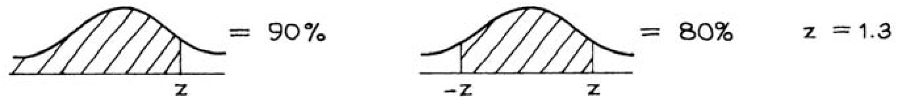

Sinh viên này đạt điểm cao hơn mức trung bình 1.3 SDs trong kỳ thi SAT. Phương pháp hồi quy dự đoán anh ấy sẽ cao hơn mức trung bình 0.4 × 1.3 ≈ 0.5 SDs về điểm GPA năm nhất. Cuối cùng, thông phức tin này có thể được chuyển đổi ngược lại thành một thứ hạng bách phân vị: 

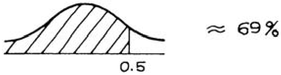

Đó là câu trả lời. Thứ hạng bách phân vị về điểm GPA năm nhất được dự đoán là 69%. 

Trong việc giải bài toán này, các giá trị trung bình và SDs của hai biến chưa từng được sử dụng. Tất cả những gì quan trọng chỉ là hệ số tương quan _r_ . Về cơ bản, điều này là do toàn bộ bài toán đã được giải theo các đơn vị chuẩn (standard units). Các thứ hạng bách phân vị cung cấp cho bạn các đơn vị chuẩn. 

Sinh viên trong ví dụ 2 đã được so sánh với lớp của mình trong hai cuộc thi (com- 

PHƯƠNG PHÁP HỒI QUY DÀNH CHO CÁC CÁ THỂ (THE REGRESSION METHOD FOR INDIVIDUALS) 

petitions) khác nhau, kỳ thi SAT và các bài kiểm tra năm nhất. Anh ấy đã làm rất tốt ở kỳ thi SAT, đạt ở bách phân vị thứ 90. Nhưng ước lượng hồi quy chỉ đặt anh ấy ở bách phân vị thứ 69 đối với các bài kiểm tra năm nhất; vẫn trên mức trung bình, nhưng không cao bằng. Mặt khác, đối với những sinh viên yếu — giả sử ở bách phân vị thứ 10 của kỳ thi SAT — phương pháp hồi quy dự đoán một sự cải thiện. Nó sẽ đặt họ ở bách phân vị thứ 31 trong các bài kiểm tra năm nhất. Thứ hạng này vẫn dưới mức trung bình, nhưng đã xích lại gần hơn. 

Để đi sâu vào vấn đề này một cách cẩn thận hơn, hãy lấy tất cả những người ở bách phân vị thứ 90 của kỳ thi SAT — những sinh viên giỏi. Một số người trong số họ sẽ thăng hạng trong các bài kiểm tra năm nhất, một số sẽ rớt hạng. Tuy nhiên, tính trung bình (on the average), nhóm này sẽ rớt hạng (moves down). Để so sánh, hãy lấy tất cả những người ở bách phân vị thứ 10 của kỳ thi SAT — những sinh viên yếu. Một lần nữa, một số người sẽ làm tốt hơn trong các bài kiểm tra năm nhất, những người khác sẽ tệ hơn. Tuy nhiên, tính trung bình, nhóm này sẽ thăng hạng (moves up). Đó là những gì phương pháp hồi quy đang cho chúng ta biết. 

Ban đầu, nhiều người sẽ dự đoán thứ hạng năm nhất bằng với thứ hạng SAT. Đây không phải là một chiến lược tốt. Để hiểu tại sao, hãy tưởng tượng rằng bạn phải dự đoán thứ hạng của một học sinh trong một lớp toán. Khi không có thông tin nào khác, dự đoán an toàn nhất là xếp cô ấy ở mức trung vị (median). Tuy nhiên, nếu bạn biết rằng học sinh này rất giỏi vật lý, bạn có thể sẽ xếp cô ấy cao hơn nhiều so với mức trung vị trong môn toán. Suy cho cùng, có một sự tương quan mạnh (strong correlation) giữa vật lý và toán học. Mặt khác, nếu tất cả những gì bạn biết là thứ hạng của cô ấy trong một lớp làm gốm (pottery), thì điều đó sẽ không giúp ích gì nhiều trong việc đoán thứ hạng môn toán. Điểm trung vị lúc này có vẻ là một phán đoán tốt: không có nhiều tương quan giữa làm gốm và toán học. 

Bây giờ, quay lại với bài toán dự đoán thứ hạng năm nhất từ thứ hạng SAT. Nếu hai tập điểm tương quan hoàn hảo (perfectly correlated), thứ hạng năm nhất sẽ bằng với thứ hạng SAT. Ở thái cực ngược lại, nếu độ tương quan bằng 0 (correlation is zero), thứ hạng SAT không giúp ích gì cả trong việc dự đoán thứ hạng năm nhất. Độ tương quan thực tế thường nằm ở đâu đó giữa hai thái cực này, vì vậy chúng ta phải dự đoán một thứ hạng trong các bài kiểm tra năm nhất nằm ở đâu đó giữa thứ hạng SAT và mức trung vị. Phương pháp hồi quy cho chúng ta biết chính xác vị trí đó là ở đâu. 

### Bài tập phần C 

1. Trong một lớp học nọ, điểm kiểm tra giữa kỳ trung bình là 60 với SD là 15, và điểm thi cuối kỳ cũng vậy. Hệ số tương quan giữa điểm giữa kỳ và điểm cuối kỳ là khoảng 0.50. Biểu đồ phân tán có dạng hình quả bóng bầu dục (football-shaped). Hãy dự đoán điểm cuối kỳ cho một sinh viên có điểm giữa kỳ là: 

   - (a) 75 (b) 30 (c) 60 (d) không xác định (unknown) 

Hãy so sánh các câu trả lời của bạn với bài tập 1 ở trang 161. 

2. Đối với sinh viên năm nhất tại một trường đại học nọ, hệ số tương quan giữa điểm SAT và điểm GPA năm nhất là 0.60. Biểu đồ phân tán có dạng hình quả bóng bầu dục (football-shaped). Hãy dự đoán thứ hạng bách phân vị (percentile rank) về điểm GPA năm nhất cho một sinh viên có thứ hạng bách phân vị ở kỳ thi SAT là: 

   - (a) 90% (b) 30% (c) 50% (d) không biết 

So sánh câu trả lời của bạn ở phần (a) với ví dụ 2. 

3. Biểu đồ phân tán (scatter diagram) dưới đây thể hiện điểm số giữa kỳ và cuối kỳ của một khóa học. Ba đường thẳng được vẽ vắt ngang qua biểu đồ. 

   - (a) Những người có cùng thứ hạng phần trăm (percentile rank) ở cả hai bài kiểm tra được biểu diễn nằm dọc theo một trong các đường này. Đó là đường nào và tại sao? 

   - (b) Một trong các đường này sẽ được sử dụng để dự đoán điểm cuối kỳ từ điểm giữa kỳ. Đó là đường nào và tại sao? 

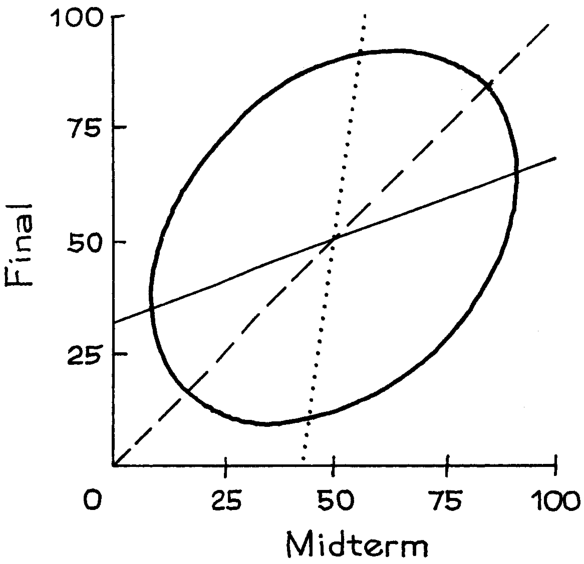

4. Biểu đồ phân tán dưới đây thể hiện độ tuổi của các cặp vợ chồng ở bang Tennessee. (Dữ liệu từ Khảo sát Dân số Hiện tại tháng 3 năm 2005.) 

   - (a) Tại sao không có dấu chấm nào ở góc dưới cùng bên trái của biểu đồ? 

   - (b) Tại sao biểu đồ lại xuất hiện các sọc dọc và ngang? 

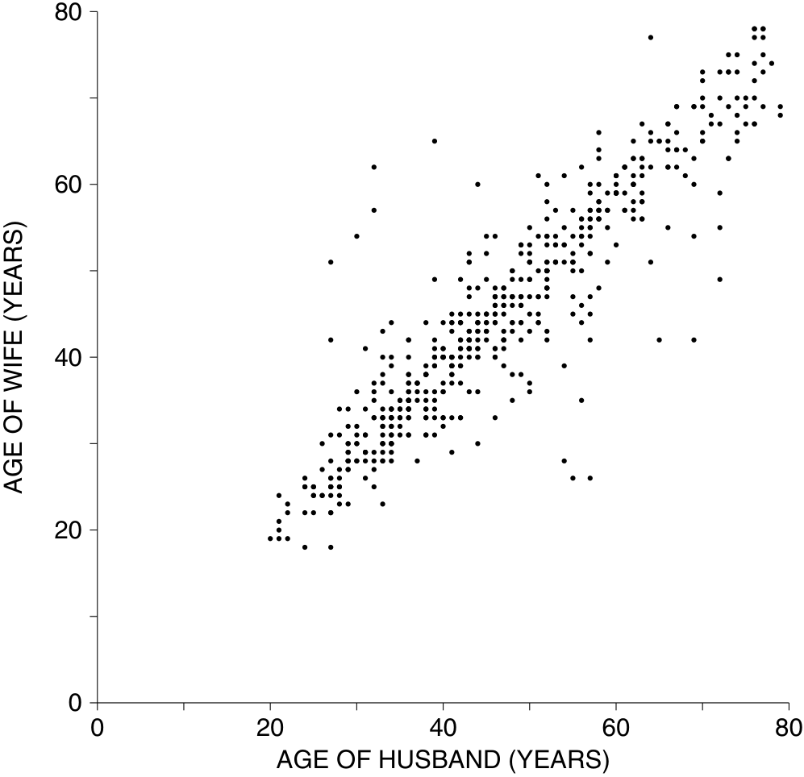

5. Đối với nam giới từ 18 tuổi trở lên trong mẫu HANES5, hệ số tương quan giữa chiều cao và cân nặng là 0.41; độ lệch chuẩn (SD) của chiều cao là khoảng 3 inch và SD của cân nặng là khoảng 42 pound. Nhóm nam giới từ 55–64 tuổi trung bình thấp hơn khoảng nửa inch so với nhóm 18–24 tuổi. Đúng hay sai, và giải thích: vì nửa inch bằng 1 / 6 ≈ 0.17 SD của chiều cao, nên nam giới nhóm 55–64 tuổi trung bình chắc chắn phải nhẹ hơn khoảng 0.41 × 0.17 × 42 ≈ 3 pound so với nam giới nhóm 18–24 tuổi. 

_Đáp án cho các bài tập này nằm ở trang A62._ 

_Lưu ý kỹ thuật._ Phương pháp được thảo luận trong ví dụ 2 là dành cho xếp hạng trung vị (median ranks). Để hiểu tại sao, hãy giả định phân phối chuẩn và _r_ = 0.4. Trong số các sinh viên ở bách phân vị thứ 90 trong kỳ thi SAT (so với bạn học cùng lớp), khoảng một nửa sẽ xếp hạng trên bách phân vị thứ 69 về điểm trung bình (GPA) năm nhất, và một nửa sẽ xếp dưới mức đó. Quy trình ước lượng xếp hạng trung bình (average ranks) thì khó hơn. 

#### 4. NGỤY BIỆN HỒI QUY (THE REGRESSION FALLACY) 

Một chương trình mầm non cố gắng thúc đẩy chỉ số IQ của trẻ em. Các em được làm bài kiểm tra khi bắt đầu chương trình (kiểm tra đầu vào) và làm lại một lần nữa khi rời đi (kiểm tra đầu ra). Trong cả hai lần, điểm số trung bình đều xấp xỉ 100, và độ lệch chuẩn (SD) là khoảng 15. Chương trình dường như không mang lại tác dụng gì. Tuy nhiên, khi xem xét kỹ hơn các dữ liệu, người ta thấy một điều rất đáng ngạc nhiên. Những trẻ ở dưới mức trung bình trong bài kiểm tra đầu vào đã tăng trung bình khoảng 5 điểm IQ ở bài kiểm tra đầu ra. Ngược lại, những trẻ ở trên mức trung bình trong bài kiểm tra đầu vào lại bị giảm trung bình khoảng 5 điểm. Điều này chứng minh cho điều gì? Có phải chương trình này hoạt động với mục đích cào bằng trí thông minh? Có lẽ khi những đứa trẻ thông minh hơn chơi với những đứa trẻ kém hơn, sự khác biệt giữa hai nhóm có xu hướng bị thu hẹp lại. Điều này là đáng mong đợi hay không? 

Những suy đoán này nghe có vẻ thú vị, nhưng sự thật đáng buồn là chẳng có gì đặc biệt xảy ra cả, dù là tốt hay xấu. Lý do là đây. Trẻ em không thể lúc nào cũng đạt được số điểm giống hệt nhau trong hai bài kiểm tra. Sẽ luôn có sự khác biệt giữa hai mức điểm. Không ai nghĩ rằng những khác biệt này là quan trọng hay cần bất kỳ lời giải thích nào. Nhưng chúng làm cho biểu đồ phân tán của các điểm thi tỏa ra xung quanh đường SD, tạo thành hình dạng đám mây quả bóng bầu dục (football-shaped cloud) quen thuộc. Sự phân tán xung quanh đường thẳng này làm cho nhóm ở dưới nhích lên và nhóm ở trên đi xuống. Đơn giản chỉ có vậy. 

Trong hầu hết các tình huống kiểm tra rồi kiểm tra lại (test-retest), nhóm xếp chót trong bài kiểm tra đầu tiên nhìn chung sẽ cho thấy sự cải thiện ở bài kiểm tra thứ hai— và nhóm xếp đầu nhìn chung sẽ bị tụt lại. Đây chính là _hiệu ứng hồi quy_ (regression effect). 

Việc lầm tưởng rằng hiệu ứng hồi quy hẳn phải bắt nguồn từ một nguyên nhân quan trọng nào đó, chứ không đơn thuần chỉ là sự phân tán xung quanh đường thẳng, được gọi là _ngụy biện hồi quy_ (regression fallacy). 

Bây giờ chúng ta sẽ tìm hiểu lý do tại sao hiệu ứng hồi quy luôn xuất hiện bất cứ khi nào có sự phân tán xung quanh đường SD. Hiệu ứng này lần đầu tiên được Galton chú ý trong nghiên cứu của ông về sự giống nhau giữa các thành viên trong gia đình, do đó đây sẽ là bối cảnh cho cuộc thảo luận này. Tuy nhiên, lập luận này mang tính tổng quát. Hình 5 hiển thị một biểu đồ phân tán về chiều cao của 1.078 cặp cha và con trai, như đã thảo luận ở Chương 8. Các số liệu thống kê tóm tắt là5 

chiều cao trung bình của cha ≈ 68 inch, SD ≈ 2.7 inch 
chiều cao trung bình của con trai ≈ 69 inch, SD ≈ 2.7 inch, _r_ ≈ 0.5 

Trung bình, con trai cao hơn cha 1 inch. Dựa trên cơ sở này, thật tự nhiên khi đoán rằng một người cha cao 72 inch sẽ có con trai cao 73 inch; tương tự, một người cha cao 64 inch sẽ có con trai cao 65 inch; và cứ thế. Những cặp cha con như vậy được biểu diễn dọc theo đường đứt nét trong Hình 5. Tất nhiên, không có nhiều gia đình sẽ nằm ngay ngắn trên đường thẳng này. Trên thực tế, có rất nhiều điểm phân tán xung quanh đường thẳng. Một số con trai cao hơn cha của họ; số khác lại thấp hơn. 

Hãy lấy những người cha cao 72 inch (làm tròn đến inch gần nhất). Các gia đình tương ứng được biểu diễn trong dải dọc phía trên vạch 72 inch ở Hình 5, và ta thấy có một khoảng dao động khá lớn về chiều cao của các con trai. Một số điểm nằm phía trên đường đứt nét: con trai cao hơn 73 inch. Nhưng phần lớn các điểm lại nằm dưới đường đứt nét: con trai thấp hơn 73 inch. Nhìn chung, những người con trai của các ông bố cao 72 inch có chiều cao trung bình chỉ đạt 71 inch. Đối với những người cha cao (đạt điểm cao trong bài kiểm tra đầu tiên), trung bình con trai của họ lại thấp hơn (điểm trong bài kiểm tra thứ hai bị giảm). 

Bây giờ hãy nhìn vào các điểm trong dải dọc phía trên vạch 64 inch, đại diện cho những gia đình có người cha cao 64 inch (làm tròn đến inch gần nhất). Chiều cao của đường đứt nét tại đó là 65 inch, đại diện cho một người con trai cao hơn 1 inch so với người cha 64 inch của mình. Một số điểm nằm dưới đường đứt nét, nhưng phần lớn lại nằm phía trên, và con trai của những người cha cao 64 inch có chiều cao trung bình là 67 inch. Đối với những người cha thấp (điểm thấp trong bài kiểm tra đầu tiên), trung bình con trai của họ lại cao hơn (điểm trong bài kiểm tra thứ hai tăng lên). Nhà quý tộc Galton đã gọi hiện tượng này là "sự hồi quy về mức bình thường" (regression to mediocrity). 

Đường đứt nét trong Hình 5 đi qua điểm tương ứng với một người cha có chiều cao trung bình 68 inch và người con trai trung bình của ông có chiều cao 69 inch. Dọc theo đường đứt nét, mỗi mức tăng một SD trong chiều cao của cha sẽ tương ứng với mức tăng một SD trong chiều cao của con trai. Hai yếu tố này tạo nên đường SD (SD line). Đám mây điểm đối xứng xung quanh đường SD, nhưng dải dọc tại 72 inch thì không. Dải này chỉ chứa các điểm có tọa độ _x_ lớn một cách bất thường. Và hầu hết các điểm trong dải này đều nằm dưới đường SD. Ngược lại, dải ở 64 inch chỉ chứa các điểm có tọa độ _x_ nhỏ bất thường. Hầu hết các điểm trong dải này đều nằm trên đường SD. Sự mất cân bằng tiềm ẩn này luôn hiện diện trong các đám mây điểm hình quả bóng bầu dục. Lời giải thích bằng đồ thị cho hiệu ứng hồi quy có vẻ không lãng mạn cho lắm. Nhưng biết sao được, thống kê vốn dĩ không phải là một môn học lãng mạn. 

Hình 5 cũng hiển thị đường hồi quy (regression line) cho chiều cao của con trai dựa trên chiều cao của cha. Đường nét liền này có độ dốc thấp hơn so với đường SD nét đứt, và nó đi qua tâm của mỗi dải chấm dọc—tức là giá trị _y_ trung bình trong dải đó. Lấy ví dụ về những người cha cao 72 inch. Họ cao hơn 4 inch so với mức trung bình: 

Hình 5. Hiệu ứng hồi quy. Nếu con trai cao hơn cha 1 inch, gia đình đó sẽ được biểu diễn dọc theo đường nét đứt. Các điểm trong dải trên mốc 72 inch tương ứng với các gia đình có người cha cao 72 inch (làm tròn đến inch gần nhất); hầu hết các điểm này đều nằm dưới đường nét đứt. Các điểm trong dải trên mốc 64 inch tương ứng với các gia đình có người cha cao 64 inch (làm tròn đến inch gần nhất); hầu hết các điểm này đều nằm trên đường nét đứt. Đường hồi quy nét liền đi qua tâm của tất cả các dải dọc và phẳng hơn so với đường nét đứt. 

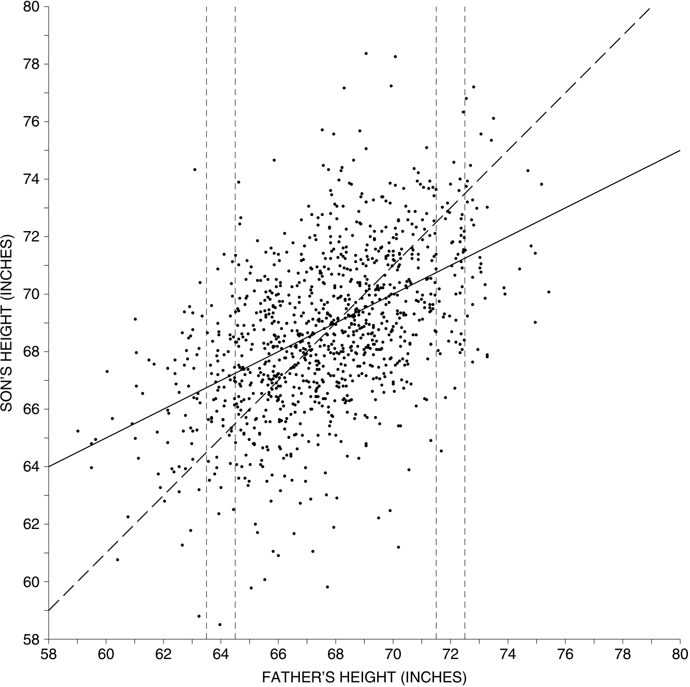

4 inch / 2.7 inch ≈ 1.5 SD. Đường hồi quy cho biết con trai của họ nên cao hơn mức trung bình một khoảng là 

_r_ × 1.5 SD = 0.75 SD ≈ 2 inch. 

Chiều cao trung bình tổng thể của con trai là 69 inch, do đó ước lượng hồi quy cho chiều cao trung bình của những người con trai này là 71 inch—hoàn toàn chính xác. 

Hình 6 thể hiện hiệu ứng hồi quy một cách rõ nét nhất, khi loại bỏ đám mây điểm. Đường SD đứt nét nghiêng một góc 45 độ. Các dấu chấm biểu thị chiều cao trung bình của con trai tương ứng với từng giá trị chiều cao của người cha. Những dấu chấm này chính là tâm của các dải dọc trong Hình 5. Các dấu chấm dốc lên ít hơn so với đường SD—đây chính là hiệu ứng hồi quy. Nhìn chung, các dấu chấm nằm chính giữa đường SD và đường ngang đi qua điểm trung bình (point of averages). Điều này là do hệ số tương quan bằng một nửa (0.5). Mỗi mức tăng một SD trong chiều cao của cha sẽ đi kèm với mức tăng nửa SD trong chiều cao của con trai, chứ không phải tăng một SD. Đường hồi quy nét liền đi lên theo tỷ lệ 0.5:1 (half-to-one rate) và bám sát biểu đồ các giá trị trung bình một cách rất hoàn hảo. 

Hình 6. Hiệu ứng hồi quy. Đường SD là đường nét đứt, đường hồi quy là đường nét liền. Các dấu chấm thể hiện chiều cao trung bình của con trai tương ứng với mỗi giá trị chiều cao của cha. Chúng dốc lên ít hơn so với đường SD. Đây chính là hiệu ứng hồi quy. Đường hồi quy bám sát dọc theo các dấu chấm. 

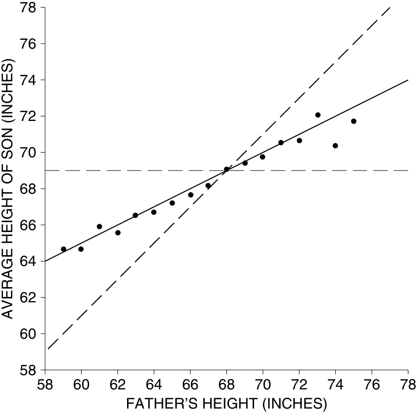

Thoạt nhìn, biểu đồ phân tán ở Hình 5 khá hỗn loạn. Việc Galton có thể nhìn ra một đường thẳng bên trong mớ hỗn độn đó quả thực là một phát hiện thiên tài. Kể từ thời của Galton, nhiều nhà nghiên cứu khác cũng đã phát hiện ra rằng các giá trị trung bình trong biểu đồ phân tán của họ cũng tuân theo những đường thẳng. Đó là lý do tại sao đường hồi quy lại hữu ích đến vậy. 

Bây giờ, hãy xem xét sâu hơn một chút: hiệu ứng hồi quy có thể được hiểu rõ hơn trong một số trường hợp, ví dụ như trong bối cảnh làm lại bài kiểm tra IQ. Có một thực tế cơ bản là điểm số của hai lần thi rất có khả năng sẽ khác nhau. Sự khác biệt này có thể được giải thích bằng sự biến động ngẫu nhiên (chance variability). Mỗi người có thể gặp may hoặc không may trong bài kiểm tra đầu tiên. Nhưng nếu điểm số ở bài kiểm tra đầu tiên rất cao, điều đó cho thấy người này đã 

NGỤY BIỆN HỒI QUY 

gặp may mắn trong lần thi đó, đồng nghĩa với việc điểm số ở bài kiểm tra thứ hai có thể sẽ thấp hơn. (Bạn sẽ không bao giờ nói rằng, "Cậu ấy đạt điểm rất cao, chắc hôm đó cậu ấy xui xẻo lắm.") Mặt khác, nếu điểm số ở bài kiểm tra đầu tiên rất thấp, có khả năng người đó đã phần nào kém may mắn trong lần đó và sẽ làm tốt hơn ở lần sau. 

Dưới đây là một mô hình đơn giản cho tình huống kiểm tra-kiểm tra lại (test-retest), giúp làm rõ hơn cho lời giải thích trên. Phương trình cơ bản là 

#### điểm kiểm tra quan sát được = điểm thực + sai số ngẫu nhiên. 

Giả sử rằng phân phối của các điểm số thực (true scores) trong quần thể tuân theo đường cong chuẩn, với mức trung bình là 100 và SD là 15. Cũng giả sử rằng sai số ngẫu nhiên (chance error) có khả năng mang giá trị dương ngang với giá trị âm, và thường có độ lớn khoảng 5 điểm. Một người có điểm thực là 135 sẽ có xác suất đạt được 130 điểm hoặc 140 điểm trong bài kiểm tra là như nhau. Một người có điểm thực là 145 cũng có khả năng đạt 140 điểm tương đương với 150 điểm. Tất nhiên, sai số ngẫu nhiên cũng có thể là ±4, hoặc ±6, v.v.: bất kỳ cặp giá trị đối xứng nào cũng có thể được xử lý theo cách tương tự. 

Hình 7. Mô hình cho hiệu ứng hồi quy. 

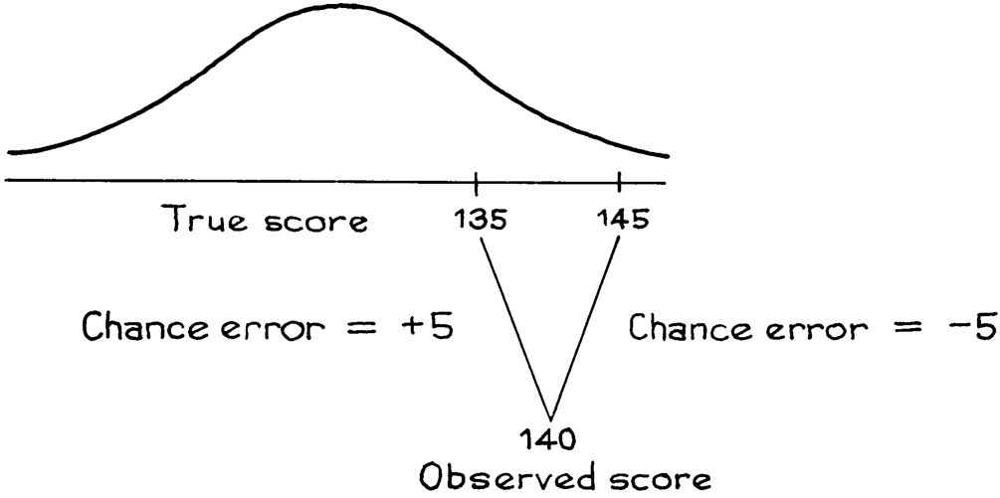

Xét những người đạt 140 điểm trong bài kiểm tra đầu tiên. Có hai cách giải thích thay thế cho điểm số quan sát được này: 

- điểm thực dưới 140, kèm theo sai số ngẫu nhiên dương; 

- điểm thực trên 140, kèm theo sai số ngẫu nhiên âm. 

Cách giải thích đầu tiên có khả năng xảy ra cao hơn. Ví dụ, như Hình 7 cho thấy, số người có điểm thực là 135 nhiều hơn số người có điểm thực là 145. 

Mô hình này giải thích cho hiệu ứng hồi quy. Nếu một người đạt điểm trên mức trung bình ở bài kiểm tra đầu tiên, điểm thực của người đó có lẽ sẽ thấp hơn một chút so với điểm quan sát được. Nếu người này làm lại bài kiểm tra, chúngtrong dự đoán rằng điểm số thứ hai sẽ thấp hơn một chút so với điểm số đầu tiên. Ngược lại, nếu một người đạt điểm dưới mức trung bình ở bài kiểm tra đầu tiên, chúng ta ước lượng rằng điểm thực của họ sẽ cao hơn một chút so với điểm quan sát được, và dự đoán của chúng ta cho bài kiểm tra thứ hai sẽ cao hơn một chút so với bài kiểm tra đầu tiên. 

### Bài tập Nhóm D (Exercise Set D)

1. Là một phần của chương trình huấn luyện, các phi công không quân thực hiện hai lần hạ cánh thực hành cùng với các huấn luyện viên và được đánh giá hiệu suất. Sau mỗi lần hạ cánh, các huấn luyện viên sẽ thảo luận về kết quả đánh giá với phi công. Phân tích thống kê cho thấy những phi công thực hiện hạ cánh kém ở lần đầu tiên thường có xu hướng làm tốt hơn ở lần thứ hai. Ngược lại, những phi công hạ cánh tốt ở lần đầu tiên lại có xu hướng làm kém hơn ở lần thứ hai. Kết luận được rút ra là: việc phê bình giúp ích cho các phi công, trong khi những lời khen ngợi lại làm họ thực hiện kém đi. Do đó, các huấn luyện viên được yêu cầu phải phê bình tất cả các lần hạ cánh, dù tốt hay xấu. Sự thật có chứng minh điều này là đúng không? Hãy trả lời có hoặc không, và giải thích ngắn gọn.6 

2. Một giảng viên chuẩn hóa bài kiểm tra giữa kỳ và cuối kỳ mỗi học kỳ sao cho điểm trung bình của lớp là 50 và độ lệch chuẩn (SD) là 10 cho cả hai bài kiểm tra. Hệ số tương quan giữa hai bài kiểm tra là khoảng 0.50. Trong một học kỳ, cô giáo đã tập hợp tất cả những sinh viên đạt điểm dưới 30 ở bài thi giữa kỳ và phụ đạo đặc biệt cho họ. Kết quả là tất cả số sinh viên này đều đạt điểm trên 50 ở bài thi cuối kỳ. Liệu điều này có thể được giải thích bằng hiệu ứng hồi quy (regression effect) hay không? Hãy trả lời có hoặc không, và giải thích ngắn gọn. 

3. Trong tập dữ liệu của hình 5 và hình 6, liệu con trai của những người cha cao 61 inch (khoảng 1m55) có chiều cao trung bình cao hơn hay thấp hơn con trai của những người cha cao 62 inch (khoảng 1m57)? Lời giải thích cho điều này là gì? 

_Đáp án cho các bài tập này nằm ở các trang A62–63._ 

#### 5. CÓ HAI ĐƯỜNG HỒI QUY (THERE ARE TWO REGRESSION LINES)

Trên thực tế, có hai đường hồi quy có thể được vẽ ngang qua một biểu đồ phân tán (scatter diagram). Ví dụ, một biểu đồ phân tán giữa chiều cao và cân nặng được phác họa trong hình 8. Bảng điều khiển (panel) bên trái hiển thị đường hồi quy của cân nặng theo chiều cao (weight on height). Đường này đi qua điểm chính giữa của các dải dọc (vertical strips) và ước tính cân nặng trung bình cho mỗi mức chiều cao. Bảng điều khiển bên phải hiển thị đường hồi quy của chiều cao theo cân nặng (height on weight). Đường này đi qua điểm chính giữa của các dải ngang (horizontal strips) và ước tính chiều cao trung bình cho mỗi mức cân nặng. Ở cả hai bảng điều khiển, đường hồi quy là đường nét liền và đường SD (SD line - đường độ lệch chuẩn) là đường nét đứt. Việc hồi quy cân nặng theo chiều cao dường như tự nhiên hơn cho hầu hết các mục đích, nhưng đường hồi quy còn lại cũng có thể hữu ích trong một số trường hợp. 

Hình 8. Bảng điều khiển bên trái hiển thị đường hồi quy của cân nặng theo chiều cao; bảng điều khiển bên phải là chiều cao theo cân nặng. Đường SD là đường nét đứt. 

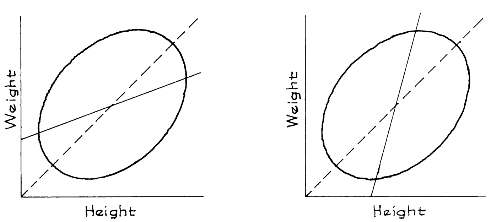

CÓ HAI ĐƯỜNG HỒI QUY 

_Ví dụ 3._ Điểm IQ được điều chỉnh theo thang đo sao cho trung bình khoảng 100 và độ lệch chuẩn (SD) khoảng 15, áp dụng cho cả nam và nữ. Hệ số tương quan giữa chỉ số IQ của chồng và vợ là khoảng 0.50. Một nghiên cứu lớn về các gia đình đã phát hiện ra rằng những người đàn ông có IQ bằng 140 có vợ với IQ trung bình là 120. Hãy xem xét những người vợ trong nghiên cứu có IQ bằng 120. Liệu IQ trung bình của chồng họ có cao hơn 120 không? Hãy trả lời có hoặc không, và giải thích ngắn gọn. 

_Giải pháp._ Không, IQ trung bình của chồng họ sẽ vào khoảng 110. Xem hình 9. Các gia đình trong đó người chồng có IQ là 140 được thể hiện trong dải dọc. Tọa độ _y_ trung bình trong dải này là 120. Các gia đình trong đó người vợ có IQ là 120 được thể hiện trong dải ngang. Đây là một tập hợp các gia đình hoàn toàn khác. Tọa độ _x_ trung bình cho các điểm trong dải ngang là khoảng 110. Hãy nhớ rằng, có hai đường hồi quy. Một đường dùng để dự đoán IQ của người vợ từ IQ của người chồng. Đường còn lại dùng để dự đoán IQ của người chồng từ IQ của người vợ. 

Hình 9. Hai đường hồi quy. 

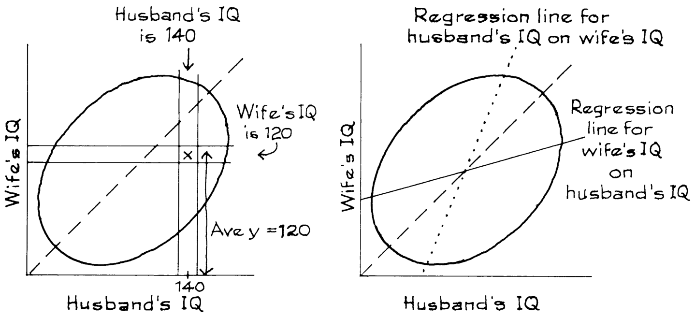

### Bài tập Nhóm E (Exercise Set E) 

1. Đối với nam giới độ tuổi 18–24 trong mẫu HANES5, những người cao 63 inch (khoảng 1m60) có cân nặng trung bình là 138 pound (khoảng 62,6 kg). Đúng hay sai, và hãy giải thích: những người nặng 138 pound chắc chắn phải có chiều cao trung bình là 63 inch. 

2. Trong nghiên cứu của Pearson, con trai của những người cha cao 72 inch (khoảng 1m83) chỉ có chiều cao trung bình là 71 inch (khoảng 1m80). Đúng hay sai: nếu bạn chọn ra những người con trai cao 71 inch, cha của họ sẽ có chiều cao trung bình khoảng 72 inch. Hãy giải thích ngắn gọn. 

3. Trong ví dụ 2 (trang 166), phương pháp hồi quy đã dự đoán rằng một sinh viên ở bách phân vị thứ 90 (90th percentile) trong bài kiểm tra SAT sẽ chỉ ở bách phân vị thứ 69 về điểm trung bình (GPA) năm thứ nhất. Đúng hay sai, và hãy giải thích: một sinh viên ở bách phân vị thứ 69 về GPA năm thứ nhất đáng lẽ phải ở bách phân vị thứ 90 trong bài kiểm tra SAT. 

_Đáp án cho các bài tập này nằm ở trang A63._ 

#### 6. BÀI TẬP ÔN TẬP (REVIEW EXERCISES) 

_Các bài tập ôn tập có thể bao gồm kiến thức từ các chương trước._ 

1. Dưới đây là biểu đồ phân tán cho điểm Toán và điểm Đọc hiểu (Verbal) của kỳ thi SAT đối với các học sinh cuối cấp tốt nghiệp tại một trường trung học nhất định. Ba vùng được tô bóng. Hãy ghép vùng với phần mô tả tương ứng. (Sẽ có một mô tả bị thừa.) 

   - (i) Tổng điểm (Toán + Đọc hiểu) dưới 1000. 

   - (ii) Tổng điểm (Toán + Đọc hiểu) khoảng 1000. 

   - (iii) Điểm Toán xấp xỉ bằng điểm Đọc hiểu. 

   - (iv) Điểm Toán thấp hơn điểm Đọc hiểu. 

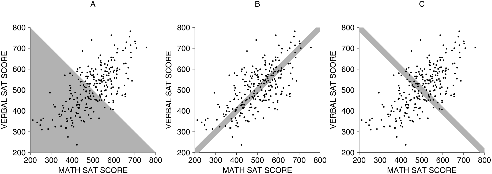

2. Trong một nghiên cứu về sự ổn định của điểm IQ, một nhóm lớn các cá nhân được kiểm tra một lần ở tuổi 18 và kiểm tra lại lần nữa ở tuổi 35. Các kết quả sau đây đã thu được. 

      - Tuổi 18: điểm trung bình ≈ 100, SD ≈ 15 
      - Tuổi 35: điểm trung bình ≈ 100, SD ≈ 15, _r_ ≈ 0.80 

   - (a) Hãy ước tính điểm trung bình ở độ tuổi 35 cho tất cả những cá nhân đạt điểm 115 ở độ tuổi 18. 

   - (b) Hãy dự đoán điểm số ở độ tuổi 35 của một cá nhân đạt điểm 115 ở độ tuổi 18. 

3. Pearson và Lee đã thu được các kết quả sau đây trong một nghiên cứu trên khoảng 1.000 gia đình: 

chiều cao trung bình của chồng ≈ 68 inch, SD ≈ 2.7 inch 
chiều cao trung bình của vợ ≈ 63 inch, SD ≈ 2.5 inch, _r_ ≈ 0.25 

Dự đoán chiều cao của một người vợ khi biết chiều cao của chồng cô ấy là 

   - (a) 72 inch (b) 64 inch (c) 68 inch (d) không xác định 

4. Trong một nghiên cứu, hệ số tương quan giữa trình độ học vấn của những người làm chồng và những người làm vợ ở một thị trấn nọ là khoảng 0.50; cả hai giới đều có số năm đi học trung bình đã hoàn thành là 12 năm, với độ lệch chuẩn (SD) là 3 năm.7 

   - (a) Dự đoán trình độ học vấn của một người phụ nữ có chồng đã hoàn thành 18 năm đi học. 

   - (b) Dự đoán trình độ học vấn của một người đàn ông có vợ đã hoàn thành 15 năm đi học. 

   - (c) Có vẻ như, những người đàn ông có học vấn cao kết hôn với những người phụ nữ có học vấn thấp hơn bản thân họ. Nhưng rồi những người phụ nữ ấy lại kết hôn với những người đàn ông có trình độ học vấn thậm chí còn thấp hơn. Làm sao điều này có thể xảy ra? 

5. Một nhà nghiên cứu khi đo lường các đặc điểm khác nhau của một nhóm lớn các vận động viên đã phát hiện ra rằng hệ số tương quan giữa cân nặng của một vận động viên và lượng tạ mà vận động viên đó có thể nâng là 0.60. Đúng hay sai, và hãy giải thích: 

   - (a) Trung bình, một vận động viên có thể nâng 60% trọng lượng cơ thể của mình. 

   - (b) Nếu một vận động viên tăng thêm 10 pound (khoảng 4,5 kg), anh ta có thể kỳ vọng sẽ nâng thêm được 6 pound (khoảng 2,7 kg). 

   - (c) Vận động viên càng nặng thì trung bình anh ta càng có khả năng nâng được mức tạ nặng hơn. 

   - (d) Vận động viên có khả năng nâng được mức tạ càng nặng thì trung bình anh ta có cân nặng càng lớn. 
   - (e) 60% khả năng nâng tạ của một vận động viên có thể được quy đổi hoàn toàn do cân nặng của anh ta. 

6. Ba đường thẳng được vẽ ngang qua biểu đồ phân tán bên dưới. Một đường là đường SD, một đường là đường hồi quy của _y_ theo _x_ , và một đường là đường hồi quy của _x_ theo _y_ . Đường nào là đường nào? Tại sao? ("Đường hồi quy của _y_ theo _x_" được sử dụng để dự đoán _y_ từ _x_ .) 

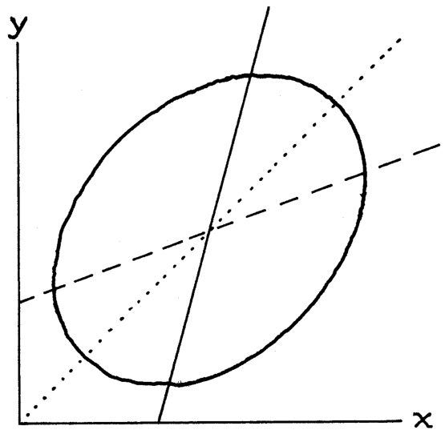

7. Một bác sĩ có thói quen đo huyết áp hai lần. Cô nhận thấy rằng những bệnh nhân có chỉ số đo lần đầu cao bất thường thường có xu hướng chỉ số đo lần hai thấp hơn một chút. Cô kết luận rằng bệnh nhân cảm thấy thư giãn hơn ở lần đo thứ hai. Một đồng nghiệp lại không đồng ý với quan điểm này, và chỉ ra rằng những bệnh nhân có chỉ số đo lần đầu thấp bất thường lại có xu hướng chỉ số đo lần hai cao hơn một chút, điều này cho thấy họ trở nên lo lắng hơn. Bác sĩ nào đúng? Hay có lẽ cả hai đều sai? Hãy giải thích ngắn gọn. 

8. Một nghiên cứu quy mô lớn đã được thực hiện về vấn đề huyết áp được thảo luận ở bài tập trước. Nghiên cứu phát hiện ra rằng chỉ số đo lần đầu trung bình là 130 mm, và chỉ số đo lần hai trung bình là 120 mm; cả hai độ lệch chuẩn (SD) đều vào khoảng 15 mm. Kết quả này có ủng hộ lập luận của bác sĩ nào không? Hay đây chỉ là hiệu ứng hồi quy? Hãy giải thích. 

9. Trong một lớp học thống kê có đông sinh viên, hệ số tương quan giữa điểm thi giữa kỳ và cuối kỳ được ghi nhận là gần bằng 0.50 qua mỗi học kỳ. Các biểu đồ phân tán có dạng hình quả bóng bầu dục (football-shaped). Hãy dự đoán thứ hạng bách phân vị (percentile rank) trong bài thi cuối kỳ cho một sinh viên có thứ hạng bách phân vị ở bài thi giữa kỳ là: 

   - (a) 5% (b) 80% (c) 50% (d) không xác định 

10. Đúng hay sai: Một sinh viên nằm ở bách phân vị thứ 40 (40th percentile) về GPA năm thứ nhất thì cũng có khả năng nằm ở bách phân vị thứ 40 về GPA năm thứ hai. Hãy giải thích ngắn gọn. (Biểu đồ phân tán có dạng hình quả bóng bầu dục). 

#### 7. TỔNG KẾT (SUMMARY) 

1. Gắn liền với sự gia tăng thêm một SD (độ lệch chuẩn) ở biến _x_ , thì trung bình sẽ chỉ có sự gia tăng thêm _r_ (hệ số tương quan) SD ở biến _y_ . Việc vẽ các _ước lượng hồi quy (regression estimates)_ này mang lại _đường hồi quy (regression line)_ của _y_ theo _x_ . 

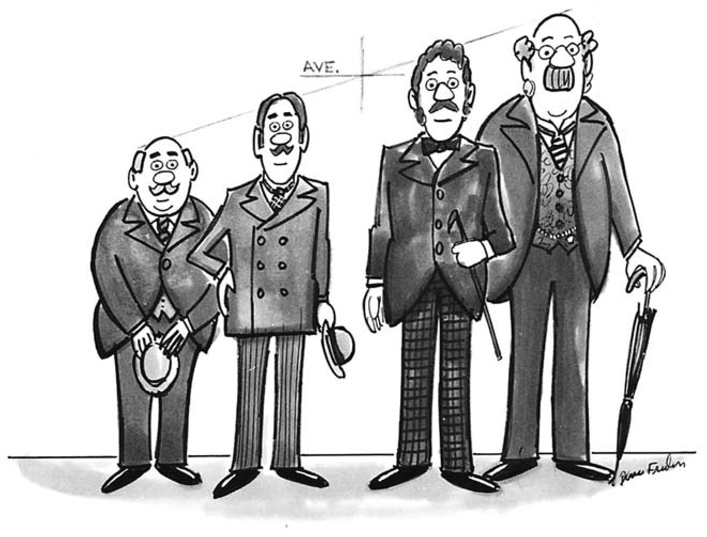

2. _Biểu đồ các số trung bình (graph of averages)_ thường gần với một đường thẳng, nhưng đôi khi có thể hơi nhấp nhô (bumpy). Đường hồi quy giúp làm phẳng các điểm nhấp nhô đó. Nếu biểu đồ các số trung bình là một đường thẳng, thì nó trùng khớp với đường hồi quy. Nếu biểu đồ các số trung bình có dạng phi tuyến tính (non-linear) rõ rệt, thì việc sử dụng hồi quy tuyến tính có thể là không phù hợp. 

3. Đường hồi quy có thể được sử dụng để đưa ra các dự đoán cho từng cá nhân. Tuy nhiên, nếu bạn phải ngoại suy (extrapolate) nằm cách quá xa so với dữ liệu thực tế hiện có, hoặc áp dụng sang một nhóm đối tượng khác, thì hãy cực kỳ cẩn thận. 

4. Trong một tình huống "kiểm tra - kiểm tra lại" (test-retest) điển hình, các đối tượng sẽ nhận được những điểm số khác nhau trong hai bài kiểm tra. Hãy xem xét nhóm điểm thấp nhất ở bài kiểm tra đầu tiên. Một số cải thiện ở bài kiểm tra thứ hai, những người khác lại làm tệ hơn. Tuy nhiên trung bình, nhóm điểm thấp nhất này có xu hướng cho thấy sự cải thiện. Bây giờ, đối với nhóm điểm cao nhất: một số làm tốt hơn ở lần kiểm tra thứ hai, nhưng những người khác lại tụt hạng. Trung bình, nhóm điểm cao nhất thường làm kém hơn ở lần kiểm tra thứ hai. Đây được gọi là _hiệu ứng hồi quy (regression effect)_ , và điều này xảy ra mỗi khi biểu đồ phân tán trải rộng xung quanh đường SD, tạo thành một đám mây điểm có hình dạng quả bóng bầu dục (football-shaped cloud of points). 

5. _Ngụy biện hồi quy (regression fallacy)_ là sự lầm tưởng rằng hiệu ứng hồi quy nhất định phải do một nguyên nhân nào khác gây ra thay vì đơn thuần là do sự phân tán (spread) xung quanh đường SD. 

6. Có hai đường hồi quy có thể được vẽ trên một biểu đồ phân tán. Một đường dùng để dự đoán _y_ từ _x_ ; đường còn lại dùng để dự đoán _x_ từ _y_ . 

