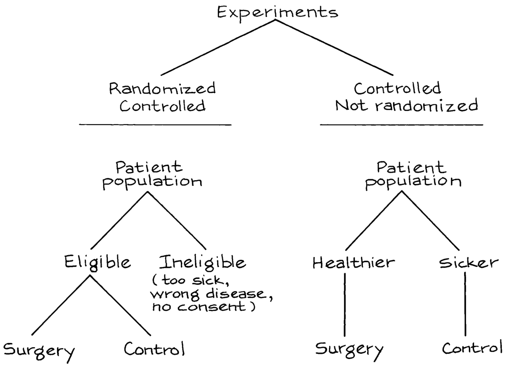
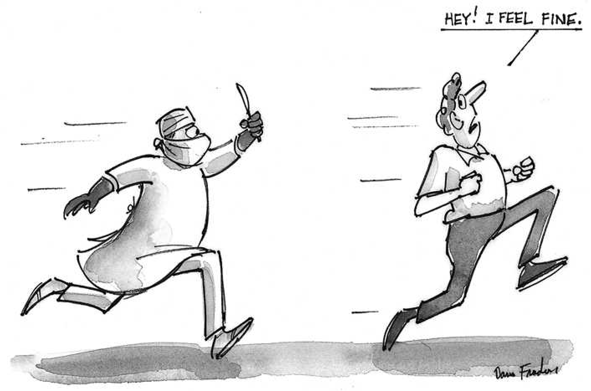

# 1 

## Các Thí nghiệm Có kiểm soát (Controlled Experiments)

_Always do right. This will gratify some people, and astonish the rest._ —MARK TWAIN (UNITED STATES, 1835–1910) 
(Luôn làm điều đúng đắn. Điều này sẽ làm hài lòng một số người, và làm kinh ngạc những người còn lại.)

### 1. THỬ NGHIỆM THỰC ĐỊA VẮC-XIN SALK (THE SALK VACCINE FIELD TRIAL)

Một loại thuốc mới được giới thiệu. Một thí nghiệm nên được thiết kế như thế nào để kiểm tra tính hiệu quả của nó? Phương pháp cơ bản là _sự so sánh (comparison)_ .1 Thuốc được tiêm cho các đối tượng trong một _nhóm điều trị (treatment group)_ , nhưng các đối tượng khác được sử dụng làm _nhóm đối chứng (controls)_ —họ không được điều trị. Sau đó các phản hồi của hai nhóm được so sánh. Các đối tượng nên được phân bổ vào nhóm điều trị hoặc đối chứng _một cách ngẫu nhiên (at random)_ , và thí nghiệm nên được tiến hành theo phương pháp _mù đôi (double-blind)_ : cả đối tượng lẫn bác sĩ đo lường phản hồi đều không nên biết ai ở trong nhóm điều trị và ai ở trong nhóm đối chứng. Những ý tưởng này sẽ được phát triển trong bối cảnh của một thử nghiệm thực địa thực tế.2 

Đại dịch bại liệt (polio) đầu tiên tấn công Hoa Kỳ vào năm 1916, và trong bốn mươi năm tiếp theo bệnh bại liệt đã cướp đi sinh mạng của hàng trăm ngàn nạn nhân, đặc biệt là trẻ em. Đến những năm 1950, một vài loại vắc-xin chống lại căn bệnh này đã được khám phá. Loại được phát triển bởi Jonas Salk dường như có triển vọng nhất. Trong các thử nghiệm trong phòng thí nghiệm, nó đã được chứng minh là an toàn và đã tạo ra sự sản sinh kháng thể chống lại bệnh bại liệt. Đến năm 1954, Cơ quan Y tế Công cộng (Public Health Service) và Quỹ Quốc gia về Bệnh Liệt Nhi đồng (National Foundation for Infantile Paralysis - NFIP) đã sẵn sàng thử nghiệm vắc-xin này trong thế giới thực—bên ngoài phòng thí nghiệm. 

Giả sử NFIP vừa mới tiêm vắc-xin cho một lượng lớn trẻ em. Nếu tỷ lệ mắc bệnh bại liệt vào năm 1954 giảm mạnh so với năm 1953, điều đó dường như sẽ 

chứng minh tính hiệu quả của vắc-xin. Tuy nhiên, bại liệt là một căn bệnh dịch tễ mà tỷ lệ mắc bệnh thay đổi từ năm này sang năm khác. Năm 1952, có khoảng 60.000 ca mắc bệnh; năm 1953, con số này chỉ bằng một nửa. Tỷ lệ mắc bệnh thấp vào năm 1954 có thể có nghĩa là vắc-xin đã hiệu quả—hoặc 1954 không phải là một năm dịch bệnh. 

Cách duy nhất để tìm ra liệu vắc-xin có tác dụng hay không là cố ý để lại một số trẻ em không được tiêm chủng, và sử dụng chúng làm đối chứng. Điều này đặt ra một câu hỏi rắc rối về đạo đức y học, bởi vì việc từ chối điều trị dường như là tàn nhẫn. Tuy nhiên, ngay cả sau khi thử nghiệm sâu rộng trong phòng thí nghiệm, thường vẫn không rõ liệu lợi ích của một loại thuốc mới có lớn hơn những rủi ro của nó hay không.3 Chỉ có một thí nghiệm được kiểm soát tốt (well-controlled experiment) mới có thể giải quyết được câu hỏi này. 

Trên thực tế, NFIP đã chạy một thí nghiệm có kiểm soát để chỉ ra vắc-xin đã hiệu quả. Các đối tượng là trẻ em ở các nhóm tuổi dễ bị tổn thương nhất bởi bệnh bại liệt—các khối lớp 1, 2, và 3. Thử nghiệm thực địa được thực hiện tại các học khu được chọn lọc trên khắp đất nước, nơi có nguy cơ mắc bệnh bại liệt cao. Hai triệu trẻ em đã tham gia, và nửa triệu em đã được tiêm chủng. Một triệu em bị cố ý để không tiêm chủng, làm nhóm đối chứng; nửa triệu em từ chối tiêm chủng. 

Điều này minh họa cho phương pháp so sánh. Chỉ những đối tượng trong nhóm điều trị mới được tiêm chủng: nhóm đối chứng không nhận được vắc-xin. Các phản hồi của hai nhóm sau đó có thể được so sánh để xem liệu việc điều trị có tạo ra bất kỳ sự khác biệt nào hay không. Trong thử nghiệm thực địa vắc-xin Salk, nhóm điều trị và nhóm đối chứng có quy mô khác nhau, nhưng điều đó không quan trọng. Các nhà điều tra đã so sánh tỷ lệ mắc bệnh bại liệt ở trẻ em trong hai nhóm—số ca trên một trăm ngàn. Việc xem xét tỷ lệ thay vì con số tuyệt đối sẽ điều chỉnh cho sự khác biệt về quy mô của các nhóm. 

Trẻ em chỉ có thể được tiêm chủng khi có sự cho phép của cha mẹ. Vì vậy, một thiết kế khả thi—thiết kế mà cũng dường như giải quyết được vấn đề đạo đức—là như thế này. Những trẻ em có cha mẹ đồng ý sẽ vào nhóm điều trị và được tiêm vắc-xin; những đứa trẻ khác sẽ là nhóm đối chứng. Tuy nhiên, người ta biết rằng cha mẹ có thu nhập cao hơn sẽ có nhiều khả năng đồng ý cho điều trị hơn so với cha mẹ có thu nhập thấp hơn. Thiết kế này bị chệch (biased) theo hướng bất lợi cho vắc-xin, bởi vì trẻ em của các bậc cha mẹ có thu nhập cao dễ bị tổn thương hơn đối với bệnh bại liệt. 

Thoạt đầu, điều đó có vẻ nghịch lý, bởi vì hầu hết các bệnh đều rơi vào người nghèo nhiều hơn. Nhưng bại liệt là một căn bệnh liên quan đến vệ sinh. Một đứa trẻ sống trong môi trường ít vệ sinh hơn có nhiều khả năng mắc bệnh bại liệt nhẹ sớm trong thời thơ ấu, khi vẫn còn được bảo vệ bởi kháng thể từ mẹ của nó. Sau khi bị nhiễm bệnh, những đứa trẻ này tạo ra kháng thể của riêng chúng, bảo vệ chúng chống lại nhiễm trùng nghiêm trọng hơn về sau. Những đứa trẻ sống trong môi trường vệ sinh hơn không phát triển các kháng thể như vậy. 

So sánh những người tình nguyện với những người không tình nguyện sẽ làm chệch thí nghiệm (biases the experiment). Bài học thống kê: nhóm điều trị và nhóm đối chứng nên càng giống nhau càng tốt, ngoại trừ việc điều trị. Khi đó, bất kỳ sự khác biệt nào trong phản hồi giữa hai nhóm là do việc điều trị chứ không phải do thứ gì khác. Nếu hai nhóm khác nhau về một số yếu tố nào đó ngoài việc điều trị, tác dụng của yếu tố khác này có thể bị _nhầm lẫn (confounded)_ (trộn lẫn) với tác dụng của điều trị. Việc tách biệt các tác dụng này có thể khó khăn, và sự nhầm lẫn (confounding) là một nguồn gây ra độ chệch (bias) chính. 

Đối với thử nghiệm thực địa vắc-xin Salk, một vài thiết kế đã được đề xuất. NFIP ban đầu muốn tiêm vắc-xin cho tất cả trẻ em khối lớp 2 có cha mẹ đồng ý, 

THE SALK VACCINE FIELD TRIAL 

để lại trẻ em ở khối lớp 1 và khối 3 làm nhóm đối chứng. Và thiết kế này đã được sử dụng ở nhiều học khu. Tuy nhiên, bại liệt là một căn bệnh truyền nhiễm, lây lan qua tiếp xúc. Vì vậy, tỷ lệ mắc bệnh có thể đã cao hơn ở khối lớp 2 so với khối lớp 1 hoặc khối 3. Điều này có thể đã làm chệch nghiên cứu theo hướng bất lợi cho vắc-xin. Hoặc tỷ lệ mắc bệnh có thể đã thấp hơn ở khối lớp 2, làm chệch nghiên cứu theo hướng có lợi cho vắc-xin. Hơn nữa, trẻ em trong nhóm điều trị, nơi cần có sự đồng ý của cha mẹ, có khả năng có nền tảng gia đình khác với trẻ em trong nhóm đối chứng, nơi không cần sự đồng ý của cha mẹ. Với thiết kế của NFIP, nhóm điều trị sẽ bao gồm quá nhiều trẻ em từ các gia đình có thu nhập cao. Nhóm điều trị sẽ dễ bị mắc bệnh bại liệt hơn nhóm đối chứng. Ở đây có một độ chệch (bias) rõ ràng chống lại vắc-xin. 

Nhiều chuyên gia y tế công cộng đã nhìn thấy những sai sót này trong thiết kế của NFIP, và đã đề xuất một thiết kế khác. Nhóm đối chứng phải được chọn từ cùng một quần thể với nhóm điều trị—những trẻ em mà cha mẹ chúng đồng ý cho tiêm chủng. Nếu không, ảnh hưởng của nền tảng gia đình sẽ bị nhầm lẫn (confounded) với hiệu quả của vắc-xin. Vấn đề tiếp theo là phân bổ trẻ em vào nhóm điều trị hoặc đối chứng. Sự đánh giá của con người dường như là cần thiết, để làm cho nhóm đối chứng giống như nhóm điều trị trên các biến số có liên quan—thu nhập gia đình cũng như sức khỏe tổng quát, tính cách và thói quen xã hội của trẻ. 

Tuy nhiên, kinh nghiệm cho thấy, sự phán xét của con người thường dẫn đến độ chệch đáng kể: tốt hơn là nên dựa vào cơ hội phi cá nhân (impersonal chance). Thử nghiệm thực địa vắc-xin Salk đã sử dụng một quy trình dựa trên cơ hội tương đương với việc tung một đồng xu cho mỗi đứa trẻ, với cơ hội 50-50 được phân bổ vào nhóm điều trị hoặc nhóm đối chứng. Một thủ tục như vậy là khách quan và công bằng. Các quy luật của cơ hội đảm bảo rằng với đủ số lượng đối tượng, nhóm điều trị và nhóm đối chứng sẽ rất giống nhau đối với tất cả các biến số quan trọng, bất kể chúng đã được xác định hay chưa. Khi một thủ tục cơ hội khách quan được sử dụng để phân bổ các đối tượng vào nhóm điều trị hoặc nhóm đối chứng, thí nghiệm được cho là _có kiểm soát ngẫu nhiên (randomized controlled)_ .4 

Một biện pháp phòng ngừa cơ bản khác là sử dụng _giả dược (placebo)_ : trẻ em trong nhóm đối chứng được tiêm một mũi nước muối. Trong quá trình thí nghiệm, các đối tượng không biết họ đang ở nhóm điều trị hay nhóm đối chứng, vì vậy phản hồi của họ là đối với vắc-xin, chứ không phải với ý nghĩ về việc được điều trị. Có vẻ khó tin khi các đối tượng có thể được bảo vệ khỏi bệnh bại liệt chỉ nhờ sức mạnh của một ý nghĩ. Tuy nhiên, các bệnh nhân tại bệnh viện bị đau đớn nghiêm trọng sau phẫu thuật đã được cho một loại "thuốc giảm đau" được làm bằng một chất hoàn toàn trung tính: khoảng một phần ba số bệnh nhân đã cảm thấy giảm đau nhanh chóng.5 

Một biện pháp phòng ngừa nữa: các chuyên gia chẩn đoán phải quyết định xem liệu trẻ em có mắc bệnh bại liệt trong quá trình thí nghiệm hay không. Nhiều dạng bệnh bại liệt rất khó chẩn đoán, và trong các trường hợp ranh giới, các bác sĩ chẩn đoán có thể đã bị ảnh hưởng bởi việc biết liệu đứa trẻ đó có được tiêm vắc-xin hay không. Vì vậy, các bác sĩ không được cho biết đứa trẻ đó thuộc nhóm nào. Đây là kỹ thuật _mù đôi (double blinding)_ : các đối tượng không biết họ nhận được phương pháp điều trị hay giả dược, và những người đánh giá phản hồi cũng vậy. Thí nghiệm mù đôi có kiểm soát ngẫu nhiên này—vốn là thiết kế tốt nhất có thể—đã được thực hiện ở nhiều học khu. 

Mọi thứ đã diễn ra như thế nào? Bảng 1 cho thấy tỷ lệ các ca bại liệt (trên một trăm ngàn đối tượng) trong thí nghiệm có kiểm soát ngẫu nhiên, đối với nhóm điều trị 

và nhóm đối chứng. Tỷ lệ này thấp hơn nhiều đối với nhóm điều trị, một bằng chứng quyết định cho tính hiệu quả của vắc-xin Salk. 

Bảng 1. Kết quả của thử nghiệm vắc-xin Salk năm 1954. Quy mô của các nhóm và tỷ lệ ca bại liệt trên 100.000 trong mỗi nhóm. Các con số đã được làm tròn. 

|_Thí nghiệm mù đôi_ _có kiểm soát_ _ngẫu nhiên_|_ _|_ _|_Nghiên cứu_ _của NFIP_|_ _|_ _|
|---|---|---|---|---|---|
||_Quy mô_|_Tỷ lệ_||_Quy mô_|_Tỷ lệ_|
|Nhóm điều trị|200,000|28|Khối lớp 2 (vắc-xin)|225,000|25|
|Nhóm đối chứng|200,000|71|Khối lớp 1 và 3 (đối chứng)|725,000|54|
|Không đồng ý|350,000|46|Khối lớp 2 (không đồng ý)|125,000|44|

Nguồn: Thomas Francis, Jr., “An evaluation of the 1954 poliomyelitis vaccine trials—summary report,” _American Journal of Public Health_ vol. 45 (1955) pp. 1–63. 

Bảng 1 cũng cho thấy nghiên cứu của NFIP đã bị chệch theo hướng bất lợi cho vắc-xin như thế nào. Trong thí nghiệm có kiểm soát ngẫu nhiên, vắc-xin đã cắt giảm tỷ lệ mắc bệnh bại liệt từ 71 xuống còn 28 trên một trăm ngàn. Sự sụt giảm trong nghiên cứu của NFIP, từ 54 xuống còn 25 trên một trăm ngàn, là khá nhỏ hơn một chút. Nguồn gốc chính của sự sai lệch (bias) là sự nhầm lẫn (confounding). Nhóm điều trị của NFIP chỉ bao gồm những đứa trẻ mà cha mẹ chúng đồng ý cho tiêm chủng. Tuy nhiên, nhóm đối chứng lại bao gồm cả những đứa trẻ mà cha mẹ chúng có thể đã không đồng ý. Nhóm đối chứng không thể so sánh được với nhóm điều trị. 

Thiết kế mù đôi ngẫu nhiên có đối chứng giảm thiểu độ chệch (bias) xuống mức tối thiểu—đây là lý do chính để sử dụng nó bất cứ khi nào có thể. Nhưng thiết kế này cũng có một lợi thế kỹ thuật quan trọng. Để hiểu lý do tại sao, hãy thử đóng vai người phản biện (devil's advocate) và giả định rằng vắc-xin Salk không có tác dụng. Khi đó, sự khác biệt giữa tỷ lệ mắc bệnh bại liệt của nhóm điều trị và nhóm đối chứng chỉ là do tình cờ. Khả năng điều đó xảy ra là bao nhiêu?

Với thiết kế NFIP, kết quả bị ảnh hưởng bởi nhiều yếu tố có vẻ ngẫu nhiên: những gia đình nào tình nguyện tham gia, những trẻ nào học lớp 2, v.v. Tuy nhiên, các điều tra viên không có đủ thông tin để tính toán xác suất cho các kết quả. Họ không thể tính được tỷ lệ cược (odds) để bác bỏ khả năng một sự khác biệt lớn về tỷ lệ mắc bệnh bại liệt là do các yếu tố ngẫu nhiên. Mặt khác, với một thí nghiệm ngẫu nhiên có đối chứng, tính ngẫu nhiên xuất hiện một cách có kế hoạch và đơn giản—khi việc phân bổ vào nhóm điều trị hoặc nhóm đối chứng được thực hiện.

Giả thuyết của người phản biện cho rằng vắc-xin không có tác dụng. Dựa trên giả thuyết này, một vài trẻ em được định sẵn là sẽ mắc bệnh bại liệt. Việc phân bổ vào nhóm điều trị hay nhóm đối chứng không liên quan gì đến điều đó. Mỗi trẻ có 50–50 cơ hội được vào nhóm điều trị hoặc nhóm đối chứng, chỉ phụ thuộc vào việc tung đồng xu. Mỗi trường hợp mắc bại liệt có 50–50 cơ hội xuất hiện ở nhóm điều trị hoặc nhóm đối chứng.

Do đó, số ca mắc bại liệt ở hai nhóm phải xấp xỉ bằng nhau. Bất kỳ sự khác biệt nào cũng là do sự biến động ngẫu nhiên trong việc tung đồng xu. Các nhà thống kê hiểu rõ loại biến động này. Họ có thể tính toán tỷ lệ cược để bác bỏ một sự khác biệt lớn như sự khác biệt được quan sát. Phép tính này sẽ được thực hiện ở chương 27, và tỷ lệ cược là rất lớn—một tỷ chọi một để bác bỏ.

### 2. THE PORTACAVAL SHUNT (PHẪU THUẬT NỐI TĨNH MẠCH CỬA-CHỦ)

Trong một số trường hợp xơ gan, bệnh nhân có thể bắt đầu xuất huyết và chảy máu đến chết. Một phương pháp điều trị liên quan đến phẫu thuật để chuyển hướng dòng máu thông qua _phẫu thuật nối tĩnh mạch cửa-chủ (portacaval shunt)_. Cuộc phẫu thuật để tạo luồng thông này kéo dài và nguy hiểm. Liệu lợi ích có lớn hơn rủi ro? Hơn 50 nghiên cứu đã được thực hiện để đánh giá tác dụng của ca phẫu thuật này.6 Kết quả được tóm tắt trong bảng 2 dưới đây.

Bảng 2. Một nghiên cứu trên 51 nghiên cứu về phẫu thuật nối tĩnh mạch cửa-chủ. Các nghiên cứu được thiết kế tốt cho thấy phẫu thuật có rất ít hoặc không có giá trị. Các nghiên cứu được thiết kế kém phóng đại giá trị của ca phẫu thuật.

||_Mức_|_độ nhiệt_|_tình_|
|---|---|---|---|
|_Thiết kế_|_Rõ rệt_|_Vừa phải_|_Không có_|
|Không có nhóm đối chứng|24|7|1|
|Có nhóm đối chứng, nhưng không ngẫu nhiên|10|3|2|
|Ngẫu nhiên có đối chứng|0|1|3|

Nguồn: N. D. Grace, H. Muench, và T. C. Chalmers, “The present status of shunts for portal hypertension in cirrhosis,” _Gastroenterology_ vol. 50 (1966) pp. 684–91. 

Có 32 nghiên cứu không có nhóm đối chứng (dòng đầu tiên trong bảng): 24 _/_ 32 nghiên cứu này, hay 75%, thể hiện sự nhiệt tình rõ rệt đối với phẫu thuật nối tĩnh mạch, kết luận rằng những lợi ích chắc chắn lớn hơn rủi ro. Trong 15 nghiên cứu có nhóm đối chứng, nhưng việc phân bổ vào nhóm điều trị hoặc nhóm đối chứng không được thực hiện ngẫu nhiên. Chỉ có 10 _/_ 15, hay 67%, thể hiện sự nhiệt tình rõ rệt đối với phẫu thuật. Nhưng 4 nghiên cứu ngẫu nhiên có đối chứng lại cho thấy phẫu thuật có rất ít hoặc không có giá trị. Các nghiên cứu được thiết kế kém đã phóng đại giá trị của ca phẫu thuật rủi ro này.

Một thí nghiệm ngẫu nhiên có đối chứng bắt đầu với một quần thể bệnh nhân được xác định rõ. Một số đủ điều kiện tham gia thử nghiệm. Những người khác thì không: họ có thể quá yếu 

để tiếp nhận điều trị, hoặc họ có thể mắc sai loại bệnh, hoặc họ có thể không đồng ý tham gia (xem lưu đồ ở cuối trang trước). Điều kiện tham gia được xác định đầu tiên; sau đó, các bệnh nhân đủ điều kiện được phân bổ ngẫu nhiên vào nhóm điều trị hoặc nhóm đối chứng. Bằng cách đó, sự so sánh chỉ được thực hiện giữa những bệnh nhân có thể nhận được liệu pháp. Điểm mấu chốt là: nhóm đối chứng tương tự như nhóm điều trị. Ngược lại, với các nghiên cứu được kiểm soát kém, những bệnh nhân không đủ điều kiện có thể được sử dụng làm nhóm đối chứng. Hơn nữa, ngay cả khi nhóm đối chứng được chọn từ những người đủ điều kiện phẫu thuật, bác sĩ phẫu thuật có thể chỉ chọn tiến hành phẫu thuật trên những bệnh nhân khỏe mạnh hơn trong khi những bệnh nhân ốm yếu hơn được đưa vào nhóm đối chứng.

Loại độ chệch (bias) này dường như đã xảy ra trong các nghiên cứu được kiểm soát kém về phẫu thuật nối tĩnh mạch cửa-chủ. Trong cả các nghiên cứu được kiểm soát tốt và kém, khoảng 60% bệnh nhân phẫu thuật vẫn còn sống 3 năm sau ca mổ (bảng 3). Trong các thí nghiệm ngẫu nhiên có đối chứng, tỷ lệ bệnh nhân thuộc nhóm đối chứng sống sót sau 3 năm kể từ khi thử nghiệm cũng là khoảng 60%. Nhưng chỉ có 45% bệnh nhân thuộc nhóm đối chứng trong các thí nghiệm không ngẫu nhiên sống sót được 3 năm.

Trong cả hai loại nghiên cứu, các bác sĩ phẫu thuật dường như đã sử dụng các tiêu chí tương tự để chọn bệnh nhân đủ điều kiện phẫu thuật. Quả thực, tỷ lệ sống sót của nhóm phẫu thuật gần như giống nhau trong cả hai loại nghiên cứu. Vậy, sự khác biệt quan trọng là gì? Với các thí nghiệm ngẫu nhiên có đối chứng, nhóm đối chứng có sức khỏe tổng quát tương tự như nhóm bệnh nhân phẫu thuật. Với các nghiên cứu được kiểm soát kém, có xu hướng loại bỏ những bệnh nhân ốm yếu hơn khỏi nhóm phẫu thuật và sử dụng họ làm nhóm đối chứng. Điều đó giải thích cho độ chệch nghiêng về phía phẫu thuật.

Bảng 3. Thí nghiệm ngẫu nhiên có đối chứng so với thí nghiệm có đối chứng nhưng không ngẫu nhiên. Tỷ lệ sống sót sau ba năm trong các nghiên cứu về phẫu thuật nối tĩnh mạch cửa-chủ. (Các tỷ lệ phần trăm được làm tròn.)

||_Ngẫu nhiên_|_Không ngẫu nhiên_|
|---|---|---|
|Phẫu thuật|60%|60%|
|Nhóm đối chứng|60%|45%|

### 3. HISTORICAL CONTROLS (NHÓM ĐỐI CHỨNG LỊCH SỬ)

Các thí nghiệm ngẫu nhiên có đối chứng rất khó thực hiện. Do đó, các bác sĩ thường sử dụng các thiết kế khác không tốt bằng. Ví dụ, một phương pháp điều trị mới có thể được thử nghiệm trên một nhóm bệnh nhân, những người này được so sánh với "các nhóm đối chứng lịch sử" (historical controls): những bệnh nhân được điều trị theo phương pháp cũ trong quá khứ. Vấn đề là nhóm điều trị và nhóm đối chứng lịch sử có thể khác nhau ở những khía cạnh quan trọng ngoài phương pháp điều trị. Trong một thí nghiệm có đối chứng, có một nhóm bệnh nhân đủ điều kiện điều trị ở giai đoạn đầu của nghiên cứu. Một số người trong số này được phân bổ vào nhóm điều trị, những người còn lại được sử dụng làm nhóm đối chứng: việc phân bổ vào nhóm điều trị hoặc đối chứng được thực hiện "cùng thời điểm" (contemporaneously), nghĩa là trong cùng một khoảng thời gian. Các nghiên cứu tốt sử dụng các nhóm đối chứng cùng thời điểm.

Các thử nghiệm được kiểm soát kém về phẫu thuật nối tĩnh mạch cửa-chủ (phần 2) bao gồm một số thử nghiệm với các nhóm đối chứng lịch sử. Những thử nghiệm khác có các nhóm đối chứng cùng thời điểm, nhưng việc phân bổ 

vào nhóm đối chứng không được thực hiện ngẫu nhiên. Phần 2 đã chỉ ra rằng thiết kế của một nghiên cứu rất quan trọng. Phần này tiếp tục câu chuyện. Phẫu thuật bắc cầu động mạch vành (coronary bypass surgery) là một cuộc phẫu thuật được sử dụng rộng rãi—và rất tốn kém—cho bệnh lý động mạch vành. Chalmers và các cộng sự đã xác định được 29 thử nghiệm về phẫu thuật này (dòng đầu tiên của bảng 4). Có 8 thử nghiệm ngẫu nhiên có đối chứng, và 7 thử nghiệm có kết quả khá tiêu cực về giá trị của cuộc phẫu thuật. Trong khi đó, có 21 thử nghiệm với nhóm đối chứng lịch sử, và 16 thử nghiệm cho kết quả tích cực. Các nghiên cứu được thiết kế kém đã thể hiện sự nhiệt tình hơn về giá trị của cuộc phẫu thuật. (Các dòng khác trong bảng có thể được đọc theo cách tương tự, và dẫn đến những kết luận tương tự về các liệu pháp khác.)

Bảng 4. Một nghiên cứu của các nghiên cứu. Bốn liệu pháp đã được đánh giá bằng cả các thử nghiệm ngẫu nhiên có đối chứng và các thử nghiệm sử dụng nhóm đối chứng lịch sử. Kết luận của các thử nghiệm được tóm tắt là tích cực (+) về giá trị của liệu pháp, hoặc tiêu cực (-).

||_Ngẫu_|_nhiên_|_Lịch_|_sử_|
|---|---|---|---|---|
|_Liệu pháp_|_đối_|_chứng_|_đối_|_chứng_|
||+|−|+|−|
|Phẫu thuật bắc cầu động mạch vành|1|7|16|5|
|5-FU|0|5|2|0|
|BCG|2|2|4|0|
|DES|0|3|5|0|

Lưu ý: 5-FU được sử dụng trong hóa trị ung thư ruột kết; BCG được sử dụng để điều trị u hắc tố; DES để ngăn ngừa sẩy thai. Nguồn: H. Sacks, T. C. Chalmers, và H. Smith, “Randomized versus historical controls for clinical trials,” _American Journal of Medicine_ vol. 72 (1982) pp. 233–40.7 

Tại sao các nghiên cứu được thiết kế tốt lại ít khả quan hơn so với các nghiên cứu được thiết kế kém? Trong 6 thử nghiệm có đối chứng ngẫu nhiên về phẫu thuật bắc cầu động mạch vành và 9 nghiên cứu có đối chứng lịch sử, tỷ lệ sống sót sau 3 năm của nhóm phẫu thuật và nhóm đối chứng đã được báo cáo (Bảng 5). Trong các thử nghiệm có đối chứng ngẫu nhiên, tỷ lệ sống sót khá tương đồng ở nhóm phẫu thuật và nhóm đối chứng. Đó là lý do tại sao các nhà nghiên cứu không đánh giá cao cuộc phẫu thuật này—nó không cứu sống được bệnh nhân. 

Bảng 5. Thử nghiệm có đối chứng ngẫu nhiên và nghiên cứu có đối chứng lịch sử. Tỷ lệ sống sót sau ba năm cho bệnh nhân phẫu thuật và nhóm đối chứng trong các thử nghiệm về phẫu thuật bắc cầu động mạch vành. Thử nghiệm có đối chứng ngẫu nhiên khác với thử nghiệm có đối chứng lịch sử. 

||_Ngẫu nhiên_|_Lịch sử_|
|---|---|---|
|Phẫu thuật|87.6%|90.9%|
|Đối chứng|83.2%|71.1%|

Lưu ý: Có 6 thử nghiệm có đối chứng ngẫu nhiên ghi nhận 9.290 bệnh nhân; và 9 nghiên cứu có đối chứng lịch sử, ghi nhận 18.861 bệnh nhân. Nguồn: Xem bảng 4. 

Bây giờ hãy nhìn vào các nghiên cứu có đối chứng lịch sử. Tỷ lệ sống sót ở nhóm phẫu thuật cũng gần như tương đương với trước đây. Tuy nhiên, nhóm đối chứng lại có tỷ lệ sống sót 

thấp hơn nhiều. Ngay từ ban đầu họ đã không khỏe mạnh bằng những bệnh nhân được chọn để phẫu thuật. Các thử nghiệm với đối chứng lịch sử bị chệch theo hướng có lợi cho việc phẫu thuật. Các thử nghiệm ngẫu nhiên tránh được loại độ chệch này. Điều đó giải thích tại sao thiết kế của nghiên cứu lại quan trọng. Bảng 2 và 3 đã chứng minh điều đó cho phẫu thuật tạo luồng thông cửa - chủ; bảng 4 và 5 cũng chứng minh điều tương tự cho các liệu pháp khác. 

Dòng cuối cùng trong bảng 4 đáng để thảo luận thêm. DES (diethylstilbestrol) là một loại hormone nhân tạo, được sử dụng để ngăn ngừa sẩy thai tự nhiên. Chalmers và các cộng sự đã tìm thấy 8 thử nghiệm đánh giá DES. Ba trong số đó là thử nghiệm có đối chứng ngẫu nhiên, và tất cả đều cho kết quả âm tính: loại thuốc này không có tác dụng. Có 5 nghiên cứu có đối chứng lịch sử, và tất cả đều cho kết quả dương tính. Những nghiên cứu được thiết kế kém này bị chệch theo hướng có lợi cho liệu pháp. 

Các bác sĩ ít chú ý đến các thử nghiệm có đối chứng ngẫu nhiên. Ngay cả vào cuối những năm 1960, họ vẫn kê đơn thuốc này cho 50.000 phụ nữ mỗi năm. Đây là một thảm kịch y khoa, như các nghiên cứu sau này đã chỉ ra. Nếu được sử dụng cho người mẹ trong thời kỳ mang thai, DES có thể gây ra tác dụng phụ thảm khốc 20 năm sau, khiến con gái họ phát triển một dạng ung thư cực kỳ hiếm gặp (ung thư biểu mô tuyến tế bào sáng của âm đạo). DES đã bị cấm sử dụng cho phụ nữ mang thai vào năm 1971.8 

### 4. TÓM TẮT 

1. Các nhà thống kê học sử dụng _phương pháp so sánh (method of comparison)_ . Họ muốn biết tác động của một _phương pháp điều trị_ (chẳng hạn như vắc-xin Salk) lên một _biến phản hồi (response)_ (chẳng hạn như mắc bệnh bại liệt). Để tìm 

TÓM TẮT 

hiểu điều đó, họ so sánh kết quả của _nhóm điều trị_ với _nhóm đối chứng_ . Thông thường, rất khó để đánh giá tác dụng của một phương pháp điều trị nếu không so sánh nó với một thứ khác. 

2. Nếu nhóm đối chứng có thể so sánh được với nhóm điều trị, ngoài phương pháp điều trị ra, thì sự khác biệt trong kết quả của hai nhóm có khả năng là do tác dụng của phương pháp điều trị. 

3. Tuy nhiên, nếu nhóm điều trị khác với nhóm đối chứng về các yếu tố khác, tác động của các yếu tố khác này có khả năng bị _gây nhiễu (confounded)_ với tác động của phương pháp điều trị. 

4. Để đảm bảo rằng nhóm điều trị giống với nhóm đối chứng, các nhà nghiên cứu phân bổ các đối tượng vào nhóm điều trị hoặc đối chứng một cách ngẫu nhiên. Điều này được thực hiện trong _các thử nghiệm có đối chứng ngẫu nhiên_ . 

5. Bất cứ khi nào có thể, nhóm đối chứng được dùng một _giả dược (placebo)_ , thuốc này có tính trung tính nhưng bề ngoài giống với phương pháp điều trị. Kết quả thu được nên là phản hồi đối với chính phương pháp điều trị đó chứ không phải đối với ý nghĩ về việc được điều trị. 

6. Trong một thử nghiệm _mù đôi (double-blind)_ , các đối tượng không biết họ đang ở nhóm điều trị hay nhóm đối chứng; những người đánh giá kết quả cũng không biết. Điều này giúp đề phòng độ chệch (bias), cả trong kết quả phản hồi lẫn trong việc đánh giá. 

