# Biểu đồ Histogram 

_Người lớn thích những con số. Khi bạn kể cho họ nghe bạn vừa có một người bạn mới, họ chẳng bao giờ hỏi bạn những câu về các vấn đề cốt lõi. Họ không bao giờ hỏi, “Giọng cậu ấy nghe thế nào? Cậu ấy thích chơi trò gì nhất? Cậu ấy có sưu tầm bươm bướm không?” Thay vào đó, họ đòi hỏi: “Cậu ấy bao nhiêu tuổi? Cậu ấy có bao nhiêu anh em trai? Cậu ấy nặng bao nhiêu? Bố cậu ấy kiếm được bao nhiêu tiền?” Chỉ qua những con số này họ mới nghĩ là họ đã hiểu được điều gì đó về cậu bé._ 

_—Hoàng tử bé_1 

### 1. GIỚI THIỆU 

Ở Hoa Kỳ, thu nhập được phân phối như thế nào? Các nhóm thiểu số có hoàn cảnh tồi tệ hơn ở mức độ nào? Một số thông tin được cung cấp bởi số liệu thống kê của chính phủ, thu thập từ Khảo sát Dân số Hiện tại. Mỗi tháng, các phỏng vấn viên nói chuyện với một mặt cắt ngang mang tính đại diện gồm khoảng 50.000 gia đình người Mỹ (để biết chi tiết, xem phần VI). Vào tháng Ba, những gia đình này được yêu cầu báo cáo thu nhập của họ trong năm trước đó. Chúng ta sẽ xem xét kết quả của năm 1973. Những dữ liệu này cần phải được tóm tắt—không ai muốn nhìn vào 50.000 con số cả. Để tóm tắt dữ liệu, các nhà thống kê thường sử dụng một loại biểu đồ gọi là _biểu đồ histogram_ (Hình 1 ở trang tiếp theo). 

Phần này giải thích cách đọc biểu đồ histogram. Trước hết, không có thang đo dọc: không giống như hầu hết các biểu đồ khác, biểu đồ histogram không cần thang đo dọc. Bây giờ hãy nhìn vào thang đo ngang. Trục này hiển thị thu nhập tính bằng hàng nghìn đô la. Bản thân biểu đồ chỉ là một tập hợp các khối. Cạnh dưới của khối đầu tiên bao phủ phạm vi từ $0 đến $1.000, cạnh dưới của khối thứ hai đi từ $1.000 đến $2.000; 

Hình 1. Một biểu đồ histogram. Biểu đồ này cho thấy sự phân phối của các gia đình theo thu nhập ở Hoa Kỳ vào năm 1973. 

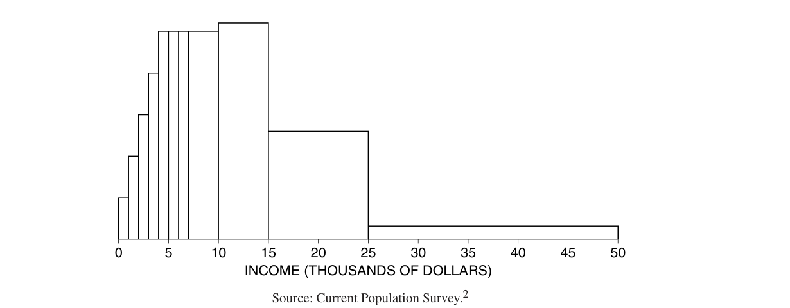

và cứ tiếp tục như vậy cho đến khối cuối cùng, bao phủ phạm vi từ $25.000 đến $50.000. Những phạm vi này được gọi là _các khoảng lớp_. Biểu đồ được vẽ sao cho diện tích của một khối tỷ lệ thuận với số lượng các gia đình có thu nhập nằm trong khoảng lớp tương ứng. 

Để hiểu cách hoạt động của các khối, hãy nhìn kỹ hơn vào Hình 1. Có khoảng bao nhiêu phần trăm các gia đình kiếm được từ $10.000 đến $15.000? Khối nằm trên khoảng này chiếm khoảng một phần tư tổng diện tích. Do đó, có khoảng một phần tư, tức là 25%, số gia đình có thu nhập trong phạm vi đó. 

Lấy một ví dụ khác. Có nhiều gia đình có thu nhập từ $10.000 đến $15.000 hơn, hay từ $15.000 đến $25.000 hơn? Khối nằm trên khoảng đầu tiên cao hơn, nhưng khối nằm trên khoảng thứ hai lại rộng hơn. Diện tích của hai khối này gần như bằng nhau, vì vậy phần trăm các gia đình kiếm được từ $10.000 đến $15.000 xấp xỉ với phần trăm các gia đình kiếm được từ $15.000 đến $25.000. 

Cho ví dụ cuối cùng, hãy lấy phần trăm các gia đình có thu nhập dưới $7.000. Con số này gần với 10%, 25% hay 50% nhất? Bằng mắt thường, diện tích dưới biểu đồ histogram từ $0 đến $7.000 bằng khoảng một phần tư tổng diện tích, nên phần trăm này gần với 25% nhất. 

Trong một biểu đồ histogram, diện tích của các khối đại diện cho các tỷ lệ phần trăm. 

Trục ngang trong Hình 1 dừng lại ở mức $50.000. Thế còn những gia đình kiếm được nhiều hơn mức đó thì sao? Biểu đồ histogram đơn giản là bỏ qua họ. Vào năm 1973, chỉ có 1% gia đình Mỹ có thu nhập trên mức đó: phần lớn đều được thể hiện trong biểu đồ. 

Tại thời điểm này, một cách tốt để tìm hiểu thêm về biểu đồ histogram là làm một vài bài tập. Hình 2 hiển thị cùng một biểu đồ histogram như Hình 1, nhưng được bổ sung thêm thang đo dọc. Thang đo này sẽ hữu ích trong việc giải Bài tập 1. Bài tập 8 so sánh dữ liệu thu nhập của năm 1973 và 2004. 

Hình 2. Biểu đồ histogram từ Hình 1, được bổ sung thêm thang đo dọc. 

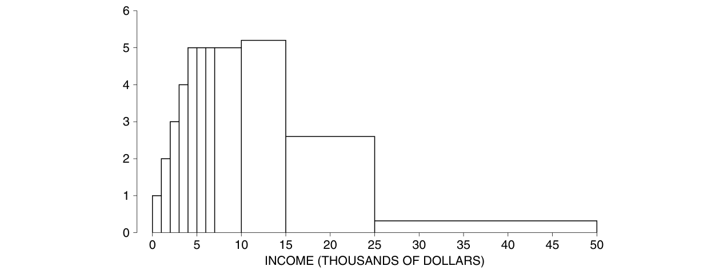

## Bài tập Nhóm A 

1. Khoảng 1% số gia đình trong Hình 2 có thu nhập từ $0 đến $1.000. Ước tính phần trăm số gia đình có thu nhập— 

   - (a) từ $1.000 đến $2.000 

   - (b) từ $2.000 đến $3.000 

   - (c) từ $3.000 đến $4.000 

   - (d) từ $4.000 đến $5.000 

   - (e) từ $4.000 đến $7.000 (f) từ $7.000 đến $10.000 

2. Trong Hình 2, có nhiều gia đình kiếm được từ $10.000 đến $11.000 hơn hay từ $15.000 đến $16.000 hơn? Hoặc số lượng của họ xấp xỉ nhau? Hãy đưa ra dự đoán tốt nhất của bạn. 

3. Biểu đồ histogram dưới đây thể hiện sự phân phối điểm thi cuối kỳ của một lớp học nhất định. (a) Khối nào đại diện cho những người đạt điểm từ 60 đến 80? 

   - (b) Mười phần trăm đạt điểm từ 20 đến 40. Khoảng bao nhiêu phần trăm đạt điểm từ 40 đến 60? 

   - (c) Khoảng bao nhiêu phần trăm đạt điểm trên 60? 

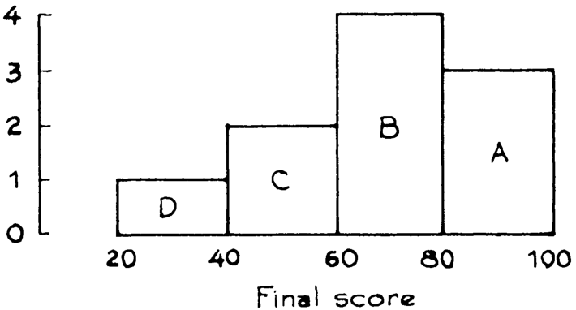

4. Dưới đây là các bản phác thảo biểu đồ histogram về điểm kiểm tra ở ba lớp khác nhau. Điểm dao động từ 0 đến 100; điểm đỗ là 50. Đối với mỗi lớp, tỷ lệ phần trăm số người thi đỗ là khoảng 50%, cao hơn nhiều so với 50%, hay thấp hơn nhiều so với 50%? 

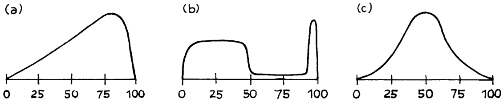

5. Một lớp trong Bài tập 4 có hai nhóm học sinh khá khác biệt, một nhóm làm bài kiểm tra khá tệ và nhóm còn lại làm rất tốt. Đó là lớp nào? 

6. Trong lớp (b) của Bài tập 4, có nhiều người đạt điểm trong khoảng 40–50 hay 90–100 hơn? 

7. Một điều tra viên thu thập dữ liệu về mức lương theo giờ cho ba nhóm người. Những người ở nhóm B kiếm được gấp đôi so với nhóm A. Những người ở nhóm C kiếm được nhiều hơn nhóm A khoảng $10 một giờ. Biểu đồ histogram nào thuộc về nhóm nào? (Các biểu đồ histogram không hiển thị mức lương trên $50 một giờ.) 

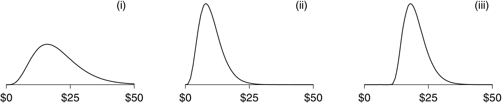

8. Hình dưới đây so sánh các biểu đồ histogram về thu nhập gia đình ở Hoa Kỳ vào năm 1973 và năm 2004. Có vẻ như thu nhập gia đình đã tăng gấp 4 lần trong 30 năm. Hay là không phải vậy? Hãy thảo luận ngắn gọn. 

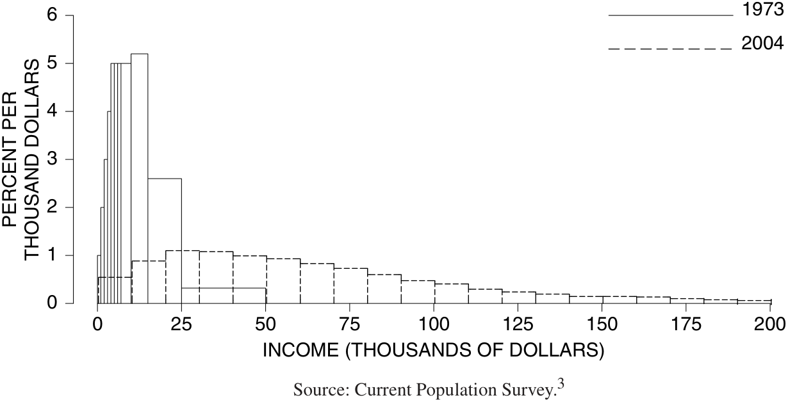

_Đáp án cho những bài tập này nằm ở trang A45–46._ 

VẼ MỘT BIỂU ĐỒ HISTOGRAM 

### 2. VẼ MỘT BIỂU ĐỒ HISTOGRAM 

Phần này giải thích cách vẽ một biểu đồ histogram. Phương pháp không hề khó, nhưng có một vài sai lầm cần tránh. Điểm bắt đầu trong việc vẽ một biểu đồ histogram là một _bảng phân phối_, bảng này thể hiện phần trăm các gia đình có thu nhập trong mỗi khoảng lớp (Bảng 1). Những tỷ lệ phần trăm này được tìm ra bằng cách quay lại dữ liệu gốc—trên 50.000 gia đình—và thực hiện đếm. Ngày nay, loại công việc này được thực hiện bằng máy tính, và thực tế là Bảng 1 đã được lập ra nhờ sự hỗ trợ của máy tính tại Cục Điều tra Dân số. 

Máy tính phải được hướng dẫn phải làm gì với những gia đình rơi vào đúng ranh giới giữa hai khoảng lớp. Điều này được gọi là _quy ước điểm mút_. Quy ước được tuân theo trong Bảng 1 được chỉ ra ở phần chú thích. Điểm mút bên trái được bao gồm trong khoảng lớp, điểm mút bên phải bị loại trừ. Chẳng hạn, trong dòng đầu tiên của bảng, $0 được bao gồm và $1.000 bị loại trừ. Khoảng này chứa những gia đình kiếm được $0 hoặc nhiều hơn, nhưng ít hơn $1.000. Một gia đình kiếm được chính xác $1.000 sẽ thuộc về khoảng tiếp theo. 

Bảng 1. Sự phân phối của các gia đình theo thu nhập ở Hoa Kỳ vào năm 1973. Các khoảng lớp bao gồm điểm mút trái, nhưng không bao gồm điểm mút phải. 

|_Mức thu nhập_|_Phần trăm_|
|---|---|
|$0–$1.000|1|
|$1.000–$2.000|2|
|$2.000–$3.000|3|
|$3.000–$4.000|4|
|$4.000–$5.000|5|
|$5.000–$6.000|5|
|$6.000–$7.000|5|
|$7.000–$10.000|15|
|$10.000–$15.000|26|
|$15.000–$25.000|26|
|$25.000–$50.000|8|
|$50.000 trở lên|1|

Lưu ý: Các tỷ lệ phần trăm không cộng lại thành 100%, do làm tròn. Nguồn: Khảo sát Dân số Hiện tại (Current Population Survey).4

Bước đầu tiên trong việc vẽ một biểu đồ tần suất (histogram) là thiết lập một trục hoành. Đối với biểu đồ tần suất thu nhập, một số người gặp phải

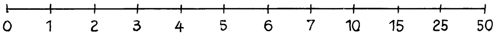

Đó là một sai lầm. Khoảng từ $7,000 đến $10,000 dài gấp ba lần khoảng từ $6,000 đến $7,000. Vì vậy, trục hoành nên trông như thế này:

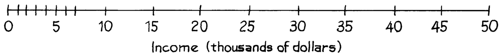

Bước tiếp theo là vẽ các khối. Sẽ rất hấp dẫn nếu làm cho chiều cao của chúng bằng với các tỷ lệ phần trăm trong bảng. Hình 3 cho thấy điều gì xảy ra nếu bạn mắc sai lầm đó. Biểu đồ đưa ra một bức tranh quá đỗi tươi đẹp về phân phối thu nhập. Ví dụ, hình 3 nói rằng có nhiều gia đình có thu nhập trên $25,000 hơn là dưới $7,000. Nước Mỹ là một quốc gia giàu có vào năm 1973, nhưng không giàu đến thế.

Hình 3. Đừng vẽ đồ thị các tỷ lệ phần trăm.

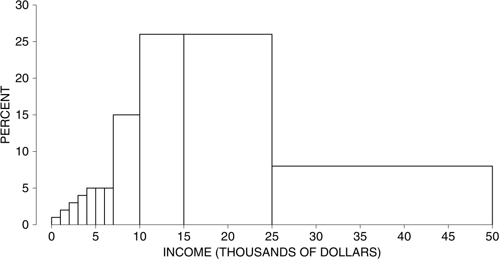

Nguồn gốc của rắc rối là một số khoảng lớp dài hơn các khoảng khác, vì vậy các tỷ lệ phần trăm trong bảng 1 không ngang hàng với nhau. Chẳng hạn, 8% số người kiếm được từ $25,000 đến $50,000 được trải rộng trên một phạm vi thu nhập lớn hơn nhiều so với 15% số người kiếm được từ $7,000 đến $10,000. Việc vẽ đồ thị các tỷ lệ phần trăm một cách trực tiếp đã phớt lờ điều này, và làm cho các khối nằm trên các khoảng lớp dài hơn trở nên quá lớn.

Có một cách đơn giản để bù đắp cho các độ dài khác nhau của các khoảng lớp — sử dụng các khoảng một nghìn đô la làm đơn vị chung. Ví dụ, khoảng lớp từ $7,000 đến $10,000 chứa ba trong số các khoảng này: $7,000 đến $8,000, $8,000 đến $9,000, và $9,000 đến $10,000. Từ bảng 1, 15% số gia đình có thu nhập trong toàn bộ khoảng này. Trong mỗi khoảng con một nghìn đô la, sẽ chỉ có khoảng 5% số gia đình. Con số 5 này, chứ không phải con số 15, mới là cái nên được vẽ ở trên khoảng $7,000 đến $10,000.

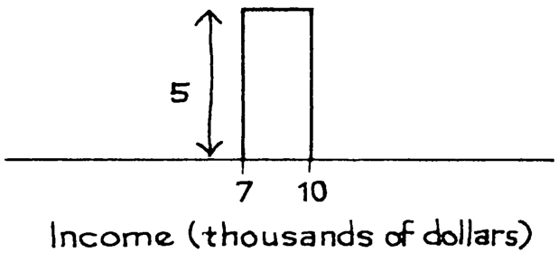

Đối với ví dụ thứ hai, lấy khoảng từ $10,000 đến $15,000. Khoảng này chứa 5 khoảng một nghìn đô la. Theo bảng 1, 26% số gia đình có thu nhập trong toàn bộ khoảng này. Trong mỗi 5 khoảng nhỏ hơn sẽ có khoảng 5.2% số gia đình: 26 / 5 = 5.2. Chiều cao của khối nằm trên khoảng $10,000 đến $15,000 là 5.2.

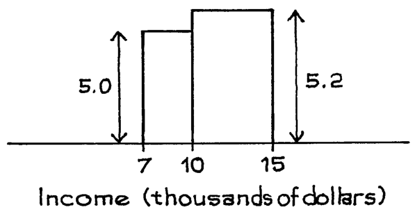

Công việc này được thực hiện cho hai dòng trong bảng 1. Để hoàn thành biểu đồ tần suất, làm điều tương tự cho phần còn lại của các khoảng lớp. Hình 4 (bên dưới) là kết quả.

Để tính ra chiều cao của một khối trên một khoảng lớp, hãy chia tỷ lệ phần trăm cho độ dài của khoảng đó.

Bằng cách đó, diện tích của khối bằng với tỷ lệ phần trăm các gia đình trong khoảng lớp đó. Biểu đồ tần suất thể hiện sự phân phối giống như thể phần trăm được trải đều trên khoảng lớp. Thông thường, đây là một phép xấp xỉ đầu tiên tốt.

Hình 4. Phân phối các gia đình theo thu nhập tại Hoa Kỳ năm 1973.

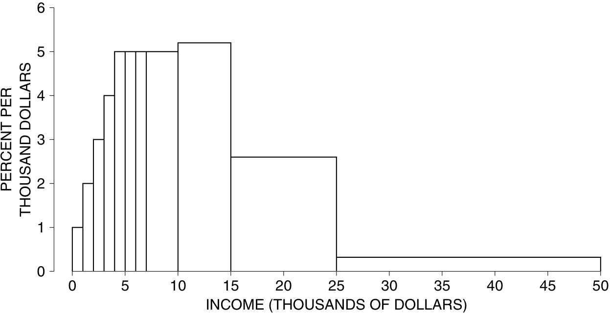

Quy trình thì khá đơn giản, nhưng các đơn vị trên thang đo dọc lại hơi phức tạp một chút. Chẳng hạn, để có được chiều cao của khối trên khoảng từ $7,000 đến $10,000, bạn chia 15 phần trăm cho 3 nghìn đô la. Vì vậy, các đơn vị cho câu trả lời là phần trăm trên một nghìn đô la. Hãy nghĩ về chữ “trên” giống như cách bạn đọc thấy rằng có 50,000 người trên một dặm vuông ở Tokyo: trong mỗi dặm vuông của thành phố, có khoảng 50,000 người. Biểu đồ tần suất cũng tương tự như vậy. Chiều cao của khối trên khoảng $7,000 đến $10,000 là 5% trên một nghìn đô la: trong mỗi khoảng một nghìn đô la giữa $7,000 và $10,000, có khoảng 5% số gia đình. Hình 4 cho thấy biểu đồ tần suất hoàn chỉnh với các đơn vị này trên thang đo dọc.

## Bài tập Nhóm B

1. Bảng dưới đây cho thấy phân bố trình độ học vấn của những người từ 25 tuổi trở lên tại Hoa Kỳ vào các năm 1960, 1970 và 1991. (“Trình độ học vấn” có nghĩa là số năm đi học đã hoàn thành.) Các khoảng lớp bao gồm điểm mút bên trái, nhưng không bao gồm điểm mút bên phải; ví dụ, từ dòng thứ hai của bảng, năm 1960 có khoảng 14% số người đã hoàn thành 5–8 năm đi học, không bao gồm 8; năm 1991, có khoảng 4% số người thuộc danh mục này. Hãy vẽ một biểu đồ tần suất cho dữ liệu năm 1991. Bạn có thể diễn giải “16 hoặc nhiều hơn” thành 16–17 năm đi học; không có nhiều người hoàn thành hơn 16 năm học, đặc biệt là vào những năm 1960 và 1970. Tại sao biểu đồ tần suất của bạn lại có những điểm nhô cao ở 8, 12, và 16 năm đi học?

|_Trình độ học vấn_||||
|---|---|---|---|
|_(số năm đi học)_|_1960_|_1970_|_1991_|
|0–5|8|6|2|
|5–8|14|10|4|
|8–9|18|13|4|
|9–12|19|19|11|
|12–13|25|31|39|
|13–16|9|11|18|
|16 trở lên|8|11|21|

Nguồn: Tóm lược Thống kê (Statistical Abstract), 1988, Bảng 202; 1992, Bảng 220.

2. Vẽ lại biểu đồ tần suất cho dữ liệu năm 1991, kết hợp hai khoảng lớp đầu tiên thành một (0–8 năm, với 6% số người). Điều này có làm thay đổi biểu đồ tần suất nhiều không?

3. Vẽ biểu đồ tần suất cho dữ liệu năm 1970, và so sánh nó với biểu đồ tần suất năm 1991. Điều gì đã xảy ra với trình độ học vấn của dân số giữa năm 1970 và 1991 — nó tăng lên, giảm xuống, hay vẫn giữ nguyên ở mức tương đương?

4. Điều gì đã xảy ra với trình độ học vấn từ năm 1960 đến năm 1970?

_Đáp án cho các bài tập này ở trang A46._

### 3. THANG MẬT ĐỘ (THE DENSITY SCALE)

Khi đọc các diện tích trên một biểu đồ tần suất, sẽ rất thuận tiện nếu có một thang đo dọc. Biểu đồ tần suất thu nhập trong phần trước được vẽ bằng cách sử dụng _thang mật độ_ .5 Đơn vị trên trục hoành là $1,000 thu nhập gia đình, và trục tung cho thấy tỷ lệ phần trăm số gia đình trên mỗi $1,000 thu nhập. Hình 5 là một ví dụ khác về biểu đồ tần suất có thang mật độ. Đây là biểu đồ tần suất cho trình độ học vấn của những người từ 25 tuổi trở lên tại Hoa Kỳ vào năm 1991. “Trình độ học vấn” có nghĩa là số năm đi học đã hoàn thành; mẫu giáo không được tính.

Quy ước về điểm mút được tuân theo trong biểu đồ tần suất này hơi cầu kỳ một chút. Chẳng hạn, khối trên khoảng 8–9 năm đại diện cho tất cả những người đã học xong lớp tám, nhưng không học hết lớp chín; những người đã bỏ học giữa chừng trong năm lớp chín

Hình 5. Phân phối số người từ 25 tuổi trở lên tại Hoa Kỳ năm 1991 theo trình độ học vấn.

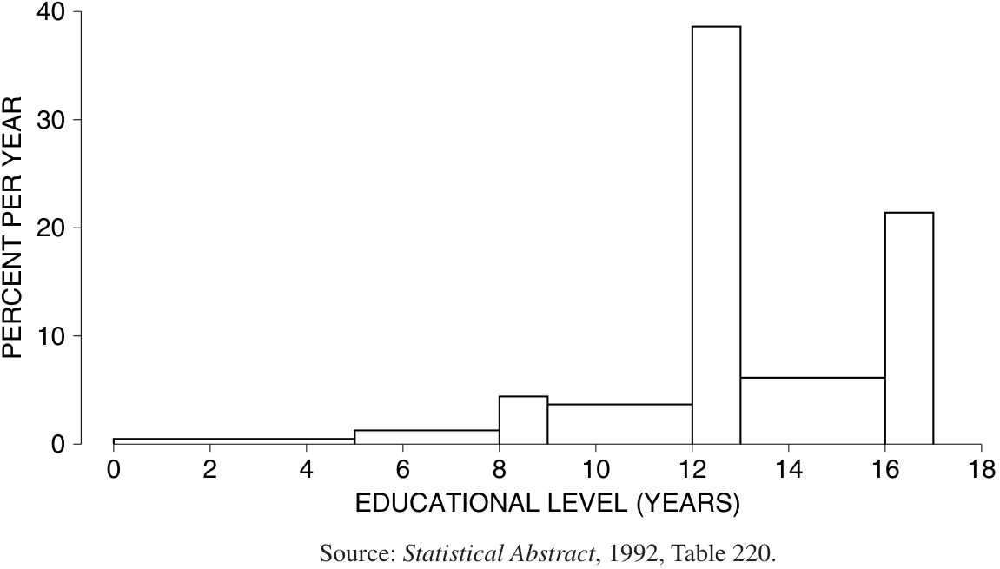

cũng được bao gồm. Các đơn vị trên trục hoành của biểu đồ tần suất là số năm, vì vậy các đơn vị trên trục tung là phần trăm mỗi năm. Chẳng hạn, chiều cao của biểu đồ tần suất trên khoảng 13–16 năm là 6% mỗi năm. Nói cách khác, khoảng 6% dân số đã hoàn thành năm thứ nhất đại học, 6% khác hoàn thành năm thứ hai, và 6% khác nữa hoàn thành năm thứ ba.

Phần 1 đã mô tả cách diện tích trong biểu đồ tần suất đại diện cho tỷ lệ phần trăm như thế nào. Nếu một khối bao phủ một diện tích lớn hơn khối khác, thì nó đại diện cho một tỷ lệ phần trăm các trường hợp lớn hơn. Chiều cao của một khối đại diện cho điều gì? Hãy nhìn vào trục hoành trong hình 5. Hãy tưởng tượng những người đang xếp hàng trên trục này, với mỗi người được bố trí ở trình độ học vấn của họ. Một số phần của trục — các năm — sẽ đông đúc hơn những phần khác. Chiều cao của biểu đồ tần suất cho thấy sự đông đúc.

Biểu đồ tần suất cao nhất trên khoảng 12–13 năm, vì vậy sự đông đúc là lớn nhất ở đó. Khoảng này có tất cả những người có bằng tốt nghiệp trung học phổ thông. (Một số người trong khoảng này có thể đã học tiếp lên đại học, nhưng họ thậm chí còn không hoàn thành năm đầu tiên.) Có hai đỉnh khác, một đỉnh nhỏ ở 8–9 năm (hoàn thành trung học cơ sở) và một đỉnh lớn ở 16–17 năm — hoàn thành đại học. Các đỉnh này cho thấy xu hướng mọi người ngừng việc học của mình ở một trong ba mốc tốt nghiệp khả dĩ thay vì bỏ học giữa chừng.

Lúc đầu, có thể hơi khó để phân biệt khái niệm về sự đông đúc trong một khoảng, được biểu diễn bằng chiều cao của khối, và số lượng trong một khoảng, được biểu diễn bằng diện tích của khối. Một ví dụ sẽ giúp ích. Hãy nhìn vào các khối nằm trên các khoảng 8–9 năm và 9–12 năm trong hình 5. Khối đầu tiên cao hơn một chút, nên khoảng này đông đúc hơn một chút. Tuy nhiên, khối trên 9–12 năm có diện tích lớn hơn nhiều, nên khoảng này có nhiều người hơn nhiều. Tất nhiên, có nhiều không gian hơn trong khoảng thứ hai — nó dài gấp 3 lần. Hai khoảng này giống như Hà Lan và Hoa Kỳ. Hà Lan thì đông đúc hơn, nhưng Hoa Kỳ thì có nhiều người hơn.

Trong một biểu đồ tần suất, chiều cao của một khối đại diện cho sự đông đúc — tỷ lệ phần trăm trên mỗi đơn vị chiều ngang.

Ngược lại, diện tích của khối đại diện cho tỷ lệ phần trăm các trường hợp trong khoảng lớp tương ứng (phần 1).

Một khi bạn học được cách sử dụng nó, thang mật độ có thể khá hữu ích. Ví dụ, lấy khoảng từ 9 đến 12 năm trong hình 5 — những người đã vượt qua năm đầu tiên của trường trung học phổ thông nhưng không tốt nghiệp. Chiều cao của khối trên khoảng này là gần 4% mỗi năm. Nói cách khác, mỗi khoảng trong ba khoảng một năm 9–10, 10–11, và 11–12 chứa gần 4% số người. Vì vậy, toàn bộ khoảng ba năm phải chứa gần 3 × 4% = 12% số người. Gần 12% dân số từ 25 tuổi trở lên đã học qua ít nhất một năm trung học phổ thông, nhưng đã không thể tốt nghiệp.

_Ví dụ 1._ Bản phác thảo dưới đây cho thấy một khối của biểu đồ tần suất thu nhập gia đình của một thành phố nhất định. Khoảng bao nhiêu phần trăm các gia đình trong thành phố có thu nhập từ $15,000 đến $25,000? 

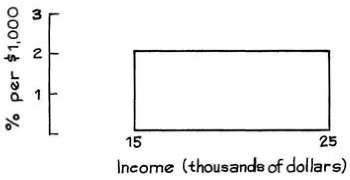

_Giải pháp._ Chiều cao của khối là 2% trên mỗi nghìn đô la. Mỗi khoảng một nghìn đô la giữa $15,000 và $25,000 chứa khoảng 2% số gia đình trong thành phố. Có 10 khoảng một nghìn đô la như vậy giữa $15,000 và $25,000. Câu trả lời là 10 × 2% = 20%. Khoảng 20% các gia đình trong thành phố có thu nhập từ $15,000 đến $25,000. 

Ví dụ này cho thấy rằng với thang mật độ (density scale), diện tích của các khối sẽ tính ra phần trăm. Các đơn vị theo chiều ngang—hàng nghìn đô la—bị triệt tiêu: 

2% trên mỗi nghìn đô la × 10 nghìn đô la = 20% _._ 

_Ví dụ 2._ Ai đó đã phác thảo một biểu đồ tần suất cho cân nặng của một số người, sử dụng thang mật độ. Có điều gì sai? 

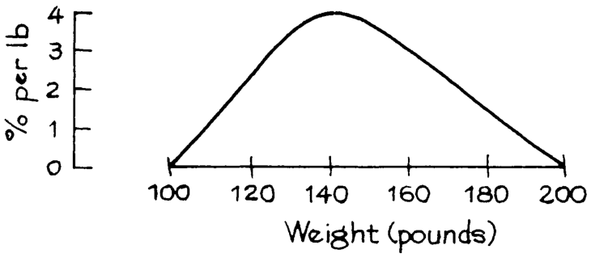

_Giải pháp._ Tổng diện tích là 200%, và đáng lẽ chỉ nên là 100%. Diện tích có thể được tính như sau. Biểu đồ tần suất gần giống như một tam giác, có chiều cao là 4% trên mỗi pound (đơn vị khối lượng) và đáy là 200 lb − 100 lb = 100 lb. Diện tích là 

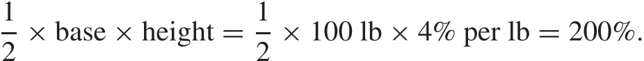

Với thang mật độ trên trục dọc, diện tích của các khối sẽ tính ra bằng phần trăm. Diện tích dưới biểu đồ tần suất trên một khoảng bằng với tỷ lệ phần trăm các trường hợp trong khoảng đó.6 Tổng diện tích dưới biểu đồ tần suất là 100%. 

Kể từ năm 1991, trình độ học vấn ở Mỹ đã tiếp tục tăng lên. Khi đó, 21% dân số có bằng cử nhân trở lên ("dân số" nghĩa là những người từ 25 tuổi trở lên). Vào năm 2005, con số tương ứng là 28%. 

## Bài tập nhóm C 

1. Biểu đồ tần suất tiền lương hàng tháng cho nhân viên bán thời gian được hiển thị bên dưới (mật độ được đánh dấu trong ngoặc đơn). Không ai kiếm được hơn $1,000 một tháng. Khối nằm trên khoảng lớp (class interval) từ $200 đến $500 bị thiếu. Nó phải cao bao nhiêu? 

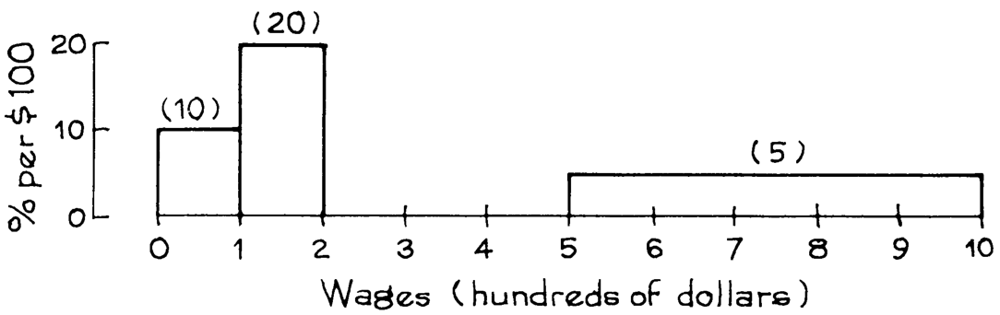

2. Ba người vẽ biểu đồ tần suất cho cân nặng của các đối tượng trong một nghiên cứu, sử dụng thang mật độ. Chỉ có một người đúng. Đó là ai, và tại sao? 

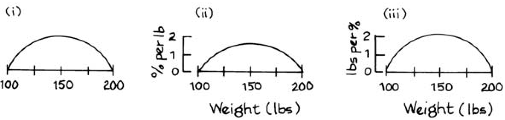

3. Một nhà nghiên cứu vẽ một biểu đồ tần suất cho một số dữ liệu chiều cao, sử dụng hệ mét. Cô ấy đang làm việc bằng centimet (cm). Trục dọc hiển thị mật độ và đỉnh của trục dọc là 10 phần trăm mỗi cm. Bây giờ cô ấy muốn chuyển đổi sang milimet (mm). Có 10 milimet trong một centimet. Trên trục ngang, cô ấy phải đổi 175 cm thành mm, và 200 cm thành mm. Trên trục dọc, cô ấy phải đổi 10 phần trăm mỗi cm thành phần trăm mỗi mm, và 5 phần trăm mỗi cm thành phần trăm mỗi mm. 

4. Trong một nghiên cứu của Cơ quan Y tế Công cộng, một biểu đồ tần suất đã được vẽ cho thấy số lượng thuốc lá hút mỗi ngày của từng đối tượng (những người nam hiện đang hút thuốc), như được trình bày bên dưới.7 Mật độ được đánh dấu trong ngoặc đơn. Các khoảng lớp bao gồm điểm cuối bên phải, không phải điểm cuối bên trái. 

   - (a) Tỷ lệ phần trăm những người hút 10 điếu thuốc trở xuống mỗi ngày là khoảng 
 &nbsp;&nbsp;&nbsp;&nbsp;&nbsp;&nbsp;&nbsp;&nbsp;1,5% &nbsp;&nbsp;&nbsp;&nbsp; 15% &nbsp;&nbsp;&nbsp;&nbsp; 30% &nbsp;&nbsp;&nbsp;&nbsp; 50%

   - (b) Tỷ lệ phần trăm những người hút hơn một bao một ngày, nhưng không quá 2 bao, là khoảng 
 &nbsp;&nbsp;&nbsp;&nbsp;&nbsp;&nbsp;&nbsp;&nbsp;1,5% &nbsp;&nbsp;&nbsp;&nbsp; 15% &nbsp;&nbsp;&nbsp;&nbsp; 30% &nbsp;&nbsp;&nbsp;&nbsp; 50%

     (Có 20 điếu thuốc trong một bao.)

   - (c) Tỷ lệ phần trăm những người hút hơn một bao một ngày là khoảng 
 &nbsp;&nbsp;&nbsp;&nbsp;&nbsp;&nbsp;&nbsp;&nbsp;1,5% &nbsp;&nbsp;&nbsp;&nbsp; 15% &nbsp;&nbsp;&nbsp;&nbsp; 30% &nbsp;&nbsp;&nbsp;&nbsp; 50%

   - (d) Tỷ lệ phần trăm những người hút hơn 3 bao một ngày là khoảng 
 &nbsp;&nbsp;&nbsp;&nbsp;&nbsp;&nbsp;&nbsp;&nbsp;0,25 của 1% &nbsp;&nbsp;&nbsp;&nbsp; 0,5 của 1% &nbsp;&nbsp;&nbsp;&nbsp; 10%

   - (e) Tỷ lệ phần trăm những người hút 15 điếu thuốc mỗi ngày là khoảng 
 &nbsp;&nbsp;&nbsp;&nbsp;&nbsp;&nbsp;&nbsp;&nbsp;0,35 của 1% &nbsp;&nbsp;&nbsp;&nbsp; 0,5 của 1% &nbsp;&nbsp;&nbsp;&nbsp; 1,5% &nbsp;&nbsp;&nbsp;&nbsp; 3,5% &nbsp;&nbsp;&nbsp;&nbsp; 10%

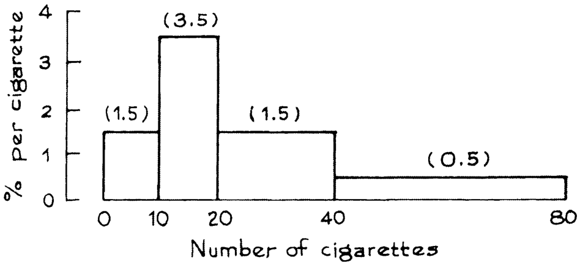

_Đáp án cho các bài tập này có ở trang A46._ 

### 4. BIẾN SỐ 

Cuộc Khảo sát Dân số Hiện tại bao gồm nhiều biến số khác ngoài thu nhập. Một _biến số (variable)_ là một đặc điểm thay đổi từ người này sang người khác trong một nghiên cứu. Những người phỏng vấn cho cuộc khảo sát sử dụng một loạt các câu hỏi: Bạn bao nhiêu tuổi? Gia đình bạn có bao nhiêu người? Tổng thu nhập của gia đình bạn là bao nhiêu? Bạn đã kết hôn chưa? Bạn có việc làm không? Các biến số tương ứng sẽ là: tuổi, quy mô gia đình, thu nhập gia đình, tình trạng hôn nhân và tình trạng việc làm. Một số câu hỏi được trả lời bằng cách đưa ra một con số: các biến số tương ứng là _định lượng (quantitative)_ . Tuổi, quy mô gia đình và thu nhập gia đình là những ví dụ về các biến số định lượng. Một số câu hỏi được trả lời bằng một từ hoặc cụm từ mô tả, và các biến số tương ứng là _định tính (qualitative)_ : ví dụ như tình trạng hôn nhân (độc thân, đã kết hôn, góa bụa, 

BIẾN SỐ 

ly hôn, ly thân) và tình trạng việc làm (có việc làm, thất nghiệp, không nằm trong lực lượng lao động). 

Các biến định lượng có thể là _rời rạc (discrete)_ hoặc _liên tục (continuous)_ . Đây không phải là một sự phân biệt cứng nhắc, nhưng nó rất hữu ích.8 Đối với một biến rời rạc, các giá trị chỉ có thể khác nhau theo các lượng cố định. Quy mô gia đình là rời rạc. Hai gia đình có thể khác nhau về quy mô là 0 hoặc 1 hoặc 2, v.v. Không có gì ở giữa là có thể xảy ra. Tuổi, mặt khác, là một biến liên tục. Điều này không đề cập đến thực tế là một người đang liên tục già đi; nó chỉ có nghĩa là sự khác biệt về tuổi tác giữa hai người có thể nhỏ tùy ý—một năm, một tháng, một ngày, một giờ, _. . ._ Cuối cùng, các thuật ngữ _định tính_ , _định lượng_ , _rời rạc_ , và _liên tục_ cũng được sử dụng để mô tả dữ liệu—dữ liệu định tính được thu thập trên một biến định tính, v.v. 

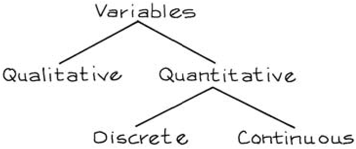

Phần 2 đã chỉ ra cách vẽ một biểu đồ tần suất bắt đầu từ một bảng phân phối. Thông thường, điểm khởi đầu là dữ liệu thô—một danh sách các trường hợp (cá nhân, gia đình, trường học, v.v.) và các giá trị tương ứng của biến số. Để vẽ biểu đồ tần suất, một bảng phân phối phải được chuẩn bị. Bước đầu tiên là chọn các khoảng lớp (class intervals). Có quá nhiều hoặc quá ít khoảng thì biểu đồ tần suất sẽ không cung cấp nhiều thông tin. Không có quy tắc nào cả, nó là vấn đề của sự đánh giá hoặc thử và sai. Thông thường người ta bắt đầu với mười hoặc mười lăm khoảng lớp và làm tiếp từ đó. Trong cuốn sách này, các khoảng lớp sẽ luôn được cho sẵn.9 

Khi vẽ một biểu đồ tần suất cho một biến liên tục, các nhà nghiên cứu cũng phải quyết định quy ước về điểm cuối (endpoint convention)—phải làm gì với các trường hợp rơi ngay trên ranh giới. Đối với một biến rời rạc, có một quy ước giúp khắc phục sự phiền toái này: đặt tâm của các khoảng lớp tại các giá trị có thể xảy ra. Ví dụ, quy mô gia đình có thể là 2 hoặc 3 hoặc 4, v.v. (Cục Điều tra Dân số không công nhận một người là một gia đình.) Các khoảng lớp tương ứng trong bảng phân phối sẽ là 

|_Tâm_ _Khoảng_|_lớp_|
|---|---|
|2 1.5|đến 2.5|
|3 2.5|đến 3.5|
|4 3.5|đến 4.5|
|·|·|
|· ·|· ·|

Vì một gia đình không thể có 2.5 thành viên, nên không có vấn đề gì với các điểm cuối. Hình 6 (ở trang tiếp theo) cho thấy biểu đồ tần suất cho quy mô gia đình. Các thanh dường như dừng lại ở 8; đó là bởi vì có rất ít gia đình có 9 người trở lên. 

#### 44 BIỂU ĐỒ TẦN SUẤT 

Hình 6. Biểu đồ tần suất thể hiện sự phân bố của các gia đình theo quy mô vào năm 2005. Với một biến rời rạc, các khoảng lớp được lấy tâm tại các giá trị có thể xảy ra. 

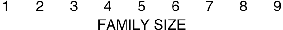

Nguồn: Khảo sát Dân số Hiện tại tháng 3 năm 2005; CD-ROM do Cục Điều tra Dân số cung cấp. 

## Bài tập Nhóm D 

1. Phân loại từng biến sau đây thành định tính hoặc định lượng; nếu là định lượng, hãy phân loại thành rời rạc hoặc liên tục. 

   - (a) nghề nghiệp (b) khu vực cư trú (c) cân nặng 

   - (d) chiều cao (e) số lượng ô tô sở hữu 

2. Trong Khảo sát Dân số Hiện tại tháng 3, phụ nữ được hỏi họ có bao nhiêu người con. Kết quả được hiển thị dưới đây đối với phụ nữ ở độ tuổi 25–39, theo trình độ học vấn. 

   - (a) Số lượng người con là rời rạc hay liên tục? 

   - (b) Vẽ biểu đồ tần suất cho dữ liệu này. (Bạn có thể coi “5 trở lên” là 5—rất ít phụ nữ có nhiều hơn 5 người con.) 

   - (c) Bạn kết luận được điều gì? 

_Phân bố của phụ nữ độ tuổi 25–39 theo trình độ học vấn và số người con (phần trăm)._ 

|_Số_|_Phụ nữ là_|_Phụ nữ có_|
|---|---|---|
|_người con_|_tốt nghiệp trung học_|_bằng đại học_|
|0|30.2|47.9|
|1|21.8|19.4|
|2|28.4|22.7|
|3|13.7|8.0|
|4|4.4|1.5|
|5 trở lên|1.5|0.5|

Lưu ý: Những người tốt nghiệp trung học không học lên cao. Bằng đại học ở cấp độ Cử nhân Nghệ thuật (B.A.) hoặc Cử nhân Khoa học Tự nhiên (B.Sc.). Con ruột, chưa từng kết hôn dưới 18 tuổi. Các tỷ lệ phần trăm có thể không cộng lại thành 100% do làm tròn. Nguồn: Khảo sát Dân số Hiện tại tháng 3 năm 2005; CD-ROM do Cục Điều tra Dân số cung cấp. 

_Đáp án cho các bài tập này nằm ở trang A47._ 

KIỂM SOÁT MỘT BIẾN 

### 5. KIỂM SOÁT MỘT BIẾN 

Vào những năm 1960, nhiều phụ nữ bắt đầu sử dụng thuốc tránh thai đường uống, hay còn gọi là "thuốc viên" (the pill). Vì thuốc viên làm thay đổi sự cân bằng hormone của cơ thể, nên việc tìm hiểu các tác dụng phụ là rất quan trọng. Nghiên cứu về vấn đề này được thực hiện bởi Nghiên cứu Thuốc Tránh thai tại Phòng khám Kaiser ở Walnut Creek, California. Hơn 20.000 phụ nữ trong khu vực Walnut Creek tham gia Chương trình Chăm sóc Sức khỏe Tổ chức Kaiser, trả phí bảo hiểm hàng tháng và nhận các dịch vụ y tế từ Kaiser. Một trong những dịch vụ này là kiểm tra sức khỏe định kỳ gọi là "multiphasic" (khám sức khỏe tổng quát đa pha). Trong khoảng thời gian 1969–1971, khoảng 17.500 phụ nữ trong độ tuổi 17–58 đã tham gia khám multiphasic và trở thành đối tượng của Nghiên cứu Thuốc. Các nhà điều tra đã so sánh kết quả khám multiphasic của hai nhóm phụ nữ khác nhau: 

- "người sử dụng" có dùng thuốc viên (nhóm can thiệp - treatment group); 

- "người không sử dụng" không dùng thuốc viên (nhóm đối chứng - control group). 

Hình 7. Tác động của thuốc viên. Khung trên cùng hiển thị các biểu đồ tần suất cho huyết áp tâm thu của 1.747 người sử dụng và 3.040 người không sử dụng ở độ tuổi 25–34 trong Nghiên cứu Thuốc Tránh thai. Khung dưới cùng hiển thị biểu đồ tần suất của những người không sử dụng được dịch chuyển sang phải 5 mm. 

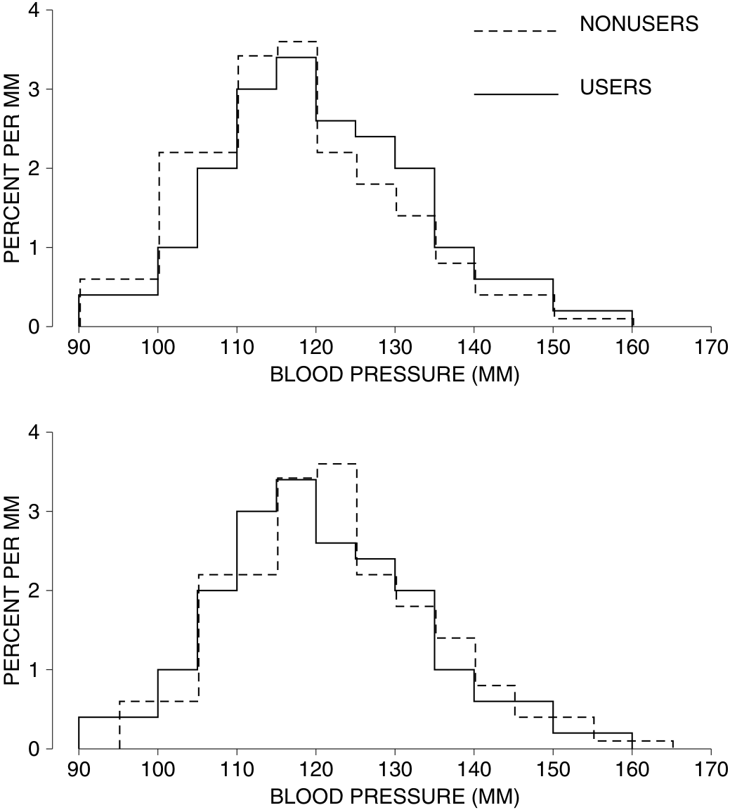

Đây là một nghiên cứu quan sát. Chính những người phụ nữ mới là người quyết định có nên dùng thuốc hay không. Các nhà điều tra chỉ quan sát những gì xảy ra. 

Một vấn đề là tác động của thuốc viên đối với huyết áp. Việc so sánh huyết áp của những người sử dụng và những người không sử dụng có vẻ là điều tự nhiên. Tuy nhiên, điều này có thể gây hiểu nhầm. Huyết áp có xu hướng tăng theo độ tuổi, và những người không sử dụng nhìn chung có độ tuổi cao hơn so với những người sử dụng. Ví dụ, khoảng 70% người không sử dụng trên 30 tuổi, so với 50% ở người sử dụng. Tác động của độ tuổi bị làm nhiễu (confounded) với tác động của thuốc viên. Để làm cho tác động đầy đủ của thuốc viên trở nên rõ ràng, cần phải thực hiện so sánh riêng biệt cho từng nhóm tuổi: việc này là để kiểm soát độ tuổi.10 Chúng ta sẽ chỉ xem xét phụ nữ ở độ tuổi 25–34. Hình 7 hiển thị các biểu đồ tần suất cho những người sử dụng và người không sử dụng trong nhóm tuổi này. (Huyết áp được đo tương đối theo chiều dài của một cột thủy ngân; đơn vị là "mm", tức là milimet.) 

Hai biểu đồ tần suất ở khung trên cùng của hình 7 có hình dạng rất giống nhau. Tuy nhiên, biểu đồ của người sử dụng lại cao hơn ở phía bên phải mốc 120 mm và thấp hơn ở phía bên trái. Huyết áp cao (trên 120 mm) phổ biến hơn ở những người sử dụng, và huyết áp thấp ít phổ biến hơn. Bây giờ hãy tưởng tượng rằng 5 mm được cộng thêm vào huyết áp của mỗi người không sử dụng. Điều đó sẽ dịch chuyển biểu đồ tần suất của họ sang phải 5 mm, như được thể hiện ở khung dưới cùng của hình 7. Ở khung dưới cùng, hai biểu đồ tần suất khớp với nhau khá tốt. Theo như các biểu đồ tần suất cho thấy, có vẻ như việc sử dụng thuốc viên cộng thêm khoảng 5 mm vào huyết áp của mỗi người phụ nữ. 

Kết luận này phải được xem xét một cách thận trọng. Kết quả của Nghiên cứu Thuốc Tránh thai cho thấy rằng nếu một phụ nữ bắt đầu dùng thuốc viên, huyết áp của cô ấy sẽ tăng khoảng 5 mm. Nhưng bằng chứng không hoàn toàn chắc chắn. Nó không thể hoàn chỉnh được, vì thiết kế nghiên cứu. Nghiên cứu Thuốc là một nghiên cứu quan sát, không phải là một thí nghiệm có đối chứng (controlled experiment). Phần I đã chỉ ra rằng các nghiên cứu quan sát có thể gây hiểu lầm về các mối quan hệ nhân-quả (cause-and-effect). Có thể có một số yếu tố nào đó ngoài thuốc viên hoặc độ tuổi, hiện chưa được xác định, đang ảnh hưởng đến huyết áp. Đối với Nghiên cứu Thuốc này, điều đó có phần xa vời. Cơ chế sinh lý mà theo đó thuốc viên ảnh hưởng đến huyết áp đã được thiết lập rõ ràng. Dữ liệu của Nghiên cứu Thuốc cho thấy quy mô của sự ảnh hưởng. 

## Bài tập Nhóm E 

1. Bên lề nghiên cứu, Nghiên cứu Thuốc đã so sánh huyết áp của những phụ nữ có số lượng người con khác nhau. Dưới đây là các bản phác thảo của biểu đồ tần suất cho phụ nữ có 2 hoặc 4 người con. Nhóm nào có huyết áp cao hơn? Có phải việc có con làm cho huyết áp của các bà mẹ thay đổi không? Hay sự thay đổi này có thể là do một số yếu tố khác, mà tác động của nó bị nhiễu với tác động của việc có con? 

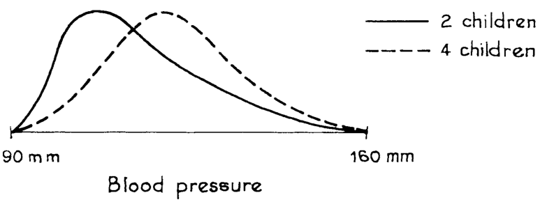

2. (Giả định.) Các bản phác thảo ở trang tiếp theo cho thấy kết quả từ hai nghiên cứu khác 

về thuốc viên, đối với phụ nữ độ tuổi 25–29. Trong một nghiên cứu, thuốc viên cộng thêm khoảng 10 mm vào huyết áp; trong nghiên cứu kia, thuốc viên cộng thêm khoảng 10%. Biểu đồ nào tương ứng với nghiên cứu nào, và tại sao? 

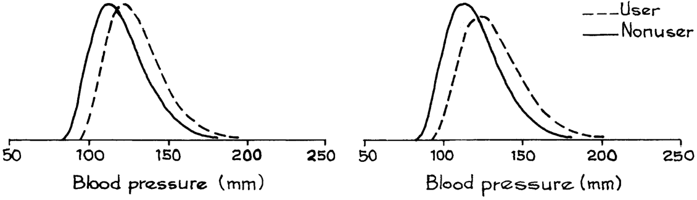

_Đáp án cho các bài tập này nằm ở trang A47._ 

### 6. LẬP BẢNG CHÉO 

Phần trước đã giải thích cách kiểm soát tác động của độ tuổi: đó là vấn đề thực hiện so sánh một cách riêng biệt cho từng nhóm tuổi. Sự so sánh được thực hiện bằng đồ thị, thông qua các biểu đồ tần suất ở hình 7. Một số nhà điều tra thích thực hiện so sánh dưới dạng bảng, sử dụng cái được gọi là _bảng chéo_ (cross-tab, viết tắt của _lập bảng chéo_ - cross-tabulation). Một bảng chéo cho huyết áp theo độ tuổi và việc sử dụng thuốc viên được hiển thị trong bảng 2. Những bảng như vậy có vẻ hơi đồ sộ, và mắt thường có xu hướng bỏ qua 

Bảng 2. Huyết áp tâm thu theo độ tuổi và việc sử dụng thuốc viên, đối với phụ nữ trong Nghiên cứu Thuốc Tránh thai, ngoại trừ những người đang mang thai hoặc dùng thuốc nội tiết tố khác không phải là thuốc viên. Các khoảng lớp bao gồm điểm mút bên trái, nhưng không bao gồm điểm mút bên phải. – có nghĩa là không đáng kể. Các số liệu trong bảng được tính bằng phần trăm; các cột có thể không cộng lại thành 100 do làm tròn. 

|_Huyết_ _áp_ _(milimet)_|_Độ tuổi 1_ _Người không_ _sử dụng_|_7–24_ _Người sử_ _dụng_|_Độ tuổi 2_ _Người không_ _sử dụng_|_5–34_ _Người sử_ _dụng_|_Độ tuổi 3_ _Người không_ _sử dụng_|_5–44_ _Người sử_ _dụng_|_Độ tuổi_ _Người không_ _sử dụng_|_45–58_ _Người sử_ _dụng_|
|---|---|---|---|---|---|---|---|---|
||(%)|(%)|(%)|(%)|(%)|(%)|(%)|(%)|
|dưới 90|–|1|1|–|1|1|1|–|
|90–95|1|–|1|–|2|1|1|1|
|95–100|3|1|5|4|5|4|4|2|
|100–105|10|6|11|5|9|5|6|4|
|105–110|11|9|11|10|11|7|7|7|
|110–115 |15 |12 |17 |15 |15 |12 |11 |10 |
|115–120|20|16|18|17|16|14|12|9|
|120–125|13|14|11|13|9|11|9|8|
|125–130|10|14|9|12|10|11|11|11|
|130–135|8|12|7|10|8|10|10|9|
|135–140|4|6|4|5|5|7|8|8|
|140–145|3|4|2|4|4|6|7|9|
|145–150|2|2|2|2|2|5|7|9|
|150–155|–|1|1|1|1|3|2|4|
|155–160|–|–|–|1|1|1|1|3|
|160 trở lên|–|–|–|–|1|2|2|5|
|Tổng phần trăm|100|98|100|99|100|100|99|99|
|Tổng số|1,206|1,024|3,040|1,747|3,494|1,028|2,172|437|

chúng cho đến khi cần đến một số con số nào đó. Tuy nhiên, tất cả những gì bảng chéo (cross-tab) thể hiện chỉ là một bảng phân phối huyết áp, được lập riêng cho người sử dụng và người không sử dụng thuốc trong từng nhóm tuổi. 

Hãy nhìn vào các cột của nhóm tuổi 17–24. Có 1.206 người không sử dụng và 1.024 người sử dụng. Khoảng 1% người sử dụng có huyết áp dưới 90 mm; tỷ lệ phần trăm tương ứng ở những người không sử dụng là không đáng kể—đó là ý nghĩa của dấu gạch ngang. Để xem tác động của thuốc tránh thai lên huyết áp của phụ nữ từ 17–24 tuổi, vấn đề là nhìn vào các phần trăm trong cột dành cho người không sử dụng và người sử dụng ở nhóm tuổi 17–24. Để xem tác động của tuổi tác, trước tiên hãy nhìn vào cột những người không sử dụng trong từng nhóm tuổi và xem các phần trăm dịch chuyển thế nào về phía huyết áp cao khi tuổi tăng lên. Sau đó làm tương tự với những người sử dụng. 

## Bài tập Nhóm F 

1. Sử dụng bảng 2 để trả lời các câu hỏi sau. 

   - (a) Tỷ lệ phần trăm người sử dụng ở độ tuổi 17–24 có huyết áp từ 140 mm trở lên là bao nhiêu? 

   - (b) Tỷ lệ phần trăm người không sử dụng ở độ tuổi 17–24 có huyết áp từ 140 mm trở lên là bao nhiêu? 

   - (c) Bạn có kết luận gì? 

2. Vẽ biểu đồ histogram cho huyết áp của những người sử dụng và không sử dụng ở độ tuổi 17–24. Bạn rút ra kết luận gì? 

3. So sánh các biểu đồ histogram về huyết áp của những người không sử dụng ở độ tuổi 17–24 và những người không sử dụng ở độ tuổi 25–34. Bạn rút ra kết luận gì? 

_Đáp án cho các bài tập này nằm ở trang A47._ 

### 7. LAI GIỐNG CHỌN LỌC 

Năm 1927, nhà tâm lý học Charles Spearman đã xuất bản cuốn _The Abilities of Man_ (Năng lực của con người), lý thuyết của ông về trí thông minh của con người. Tóm tắt lại, Spearman cho rằng điểm kiểm tra các năng lực trí tuệ (như đọc hiểu, số học, hoặc nhận thức không gian) là tổng có trọng số của hai thành phần độc lập: một yếu tố trí thông minh chung (general intelligence factor) mà Spearman gọi là “g,” và một yếu tố năng lực đặc thù cho từng bài kiểm tra. Lý thuyết này đã thu hút được rất nhiều sự chú ý. 

Là một phần trong nghiên cứu tiến sĩ của mình tại khoa tâm lý học trường Berkeley, Robert Tryon đã quyết định kiểm tra lý thuyết này trên một quần thể động vật, nơi mà việc kiểm soát các biến ngoại lai đơn giản hơn.11 Tryon đã sử dụng chuột, loài động vật rất dễ nhân giống trong phòng thí nghiệm. Để kiểm tra trí thông minh của chúng, ông đưa những con chuột vào một mê cung. Khi chạy trong mê cung, những con chuột mắc lỗi bằng cách đi vào các ngõ cụt. Bài kiểm tra bao gồm 19 lần chạy qua mê cung; "điểm trí thông minh" của con vật là tổng số 

LAI GIỐNG CHỌN LỌC 

lỗi mà nó mắc phải. Do đó, những con chuột thông minh là những con có điểm thấp, còn những con chậm chạp là những con có điểm cao. Tryon bắt đầu với 142 con chuột, và phân phối điểm trí thông minh của chúng được phác họa trong hình 8. 

Hình 8. Thí nghiệm của Tryon. Phân phối trí thông minh trong quần thể ban đầu. 

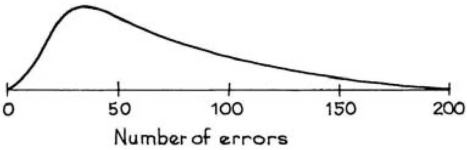

Bước tiếp theo trong thí nghiệm là lai giống nhằm phát triển trí thông minh. Trong mỗi thế hệ, những con chuột "thông minh trong mê cung" (maze-bright - những con mắc rất ít lỗi) được cho lai tạo với nhau. Tương tự, những con vật "chậm chạp trong mê cung" (maze-dull - có điểm số cao) cũng được lai tạo cùng nhau. Bảy thế hệ sau, Tryon đã có 85 con chuột thuộc dòng thông minh trong mê cung, và 68 con thuộc dòng chậm chạp trong mê cung. Có một sự tách biệt rõ ràng về điểm số. Hình 9 cho thấy phân phối trí thông minh của hai nhóm này, và các biểu đồ histogram của chúng hầu như không chồng lấp lên nhau. (Thực tế, Tryon đã tiếp tục lai giống chọn lọc qua thế hệ thứ bảy, nhưng không nhận được thêm nhiều sự tách biệt về điểm số nữa.) 

Hình 9. Thí nghiệm của Tryon. Sau bảy thế hệ lai giống chọn lọc, có một sự tách biệt rõ ràng thành các dòng "thông minh trong mê cung" và "chậm chạp trong mê cung". 

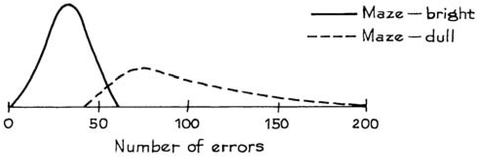

Hai dòng được tạo ra bởi Tryon đã được sử dụng cho nhiều thí nghiệm khác của khoa tâm lý học trường Berkeley. Nhiều thế hệ sau, những con chuột từ quần thể thông minh trong mê cung vẫn tiếp tục vượt trội hơn những con chậm chạp trong việc chạy mê cung. Do đó, Tryon đã thành công trong việc lai tạo cho một năng lực trí tuệ—bằng chứng cho thấy một số năng lực trí tuệ ít nhất một phần được quyết định bởi di truyền. Thí nghiệm này cho thấy điều gì về lý thuyết của Spearman? Tryon phát hiện ra rằng những con chuột thông minh trong mê cung không làm tốt hơn những con chậm chạp trong các bài kiểm tra trí thông minh khác của động vật, chẳng hạn như phân biệt giữa các hình khối hình học, hoặc giữa các cường độ ánh sáng. Đây là bằng chứng chống lại lý thuyết của Spearman về một yếu tố trí thông minh chung (ít nhất là đối với chuột). Mặt khác, Tryon đã tìm thấy những khác biệt tâm lý thú vị giữa hai quần thể chuột. Những con "thông minh" có vẻ là những cá thể hướng nội, không thích giao du, thích nghi tốt với cuộc sống trong mê cung, nhưng lại bị loạn thần kinh trong các mối quan hệ với những con chuột khác. Những con "chậm chạp" thì hoàn toàn ngược lại. 

### 8. BÀI TẬP ÔN TẬP 

_Các bài tập ôn tập có thể bao gồm tài liệu từ những chương trước._ 

1. Hình dưới đây cho thấy một biểu đồ histogram về chiều cao của một mẫu đại diện gồm các nam giới. Phần diện tích bị gạch chéo đại diện cho tỷ lệ phần trăm nam giới có chiều cao nằm giữa và . Hãy điền vào các chỗ trống. 

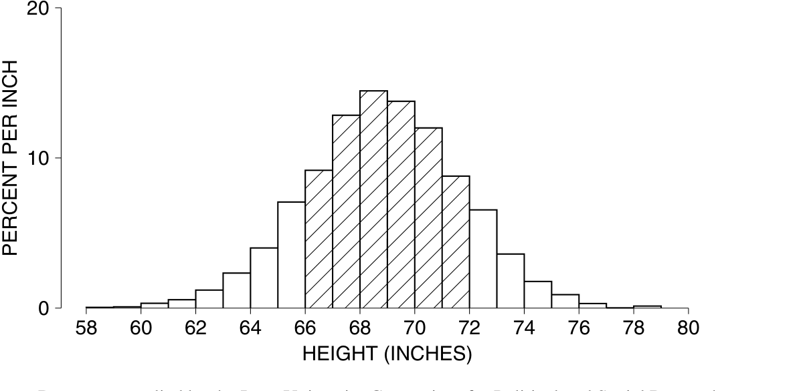

Nguồn: Cuộn băng dữ liệu do Hiệp hội Liên trường Đại học về Nghiên cứu Chính trị và Xã hội cung cấp. 

2. Phân phối độ tuổi của người dân ở Hoa Kỳ năm 2004 được hiển thị bên dưới. Hãy vẽ biểu đồ histogram. (Các khoảng lớp bao gồm điểm mút trái, nhưng không bao gồm điểm mút phải; ví dụ, ở dòng thứ hai của bảng, 14% số người từ 5 tuổi trở lên nhưng chưa bước sang tuổi 15. Khoảng dành cho “75 và lớn hơn” có thể kết thúc ở 85. Nam giới và nữ giới được gộp chung trong dữ liệu.) Sử dụng biểu đồ histogram của bạn để trả lời các câu hỏi sau. 

   - (a) Có nhiều trẻ em 1 tuổi hơn, hay nhiều người lớn tuổi 71 tuổi hơn? 

   - (b) Có nhiều người 21 tuổi hơn, hay nhiều người 61 tuổi hơn? 

   - (c) Có nhiều người từ độ tuổi 0–4 hơn, hay 65–69 tuổi hơn? 

   - (d) Tỷ lệ phần trăm số người từ 35 tuổi trở lên vào khoảng 25%, 50% hay 75%? 

|_Tuổi_|_Phần trăm_ _dân số_|_Tuổi_|_Phần trăm_ _dân số_|
|---|---|---|---|
|0–5|7|35–45|15|
|5–15|14|45–55|14|
|15–20|7|55–65|10|
|20–25|7|65–75|6|
|25–30|7|75 trở lên|6|
|30–35|7|||

Nguồn: _Statistical Abstract_ (Tóm tắt Thống kê) , 2006, Bảng 11. 

3. Cuộc khảo sát Nhà ở Mỹ được thực hiện hàng năm bởi Cục Điều tra Dân số. Dữ liệu từ cuộc khảo sát năm 2003 có thể được sử dụng để tìm phân phối của các đơn vị nhà ở đang có người ở (bao gồm cả các căn hộ) theo số phòng. Kết quả cho toàn bộ Hoa Kỳ được hiển thị bên dưới, phân tách riêng biệt cho nhóm "do chủ sở hữu ở" và "do người thuê 

BÀI TẬP ÔN TẬP 

ở". Hãy vẽ một biểu đồ histogram cho mỗi phân phối trong số hai phân phối này. (Bạn có thể giả định rằng "10 hoặc nhiều hơn" có nghĩa là 10 hoặc 11; rất ít đơn vị nhà ở có nhiều hơn 11 phòng.) 

- (a) Các phần trăm do chủ sở hữu ở cộng lại thành 100,2% trong khi các phần trăm do người thuê ở cộng lại thành 100,0%. Tại sao? 

- (b) Tỷ lệ phần trăm các đơn vị nhà ở một phòng nhỏ hơn rất nhiều đối với những nhà do chủ sở hữu ở. Có phải vì có nhiều nhà do chủ sở hữu ở hơn tổng số không? Trả lời có hoặc không, và giải thích ngắn gọn. 

- (c) Nhìn chung, nhóm nào lớn hơn: những nhà do chủ sở hữu ở hay những nhà do người thuê ở? 

|_Số phòng_|_Do chủ sở hữu ở_|_Do người thuê ở_|
|---|---|---|
|_trong nhà_|_(phần trăm)_|_(phần trăm)_|
|1|0,0|1,0|
|2|0,1|2,8|
|3|1,4|22,7|
|4|9,7|34,5|
|5|23,3|22,6|
|6|26,4|10,4|
|7|17,5|3,6|
|8|10,4|1,2|
|9|5,0|0,5|
|10 trở lên|6,4|0,7|
|Tổng cộng|100,2|100,0|
|Số lượng|72,2 triệu|33,6 triệu|

Nguồn: www.census.gov/hhres/www/housing/ahs/nationaldata.html 

4. Hình dưới đây là một biểu đồ histogram thể hiện phân phối huyết áp của tất cả 14.148 phụ nữ trong Nghiên cứu Thuốc (phần 5). Hãy sử dụng biểu đồ histogram để trả lời các câu hỏi sau: 

   - (a) Có phải tỷ lệ phần trăm phụ nữ có huyết áp trên 130 mm vào khoảng 25%, 50% hay 75%? 

   - (b) Có phải tỷ lệ phần trăm phụ nữ có huyết áp trong khoảng từ 90 mm đến 160 mm vào khoảng 1%, 50% hay 99%? 

   - (c) Khoảng nào có nhiều phụ nữ hơn: 135–140 mm hay 140–150 mm? 

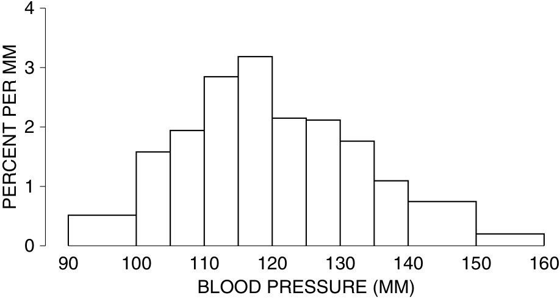

   - (d) Khoảng nào đông đúc hơn: 135–140 mm hay 140–150 mm? 

   - (e) Trên khoảng 125–130 mm, chiều cao của biểu đồ tần suất là khoảng 2.1% mỗi mm. Có bao nhiêu phần trăm phụ nữ có huyết áp trong khoảng lớp này? 

   - (f) Khoảng nào có nhiều phụ nữ hơn: 97–98 mm hay 102–103 mm? 

   - (g) Millimet nào là đông đúc nhất trong tất cả? 

5. Một người đã phác họa một khối của biểu đồ tần suất thu nhập gia đình cho một vùng ngoại ô giàu có. Khoảng bao nhiêu phần trăm số gia đình ở vùng ngoại ô này có thu nhập từ $90,000 đến $100,000 một năm? 

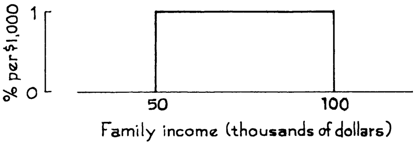

6. (Giả thuyết.) Trong một nghiên cứu, 100 người đã được đo chiều cao chính xác đến một phần tám inch gần nhất. Một biểu đồ tần suất cho các kết quả được hiển thị dưới đây. Hai trong số các danh sách sau đây có biểu đồ tần suất này. Đó là những danh sách nào, và tại sao? 

   - (i) 25 người, cao 67 inch; 50 người, cao 68 inch; 25 người, cao 69 inch. 

   - (ii) 10 người, cao 663 4inch; 15 người, cao 67 1 4inch; 50 người, cao 68 inch; 25 người, cao 69 inch. 

   - (iii) 30 người, cao 67 inch; 40 người, cao 68 inch; 30 người, cao 69 inch. 

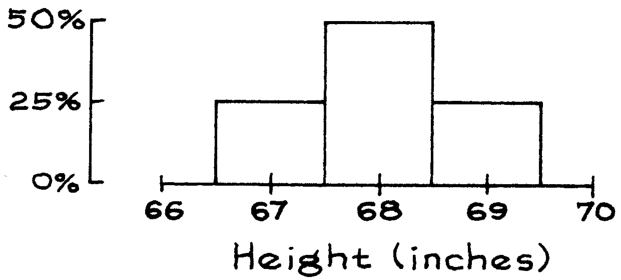

7. Hai biểu đồ tần suất được phác họa dưới đây. Một biểu đồ cho thấy phân phối độ tuổi khi chết do các nguyên nhân tự nhiên (bệnh tim, ung thư, v.v.). Biểu đồ kia cho thấy độ tuổi khi chết do chấn thương (tai nạn, giết người, tự tử). Biểu đồ nào tương ứng với nguyên nhân nào, và tại sao? 

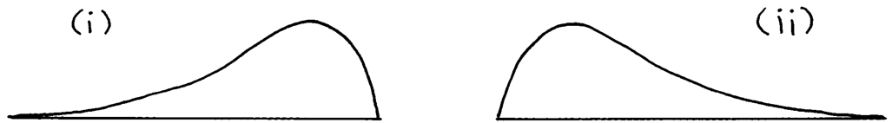

8. Hình ở trang tiếp theo (được điều chỉnh từ _San Francisco Chronicle_ , 18 tháng 5, 1992) cho thấy phân phối gia đình Mỹ theo thu nhập. Các khoảng bao gồm điểm mút trái nhưng không bao gồm điểm mút phải. Ví dụ, 3.7% số gia đình có thu nhập trong khoảng $0–$4,999, 5.8% có thu nhập trong khoảng $5,000–$9,999, v.v. Đúng hay sai, và giải thích: 

BÀI TẬP ÔN TẬP 

- (a) Mặc dù các gia đình Mỹ không được phân bố đều trên toàn bộ phạm vi thu nhập, các gia đình kiếm được từ $10,000 đến $35,000 được phân bố khá đều trên khoảng đó. 

- (b) Các gia đình kiếm được từ $35,000 đến $75,000 được phân bố khá đều trên khoảng đó. 

- (c) Đồ thị này là một biểu đồ tần suất. 

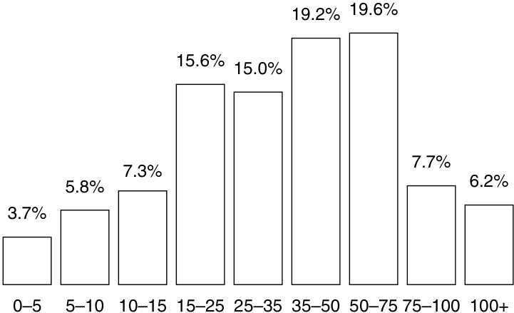

9. Trong một cuộc khảo sát được thực hiện tại Đại học California, Berkeley, một mẫu sinh viên đã được phỏng vấn và hỏi điểm trung bình học tập (GPA) của họ là bao nhiêu. Một biểu đồ tần suất của các kết quả được hiển thị dưới đây. (GPA dao động từ 0 đến 4, và 2 là điểm vừa đủ qua.) 

   - (a) Đúng hay sai: số sinh viên báo cáo GPA trong khoảng 2.0 đến 2.1 nhiều hơn so với trong khoảng 1.5 đến 1.6. 

   - (b) Đúng hay sai: số sinh viên báo cáo GPA trong khoảng 2.0 đến 2.1 nhiều hơn so với trong khoảng 2.5 đến 2.6. 

   - (c) Điều gì giải thích cho sự tăng vọt tại 2? 

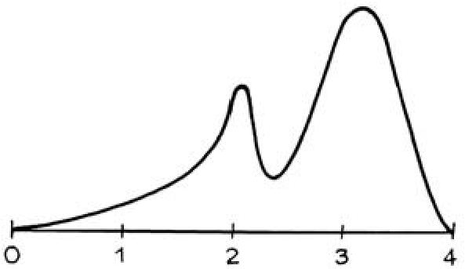

10. Bảng ở trang tiếp theo cho thấy phân phối của người lớn theo chữ số cuối cùng trong tuổi của họ, như được báo cáo trong Cuộc điều tra dân số năm 1880 và Cuộc điều tra dân số năm 1970.12 Bạn có thể kỳ vọng mỗi chữ số trong mười chữ số có thể xuất hiện cho 10% số người, nhưng điều này không đúng. Ví dụ, vào năm 1880, 16.8% tổng số người báo cáo một độ tuổi kết thúc bằng số 0—như 30 hoặc 40 hoặc 50. Vào năm 1970, tỷ lệ này chỉ còn 10.6%. 

   - (a) Vẽ biểu đồ tần suất cho hai phân phối này. 

BIỂU ĐỒ TẦN SUẤT 

- (b) Năm 1880, có một sự ưu tiên mạnh mẽ đối với các chữ số 0 và 5. Điều này có thể được giải thích như thế nào? 

- (c) Năm 1970, sự ưu tiên yếu hơn nhiều. Điều này có thể được giải thích như thế nào? 

- (d) Các chữ số chẵn phổ biến hơn, hay các chữ số lẻ phổ biến hơn, vào năm 1880? 1970? 

|_Chữ số_|_1880_|_1970_|
|---|---|---|
|0|16.8|10.6|
|1|6.7|9.9|
|2|9.4|10.0|
|3|8.6|9.6|
|4|8.8|9.8|
|5|13.4|10.0|
|6|9.4|9.9|
|7|8.5|10.2|
|8|10.2|10.0|
|9|8.2|10.1|

Nguồn: United States Census. 

11. Tại Khu vệ sinh của Chicago (Sanitary District of Chicago), các kỹ sư vận hành được tuyển dụng dựa trên một kỳ thi công chức cạnh tranh. Năm 1966, có 223 người nộp đơn cho 15 vị trí công việc. Kỳ thi được tổ chức vào ngày 12 tháng 3; điểm thi được hiển thị dưới đây, sắp xếp theo thứ tự tăng dần. Chiều cao của mỗi thanh trong biểu đồ tần suất (ở đầu trang tiếp theo) cho thấy số người đạt điểm tương ứng. Các giám khảo đã bị buộc tội gian lận trong kỳ thi.13 Tại sao? 

26 27 27 27 27 29 30 30 30 30 31 31 31 32 32 33 33 33 33 33 34 34 34 35 35 36 36 36 37 37 37 37 37 37 37 39 39 39 39 39 39 39 40 41 42 42 42 42 42 43 43 43 43 43 43 43 43 44 44 44 44 44 44 45 45 45 45 45 45 45 46 46 46 46 46 46 47 47 47 47 47 47 48 48 48 48 48 48 48 48 49 49 49 49 50 50 51 51 51 51 51 52 52 52 52 52 53 53 53 53 53 54 54 54 54 54 55 55 55 56 56 56 56 56 57 57 57 57 58 58 58 58 58 58 58 58 59 59 59 59 60 60 60 60 60 60 61 61 61 61 61 61 62 62 62 63 63 64 65 66 66 66 67 67 67 67 68 68 69 69 69 69 69 69 69 69 71 71 72 73 74 74 74 75 75 76 76 78 80 80 80 80 81 81 81 82 82 83 83 83 83 84 84 84 84 84 84 84 90 90 90 91 91 91 92 92 92 93 93 93 93 95 95 

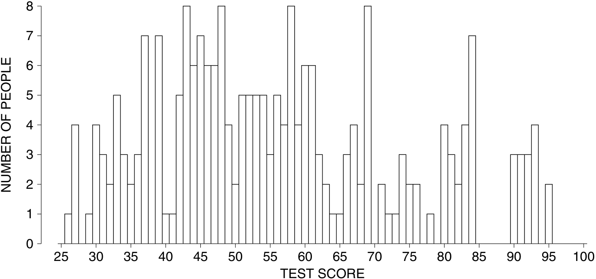

12. Cuối những năm 1960 và đầu những năm 1970 là những năm biến động ở Hoa Kỳ. Các nhà tâm lý học cho rằng bạo loạn có liên quan (trong số những thứ khác) đến nhiệt độ, thời tiết càng nóng thì mọi người càng trở nên hung hăng.14 Tuy nhiên, hai nhà nghiên cứu lập luận rằng "tần suất bạo loạn sẽ tăng theo nhiệt độ cho đến khoảng giữa 80 độ nhưng sau đó giảm mạnh khi nhiệt độ tiếp tục tăng vượt qua mức này." 

Để hỗ trợ lý thuyết của họ, họ đã thu thập dữ liệu về 102 cuộc bạo loạn trong giai đoạn 1967– 71, bao gồm nhiệt độ ở thành phố nơi cuộc bạo loạn diễn ra. Họ đã vẽ một biểu đồ tần suất cho phân phối của các cuộc bạo loạn theo nhiệt độ (một bản phác thảo được hiển thị dưới đây). Có một đỉnh rõ ràng ở khoảng 85◦ . Đúng hay sai, và giải thích: biểu đồ tần suất cho thấy nhiệt độ cao hơn ngăn chặn bạo loạn. 

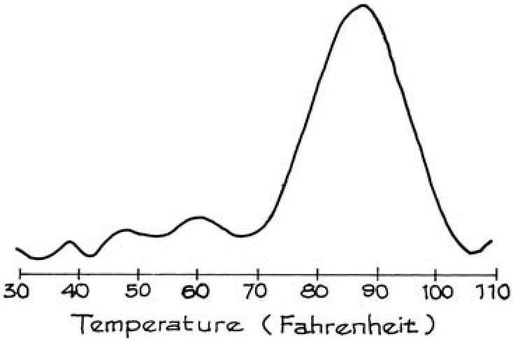

### 9. TÓM TẮT 

1. Một _biểu đồ tần suất_ đại diện cho các phần trăm bằng diện tích. Nó bao gồm một tập hợp các khối. Diện tích của mỗi khối đại diện cho phần trăm số trường hợp trong _khoảng lớp_ tương ứng. 

2. Với _thang đo mật độ_, chiều cao của mỗi khối bằng phần trăm số trường hợp trong khoảng lớp tương ứng, chia cho độ dài của khoảng đó. 

3. Với thang đo mật độ, diện tích được tính bằng phần trăm, và tổng diện tích là 100%. Diện tích dưới biểu đồ tần suất giữa hai giá trị cho biết phần trăm số trường hợp rơi vào khoảng đó. 

4. Một _biến_ là một đặc điểm của các đối tượng trong một nghiên cứu. Nó có thể là _định tính_ hoặc _định lượng_. Một biến định lượng có thể là _rời rạc_ hoặc _liên tục_. 

5. Một yếu tố gây nhiễu đôi khi được kiểm soát bằng cách _lập bảng chéo_. 

