# 4 

## Trung bình và Độ lệch chuẩn (The Average and the Standard Deviation)

_Thật khó hiểu tại sao các nhà thống kê học thường giới hạn các cuộc điều tra của họ ở những Số trung bình (Averages), và không thích thú với những góc nhìn toàn diện hơn. Tâm hồn của họ dường như cũng tẻ nhạt trước sức hấp dẫn của sự đa dạng như tâm hồn của một người bản xứ ở một trong những vùng quê bằng phẳng của nước Anh chúng ta, người mà khi hồi tưởng về Thụy Sĩ đã cho rằng, nếu những ngọn núi của nước này có thể ném xuống các hồ nước của nó, thì hai mối phiền toái sẽ bị loại bỏ cùng một lúc._ 

—SIR FRANCIS GALTON (ANH, 1822–1911)1 

#### 1. GIỚI THIỆU 

Biểu đồ tần suất (histogram) có thể được sử dụng để tóm tắt một lượng lớn dữ liệu. Thông thường, một sự tóm tắt thậm chí còn quyết liệt hơn cũng có thể thực hiện được, chỉ cần đưa ra phần trung tâm (center) của biểu đồ tần suất và độ trải rộng (spread) xung quanh trung tâm đó. ("Trung tâm" và "độ trải rộng" ở đây là những từ thông thường, không mang ý nghĩa kỹ thuật đặc biệt nào). Hai biểu đồ tần suất được phác họa trong hình 1 ở trang tiếp theo. Phần trung tâm và độ trải rộng được hiển thị. Cả hai biểu đồ tần suất đều có cùng phần trung tâm, nhưng biểu đồ thứ hai trải rộng hơn—có nhiều diện tích hơn ở xa trung tâm. Đối với công việc thống kê, các định nghĩa chính xác phải được đưa ra, và có một vài cách để thực hiện điều này. _Trung bình_ (average) thường được sử dụng để tìm phần trung tâm, và _trung vị_ (median) cũng vậy.2 _Độ lệch chuẩn_ (standard deviation) đo lường sự trải rộng xung quanh giá trị trung bình; _khoảng tứ phân vị_ (interquartile range) là một thước đo khác của sự trải rộng. 

Các biểu đồ tần suất trong hình 1 có thể được tóm tắt bằng phần trung tâm và độ trải rộng. Tuy nhiên, mọi việc không phải lúc nào cũng diễn ra tốt đẹp như vậy. Ví dụ, hình 2 cho thấy phân phối độ cao trên bề mặt trái đất. Độ cao được hiển thị dọc theo 

Hình 1. Phần trung tâm và độ trải rộng. Các phần trung tâm của hai biểu đồ tần suất là giống nhau, nhưng biểu đồ thứ hai có độ trải rộng lớn hơn. 

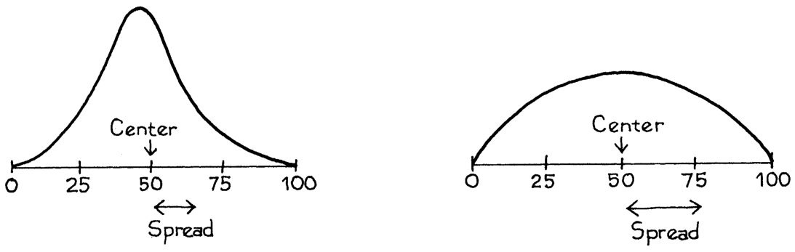

trục hoành, tính bằng dặm (miles) trên (+) hoặc dưới (–) mực nước biển. Diện tích nằm dưới biểu đồ tần suất giữa hai độ cao cho biết phần trăm diện tích bề mặt trái đất nằm giữa các độ cao đó. Có những đỉnh rõ ràng trong biểu đồ tần suất này. Phần lớn diện tích bề mặt được chiếm bởi đáy biển, khoảng 3 dặm dưới mực nước biển; hoặc các đồng bằng lục địa, xung quanh mực nước biển. Việc chỉ báo cáo phần trung tâm và độ trải rộng của biểu đồ tần suất này sẽ bỏ sót mất hai đỉnh này.3 

Hình 2. Phân phối diện tích bề mặt trái đất theo độ cao trên (+) hoặc dưới (–) mực nước biển. 

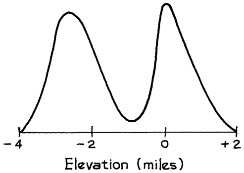

#### 2. SỐ TRUNG BÌNH 

Mục tiêu của phần này là ôn lại về số trung bình; sự khác biệt giữa các khảo sát _cắt ngang_ (cross-sectional) và _dọc_ (longitudinal) cũng sẽ được thảo luận. Bối cảnh ở đây là HANES—Khảo sát Kiểm tra Sức khỏe và Dinh dưỡng (Health and Nutrition Examination Survey), trong đó Cơ quan Y tế Công cộng (Public Health Service) kiểm tra một mẫu cắt ngang mang tính đại diện của người Mỹ. Khảo sát này đã được thực hiện vào những khoảng thời gian không đều đặn kể từ năm 1959 (khi nó được gọi là Khảo sát Kiểm tra Sức khỏe). Mục tiêu là để có được dữ liệu cơ sở (baseline data) về— 

- các biến nhân khẩu học (demographic variables), như tuổi tác, học vấn và thu nhập; 

- các biến sinh lý (physiological variables) như chiều cao, cân nặng, huyết áp và nồng độ cholesterol trong huyết thanh; 

- thói quen ăn kiêng (dietary habits); 

- tỷ lệ lưu hành của các bệnh (prevalence of diseases). 

Phân tích sau đó tập trung vào các mối quan hệ qua lại giữa các biến, và có một số tác động lên chính sách y tế.4 

Mẫu HANES2 được lấy trong khoảng thời gian 1976–80. Trước khi xem xét dữ liệu, chúng ta hãy ôn nhanh lại về các số trung bình. 

Trung bình của một danh sách các số bằng tổng của chúng, chia cho số lượng các số đó. 

Ví dụ, danh sách 9, 1, 2, 2, 0 có 5 phần tử, phần tử đầu tiên là 9. Trung bình của danh sách này là 

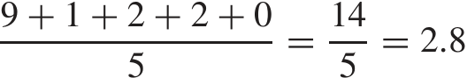

Hãy quay trở lại với HANES. Những người nam và nữ trong mẫu (tuổi từ 18–74) trông như thế nào? 

- Chiều cao trung bình của nam giới là 5 feet 9 inches, và cân nặng trung bình của họ là 171 pound. 

- Chiều cao trung bình của nữ giới là 5 feet 3,5 inches, và cân nặng trung bình của họ là 146 pound. 

Họ khá mập mạp. 

Điều gì đã xảy ra kể từ năm 1980? Khảo sát đã được thực hiện lại vào năm 2003–04 (HANES5). Chiều cao trung bình đã tăng lên một phần nhỏ của một inch, trong khi cân nặng tăng thêm gần 20 pound—cho cả nam và nữ. 

Hình 3 cho thấy các mức trung bình của nam và nữ, và cho từng nhóm tuổi; các mức trung bình được nối với nhau bằng các đường thẳng. Từ HANES2 đến HANES5, chiều cao trung bình đã tăng lên một chút ở mỗi nhóm—nhưng cân nặng trung bình lại tăng lên rất nhiều. Điều này có thể trở thành một vấn đề y tế công cộng nghiêm trọng, bởi vì tình trạng thừa cân có liên quan đến nhiều bệnh lý, bao gồm bệnh tim mạch, ung thư và tiểu đường. 

Hình 3. Chiều cao và cân nặng trung bình theo độ tuổi của nam và nữ từ 18–74 trong mẫu HANES. Bảng điều khiển bên trái hiển thị chiều cao, bảng điều khiển bên phải hiển thị cân nặng. 

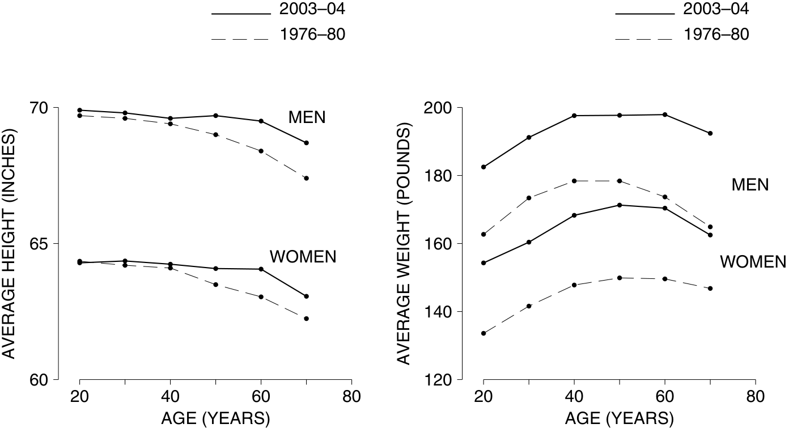

Nguồn: www.cdc.gov/nchs/nhanes.htm 

Số trung bình là một công cụ mạnh mẽ để tóm tắt dữ liệu—nhiều biểu đồ tần suất được nén lại vào trong bốn đường cong. Nhưng sự nén này chỉ đạt được bằng cách làm nhẵn đi (smoothing away) những khác biệt cá nhân. Ví dụ, vào năm 2003–04, chiều cao trung bình của nam giới từ 18–24 tuổi là 5 feet 10 inches. Nhưng 15% trong số họ cao hơn 6 feet 1 inch; 15% khác thấp hơn 5 feet 6 inches. Sự đa dạng này đã bị che khuất bởi số trung bình. 

Trong chốc lát, chúng ta quay lại với các vấn đề về thiết kế (chương 2). Trong dữ liệu năm 1976–80, chiều cao trung bình của nam giới dường như giảm sau độ tuổi 20, giảm khoảng hai inches trong 50 năm. Điều tương tự cũng xảy ra đối với nữ giới. Bạn có nên kết luận rằng một người trung bình đã thấp đi với tốc độ này không? Không hẳn vậy. HANES là khảo sát _cắt ngang_ , không phải là _dọc_ . Trong một nghiên cứu cắt ngang (cross-sectional study), các đối tượng khác nhau được so sánh với nhau tại một thời điểm. Trong một nghiên cứu dọc (longitudinal study), các đối tượng được theo dõi theo thời gian, và được so sánh với chính họ ở các thời điểm khác nhau. Những người từ 18–24 tuổi trong hình 3 hoàn toàn khác biệt với những người từ 65–74 tuổi. Nhóm thứ nhất sinh muộn hơn rất nhiều so với nhóm thứ hai. 

Có bằng chứng cho thấy rằng, theo thời gian, người Mỹ đang ngày càng cao hơn. Điều này được gọi là _xu hướng thế kỷ_ (secular trend) về chiều cao, và hiệu ứng của nó bị nhiễu (confounded) với hiệu ứng của tuổi tác trong hình 3. Hầu hết sự sụt giảm hai inch về chiều cao dường như là do xu hướng thế kỷ này. Những người 65–74 tuổi được sinh ra khoảng 50 năm trước những người 18–24 tuổi, và do đó họ thấp hơn một hoặc hai inch.5 Mặt khác, xu hướng thế kỷ này đã chậm lại. (Lý do hiện chưa rõ ràng.) Chiều cao trung bình chỉ tăng nhẹ từ 1976–80 đến 2003–04. Sự chậm lại này cũng giải thích tại sao các đường cong chiều cao cho năm 2003–04 lại phẳng hơn so với các đường cong cho năm 1976–80. 

Nếu một nghiên cứu rút ra các kết luận về các hiệu ứng của tuổi tác, hãy tìm hiểu xem dữ liệu là cắt ngang hay dọc. 

### Bài tập nhóm A (Exercise Set A)

1. (a) Các số 3 và 5 được đánh dấu bằng các dấu chéo trên đường ngang dưới đây. Hãy tìm trung bình của hai số này và đánh dấu nó bằng một mũi tên. 

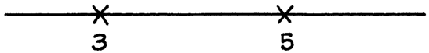

- (b) Lặp lại phần (a) cho danh sách 3, 5, 5. 

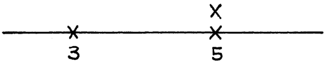

- (c) Hai số được biểu diễn dưới đây bằng các dấu chéo trên một trục ngang. Hãy vẽ một mũi tên chỉ vào trung bình của chúng. 

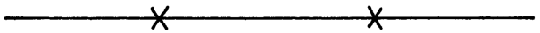

2. Một danh sách có 10 phần tử. Mỗi phần tử là 1 hoặc 2 hoặc 3. Danh sách này phải là gì nếu trung bình bằng 1? Nếu trung bình bằng 3? Trung bình có thể bằng 4 không? 

3. Trong hai danh sách sau, danh sách nào có số trung bình lớn hơn? Hoặc chúng bằng nhau? Hãy cố gắng trả lời mà không thực hiện bất kỳ phép tính số học nào. 

   - (i) 10, 7, 8, 3, 5, 9 (ii) 10, 7, 8, 3, 5, 9, 11 

4. Mười người trong một căn phòng có chiều cao trung bình là 5 feet 6 inches. Người thứ 11, cao 6 feet 5 inches, bước vào phòng. Hãy tìm chiều cao trung bình của cả 11 người. 

5. Hai mươi mốt người trong một căn phòng có chiều cao trung bình là 5 feet 6 inches. Người thứ 22, cao 6 feet 5 inches, bước vào phòng. Hãy tìm chiều cao trung bình của cả 22 người. So sánh với bài tập 4. 

6. Hai mươi mốt người trong một căn phòng có chiều cao trung bình là 5 feet 6 inches. Người thứ 22 bước vào phòng. Người này cần phải cao bao nhiêu để làm tăng chiều cao trung bình lên 1 inch? 

7. Trong hình 2, dãy núi Rocky được vẽ ở gần đầu bên trái của trục, ở giữa, hay đầu bên phải? Còn bang Kansas thì sao? Còn về các rãnh dưới đáy biển, như rãnh Marianas thì sao? 

8. Huyết áp tâm trương (diastolic blood pressure) được coi là một chỉ số báo hiệu về các vấn đề tim mạch tốt hơn so với huyết áp tâm thu (systolic pressure). Hình bên dưới cho thấy huyết áp tâm trương trung bình theo độ tuổi của nam giới từ 20 tuổi trở lên trong khảo sát HANES5 (2003–04).6 Đúng hay sai: dữ liệu chỉ ra rằng khi đàn ông già đi, huyết áp tâm trương của họ tăng lên cho đến khoảng 45 tuổi, và sau đó giảm xuống. Nếu sai, bạn giải thích thế nào về mẫu hình trong đồ thị? (Huyết áp được đo bằng "mm", tức là milimét thủy ngân.) 

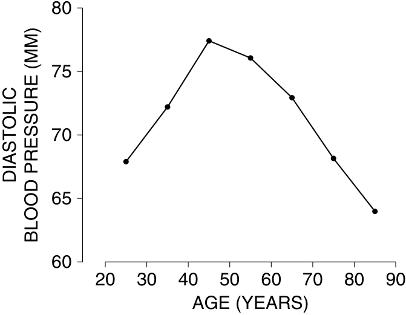

9. Thu nhập trung bình mỗi giờ (average hourly earnings) được Cục Thống kê Lao động (Bureau of Labor Statistics) tính toán hàng tháng sử dụng dữ liệu bảng lương từ các cơ sở thương mại. Cục tính tổng số tiền lương đã trả (cho nhân sự không giữ vai trò giám sát), và chia cho tổng số giờ làm việc. Trong thời kỳ suy thoái, thu nhập trung bình mỗi giờ thường tăng lên. Khi suy thoái kết thúc, thu nhập trung bình mỗi giờ thường bắt đầu giảm xuống. Tại sao lại như vậy? 

_Đáp án cho các bài tập này nằm ở trang A47–48._ 

#### 3. SỐ TRUNG BÌNH VÀ BIỂU ĐỒ TẦN SUẤT 

Phần này sẽ chỉ ra cách trung bình và trung vị liên quan đến biểu đồ tần suất. Để bắt đầu với một ví dụ, có 2.696 phụ nữ từ 18 tuổi trở lên trong mẫu HANES5 (2003–04). Cân nặng trung bình của họ là 164 pound. Rất tự nhiên khi đoán 

Hình 4. Biểu đồ tần suất cho cân nặng của 2.696 phụ nữ trong mẫu HANES5. Giá trị trung bình được đánh dấu bằng một đường thẳng đứng. Chỉ 41% phụ nữ có cân nặng trên mức trung bình. 

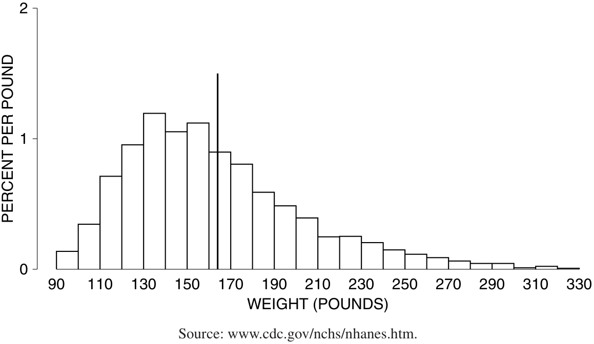

rằng 50% trong số họ có cân nặng trên mức trung bình và 50% dưới mức trung bình. Tuy nhiên, dự đoán này hơi lệch. Trên thực tế, chỉ có 41% trên mức trung bình và 59% dưới mức trung bình. Hình 4 hiển thị biểu đồ tần suất cho dữ liệu: trung bình được đánh dấu bằng một đường thẳng đứng. Trong các tình huống khác, các tỷ lệ phần trăm thậm chí có thể xa hơn mức 50%. 

Làm sao điều này có thể xảy ra? Để tìm hiểu, cách dễ nhất là bắt đầu với một số dữ liệu giả định — danh sách 1, 2, 2, 3. Biểu đồ tần suất cho danh sách này (hình 5) đối xứng qua giá trị 2. Và trung bình bằng 2. Nếu biểu đồ tần suất đối xứng qua một giá trị, giá trị đó bằng với trung bình. Hơn nữa, một nửa diện tích dưới biểu đồ tần suất nằm ở bên trái giá trị đó và một nửa nằm ở bên phải. (Đối xứng nghĩa là gì? Hãy tưởng tượng vẽ một đường thẳng đứng qua trung tâm của biểu đồ tần suất và gấp đôi biểu đồ lại quanh đường đó: hai nửa sẽ khớp với nhau.) 

Hình 5. Biểu đồ tần suất cho danh sách 1, 2, 2, 3. Biểu đồ tần suất đối xứng qua 2, là giá trị trung bình: 50% diện tích nằm ở bên trái của 2 và 50% nằm ở bên phải. 

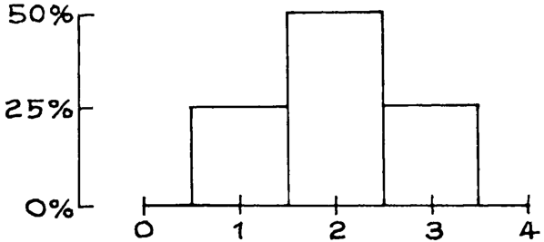

Điều gì xảy ra khi giá trị 3 trong danh sách 1, 2, 2, 3 tăng lên, giả sử thành 5 hoặc 7? Như được thể hiện trong hình 6, hình chữ nhật phía trên giá trị đó di chuyển xa về bên phải, phá hủy tính đối xứng. Trung bình của mỗi biểu đồ tần suất được đánh dấu bằng một mũi tên, và mũi tên dịch chuyển sang phải theo hình chữ nhật. Để hiểu lý do tại sao, hãy tưởng tượng biểu đồ tần suất được làm từ các khối gỗ gắn trên một tấm ván cứng, không trọng lượng. Đặt biểu đồ tần suất vắt ngang qua một sợi dây căng, như minh họa trong khung dưới của hình 6. 

Biểu đồ tần suất sẽ thăng bằng tại vị trí trung bình.7 Một diện tích nhỏ cách xa trung bình có thể cân bằng một diện tích lớn gần trung bình, vì các diện tích được tính trọng số bằng khoảng cách của chúng từ điểm cân bằng. 

Hình 6. Giá trị trung bình. Khung trên cùng hiển thị ba biểu đồ tần suất; các trung bình được đánh dấu bằng mũi tên. Khi hộp được tô bóng di chuyển sang phải, nó kéo theo trung bình. Diện tích bên trái của trung bình lên tới 75%. Khung dưới cùng hiển thị cùng ba biểu đồ tần suất đó được làm từ các khối gỗ gắn trên một tấm ván cứng, không trọng lượng. Các biểu đồ tần suất thăng bằng khi được hỗ trợ tại trung bình. 

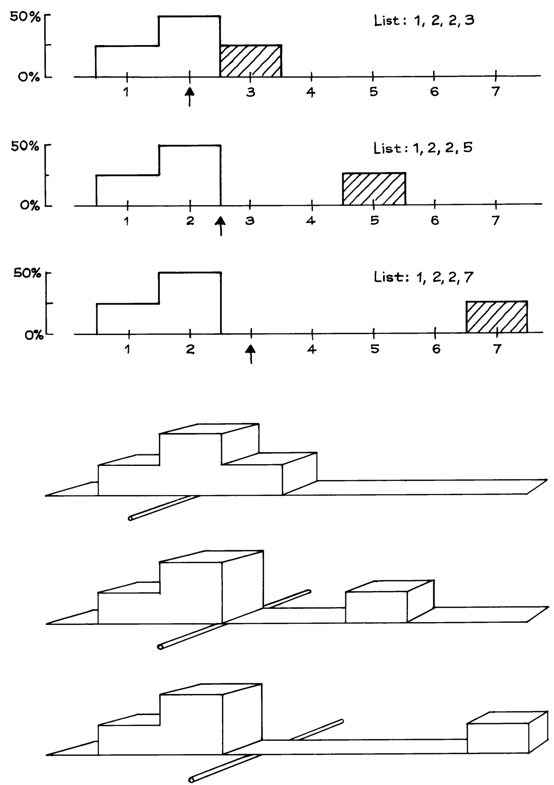

Một biểu đồ tần suất thăng bằng khi được hỗ trợ tại trung bình. 

Một đứa trẻ nhỏ ngồi xa tâm bập bênh hơn để cân bằng với một đứa trẻ lớn ngồi gần tâm hơn. Các khối trong biểu đồ tần suất hoạt động theo cách tương tự. Đó là lý do tại sao phần trăm số trường hợp ở hai bên trung bình có thể khác 50%. 

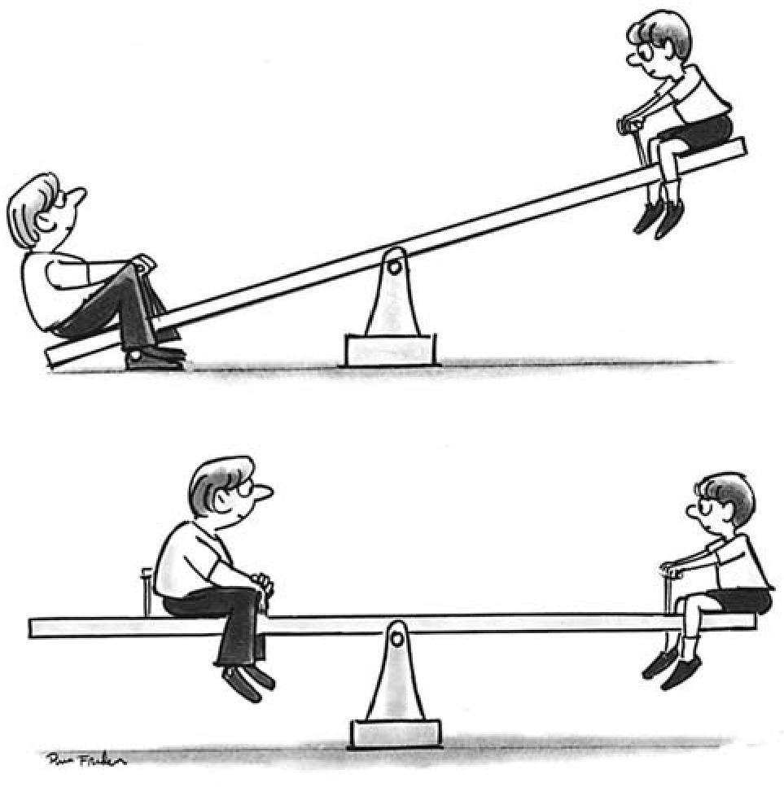

_Trung vị_ (median) của một biểu đồ tần suất là giá trị có một nửa diện tích ở bên trái và một nửa ở bên phải. Đối với cả ba biểu đồ tần suất trong hình 6, trung vị là 2. Với biểu đồ tần suất thứ hai và thứ ba, diện tích bên phải trung vị ở rất xa so với diện tích bên trái. Do đó, nếu bạn cố gắng cân bằng một trong các biểu đồ tần suất đó tại trung vị, nó sẽ nghiêng về bên phải. Một cách tổng quát hơn, trung bình nằm bên phải trung vị bất cứ khi nào biểu đồ tần suất có một cái đuôi dài bên phải, như trong hình 7. Biểu đồ tần suất cân nặng (hình 4 ở trang 62) có trung bình là 164 lbs và trung vị là 155 lbs. Cái đuôi dài bên phải chính là lý do khiến trung bình lớn hơn trung vị. 

Hình 7. Đuôi của một biểu đồ tần suất. 

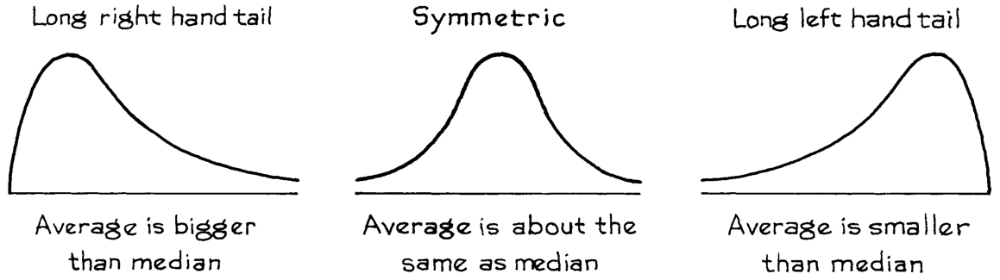

TRUNG BÌNH VÀ BIỂU ĐỒ TẦN SUẤT 

Lấy một ví dụ khác, thu nhập gia đình trung vị ở Hoa Kỳ năm 2004 là khoảng 54.000 đô la. Biểu đồ tần suất thu nhập có một cái đuôi dài bên phải, và trung bình thì cao hơn — 60.000 đô la.8 Khi xử lý các phân phối đuôi dài, các nhà thống kê có thể sử dụng trung vị thay vì trung bình, nếu trung bình bị ảnh hưởng quá nhiều bởi phần đuôi cực đoan của phân phối. Chúng ta sẽ quay lại điểm này trong chương tiếp theo. 

### Bài tập nhóm B 

1. Dưới đây là các bản phác thảo biểu đồ tần suất cho ba danh sách. Điền vào chỗ trống cho mỗi danh sách: trung bình là khoảng . Tùy chọn: 25, 40, 50, 60, 75. 

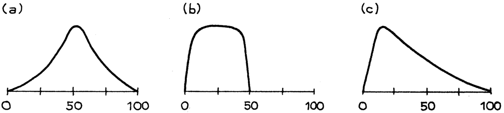

2. Đối với mỗi biểu đồ tần suất trong bài tập 1, trung vị có bằng trung bình không? Hay nó nằm bên trái? Bên phải? 

3. Nhìn lại biểu đồ tần suất thuốc lá ở trang 42. Trung vị khoảng . Điền vào chỗ trống. Tùy chọn: 10, 20, 30, 40 

4. Đối với biểu đồ tần suất thuốc lá này, trung bình khoảng 15, 20 hay 25? 

5. Đối với sinh viên đã đăng ký tại các trường đại học ở Hoa Kỳ, giá trị nào lớn hơn: tuổi trung bình hay tuổi trung vị? 

6. Đối với mỗi danh sách các số sau đây, hãy cho biết các mục nhìn chung có kích thước khoảng 1, 5 hay 10. Không cần tính toán. 

(a) 1.3, 0.9, 1.2, 0.8 (b) 13, 9, 12, 8 (c) 7, 3, 6, 4 (d) 7, −3, −6, 4 

_Đáp án cho các bài tập này nằm trên trang A48–49._ 

_Ghi chú kỹ thuật._ Trung vị của một danh sách được định nghĩa sao cho một nửa hoặc nhiều hơn số lượng các mục ở mức trung vị hoặc lớn hơn, và một nửa hoặc nhiều hơn ở mức trung vị hoặc nhỏ hơn. Điều này sẽ được minh họa trên 4 danh sách— 

- (a) 1, 5, 7 (b) 1, 2, 5, 7 (c) 1, 2, 2, 7, 8 

- (d) 8, −3, 5, 0, 1, 4, −1 

Đối với danh sách (a), trung vị là 5: hai mục trong số ba mục là 5 trở lên, và hai mục là 5 trở xuống. Đối với danh sách (b), bất kỳ giá trị nào giữa 2 và 5 đều là một trung vị; nếu bị bắt buộc, hầu hết các nhà thống kê sẽ chọn 3.5 (nằm giữa 2 và 5) làm "trung vị". Đối với danh sách (c), trung vị là 2: bốn mục trong số năm mục là 2 trở lên, và ba mục là 2 trở xuống. Để tìm trung vị của danh sách (d), hãy sắp xếp nó theo thứ tự tăng dần: 

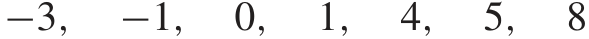

Có bảy mục trong danh sách này: bốn mục là 1 trở lên, và bốn mục là 1 trở xuống. Vì vậy, 1 là trung vị. 

#### 4. CĂN QUÂN PHƯƠNG (ROOT-MEAN-SQUARE)

Chủ đề chính tiếp theo trong chương là _độ lệch chuẩn_ (standard deviation), được sử dụng để đo lường độ phân tán. Phần này trình bày một sơ bộ toán học, được minh họa trên danh sách 

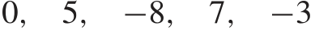

Năm con số này lớn cỡ nào? Trung bình là 0.2, nhưng đây là một thước đo kích thước kém. Nó chỉ có nghĩa là phần lớn, các số dương triệt tiêu các số âm. Cách đơn giản nhất để giải quyết vấn đề này sẽ là xóa bỏ các dấu và sau đó lấy trung bình. Tuy nhiên, các nhà thống kê làm một cách khác: họ áp dụng phép toán _căn quân phương_ (root-mean-square) cho danh sách. Cụm từ "root-mean-square" cho biết cách thực hiện tính toán, miễn là bạn nhớ đọc ngược lại từ tiếng Anh: 

- SQUARE (BÌNH PHƯƠNG) tất cả các mục, loại bỏ các dấu. 

- Lấy MEAN (TRUNG BÌNH) của các bình phương. 

- Lấy ROOT (CĂN) bậc hai của trung bình. 

Điều này có thể được biểu thị dưới dạng một phương trình, với root-mean-square được viết tắt là r.m.s. 

_Ví dụ 1._ Tìm trung bình, trung bình bỏ qua các dấu, và kích thước r.m.s. của danh sách 0, 5, −8, 7, −3. 

_Lời giải._ 

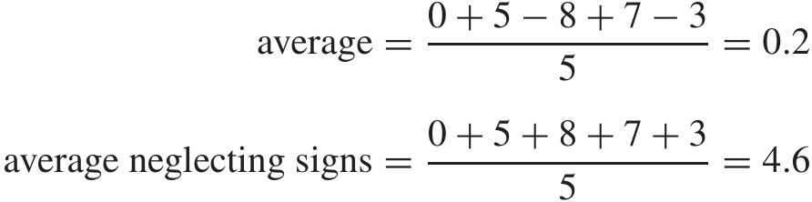

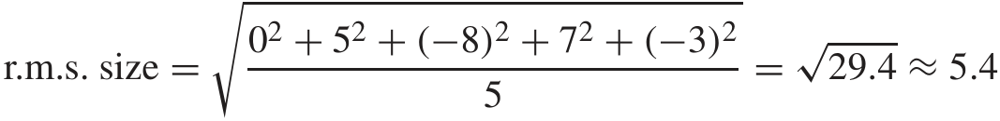

Kích thước r.m.s. lớn hơn một chút so với trung bình bỏ qua các dấu. Kết quả luôn như vậy — ngoại trừ trường hợp tầm thường khi tất cả các mục có cùng kích thước. Căn và bình phương không triệt tiêu cho nhau, do có sự can thiệp của phép toán lấy trung bình. (Dấu "≈" có nghĩa là "gần bằng:" một số phép làm tròn đã được thực hiện.) 

Dường như không có nhiều sự khác biệt giữa 5.4 và 4.6 như là thước đo kích thước tổng thể cho danh sách trong ví dụ. Các nhà thống kê sử dụng kích thước r.m.s. vì nó phù hợp hơn với đại số mà họ phải làm.9 Cho dù lời giải thích này có hấp dẫn hay không, đừng lo lắng. Lúc đầu, mọi người đều hoài nghi về r.m.s., nhưng sẽ làm quen với nó rất nhanh. 

### Bài tập nhóm C 

1. (a) Tìm trung bình và kích thước r.m.s. của các số trong danh sách 1, −3, 5, −6, 3. 

   - (b) Làm tương tự cho danh sách −11, 8, −9, −3, 15.

2. Đoán xem kích thước r.m.s. của mỗi danh sách các số sau đây là khoảng 1, 10 hay 20. Không yêu cầu tính toán số học. 

   - (a) 1, 5, −7, 8, −10, 9, −6, 5, 12, −17 

   - (b) 22, −18, −33, 7, 31, −12, 1, 24, −6, −16 

   - (c) 1, 2, 0, 0, −1, 0, 0, −3, 0, 1 

3. (a) Tìm kích thước r.m.s. của danh sách 7, 7, 7, 7. 

   - (b) Lặp lại, cho danh sách 7 _,_ −7 _,_ 7 _,_ −7. 

4. Mỗi số trong các số 103, 96, 101, 104 gần bằng 100 nhưng sai lệch đi một lượng nào đó. Tìm kích thước r.m.s. của các lượng sai lệch này. 

5. Danh sách 103, 96, 101, 104 có một giá trị trung bình. Hãy tìm nó. Mỗi số trong danh sách sai lệch so với giá trị trung bình một lượng nào đó. Tìm kích thước r.m.s. của các lượng sai lệch này. 

6. Một máy tính được lập trình để dự đoán điểm thi, so sánh chúng với điểm thực tế và tìm kích thước r.m.s. của các sai số dự đoán. Nhìn lướt qua bản in, bạn thấy kích thước r.m.s. của các sai số dự đoán là 3.6 và các kết quả sau đây cho mười học sinh đầu tiên: 

điểm dự đoán: 90 90 87 80 42 70 67 60 83 94 điểm thực tế: 88 70 81 85 63 77 66 49 71 69 

Bản in có vẻ hợp lý không, hay máy tính có vấn đề gì? 

_Đáp án cho các bài tập này nằm ở trang A49._ 

#### 5. ĐỘ LỆCH CHUẨN 

Như câu trích dẫn ở đầu chương gợi ý, thường rất hữu ích khi nghĩ về cách một danh sách các số phân tán xung quanh giá trị trung bình. Sự phân tán này thường được đo lường bằng một đại lượng gọi là _độ lệch chuẩn_ (standard deviation), hay SD. SD đo lường kích thước của các độ lệch từ giá trị trung bình: nó là một dạng độ lệch trung bình. Mục đích là để giải thích SD trong ngữ cảnh của dữ liệu thực tế, và sau đó xem cách tính toán nó. 

Có 2,696 phụ nữ từ 18 tuổi trở lên trong mẫu HANES5. Chiều cao trung bình của những phụ nữ này là khoảng 63.5 inch, và SD gần bằng 3 inch. Giá trị trung bình cho chúng ta biết rằng hầu hết phụ nữ ở khoảng 63.5 inch. Nhưng có những độ lệch so với mức trung bình. Một số phụ nữ cao hơn mức trung bình, một số thấp hơn. Những độ lệch này lớn cỡ nào? Đó là lúc SD phát huy tác dụng. 

SD cho biết các số trong một danh sách cách xa giá trị trung bình của chúng bao nhiêu. Hầu hết các mục nhập trong danh sách sẽ cách giá trị trung bình đâu đó khoảng một SD. Rất ít giá trị sẽ cách xa hơn hai hoặc ba SD. 

SD bằng 3 inch cho biết nhiều phụ nữ có chiều cao khác với mức trung bình 1 hoặc 2 hoặc 3 inch: 1 inch là một phần ba SD, và 3 inch là một SD. Ít phụ nữ khác với chiều cao trung bình hơn 6 inch (hai SD). 

Có một quy tắc ngón tay cái làm cho ý tưởng này mang tính định lượng hơn, và áp dụng cho nhiều tập dữ liệu. 

Khoảng 68% số mục nhập trong một danh sách (hai phần ba) nằm trong khoảng một SD tính từ giá trị trung bình, 32% còn lại nằm xa hơn. Khoảng 95% (19 phần 20) nằm trong khoảng hai SD tính từ giá trị trung bình, 5% còn lại nằm xa hơn. Điều này đúng cho nhiều danh sách, nhưng không phải tất cả. 

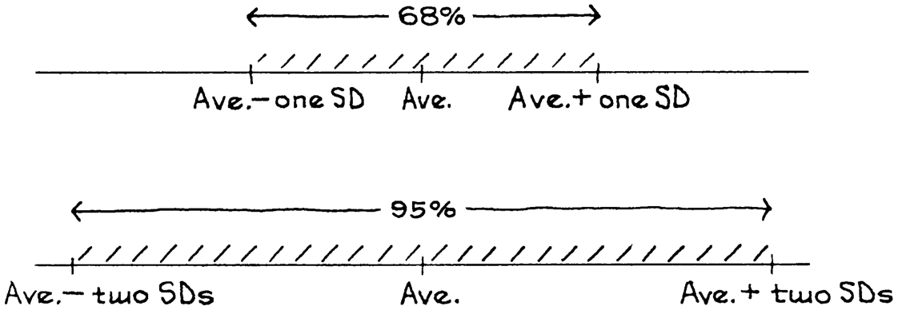

Hình 8 hiển thị biểu đồ tần suất cho chiều cao của phụ nữ từ 18 tuổi trở lên trong HANES5. Giá trị trung bình được đánh dấu bằng một đường thẳng đứng, và vùng nằm trong phạm vi một SD từ giá trị trung bình được tô sáng. Vùng được tô sáng này đại diện cho những phụ nữ có chiều cao khác với chiều cao trung bình một SD trở xuống. Diện tích là khoảng 72%. Khoảng 72% phụ nữ khác với chiều cao trung bình một SD trở xuống. 

Hình 8. SD và biểu đồ tần suất. Chiều cao của 2,696 phụ nữ từ 18 tuổi trở lên trong HANES5. Mức trung bình 63.5 inch được đánh dấu bằng một đường thẳng đứng. Vùng nằm trong phạm vi một SD từ giá trị trung bình được tô sáng: 72% phụ nữ khác với mức trung bình một SD (3 inch) trở xuống. 

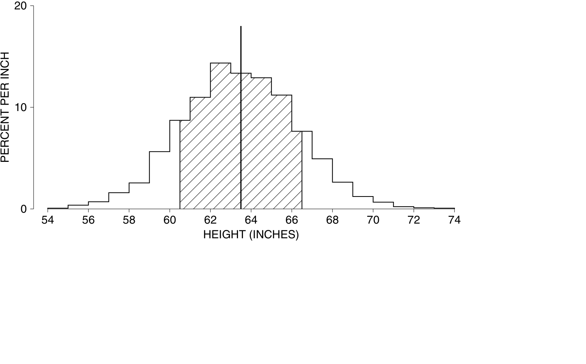

Hình 9 hiển thị cùng một biểu đồ tần suất. Bây giờ diện tích trong phạm vi hai SD từ mức trung bình được tô sáng. Vùng được tô sáng này đại diện cho những phụ nữ có chiều cao khác với chiều cao trung bình hai SD trở xuống. Diện tích là khoảng 97%. Khoảng 97% phụ nữ khác với chiều cao trung bình hai SD trở xuống. 

Hình 9. SD và biểu đồ tần suất. Chiều cao của 2,696 phụ nữ từ 18 tuổi trở lên trong HANES5. Mức trung bình 63.5 inch được đánh dấu bằng một đường thẳng đứng. Vùng nằm trong phạm vi hai SD từ giá trị trung bình được tô sáng: 97% phụ nữ khác với mức trung bình hai SD (6 inch) trở xuống. 

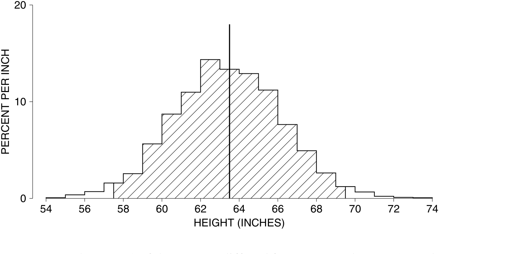

Tóm lại, khoảng 72% phụ nữ khác với mức trung bình một SD trở xuống, và 97% khác với mức trung bình hai SD trở xuống. Chỉ có một phụ nữ trong mẫu cách giá trị trung bình hơn ba SD, và không có ai cách quá bốn SD. Đối với tập dữ liệu này, quy tắc 68%–95% hoạt động khá tốt. Các con số 68% và 95% đến từ đâu? Xem chương 5.10 

_Khoảng hai phần ba số phụ nữ HANES khác với mức trung bình dưới một SD._ 

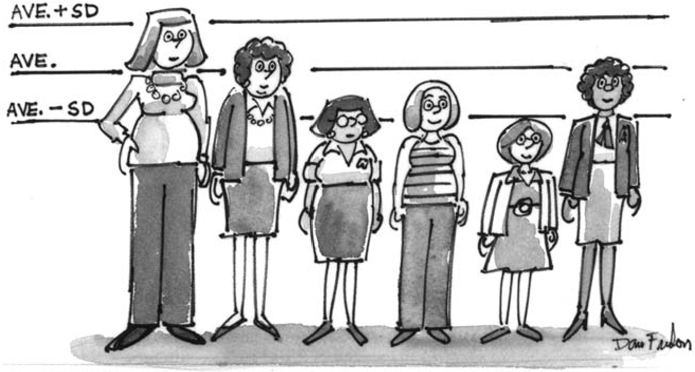

### Bài Tập D 

1. Cơ quan Y tế Công cộng đã phát hiện ra rằng đối với các bé trai 11 tuổi trong HANES2, chiều cao trung bình là 146 cm và SD là 8 cm. Điền vào chỗ trống. 

   - (a) Một bé trai cao 170 cm. Cậu bé đó cao hơn mức trung bình, với 

   - SD. SD. 

   - cao cm. 

- (b) Một bé trai khác cao 148 cm. Cậu bé đó cao hơn mức trung bình, với 

- (c) Bé trai thứ ba thấp hơn chiều cao trung bình 1.5 SD. Cậu bé đó 

   - (d) Nếu một bé trai nằm trong phạm vi 2.25 SD so với chiều cao trung bình, chiều cao thấp nhất mà cậu bé có thể có là cm và cao nhất là cm. 

2. Tiếp tục bài tập 1. 

   - (a) Dưới đây là chiều cao của bốn bé trai: 150 cm, 130 cm, 165 cm, 140 cm. Ghép chiều cao với các mô tả. Một mô tả có thể được sử dụng hai lần. 

thấp bất thường khoảng trung bình cao bất thường 

   - (b) Khoảng bao nhiêu phần trăm các bé trai 11 tuổi trong nghiên cứu có chiều cao từ 138 cm đến 154 cm? Từ 130 đến 162 cm? 

3. Mỗi danh sách sau đây đều có giá trị trung bình là 50. Đối với danh sách nào thì độ phân tán của các số quanh giá trị trung bình là lớn nhất? nhỏ nhất? 

   - (i) 0, 20, 40, 50, 60, 80, 100 (ii) 0, 48, 49, 50, 51, 52, 100 (iii) 0, 1, 2, 50, 98, 99, 100 

4. Mỗi danh sách sau đây đều có giá trị trung bình là 50. Đối với mỗi danh sách, hãy đoán xem SD là khoảng 1, 2 hay 10. (Điều này không yêu cầu bất kỳ phép tính số học nào.) 

(a) 49, 51, 49, 51, 49, 51, 49, 51, 49, 51 

   - (b) 48, 52, 48, 52, 48, 52, 48, 52, 48, 52 (c) 48, 51, 49, 52, 47, 52, 46, 51, 53, 51 (d) 54, 49, 46, 49, 51, 53, 50, 50, 49, 49 (e) 60, 36, 31, 50, 48, 50, 54, 56, 62, 53 

5. SD cho độ tuổi của những người trong mẫu HANES5 là khoảng . Điền vào chỗ trống, sử dụng một trong các tùy chọn bên dưới. Giải thích ngắn gọn. (Cuộc khảo sát này đã được thảo luận ở phần 2; khoảng độ tuổi là 0–85 tuổi.) 

5 năm 25 năm 50 năm 

6. Dưới đây là các bản phác thảo biểu đồ tần suất cho ba danh sách. Ghép bản phác thảo với mô tả. Một số mô tả sẽ bị thừa. Đưa ra lập luận của bạn trong mỗi trường hợp. 

(i) ave ≈ 3 _._ 5, SD ≈ 1 (iv) ave ≈ 2 _._ 5, SD ≈ 1 (ii) ave ≈ 3 _._ 5, SD ≈ 0 _._ 5 (v) ave ≈ 2 _._ 5, SD ≈ 0 _._ 5 (iii) ave ≈ 3 _._ 5, SD ≈ 2 (vi) ave ≈ 4 _._ 5, SD ≈ 0 _._ 5 

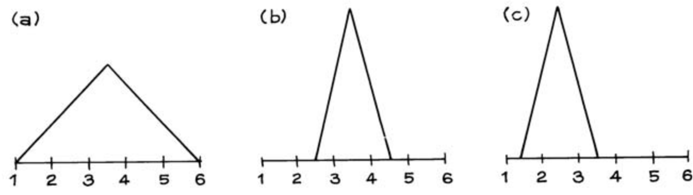

7. (Giả định). Trong một thử nghiệm lâm sàng, việc thu thập dữ liệu thường bắt đầu ở “mức cơ sở”, khi các đối tượng được tuyển chọn vào thử nghiệm nhưng trước khi họ được phân bổ ngẫu nhiên vào nhóm điều trị hoặc nhóm đối chứng. Việc thu thập dữ liệu tiếp tục cho đến khi kết thúc quá trình theo dõi. Hai thử nghiệm lâm sàng về phòng ngừa đau tim báo cáo dữ liệu cơ sở về cân nặng, được hiển thị bên dưới. Trong một thử nghiệm, việc phân bổ ngẫu nhiên đã không hoạt động tốt. Đó là thử nghiệm nào, và tại sao? 

|||_Số lượng_ _người_|_Cân nặng_ _trung bình_|_SD_|
|---|---|---|---|---|
|(i)|Điều trị |1,012|185 lb|25 lb|
||Đối chứng|997|143 lb|26 lb|
|(ii)|Điều trị |995|166 lb|27 lb|
||Đối chứng|1,017|163 lb|25 lb|

8. Một điều tra viên lấy một mẫu gồm 100 người đàn ông độ tuổi 18–24 ở một thị trấn nhất định. Một điều tra viên khác lấy một mẫu gồm 1.000 người đàn ông như vậy. 

   - (a) Điều tra viên nào sẽ nhận được mức trung bình lớn hơn về chiều cao của những người đàn ông trong mẫu của mình? hay mức trung bình của cả hai sẽ xấp xỉ bằng nhau? 

   - (b) Điều tra viên nào sẽ nhận được SD lớn hơn về chiều cao của những người đàn ông trong mẫu của mình? hay SD của cả hai sẽ xấp xỉ bằng nhau? 

   - (c) Điều tra viên nào có nhiều khả năng lấy được người đàn ông cao nhất trong mẫu? hay cơ hội là xấp xỉ như nhau cho cả hai điều tra viên? 

   - (d) Điều tra viên nào có nhiều khả năng lấy được người đàn ông thấp nhất trong mẫu? hay cơ hội là xấp xỉ như nhau cho cả hai điều tra viên? 

9. Những người đàn ông trong mẫu HANES5 có chiều cao trung bình là 69 inch và SD là 3 inch. Ngày mai, một trong những người đàn ông này sẽ được chọn ngẫu nhiên. Bạn phải đoán chiều cao của anh ta. Bạn nên đoán là bao nhiêu? Bạn có khoảng 1 phần 3 cơ hội bị lệch nhiều hơn . Điền vào chỗ trống. Các tùy chọn: 1 _/_ 2 inch, 3 inch, 5 inch. 

10. Như trong bài tập 9, nhưng ngày mai một loạt người đàn ông sẽ được chọn ngẫu nhiên. Sau khi mỗi người đàn ông xuất hiện, chiều cao thực tế của anh ta sẽ được so sánh với dự đoán của bạn để xem bạn đã lệch bao nhiêu. Kích thước r.m.s. của các khoảng lệch sẽ là . Điền vào chỗ trống. (Gợi ý: Nhìn xuống cuối trang này.) 

_Đáp án cho các bài tập này nằm ở các trang A49–50._ 

#### 6. TÍNH TOÁN ĐỘ LỆCH CHUẨN 

Để tìm độ lệch chuẩn của một danh sách, hãy xét từng mục nhập một. Mỗi mục nhập lệch khỏi mức trung bình một lượng nào đó, có thể là 0: 

độ lệch so với mức trung bình = mục nhập − mức trung bình _._ 

SD là kích thước r.m.s. của những độ lệch này. (Nhắc nhở: “r.m.s.” nghĩa là căn bậc hai trung bình bình phương (root-mean-square). Xem trang 66.) 

SD = r.m.s. độ lệch so với mức trung bình. 

_Ví dụ 2._ Tìm SD của danh sách 20, 10, 15, 15. 

_Lời giải._ Bước đầu tiên là tìm mức trung bình: 

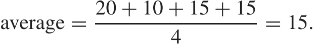

Bước thứ hai là tìm độ lệch so với mức trung bình: chỉ cần trừ mức trung bình khỏi mỗi mục nhập. Các độ lệch là 

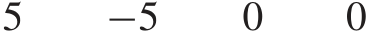

Bước cuối cùng là tìm kích thước r.m.s. của các độ lệch: 

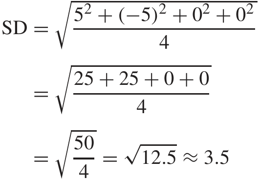

Tính toán này đã hoàn tất. 

SD có cùng đơn vị với dữ liệu. Ví dụ, giả sử chiều cao được đo bằng inch. Bước bình phương trung gian trong quy trình thay đổi đơn vị thành inch vuông, nhưng bước căn bậc hai trả lại kết quả về đơn vị ban đầu.11 Đừng nhầm lẫn SD của một danh sách với kích thước r.m.s. của nó. SD là r.m.s., không phải của các số ban đầu trong danh sách, mà là r.m.s. các độ lệch của chúng so với mức trung bình. 

### Tập Bài Tập E 

1. Đoán xem danh sách nào trong hai danh sách sau có SD lớn hơn. Kiểm tra phỏng đoán của bạn bằng cách tính SD cho cả hai danh sách. 

   - (i) 9, 9, 10, 10, 10, 12 

   - (ii) 7, 8, 10, 11, 11, 13 

2. Có người đang hướng dẫn bạn cách tính SD của danh sách 1, 2, 3, 4, 5: 

Mức trung bình là 3, vì vậy các độ lệch so với mức trung bình là 

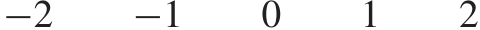

Bỏ các dấu đi. Độ lệch trung bình là 

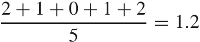

Và đó là SD. 

Điều này có đúng không? Trả lời có hoặc không, và giải thích ngắn gọn. 

3. Có người đang hướng dẫn bạn cách tính SD của danh sách 1, 2, 3, 4, 5: 

Mức trung bình là 3, vì vậy các độ lệch so với mức trung bình là 

−2 −1 0 1 2 

Số 0 không được tính, vì vậy độ lệch r.m.s. là 

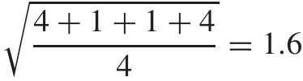

Và đó là SD. 

Điều này có đúng không? Trả lời có hoặc không, và giải thích ngắn gọn. 

4. Ba giảng viên đang so sánh điểm thi cuối kỳ của họ; mỗi lớp có 99 sinh viên. Ở lớp A, một sinh viên đạt 1 điểm, một sinh viên khác đạt 99 điểm, và những sinh viên còn lại đạt 50 điểm. Ở lớp B, 49 sinh viên đạt mức điểm 1, một sinh viên đạt mức điểm 50, và 49 sinh viên đạt mức điểm 99. Ở lớp C, một sinh viên đạt mức điểm 1, một sinh viên đạt mức điểm 2, một sinh viên đạt mức điểm 3, và cứ tiếp tục như vậy, cho đến tận 99. 

   - (a) Lớp nào có mức trung bình lớn nhất? hay chúng giống nhau? 

   - (b) Lớp nào có SD lớn nhất? hay chúng giống nhau? 

   - (c) Lớp nào có khoảng biến thiên (range) lớn nhất? hay chúng giống nhau? 

5. (a) Đối với mỗi danh sách dưới đây, hãy tính mức trung bình, các độ lệch so với mức trung bình, và SD. 

      - (i) 1, 3, 4, 5, 7 

      - (ii) 6, 8, 9, 10, 12 

   - (b) Danh sách (ii) liên quan đến danh sách (i) như thế nào? Mối liên hệ này ảnh hưởng như thế nào đến mức trung bình? các độ lệch so với mức trung bình? SD? 

6. Lặp lại bài tập 5 cho hai danh sách sau: 

   - (i) 1, 3, 4, 5, 7 

   - (ii) 3, 9, 12, 15, 21 

7. Lặp lại bài tập 5 cho hai danh sách sau: 

   - (i) 5, −4, 3, −1, 7 

   - (ii) −5, 4, −3, 1, −7 

8. (a) Thống đốc bang California đề xuất tăng một khoản cố định là $250 một tháng cho tất cả các nhân viên của bang. Điều này sẽ ảnh hưởng như thế nào đến mức lương trung bình hàng tháng của nhân viên bang? đến SD? 

   - (b) Việc tăng 5% lương đồng loạt sẽ ảnh hưởng như thế nào đến mức lương trung bình hàng tháng? đến SD? 

9. Kích thước r.m.s. của danh sách 17, 17, 17, 17, 17 là bao nhiêu? SD là bao nhiêu? 

10. Đối với danh sách 107, 98, 93, 101, 104, giá trị nào nhỏ hơn—kích thước r.m.s. hay độ lệch chuẩn (SD)? Không cần tính toán. 

11. Độ lệch chuẩn (SD) có bao giờ âm không? 

12. Đối với một danh sách các số dương, độ lệch chuẩn (SD) có bao giờ lớn hơn trung bình không? 

_Câu trả lời cho các bài tập này nằm ở trang A50–51._ 

_Ghi chú kỹ thuật._ Có một cách khác để tính SD, hiệu quả hơn trong một số trường hợp:12 

SD = trung bình của (các mục2 ) − (trung bình của các mục)2 _._ 

#### 7. SỬ DỤNG MÁY TÍNH THỐNG KÊ 

Hầu hết các máy tính thống kê không cho ra SD mà cho ra một số lớn hơn một chút là SD+ . (Sự khác biệt giữa SD và SD+ sẽ được giải thích cẩn thận hơn trong phần 6 của chương 26.) Để tìm hiểu xem máy của bạn đang làm gì, hãy nhập danh sách −1 _,_ 1. Nếu máy cho bạn 1, nó đang tính SD. Nếu nó cho bạn 1.41 _. . ._ , nó đang tính SD+ . Nếu bạn đang nhận được SD+ và bạn muốn SD, bạn phải nhân với một hệ số chuyển đổi. Điều này phụ thuộc vào số lượng mục trong danh sách. Với 10 mục, hệ số chuyển đổi là√ 9 _/_ 10. Với 20 mục, nó là √19 _/_ 20. Nói chung, 

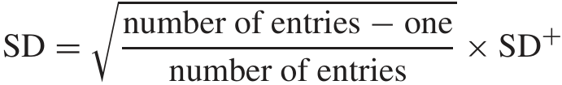

#### 8. BÀI TẬP ÔN TẬP 

_Các bài tập ôn tập có thể bao gồm tài liệu từ các chương trước._ 

1. (a) Tìm trung bình và SD của danh sách 41, 48, 50, 50, 54, 57. 

   - (b) Những số nào trong danh sách nằm trong khoảng 0.5 SD so với trung bình? trong khoảng 1.5 SD so với trung bình? 

2. (a) Cả hai danh sách sau đây đều có cùng trung bình là 50. Danh sách nào có SD nhỏ hơn, và tại sao? Không cần tính toán. 

      - (i) 50, 40, 60, 30, 70, 25, 75 

      - (ii) 50, 40, 60, 30, 70, 25, 75, 50, 50, 50 

   - (b) Lặp lại cho hai danh sách sau. 

      - (i) 50, 40, 60, 30, 70, 25, 75 

      - (ii) 50, 40, 60, 30, 70, 25, 75, 99, 1 

3. Dưới đây là một danh sách các số: 

|0.7|1.6|9.8|3.2|5.4|0.8|7.7|6.3|2.2|4.1|
|---|---|---|---|---|---|---|---|---|---|
|8.1|6.5|3.7|0.6|6.9|9.9|8.8|3.1|5.7|9.1|

   - (a) Không cần làm bất kỳ phép toán nào, hãy đoán xem trung bình nằm trong khoảng 1, 5 hay 10. 

   - (b) Không cần làm bất kỳ phép toán nào, hãy đoán xem SD nằm trong khoảng 1, 3 hay 6. 

4. Đối với những người từ 25 tuổi trở lên ở Hoa Kỳ, trung bình hay trung vị sẽ cao hơn đối với thu nhập? đối với số năm đi học đã hoàn thành? 

BÀI TẬP ÔN TẬP 

5. Đối với nam giới từ 18–24 tuổi trong nghiên cứu HANES5, huyết áp tâm thu trung bình là 116 mm và SD là 11 mm.13 Hãy cho biết mỗi mức huyết áp sau đây là cao bất thường, thấp bất thường hay xấp xỉ mức trung bình: 

      - 80 mm 115 mm 120 mm 210 mm 

6. Dưới đây là các bản phác thảo biểu đồ tần suất (histogram) cho ba danh sách. 

   - (a) Theo thứ tự lộn xộn, các trung bình là 40, 50, 60. Hãy ghép các biểu đồ tần suất với các trung bình tương ứng. 

   - (b) Ghép biểu đồ tần suất với mô tả sau: trung vị nhỏ hơn trung bình, trung vị xấp xỉ bằng trung bình 

      - trung vị lớn hơn trung bình 

   - (c) SD của biểu đồ tần suất (iii) nằm trong khoảng 5, 15 hay 50? 

   - (d) Đúng hay sai, và giải thích: SD của biểu đồ tần suất (i) nhỏ hơn nhiều so với SD của biểu đồ tần suất (iii). 

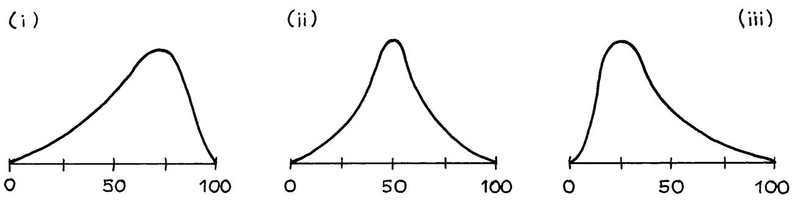

7. Một nghiên cứu trên sinh viên đại học cho thấy nam giới có cân nặng trung bình khoảng 66 kg và SD khoảng 9 kg. Nữ giới có cân nặng trung bình khoảng 55 kg và SD là 9 kg. 

   - (a) Tìm các trung bình và SD, tính bằng pound (1 kg = 2 _._ 2 lb). 

   - (b) Nói một cách khái quát, có bao nhiêu phần trăm nam giới nặng từ 57 kg đến 75 kg? 

   - (c) Nếu bạn gộp chung nam và nữ, SD về cân nặng của họ sẽ nhỏ hơn 9 kg, xấp xỉ 9 kg hay lớn hơn 9 kg? Tại sao? 

8. Trong mẫu HANES5, chiều cao trung bình của các bé trai là 137 cm ở độ tuổi 9 và 151 cm ở độ tuổi 11. Ở độ tuổi 11, chiều cao trung bình của tất cả trẻ em là 151 cm.14 

   - (a) Trung bình, các bé trai có cao hơn các bé gái ở độ tuổi 11 không? 

   - (b) Dự đoán chiều cao trung bình của các bé trai 10 tuổi. 

9. Một nhà nghiên cứu có một tệp máy tính hiển thị thu nhập gia đình của 1.000 đối tượng trong một nghiên cứu nhất định. Các mức thu nhập này dao động từ $5.800 một năm đến $98.600 một năm. Do nhầm lẫn, mức thu nhập cao nhất trong tệp đã bị thay đổi thành $986.000. 

   - (a) Điều này có ảnh hưởng đến mức trung bình không? Nếu có, thì ảnh hưởng bao nhiêu? 

   - (b) Điều này có ảnh hưởng đến trung vị không? Nếu có, thì ảnh hưởng bao nhiêu? 

10. Các sinh viên sắp nhập học tại một trường luật nhất định có điểm trung bình LSAT (Bài kiểm tra năng lực trường luật) là 163 và SD là 8. Ngày mai, một trong số các sinh viên này 

sẽ được chọn ngẫu nhiên. Bạn phải đoán điểm ngay bây giờ; điểm dự đoán sẽ được so sánh với điểm thực tế, để xem chênh lệch bao nhiêu. Mỗi điểm chênh lệch sẽ tốn một đô la. (Ví dụ, nếu đoán là 158 và điểm thực tế là 151, bạn sẽ phải trả $7.) 

- (a) Dự đoán tốt nhất là 150, 163 hay 170? 

- (b) Bạn có khoảng 1 phần 3 cơ hội bị mất nhiều hơn . Hãy điền vào chỗ trống. Các lựa chọn: $1, $8, $20. 

(Điểm LSAT dao động từ 120 đến 180; mức trung bình của tất cả người dự thi là khoảng 150 và SD là khoảng 9. Bài kiểm tra được chuẩn hóa lại theo thời gian, dữ liệu dành cho năm 2005.) 

11. Tương tự như bài tập 10, nhưng một loạt sinh viên được chọn. Kích thước r.m.s. của các khoản thua lỗ của bạn nên ở khoảng . Hãy điền vào chỗ trống. 

12. Nhiều nhà quan sát cho rằng có một tầng lớp dưới đáy vĩnh viễn trong xã hội Mỹ—hầu hết những người trong tình trạng nghèo đói thường vẫn nghèo từ năm này sang năm khác. Trong giai đoạn 1970–2000, tỷ lệ dân số Mỹ trong tình trạng nghèo đói mỗi năm tương đối ổn định, ở mức khoảng 12%. Số liệu thu nhập cho mỗi năm được lấy từ Cuộc khảo sát Dân số Hiện tại (Current Population Survey) tháng 3 của năm đó; ngưỡng nghèo đói được dựa trên các định nghĩa chính thức của chính phủ.15 

Dữ liệu này ủng hộ lý thuyết về tầng lớp dưới đáy vĩnh viễn ở mức độ nào? Hãy thảo luận ngắn gọn. 

#### 9. TÓM TẮT 

1. Một danh sách các số điển hình có thể được tóm tắt bằng _trung bình_ và _độ lệch chuẩn_ (SD) của nó. 

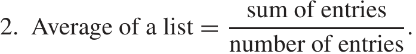

3. Trung bình xác định vị trí trung tâm của một biểu đồ tần suất, theo nghĩa là biểu đồ tần suất sẽ cân bằng khi được đỡ ở mức trung bình. 

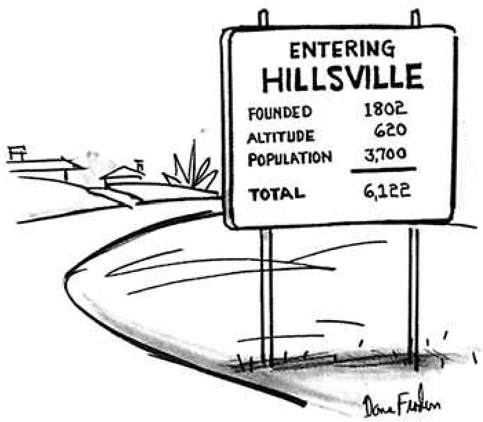

Hình vẽ của Dana Fradon; ⃝c 1976 The New Yorker Magazine, Inc. 

4. Một nửa diện tích dưới biểu đồ tần suất nằm ở bên trái của _trung vị_ , và một nửa ở bên phải. Trung vị là một cách khác để xác định vị trí trung tâm của một biểu đồ tần suất. 

5. _Kích thước r.m.s._ của một danh sách đo lường độ lớn của các mục, bỏ qua dấu của chúng. 

6. kích thước r.m.s. của một danh sách = trung bình của (các mục2 ). 

7. SD đo lường khoảng cách từ trung bình. Mỗi số trong danh sách lệch khỏi trung bình một lượng nào đó. SD là một loại kích thước trung bình cho những lượng chênh lệch này. Về mặt kỹ thuật hơn, SD là kích thước r.m.s. của các độ lệch so với trung bình. 

8. Khoảng 68% các mục trong một danh sách các số nằm trong khoảng một SD so với trung bình, và khoảng 95% nằm trong khoảng hai SD so với trung bình. Điều này đúng với nhiều danh sách, nhưng không phải tất cả. 

9. Nếu một nghiên cứu rút ra kết luận về các tác động của độ tuổi, hãy tìm hiểu xem dữ liệu là cắt ngang hay theo thời gian (dọc). 

