# Phép xấp xỉ chuẩn cho dữ liệu (The Normal Approximation for Data)

### 1. ĐƯỜNG CONG CHUẨN (THE NORMAL CURVE)

Đường cong chuẩn được Abraham de Moivre khám phá vào khoảng năm 1720, khi ông đang phát triển toán học về xác suất. (Công trình của ông sẽ được thảo luận lại trong phần IV và V.) Khoảng năm 1870, nhà toán học người Bỉ Adolph Quetelet đã nảy ra ý tưởng sử dụng đường cong này như một biểu đồ tần suất (histogram) lý tưởng, để từ đó có thể so sánh với biểu đồ tần suất của dữ liệu thực tế.

Đường cong chuẩn có một phương trình trông khá "đáng sợ":

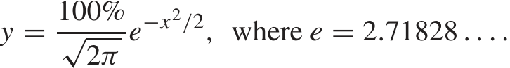

Phương trình này bao gồm ba trong số những con số nổi tiếng nhất trong lịch sử toán học: $\sqrt{2}$, $\pi$, và $e$. Điều này chỉ để "khoe" một chút thôi. Bạn sẽ thấy rằng việc làm việc với đường cong chuẩn thông qua các biểu đồ và bảng tra cứu là rất dễ dàng, mà không bao giờ cần phải đụng đến phương trình này. Đồ thị của đường cong được thể hiện trong Hình 1.

Hình 1. Đường cong chuẩn. 

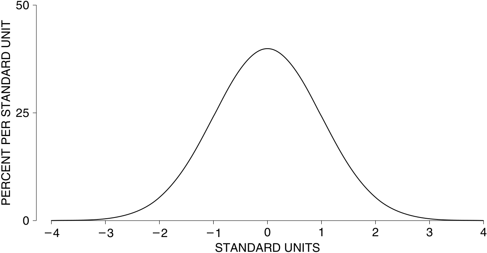

Có một vài đặc điểm quan trọng của đồ thị này cần lưu ý. Thứ nhất, đồ thị đối xứng qua gốc 0: phần đường cong nằm bên phải điểm 0 là hình ảnh phản chiếu của phần nằm bên trái. Tiếp theo, tổng diện tích dưới đường cong bằng 100%. (Diện tích được tính bằng phần trăm, bởi vì trục tung sử dụng thang đo mật độ - density scale.) Cuối cùng, đường cong luôn nằm trên trục hoành. Nó có vẻ như dừng lại ở khoảng giữa 3 và 4, nhưng đó chỉ là vì đường cong hạ xuống quá thấp ở đó. Chỉ có khoảng $6 / 100,000$ diện tích nằm ngoài khoảng từ $-4$ đến $4$.

Việc tìm diện tích dưới đường cong chuẩn giữa các giá trị cụ thể sẽ rất hữu ích. Ví dụ:

- diện tích dưới đường cong chuẩn giữa $-1$ và $+1$ là khoảng 68%;

- diện tích dưới đường cong chuẩn giữa $-2$ và $+2$ là khoảng 95%;

- diện tích dưới đường cong chuẩn giữa $-3$ và $+3$ là khoảng 99.7%.

Việc tìm các diện tích này chỉ đơn giản là tra cứu trong một bảng giá trị, hoặc bấm nút trên một loại máy tính cầm tay phù hợp; bảng này sẽ được giải thích ở phần 2.

Nhiều biểu đồ tần suất của dữ liệu có hình dạng tương tự như đường cong chuẩn, miễn là chúng được vẽ theo cùng một tỷ lệ. Việc làm cho các thang đo trên trục hoành khớp với nhau liên quan đến các _đơn vị chuẩn_ (standard units).1

Một giá trị được chuyển đổi sang đơn vị chuẩn bằng cách xem nó nằm trên hoặc dưới mức trung bình bao nhiêu độ lệch chuẩn (SD - Standard Deviation).

Các giá trị cao hơn trung bình được gán dấu cộng; các giá trị thấp hơn trung bình được gán dấu trừ. Trục hoành của Hình 1 được tính bằng các đơn vị chuẩn.

Ví dụ, hãy xét những phụ nữ từ 18 tuổi trở lên trong mẫu HANES5. Chiều cao trung bình của họ là 63.5 inch; độ lệch chuẩn (SD) là 3 inch. Một trong những người phụ nữ này cao 69.5 inch. Chiều cao của cô ấy tính theo đơn vị chuẩn là bao nhiêu? Đối tượng của chúng ta cao hơn mức trung bình 6 inch, và 6 inch tương đương với 2 SD. Trong đơn vị chuẩn, chiều cao của cô ấy là $+2$.

_Ví dụ 1._ Đối với phụ nữ từ 18 tuổi trở lên trong mẫu HANES5—

- (a) Chuyển đổi các giá trị sau sang đơn vị chuẩn:

(i) 66.5 inch (ii) 57.5 inch (iii) 64 inch (iv) 63.5 inch

- (b) Tìm chiều cao tương ứng với $-1.2$ trong đơn vị chuẩn.

_Lời giải. Phần (a)_. Đối với (i), 66.5 inch cao hơn trung bình 3 inch. Mức này cao hơn trung bình 1 SD. Trong đơn vị chuẩn, 66.5 inch là $+1$. Đối với (ii), 57.5 inch thấp hơn trung bình 6 inch. Mức này thấp hơn trung bình 2 SD. Trong đơn vị chuẩn, 57.5 inch là $-2$. Đối với (iii), 64 inch cao hơn trung bình 0.5 inch. Mức này tương đương $0.5 / 3 \approx 0.17$ SD. Đáp án là 0.17. Đối với (iv), 63.5 inch chính là mức trung bình. Vì vậy, 63.5 inch cách mức trung bình 0 SD. Đáp án là 0. (Nhắc lại: "$\approx$" có nghĩa là "gần bằng".)

_Phần (b)._ Chiều cao này thấp hơn trung bình 1.2 SD, và $1.2 \times 3 \text{ inch} = 3.6 \text{ inch}$. Chiều cao đó là

63.5 inch $- 3.6$ inch $= 59.9$ inch.

Đó là đáp án.

Đơn vị chuẩn được sử dụng trong Hình 2. Trong hình này, biểu đồ tần suất về chiều cao của phụ nữ từ 18 tuổi trở lên trong mẫu HANES5 được so sánh với đường cong chuẩn. Trục hoành của biểu đồ tần suất tính bằng inch; trục hoành của đường cong chuẩn tính bằng đơn vị chuẩn. Hai trục này khớp với nhau như đã chỉ ra trong Ví dụ 1. Chẳng hạn, 66.5 inch nằm ngay phía trên $+1$, và 57.5 inch nằm ngay phía trên $-2$.

Có hai trục tung trong Hình 2. Biểu đồ tần suất được vẽ tương ứng với trục bên trong, tính bằng phần trăm trên mỗi inch. Đường cong chuẩn được vẽ tương ứng với trục bên ngoài, tính bằng phần trăm trên mỗi đơn vị chuẩn. Để xem các thang đo khớp với nhau như thế nào, hãy lấy giá trị cao nhất trên mỗi trục: 60% trên mỗi đơn vị chuẩn khớp với 20% trên mỗi inch vì có 3 inch trong một đơn vị chuẩn. Việc phân bổ 60% trên một SD cũng giống như phân bổ 60% trên 3 inch, và điều đó tương đương với 20% trên mỗi inch—

60% trên mỗi đơn vị chuẩn = 60% trên mỗi 3 inch

= 60% $\div$ 3 inch = 20% trên mỗi inch.

Tương tự, 30% trên mỗi đơn vị chuẩn khớp với 10% trên mỗi inch. Bất kỳ cặp giá trị nào khác cũng có thể được xử lý theo cùng một cách.

Chương trước đã nói rằng đối với nhiều danh sách dữ liệu, khoảng 68% các mục nhập (entries) nằm trong khoảng một SD tính từ mức trung bình. Đây là khoảng

trung bình $- \text{SD}$ đến trung bình $+ \text{SD}$.

ĐƯỜNG CONG CHUẨN

81

Hình 2. Biểu đồ tần suất về chiều cao của phụ nữ được so sánh với đường cong chuẩn. Diện tích dưới biểu đồ tần suất nằm giữa 60.5 inch và 66.5 inch (tỷ lệ phần trăm phụ nữ có chiều cao nằm trong khoảng một SD tính từ mức trung bình) xấp xỉ bằng diện tích từ $-1$ đến $+1$ dưới đường cong—68%.

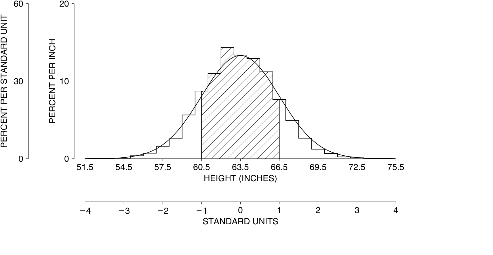

Để hiểu con số 68% bắt nguồn từ đâu, hãy nhìn vào Hình 2. Tỷ lệ phần trăm phụ nữ có chiều cao nằm trong khoảng một SD từ mức trung bình bằng với phần diện tích dưới biểu đồ tần suất nằm trong khoảng một SD từ mức trung bình. Phần diện tích này được tô bóng trong Hình 2. Biểu đồ tần suất bám sát theo đường cong chuẩn khá tốt. Một số phần của nó cao hơn đường cong, và một số phần thấp hơn. Nhưng các phần cao sẽ bù trừ cho các phần thấp. Và diện tích được tô bóng dưới biểu đồ tần suất xấp xỉ bằng diện tích dưới đường cong. Diện tích dưới đường cong chuẩn từ $-1$ đến $+1$ là 68%. Đó là nguồn gốc của con số 68%.

Đối với nhiều danh sách dữ liệu, khoảng 95% các mục nhập nằm trong khoảng 2 SD tính từ mức trung bình. Đây là khoảng

trung bình $- 2\text{SD}$ đến trung bình $+ 2\text{SD}$.

Lập luận cũng tương tự. Nếu biểu đồ tần suất bám sát đường cong chuẩn, diện tích dưới biểu đồ tần suất sẽ xấp xỉ bằng diện tích dưới đường cong. Và diện tích dưới đường cong giữa $-2$ và $+2$ là 95%:

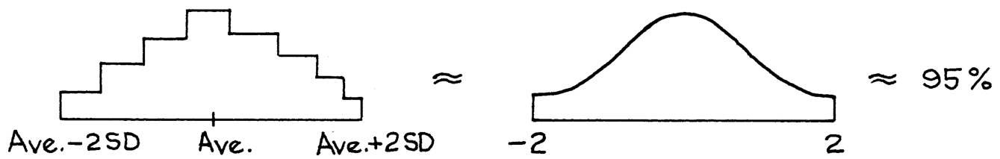

Đường cong chuẩn có thể được sử dụng để ước lượng tỷ lệ phần trăm các mục nhập trong một khoảng nhất định, như sau.2 Đầu tiên, chuyển đổi khoảng đó sang đơn vị chuẩn; thứ hai, tìm 

diện tích tương ứng dưới đường cong chuẩn. Phương pháp để lấy diện tích sẽ được giải thích trong phần 2. Cuối cùng, phần 3 sẽ kết hợp hai bước này lại với nhau. Toàn bộ quy trình này được gọi là _phép xấp xỉ chuẩn_ (normal approximation). Phép xấp xỉ này bao gồm việc thay thế biểu đồ tần suất ban đầu bằng đường cong chuẩn trước khi tìm diện tích.

## Bài tập Phần A (Exercise Set A)

1. Trong một bài thi, điểm số trung bình là 50 và độ lệch chuẩn (SD) là 10.

   - (a) Chuyển đổi mỗi điểm số sau sang đơn vị chuẩn: 60, 45, 75.

   - (b) Tìm các điểm số có giá trị theo đơn vị chuẩn lần lượt là: $0$, $+1.5$, $-2.8$.

2. (a) Chuyển đổi mỗi mục nhập trong danh sách sau sang đơn vị chuẩn (tức là sử dụng mức trung bình và SD của danh sách đó): 13, 9, 11, 7, 10.

   - (b) Tìm mức trung bình và SD của danh sách đã chuyển đổi.

_Đáp án cho các bài tập này ở trang A51._

### 2. TÌM DIỆN TÍCH DƯỚI ĐƯỜNG CONG CHUẨN

Ở cuối cuốn sách, có một bảng cung cấp các diện tích dưới đường cong chuẩn (trang A104). Ví dụ, để tìm diện tích dưới đường cong chuẩn giữa $-1.20$ và $1.20$, hãy tìm đến giá trị $1.20$ trong cột được đánh dấu là _z_ và đọc mục nhập ở cột được đánh dấu là _Area_ (Diện tích). Giá trị này khoảng 77%, vì vậy diện tích dưới đường cong chuẩn giữa $-1.20$ và $1.20$ là khoảng 77%.

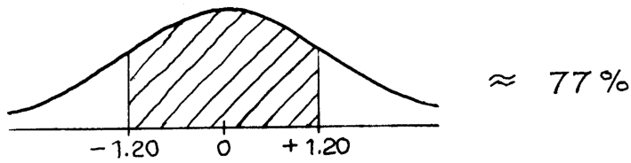

Nhưng bạn cũng sẽ muốn tìm các diện tích khác:

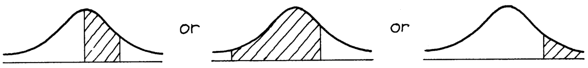

Phương pháp tìm các diện tích như vậy được minh họa qua ví dụ dưới đây.

_Ví dụ 2._ Tìm diện tích giữa 0 và 1 dưới đường cong chuẩn.

_Lời giải._ Đầu tiên hãy phác họa đường cong chuẩn, sau đó tô bóng phần diện tích cần tìm.

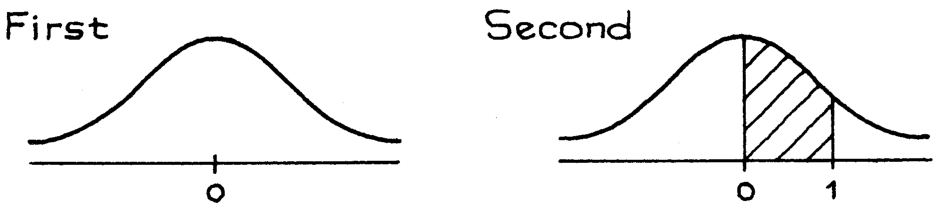

TÌM DIỆN TÍCH DƯỚI ĐƯỜNG CONG CHUẨN

Bảng số liệu sẽ cho bạn biết diện tích giữa $-1$ và $+1$. Con số này là khoảng 68%. Dựa vào tính đối xứng, diện tích giữa 0 và 1 bằng một nửa diện tích giữa $-1$ và $+1$, tức là,

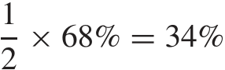

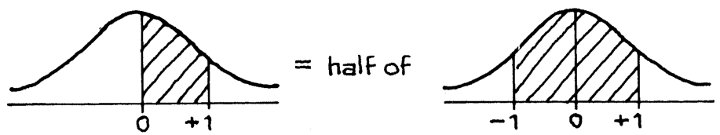

_Ví dụ 3._ Tìm diện tích giữa 0 và 2 dưới đường cong chuẩn. 
_Lời giải._ Diện tích này không gấp đôi diện tích giữa 0 và 1 vì đường cong chuẩn không phải là một hình chữ nhật.

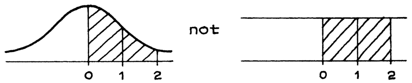

Quy trình cũng tương tự như trong ví dụ 2. Ta có thể tra bảng để tìm diện tích nằm giữa −2 và 2, kết quả là khoảng 95%. Do tính đối xứng, diện tích nằm giữa 0 và 2 sẽ bằng một nửa mức này: 

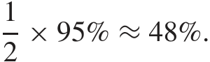

*Ví dụ 4.* Tìm phần diện tích nằm giữa −2 và 1 dưới đường cong chuẩn. 

*Lời giải.* Diện tích nằm giữa −2 và 1 có thể được phân tích thành hai phần diện tích riêng biệt— 

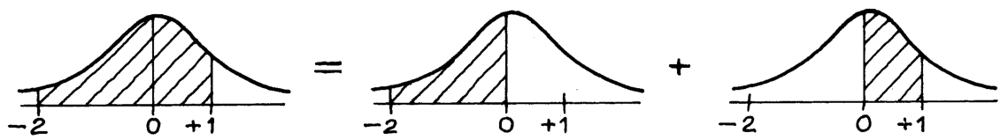

Do tính đối xứng, diện tích giữa −2 và 0 hoàn toàn bằng diện tích giữa 0 và 2, và bằng khoảng 48% (như đã thấy ở ví dụ 3). Diện tích giữa 0 và 1 là khoảng 34% (ví dụ 2). Do đó, tổng diện tích giữa −2 và 1 xấp xỉ bằng: 

48% + 34% = 82% *.* 

*Ví dụ 5.* Tìm phần diện tích nằm bên phải điểm 1 dưới đường cong chuẩn. 

*Lời giải.* Bảng phân phối cho biết diện tích giữa −1 và 1 là 68%. Như vậy, phần diện tích nằm ngoài khoảng này là 32%. 

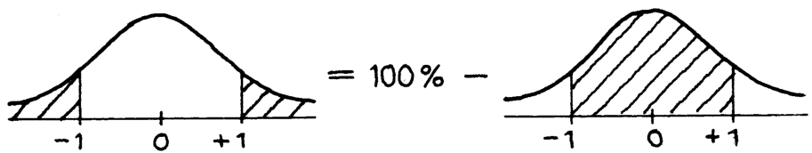

Dựa trên tính đối xứng, phần diện tích nằm bên phải điểm 1 sẽ bằng một nửa của 32%, tức là 16%. 

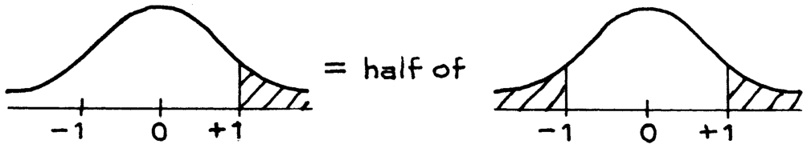

*Ví dụ 6.* Tìm phần diện tích nằm bên trái điểm 2 dưới đường cong chuẩn. 

*Lời giải.* Diện tích nằm bên trái điểm 2 là tổng của phần diện tích bên trái điểm 0 và phần diện tích nằm giữa 0 và 2. 

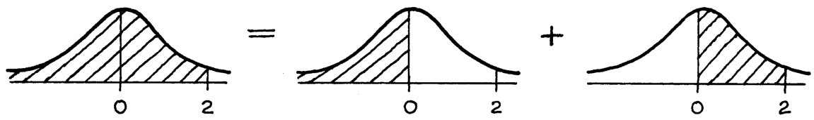

Do đường cong đối xứng, phần diện tích nằm bên trái điểm 0 chiếm một nửa tổng diện tích: 

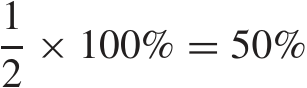

Diện tích từ 0 đến 2 là khoảng 48%. Vậy tổng diện tích cần tìm là 50% + 48% = 98%. 

*Ví dụ 7.* Tìm phần diện tích nằm giữa 1 và 2 dưới đường cong chuẩn. 

*Lời giải.* 

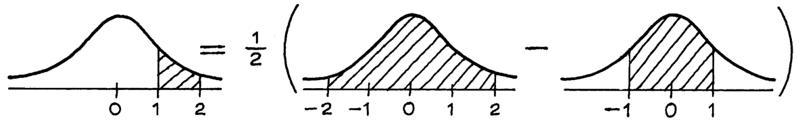

Phần diện tích giữa −2 và 2 là khoảng 95%; phần diện tích giữa −1 và 1 là khoảng 68%. Một nửa hiệu số của hai phần diện tích này chính là phần diện tích cần tìm:

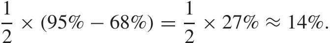

Không có một quy trình cứng nhắc nào để giải quyết các dạng bài tập này. Mấu chốt nằm ở việc vẽ hình phác thảo để thiết lập mối liên hệ giữa phần diện tích cần tìm với các vùng diện tích mà bạn có thể tra cứu được từ bảng.

## Bài tập Nhóm B 

1. Tìm phần diện tích nằm dưới đường cong chuẩn— 

   - (a) bên phải 1.25 (b) bên trái −0.40 

   - (c) bên trái 0.80 

   - (d) giữa 0.40 và 1.30 

   - (e) giữa −0.30 và 0.90 (f) nằm ngoài khoảng từ −1.5 đến 1.5 

2. Điền vào chỗ trống: 

   - (a) Diện tích nằm giữa ± ____ dưới đường cong chuẩn bằng 68%. 
   - (b) Diện tích nằm giữa ± ____ dưới đường cong chuẩn bằng 75%. 

3. Đường cong phân phối chuẩn được phác thảo dưới đây; hãy tìm giá trị của *z* . 

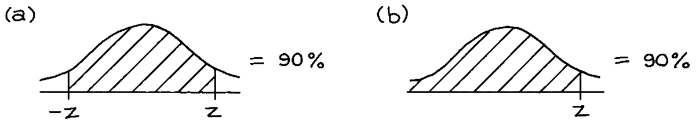

4. Một đường cong (không phải đường cong chuẩn) được phác họa bên dưới. Tổng diện tích nằm dưới đường cong này là 100%, và phần diện tích nằm giữa 0 và 1 là 39%. 

   - (a) Nếu có thể, hãy tìm phần diện tích nằm bên phải điểm 1. 

   - (b) Nếu có thể, hãy tìm phần diện tích nằm giữa 0 và 0.5. 

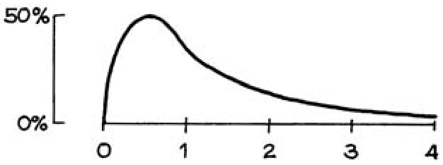

5. Một đường cong (không phải đường cong chuẩn) được phác họa bên dưới. Đường cong này đối xứng qua điểm 0, và tổng diện tích nằm dưới nó là 100%. Phần diện tích từ −1 đến 1 là 58%. 

   - (a) Nếu có thể, hãy tìm phần diện tích nằm giữa 0 và 1. 

   - (b) Nếu có thể, hãy tìm phần diện tích nằm bên phải điểm 1. 

   - (c) Nếu có thể, hãy tìm phần diện tích nằm bên phải điểm 2. 

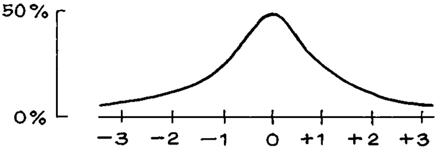

*Đáp án cho các bài tập này có ở trang A51.* 

### 3. XẤP XỈ CHUẨN CHO DỮ LIỆU 

Phương pháp xấp xỉ chuẩn (normal approximation) sẽ được giải thích thông qua ví dụ dưới đây. Các biểu đồ minh họa trông có vẻ rất đơn giản nên bạn có thể nghĩ rằng không cần thiết phải vẽ chúng. Tuy nhiên, việc không vẽ biểu đồ rất dễ khiến bạn nhầm lẫn vùng diện tích cần tính. Vậy nên, xin hãy luôn vẽ các biểu đồ phác thảo.

*Ví dụ 8.* Chiều cao của nam giới từ 18 tuổi trở lên trong khảo sát HANES5 có trung bình (average) là 69 inch; độ lệch chuẩn (SD) là 3 inch. Hãy sử dụng đường cong chuẩn để ước tính tỷ lệ phần trăm nam giới có chiều cao từ 63 inch đến 72 inch. 

*Lời giải.* Tỷ lệ phần trăm này được thể hiện bằng diện tích nằm dưới biểu đồ tần suất (histogram) chiều cao, tính từ 63 inch đến 72 inch. 

*Bước 1.* Vẽ một trục số và tô đậm khoảng này. 

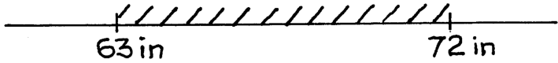

*Bước 2.* Đánh dấu giá trị trung bình trên trục và chuyển đổi các giá trị sang đơn vị chuẩn (standard units). 

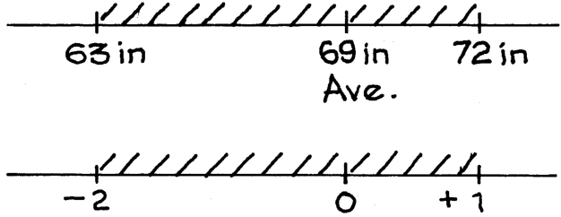

*Bước 3.* Vẽ phác thảo đường cong chuẩn và tìm phần diện tích nằm phía trên khoảng đơn vị chuẩn đã được tô đậm ở bước 2. Tỷ lệ phần trăm xấp xỉ bằng phần diện tích được tô đậm này, tức là gần 82%. 

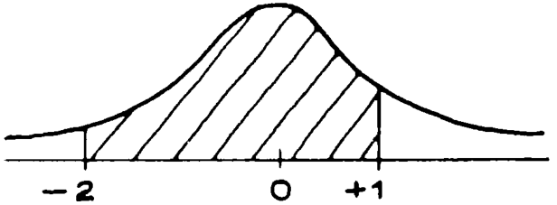

Sử dụng đường cong chuẩn, ta ước tính rằng có khoảng 82% nam giới có chiều cao từ 63 inch đến 72 inch. Dù đây chỉ là một giá trị xấp xỉ, nhưng nó khá chính xác: trên thực tế, 81% nam giới nằm trong khoảng chiều cao đó. Hình 3 minh họa phép xấp xỉ này. 

Hình 3. Phép xấp xỉ chuẩn bao gồm việc thay thế biểu đồ tần suất ban đầu bằng một đường cong chuẩn trước khi tiến hành tính toán các diện tích. 

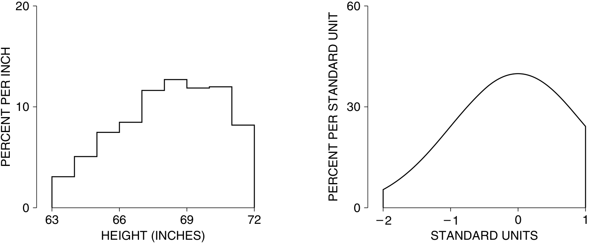

XẤP XỈ CHUẨN CHO DỮ LIỆU 

*Ví dụ 9.* Chiều cao của nữ giới từ 18 tuổi trở lên trong khảo sát HANES5 có trung bình là 63.5 inch; độ lệch chuẩn là 3 inch. Hãy sử dụng đường cong chuẩn để ước tính tỷ lệ phần trăm nữ giới có chiều cao trên 59 inch. 

*Lời giải.* Chiều cao 59 inch nằm dưới mức trung bình 1.5 SD: 

*( 59 − 63.5 ) / 3 = −1.5 .* 

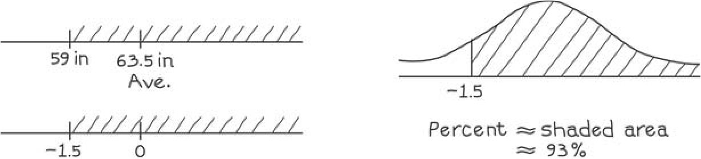

Bằng việc dùng đường cong chuẩn, chúng ta ước tính có 93% nữ giới cao hơn 59 inch. Ước tính này khá sát với thực tế: 96% nữ giới có chiều cao trên 59 inch. 

Một thực tế đáng chú ý là có rất nhiều biểu đồ tần suất tuân theo hình dạng của đường cong phân phối chuẩn. (Chủ đề này sẽ được tiếp tục ở phần V). Đối với những biểu đồ như vậy, giá trị trung bình (average) và độ lệch chuẩn (SD) là các đại lượng thống kê tóm tắt rất tốt. Nếu một biểu đồ tần suất có phân phối chuẩn, nó sẽ trông giống như bản phác thảo ở Hình 4. Giá trị trung bình ghim chặt vị trí trung tâm, còn độ lệch chuẩn thể hiện mức độ phân tán của dữ liệu. Đó gần như là tất cả những gì cần nói về biểu đồ đó—với điều kiện hình dạng của nó tuân theo đường cong chuẩn. Tuy nhiên, vẫn có nhiều biểu đồ tần suất không tuân theo quy luật chuẩn. Trong các trường hợp như vậy, trung bình và độ lệch chuẩn là những số liệu tóm tắt rất kém. Vấn đề này sẽ được bàn luận chi tiết hơn ở phần tiếp theo.

Hình 4. Giá trị trung bình và độ lệch chuẩn (SD). Bằng cách xác định vị trí trung tâm và đo lường mức độ phân tán quanh tâm, trung bình và SD giúp tóm tắt một biểu đồ tần suất tuân theo phân phối chuẩn. 

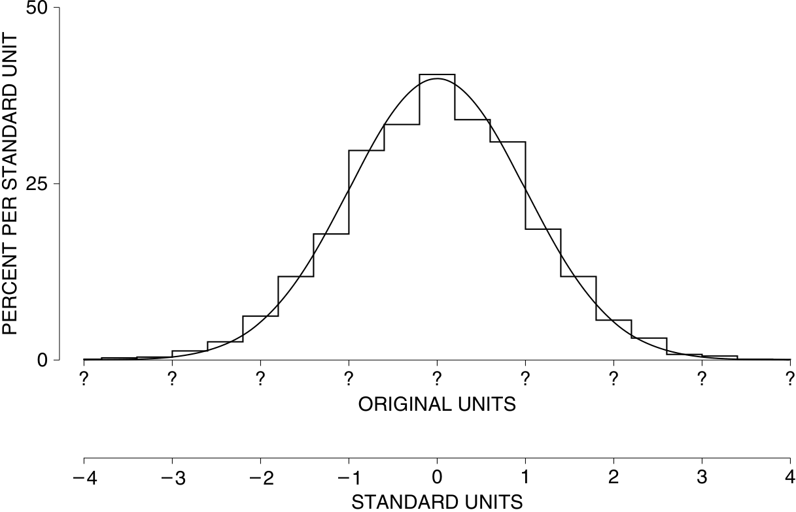

## Bài tập Phần C

1. Đối với phụ nữ từ 18–24 tuổi trong bộ dữ liệu HANES2, chiều cao trung bình là khoảng 64,3 inch; độ lệch chuẩn (SD) là khoảng 2,6 inch. Sử dụng đường cong phân phối chuẩn (normal curve), hãy ước lượng tỷ lệ phần trăm phụ nữ có chiều cao—

   - (a) dưới 66 inch. 

   - (b) từ 60 inch đến 66 inch. 

   - (c) trên 72 inch. 

2. Trong một lớp học ở trường luật, điểm trung bình LSAT của các sinh viên mới nhập học là khoảng 160; SD là khoảng 8. Biểu đồ tần suất (histogram) của điểm LSAT tuân theo đường cong chuẩn khá tốt. (Điểm LSAT dao động từ 120 đến 180; trong số tất cả những người dự thi, điểm trung bình là khoảng 150 và SD là khoảng 9.) 

   - (a) Khoảng bao nhiêu phần trăm lớp học có điểm dưới 166? 

   - (b) Một sinh viên có điểm LSAT cao hơn mức trung bình 0,5 SD. Khoảng bao nhiêu phần trăm sinh viên có điểm thấp hơn anh ta? 

3. Trong Hình 2 (trang 81), tỷ lệ phần trăm phụ nữ có chiều cao từ 61 inch đến 66 inch chính xác bằng với diện tích từ 61 inch đến 66 inch dưới ________ và xấp xỉ bằng diện tích dưới ________. Các lựa chọn: đường cong chuẩn (normal curve), biểu đồ tần suất (histogram). 

_Đáp án cho các bài tập này nằm ở các trang A51–52._ 

### 4. PHÂN VỊ (PERCENTILES)

Trung bình và độ lệch chuẩn có thể được sử dụng để tóm tắt dữ liệu tuân theo đường cong phân phối chuẩn. Tuy nhiên, chúng lại không mấy hiệu quả đối với các loại dữ liệu khác. Hãy xem xét phân phối thu nhập gia đình ở Hoa Kỳ năm 2004, được thể hiện trong Hình 5. 

Hình 5. Phân phối các gia đình theo thu nhập: Hoa Kỳ năm 2004. 

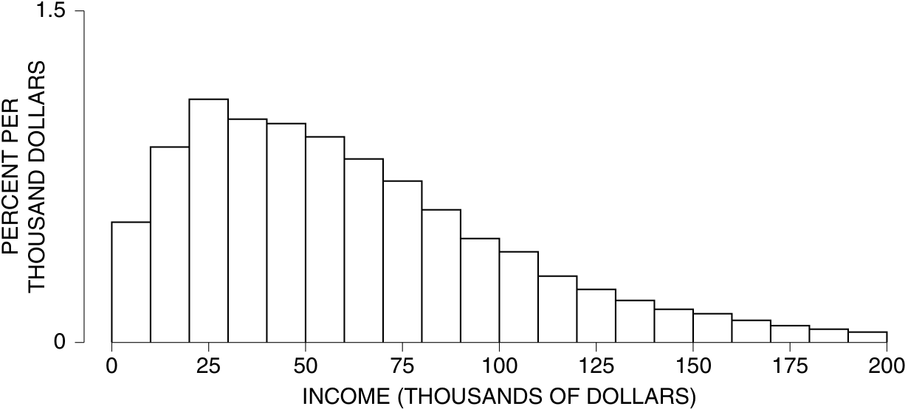

Nguồn: Khảo sát Dân số Hiện tại tháng 3 năm 2005; CD-ROM được cung cấp bởi Cục Điều tra Dân số (Bureau of the Census). Nhóm gia đình cơ bản (Primary families). 

Thu nhập trung bình của các gia đình trong Hình 5 là khoảng 60.000 đô la; độ lệch chuẩn là khoảng 40.000 đô la.3 Do đó, xấp xỉ phân phối chuẩn (normal approximation) gợi ý rằng khoảng 7% trong số các gia đình này có thu nhập âm: 

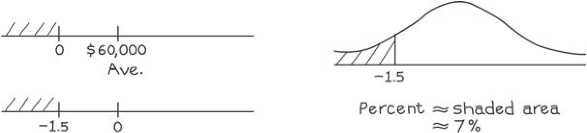

Lý do cho sai lầm này: biểu đồ tần suất trong Hình 5 hoàn toàn không tuân theo đường cong chuẩn; nó có một cái đuôi dài về bên phải (lệch phải). Để tóm tắt các biểu đồ tần suất như vậy, các nhà thống kê thường sử dụng các _phân vị_ (_percentiles_) (Bảng 1). 

Bảng 1. Một số phân vị cho thu nhập gia đình ở Hoa Kỳ năm 2004. 

|1|$0|
|---|---|
|10|$15,000|
|25|$29,000|
|50|$54,000|
|75|$90,000|
|90|$135,000|
|99|$430,000|

Nguồn: Khảo sát Dân số Hiện tại tháng 3 năm 2005; CD-ROM được cung cấp bởi Cục Điều tra Dân số (Bureau of the Census). Nhóm gia đình cơ bản (Primary families). 

Phân vị thứ 1 của phân phối thu nhập là $0, nghĩa là có khoảng 1% các gia đình có thu nhập bằng $0 hoặc thấp hơn, và khoảng 99% có thu nhập trên mức đó. (Chủ yếu, các gia đình không có thu nhập là những người đã nghỉ hưu hoặc không làm việc vì một số lý do khác.) Phân vị thứ 10 là 15.000 đô la: khoảng 10% số gia đình có thu nhập dưới mức đó, và 90% nằm trên mức đó. Phân vị thứ 50 chính là trung vị (median) (chương 4). 

Theo định nghĩa, _khoảng tứ phân vị_ (_interquartile range_) bằng 

Phân vị thứ 75 − Phân vị thứ 25 _._ 

Giá trị này đôi khi được sử dụng như một thước đo mức độ phân tán (measure of spread), khi phân phối có đuôi dài. Đối với Bảng 1, khoảng tứ phân vị là 61.000 đô la. 

Vì những lý do riêng, các nhà thống kê gọi đường cong của de Moivre là "chuẩn" (normal). Điều này tạo cảm giác rằng các đường cong khác là bất thường (abnormal). Sự thực không phải vậy. Nhiều biểu đồ tần suất tuân theo đường cong chuẩn rất tốt, và nhiều biểu đồ khác—như biểu đồ thu nhập—lại không. Ở phần sau của cuốn sách, chúng tôi sẽ trình bày một lý thuyết toán học giúp giải thích khi nào các biểu đồ tần suất sẽ tuân theo đường cong chuẩn. 

## Bài tập Phần D

1. Điền vào chỗ trống, sử dụng các tùy chọn dưới đây. 

   - (a) Tỷ lệ phần trăm các gia đình trong Bảng 1 có thu nhập dưới 90.000 đô la là khoảng ________. 

   - (b) Khoảng 25% các gia đình trong Bảng 1 có thu nhập dưới 

- ________. 

- (c) Tỷ lệ phần trăm các gia đình trong Bảng 1 có thu nhập từ 15.000 đô la đến 125.000 đô la là khoảng ________. 

5% 10% 25% 60% 75% 95% $29,000 $90,000 

2. Năm 2004, một gia đình có thu nhập 9.000 đô la nằm ở phân vị thứ ________ của phân phối thu nhập, trong khi một gia đình kiếm được 174.000 đô la nằm ở phân vị thứ ________. Các lựa chọn: 5, 95. 

3. Phân vị thứ 25 đối với phân phối thu nhập gia đình năm 1973 là khoảng 7.000 đô la, 10.000 đô la hay 25.000 đô la? (Xem Bảng 1 ở trang 35.) 

4. Độ dày nếp gấp da (skinfold thickness) được sử dụng để đo lượng mỡ trong cơ thể. Một biểu đồ tần suất về độ dày nếp gấp da được hiển thị bên dưới; đơn vị trên trục hoành là milimét (mm). Phân vị thứ 25 của độ dày nếp gấp da là 25 mm. Điền vào chỗ trống, sử dụng một trong các cụm từ bên dưới. Hoặc điều này không thể xác định được từ hình vẽ? nhỏ hơn khá nhiều so với (quite a bit smaller than) / ở khoảng (around) / lớn hơn khá nhiều so với (quite a bit bigger than) 

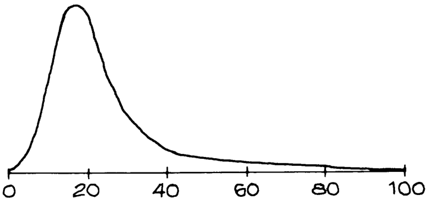

5. Một biểu đồ tần suất được phác thảo bên dưới. 

   - (a) Nó khác với đường cong chuẩn như thế nào? 

   - (b) Khoảng tứ phân vị là khoảng 15, 25, hay 50? 

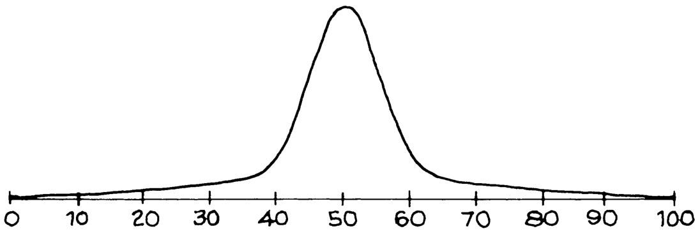

_Đáp án cho các bài tập này nằm ở trang A52._ 

### 5. PHÂN VỊ VÀ ĐƯỜNG CONG CHUẨN 

Khi một biểu đồ tần suất thực sự tuân theo đường cong chuẩn, ta có thể dùng bảng phân phối chuẩn để ước lượng các phân vị của nó. Phương pháp này được minh họa qua ví dụ sau. 

_Ví dụ 10._ Trong số tất cả các ứng viên vào một trường đại học nhất định trong một năm, điểm Toán SAT có trung bình là 535, độ lệch chuẩn là 100, và điểm số tuân theo đường cong phân phối chuẩn. Hãy ước lượng phân vị thứ 95 của phân phối điểm số. 

_Lời giải._ Điểm số này cao hơn mức trung bình một số lần của SD. Chúng ta cần tìm con số đó, gọi nó là _z_ . Có một phương trình cho _z_ : 

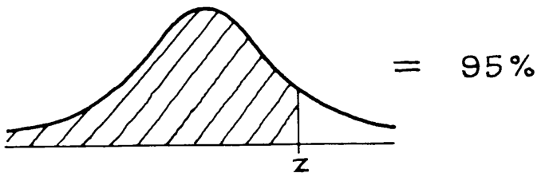

Bảng phân phối chuẩn không thể được sử dụng trực tiếp, vì nó cung cấp phần diện tích từ −_z_ đến _z_ thay vì diện tích phía bên trái của _z_ . 

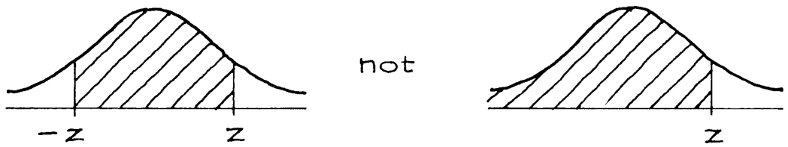

Diện tích phía bên phải của _z_ của chúng ta là 5%, do đó diện tích phía bên trái của −_z_ cũng là 5%. Vậy thì diện tích nằm giữa −_z_ và _z_ phải là 100% − 5% − 5% = 90%. 

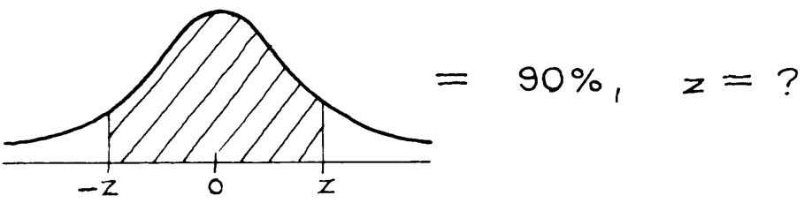

Từ bảng, ta thấy _z_ ≈ 1,65. Bạn phải đạt điểm cao hơn mức trung bình 1,65 SD để nằm ở phân vị thứ 95 của phần Toán SAT. Quy đổi ngược lại thành điểm số, điểm số này cao hơn mức trung bình là 1,65 × 100 = 165 điểm. Phân vị thứ 95 của phân phối điểm số là 535 + 165 = 700. 

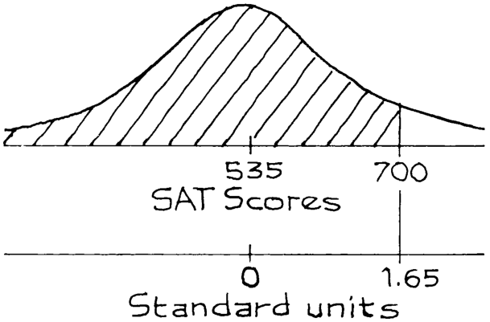

Thuật ngữ này có đôi chút dễ gây nhầm lẫn. _Phân vị_ (percentile) là một mức điểm: trong ví dụ 10, phân vị thứ 95 là mức điểm 700. Tuy nhiên, _thứ hạng phần trăm_ (percentile rank) lại là một tỷ lệ phần trăm: nếu bạn đạt được điểm 700, thứ hạng phần trăm của bạn là 95%. Thậm chí còn có một cách nói thứ ba cho cùng một điều đó: mức điểm 700 đặt bạn ở vào phân vị thứ 95 của phân phối điểm số. 

## Bài tập Phần E 

1. Tại trường đại học trong ví dụ 10, một nữ ứng viên đạt 750 điểm ở bài thi Toán SAT. Cô ấy đang ở phân vị thứ ________ của phân phối điểm. 

2. Đối với trường đại học trong ví dụ 10, hãy ước lượng phân vị thứ 80 của điểm Toán SAT. 

3. Đối với sinh viên năm nhất trường Berkeley, điểm trung bình tích lũy (GPA - grade point average) là khoảng 3,0; độ lệch chuẩn là khoảng 0,5. Biểu đồ tần suất tuân theo đường cong chuẩn. Hãy ước lượng phân vị thứ 30 của phân phối điểm GPA. 

_Đáp án cho các bài tập này nằm ở trang A52._ 

### 6. THAY ĐỔI THANG ĐO 

Nếu bạn cộng cùng một số vào mỗi phần tử trong một danh sách, số đó sẽ chỉ được cộng thêm vào giá trị trung bình; độ lệch chuẩn không thay đổi. (Các độ lệch so với trung bình không thay đổi, bởi vì hằng số được cộng vào chỉ đơn giản là triệt tiêu lẫn nhau.) Hơn nữa, nếu bạn nhân mọi phần tử trong danh sách với cùng một số, giá trị trung bình và độ lệch chuẩn cũng sẽ chỉ được nhân với con số đó. Có một ngoại lệ: nếu hằng số nhân đó là số âm, hãy loại bỏ dấu của nó (lấy giá trị tuyệt đối) trước khi nhân với độ lệch chuẩn. Các bài tập 5–8 ở trang 73 đã minh họa cho những ý tưởng này. 

_Ví dụ 11._ 

- (a) Tìm trung bình và độ lệch chuẩn của danh sách 1, 3, 4, 5, 7. 

- (b) Lấy danh sách ở phần (a), nhân mỗi phần tử với 3 rồi cộng thêm 7, ta được danh sách 10, 16, 19, 22, 28. Hãy tìm trung bình và độ lệch chuẩn (SD) của danh sách mới này.

_Lời giải. Phần (a)_. Giá trị trung bình là 4. Vì vậy, các độ lệch so với trung bình (deviations from average) là −3, −1, 0, 1, 3. SD là 2.

_Phần (b)_. Giá trị trung bình là 3×4 + 7 = 19, SD là 3 × 2 = 6. (Tất nhiên, bạn cũng có thể tự tính trực tiếp ra các con số này.)

_Ví dụ 12._ Chuyển đổi các danh sách sau sang đơn vị chuẩn (standard units): (a) 1, 3, 4, 5, 7

- (b) 10, 16, 19, 22, 28

(Đây là hai danh sách trong ví dụ trước.)

_Lời giải. Phần (a)._ Giá trị trung bình là 4, và các độ lệch so với trung bình là −3, −1, 0, 1, 3. SD là 2. Chia cho 2, ta nhận được danh sách tính theo đơn vị chuẩn:

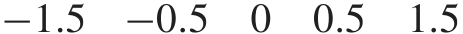

_Phần (b)._ Bây giờ trung bình là 19, và các độ lệch so với trung bình là −9, −3, 0, 3, 9. SD là 6. Chia cho 6, ta nhận được danh sách tính theo đơn vị chuẩn:

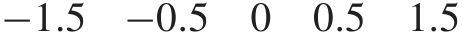

Hai danh sách này giống hệt nhau khi được tính theo đơn vị chuẩn.

Danh sách (b) được tạo ra từ danh sách (a) bằng cách thay đổi thang đo: nhân với 3, cộng thêm 7. Hằng số 7 bị triệt tiêu (washes out) khi ta tính các độ lệch so với trung bình. Hằng số 3 cũng bị triệt tiêu khi ta chia cho SD — bởi vì chính SD cũng đã được nhân với 3 cùng với mọi độ lệch. Đó là lý do tại sao hai danh sách lại giống nhau trong hệ đơn vị chuẩn. Tóm lại:

- (i) Việc cộng thêm một số giống nhau vào mọi phần tử trong danh sách sẽ làm giá trị trung bình tăng thêm đúng một lượng bằng hằng số đó; trong khi SD không thay đổi.

- (ii) Việc nhân mọi phần tử trong danh sách với cùng một số dương sẽ làm cả giá trị trung bình và SD được nhân lên theo hằng số đó.

- (iii) Những phép thay đổi thang đo này không làm thay đổi các đơn vị chuẩn.

Việc chuyển đổi nhiệt độ từ độ Fahrenheit sang độ Celsius là một ví dụ thực tế:

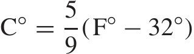

Các nhà thống kê gọi đây là _thay đổi thang đo_ (change of scale), vì bản chất chỉ có các đơn vị là thay đổi. (Điều gì sẽ xảy ra nếu bạn nhân tất cả các số trong một danh sách với cùng một hằng số âm? Trong đơn vị chuẩn, điều đó chỉ đơn giản là làm đảo ngược tất cả các dấu.)

## Bài tập Nhóm F

1. Một nhóm người có nhiệt độ cơ thể trung bình là 98.6 độ Fahrenheit, với SD là 0.3 độ.

   - (a) Hãy chuyển đổi các kết quả này sang độ Celsius.

   - (b) Một người có nhiệt độ cao hơn mức trung bình 1.5 SD theo thang đo Fahrenheit. Hãy chuyển đổi nhiệt độ này sang đơn vị chuẩn, dành cho một điều tra viên đang sử dụng thang đo Celsius.

_Đáp án cho các bài tập này nằm ở trang A52._

### 7. BÀI TẬP ÔN TẬP

_Bài tập ôn tập có thể bao gồm cả các tài liệu từ những chương trước._

1. Danh sách điểm thi dưới đây có điểm trung bình là 50 và SD là 10:

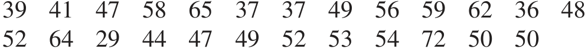

   - (a) Sử dụng xấp xỉ phân phối chuẩn (normal approximation) để ước lượng số lượng điểm số nằm trong khoảng 1.25 SD so với giá trị trung bình.

   - (b) Thực tế có bao nhiêu điểm số thực sự nằm trong khoảng 1.25 SD so với trung bình?

2. Bạn đang xem một bản in máy tính gồm 100 điểm thi, chúng đã được chuyển đổi sang đơn vị chuẩn. 10 kết quả đầu tiên là:

−6 _._ 2 3 _._ 5 1 _._ 2 −0 _._ 13 4 _._ 3 −5 _._ 1 −7 _._ 2 −11 _._ 3 1 _._ 8 6 _._ 3

Bản in này có vẻ hợp lý không, hay máy tính đang bị lỗi gì đó?

3. Từ giữa thập niên 1960 đến đầu thập niên 1990, điểm thi SAT đã có sự sụt giảm chậm nhưng đều đặn. Lấy ví dụ với phần thi SAT Verbal. Điểm trung bình năm 1967 là khoảng 543; đến năm 1994, mức trung bình đã giảm xuống còn khoảng 499. Tuy nhiên, SD vẫn giữ ở mức xấp xỉ 110. Sự sụt giảm của các mức trung bình này có tác động lớn đến các phần đuôi của phân phối (tails of the distribution).

   - (a) Ước lượng tỷ lệ phần trăm học sinh đạt điểm trên 700 vào năm 1967.

   - (b) Ước lượng tỷ lệ phần trăm học sinh đạt điểm trên 700 vào năm 1994.

Bạn có thể giả định rằng các biểu đồ tần suất (histograms) tuân theo đường cong phân phối chuẩn (normal curve).

_Bình luận_ . Điểm thi SAT dao động trong khoảng từ 200 đến 800. Có vẻ như không phải do bài thi SAT ngày càng khó hơn. Phần lớn sự sụt giảm trong những năm 1960 được cho là do sự thay đổi về thành phần quần thể học sinh tham gia kỳ thi. Sự sụt giảm trong những năm 1970 lại không thể được giải thích theo cách đó. Từ năm 1994 đến 2005, điểm số nhìn chung đã tăng lên. Bài thi đã được chuẩn hóa lại (re-normalized) vào năm 1996, điều này làm cho việc diễn giải trở nên phức tạp hơn; các mức trung bình được đề cập ở trên đã được chuyển đổi sang thang điểm mới.4

4. Trong phần thi SAT Toán (Math SAT), nam giới có một lợi thế khá rõ rệt. Chẳng hạn vào năm 2005, nam giới đạt điểm trung bình khoảng 538, trong khi nữ giới đạt mức trung bình khoảng 504.

   - (a) Ước lượng tỷ lệ phần trăm nam giới đạt điểm trên 700 trong bài thi này vào năm 2005.

   - (b) Ước lượng tỷ lệ phần trăm nữ giới đạt điểm trên 700 trong bài thi này vào năm 2005.

Bạn có thể giả định rằng (i) các biểu đồ tần suất tuân theo đường cong phân phối chuẩn, và (ii) cả hai SD đều vào khoảng 120.4

5. Trong nghiên cứu HANES5, đàn ông từ 18 tuổi trở lên có chiều cao trung bình là 69 inch và SD là 3 inch. Biểu đồ tần suất được hiển thị bên dưới, cùng với một đường cong phân phối chuẩn. Tỷ lệ phần trăm những người đàn ông có chiều cao từ 66 inch đến 72 inch bằng chính xác diện tích nằm giữa (a) và (b) dưới (c) . Tỷ lệ phần trăm này xấp xỉ bằng diện tích nằm giữa (d) và (e) dưới (f) . Hãy điền vào chỗ trống. Đối với (a), (b), (d) và (e), các lựa chọn của bạn là:

66 inches 72 inches −1 +1

Đối với (c) và (f), các lựa chọn của bạn là: đường cong chuẩn (normal curve), biểu đồ tần suất (histogram)

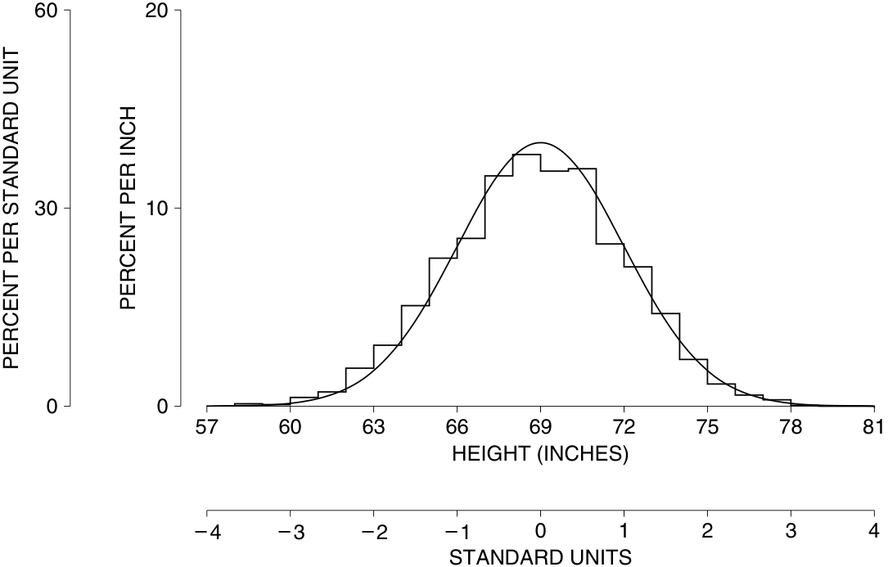

95

BÀI TẬP ÔN TẬP

6. Trong số các ứng viên nộp hồ sơ vào một trường luật, điểm trung bình LSAT là khoảng 169, SD khoảng 9, và điểm cao nhất là 178. Hỏi điểm LSAT của các ứng viên này có tuân theo đường cong phân phối chuẩn không?

7. Trong số các sinh viên năm nhất tại một trường đại học nọ, điểm thi SAT Toán tuân theo đường cong phân phối chuẩn, với mức trung bình là 550 và SD là 100. Hãy điền vào chỗ trống; và giải thích ngắn gọn.

   - (a) Một sinh viên đạt 400 điểm trong bài thi SAT Toán đang ở vị trí phân vị thứ ______ (th percentile) của phân phối điểm số.

   - (b) Để lọt vào nhóm phân vị thứ 75 của phân phối, một sinh viên cần đạt khoảng ______ điểm trong bài thi SAT Toán.

8. Đúng hay sai, và giải thích ngắn gọn—

   - (a) Nếu bạn cộng thêm 7 vào mỗi phần tử trong danh sách, giá trị trung bình sẽ tăng thêm 7.

   - (b) Nếu bạn cộng thêm 7 vào mỗi phần tử trong danh sách, SD sẽ tăng thêm 7.

   - (c) Nếu bạn nhân đôi mỗi phần tử trong danh sách, giá trị trung bình sẽ được nhân đôi.

   - (d) Nếu bạn nhân đôi mỗi phần tử trong danh sách, SD sẽ được nhân đôi.

   - (e) Nếu bạn đổi dấu của mỗi phần tử trong danh sách, dấu của giá trị trung bình sẽ bị đảo ngược.

   - (f) Nếu bạn đổi dấu của mỗi phần tử trong danh sách, dấu của SD sẽ bị đảo ngược.

9. Câu nào dưới đây là đúng? sai? Hãy giải thích hoặc đưa ra ví dụ minh họa.

   - (a) Trung vị (median) và trung bình (average) của bất kỳ danh sách nào cũng luôn có giá trị gần nhau.

   - (b) Một nửa danh sách luôn luôn nằm dưới mức trung bình.

   - (c) Với một mẫu có kích thước lớn và mang tính đại diện, biểu đồ tần suất chắc chắn sẽ bám sát đường cong phân phối chuẩn.

   - (d) Nếu hai danh sách số có cùng chính xác mức trung bình là 50 và cùng SD là 10, thì tỷ lệ phần trăm các phần tử nằm trong khoảng từ 40 đến 60 chắc chắn phải hoàn toàn bằng nhau ở cả hai danh sách.

10. Đối với phụ nữ từ 25–34 tuổi có công việc toàn thời gian, thu nhập trung bình vào năm 2004 là $32,000. SD là $26,000, và có 1 _/_ 4 của 1% (tức 0.25%) đạt mức thu nhập trên $150,000. Hỏi tỷ lệ phần trăm những người có thu nhập trong khoảng từ $32,000 đến $150,000 là khoảng 40%, 50%, hay 60%? Hãy chọn một đáp án và giải thích ngắn gọn.5

11. Trong một học kỳ nọ, khoảng 700 sinh viên lớp Thống kê 2 (Statistics 2) tại Đại học California, Berkeley, đã được hỏi xem họ từng tham gia bao nhiêu khóa học toán ở bậc đại học, ngoại trừ lớp Thống kê 2. Số lượng khóa học trung bình là khoảng 1.1; SD là khoảng 1.5. Hỏi biểu đồ tần suất cho dữ liệu này sẽ trông giống (i), (ii), hay (iii)? Tại sao?

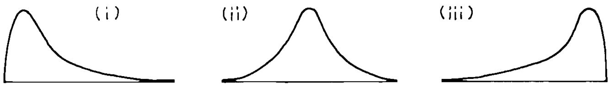

12. Năm 2005, điểm trung bình trong bài thi SAT Toán là khoảng 520. Tuy nhiên, trong số các học sinh tham gia một bài thi môn chuyên ngành (subject-matter test), điểm trung bình của SAT Toán lại lên tới khoảng 624.6 Điều gì giải thích cho sự khác biệt này?

8. TÓM TẮT

1. _Đường cong phân phối chuẩn_ (normal curve) có tính đối xứng qua giá trị 0, và tổng diện tích dưới đường cong là 100%.

2. _Đơn vị chuẩn_ (standard units) cho biết một giá trị cách mức trung bình bao nhiêu độ lệch chuẩn (SD), nằm ở phía trên (+) hay phía dưới (−).

3. Rất nhiều biểu đồ tần suất có hình dạng gần giống với đường cong phân phối chuẩn.

4. Nếu một danh sách các số tuân theo đường cong chuẩn, ta có thể ước lượng tỷ lệ phần trăm các phần tử rơi vào một khoảng cho trước bằng cách chuyển đổi khoảng đó sang đơn vị chuẩn, và sau đó tìm diện tích tương ứng dưới đường cong chuẩn. Quy trình này được gọi là _xấp xỉ phân phối chuẩn_ (normal approximation).

5. Một biểu đồ tần suất tuân theo đường cong chuẩn có thể được tái thiết lập lại khá tốt dựa vào trung bình và SD của nó. Trong những trường hợp như vậy, trung bình và SD là các thống kê tóm tắt (summary statistics) cực kỳ hiệu quả.

6. Mọi biểu đồ tần suất, dù có tuân theo đường cong chuẩn hay không, đều có thể được tóm tắt thông qua việc sử dụng các _điểm phân vị_ (percentiles).

7. Nếu bạn cộng thêm cùng một số vào mọi phần tử trong danh sách, thì hằng số đó chỉ đơn giản được cộng vào giá trị trung bình; còn SD không hề thay đổi. Nếu bạn nhân mọi phần tử trên một danh sách với cùng một số dương, thì cả trung bình và SD đều sẽ được nhân lên với hằng số đó. (Nếu hằng số đó là số âm, hãy xóa dấu âm đó đi trước khi nhân vào SD.)

