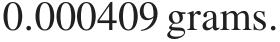
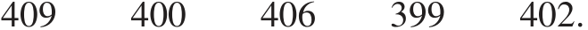
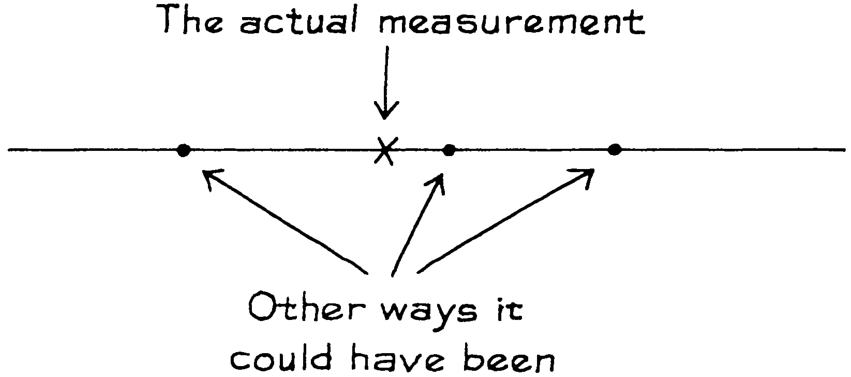
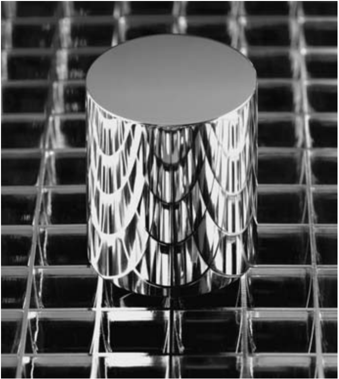
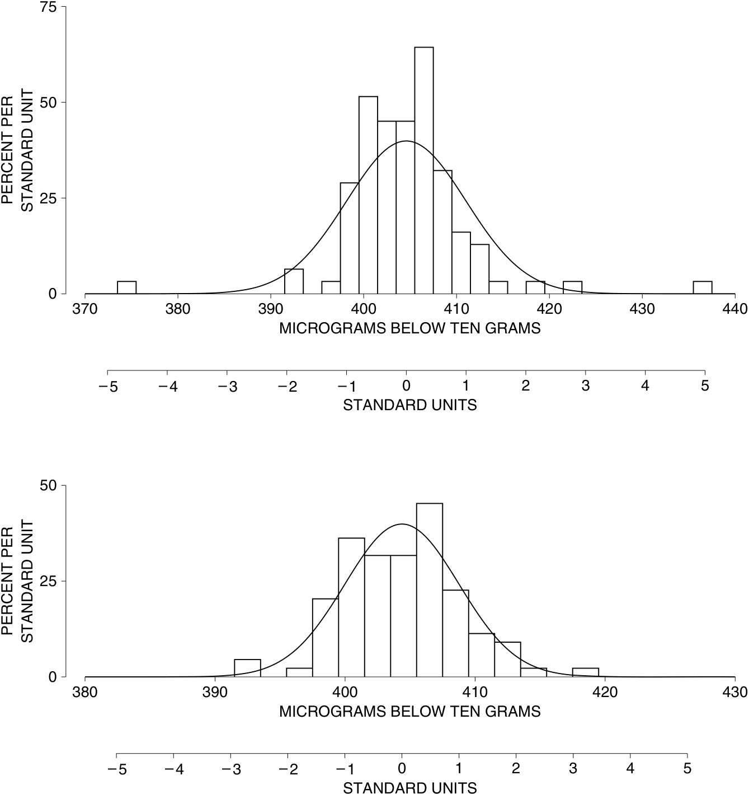
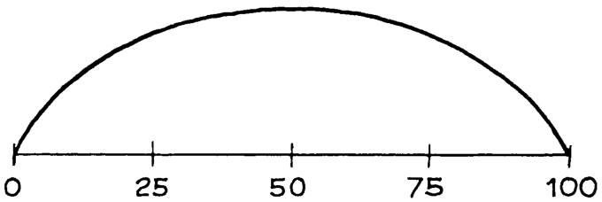
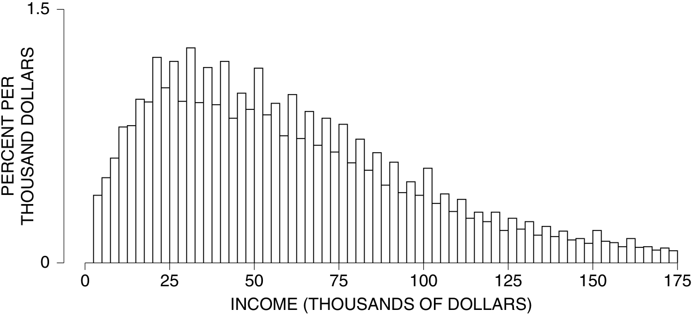

# 6 

## Sai số đo lường (Measurement Error)

_Chúa Giê-su: Ta đến để làm chứng cho sự thật. Phi-lát: Sự thật là gì?_ 

### 1. GIỚI THIỆU

Trong một thế giới lý tưởng, nếu cùng một vật được đo đạc nhiều lần, chúng ta sẽ thu được cùng một kết quả ở mỗi lần đo. Tuy nhiên trong thực tế, luôn có sự khác biệt. Mỗi kết quả đo đều bị sai lệch bởi sai số ngẫu nhiên (chance error), và sai số này thay đổi từ lần đo này sang lần đo khác. Một trong những nhà khoa học đầu tiên giải quyết vấn đề này là Tycho Brahé (1546–1601), một nhà thiên văn học người Đan Mạch. Nhưng có lẽ nó đã được chú ý đến đầu tiên tại các khu chợ, khi những thương gia cân đo các loại gia vị và chiều dài của những tấm lụa. 

Có một vài câu hỏi được đặt ra về các sai số ngẫu nhiên. Chúng bắt nguồn từ đâu? Kích thước của chúng có thể lớn đến mức nào? Bao nhiêu phần của sai số có khả năng tự triệt tiêu đi khi tính trung bình? Câu hỏi đầu tiên có một câu trả lời ngắn gọn: trong hầu hết các trường hợp, không ai biết cả. Câu hỏi thứ hai sẽ được giải quyết sau trong chương này, và câu hỏi thứ ba sẽ được trả lời ở phần VII. 

### 2. SAI SỐ NGẪU NHIÊN

Phần này sẽ thảo luận về các sai số ngẫu nhiên trong phép cân chính xác được thực hiện tại Viện Tiêu chuẩn Quốc gia (National Bureau of Standards).1 Đầu tiên, cần giải thích ngắn gọn về các quả cân chuẩn (standard weights). Các cửa hàng thường cân đo hàng hóa trên những chiếc cân. Những chiếc cân này được kiểm tra định kỳ bởi các 

quan chức phụ trách đo lường của hạt (county), sử dụng các quả cân chuẩn của hạt. Các quả cân chuẩn của hạt cũng phải được _hiệu chuẩn_ (calibrated - tức là được kiểm tra đối chiếu với các tiêu chuẩn bên ngoài) một cách định kỳ. Việc này được thực hiện ở cấp bang. Và các quả cân chuẩn của bang lại được hiệu chuẩn dựa trên các tiêu chuẩn quốc gia, bởi Viện Tiêu chuẩn Quốc gia tại Washington, D.C. 

Chuỗi so sánh này kết thúc tại Bản mẫu Kilôgam Quốc tế (gọi tắt là The Kilogram), một quả cân làm bằng hợp kim bạch kim - iridi (platinum-iridium) được lưu giữ tại Viện Cân đo Quốc tế gần Paris. Theo một hiệp ước quốc tế — Hiệp ước Mét (The Treaty of the Meter) năm 1875 — "một kilôgam" được định nghĩa là trọng lượng của vật thể này trong các điều kiện tiêu chuẩn.2 Tất cả các trọng lượng khác đều được xác định tương đối so với The Kilogram. Chẳng hạn, một vật nặng một pound (khoảng 0.45kg) nếu nó nhẹ hơn một nửa The Kilogram một chút. Chính xác hơn là, 

### 1 Pound = 0 _._ 4539237 của The Kilogram. 

Nói rằng một gói bơ nặng một pound có nghĩa là nó đã trải qua một chuỗi các phép so sánh dài và phức tạp với The Kilogram ở Paris, và nặng bằng 0.4539237 lần quả cân đó. 

Mỗi quốc gia ký kết Hiệp ước Mét đều nhận được một bản mẫu kilôgam quốc gia, mà trọng lượng chính xác của nó đã được xác định một cách chuẩn xác nhất có thể so với The Kilogram. Các bản mẫu này được phân phối thông qua bốc thăm, và Hoa Kỳ nhận được Kilôgam số 20 (Kilogram #20). Giá trị của tất cả các tiêu chuẩn quốc gia của Hoa Kỳ đều được xác định tương đối so với K20. 

Ở Hoa Kỳ, độ chính xác của việc cân đo tại các siêu thị cuối cùng phụ thuộc vào độ chính xác của công tác hiệu chuẩn được thực hiện tại Viện Tiêu chuẩn. Một vấn đề cơ bản là khả năng tái tạo (reproducibility): nếu một phép đo được lặp lại, kết quả sẽ thay đổi bao nhiêu? Viện giải quyết vấn đề này bằng cách tiến hành đo lặp lại trên một số quả cân của chính họ. Chúng ta sẽ thảo luận về kết quả đối với một quả cân như vậy, được gọi là NB 10 vì nó thuộc sở hữu của Viện Tiêu chuẩn Quốc gia (National Bureau) và giá trị danh định (nominal value - giá trị trên lý thuyết) của nó là 10 gram — tương đương trọng lượng của hai đồng xu 5 xu (nickel). (Một gói bơ có trọng lượng "danh định" là 1 pound; nhưng trọng lượng thực tế sẽ khác một chút do sai số ngẫu nhiên trong lượng bơ; tương tự, những người chế tạo quả cân NB 10 đã cố gắng làm cho nó nặng đúng 10 gram, và bị lệch đi một chút.) 

Quả cân NB 10 được Viện mua lại vào khoảng năm 1940, và kể từ đó họ đã đem cân nó rất nhiều lần. Chúng ta sẽ xem xét 100 lần cân trong số đó. Những phép đo này được thực hiện trong cùng một căn phòng, trên cùng một thiết bị, và bởi cùng những kỹ thuật viên. Mọi nỗ lực đều được thực hiện nhằm tuân thủ quy trình y hệt nhau trong mỗi lần đo. Tất cả các yếu tố được biết là có thể ảnh hưởng đến kết quả, chẳng hạn như áp suất không khí hay nhiệt độ, đều được giữ không đổi ở mức tối đa có thể. 

Năm lần cân đầu tiên trong chuỗi phép đo là 

9.999591 gram 9.999600 gram 9.999594 gram 9.999601 gram 9.999598 gram 

Thoạt nhìn, những con số này dường như hoàn toàn giống nhau. Nhưng hãy nhìn kỹ hơn. Chỉ có 4 chữ số đầu tiên là ổn định, ở mức 9.999. Ba chữ số cuối lại không vững, chúng thay đổi liên tục từ lần đo này sang lần đo khác. Đây chính là dấu hiệu của sai số ngẫu nhiên.3 

Quả cân NB 10 thực sự nhẹ hơn 10 gram một chút. Thay vì phải viết phần 9.999 ở mỗi lần ghi, Viện Tiêu chuẩn chỉ báo cáo phần hụt của NB 10 so với mốc 10 gram. Đối với lần cân đầu tiên, mức này là 

Những số 0 làm ta bị rối mắt, vì vậy Viện Tiêu chuẩn không làm việc với đơn vị gram mà chuyển sang dùng microgram: một _microgram_ bằng một phần triệu của một gram. Trong đơn vị này, 5 kết quả đo đầu tiên của NB 10 trở nên dễ đọc hơn. Chúng là 

Toàn bộ 100 lần đo đều được trình bày ở Bảng 1. Nhìn xuống bảng, bạn có thể thấy các kết quả dao động quanh mức 400 microgram, nhưng một số cao hơn, một số khác lại thấp hơn. Con số nhỏ nhất là 375 microgram (lần đo số 94); con số lớn nhất là 437 microgram (lần đo số 86). Và có rất nhiều sự biến thiên nằm ở khoảng giữa. Để dễ hình dung, một microgram tương đương với trọng lượng của một hạt bụi lớn; còn 400 microgram thì bằng trọng lượng của một hoặc hai hạt muối. Đây thực sự là phép cân vô cùng chuẩn xác! 

Mặc dù vậy, không thể nào tất cả các phép đo khác nhau này đều đúng. Lượng hụt chính xác của NB 10 so với 10 gram rất khó có khả năng bằng đúng con số đầu tiên 

Bảng 1. Một trăm phép đo trên quả cân NB 10. Thực hiện bởi Almer và Jones, Viện Tiêu chuẩn Quốc gia. Đơn vị là số microgram thấp hơn 10 gram. 

|_Lần_|_Kết quả_|_Lần_|_Kết quả_|_Lần_|_Kết quả_|_Lần_|_Kết quả_|
|---|---|---|---|---|---|---|---|
|1|409|26|397|51|404|76|404|
|2|400|27|407|52|406|77|401|
|3|406|28|401|53|407|78|404|
|4|399|29|399|54|405|79|408|
|5|402|30|401|55|411|80|406|
|6|406|31|403|56|410|81|408|
|7|401|32|400|57|410|82|406|
|8|403|33|410|58|410|83|401|
|9|401|34|401|59|401|84|412|
|10|403|35|407|60|402|85|393|
|11|398|36|423|61|404|86|437|
|12|403|37|406|62|405|87|418|
|13|407|38|406|63|392|88|415|
|14|402|39|402|64|407|89|404|
|15|401|40|405|65|406|90|401|
|16|399|41|405|66|404|91|401|
|17|400|42|409|67|403|92|407|
|18|401|43|399|68|408|93|412|
|19|405|44|402|69|404|94|375|
|20|402|45|407|70|407|95|409|
|21|408|46|406|71|412|96|406|
|22|399|47|413|72|406|97|398|
|23|399|48|409|73|409|98|406|
|24|402|49|404|74|400|99|403|
|25|399|50|402|75|408|100|404|

trong bảng, hay con số thứ hai, hay bất kỳ con số nào trong số chúng. Bất chấp những nỗ lực khi thực hiện 100 phép đo này, trọng lượng chính xác của NB 10 vẫn chưa được biết rõ và có lẽ là không bao giờ biết được. 

Vậy tại sao Viện Tiêu chuẩn lại bận tâm đến việc đem cân đi cân lại cùng một quả cân? Một trong những mục tiêu ở đây là để kiểm soát chất lượng (quality control). Nếu kết quả đo trên NB 10 bỗng dưng nhảy từ mức nhẹ hơn 400 microgram thành nặng hơn 500 microgram so với 10 gram, thì chắc chắn có điều gì đó không ổn đã xảy ra và cần phải được khắc phục. (Vì lý do này, NB 10 được gọi là _quả cân kiểm chứng_ (check weight); nó được dùng để kiểm tra quá trình thực hiện phép cân.) 

Để thấy một công dụng khác của các phép đo lặp lại, hãy tưởng tượng một phòng thí nghiệm khoa học gửi một quả cân có trọng lượng danh định là 10 gram đến Viện Tiêu chuẩn để hiệu chuẩn. Một lần đo duy nhất không thể là tiếng nói cuối cùng, bởi vì luôn có sai số ngẫu nhiên. Phòng thí nghiệm sẽ muốn biết mức độ sai số ngẫu nhiên này có khả năng lớn đến đâu. Có một cách trực tiếp để tìm ra: đó là gửi lại chính quả cân đó để thực hiện lần đo thứ hai. Nếu hai kết quả lệch nhau một vài microgram, thì sai số ngẫu nhiên trong mỗi lần đo có khả năng cũng chỉ ở mức vài microgram. Mặt khác, nếu hai kết quả lệch nhau tới vài trăm microgram, thì mỗi phép đo rất có thể đã bị chênh lệch hàng trăm microgram. Việc lặp đi lặp lại các phép cân trên NB 10 giúp mọi người không phải tốn công gửi các quả cân đi nhiều lần. Chẳng cần phải yêu cầu thực hiện hiệu chuẩn lặp lại, vì Viện Tiêu chuẩn đã hoàn thành công việc đó rồi. 

Bất kể phép đo được thực hiện cẩn thận đến mức nào, kết quả vẫn có thể khác đi một chút. Nếu phép đo được lặp lại, kết quả trả về sẽ hơi khác. Khác bao nhiêu? Cách tốt nhất để trả lời câu hỏi này là thực hiện lặp lại phép đo. 

Độ lệch chuẩn (SD - Standard Deviation) của 100 phép đo ở bảng 1 là hơn 6 microgram một chút. SD cho bạn biết rằng mỗi phép đo trên NB 10 đã bị lệch đi bởi một sai số ngẫu nhiên có độ lớn vào khoảng 6 microgram. Các sai số ngẫu nhiên có độ lớn khoảng 2, 5 hay 10 microgram là tương đối phổ biến. Những sai số ngẫu nhiên khoảng 50 hay 100 microgram ắt hẳn cực kỳ hiếm gặp. Kết luận được rút ra là: khi tiến hành hiệu chuẩn các quả cân 10 gram khác bằng cùng một quy trình này, sai số ngẫu nhiên cũng sẽ nằm ở mức độ lớn khoảng 6 microgram. 

Độ lệch chuẩn (SD) của một chuỗi các phép đo lặp lại ước tính độ lớn có thể có của sai số ngẫu nhiên trong một phép đo đơn lẻ. 

SAI SỐ NGẪU NHIÊN 

Có một phương trình giúp giải thích ý tưởng này: 

giá trị đo được = giá trị thực + sai số ngẫu nhiên _._ 

Sai số ngẫu nhiên làm cho mỗi phép đo riêng lẻ bị lệch khỏi giá trị chính xác (giá trị thực) một lượng thay đổi tùy theo từng lần đo. Tính biến thiên trong các phép đo lặp lại phản ánh mức độ biến thiên của các sai số ngẫu nhiên, và cả hai đều được đo lường thông qua độ lệch chuẩn (SD) của dữ liệu. Về mặt toán học, SD của các sai số ngẫu nhiên phải bằng đúng SD của các phép đo: bởi việc cộng thêm giá trị chính xác chỉ là một sự thay đổi về mặt thang đo (thay đổi gốc tọa độ) (tr. 92–93). 

Để hiểu điều này từ từ hơn, trung bình của toàn bộ 100 phép đo được báo cáo ở bảng 1 là hụt đi 405 microgram so với 10 gram. Con số này rất có khả năng gần đúng với trọng lượng chính xác của NB 10. Phép đo đầu tiên trong bảng 1 lệch so với mức trung bình này là 4 microgram: 

Phép đo này chắc hẳn đã sai lệch so với khối lượng chính xác gần 4 microgram. Sai số ngẫu nhiên (chance error) là gần 4 microgram. Phép đo thứ hai thấp hơn mức trung bình 5 microgram; do đó sai số ngẫu nhiên chắc hẳn vào khoảng −5 microgram. Độ lệch điển hình (typical deviation) so với mức trung bình có độ lớn khoảng 6 microgram, bởi vì độ lệch chuẩn (SD) là 6 microgram. Do vậy, sai số ngẫu nhiên điển hình phải có độ lớn rơi vào khoảng 6 microgram.

Tất nhiên, bản thân trung bình của toàn bộ 100 phép đo (thấp hơn 405 microgram so với 10 gram) cũng chỉ là một ước lượng cho khối lượng chính xác của NB10. Ước lượng này chắc chắn cũng bị lệch đi một chút do một sai số ngẫu nhiên vô cùng nhỏ (infinitesimal chance error). Chương 24 sẽ giải thích cách tính toán độ lớn có thể có của sai số ngẫu nhiên trong loại số trung bình này.

Hình 1. Bản sao nguyên mẫu kilogram chuẩn quốc gia của Hoa Kỳ, K20.

Nguồn: Viện Khoa học và Công nghệ Quốc gia Hoa Kỳ (National Institute of Science and Technology).

### 3. ĐIỂM DỊ BIỆT (OUTLIERS)

Các phép đo được báo cáo trong bảng 1 khớp với đường cong chuẩn (normal curve) tốt đến mức nào? Câu trả lời là, không tốt lắm. Phép đo số 36 cách mức trung bình 3 SD; số 86 và 94 cách 5 SD — những phép màu nho nhỏ (ý nói những trường hợp cực kỳ hiếm gặp). Những phép đo cực đoan như vậy được gọi là _các điểm dị biệt (outliers)_. Chúng không phải là kết quả của những sai sót ngớ ngẩn (blunders). Theo những gì Cục (Bureau) có thể xác định, không có gì sai sót xảy ra khi thực hiện 3 quan sát này. Tuy nhiên, 3 điểm dị biệt này làm tăng phồng (inflate) giá trị của độ lệch chuẩn. Hậu quả là, tỷ lệ phần trăm các kết quả rơi vào khoảng gần với mức trung bình hơn 1 SD lên tới 86% — lớn hơn khá nhiều so với mức 68% được dự đoán bởi đường cong chuẩn.

Khi loại bỏ 3 điểm dị biệt này, 97 phép đo còn lại có mức trung bình là thấp hơn 404 microgram so với 10 gram, với SD chỉ bằng 4 microgram. Mức trung bình không thay đổi nhiều, nhưng SD lại giảm khoảng 30%. Như hình 2 cho thấy,

Hình 2. Điểm dị biệt (Outliers). Biểu đồ phía trên hiển thị biểu đồ phân phối tần suất (histogram) của toàn bộ 100 phép đo trên quả cân NB 10; một đường cong chuẩn được vẽ thêm vào để so sánh. Đường cong này không khớp sát với dữ liệu. Biểu đồ thứ hai hiển thị dữ liệu sau khi đã loại bỏ 3 điểm dị biệt. Lúc này đường cong khớp tốt hơn. Hầu hết dữ liệu tuân theo đường cong chuẩn, nhưng có một vài phép đo lại nằm cách xa mức trung bình hơn nhiều so với những gì đường cong này gợi ý.

ĐỘ CHỆCH (BIAS) 103

97 phép đo còn lại tiến gần hơn đến đường cong chuẩn. Tóm lại, phần lớn dữ liệu có SD khoảng 4 microgram. Nhưng có một vài phép đo nằm xa mức trung bình hơn khá nhiều so với mức mà SD gợi ý. SD tổng thể là 6 microgram thực chất là một sự dung hòa (compromise) giữa SD của phần chính của biểu đồ — 4 microgram — và các điểm dị biệt.

Trong công tác đo lường cẩn thận, người ta luôn lường trước một tỷ lệ nhỏ các điểm dị biệt. Khía cạnh khác thường duy nhất của dữ liệu NB 10 là các điểm dị biệt này thực sự được báo cáo lại. Dưới đây là những gì Cục (Bureau) nhận định về việc _không_ báo cáo các điểm dị biệt.4 Với văn phong hành chính, giọng điệu của họ tỏ ra khá gay gắt:

Một khó khăn lớn trong việc áp dụng các phương pháp thống kê để phân tích dữ liệu đo lường là làm sao để thu thập được các tập dữ liệu phù hợp. Vấn đề thường bắt nguồn từ những nỗ lực có ý thức, hoặc có lẽ là vô thức, nhằm làm cho một quy trình cụ thể hoạt động theo cách mà người ta mong muốn, thay vì chấp nhận hiệu suất thực tế _. . . ._ Việc loại bỏ dữ liệu dựa trên các giới hạn hiệu suất tự ý đặt ra (arbitrary) sẽ làm biến dạng nghiêm trọng việc ước lượng mức độ biến thiên (variability) thực sự của quy trình. Những cách làm như vậy đi ngược lại mục đích của chương trình _. . ._ Các tham số hiệu suất thực tế đòi hỏi phải chấp nhận toàn bộ dữ liệu, trừ khi có lý do chính đáng để loại bỏ chúng (rejected for cause).

Có một sự lựa chọn khó khăn mà các nhà nghiên cứu phải đối mặt khi thấy một điểm dị biệt. Họ có thể phớt lờ nó, hoặc họ phải thừa nhận rằng các phép đo của mình không tuân theo đường cong chuẩn. Uy tín của đường cong chuẩn cao đến mức lựa chọn đầu tiên thường là điều hiển nhiên — một chiến thắng của lý thuyết trước trải nghiệm thực tế.

### 4. ĐỘ CHỆCH (BIAS)

Giả sử một người bán thịt cân một miếng bít tết với ngón tay cái của ông ta đè lên bàn cân. Điều đó gây ra sai số trong phép đo, nhưng rất ít trong số đó là do ngẫu nhiên (chance). Lấy một ví dụ khác. Giả sử một cửa hàng vải sử dụng một thước dây bằng vải đã bị giãn từ 36 inch thành 37 inch về chiều dài. Với mỗi "yard" vải họ bán cho khách, sẽ có thêm một inch được cộng thêm vào. Đây không phải là sai số ngẫu nhiên, bởi vì nó luôn mang lại lợi ích cho khách hàng. Ngón tay cái của người bán thịt và chiếc thước dây bị giãn là hai ví dụ về _độ chệch (bias)_, hay _sai số hệ thống (systematic error)_.

Độ chệch (Bias) ảnh hưởng đến tất cả các phép đo theo cùng một cách, đẩy chúng về cùng một hướng. Sai số ngẫu nhiên (Chance errors) lại thay đổi từ phép đo này sang phép đo khác, đôi khi tăng và đôi khi giảm.

Phương trình cơ bản phải được điều chỉnh khi mỗi phép đo bị làm sai lệch bởi cả độ chệch và sai số ngẫu nhiên:

phép đo riêng lẻ = giá trị chính xác + độ chệch + sai số ngẫu nhiên _._

Nếu không có độ chệch trong một quy trình đo lường, thì giá trị trung bình trong dài hạn của các phép đo lặp đi lặp lại sẽ cho ra giá trị chính xác của vật được đo: các sai số ngẫu nhiên

sẽ triệt tiêu lẫn nhau. Tuy nhiên, khi có độ chệch, chính giá trị trung bình dài hạn cũng sẽ bị sai lệch (hoặc quá cao hoặc quá thấp).

Thông thường, độ chệch không thể được phát hiện chỉ bằng cách nhìn vào bản thân các phép đo. Thay vào đó, các phép đo phải được so sánh với một tiêu chuẩn (standard) bên ngoài hoặc với các dự đoán lý thuyết. Tại Hoa Kỳ, tất cả các phép đo khối lượng đều phụ thuộc vào mối liên hệ giữa K20 và The Kilogram (Kilogram chuẩn nguyên thủy). Hai khối lượng này đã được đem so sánh nhiều lần, và người ta ước tính rằng K20 nhẹ hơn một chút xíu so với The Kilogram — chênh lệch 19 phần tỷ. Để bù đắp, tất cả các phép tính khối lượng tại Cục đều được điều chỉnh tăng thêm 19 phần tỷ. Tuy nhiên, bản thân hệ số này cũng có khả năng chỉ sai lệch một chút xíu: nó cũng là kết quả của một quy trình đo lường nào đó. Mọi khối lượng được đo lường tại Hoa Kỳ đều bị sai lệch một cách có hệ thống, với cùng một tỷ lệ (rất nhỏ) đó. Đây là một ví dụ khác về độ chệch, nhưng không phải là điều đáng lo ngại.

### 5. BÀI TẬP ÔN TẬP (REVIEW EXERCISES)

1. Đúng hay sai, và giải thích: "Một nhà khoa học giàu kinh nghiệm đang sử dụng thiết bị tốt nhất hiện có chỉ cần đo mọi thứ một lần — miễn là anh ta không mắc sai lầm. Rốt cuộc, nếu anh ta đo cùng một vật hai lần, anh ta sẽ nhận được cùng một kết quả ở cả hai lần."

2. Một người thợ mộc đang sử dụng thước cuộn để đo chiều dài của một tấm ván.

   - (a) Một số nguồn gây ra độ chệch có thể là gì?

   - (b) Loại thước nào dễ bị ảnh hưởng bởi độ chệch hơn, thước thép hay thước vải?

   - (c) Độ chệch ở thước vải có thay đổi theo thời gian không?

3. Đúng hay sai, và giải thích.

   - (a) Độ chệch là một loại sai số ngẫu nhiên.

   - (b) Sai số ngẫu nhiên là một loại độ chệch.

   - (c) Các phép đo thường bị ảnh hưởng bởi cả độ chệch và sai số ngẫu nhiên.

4. Bạn gửi một cây thước đo độ dài (yardstick) đến một phòng thí nghiệm địa phương để hiệu chuẩn, yêu cầu quy trình được lặp lại ba lần. Họ báo cáo các giá trị sau:

35.96 inch 36.01 inch 36.03 inch

Nếu bạn gửi cây thước đó trở lại để hiệu chuẩn lần thứ tư, bạn sẽ dự đoán kết quả là 36 inch cộng trừ thêm—

.01 inch hoặc cỡ đó .03 inch hoặc cỡ đó .06 inch hoặc cỡ đó

5. Mười chín sinh viên trong một khóa học thống kê nhập môn được yêu cầu đo độ dày của một mặt bàn, sử dụng thước kẹp du xích (vernier gauge) có vạch chia đến 0.001 inch. Mỗi người thực hiện hai phép đo, được hiển thị ở đầu trang tiếp theo. (Đơn vị là inch; ví dụ, người đầu tiên nhận được 1.317 và 1.320 cho hai phép đo.)

   - (a) Các sinh viên có làm việc độc lập với nhau không?

   - (b) Một vài người bạn của bạn không tin vào sai số ngẫu nhiên. Làm thế nào bạn có thể sử dụng dữ liệu này để thuyết phục họ?

105

BÀI TẬP ÔN TẬP (REVIEW EXERCISES)

||_Các phép đo_ (_in_|_ch)_||_Các phép đo_ (_in_|_ch)_|
|---|---|---|---|---|---|
|_Người_|_Lần 1_|_Lần 2_|_Người_|_Lần 1_|_Lần 2_|
|1|1.317|1.320|11|1.333|1.334|
|2|13.26|13.25|12|1.315|1.317|
|3|1.316|1.335|13|1.316|1.318|
|4|1.316|1.328|14|1.321|1.319|
|5|1.318|1.324|15|1.337|1.343|
|6|1.329|1.326|16|1.349|1.336|
|7|1.332|1.334|17|1.320|1.336|
|8|1.342|1.328|18|1.342|1.340|
|9|1.337|1.342|19|1.317|1.318|
|10|13.26|13.25||||

### 6. BÀI TẬP ÔN TẬP TỔNG HỢP (SPECIAL REVIEW EXERCISES)

_Những bài tập này bao trùm toàn bộ phần I và II._

1. Trong một khóa học, biểu đồ phân phối tần suất (histogram) cho điểm thi cuối kỳ trông giống như hình vẽ phác thảo bên dưới. Đúng hay sai: vì hình dạng này không giống với đường cong chuẩn, nên bài thi chắc chắn có vấn đề. Giải thích.

2. Điền vào chỗ trống, sử dụng các tùy chọn bên dưới, và đưa ra ví dụ để chứng minh rằng bạn đã chọn câu trả lời đúng.

   - (a) Độ lệch chuẩn (SD - Standard Deviation) của một danh sách bằng 0. Điều này có nghĩa là . (b) Kích thước căn bậc hai trung bình (r.m.s. - root-mean-square) của một danh sách bằng 0. Điều này có nghĩa là . 

   - Các lựa chọn: 

   - (i) không có con số nào trong danh sách 

   - (ii) tất cả các con số trong danh sách đều giống nhau 

   - (iii) tất cả các con số trong danh sách đều bằng 0 

   - (iv) giá trị trung bình của danh sách bằng 0 

3. Một bài kiểm tra tính cách được thực hiện trên một nhóm lớn đối tượng. Năm điểm số được hiển thị dưới đây, tính theo đơn vị gốc và đơn vị chuẩn (standard units). Hãy điền vào chỗ trống. 

79 64 52 72 1.8 0.8 −1 _._ 4 

4. Trong số các sinh viên năm nhất tại một trường đại học nọ, điểm phần thi Đọc hiểu (Verbal) của bài thi SAT tuân theo đường cong phân phối chuẩn (normal curve); điểm trung bình vào khoảng 550 và độ lệch chuẩn (SD) là khoảng 100. 

   - (a) Tỷ lệ phần trăm sinh viên có điểm nằm trong khoảng từ 400 đến 700 là bao nhiêu? 

   - (b) Có khoảng 1.000 sinh viên đạt điểm trong khoảng 450–650 ở phần thi Verbal SAT. Khoảng ______ trong số họ có điểm nằm trong khoảng 500 đến 600. Hãy điền vào chỗ trống và giải thích ngắn gọn. 

5. Trong Chu kỳ III của Cuộc khảo sát Khám sức khỏe (Health Examination Survey - tương tự như khảo sát HANES nhưng được thực hiện từ năm 1966–1970), có 6.672 đối tượng tham gia. Giới tính của mỗi đối tượng được ghi nhận ở hai giai đoạn khác nhau của cuộc khảo sát. Trong 17 trường hợp, có sự sai lệch: đối tượng được ghi nhận là nam trong một buổi phỏng vấn, nhưng lại là nữ trong buổi khác. Bạn sẽ giải thích hiện tượng này như thế nào? 

6. Trong số các sinh viên mới nhập học tại một trường cao đẳng nọ, nam sinh có điểm trung bình phần Toán thi SAT (Math SAT) là 650, với độ lệch chuẩn (SD) là 125. Nữ sinh có điểm trung bình là 600, nhưng cũng có cùng mức SD là 125. Khóa học có 500 nam sinh và 500 nữ sinh. 

   - (a) Đối với tổng thể cả nam và nữ sinh, điểm trung bình Toán SAT là ______. 

   - (b) Đối với tổng thể cả nam và nữ sinh, độ lệch chuẩn (SD) của điểm Toán SAT nhỏ hơn 125, vừa đúng 125 hay lớn hơn 125? 

7. Hãy làm lại bài tập 6, nhưng trong trường hợp khóa học có 600 nam sinh và 400 nữ sinh. (Lưu ý: điểm trung bình và độ lệch chuẩn riêng biệt cho nam và nữ vẫn giữ nguyên.) 

8. Bảng 1 ở trang 99 đã báo cáo 100 phép đo về trọng lượng của vật thể NB 10; phần biểu đồ phía trên trong hình 2 ở trang 102 thể hiện biểu đồ tần suất (histogram). Giá trị trung bình là 405 microgram, và độ lệch chuẩn (SD) là 6 microgram. Nếu bạn sử dụng phép xấp xỉ chuẩn (normal approximation) để ước lượng xem có bao nhiêu phép đo nằm trong khoảng từ 400 đến 406 microgram, kết quả của bạn sẽ là quá thấp, quá cao hay xấp xỉ đúng? Tại sao? 

9. Một trợ giảng (TA) cho lớp của mình làm một bài kiểm tra ngắn. Bài kiểm tra có 10 câu hỏi và không tính điểm thành phần (chỉ tính đúng/sai hoàn toàn). Sau khi chấm bài, người trợ giảng ghi lại số câu hỏi trả lời đúng và số câu trả lời sai của từng sinh viên. Số câu trả lời đúng trung bình là 6,4 với độ lệch chuẩn (SD) là 2,0. Số câu trả lời sai trung bình là ______ với SD là ______. Hãy điền vào chỗ trống — hoặc bạn có cần thêm dữ liệu để tính không? Giải thích ngắn gọn. 

10. Một mẫu đại diện lớn người dân Mỹ đã được Cơ quan Dịch vụ Y tế Công cộng nghiên cứu trong Cuộc khảo sát Kiểm tra Sức khỏe và Dinh dưỡng (HANES2).5 Tỷ lệ những người tham gia khảo sát thuận tay trái giảm đều đặn theo độ tuổi, từ 10% ở tuổi 20 xuống còn 4% ở tuổi 70. Có ý kiến cho rằng: "Dữ liệu cho thấy nhiều người đã chuyển từ thuận tay trái sang thuận tay phải khi họ lớn tuổi hơn." Điều này là đúng hay sai? Tại sao? Nếu sai, bạn giải thích thế nào về xu hướng trong dữ liệu này? 

11. Đối với một nhóm phụ nữ nhất định, bách phân vị thứ 25 (25th percentile) về chiều cao là 62,2 inch và bách phân vị thứ 75 là 65,8 inch. Biểu đồ tần suất tuân theo đường cong phân phối chuẩn. Hãy tìm bách phân vị thứ 90 của phân phối chiều cao. 

12. Vào tháng 3, Cuộc Khảo sát Dân số Hiện tại (Current Population Survey) yêu cầu một mẫu lớn, mang tính đại diện người Mỹ cho biết thu nhập của họ trong năm trước đó là bao nhiêu.6 Một biểu đồ tần suất về thu nhập gia đình năm 2004 được hiển thị ở phần đầu trang tiếp theo. (Các khoảng phân lớp bao gồm điểm mút bên trái nhưng không bao gồm điểm mút bên phải). Từ mức thu nhập $15.000 trở đi về phía bên phải, các khối biểu đồ đan xen cao thấp một cách đều đặn. Tại sao lại như vậy? 

13. Để đo lường tác động của việc tập thể dục đến nguy cơ mắc bệnh tim, các điều tra viên đã so sánh tỷ lệ mắc bệnh này giữa hai nhóm lớn nhân viên làm việc trên xe buýt của Cơ quan Giao thông Vận tải Luân Đôn—tài xế và nhân viên soát vé. Những nhân viên soát vé vận động nhiều hơn đáng kể do họ phải đi lại cả ngày để thu tiền vé. 

Phân bố độ tuổi của hai nhóm rất giống nhau và tất cả các đối tượng đều đã làm công việc hiện tại từ 10 năm trở lên. Tỷ lệ mắc bệnh tim ở những nhân viên soát vé thấp hơn đáng kể, và các điều tra viên kết luận rằng việc vận động giúp ngăn ngừa bệnh tim. 

Tuy nhiên, những điều tra viên khác lại tỏ ra hoài nghi. Họ xem xét lại và phát hiện ra rằng Cơ quan Giao thông Vận tải Luân Đôn đã cấp phát đồng phục cho tài xế và nhân viên soát vé tại thời điểm được thuê; và có lưu trữ hồ sơ về kích thước của các bộ đồng phục này.7 

   - (a) Tại sao việc phân bố độ tuổi của hai nhóm phải giống nhau lại quan trọng? 

   - (b) Tại sao việc tất cả các đối tượng đều đã làm công việc đó từ 10 năm trở lên lại quan trọng? 

   - (c) Tại sao nhóm điều tra viên đầu tiên lại so sánh nhân viên soát vé với tài xế, thay vì so sánh với nhân viên văn phòng của Cơ quan Giao thông Vận tải Luân Đôn? 

   - (d) Tại sao nhóm điều tra viên thứ hai có thể đã tỏ ra hoài nghi? 

   - (e) Bạn sẽ sử dụng thông tin về kích thước của các bộ đồng phục để làm gì? 

14. Ung thư vú là một trong những khối u ác tính phổ biến nhất ở phụ nữ tại Canada và Hoa Kỳ. Nếu được phát hiện đủ sớm—trước khi ung thư di căn—cơ hội điều trị thành công sẽ cao hơn rất nhiều. Liệu các chương trình tầm soát có đẩy nhanh việc phát hiện bệnh đủ để tạo ra sự khác biệt có ý nghĩa hay không? Nhiều nghiên cứu đã xem xét vấn đề này. 

Nghiên cứu Quốc gia về Ung thư vú của Canada là một thử nghiệm ngẫu nhiên có đối chứng (randomized controlled experiment) về phương pháp chụp nhũ ảnh (mammography), tức là phương pháp chụp X-quang để tầm soát ung thư vú. Nghiên cứu này không tìm thấy lợi ích nào từ việc tầm soát. (Lợi ích được đo lường bằng cách so sánh tỷ lệ tử vong do ung thư vú giữa nhóm điều trị và nhóm đối chứng). 

Bác sĩ Daniel Kopans lập luận rằng việc phân bổ ngẫu nhiên đã không được thực hiện đúng cách: thay vì làm theo hướng dẫn, các y tá đã chỉ định những phụ nữ có nguy cơ cao vào nhóm điều trị.8 Liệu điều này có gây ra độ chệch (bias) cho nghiên cứu không? Nếu có, liệu độ chệch đó sẽ làm cho lợi ích từ việc tầm soát trông có vẻ lớn hơn hay nhỏ hơn so với thực tế? Hãy giải thích câu trả lời của bạn. 

15. Ở một số khu vực pháp lý, có các cuộc "hội ý trước xét xử" (pretrial conferences), nơi thẩm phán sẽ trao đổi với luật sư của các bên đối lập để giải quyết vụ án hoặc ít nhất là xác định các vấn đề trước khi ra tòa. Dữ liệu quan sát (observational data) cho thấy các cuộc hội ý trước xét xử này thúc đẩy việc hòa giải và đẩy nhanh quá trình xét xử, tuy nhiên vẫn có những nghi ngờ về điều này. 

Tại các tòa án ở New Jersey, hội ý trước xét xử là thủ tục bắt buộc. Tuy nhiên, một cuộc thử nghiệm đã được thực hiện ở 7 hạt (counties). Trong khoảng thời gian sáu tháng, 2.954 vụ kiện thương tích cá nhân (chủ yếu là tai nạn ô tô) được phân bổ ngẫu nhiên vào nhóm điều trị hoặc nhóm đối chứng. Đối với 1.495 vụ án thuộc nhóm đối chứng (nhóm A), hội ý trước xét xử vẫn là thủ tục bắt buộc. Đối với 1.459 vụ án thuộc nhóm điều trị, thủ tục hội ý này trở thành tùy chọn—luật sư của bất kỳ bên nào cũng có thể yêu cầu mở hội ý. Trong số các vụ án ở nhóm điều trị, có 701 trường hợp chọn thực hiện hội ý trước xét xử (nhóm C) và 758 trường hợp thì không (nhóm B). 

Điều tra viên phân tích dữ liệu nhằm tìm hiểu xem liệu các cuộc hội ý trước xét xử có khuyến khích các vụ án hòa giải trước khi đưa ra xét xử hay không; hoặc, nếu các vụ án này vẫn phải đưa ra xét xử, liệu các cuộc hội ý có rút ngắn thời gian xét xử hay không. (Điều này rất quan trọng, vì chi phí dành cho thời gian xét xử là rất đắt đỏ). 

Điều tra viên đã báo cáo các kết quả chính như sau; số liệu dạng bảng dưới đây được trích dẫn từ báo cáo của ông.9 

- (i) Hội ý trước xét xử không có tác động đến việc hòa giải; tỷ lệ đưa ra xét xử ở nhóm B giống với nhóm A + C. 

|_Tỷ lệ phần trăm các vụ_|_đưa ra xét xử_|
|---|---|
|_Nhóm B_|_Nhóm A_+_C_|
|Đưa ra xét xử 22%|23%|
|Số lượng vụ án 701|2.079|

- (ii) Hội ý trước xét xử không làm rút ngắn thời gian xét xử; tỷ lệ các phiên tòa diễn ra trong thời gian ngắn là cao nhất ở những vụ án từ chối hội ý trước xét xử. 

_Phân bố thời gian xét xử trong số các vụ án được đưa ra xét xử_ 

|||_Nhóm B_|_Nhóm A_|_Nhóm C_|
|---|---|---|---|---|
|Thời gian|xét xử (bằng giờ)||||
|1.|5 hoặc ít hơn|43%|34%|28%|
|2.|Trên 5 đến 10|35%|41%|39%|
|3.|Trên 10|22%|26%|33%|
|Số|lượng vụ án|63|176|70|

Hãy bình luận ngắn gọn về kết quả phân tích này. 

### 7. TÓM TẮT VÀ TỔNG QUAN 

1. Cho dù được thực hiện cẩn thận đến đâu, một phép đo vẫn có thể cho ra kết quả hơi khác biệt. Điều này phản ánh _sai số ngẫu nhiên_ (chance error). Trước khi các nhà nghiên cứu dựa vào một phép đo, họ nên ước lượng độ lớn có thể có của sai số ngẫu nhiên. Cách tốt nhất để làm điều đó là: _thực hiện lại_ (replicate) phép đo đó. 

TÓM TẮT VÀ TỔNG QUAN 

2. Độ lớn có thể có của sai số ngẫu nhiên trong một phép đo đơn lẻ có thể được ước lượng bằng độ lệch chuẩn (SD) của một chuỗi các phép đo lặp lại được thực hiện trong cùng một điều kiện. 

3. _Độ chệch_ (bias), hay _sai số hệ thống_ (systematic error), làm cho các phép đo bị sai lệch một cách có hệ thống là luôn cao hơn hoặc luôn thấp hơn so với thực tế. Phương trình là: 

phép đo cá thể = giá trị chính xác + độ chệch + sai số ngẫu nhiên _._ 

Sai số ngẫu nhiên thay đổi qua từng lần đo, nhưng độ chệch thì vẫn giữ nguyên. Không thể ước lượng độ chệch chỉ bằng cách lặp lại các phép đo. 

4. Ngay cả trong công việc đo lường cẩn thận, chúng ta vẫn có thể dự kiến sẽ có một tỷ lệ nhỏ các _giá trị ngoại lai_ (outliers). 

5. Giá trị trung bình và SD có thể bị ảnh hưởng mạnh bởi các giá trị ngoại lai. Trong trường hợp đó, biểu đồ tần suất sẽ không bám sát đường cong phân phối chuẩn nữa. 

6. Phần này của cuốn sách đã giới thiệu hai đại lượng thống kê mô tả cơ bản: giá trị trung bình và độ lệch chuẩn; biểu đồ tần suất được sử dụng để tóm tắt dữ liệu. Đối với nhiều tập dữ liệu, biểu đồ tần suất tuân theo đường cong phân phối chuẩn. Chương 6 minh họa những ý tưởng này thông qua dữ liệu đo lường. Trong những phần sau của cuốn sách, biểu đồ tần suất sẽ được sử dụng cho các phân phối xác suất (probability distributions), và việc suy diễn thống kê (statistical inference) sẽ dựa trên đường cong chuẩn. Điều này hoàn toàn hợp lý khi các biểu đồ xác suất tuân theo đường cong này—đây sẽ là chủ đề của chương 18. 

