## Vẽ Điểm và Đường thẳng

_Hỏi: Dấu chấm nói gì với đường thẳng? Đáp: Đi vào trọng tâm đi (Come to the point)._ 

##### 1. ĐỌC CÁC ĐIỂM TỪ MỘT ĐỒ THỊ

Chương này ôn lại một số ý tưởng về việc vẽ các điểm và đường thẳng sẽ được sử dụng trong phần III. Bạn có thể đọc chương này bây giờ, hoặc quay lại nếu gặp khó khăn trong phần III. Nếu bạn đọc chương này bây giờ, bốn phần đầu tiên là quan trọng nhất; phần cuối cùng khó hơn. 

Hình 1 cho thấy một trục nằm ngang (trục _x_) và một trục thẳng đứng (trục _y_). Điểm được thể hiện trong hình có tọa độ _x_ bằng 3, vì nó nằm thẳng hàng với số 3 trên trục _x_. Nó có tọa độ _y_ bằng 2, vì nó nằm thẳng hàng với số 2 trên trục _y_. Điểm này được viết là _x_ = 3, _y_ = 2. Đôi khi, nó được viết tắt gọn hơn nữa thành _(_ 3 _,_ 2 _)_. Điểm được thể hiện trong hình 2 là _(_ −2 _,_ −1 _)_: nó nằm ngay bên dưới số −2 trên trục _x_ và ngay bên trái số −1 trên trục _y_. 

Hình 1. 

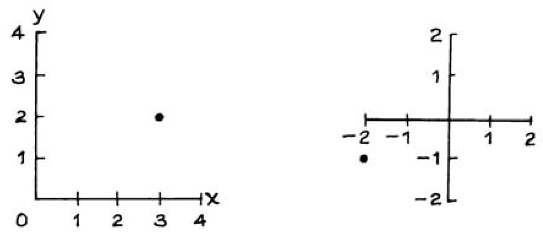

Ý tưởng biểu diễn các điểm bằng các cặp số bắt nguồn từ René Descartes (Pháp, 1596–1650). Để vinh danh ông, các tọa độ _x_ và _y_ thường được gọi là "tọa độ Descartes" (cartesian coordinates). 

#### Bài tập Tập A

1. Hình 3 cho thấy năm điểm. Hãy viết tọa độ _x_ và tọa độ _y_ cho mỗi điểm. 

2. Khi bạn di chuyển từ điểm A đến điểm B trong hình 3, tọa độ _x_ của bạn tăng lên bao nhiêu; tọa độ _y_ của bạn tăng lên bao nhiêu. 

3. Một điểm trong hình 3 có tọa độ _y_ lớn hơn 1 đơn vị so với tọa độ _y_ của điểm E. Đó là điểm nào? 

Hình 3. 

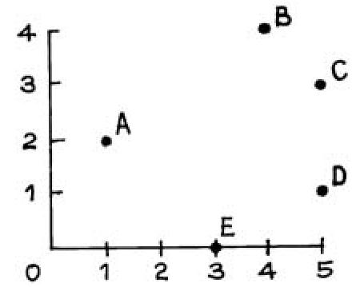

_Đáp án cho các bài tập này nằm ở trang A52._ 

René Descartes (Pháp, 1596–1650) Bộ sưu tập Wolff-Leavenworth, được cung cấp bởi Bộ sưu tập Nghệ thuật Đại học Syracuse. 

##### 2. VẼ CÁC ĐIỂM

Hình 4 cho thấy một hệ trục tọa độ. Để vẽ điểm _(_ 2 _,_ 1 _)_, hãy tìm số 2 trên trục _x_. Điểm đó sẽ nằm ngay phía trên điểm này, như trong hình 5. Tìm số 1 trên trục _y_, điểm đó sẽ nằm ngay bên phải điểm này, như trong hình 6. 

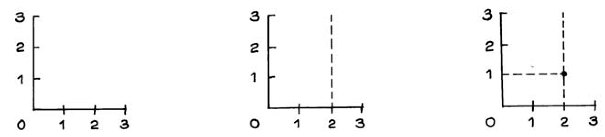

#### Bài tập Tập B

1. Hãy vẽ một hệ trục tọa độ và vẽ từng điểm sau đây: 

_(_ 1 _,_ 1 _) (_ 2 _,_ 2 _) (_ 3 _,_ 3 _) (_ 4 _,_ 4 _)_ Bạn có thể nói gì về chúng? 

2. Ba trong số bốn điểm sau đây nằm trên cùng một đường thẳng. Điểm nào là điểm cá biệt (maverick)? Nó nằm phía trên hay phía dưới đường thẳng? 

3. Bảng bên dưới cho thấy bốn điểm. Trong mỗi trường hợp, tọa độ _y_ được tính từ tọa độ _x_ theo quy tắc _y_ = 2 _x_ + 1. Hãy điền vào chỗ trống, sau đó vẽ bốn điểm này. Bạn có thể nhận xét gì về chúng? 

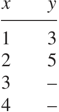

4. Hình 7 bên dưới cho thấy một vùng được tô đậm. Điểm nào trong hai điểm sau đây nằm trong vùng đó: _(_ 1 _,_ 2 _)_ hay _(_ 2 _,_ 1 _)_. 

5. Làm tương tự cho hình 8. 

6. Làm tương tự cho hình 9. 

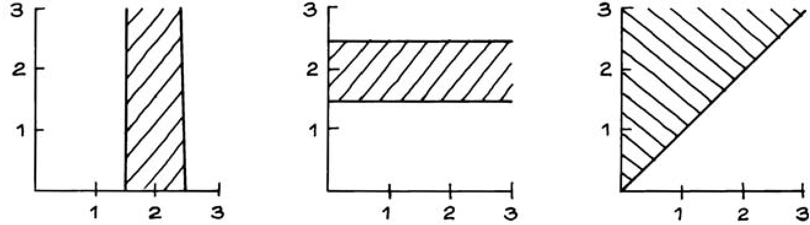

_Đáp án cho các bài tập này nằm ở trang A53._ 

HỆ SỐ GÓC VÀ TUNG ĐỘ GỐC 

##### 3. HỆ SỐ GÓC VÀ TUNG ĐỘ GỐC 

Hình 10 biểu diễn một đường thẳng. Lấy một điểm bất kỳ trên đường thẳng—ví dụ, điểm A. Bây giờ di chuyển dọc theo đường thẳng đến một điểm bất kỳ khác—ví dụ, điểm B. Tọa độ _x_ của bạn đã tăng thêm một lượng, gọi là _run_ (khoảng dịch chuyển ngang) . Trong trường hợp này, khoảng dịch chuyển ngang là 2. Đồng thời tọa độ _y_ của bạn cũng tăng thêm một lượng khác, gọi là _rise_ (khoảng dịch chuyển đứng) . Trong trường hợp này, khoảng dịch chuyển đứng là 1. Lưu ý rằng trong trường hợp này, khoảng dịch chuyển đứng bằng một nửa khoảng dịch chuyển ngang. Cho dù bạn lấy bất kỳ hai điểm nào trên đường thẳng này, khoảng dịch chuyển đứng sẽ luôn bằng một nửa khoảng dịch chuyển ngang. Tỷ số giữa khoảng dịch chuyển đứng và khoảng dịch chuyển ngang (rise/run) được gọi là _slope_ (hệ số góc hay độ dốc) của đường thẳng: 

Hệ số góc chính là tốc độ tăng của _y_ theo _x_ , dọc theo đường thẳng. Để giải thích theo một cách khác, hãy tưởng tượng đường thẳng như một con đường đi lên đồi. Hệ số góc đo lường độ dốc của con đường (độ dốc địa hình - grade). Đối với đường thẳng trong Hình 10, độ dốc là 1 phần 2 (1 in 2)—khá dốc đối với một con đường. Trong Hình 11, hệ số góc của đường thẳng là 0. Trong Hình 12, hệ số góc là −1. Nếu hệ số góc mang dấu dương, đường thẳng sẽ đi lên. Nếu hệ số góc bằng 0, đường thẳng nằm ngang. Nếu hệ số góc mang dấu âm, đường thẳng sẽ đi xuống. 

Hình 10. Hệ số góc là 1 _/_ 2. 

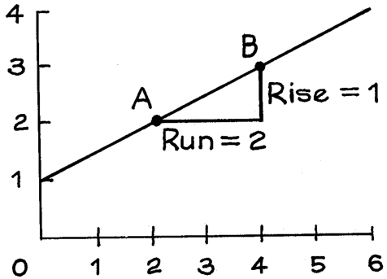

Hình 11. Hệ số góc là 0. Hình 12. Hệ số góc là −1. 

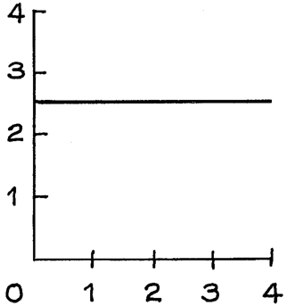

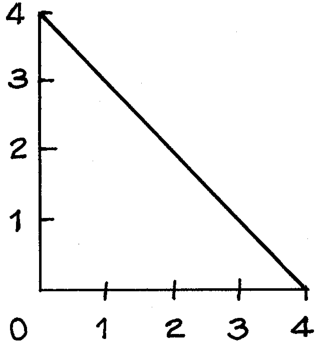

_Intercept_ (tung độ gốc) của một đường thẳng là chiều cao của nó tại vị trí _x_ = 0. Thông thường, các trục tọa độ cắt nhau tại điểm 0. Khi đó, tung độ gốc chính là điểm mà đường thẳng cắt trục _y_ . Trong Hình 13, tung độ gốc là 2. Đôi khi, các trục tọa độ không cắt nhau tại điểm 0, và khi đó bạn phải cẩn thận một chút. Trong Hình 14, các trục tọa độ cắt nhau tại _(_ 1 _,_ 1 _)_ . Tung độ gốc của đường thẳng trong Hình 14 là 0—đó sẽ là chiều cao của nó tại vị trí _x_ = 0. 

Thông thường, các trục của một đồ thị sẽ biểu diễn các đơn vị đo lường. Ví dụ, trong Hình 15 đơn vị của trục _x_ là inch, đơn vị của trục _y_ là độ C. Khi đó hệ số góc và tung độ gốc cũng sẽ mang các đơn vị tương ứng. Trong Hình 15, hệ số góc của đường thẳng là 2.5 độ trên mỗi inch; tung độ gốc là −5 độ. 

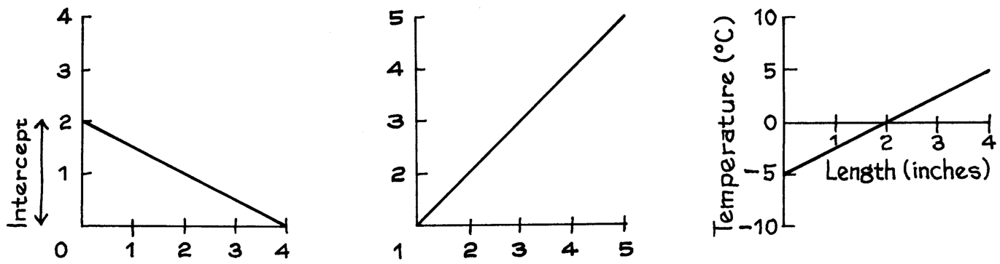

#### Bài tập Phần C 

1. Hình 16 đến Hình 18 biểu diễn các đường thẳng. Đối với mỗi đường thẳng, hãy tìm hệ số góc và tung độ gốc. Lưu ý: trong mỗi trường hợp, các trục tọa độ không cắt nhau tại điểm 0. 

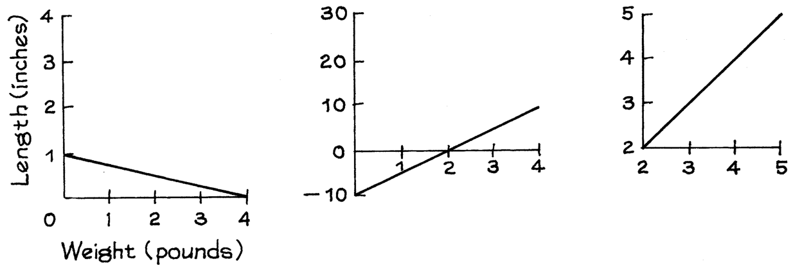

_Đáp án cho các bài tập này nằm ở trang A53._ 

##### 4. VẼ ĐƯỜNG THẲNG 

_Ví dụ 1._ Vẽ đường thẳng đi qua điểm _(_ 2 _,_ 1 _)_ và có hệ số góc bằng 

##### 1 _/_ 2. 

_Lời giải._ Đầu tiên vẽ một cặp trục tọa độ và chấm điểm đã cho _(_ 2 _,_ 1 _)_ lên đồ thị, như trong Hình 19. Sau đó di chuyển một khoảng cách bất kỳ thuận tiện sang bên phải từ điểm đã cho: Hình 20 cho thấy khoảng dịch chuyển ngang (run) là 3. Đánh dấu một điểm nháp (construction point) tại vị trí mới này. Vì đường thẳng dốc lên trên, nó sẽ đi qua phía trên điểm nháp. Phía trên bao xa? Tức là, đường thẳng sẽ tăng thêm bao nhiêu (rise) trong một khoảng dịch chuyển ngang là 3? Câu trả lời được cho bởi hệ số góc. Đường thẳng đang tăng với tốc độ nửa đơn vị theo chiều dọc cho mỗi đơn vị theo chiều ngang, và trong trường hợp này ta có khoảng dịch chuyển ngang là 3 đơn vị, vậy khoảng dịch chuyển đứng sẽ là 3 × 1 _/_ 2 = 1 _._ 5: 

##### rise = run × slope (khoảng dịch chuyển đứng = khoảng dịch chuyển ngang × hệ số góc). 

Thực hiện dịch chuyển theo chiều dọc một khoảng 1.5 từ điểm nháp, và đánh dấu một điểm tại vị trí thứ ba này, như trong Hình 21. Điểm thứ ba này nằm trên đường thẳng. Đặt một cây thước xuống và nối điểm này với điểm ban đầu _(_ 2 _,_ 1 _)_ . 

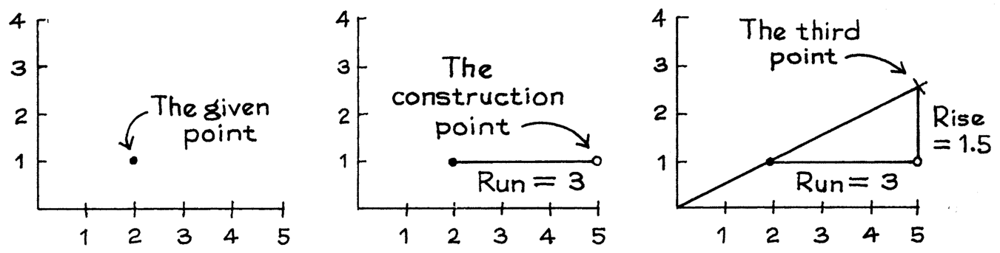

#### Bài tập Phần D 

1. Vẽ các đường thẳng đi qua điểm _(_ 2 _,_ 1 _)_ với các hệ số góc sau đây: 

   - (a) +1 (b) −1 (c) 0 

2. Bắt đầu tại điểm _(_ 2 _,_ 1 _)_ trong biểu đồ 21. Nếu bạn dịch sang phải 2 đơn vị và dịch lên trên 1 đơn vị, bạn sẽ nằm trên đường thẳng, phía trên đường thẳng, hay phía dưới đường thẳng? 

3. Tương tự, nhưng dịch sang phải 4 đơn vị và lên trên 2 đơn vị. 

4. Tương tự nhưng dịch sang phải 6 đơn vị và lên trên 5 đơn vị. 

5. Vẽ một đường thẳng có tung độ gốc (intercept) là 2 và hệ số góc (slope) là −1. Gợi ý: đường thẳng này đi qua điểm _(_ 0 _,_ 2 _)_ . 

6. Vẽ một đường thẳng có tung độ gốc là 2 và hệ số góc là 1. 

_Đáp án cho các bài tập này nằm ở trang A54._ 

##### 5. PHƯƠNG TRÌNH ĐẠI SỐ CỦA MỘT ĐƯỜNG THẲNG 

_Ví dụ 2._ Dưới đây là một quy tắc để tính tọa độ _y_ của một điểm từ tọa độ _x_ của nó: _y_ =1 2_x_+1. Bảng dưới đây cho thấy các điểm có tọa độ_x_ là 1, 2, 3, 4. Hãy biểu diễn các điểm này trên đồ thị. Chúng có nằm trên cùng một đường thẳng không? Nếu có, hãy tìm hệ số góc và tung độ gốc của đường thẳng này. 

_Bài giải._ Các điểm được vẽ trong biểu đồ 22. Chúng thực sự nằm trên cùng một đường thẳng. Bất kỳ điểm nào có tọa độ _y_ liên hệ với tọa độ _x_ của nó bằng cùng phương trình _y_ =1 2_x_+1 sẽ đều nằm trên đường thẳng đó. Đường thẳng này được gọi là_đồ thị_ của phương trình. Hệ số góc của đường thẳng là1 2, chính là hệ số của_x_ trong phương trình. Tung độ gốc là 1, chính là số hạng hằng số (constant term) trong phương trình. 

Biểu đồ 22. 

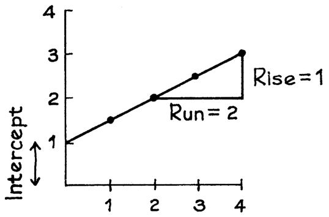

Đồ thị của phương trình _y_ = _mx_ + _b_ là một đường thẳng, có hệ số góc là _m_ và tung độ gốc là _b_ . 

_Ví dụ 3._ Biểu đồ 23 cho thấy một đường thẳng. Phương trình của đường thẳng này là gì? Độ cao của đường thẳng này tại _x_ = 1 là bao nhiêu? 

_Bài giải._ Đường thẳng này có hệ số góc là −1 và tung độ gốc là 4. Do đó, phương trình của nó là _y_ = − _x_ + 4. Thay _x_ = 1 vào ta được _y_ = 3; vì vậy độ cao của đường thẳng là 3 khi _x_ bằng 1. 

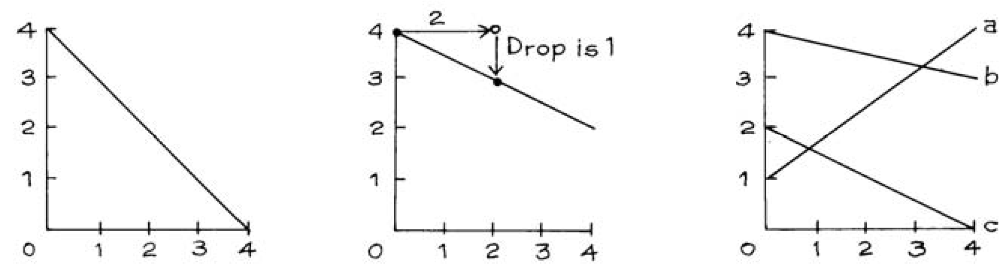

_Ví dụ 4._ Vẽ đồ thị đường thẳng có phương trình là _y_ = −1 2_x_+ 4. 

_Bài giải._ Tung độ gốc của đường thẳng này là 4. Chấm điểm _(_ 0 _,_ 4 _)_ như trong biểu đồ 24. Đường thẳng chắc chắn phải đi qua điểm này. Thực hiện một phép dịch chuyển ngang bất kỳ — giả sử là sang phải 2 đơn vị. Hệ số góc là −1 _/_ 2, vì vậy đường thẳng phải đi xuống 1 đơn vị. Đánh dấu điểm nằm cách điểm đầu tiên 2 đơn vị sang phải và 1 đơn vị hướng xuống trong biểu đồ 24. Sau đó nối hai điểm này lại bằng một đường thẳng. 

#### Bài tập phần E 

1. Vẽ đồ thị của các phương trình sau: 

   - (a) _y_ = 2 _x_ + 1 (b) _y_ =1 2_x_+ 2 

Trong mỗi trường hợp, hãy cho biết hệ số góc và tung độ gốc là bao nhiêu, và đưa ra độ cao của đường thẳng tại _x_ = 2. 

2. Biểu đồ 25 cho thấy ba đường thẳng. Hãy ghép các đường thẳng với các phương trình tương ứng: 

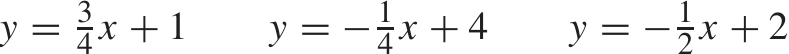

3. Vẽ bốn điểm khác nhau mà trong đó tọa độ _y_ gấp đôi tọa độ _x_. Các điểm này có nằm trên cùng một đường thẳng không? Nếu có, phương trình của đường thẳng đó là gì? 

4. Vẽ các điểm _(_ 1 _,_ 1 _)_ , _(_ 2 _,_ 2 _)_ , _(_ 3 _,_ 3 _)_ , và _(_ 4 _,_ 4 _)_ trên cùng một đồ thị. Các điểm này đều nằm trên một đường thẳng. Phương trình của đường thẳng này là gì? 

5. Đối với mỗi điểm sau đây, hãy cho biết nó nằm trên đường thẳng của bài tập 4, nằm phía trên, hay nằm phía dưới: 

(a) _(_ 0 _,_ 0 _)_ (b) _(_ 1 _._ 5 _,_ 2 _._ 5 _)_ (c) _(_ 2 _._ 5 _,_ 1 _._ 5 _)_ 

6. Đúng hay sai: 

   - (a) Nếu _y_ lớn hơn _x_ , thì điểm ( _x_ , _y_ ) nằm phía trên đường thẳng của bài tập 4. (b) Nếu _y_ = _x_ , thì điểm ( _x_ , _y_ ) nằm trên đường thẳng của bài tập 4. 

   - (c) Nếu _y_ nhỏ hơn _x_ , thì điểm ( _x_ , _y_ ) nằm phía dưới đường thẳng của bài tập 4. 

_Đáp án cho các bài tập này nằm ở các trang A54–55._ 

### PHẦN III 

# Tương quan và Hồi quy (Correlation and Regression) 

