# 8 

## Tương quan (Correlation) 

_Cha nào, con nấy (Like father, like son)._ 

#### 1. BIỂU ĐỒ PHÂN TÁN (THE SCATTER DIAGRAM) 

Các phương pháp được thảo luận trong Phần II rất hiệu quả khi xử lý từng biến một. Tuy nhiên, chúng ta cần đến các phương pháp khác để nghiên cứu mối quan hệ giữa hai biến với nhau.1 Ngài Francis Galton (người Anh, 1822–1911) đã đạt được những bước tiến nhất định trong lĩnh vực này khi ông suy ngẫm về mức độ giống nhau giữa con cái và cha mẹ. Các nhà thống kê học thời Victoria ở Anh đặc biệt say mê với ý tưởng lượng hóa (đo lường bằng con số) những ảnh hưởng của di truyền, và họ đã thu thập những lượng dữ liệu khổng lồ nhằm theo đuổi mục tiêu này. Chúng ta sẽ cùng xem xét kết quả của một nghiên cứu được thực hiện bởi Karl Pearson (người Anh, 1857–1936), một học trò của Galton.2 

Là một phần của nghiên cứu này, Pearson đã đo chiều cao của 1.078 người cha và những người con trai của họ khi đã trưởng thành. Việc nhìn vào một danh sách dài gồm 1.078 cặp số đo chiều cao sẽ rất khó để hình dung điều gì đang diễn ra. Nhưng mối quan hệ giữa hai biến số này — chiều cao của cha và chiều cao của con trai — có thể được thể hiện rõ ràng thông qua một _biểu đồ phân tán (scatter diagram)_ (như Hình 1 ở trang tiếp theo). Mỗi dấu chấm trên biểu đồ đại diện cho một cặp cha-con. Tọa độ _x_ của dấu chấm, được đo dọc theo trục hoành (trục ngang), thể hiện chiều cao của người cha. Tọa độ _y_ của dấu chấm, đo dọc theo trục tung (trục dọc), thể hiện chiều cao của người con trai. 

Hình 1. Biểu đồ phân tán cho chiều cao của 1.078 người cha và con trai. Biểu đồ cho thấy có sự liên hệ đồng biến (positive association) giữa chiều cao của con trai và chiều cao của người cha. Những gia đình có chiều cao của con trai bằng với chiều cao của cha được biểu diễn dọc theo đường thẳng 45 độ _y_ = _x_ . Những gia đình có người cha cao 72 inch (làm tròn đến inch gần nhất) được biểu diễn trong dải dọc. 

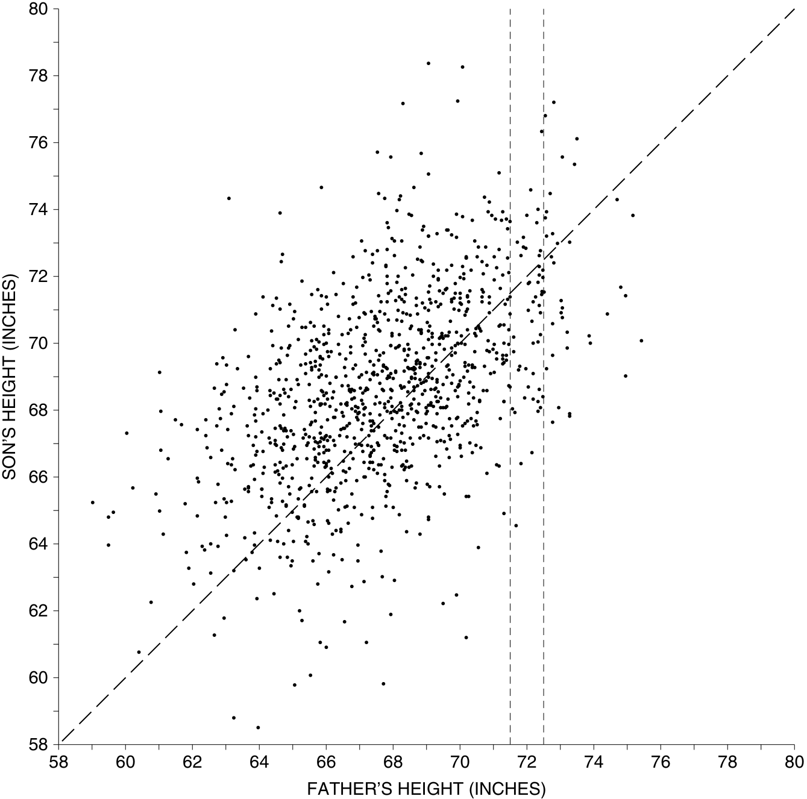

Hình 2a minh họa cơ chế vẽ các biểu đồ phân tán. (Chương 7 đã có thông tin chi tiết). Biểu đồ phân tán trong Hình 1 có dạng một đám mây trông hơi giống một quả bóng bầu dục, với các điểm nằm rải rác lộn xộn ở các rìa. Khi phác họa nhanh một biểu đồ phân tán như vậy, chúng ta chỉ cần thể hiện phần hình bầu dục chính ở giữa — như Hình 2b. 

Đám mây các điểm trong Hình 1 dốc lên về phía bên phải, cho thấy tọa độ _y_ của các điểm có xu hướng tăng lên cùng với tọa độ _x_ của chúng. Một nhà thống kê học có thể nói rằng có một _sự liên hệ đồng biến (positive association)_ giữa chiều cao của cha và chiều cao của con trai. Theo quy luật chung, những người cha cao hơn thì con trai của họ cũng cao hơn. Điều này khẳng định một thực tế hiển nhiên. Bây giờ, hãy nhìn vào đường thẳng 45 độ trong Hình 1. Đường thẳng này tương ứng với những gia đình mà chiều cao của người con trai bằng đúng với chiều cao của người cha. Dọc theo đường thẳng này, ví dụ, nếu người cha cao 72 inch thì con trai cũng cao 72 inch; nếu người cha cao 64 inch thì con trai cũng vậy; và cứ 

Hình 2a. Một điểm trên biểu đồ phân tán. 

Hình 2b. Phác họa nhanh. 

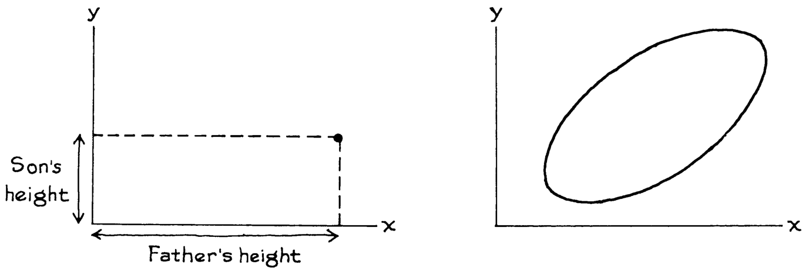

tiếp tục như thế. Tương tự, nếu chiều cao của một người con trai gần bằng với chiều cao của cha mình, thì điểm đại diện cho họ trên biểu đồ phân tán sẽ nằm gần đường thẳng đó, giống như các điểm trong Hình 3. 

Tuy nhiên, trong biểu đồ phân tán thực tế, các điểm nằm rải rác xung quanh đường 45 độ nhiều hơn hẳn so với Hình 3. Sự phân tán (mức độ dàn trải) này cho thấy sự yếu kém trong mối quan hệ giữa chiều cao của cha và chiều cao của con trai. Lấy ví dụ, giả sử bạn phải đoán chiều cao của một người con trai. Việc biết chiều cao của người cha giúp ích được cho bạn bao nhiêu? Trong Hình 1, các dấu chấm nằm trong dải dọc hình "ống khói" (chimney) đại diện cho tất cả các cặp cha-con mà trong đó người cha cao 72 inch (làm tròn đến inch gần nhất, tức là chiều cao của cha nằm trong khoảng từ 71,5 inch đến 72,5 inch, nơi các đường đứt nét dọc cắt trục _x_ ). Chiều cao của các con trai vẫn có sự biến thiên (thay đổi) rất lớn, điều này được thể hiện qua sự phân tán theo chiều dọc bên trong cái ống khói đó. Ngay cả khi bạn đã biết chiều cao của người cha, thì vẫn có một khả năng sai số rất lớn khi bạn cố gắng đoán chiều cao của con trai ông ấy. 

Nếu có một mối liên hệ chặt chẽ giữa hai biến số, thì việc biết một biến sẽ giúp ích rất nhiều trong việc dự đoán biến còn lại. Nhưng khi mối liên hệ đó yếu, thông tin về một biến sẽ không mang lại nhiều lợi ích cho việc đoán biến kia. 

Hình 3. Chiều cao của con trai gần bằng chiều cao của cha. 

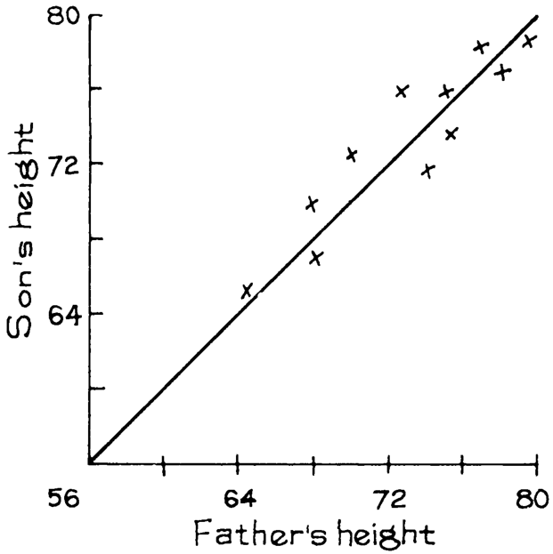

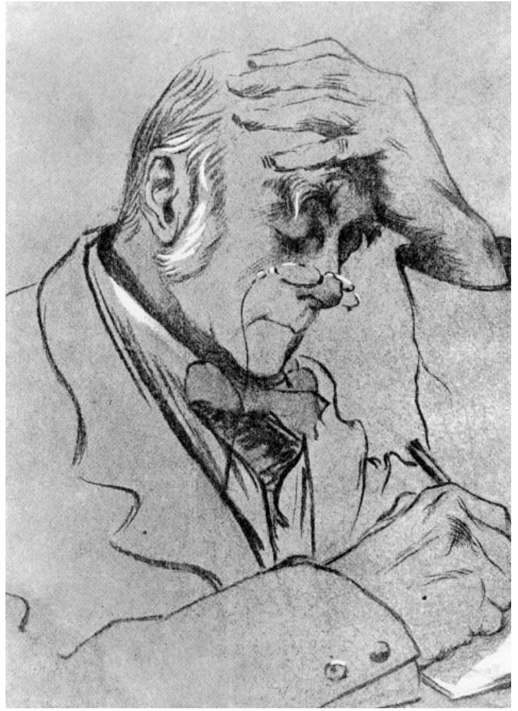

Ngài Francis Galton (người Anh, 1822–1911) 

Nguồn: _Biometrika_ (Tháng 11 năm 1903). 

Trong các nghiên cứu khoa học xã hội về mối quan hệ giữa hai biến, người ta thường gán nhãn cho một biến là _biến độc lập (independent variable)_ và biến còn lại là _biến phụ thuộc (dependent variable)_ . Thông thường, biến độc lập được cho là có ảnh hưởng lên biến phụ thuộc, chứ không phải là ngược lại. Trong Hình 1, chiều cao của người cha được chọn làm biến độc lập và được biểu diễn dọc theo trục _x_ : chiều cao của cha ảnh hưởng đến chiều cao của con. Tuy nhiên, không có quy định nào cấm một nhà nghiên cứu sử dụng chiều cao của con trai làm biến độc lập cả. Việc lựa chọn này có thể phù hợp, ví dụ, nếu vấn đề đặt ra là phải đoán chiều cao của một người cha từ chiều cao của con trai ông ấy. 

Trước khi đi tiếp, bạn nên làm các bài tập của phần này. Chúng khá dễ và sẽ thực sự giúp bạn hiểu rõ phần còn lại của chương này. Nếu bạn gặp khó khăn với chúng, hãy xem lại Chương 7. 

### Bài tập Nhóm A (Exercise Set A)

1. Sử dụng Hình 1 (trang 120) để trả lời các câu hỏi sau: 

   - (a) Chiều cao của người cha thấp nhất là bao nhiêu? Chiều cao của con trai ông ấy là bao nhiêu? 

   - (b) Chiều cao của người cha cao nhất là bao nhiêu? Chiều cao của con trai ông ấy là bao nhiêu? 

   - (c) Hãy xét những gia đình mà người cha cao 72 inch (làm tròn đến inch gần nhất). Người con trai cao nhất cao bao nhiêu? Người con trai thấp nhất cao bao nhiêu? 

   - (d) Có bao nhiêu gia đình mà những người con trai cao hơn 78 inch? Những người cha của họ cao bao nhiêu? 

   - (e) Chiều cao trung bình của những người cha là khoảng 64, 68 hay 72 inch? 

   - (f) Độ lệch chuẩn (SD) của chiều cao những người cha là khoảng 3, 6 hay 9 inch? 

BIỂU ĐỒ PHÂN TÁN 

2. Dưới đây là biểu đồ phân tán cho một tập dữ liệu nhất định. Hãy điền vào các chỗ trống. 

|Dữ liệu||Biểu đồ phân tán|
|---|---|---|
|_x_|_y_||
|1 2|4 3||
|3 –|– 1||
|–|–||

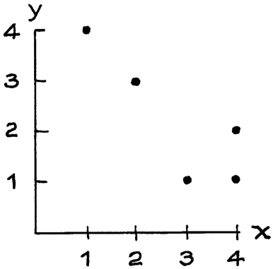

3. Dưới đây là biểu đồ phân tán cho một số dữ liệu giả định. (a) Trung bình của các giá trị _x_ là khoảng 1, 1,5 hay 2? (b) Độ lệch chuẩn (SD) của các giá trị _x_ là khoảng 0,1, 0,5 hay 1? (c) Trung bình của các giá trị _y_ là khoảng 1, 1,5 hay 2? 

   - (d) Độ lệch chuẩn (SD) của các giá trị _y_ là khoảng 0,5, 1,5 hay 3? 

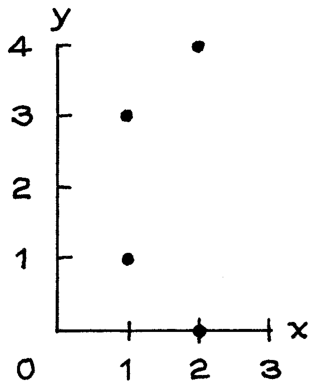

4. Hãy vẽ biểu đồ phân tán cho mỗi tập dữ liệu giả định dưới đây. Biến được gắn nhãn " _x_ " nên được vẽ dọc theo trục _x_ , biến được gắn nhãn " _y_ " dọc theo trục _y_ . Đánh dấu đầy đủ cho từng trục. Trong một số trường hợp, bạn sẽ phải vẽ cùng một điểm nhiều lần. Số lần xuất hiện của một điểm lặp lại như vậy có thể được biểu thị bên cạnh điểm đó, như trong biểu đồ bên dưới; vui lòng tuân theo quy ước này. 

|(a|)|(b|)|Biểu đồ phân tán|
|---|---|---|---|---|
|_x_|_y_|_x_|_y_||
|1|2|3|5||
|3|1|1|4||
|2|3|3|1||
|1|2|2|3||
|||1|4||
|||4|1||

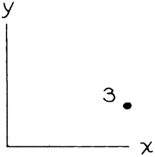

5. Các sinh viên có tên A, B, C, D, E, F, G, H, I và J đã làm một bài kiểm tra giữa kỳ (midterm) và một bài kiểm tra cuối kỳ (final) trong một khóa học nhất định. Biểu đồ phân tán cho các điểm số được trình bày ở trang tiếp theo. (a) Những sinh viên nào đạt điểm số giống nhau ở cả bài thi giữa kỳ và cuối kỳ? (b) Những sinh viên nào đạt điểm cao hơn ở bài thi cuối kỳ? 

- (c) Điểm trung bình của bài thi cuối kỳ là khoảng 25, 50 hay 75? 

- (d) 

- (e) Đối với những sinh viên đạt trên 50 điểm ở bài thi giữa kỳ, điểm trung bình của bài thi cuối kỳ là khoảng 30, 50 hay 70? 

- (f) Đúng hay sai: Nhìn chung, những sinh viên làm tốt bài kiểm tra giữa kỳ thì cũng làm tốt bài kiểm tra cuối kỳ. 

- (g) Đúng hay sai: Có sự liên hệ đồng biến (positive association) mạnh mẽ giữa điểm số thi giữa kỳ và điểm số thi cuối kỳ. 

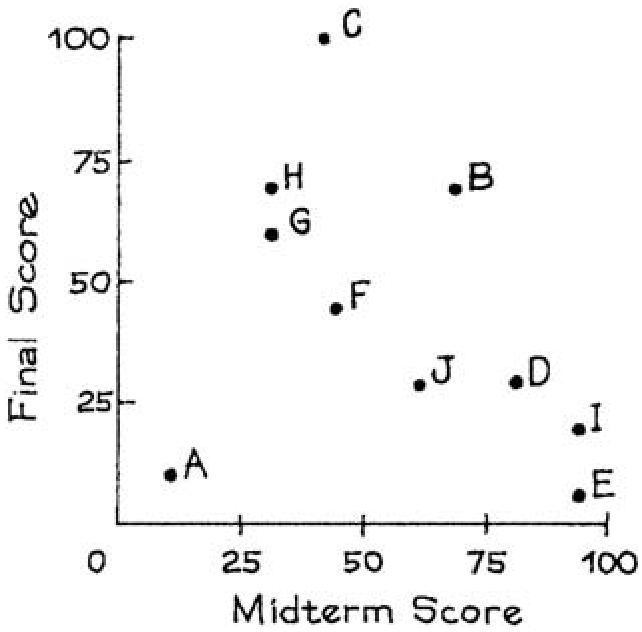

6. Biểu đồ phân tán dưới đây cho thấy điểm số của bài kiểm tra giữa kỳ và cuối kỳ trong một khóa học nhất định. 

   - (a) Điểm trung bình của bài kiểm tra giữa kỳ là khoảng 25, 50 hay 75? 

   - (b) Độ lệch chuẩn (SD) của điểm số thi giữa kỳ là khoảng 5, 10 hay 20? 

   - (c) 

   - (d) 

   - (e) Sự phân tán (mức độ dàn trải) ở điểm số thi giữa kỳ hay điểm số thi cuối kỳ lớn hơn? 

   - (f) Đúng hay sai: Đã có một sự liên hệ đồng biến (positive association) mạnh mẽ giữa điểm số thi giữa kỳ và điểm số thi cuối kỳ. 

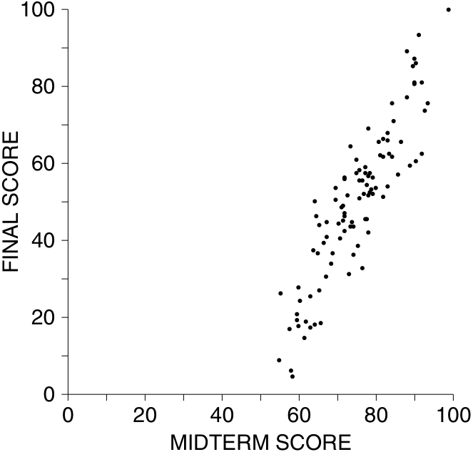

_Đáp án cho các bài tập này nằm ở trang A55–56._ 

HỆ SỐ TƯƠNG QUAN

#### 2. HỆ SỐ TƯƠNG QUAN

Giả sử bạn đang xem xét mối quan hệ giữa hai biến và đã vẽ biểu đồ phân tán (scatter diagram). Đồ thị thu được là một đám mây các điểm có hình quả bóng bầu dục. Làm thế nào để tóm tắt đám mây điểm này? Bước đầu tiên là đánh dấu một điểm thể hiện trung bình của các giá trị _x_ và trung bình của các giá trị _y_ (hình 4a). Đây chính là _điểm trung bình_ (point of averages), xác định vị trí trung tâm của đám mây.3 Bước tiếp theo là đo độ phân tán (spread) của đám mây từ trái sang phải. Việc này có thể thực hiện bằng cách sử dụng độ lệch chuẩn (SD - Standard Deviation) của các giá trị _x_ —hay còn gọi là SD theo chiều ngang. Hầu hết các điểm sẽ nằm trong phạm vi 2 SD ngang ở hai bên của điểm trung bình (hình 4b). Tương tự, độ lệch chuẩn của các giá trị _y_ —hay SD theo chiều dọc—có thể được dùng để đo độ phân tán của đám mây từ trên xuống dưới. Phần lớn các điểm sẽ nằm trong khoảng 2 SD dọc phía trên hoặc phía dưới điểm trung bình (hình 4c). 

Hình 4. Tóm tắt một biểu đồ phân tán. (a) Điểm trung bình (b) Độ lệch chuẩn (SD) ngang (c) Độ lệch chuẩn (SD) dọc

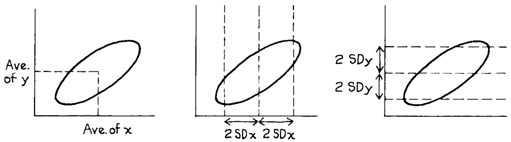

Cho đến nay, các số liệu thống kê tóm tắt gồm có:

- trung bình của các giá trị _x_, độ lệch chuẩn (SD) của các giá trị _x_, 

- trung bình của các giá trị _y_, độ lệch chuẩn (SD) của các giá trị _y_. 

Những con số thống kê này cho chúng ta biết tâm của đám mây điểm, cũng như mức độ phân tán của nó theo cả chiều ngang và chiều dọc. Nhưng vẫn còn thiếu một yếu tố quan trọng—đó là độ mạnh của mối liên hệ giữa hai biến số. Hãy xem các biểu đồ phân tán ở hình 5. 

Hình 5. Tóm tắt một biểu đồ phân tán. Hệ số tương quan đo lường mức độ tập trung (clustering) của các điểm xung quanh một đường thẳng.

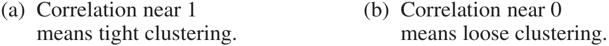

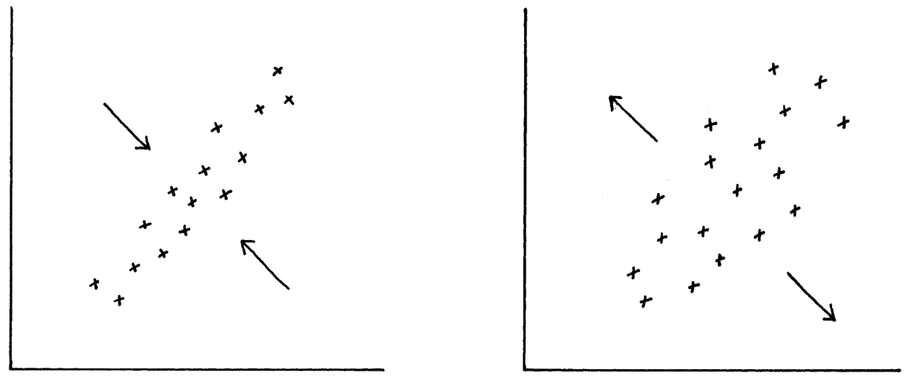

Cả hai đám mây đều có cùng một tâm và có cùng độ phân tán, cả theo chiều ngang lẫn chiều dọc. Tuy nhiên, các điểm trong đám mây đầu tiên tập trung rất chặt chẽ xung quanh một đường thẳng: điều này cho thấy có một mối quan hệ tuyến tính (linear association) mạnh mẽ giữa hai biến số. Ở đám mây thứ hai, mức độ tập trung lỏng lẻo hơn nhiều. Mức độ mạnh của mối liên hệ giữa hai biến trong hai biểu đồ là khác nhau. Để đo lường sự liên hệ này, chúng ta cần thêm một số liệu thống kê tóm tắt nữa—đó là _hệ số tương quan_ (correlation coefficient). Hệ số này thường được viết tắt là _r_, mặc dù không có lý do rõ ràng nào cho việc này (ngoại trừ việc có hai chữ _r_ trong từ "correlation" tiếng Anh). 

Hệ số tương quan là thước đo của mối quan hệ tuyến tính, hay mức độ tập hợp xung quanh một đường thẳng. Mối quan hệ giữa hai biến số có thể được tóm tắt bằng: 

- trung bình của các giá trị _x_, độ lệch chuẩn (SD) của các giá trị _x_, 

- trung bình của các giá trị _y_, độ lệch chuẩn (SD) của các giá trị _y_, 

- hệ số tương quan _r_. 

Công thức tính _r_ sẽ được trình bày ở phần 4, nhưng hiện tại chúng ta muốn tập trung vào việc diễn giải qua hình ảnh đồ thị. Hình 6 trình bày sáu biểu đồ phân tán cho các bộ dữ liệu giả định, mỗi bộ có 50 điểm. Các biểu đồ này được tạo ra bởi máy tính. Trong cả sáu hình, giá trị trung bình đều bằng 3 và độ lệch chuẩn bằng 1 cho cả _x_ và _y_. Máy tính đã in giá trị của hệ số tương quan phía trên mỗi biểu đồ. Biểu đồ ở góc trên cùng bên trái cho thấy hệ số tương quan bằng 0. Đám mây điểm hoàn toàn không có hình dạng rõ rệt. Khi _x_ tăng, _y_ không cho thấy xu hướng tăng hay giảm nào: các điểm chỉ rải rác một cách ngẫu nhiên. 

Biểu đồ phân tán tiếp theo có _r_ = 0.40; một mô hình tuyến tính đang bắt đầu xuất hiện. Biểu đồ kế tiếp có _r_ = 0.60, với mô hình tuyến tính mạnh hơn. Và cứ thế, cho đến biểu đồ cuối cùng. _r_ càng gần 1 thì mối quan hệ tuyến tính giữa các biến càng mạnh, và các điểm càng tập trung chặt chẽ hơn xung quanh một đường thẳng. Một hệ số tương quan bằng 1, mặc dù không xuất hiện trong hình, thường được gọi là _tương quan hoàn hảo_ (perfect correlation)—tất cả các điểm nằm chính xác trên một đường thẳng, do đó tồn tại một mối quan hệ tuyến tính hoàn hảo giữa các biến. Các giá trị tương quan luôn bằng 1 hoặc nhỏ hơn 1. 

Hệ số tương quan giữa chiều cao của các cặp song sinh cùng trứng (identical twins) là khoảng 0.95.4 Biểu đồ phân tán ở góc dưới cùng bên phải trong hình 6 có hệ số tương quan là 0.95. Một biểu đồ phân tán biểu diễn chiều cao của các cặp song sinh này cũng sẽ trông tương tự như vậy. Các cặp song sinh cùng trứng rất giống nhau về chiều cao, và các điểm của họ trên biểu đồ phân tán nằm khá sát với đường thẳng _y_ = _x_. Tuy nhiên, những cặp song sinh này không có chiều cao giống nhau tuyệt đối. Đó chính là điều mà sự phân tán xung quanh đường thẳng 45 độ này thể hiện. 

Một ví dụ khác, ở Mỹ vào năm 2005, mức độ tương quan giữa thu nhập và học vấn của nam giới độ tuổi 18–24 là 0.07, và tăng lên đến 0.43 đối với nam giới ở độ tuổi 55–64.5 Như các biểu đồ phân tán ở hình 6 chỉ ra, mối quan hệ giữa thu nhập và học vấn mạnh mẽ hơn ở nhóm đàn ông lớn tuổi hơn, nhưng nó vẫn còn khá sơ sài và lỏng lẻo. Các mối liên hệ yếu là điều phổ biến trong các nghiên cứu khoa học xã hội, dải giá trị từ 0.3 đến 0.7 là phạm vi thông thường của _r_ trong nhiều lĩnh vực. 

Một lời cảnh báo: _r_ = 0.80 không có nghĩa là 80% số điểm tập trung chặt chẽ xung quanh một đường thẳng, cũng không ngụ ý rằng mức độ tuyến tính gấp đôi so với _r_ = 0.40. Hiện tại, không có cách trực tiếp nào để diễn giải giá trị số học chính xác của hệ số tương quan; điều đó sẽ được trình bày ở các chương 10 và 11. 

Hình 6. Hệ số tương quan—sáu giá trị dương. Các biểu đồ được thay đổi tỷ lệ sao cho giá trị trung bình bằng 3 và độ lệch chuẩn bằng 1, ở cả chiều ngang lẫn chiều dọc; có 50 điểm trong mỗi biểu đồ. Mức độ tập trung được đo bằng hệ số tương quan.

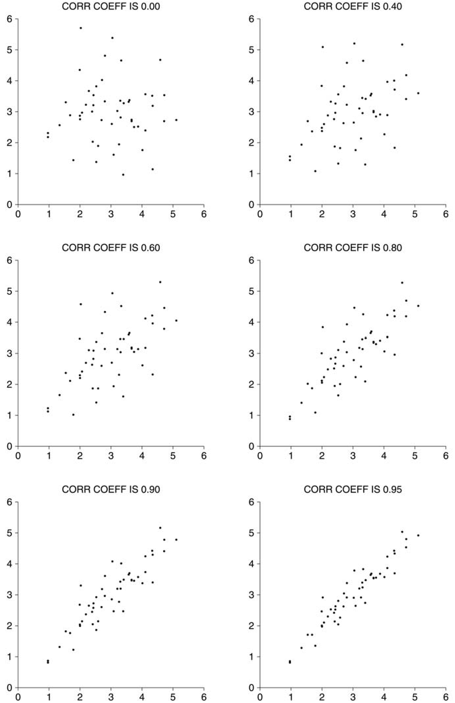

Cho đến nay, chúng ta chỉ mới thảo luận về mối liên hệ thuận (positive association). Mối liên hệ nghịch (negative association) được biểu thị bằng dấu âm trong hệ số tương quan. Hình 7 hiển thị thêm sáu biểu đồ phân tán cho dữ liệu giả định, mỗi biểu đồ gồm 50 điểm. Chúng được chia tỷ lệ giống y như hình 6, mỗi biến số đều có giá trị trung bình là 3 và độ lệch chuẩn bằng 1. 

Một hệ số tương quan bằng −0.90, chẳng hạn, cho thấy mức độ tập trung tương đương như hệ số +0.90. Với dấu âm, các điểm tập trung xung quanh một đường thẳng dốc xuống; với dấu dương, đường thẳng này dốc lên. Đối với phụ nữ từ 25–39 tuổi ở Mỹ vào năm 2005, hệ số tương quan giữa học vấn và số lượng trẻ em là khoảng −0.2, một mối liên hệ nghịch yếu.6 Một hệ số tương quan nghịch hoàn hảo bằng −1 chỉ ra rằng tất cả các điểm đều nằm chính xác trên một đường thẳng dốc xuống. 

Hệ số tương quan luôn nằm trong khoảng từ −1 đến 1, nhưng có thể nhận bất kỳ giá trị nào ở giữa. Một hệ số tương quan dương có nghĩa là đám mây điểm dốc lên; khi một biến tăng thì biến kia cũng tăng theo. Một hệ số tương quan âm có nghĩa là đám mây điểm dốc xuống; khi một biến tăng thì biến kia sẽ giảm đi. 

Trong một bộ dữ liệu thực tế, cả hai giá trị SD đều sẽ dương. Về mặt kỹ thuật, nếu một trong hai SD bằng không, sẽ không có cách nào hợp lý để xác định hệ số tương quan (do việc chia cho độ lệch chuẩn bằng 0). 

### Bài tập phần B 

1. (a) Sự tương quan giữa tuổi đời của một chiếc xe hơi cũ (second-hand) và giá bán của nó sẽ là dương hay âm? Tại sao? (Không bao gồm xe cổ sưu tầm.) 

   - (b) Thế còn sự tương quan giữa trọng lượng của xe và số dặm đi được trên mỗi gallon nhiên liệu (miles per gallon) thì sao? 

2. Đối với mỗi biểu đồ phân tán dưới đây: 

   - (a) Giá trị trung bình của _x_ là khoảng 

1.0 1.5 2.0 2.5 3.0 3.5 4.0 (b) Tương tự đối với _y_. (c) Độ lệch chuẩn (SD) của _x_ là khoảng 0.25 0.5 1.0 1.5 (d) Tương tự đối với _y_. 

- (e) Hệ số tương quan là dương, âm hay bằng 0?

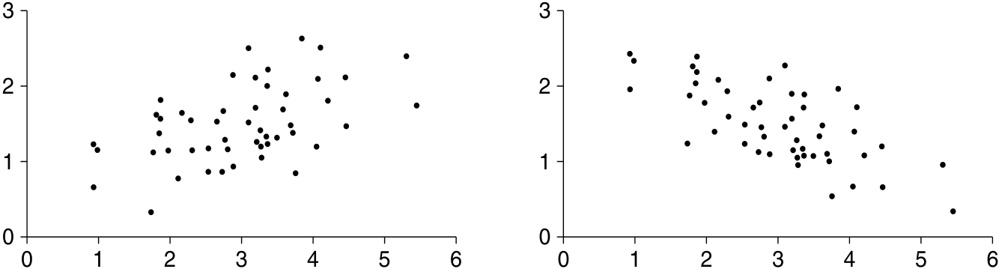

3. Trong bài tập trước, đối với biểu đồ nào thì hệ số tương quan gần với số 0 nhất (nếu bỏ qua dấu âm/dương)? 

Hình 7. Hệ số tương quan—sáu giá trị âm. Các biểu đồ được thay đổi tỷ lệ sao cho giá trị trung bình bằng 3 và độ lệch chuẩn bằng 1, ở cả chiều ngang lẫn chiều dọc; có 50 điểm trong mỗi biểu đồ. Mức độ tập trung được đo bằng hệ số tương quan.

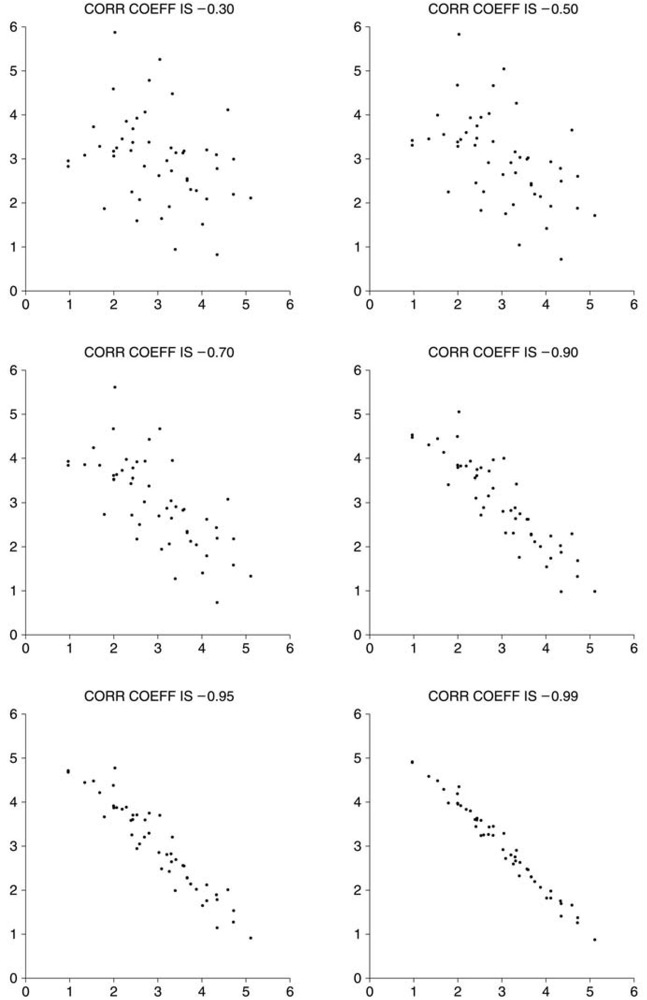

4. Ở hình 1, hệ số tương quan giữa chiều cao của những người cha và con trai của họ nằm ở khoảng −0.3, 0, 0.5, hay 0.8? 

5. Trong hình 1, nếu bạn chỉ chọn những người cha cao hơn 6 feet (khoảng 1.83 mét) cùng với con trai của họ, thì sự tương quan về chiều cao giữa họ sẽ vào khoảng −0.3, 0, 0.5, hay 0.8? 

6. (a) Nếu phụ nữ luôn kết hôn với những người đàn ông lớn hơn mình 5 tuổi, hệ số tương quan giữa độ tuổi của các cặp vợ chồng sẽ là . Chọn một trong các tùy chọn dưới đây và giải thích. 

   - (b) Sự tương quan giữa tuổi của vợ và chồng ở Mỹ là . Hãy chọn một phương án và giải thích. 

chính xác −1 gần bằng −1 gần bằng 0 gần bằng 1 chính xác 1 

7. Các nhà điều tra đang nghiên cứu các sinh viên đã đăng ký tại Đại học California. Sinh viên điền vào các bảng câu hỏi cung cấp thông tin về năm sinh, tuổi (tính bằng năm), tuổi của mẹ, và các thông tin khác. Điền vào chỗ trống, sử dụng các tùy chọn được cho dưới đây, và giải thích ngắn gọn. 

   - (a) Sự tương quan giữa tuổi của sinh viên và năm sinh của họ là . (b) Sự tương quan giữa tuổi của sinh viên và tuổi của mẹ họ là . 

−1 xấp xỉ −1 âm đôi chút 0 dương đôi chút xấp xỉ 1 1 

8. Các nhà điều tra lấy một mẫu gồm những hộ gia đình DINKS (Dual-Income, No Kids - gia đình thu nhập kép, nghĩa là cả vợ và chồng đều đi làm và chưa có con). Các nhà điều tra thu thập dữ liệu về thu nhập của chồng và thu nhập của vợ. Theo định nghĩa, 

thu nhập gia đình = thu nhập của chồng + thu nhập của vợ. 

Thu nhập gia đình trung bình là khoảng $85,000, và 10% các cặp vợ chồng có thu nhập gia đình nằm trong khoảng $80,000–$90,000. Hãy điền vào các chỗ trống, sử dụng các tùy chọn được cho dưới đây, và giải thích ngắn gọn. 

- (a) Sự tương quan giữa thu nhập của vợ và thu nhập gia đình là . 

- (b) Trong số các cặp vợ chồng có mức thu nhập gia đình nằm trong khoảng $80,000–$90,000, sự tương quan giữa thu nhập của vợ và thu nhập của chồng là . 

−1 xấp xỉ −1 âm đôi chút 0 dương đôi chút xấp xỉ 1 1 

9. Đúng hay sai, và hãy giải thích: nếu hệ số tương quan bằng 0.90, thì điều đó có nghĩa là 90% số điểm có tính tương quan cao. 

_Đáp án cho các bài tập này nằm ở trang A56._ 

#### 3. ĐƯỜNG SD (SD LINE) 

Các điểm trong một biểu đồ phân tán nói chung có vẻ như tập hợp quanh đường _SD line_ (đường thẳng đi qua các điểm lệch chuẩn). Đường này đi qua điểm trung bình; và nó đi qua tất cả các điểm cách xa giá trị trung bình với cùng một số lượng độ lệch chuẩn (SD) nhất định, cho cả hai biến số. Ví dụ, hãy lấy một biểu đồ phân tán biểu diễn chiều cao và cân nặng. Một người nào đó tình cờ có chiều cao cao hơn trung bình 1 SD và đồng thời cũng có cân nặng nặng hơn trung bình 1 SD thì điểm biểu diễn cho người đó sẽ nằm trên đường SD. Nhưng một người cao hơn trung bình 1 SD 

131 ĐƯỜNG SD (SD LINE) 

về chiều cao và cao hơn mức trung bình 0.5 SD về cân nặng sẽ nằm ngoài đường thẳng này. Tương tự, một người thấp hơn mức trung bình 2 SD về chiều cao và cũng nhẹ hơn mức trung bình 2 SD về cân nặng sẽ nằm ngay trên đường thẳng. Một người thấp hơn mức trung bình 2 SD về chiều cao nhưng lại nhẹ hơn mức trung bình tới 2.5 SD về cân nặng sẽ nằm ngoài đường thẳng.

Hình 8 cho thấy cách vẽ đường độ lệch chuẩn (SD line) trên đồ thị. Đường này đi qua điểm trung bình (point of averages), và đi lên với tốc độ cứ một SD ngang (của biến $x$) thì tăng thêm một SD dọc (của biến $y$). Về mặt kỹ thuật, độ dốc của đường này chính là tỷ lệ:

(SD của _y_) _/_ (SD của _x_).

Đây là trường hợp dành cho các tương quan dương. Khi hệ số tương quan là số âm, đường SD sẽ hướng xuống; độ dốc khi đó là7

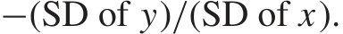

Hình 8. Vẽ đường SD.

Tương quan dương Tương quan âm

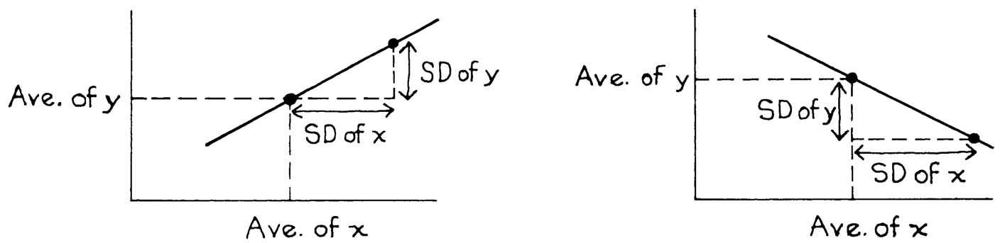

### Bài tập Nhóm C

1. Đúng hay sai:

   - (a) Đường SD luôn luôn đi qua điểm trung bình.

   - (b) Đường SD luôn luôn đi qua gốc tọa độ (0 _,_ 0).

2. Đối với biểu đồ phân tán (scatter diagram) dưới đây, hãy cho biết đường nét liền hay đường nét đứt là đường SD.

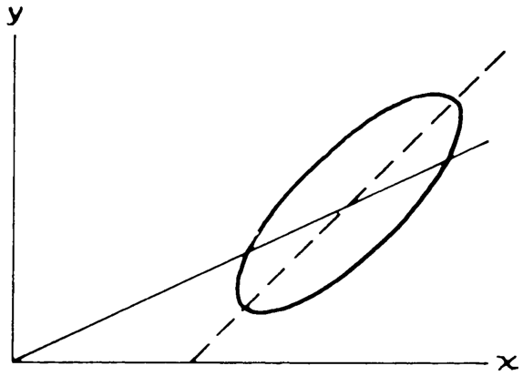

3. Một nghiên cứu trên các nam sinh viên đại học cho thấy chiều cao trung bình của họ là 69 inch, với SD là 3 inch. Cân nặng trung bình của họ là 140 pound, với SD là 20 pound. Và hệ số tương quan là 0.60. Nếu một trong số những người này cao 72 inch, anh ta sẽ phải nặng bao nhiêu để nằm trên đường SD?

4. Sử dụng cùng dữ liệu như trong bài tập 3, hãy cho biết liệu mỗi sinh viên sau đây có nằm trên đường SD hay không:

   - (a) chiều cao 75 inch, cân nặng 180 pound

   - (b) chiều cao 66 inch, cân nặng 130 pound

   - (c) chiều cao 66 inch, cân nặng 120 pound

_Đáp án cho các bài tập này nằm ở trang A57._

#### 4. TÍNH TOÁN HỆ SỐ TƯƠNG QUAN

Dưới đây là quy trình để tính toán hệ số tương quan.

Chuyển đổi mỗi biến sang đơn vị chuẩn (standard units). Trung bình cộng của các tích số (giữa hai biến đã chuẩn hóa) sẽ cho ta hệ số tương quan.

(Đơn vị chuẩn đã được thảo luận ở trang 79–80.) Quy trình này có thể được biểu diễn dưới dạng một công thức, trong đó _x_ là biến thứ nhất, _y_ là biến thứ hai, và _r_ là hệ số tương quan:

- _r_ = trung bình cộng của _(x_ theo đơn vị chuẩn_)_ × _(y_ theo đơn vị chuẩn_)._

_Ví dụ 1._ Tính _r_ cho dữ liệu giả định trong Bảng 1.

Bảng 1. Dữ liệu.

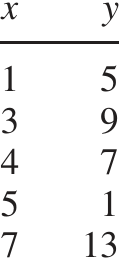

_Lưu ý._ Hàng đầu tiên của Bảng 1 biểu diễn hai phép đo trên cùng một đối tượng trong nghiên cứu; hai con số này chính là tọa độ _x_ và _y_ của điểm tương ứng trên biểu đồ phân tán. Tương tự đối với các hàng khác. Việc ghép cặp là rất quan trọng: _r_ chỉ được xác định khi bạn có hai biến số và cả hai đều được đo lường cho mỗi đối tượng trong nghiên cứu.

_Lời giải._ Các bước tính toán có thể được trình bày như trong Bảng 2.

_Bước 1._ Chuyển đổi các giá trị _x_ sang đơn vị chuẩn, giống như trong Chương 5. Việc này đòi hỏi khá nhiều phép tính. Đầu tiên, bạn phải tìm giá trị trung bình và độ lệch chuẩn (SD) của các giá trị _x_:

trung bình của các giá trị _x_ = 4, SD = 2_._

Sau đó, bạn phải lấy từng giá trị _x_ trừ đi giá trị trung bình, rồi chia cho SD:

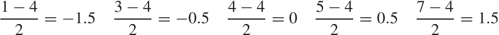

Bảng 2. Tính toán _r_.

|||_x theo đơn vị_|_y theo đơn vị_||
|---|---|---|---|---|
|_x_|_y_|_chuẩn_|_chuẩn_|_Tích số_|
|1|5|−1_._5|−0_._5|0.75|
|3|9|−0_._5|0.5|−0_._25|
|4|7|0.0|0.0|0.00|
|5|1|0.5|−1_._5|−0_._75|
|7|13|1.5|1.5|2.25|

Kết quả được điền vào cột thứ ba của Bảng 2. Các con số này cho bạn biết các giá trị _x_ nằm cao hay thấp hơn bao nhiêu so với mức trung bình, tính theo đơn vị độ lệch chuẩn (SD). Ví dụ, giá trị 1 nằm dưới mức trung bình 1.5 SD.

_Bước 2._ Chuyển đổi các giá trị _y_ sang đơn vị chuẩn; kết quả được điền vào cột thứ tư của bảng. Đến đây là xong phần tính toán nhọc nhằn nhất.

_Bước 3._ Đối với mỗi hàng của bảng, hãy tính tích số:

(_x_ theo đơn vị chuẩn) × (_y_ theo đơn vị chuẩn)

Các tích số này được điền vào cột cuối cùng của bảng.

_Bước 4._ Tính trung bình cộng của các tích số:

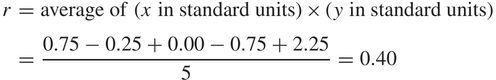

Như vậy là đã hoàn thành phần bài giải. Nếu bạn vẽ một biểu đồ phân tán cho dữ liệu (Hình 9a), các điểm sẽ có xu hướng hướng lên nhưng chỉ gom lại một cách khá lỏng lẻo.

Tại sao _r_ lại có tác dụng như một thước đo sự liên đới (hay mức độ tương quan)? Trong Hình 9a, các tích số được đánh dấu ngay tại các điểm tương ứng. Các đường ngang và dọc được vẽ đi qua điểm trung bình, chia biểu đồ phân tán thành bốn góc phần tư. Nếu một điểm nằm ở góc phần tư dưới cùng bên trái, cả hai biến số đều nằm dưới mức trung bình và nhận giá trị âm khi quy về

Hình 9. Cách thức hoạt động của hệ số tương quan.

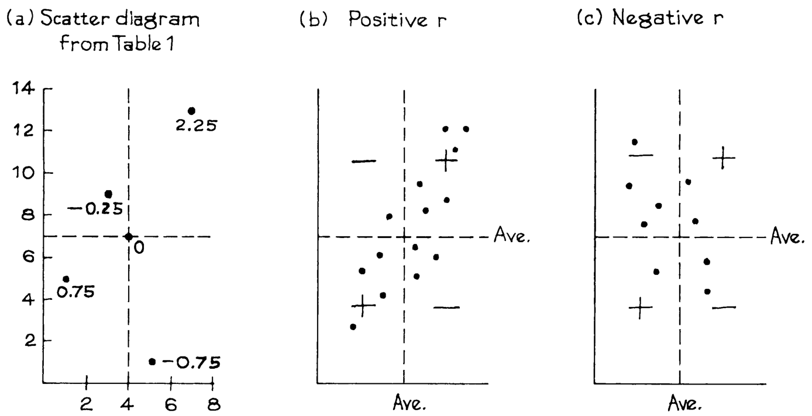

đơn vị chuẩn; tích của hai số âm là một số dương. Ở góc phần tư phía trên bên phải, tích của hai số dương là một số dương. Ở hai góc phần tư còn lại, tích của một số dương và một số âm sẽ ra số âm. Trung bình cộng của tất cả các tích số này chính là hệ số tương quan. Nếu _r_ là số dương, thì các điểm nằm ở hai góc phần tư dương sẽ chiếm ưu thế, như trong Hình 9b. Nếu _r_ là số âm, các điểm ở hai góc phần tư âm sẽ chiếm ưu thế, như trong Hình 9c.

### Bài tập Nhóm D

1. Đối với mỗi tập dữ liệu được trình bày dưới đây, hãy tính hệ số _r_.

|(a)|(|b)|(|c)|
|---|---|---|---|---|
|_x_ _y_|_x_|_y_|_x_|_y_|
|1 6|1|2|1|7|
|2 7|2|1|2|6|
|3 5|3|4|3|5|
|4 4|4|3|4|4|
|5 3|5|7|5|3|
|6 1|6|5|6|2|
|7 2|7|6|7|1|

2. Hãy tìm biểu đồ phân tán trong Hình 6 (trang 127) có hệ số tương quan là 0.95. Trong biểu đồ này, phần trăm số điểm mà cả hai biến số đồng thời cao hơn mức trung bình rơi vào khoảng:

5% 25% 50% 75% 95% _._

3. Lặp lại Bài tập 2, nhưng với hệ số tương quan là 0.00.

4. Sử dụng Hình 7, lặp lại Bài tập 2 cho hệ số tương quan là −0_._95.

_Đáp án cho các bài tập này nằm ở trang A57._

_Ghi chú kỹ thuật._ Có một cách khác để tính _r_, đôi khi cũng khá hữu ích:8

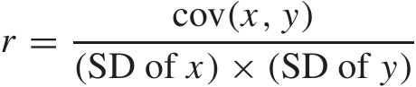

trong đó 

cov _(x, y)_ = _(_ trung bình của các tích _xy)_ − _(_ trung bình của _x)_ × _(_ trung bình của _y)._ 

#### 5. BÀI TẬP ÔN TẬP 

_Các bài tập ôn tập có thể bao gồm nội dung từ các chương trước._ 

1. Một nghiên cứu về chỉ số thông minh (IQ) của các cặp vợ chồng thu được kết quả sau: 

đối với người chồng, IQ trung bình = 100, SD (độ lệch chuẩn) = 15; đối với người vợ, IQ trung bình = 100, SD = 15; _r_ (hệ số tương quan) = 0.6 

BÀI TẬP ÔN TẬP 

Một trong các biểu đồ dưới đây là biểu đồ phân tán (scatter diagram) cho bộ dữ liệu trên. Đó là biểu đồ nào? Hãy nói ngắn gọn lý do tại sao bạn loại bỏ các biểu đồ khác. 

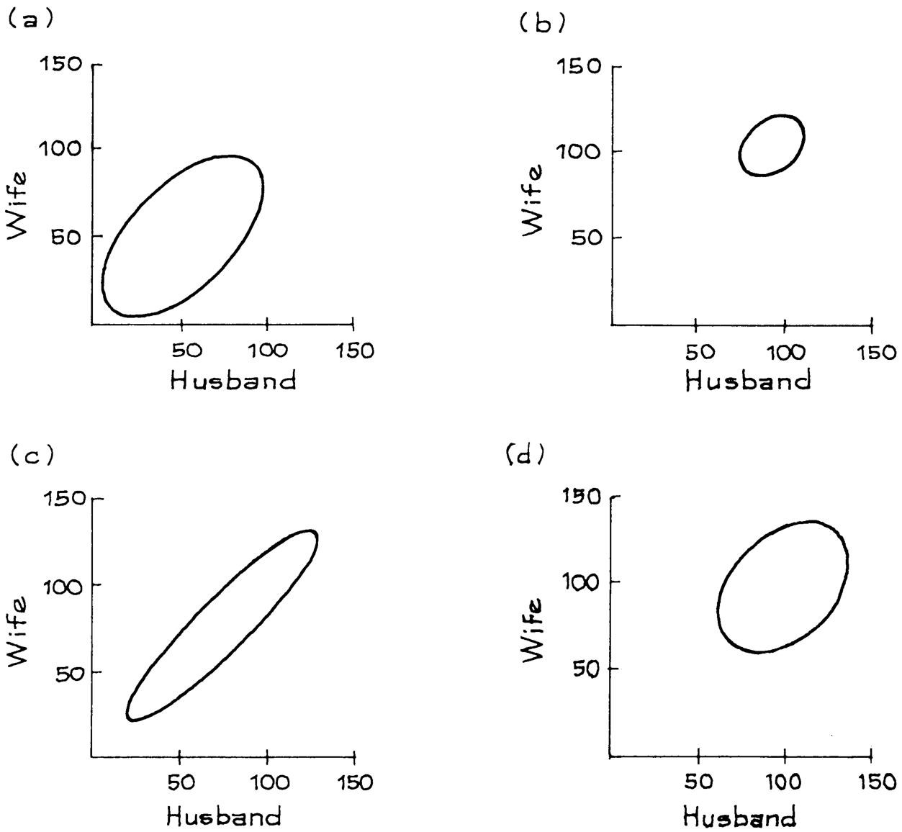

2. (a) Đối với một mẫu ô tô mang tính đại diện, hệ số tương quan (correlation) giữa tuổi thọ của ô tô và mức tiết kiệm nhiên liệu (số dặm đi được cho mỗi gallon) sẽ là dương hay âm? 

   - (b) Mối tương quan giữa mức tiết kiệm nhiên liệu và thu nhập của chủ xe hóa ra lại là dương.9 Bạn giải thích thế nào về sự liên hệ đồng biến (positive association) này? 

3. Giả sử nam giới luôn kết hôn với những phụ nữ thấp hơn họ chính xác 8%. Khi đó hệ số tương quan giữa chiều cao của họ sẽ là bao nhiêu? 

4. Có phải hệ số tương quan giữa chiều cao của các cặp vợ chồng ở Hoa Kỳ rơi vào khoảng −0.9, −0.3, 0.3, hay 0.9? Hãy giải thích ngắn gọn. 

5. Ba bộ dữ liệu được thu thập, và hệ số tương quan được tính toán cho từng trường hợp. Các biến là: 

   - (i) điểm trung bình (grade point average) vào năm nhất và năm hai đại học 

   - (ii) điểm trung bình vào năm nhất và năm cuối đại học 

   - (iii) chiều dài và khối lượng của các tấm ván có kích thước hai-nhân-bốn (two-by-four boards) 

−0.50  0.0  0.30  0.60  0.95 

Hãy ghép nối các hệ số tương quan với từng bộ dữ liệu tương ứng; sẽ có hai hệ số bị thừa ra. Hãy giải thích cho những lựa chọn của bạn. 

6. Trong một lớp học, hệ số tương quan giữa điểm thi cuối kỳ và điểm thi giữa kỳ là 0.50, trong khi hệ số tương quan giữa điểm thi cuối kỳ và điểm bài tập về nhà là 0.25. Đúng hay sai, và giải thích: mối quan hệ giữa điểm thi cuối kỳ và điểm thi giữa kỳ có tính tuyến tính (linear) mạnh gấp đôi so với mối quan hệ giữa điểm thi cuối kỳ và điểm bài tập về nhà. 

7. Hình dưới đây có sáu biểu đồ phân tán (scatter diagram) cho dữ liệu giả định. Các hệ số tương quan, được sắp xếp xáo trộn, là: 

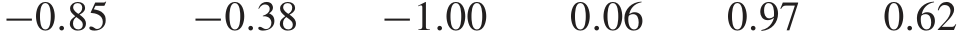

Hãy ghép nối các biểu đồ phân tán với các hệ số tương quan tương ứng. 

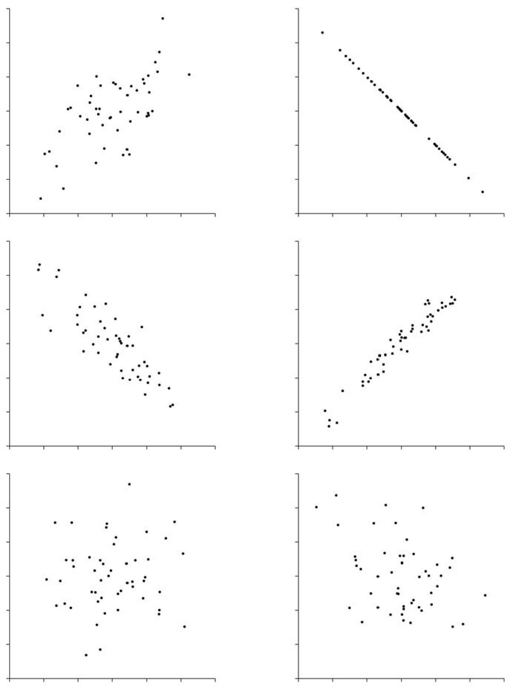

8. Một nghiên cứu theo chiều dọc (longitudinal study) về sự phát triển của con người đã được bắt đầu vào năm 1929 tại Viện Phát triển Con người Berkeley.10 Biểu đồ phân tán dưới đây hiển thị chiều cao của 64 cậu bé, được đo đạc tại thời điểm 4 tuổi và 18 tuổi. 

   - (a) Chiều cao trung bình ở độ tuổi lên 4 vào khoảng 

      - 38 inch    42 inch    44 inch 

   - (b) Độ lệch chuẩn (SD) của chiều cao ở độ tuổi 18 vào khoảng 

   - 0.5 inch    1.0 inch    2.5 inch 

   - (c) Hệ số tương quan vào khoảng 0.50    0.80    0.95 

   - (d) Đường thẳng nào là đường SD (SD line)— đường nét liền hay đường nét đứt? 

Hãy giải thích cho các câu trả lời của bạn. 

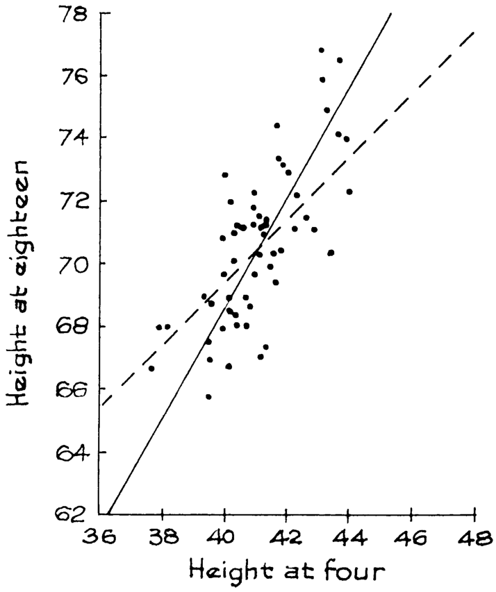

9. 

|(|a)|(b|)|(|c)|
|---|---|---|---|---|---|
|_x_|_y_|_x_|_y_|_x_|_y_|
|1|5|1|1|1|2|
|1|3|1|2|1|2|
|1|5|1|1|1|2|
|1|7|1|3|1|2|
|2|3|2|1|2|4|
|2|3|2|4|2|4|
|2|1|2|1|2|4|
|3|1|3|2|3|6|
|3|1|3|2|3|6|
|4|1|4|3|4|8|

10. Trong một nghiên cứu tâm lý học có quy mô lớn, mỗi đối tượng tham gia đã làm hai bài kiểm tra IQ (dạng L và dạng M của bài thi Stanford-Binet). Một biểu đồ phân tán cho các điểm số của bài kiểm tra được phác thảo ở đầu trang tiếp theo. Bạn đang cố gắng dự đoán điểm số trên 

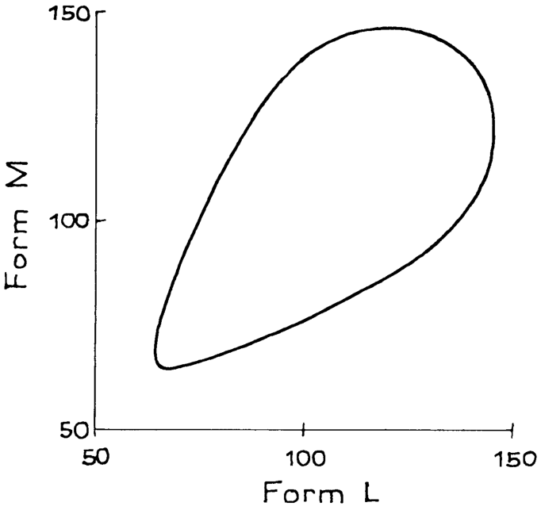

dạng M dựa từ điểm số trên dạng L. Mỗi dự đoán sẽ chệch đi một khoảng nhất định. Nhìn chung, những sai số dự đoán (prediction errors) này sẽ nhỏ hơn khi điểm số trên dạng L là 75 hay khi là 125? Hay nó gần như bằng nhau ở cả hai mức điểm này? 

11. Một trợ giảng (TA) cho một bài kiểm tra ngắn (quiz) gồm 10 câu hỏi và không có điểm thành phần (no part credit - sai hoặc đúng hoàn toàn). Sau khi chấm bài, trợ giảng ghi lại số lượng câu hỏi mà sinh viên đó làm đúng và số lượng câu làm sai cho từng sinh viên. Số câu trả lời đúng trung bình là 6.4 với độ lệch chuẩn (SD) là 2.0; số câu trả lời sai trung bình là 3.6 với cùng mức SD là 2.0. Hệ số tương quan giữa số lượng câu trả lời đúng và số lượng câu trả lời sai là bao nhiêu? 

0   −0.50   +0.50   −1   +1   không thể xác định được nếu không có dữ liệu   Giải thích. 

_Hình ảnh cho bài tập 12_ 

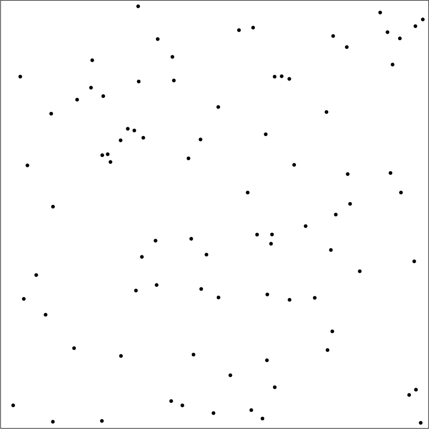

12. Mười lăm sinh viên trong một khóa học thống kê cơ bản tại U.C. Berkeley đã được yêu cầu đếm số lượng các dấu chấm trong một hình giống như hình ở phần dưới cùng của trang trước; có tất cả 85 dấu chấm trong hình đó. Kết quả của số lần đếm được thể hiện trong bảng bên dưới. Hãy vẽ một biểu đồ phân tán cho các số đếm này. Đại diện mỗi sinh viên bằng một điểm trên biểu đồ của bạn, hiển thị lần đếm thứ nhất và lần đếm thứ hai. Gắn nhãn đầy đủ cho cả hai trục tọa độ của bạn. Chọn thang đo (scale) sao cho bạn có thể thấy được mẫu hình (pattern) phân bố của các điểm. Sử dụng biểu đồ phân tán của bạn để trả lời các câu hỏi sau: 

   - (a) Các sinh viên có làm việc độc lập với nhau không? 

   - (b) Đúng hay sai: những sinh viên có kết quả đếm cao trong lần đếm đầu tiên cũng có xu hướng có kết quả đếm cao trong lần thứ hai. 

_Hai lần đếm (Lần 1 Lần 2)_ 91 85 81 83 86 85 83 84 85 85 85 84 85 89 84 83 91 82 91 82 91 82 85 85 85 85 87 85 90 85 

#### 6. TÓM TẮT 

1. Mối quan hệ giữa hai biến có thể được biểu diễn thông qua một _biểu đồ phân tán (scatter diagram)_. Khi biểu đồ phân tán tụ tập lại chặt chẽ xung quanh một đường thẳng, thì giữa các biến đó có một _sự liên hệ tuyến tính (linear association)_ mạnh mẽ. 

2. Một biểu đồ phân tán có thể được tóm tắt thông qua năm chỉ số thống kê (statistics): 

   - giá trị trung bình của các giá trị _x_, độ lệch chuẩn (SD) của các giá trị _x_, 

   - giá trị trung bình của các giá trị _y_, độ lệch chuẩn (SD) của các giá trị _y_, 

   - _hệ số tương quan (correlation coefficient) r_. 

3. Sự liên hệ đồng biến (positive association - một đám mây điểm có hướng dốc lên) được biểu thị bằng một dấu cộng trong hệ số tương quan. Sự liên hệ nghịch biến (negative association - một đám mây điểm có hướng dốc xuống) được biểu thị bằng một dấu trừ. 

4. Trong một chuỗi các biểu đồ phân tán có cùng mức độ lệch chuẩn (SD), khi _r_ tiến gần hơn đến giá trị ±1, các điểm sẽ tụ tập ngày càng chặt chẽ hơn xung quanh một đường thẳng. 

5. Hệ số tương quan có phạm vi từ −1 (khi tất cả các điểm nằm sát trên một đường thẳng dốc xuống), đến +1 (khi tất cả các điểm nằm sát trên một đường thẳng dốc lên). 

6. _Đường SD (SD line)_ đi qua điểm trung bình (point of averages). Khi _r_ là số dương, độ dốc của đường thẳng này là 

(SD của _y_) _/_ (SD của _x_). 

Khi _r_ là số âm, độ dốc của đường này là 

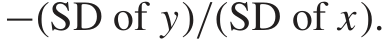

7. Để tính toán hệ số tương quan, hãy chuyển đổi từng biến về các đơn vị chuẩn (standard units), và sau đó tính trung bình của các tích (average product).

