# 9 

## Tìm hiểu thêm về Hệ số Tương quan (Correlation)

_"Rất đúng," Nữ công tước nói: "hồng hạc và mù tạt đều cắn (đều có tính cay độc). Và bài học rút ra là—‘Ngưu tầm ngưu, mã tầm mã (Những kẻ giống nhau thường tụ tập lại với nhau).’"_ 

_"Chỉ có điều mù tạt đâu phải là chim," Alice nhận xét._ 

_"Đúng như thường lệ," Nữ công tước nói: "cô thật biết cách diễn đạt mọi thứ một cách rõ ràng!"_ 

_—Alice ở Xứ sở Diệu kỳ (Alice in Wonderland)_ 

#### 1. CÁC ĐẶC TRƯNG CỦA HỆ SỐ TƯƠNG QUAN (FEATURES OF THE CORRELATION COEFFICIENT)

Hệ số tương quan (correlation coefficient) là một con số thuần túy (không có đơn vị đo). Tại sao vậy? Bởi vì bước đầu tiên trong việc tính toán hệ số _r_ là chuyển đổi dữ liệu sang các đơn vị chuẩn (standard units). Các đơn vị gốc—chẳng hạn như inch đối với dữ liệu chiều cao hoặc độ đối với dữ liệu nhiệt độ—sẽ tự động triệt tiêu cho nhau. Tương tự, giá trị của _r_ không bị ảnh hưởng nếu bạn nhân tất cả các giá trị của một biến (variable) với cùng một số dương, hoặc nếu bạn cộng thêm cùng một số vào tất cả các giá trị của một biến. (Nói theo cách của một nhà thống kê, thì _r_ không bị ảnh hưởng bởi _những thay đổi về thang đo_ (changes of scale); xem trang 92–93.) 

Ví dụ, nếu bạn nhân mỗi giá trị của _x_ với 3, thì giá trị trung bình (average) cũng sẽ được nhân với 3. Tất cả các độ lệch so với giá trị trung bình (deviations from average) cũng được nhân với 3, và độ lệch chuẩn (SD - Standard Deviation) cũng vậy. Yếu tố chung (hệ số 3) này sẽ bị triệt tiêu trong quá trình chuyển đổi về đơn vị chuẩn. Do đó, _r_ vẫn giữ nguyên không đổi. Lấy một ví dụ khác, giả sử bạn cộng thêm 7 vào mỗi giá trị của _x_ . Khi đó, trung bình của _x_ cũng sẽ tăng thêm 7. Tuy nhiên, các độ lệch so với trung bình lại không thay đổi. Và _r_ cũng vậy (vẫn không đổi). 

Hình 1 (ở trang tiếp theo) cho thấy sự tương quan giữa nhiệt độ tối đa hàng ngày tại New York và Boston. Có một dấu chấm trên biểu đồ tương ứng với mỗi ngày trong tháng 6 năm 2005. Nhiệt độ ở New York vào ngày đó được vẽ trên trục hoành (trục ngang); nhiệt độ ở Boston được vẽ trên trục tung (trục dọc). Khung bên trái biểu diễn dữ liệu bằng độ 

Fahrenheit, và _r_ = 0 . 5081. Khung bên phải biểu diễn bằng độ C (Celsius), và _r_ vẫn giữ nguyên không đổi.1 Việc chuyển đổi từ độ Fahrenheit sang độ C chỉ là sự thay đổi về thang đo, điều này hoàn toàn không làm ảnh hưởng đến hệ số tương quan. 

Hình 1. Nhiệt độ tối đa hàng ngày. New York và Boston, tháng 6 năm 2005. Khung bên trái vẽ dữ liệu theo độ Fahrenheit; khung bên phải theo độ C. Điều này không làm thay đổi giá trị của _r_ . 

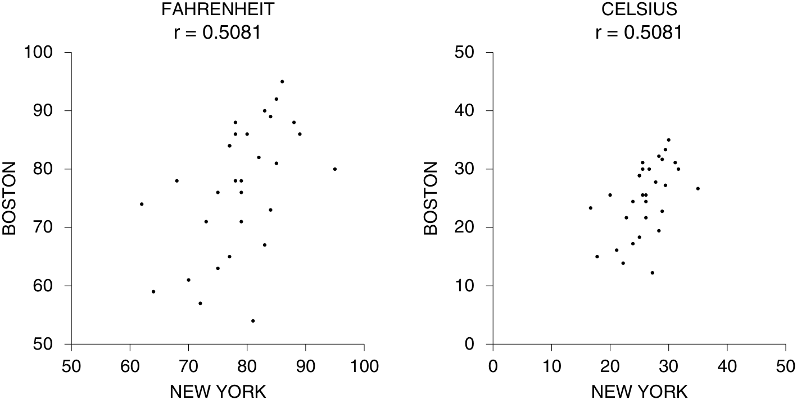

Một đặc điểm khác: Sự tương quan giữa _x_ và _y_ giống hệt như sự tương quan giữa _y_ và _x_ . Ví dụ, khung bên trái trong hình 2 là một biểu đồ phân tán (scatter diagram) cho dữ liệu nhiệt độ tại New York vào tháng 6 năm 2005. Nhiệt độ tối thiểu 

Hình 2. Nhiệt độ hàng ngày. New York, tháng 6 năm 2005. 

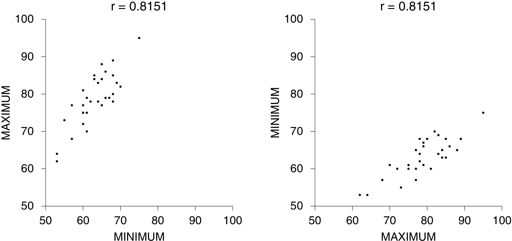

mỗi ngày được vẽ trên trục hoành; nhiệt độ tối đa được vẽ trên trục tung. Mức độ tương quan giữa nhiệt độ tối thiểu và nhiệt độ tối đa là 0.8151. Khung bên phải hiển thị chính xác cùng một tập dữ liệu. Lần này, nhiệt độ tối thiểu được vẽ trên trục tung thay vì trục hoành. Các hình ảnh trông có vẻ khác nhau bởi vì các điểm dữ liệu đã bị phản chiếu (lật ngược) qua đường chéo. Nhưng giá trị _r_ vẫn giữ nguyên. Việc hoán đổi thứ tự của các biến hoàn toàn không ảnh hưởng đến _r_ . Tại sao vậy? Hãy nhớ rằng, _r_ chính là trung bình của các tích số (products) sau khi đã chuyển đổi sang đơn vị chuẩn. Phép nhân thì không phụ thuộc vào thứ tự của các thừa số _(a_ × _b_ = _b_ × _a)_ . Có thể bạn sẽ ngạc nhiên khi thấy mức độ tương quan chỉ là 0.8151, nhưng thời tiết vốn dĩ luôn đầy rẫy những điều bất ngờ. 

Hệ số tương quan là một con số thuần túy, không có đơn vị đo. Nó không bị ảnh hưởng bởi những hành động sau: 

- hoán đổi vị trí của hai biến cho nhau, 

- cộng thêm cùng một hằng số vào tất cả các giá trị của một biến, 

- nhân tất cả các giá trị của một biến với cùng một số dương. 

### Bài tập Phần A (Exercise Set A) 

1. (a) Vào tháng 6 năm 2005, thành phố nào ấm hơn—Boston hay New York? Hay cả hai có mức nhiệt độ tương đương nhau? 

   - (b) Trong khung bên trái của hình 2, tất cả các điểm đều nằm phía trên đường 45 độ (đường chéo y = x). Tại sao vậy? 

2. Một tập dữ liệu nhỏ được trình bày dưới đây; _r_ ≈ 0 . 76. Nếu bạn hoán đổi hai cột dữ liệu này, liệu giá trị _r_ có bị thay đổi không? Hãy giải thích lý do hoặc thực hiện tính toán. 

|_x_ _y_ 1 2 2 3 3 1 4 5 5 6|
|---|

3. Giống như bài tập 2, nhưng bạn cộng thêm 3 vào mỗi giá trị của _y_ thay vì hoán đổi hai cột. 

4. Giống như bài tập 2, nhưng bạn nhân đôi mỗi giá trị của _x_ . 

5. Giống như bài tập 2, nhưng bạn hoán đổi vị trí hai giá trị cuối cùng (5 và 6) của biến _y_ . 

6. Giả sử mức độ tương quan giữa _x_ và _y_ là 0.73. 

   - (a) Biểu đồ phân tán (scatter diagram) sẽ dốc lên hay dốc xuống? 

   - (b) Nếu bạn nhân tất cả các giá trị của _y_ với −1, biểu đồ phân tán mới sẽ dốc lên hay dốc xuống? 

   - (c) Nếu bạn nhân tất cả các giá trị của _y_ với −1, điều gì sẽ xảy ra với hệ số tương quan? 

7. Có hai nhà nghiên cứu khác nhau đang làm việc trong một nghiên cứu về sự phát triển. Người thứ nhất đo chiều cao của 100 trẻ em, tính bằng đơn vị inch. Người thứ hai thích sử dụng hệ mét hơn, và đã đổi kết quả sang đơn vị cm (bằng cách nhân với hệ số chuyển đổi 2.54 cm cho mỗi inch). Một biểu đồ phân tán được vẽ ra, hiển thị chiều cao của mỗi đứa trẻ tính bằng inch trên trục hoành, và chiều cao tính bằng cm trên trục tung. 

   - (a) Nếu không có sai sót nào xảy ra trong quá trình chuyển đổi đơn vị, thì hệ số tương quan sẽ là bao nhiêu? 

   - (b) Điều gì sẽ xảy ra với hệ số _r_ nếu có những sai sót trong quá trình tính toán số học? 

   - (c) Điều gì sẽ xảy ra với hệ số _r_ nếu nhà nghiên cứu thứ hai tự mình đi đo lại chính những đứa trẻ đó, nhưng sử dụng thiết bị đo lường hệ mét? 

8. Trong hình 1 ở trang 120, hệ số tương quan là 0.5. Giả sử trên trục hoành, chúng ta không vẽ chiều cao của người cha, mà thay vào đó vẽ chiều cao của người ông nội; chiều cao của người con trai vẫn được vẽ trên trục tung. Liệu hệ số tương quan sẽ lớn hơn hay nhỏ hơn 0.5? 

9. Có hai chuyên gia thời tiết cùng tính toán hệ số tương quan giữa nhiệt độ tối đa hàng ngày tại Washington và Boston. Người đầu tiên chỉ tính cho tháng 6; người thứ hai tính cho cả năm. Ai sẽ nhận được giá trị hệ số tương quan lớn hơn? (Lưu ý: "Washington" ở đây là tên thành phố, không phải tiểu bang). 

10. Sáu tập dữ liệu được trình bày dưới đây. Trong tập (i), hệ số tương quan là 0.8571, và trong tập (ii) hệ số tương quan là 0.7857. Hãy tìm hệ số tương quan cho các tập dữ liệu còn lại. Bài tập này có thể giải mà không cần tính toán số học (chỉ cần suy luận dựa trên tính chất của hệ số tương quan). 

|(i|)|(i|i)|(ii|i)|(i|v)|(|v)|(|vi)|
|---|---|---|---|---|---|---|---|---|---|---|---|
|_x_|_y_|_x_|_y_|_x_|_y_|_x_|_y_|_x_|_y_|_x_|_y_|
|1|2|1|2|2|1|2|2|1|4|0|6|
|2|3|2|3|3|2|3|3|2|6|1|9|
|3|1|3|1|1|3|4|1|3|2|2|3|
|4|4|4|4|4|4|5|4|4|8|3|12|
|5|6|5|6|6|5|6|6|5|12|4|18|
|6|5|6|7|7|6|7|5|6|10|5|21|
|7|7|7|5|5|7|8|7|7|14|6|15|

_Đáp án cho các bài tập này nằm ở các trang A57–58._ 

#### 2. SỰ THAY ĐỔI CỦA CÁC ĐỘ LỆCH CHUẨN (CHANGING SDs) 

Diện mạo của một biểu đồ phân tán (scatter diagram) phụ thuộc rất nhiều vào các Độ lệch chuẩn (SD - Standard Deviation). Ví dụ, hãy quan sát hình 3. Trong cả hai biểu đồ, hệ số _r_ đều là 0.70. Tuy nhiên, biểu đồ ở phía trên trông có vẻ tụ tập chặt chẽ hơn xung quanh đường SD (SD line). Điều này là do các độ lệch chuẩn của biểu đồ trên nhỏ hơn. Công thức tính _r_ liên quan đến việc chuyển đổi các biến số sang đơn vị chuẩn: các độ lệch so với trung bình (deviations from average) được chia cho SD. Do đó, _r_ đo lường mức độ phân cụm (clustering) không phải ở các giá trị tuyệt đối mà là theo các giá trị tương đối—tương đối so với các độ lệch chuẩn (SDs). 

Để diễn giải hệ số tương quan thông qua hình ảnh đồ thị, bạn hãy mường tượng việc vẽ lại biểu đồ phân tán trong đầu sao cho độ lệch chuẩn theo trục tung (vertical SD) chiếm một khoảng cách trên trang giấy đúng bằng với khoảng cách của các độ lệch chuẩn trục tung trong hình 6 ở trang 127; và thực hiện tương tự đối với độ lệch chuẩn theo trục hoành (horizontal SD). Nếu giá trị _r_ của biểu đồ phân tán của bạn là 0.40, thì biểu đồ đó có lẽ sẽ thể hiện một mức độ phân cụm xung quanh đường chéo tương tự như biểu đồ có hệ số _r_ = 0.40 trong hình ở phía trên bên phải. Nếu _r_ là 0.90, nó sẽ trông giống như biểu đồ trong hình ở phía dưới bên trái. Nhìn chung, biểu đồ phân tán của bạn sẽ tương đồng với biểu đồ nào có giá trị _r_ tương tự. 

Hình 3. Tác động của việc thay đổi các độ lệch chuẩn (SDs). Hai biểu đồ phân tán có cùng hệ số tương quan là 0.70. Biểu đồ phía trên trông tụ tập chặt chẽ hơn quanh đường SD bởi vì các độ lệch chuẩn của nó nhỏ hơn. 

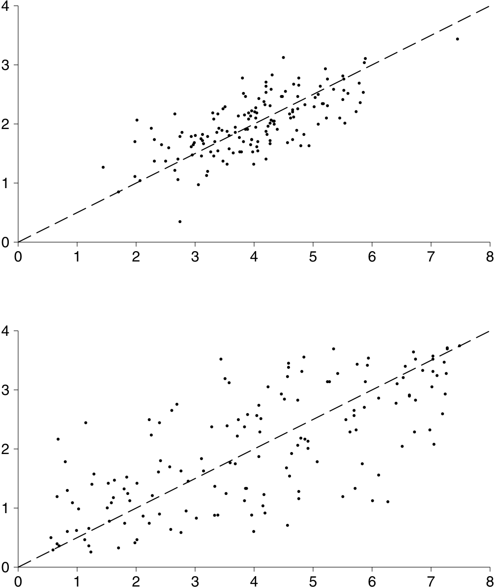

### Bài tập Phần B (Exercise Set B) 

1. Trong hình dưới đây, 6 biểu đồ phân tán được vẽ trên cùng một hệ trục tọa độ; trong biểu đồ thứ nhất, các điểm được đánh dấu là "a"; trong biểu đồ thứ hai là "b"; và cứ thế tiếp tục. Xét riêng cho từng biểu đồ trong số 6 biểu đồ này, hệ số tương quan luôn ở mức khoảng 0.6. Bây giờ, nếu bạn gộp tất cả các điểm của cả 6 biểu đồ lại với nhau. Đối với biểu đồ tổng hợp này, hệ số tương quan sẽ nằm trong khoảng 0.0, 0.6, hay 0.9? 

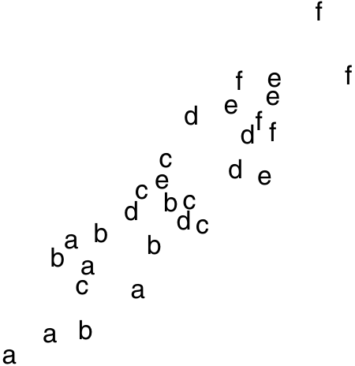

2. Cuộc khảo sát Khám Sức khỏe và Dinh dưỡng Quốc gia (National Health and Nutrition Examination Survey, trang 58) cũng bao gồm cả dữ liệu của trẻ em. Trong bộ dữ liệu HANES2, tại mỗi độ tuổi từ 6 đến 11, mức độ tương quan giữa chiều cao và cân nặng luôn rơi vào khoảng 0.67. Tuy nhiên, nếu gộp chung toàn bộ dữ liệu của tất cả trẻ em ở các độ tuổi này lại, liệu hệ số tương quan giữa chiều cao và cân nặng sẽ xấp xỉ 0.67, lớn hơn một chút so với 0.67, hay nhỏ hơn một chút so với 0.67? Hãy chọn một đáp án và giải thích lý do. 

3. Dưới đây là ba biểu đồ phân tán. Liệu chúng có cùng một hệ số tương quan không? Hãy thử trả lời mà không thực hiện tính toán. 

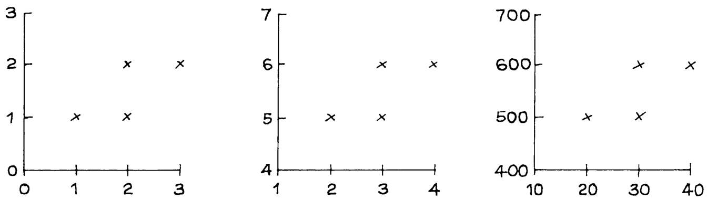

4. Có người đưa cho bạn biểu đồ phân tán như hình bên dưới, nhưng lại quên mất không ghi nhãn (label) cho các trục tọa độ. Bạn vẫn có thể tính toán được giá trị _r_ chứ? Nếu có thể, giá trị đó là bao nhiêu? Hoặc bạn bắt buộc phải có các nhãn thì mới tính toán được? 

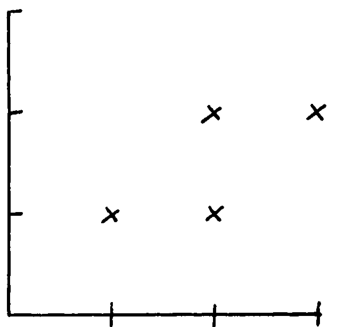

_Đáp án cho các bài tập này nằm ở trang A58._ 

_Ghi chú kỹ thuật (Technical notes)._ (i) Nếu giá trị _r_ tiến gần tới 1, thì một điểm dữ liệu tiêu biểu sẽ chỉ nằm phía trên hoặc phía dưới đường SD một khoảng bằng một phần nhỏ (phân số nhỏ) của độ lệch chuẩn theo trục tung (vertical SD). Ngược lại, nếu giá trị _r_ tiến gần tới 0, thì một điểm tiêu biểu sẽ nằm trên hoặc dưới đường SD một khoảng xấp xỉ ngang bằng với độ lệch chuẩn theo trục tung: xem hình 4. (Khái niệm "vertical SD" dùng để chỉ độ lệch chuẩn của biến được vẽ trên trục _y_). 

Hình 4. Hệ số tương quan. Khi giá trị _r_ tiến gần tới 1, khoảng cách của một điểm tiêu biểu nằm phía trên hoặc phía dưới đường SD (SD line) sẽ thu hẹp lại, chỉ còn bằng một phần nhỏ của độ lệch chuẩn theo trục tung (vertical SD). 

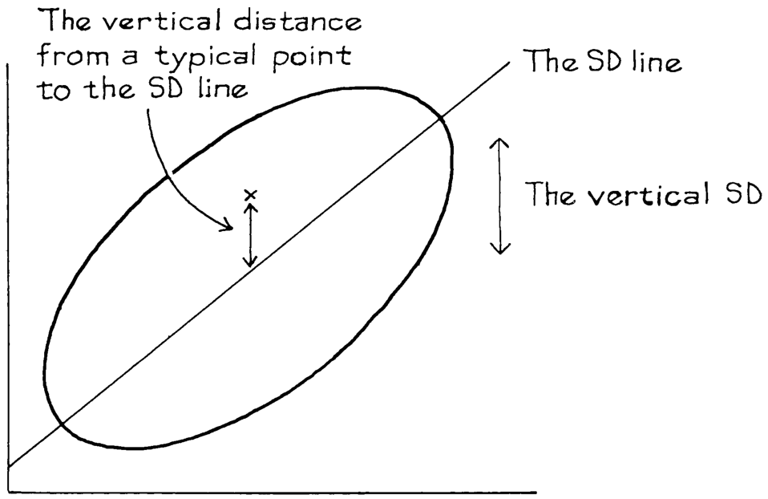

(ii) Mối liên hệ giữa hệ số tương quan (correlation coefficient) và khoảng cách tiêu biểu (nằm phía trên hoặc phía dưới) so với đường SD có thể được biểu diễn một cách toán học như sau. Khoảng cách dọc trung bình bình phương (r.m.s. - root mean square) tới đường SD sẽ bằng 

Lấy ví dụ, nếu hệ số tương quan là 0.95. Khi đó 

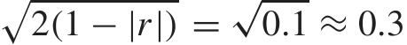

Do đó, độ phân tán xung quanh đường SD (Standard Deviation - Độ lệch chuẩn) bằng khoảng 30% của một SD theo chiều dọc. Đó là lý do tại sao một biểu đồ phân tán với _r_ = 0.95 cho thấy một lượng phân tán đáng kể xung quanh đường này (xem hình 6 ở trang 127). Có những công thức tương tự cho chiều ngang.

#### 3. MỘT SỐ TRƯỜNG HỢP NGOẠI LỆ

Hệ số tương quan (correlation coefficient) rất hữu ích cho các biểu đồ phân tán có dạng hình quả bóng bầu dục (football-shaped). Đối với các dạng biểu đồ khác, _r_ có thể gây hiểu nhầm. Các điểm ngoại lai (outliers) và mối quan hệ phi tuyến tính (non-linearity) là những trường hợp dễ gây ra vấn đề. Trong hình 5a, các điểm dữ liệu cho thấy một sự tương quan hoàn hảo bằng 1. Điểm ngoại lai, được đánh dấu bằng một dấu chéo, kéo hệ số tương quan xuống gần bằng 0. Hình 5a không nên được tóm tắt bằng cách sử dụng _r_. Một số người thường có xu hướng quá sa đà vào việc tìm kiếm và loại bỏ các điểm ngoại lai. Tuy nhiên, trong bất kỳ biểu đồ phân tán nào cũng sẽ có một số điểm ít nhiều tách rời khỏi phần chính của đám mây dữ liệu. Chúng ta chỉ nên loại bỏ những điểm này khi có lý do chính đáng để làm vậy.

Hình 5. Hệ số tương quan có thể gây hiểu nhầm khi có sự xuất hiện của các điểm ngoại lai hoặc khi có mối liên hệ phi tuyến tính.

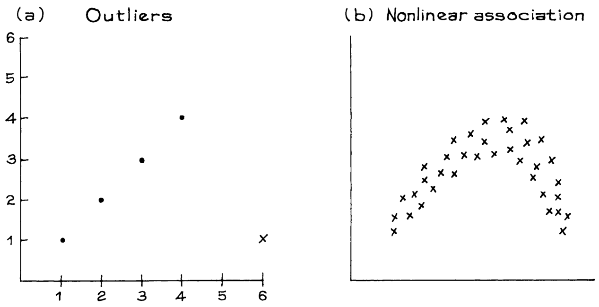

Trong hình 5b, hệ số tương quan gần bằng 0, mặc dù các điểm cho thấy một mối liên hệ chặt chẽ. Lý do là đồ thị hoàn toàn không giống một đường thẳng: khi _x_ tăng, _y_ tăng lên rồi sau đó lại giảm xuống. Hình mẫu này cũng xuất hiện trong mối liên hệ giữa cân nặng và tuổi tác của nam giới trưởng thành (hình 3 ở trang 59). Một lần nữa, những dữ liệu như vậy không nên được tóm tắt bằng _r_ —nếu không, hình mẫu thực sự của dữ liệu sẽ bị mất đi.

_r_ dùng để đo lường mối liên hệ tuyến tính (linear association), chứ không phải mối liên hệ nói chung.

### Bài tập Nhóm C

1. Biểu đồ nào trong số ba biểu đồ phân tán dưới đây nên được tóm tắt bằng _r_?

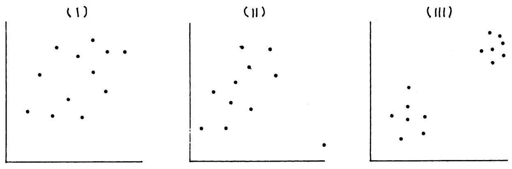

2. Một lớp học gồm 15 học sinh tình cờ có 5 người là cầu thủ bóng rổ. Đúng hay sai, và giải thích: mối quan hệ giữa chiều cao và cân nặng của lớp này nên được tóm tắt bằng _r_.

3. Một hình tròn có đường kính _d_ sẽ có diện tích bằng $\pi d^2 / 4$. Một nhà nghiên cứu vẽ biểu đồ phân tán giữa diện tích và đường kính cho một mẫu gồm các hình tròn có đường kính khác nhau. (Biểu đồ được hiển thị bên dưới.) Hệ số tương quan là _____. Hãy điền vào chỗ trống, và giải thích. Các lựa chọn:

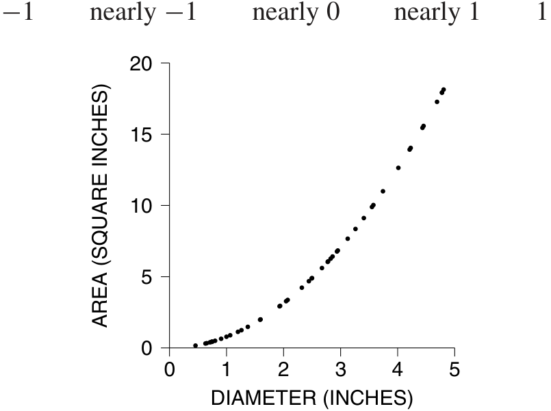

4. Đối với một tập dữ liệu nhất định, _r_ = 0.57. Hãy cho biết mỗi phát biểu sau đây là đúng hay sai, và giải thích ngắn gọn; nếu bạn cần thêm thông tin, hãy cho biết bạn cần gì và tại sao.

   - (a) Không có các điểm ngoại lai.

   - (b) Có một mối liên hệ phi tuyến tính.

_Đáp án cho các bài tập này nằm ở trang A58._

#### 4. TƯƠNG QUAN SINH THÁI (ECOLOGICAL CORRELATIONS)

Vào năm 1955, Ngài Richard Doll đã xuất bản một bài báo mang tính bước ngoặt về mối liên hệ giữa việc hút thuốc lá và ung thư phổi.2 Một trong những bằng chứng được đưa ra là một biểu đồ phân tán cho thấy mối liên hệ giữa tỷ lệ hút thuốc lá (bình quân đầu người) và tỷ lệ tử vong do ung thư phổi ở mười một quốc gia. Mối tương quan 

giữa mười một cặp tỷ lệ này là 0.7, và điều này được coi là minh chứng cho thấy sự liên hệ chặt chẽ giữa việc hút thuốc và bệnh ung thư. Tuy nhiên, người hút thuốc và mắc bệnh ung thư là con người, chứ không phải là các quốc gia. Để đo lường sức mạnh của mối liên hệ này đối với con người, chúng ta cần phải có dữ liệu liên hệ giữa việc hút thuốc và ung thư của các cá nhân thay vì của các quốc gia. Những nghiên cứu như vậy hiện đã có sẵn, và chúng cho thấy việc hút thuốc thực sự là nguyên nhân gây ra ung thư.

Điểm mấu chốt về mặt thống kê ở đây là: các mức tương quan dựa trên tỷ lệ hoặc giá trị trung bình có thể gây hiểu nhầm. Dưới đây là một ví dụ khác. Từ dữ liệu của Khảo sát Dân số Hiện tại (Current Population Survey) năm 2005, bạn có thể tính toán hệ số tương quan giữa thu nhập và giáo dục đối với nam giới từ 25–64 tuổi ở Hoa Kỳ: _r_ ≈ 0.42. Đối với mỗi bang (và cả đặc khu D.C.), bạn có thể tính toán mức giáo dục trung bình và thu nhập trung bình. Cuối cùng, bạn có thể tính toán hệ số tương quan giữa 51 cặp giá trị trung bình này: _r_ ≈ 0.70. Nếu bạn sử dụng hệ số tương quan của các bang để ước tính hệ số tương quan cho các cá nhân, bạn sẽ sai lệch hoàn toàn. Lý do là vì trong mỗi bang, dữ liệu của các cá nhân phân tán rất nhiều xung quanh mức trung bình. Việc thay thế dữ liệu của các bang bằng mức trung bình của chúng đã triệt tiêu sự phân tán này, và tạo ra một ấn tượng sai lệch về một sự quần tụ chặt chẽ (tight clustering). Hình 6 cho thấy hiệu ứng này đối với ba bang.3

Các mối tương quan _sinh thái_ (ecological correlations) được tính toán dựa trên các tỷ lệ hoặc mức trung bình. Chúng thường được sử dụng trong khoa học chính trị và xã hội học. Và chúng có xu hướng phóng đại sức mạnh của một mối liên hệ. Do đó, hãy cẩn thận.

Hình 6. Các mối tương quan sinh thái (dựa trên tỷ lệ hoặc mức trung bình) thường quá lớn. Bảng điều khiển bên trái biểu diễn thu nhập và giáo dục của các cá nhân ở ba bang, được gắn nhãn A, B, C. Mỗi cá nhân được đánh dấu bằng một chữ cái thể hiện bang nơi họ cư trú. Mức tương quan ở đây là ở mức độ vừa phải. Bảng điều khiển bên phải hiển thị các mức trung bình của mỗi bang. Mức tương quan giữa các giá trị trung bình này gần như bằng 1.

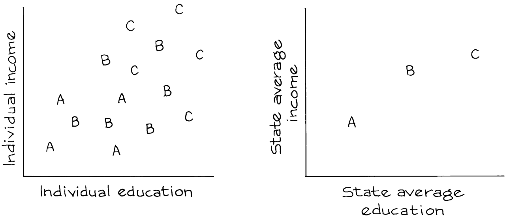

### Bài tập Nhóm D

1. Bảng ở đầu trang tiếp theo được phỏng theo Doll và cho thấy mức tiêu thụ thuốc lá bình quân đầu người ở nhiều quốc gia khác nhau vào năm 1930, cùng với tỷ lệ tử vong do ung thư phổi ở nam giới vào năm 1950. (Vào năm 1930, hầu như không có phụ nữ nào hút thuốc; và cần một khoảng thời gian dài để các tác động của việc hút thuốc mới bắt đầu xuất hiện.)

|_Quốc gia_|_Mức tiêu thụ_ _thuốc lá_|_Tử vong trên mỗi_ _triệu người_|
|---|---|---|
|Úc (Australia)|480|180|
|Canada|500|150|
|Đan Mạch (Denmark)|380|170|
|Phần Lan (Finland)|1,100|350|
|Vương quốc Anh (Great Britain)|1,100|460|
|Iceland|230|60|
|Hà Lan (Netherlands)|490|240|
|Na Uy (Norway)|250|90|
|Thụy Điển (Sweden)|300|110|
|Thụy Sĩ (Switzerland)|510|250|
|Hoa Kỳ (U.S.)|1,300|200|

   - (a) Hãy vẽ một biểu đồ phân tán cho bộ dữ liệu này.

   - (b) Đúng hay sai: mức tiêu thụ thuốc lá ở một trong những quốc gia này vào năm 1930 càng cao, thì nhìn chung tỷ lệ tử vong do ung thư phổi vào năm 1950 càng cao. Hay điều này không thể xác định được từ dữ liệu?

   - (c) Đúng hay sai: tỷ lệ tử vong do ung thư phổi có xu hướng cao hơn ở những người hút thuốc nhiều hơn. Hay điều này không thể xác định được từ dữ liệu?

2. Một nhà xã hội học đang nghiên cứu mối liên hệ giữa tự tử và trình độ biết chữ (literacy) ở Ý vào thế kỷ XIX.4 Ông ấy có dữ liệu của từng tỉnh, hiển thị tỷ lệ phần trăm những người biết chữ và tỷ lệ tự tử ở tỉnh đó. Mức tương quan là 0.6. Liệu điều này có đưa ra một ước tính công bằng về sức mạnh của mối liên hệ giữa trình độ biết chữ và vấn đề tự tử không?

_Đáp án cho các bài tập này nằm ở trang A59._

#### 5. TƯƠNG QUAN KHÔNG PHẢI LÀ NHÂN QUẢ (ASSOCIATION IS NOT CAUSATION)

Đối với học sinh ở trường, kích cỡ giày có mối tương quan mạnh mẽ với kỹ năng đọc. Tuy nhiên, việc học những từ mới không làm cho bàn chân to ra. Thay vào đó, có một yếu tố thứ ba liên quan ở đây—đó chính là tuổi tác. Khi trẻ em lớn lên, chúng học đọc tốt hơn và bàn chân của chúng cũng lớn hơn, khiến chúng phải thay giày (outgrow their shoes). (Theo thuật ngữ thống kê học ở chương 2, tuổi tác ở đây là một biến gây nhiễu - confounder). Trong ví dụ này, biến gây nhiễu rất dễ để phát hiện. Nhưng thường thì điều này không hề dễ dàng như vậy. Và các phép toán của hệ số tương quan không thể bảo vệ bạn khỏi các yếu tố thứ ba này.5

Tương quan (correlation) dùng để đo lường sự liên hệ (association) giữa các biến. Nhưng sự liên hệ không đồng nghĩa với quan hệ nhân quả (causation).

_Ví dụ 1. Giáo dục và tình trạng thất nghiệp._ Trong cuộc Đại Suy thoái (Great Depression) giai đoạn 1929–1933, những người có trình độ giáo dục tốt hơn thường có những khoảng thời gian thất nghiệp ngắn hơn. Liệu học vấn có giúp bảo vệ bạn khỏi tình trạng thất nghiệp không?

_Thảo luận._ Có lẽ là có, nhưng đây chỉ là dữ liệu quan sát (observational data). Hóa ra, tuổi tác lại là một biến số gây nhiễu. Những người trẻ tuổi có trình độ giáo dục tốt hơn, bởi vì

151

TƯƠNG QUAN KHÔNG PHẢI LÀ NHÂN QUẢ

trình độ giáo dục đang ngày càng được nâng cao theo thời gian. (Cho đến nay vẫn vậy.) Khi có sự lựa chọn trong việc tuyển dụng, các nhà tuyển dụng dường như thích những người tìm việc trẻ tuổi hơn. Khi kiểm soát (controlling for) yếu tố tuổi tác, tác động của giáo dục đối với tình trạng thất nghiệp trở nên yếu đi rất nhiều.6

_Ví dụ 2. Phạm vi địa lý và thời gian tồn tại của các loài._ Liệu chọn lọc tự nhiên có hoạt động ở cấp độ loài hay không? Đây là một câu hỏi gây nhiều sự chú ý đối với các nhà cổ sinh vật học (paleontologists). David Jablonski lập luận rằng phạm vi phân bố địa lý (geographical range) là một đặc điểm có thể di truyền của các loài: một loài có phạm vi phân bố rộng sẽ tồn tại lâu hơn, bởi vì nếu một thảm họa xảy ra ở một nơi, loài đó vẫn có thể tiếp tục sống sót ở những nơi khác.

Một trong những bằng chứng là một biểu đồ phân tán (hình 7). Chín mươi chín loài động vật chân bụng (gastropods - như sên, ốc sên, v.v.) được biểu diễn trong biểu đồ. Thời gian tồn tại của loài—tức là tuổi thọ của nó, tính bằng đơn vị hàng triệu năm—được vẽ trên trục dọc; phạm vi phân bố của nó được đặt trên trục ngang, tính bằng kilomet. Cả hai biến số này đều được xác định từ các ghi chép hóa thạch. Có một sự liên hệ thuận chiều tốt (positive association): _r_ xấp xỉ 0.64. (Đám mây dữ liệu trông có vẻ không có hình dạng rõ ràng, nhưng đó là do một vài điểm nằm rải rác ở góc dưới cùng bên phải và góc trên cùng bên trái.) Liệu một phạm vi địa lý rộng lớn có thúc đẩy sự sinh tồn của loài không?

Hình 7. Thời gian tồn tại của các loài tính bằng hàng triệu năm được vẽ theo phạm vi địa lý tính bằng kilomet, đối với 99 loài động vật chân bụng. Nhiều loài có thể được vẽ tại cùng một điểm; số lượng các loài như vậy được biểu thị ở ngay bên cạnh điểm đó.

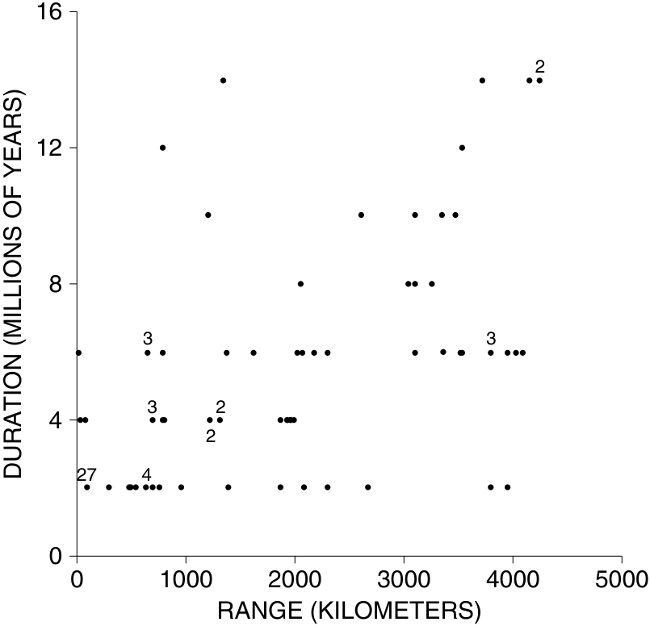

_Thảo luận._ Một phạm vi phân bố rộng có thể dẫn đến thời gian tồn tại lâu dài. Hoặc, thời gian tồn tại lâu dài có thể là nguyên nhân dẫn đến việc phạm vi phân bố được mở rộng. Hoặc, có thể còn có một yếu tố nào khác đang diễn ra. Jablonski đã hướng sự chú ý của mình vào khả năng đầu tiên. Khả năng thứ hai là khó có thể xảy ra, bởi vì các bằng chứng khác cho thấy các loài đạt được phạm vi phân bố của chúng từ rất sớm ngay sau khi chúng xuất hiện. Nhưng còn lời giải thích thứ ba thì sao? Michael Russell và David Lindberg chỉ ra rằng các loài có phạm vi địa lý rộng có nhiều cơ hội được bảo tồn trong các ghi chép hóa thạch hơn, điều này có thể tạo ra cảm giác về một thời gian tồn tại lâu dài. Nếu đúng như vậy, hình 7 chỉ là một kết quả giả tạo (statistical artifact) do quá trình thu thập dữ liệu gây ra.7 Tương quan không phải là nhân quả.

_Ví dụ 3. Chất béo trong chế độ ăn uống và bệnh ung thư._ Ở những quốc gia nơi người dân ăn nhiều chất béo—như Hoa Kỳ—tỷ lệ mắc bệnh ung thư vú và ung thư ruột kết (colon cancer) là rất cao. Xem hình 8 để biết dữ liệu về bệnh ung thư vú. Mối tương quan này thường được sử dụng để lập luận rằng chất béo trong chế độ ăn uống là nguyên nhân gây ra bệnh ung thư. Bằng chứng này có tốt không?

Hình 8. Tỷ lệ tử vong do ung thư vú được vẽ theo lượng chất béo trong chế độ ăn uống, đối với một mẫu gồm một số quốc gia.

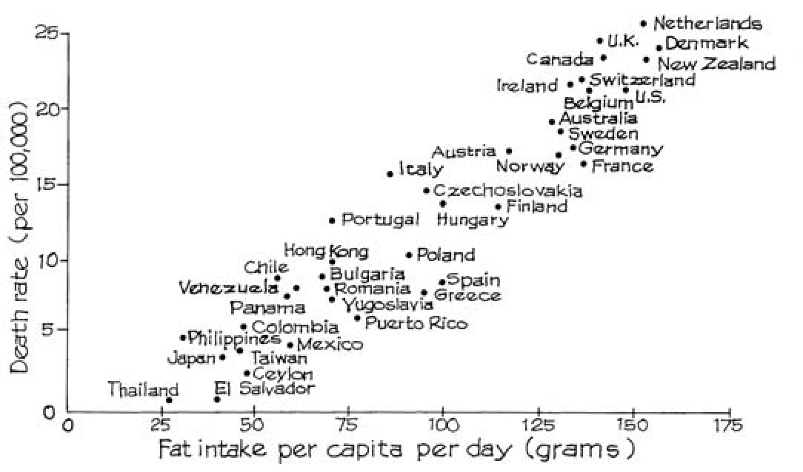

Lưu ý: Độ tuổi đã được chuẩn hóa (Age standardized).

Nguồn: K. Carroll, “Experimental evidence of dietary factors and hormone-dependent cancers,” _Cancer Research_ vol. 35 (1975) p. 3379. Bản quyền thuộc về _Cancer Research_. Được sao chép với sự cho phép.

_Thảo luận._ Nếu chất béo trong chế độ ăn uống gây ra bệnh ung thư, thì các điểm trong biểu đồ sẽ có xu hướng đi lên (slope up), với giả định các điều kiện khác đều bằng nhau (other things being equal). Do đó, biểu đồ này là một bằng chứng nhất định cho giả thuyết đó. Nhưng bằng chứng này khá yếu, bởi vì các điều kiện khác vốn không hề bằng nhau. Ví dụ, những quốc gia có nhiều chất béo trong chế độ ăn uống cũng đồng thời tiêu thụ rất nhiều đường. Một biểu đồ giữa tỷ lệ ung thư vú và mức tiêu thụ đường sẽ trông giống hệt hình 8, và không có ai lại nghĩ rằng đường là nguyên nhân gây ra bệnh ung thư vú. Hóa ra, chất béo và đường là những thứ tương đối đắt tiền. Ở các quốc gia giàu có, người dân có đủ khả năng để ăn chất béo và đường thay vì các sản phẩm ngũ cốc chứa nhiều tinh bột. Một vài khía cạnh nào đó trong chế độ ăn uống ở các quốc gia này, hoặc các yếu tố khác trong lối sống, có thể thực sự là nguyên nhân gây ra một số loại ung thư nhất định—và đồng thời bảo vệ con người khỏi những loại ung thư khác. Cho đến nay, các nhà dịch tễ học (epidemiologists) mới chỉ có thể xác định được một vài trong số những yếu tố này với một mức độ tự tin thực sự.8

### Bài tập Nhóm E

1. Biểu đồ phân tán trong hình 7 hiển thị thành các dải (stripes). Tại sao?

2. Mối tương quan trong hình 8 có phải là tương quan sinh thái (ecological correlation) không? Điều này có liên quan như thế nào đến lập luận được đưa ra?

3. Mức độ tương quan giữa chiều cao và cân nặng của nam giới từ 18–74 tuổi ở Hoa Kỳ là khoảng 0.40. Hãy cho biết mỗi kết luận dưới đây có được suy ra từ dữ liệu hay không; giải thích câu trả lời của bạn.

   - (a) Những người đàn ông cao hơn có xu hướng nặng cân hơn.

   - (b) Hệ số tương quan giữa cân nặng và chiều cao của nam giới từ 18–74 tuổi là khoảng 0.40.

   - (c) Những người đàn ông nặng cân hơn có xu hướng cao hơn.

   - (d) Nếu một người ăn nhiều hơn và tăng thêm 10 pound (khoảng 4,5 kg), người đó nhiều khả năng sẽ cao thêm một chút.

4. Các nghiên cứu đã tìm thấy một mối tương quan nghịch (negative correlation) giữa số giờ dành cho việc xem tivi và điểm số trên các bài kiểm tra kỹ năng đọc.9 Liệu việc xem tivi có làm cho người ta giảm khả năng đọc không? Hãy thảo luận ngắn gọn.

5. Nhiều nghiên cứu đã tìm thấy một mối liên hệ giữa việc hút thuốc lá và bệnh tim mạch. Một nghiên cứu đã phát hiện ra một sự liên hệ giữa việc uống cà phê và bệnh tim mạch.10 Bạn có nên đưa ra kết luận rằng việc uống cà phê là nguyên nhân gây ra bệnh tim mạch không? Hay bạn có thể giải thích sự liên hệ giữa việc uống cà phê và bệnh tim mạch theo một cách nào khác?

6. Nhiều nhà kinh tế học tin rằng có một sự đánh đổi (trade-off) giữa tình trạng thất nghiệp và lạm phát: tỷ lệ thất nghiệp thấp sẽ gây ra tỷ lệ lạm phát cao, trong khi tỷ lệ thất nghiệp cao hơn sẽ làm giảm tỷ lệ lạm phát. Mối liên hệ giữa hai biến số này được thể hiện trong biểu đồ dưới đây đối với Hoa Kỳ trong thập kỷ 1960–69. Có một điểm dữ liệu cho mỗi năm, với tỷ lệ thất nghiệp của năm đó được hiển thị trên trục _x_, và tỷ lệ lạm phát được hiển thị trên trục _y_. Các điểm này rơi rất sát vào một đường cong mịn được gọi là _Đường cong Phillips_ (Phillips Curve). Đây là một nghiên cứu quan sát (observational study) hay một thí nghiệm có đối chứng (controlled experiment)? Nếu bạn vẽ các điểm cho những năm 1970 hoặc 1950, bạn có kỳ vọng chúng cũng sẽ rơi vào dọc theo đường cong này không?

Đường cong Phillips trong những năm 1960: _Báo cáo Kinh tế của Tổng thống_ (1975) 

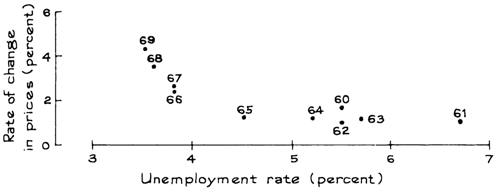

_Đáp án cho các bài tập này nằm ở trang A59._ 

#### 6. BÀI TẬP ÔN TẬP 

_Các bài tập ôn tập có thể bao gồm nội dung từ những chương trước._ 

1. Khi nghiên cứu một biến số (variable), bạn có thể sử dụng một loại biểu đồ được gọi là . Khi nghiên cứu mối quan hệ giữa hai biến số, bạn có thể sử dụng một loại biểu đồ được gọi là . 

2. Đúng hay sai, và giải thích ngắn gọn: 

   - (a) Nếu hệ số tương quan (correlation coefficient) là −0.80, các giá trị dưới mức trung bình của biến phụ thuộc (dependent variable) có liên quan đến các giá trị dưới mức trung bình của biến độc lập (independent variable). 

   - (b) Nếu _y_ thường nhỏ hơn _x_, hệ số tương quan giữa _x_ và _y_ sẽ mang giá trị âm. 

3. Trong mỗi trường hợp, hãy cho biết hệ số tương quan nào cao hơn và giải thích ngắn gọn. (Dữ liệu được lấy từ một nghiên cứu theo chiều dọc về sự phát triển.) 

   - (a) Chiều cao lúc 4 tuổi và chiều cao lúc 18 tuổi, chiều cao lúc 16 tuổi và chiều cao lúc 18 tuổi. 

   - (b) Chiều cao lúc 4 tuổi và chiều cao lúc 18 tuổi, cân nặng lúc 4 tuổi và cân nặng lúc 18 tuổi. 

   - (c) Chiều cao và cân nặng lúc 4 tuổi, chiều cao và cân nặng lúc 18 tuổi. 

4. Một nhà nghiên cứu đã thu thập dữ liệu về chiều cao và cân nặng của sinh viên đại học; kết quả có thể được tóm tắt như sau. 

|_T_|_rung bình_|_SD_|
|---|---|---|
|Chiều cao nam giới 70|inch|3 inch|
|Cân nặng nam giới 144|pound|21 pound|
|Chiều cao nữ giới 64|inch|3 inch|
|Cân nặng nữ giới 120|pound|21 pound|

Hệ số tương quan giữa chiều cao và cân nặng của nam giới là khoảng 0.60; đối với nữ giới cũng ở mức tương tự. Nếu bạn gộp chung cả nam và nữ, hệ số tương quan giữa chiều cao và cân nặng sẽ là . 

gần khoảng 0.60 thấp hơn một chút cao hơn một chút Hãy chọn một đáp án và giải thích ngắn gọn. 

5. Có một con số bị thiếu trong mỗi tập dữ liệu dưới đây. Nếu có thể, hãy điền vào chỗ trống để làm cho _r_ bằng 1. Nếu không thể, hãy giải thích lý do tại sao. 

|(a)|(|b)|
|---|---|---|
|_x_ _y_|_x_|_y_|
|1 1|1|1|
|2 3|2|3|
|2 3|3|4|
|4 –|4|–|

6. Một chương trình máy tính in ra giá trị _r_ cho hai tập dữ liệu được hiển thị dưới đây. Chương trình có đang hoạt động chính xác hay không? Trả lời có hoặc không, và giải thích ngắn gọn. 

||(i)|(ii)|
|---|---|---|
|_x_|_y_|_x_ _y_|
|1|2|1 5|
|2|1|2 4|
|3|4|3 7|
|4|3|4 6|
|5|7|5 10|
|6|5|6 8|
|7|6|7 9|
|_r_ =|0.8214|_r_ =0.7619|

7. Vào năm 1910, Hiram Johnson đã tham gia vào các cuộc bầu cử sơ bộ cho chức thống đốc bang California. Đối với mỗi quận, dữ liệu có sẵn cho thấy tỷ lệ người Mỹ bản địa (native-born Americans) trong quận đó, cũng như tỷ lệ phần trăm số phiếu bầu cho Johnson. Một 

BÀI TẬP ÔN TẬP 

nhà khoa học chính trị đã tính toán hệ số tương quan giữa các tỷ lệ phần trăm này.11 Giá trị thu được là 0.5. Liệu đây có phải là một thước đo công bằng về mức độ mà "Johnson nhận được sự ủng hộ từ người bản địa, trái ngược với người nhập cư" hay không? Hãy trả lời có hoặc không, và giải thích ngắn gọn. 

8. Đối với phụ nữ từ 25 tuổi trở lên tại Hoa Kỳ vào năm 2005, mối quan hệ giữa độ tuổi và trình độ học vấn (số năm đi học đã hoàn thành) có thể được tóm tắt như sau:12 

độ tuổi trung bình ≈ 50 tuổi, SD ≈ 16 tuổi trình độ học vấn trung bình ≈ 13.2 năm, SD ≈ 3.0 năm, _r_ ≈ −0.20 

Đúng hay sai, và giải thích: khi bạn càng lớn tuổi, bạn càng ít được giáo dục (trình độ học vấn thấp hơn). Nếu phát biểu này là sai, điều gì giải thích cho mối tương quan âm (negative correlation) này? 

9. Tại Đại học California, Berkeley, môn Thống kê 2 (Statistics 2) là một khóa học lý thuyết quy mô lớn với các phần thảo luận nhỏ do các trợ giảng (teaching assistants) hướng dẫn. Là một phần của một cuộc nghiên cứu, tại bài giảng áp chót của một học kỳ, các sinh viên được yêu cầu điền vào các bảng câu hỏi ẩn danh để đánh giá mức độ hiệu quả của các trợ giảng (theo tên), và của khóa học, dựa trên thang điểm 

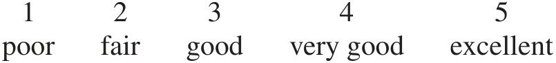

Các số liệu thống kê sau đây đã được tính toán. 

- Đánh giá trung bình dành cho trợ giảng bởi các sinh viên trong từng nhóm (section). 

- Đánh giá trung bình về khóa học bởi các sinh viên trong từng nhóm. 

- Điểm trung bình của bài thi cuối kỳ của các sinh viên trong từng nhóm. 

Kết quả được hiển thị dưới đây (các nhóm được xác định bằng chữ cái). Hãy vẽ một biểu đồ phân tán (scatter diagram) cho mỗi cặp biến số—có tất cả ba cặp—và tìm các hệ số tương quan. 

|_Nhóm_|_Đánh giá TB_ _dành cho trợ giảng_|_Đánh giá TB_ _về khóa học_|_Điểm TB_ _bài thi cuối kỳ_|
|---|---|---|---|
|A|3.3|3.5|70|
|B|2.9|3.2|64|
|C|4.1|3.1|47|
|D|3.3|3.3|63|
|E|2.7|2.8|69|
|F|3.4|3.5|69|
|G|2.8|3.6|69|
|H|2.1|2.8|63|
|I|3.7|2.8|53|
|J|3.2|3.3|65|
|K|2.4|3.3|64|

Dữ liệu trên là điểm trung bình của các nhóm. Vì các bảng câu hỏi là ẩn danh, nên không thể liên kết đánh giá của từng sinh viên với điểm số cá nhân của họ. Năng lực của sinh viên có thể là một yếu tố gây nhiễu (confounding factor). Tuy nhiên, việc kiểm soát các kết quả thi trước đó (pretest results) hóa ra không tạo ra sự khác biệt nào trong phân tích.13 Mỗi trợ giảng dạy một nhóm. Đúng hay sai, và giải thích: 

   - (a) Tính trung bình, những nhóm thích trợ giảng (TA) của họ hơn thì làm bài thi cuối kỳ tốt hơn. 

   - (b) Hầu như không có mối quan hệ nào giữa điểm đánh giá trung bình của nhóm dành cho trợ giảng và điểm đánh giá trung bình của nhóm về khóa học. 

   - (c) Hầu như không có mối quan hệ nào giữa điểm đánh giá trung bình của nhóm về khóa học và điểm số trung bình bài thi cuối kỳ của nhóm. 

10. Trong một nghiên cứu về điểm thi Toán SAT năm 2005, Viện Khảo thí Giáo dục (Educational Testing Service) đã tính toán điểm trung bình cho mỗi bang trong số 51 bang, và tỷ lệ phần trăm học sinh cuối cấp trung học phổ thông ở bang đó đã tham gia bài thi.14 (Trong trường hợp này, thủ đô D.C. được tính như một bang.) Hệ số tương quan giữa hai biến số này là −0.84. 

   - (a) Đúng hay sai: điểm thi có xu hướng thấp hơn ở những bang có tỷ lệ học sinh tham gia kỳ thi cao hơn. Nếu đúng, bạn giải thích điều này như thế nào? Nếu sai, điều gì giải thích cho mối tương quan âm này? 

   - (b) Ở bang Connecticut, điểm trung bình chỉ là 517. Nhưng ở bang Iowa, mức trung bình là 608. Đúng hay sai, và giải thích: dữ liệu cho thấy tính trung bình, các trường học ở Iowa đang làm tốt công việc giảng dạy toán học hơn so với các trường ở Connecticut. 

11. Nằm trong một phần của nghiên cứu được mô tả ở bài tập 10, Viện Khảo thí Giáo dục đã tính toán điểm SAT Đọc hiểu (Verbal SAT) trung bình cho mỗi bang, cũng như điểm SAT Toán trung bình cho mỗi bang. (Một lần nữa, D.C. được tính là một bang.) Hệ số tương quan giữa 51 cặp giá trị trung bình này là 0.97. Liệu hệ số tương quan giữa điểm SAT Toán và SAT Đọc hiểu—được tính toán từ dữ liệu của tất cả các cá nhân đã tham gia kỳ thi—sẽ lớn hơn 0.97, xấp xỉ 0.97, hay nhỏ hơn 0.97? Hãy giải thích ngắn gọn. 

12. Dưới đây là biểu đồ phân tán (scatter diagram) thể hiện trình độ học vấn (số năm đi học đã hoàn thành) của các người chồng và người vợ ở bang South Carolina, trích từ Khảo sát Dân số Hiện tại (Current Population Survey) tháng 3 năm 2005. 

   - (a) Các điểm tạo thành các dải kẻ dọc và kẻ ngang. Tại sao? 

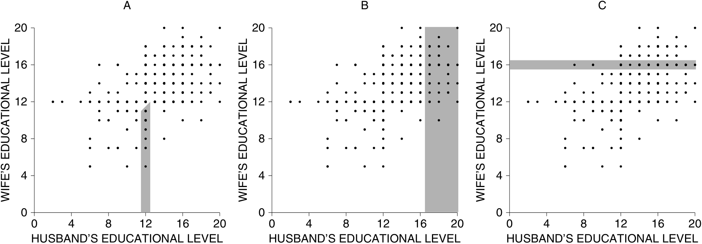

- (b) Có 530 cặp vợ chồng trong mẫu, và mỗi cặp được đại diện bởi một dấu chấm. Nhưng nếu bạn đếm, thì chỉ có 104 dấu chấm trên biểu đồ phân tán. Làm sao điều này có thể xảy ra? Hãy giải thích ngắn gọn. 

- (c) Có ba vùng được bôi đen (tô bóng). Hãy ghép nối từng vùng với mô tả tương ứng. (Sẽ có một mô tả bị dư ra.) 

   - (i) Người vợ đã hoàn thành 16 năm đi học. 

   - (ii) Người vợ đã hoàn thành nhiều năm đi học hơn người chồng. 

   - (iii) Người chồng đã hoàn thành hơn 16 năm đi học. 

   - (iv) Người chồng đã hoàn thành 12 năm đi học và người vợ hoàn thành ít số năm đi học hơn so với người chồng. 

#### 7. TÓM TẮT 

1. Hệ số tương quan là một con số thuần túy (pure number), không có đơn vị. Nó không bị ảnh hưởng bởi: 

- việc hoán đổi hai biến số với nhau, 

- việc cộng cùng một hằng số vào tất cả các giá trị của một biến, 

- việc nhân tất cả các giá trị của một biến với cùng một số dương. 

2. Hệ số tương quan đo lường mức độ tập trung (clustering) của các điểm xung quanh một đường thẳng, tương đối so với các độ lệch chuẩn (SDs). 

3. Hệ số tương quan có thể gây hiểu nhầm khi có sự xuất hiện của các giá trị ngoại lai (outliers) hoặc các mối quan hệ phi tuyến tính (non-linear association). Bất cứ khi nào có thể, hãy quan sát biểu đồ phân tán để kiểm tra các vấn đề này. 

4. Các hệ số tương quan _sinh thái_ (ecological correlations) — vốn dựa trên các tỷ lệ hoặc mức trung bình — thường có xu hướng phóng đại mức độ mạnh mẽ của mối tương quan đối với các cá thể. 

5. Tương quan đo lường sự liên kết (association). Nhưng sự liên kết không nhất thiết thể hiện quan hệ nhân quả (causation). Nó có thể chỉ đơn thuần cho thấy rằng cả hai biến số đều đang đồng thời chịu tác động từ một biến số thứ ba nào đó. 

